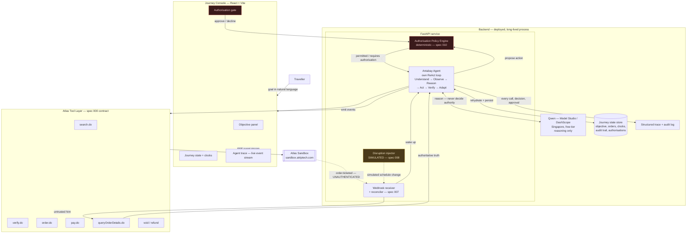
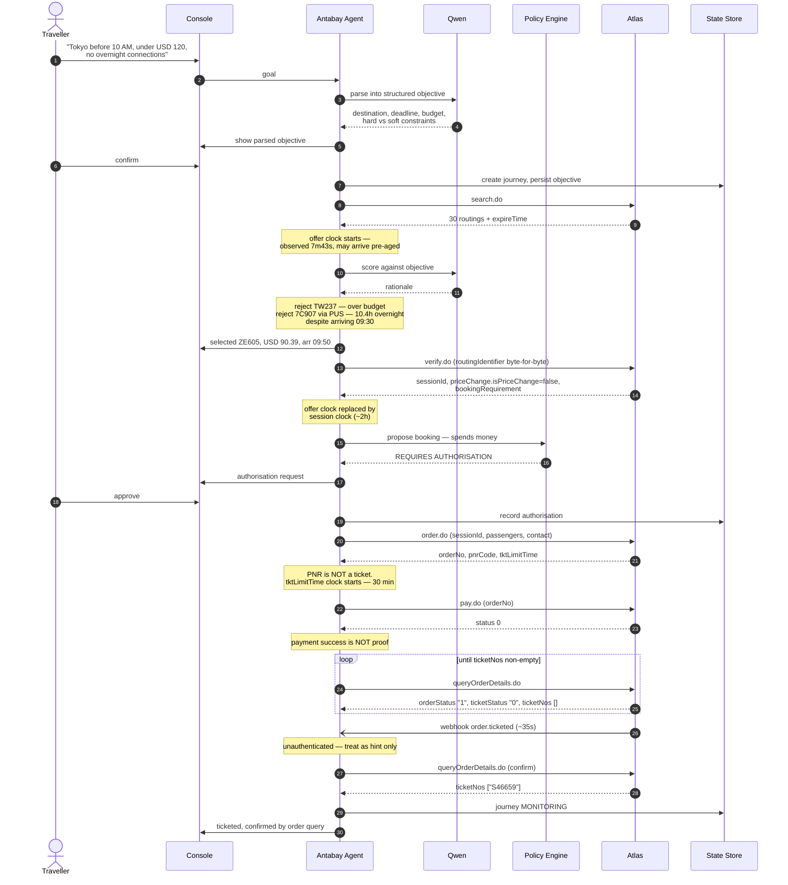
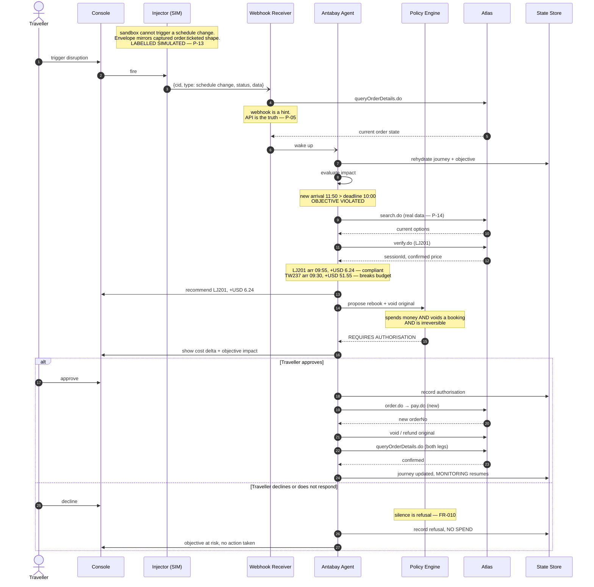
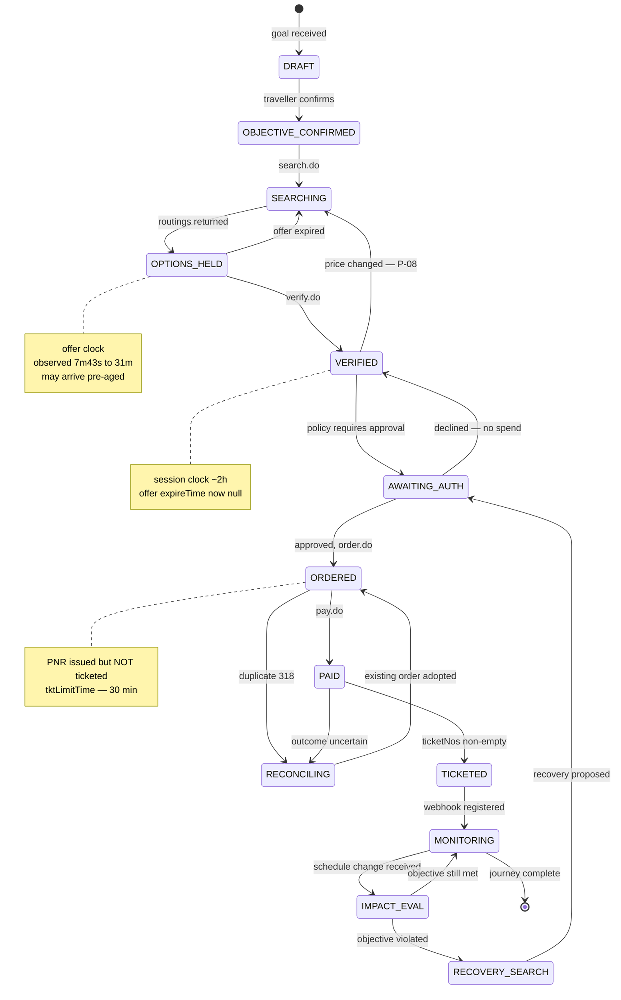
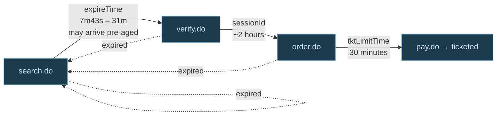

# Antabay — Architecture & Sequence Diagrams

**Revised 19 August 2026** after the kickoff workshop.

All diagrams reflect the **verified** Atlas contract. Endpoint names, event
names, error codes, and clocks are observed, not assumed. See
`.antabay/atlas-capability-map.md`.

**What changed at kickoff:** Alibaba Cloud is not providing hosting or LLM
API access — participants use their own resources. There is no restriction
on agent framework or spec-driven tooling. AgentScope has therefore been
dropped in favour of a plain FastAPI service with our own ReAct loop: the
only reason to carry framework risk was the "why Alibaba" argument, and
that argument no longer applies. Qwen on Model Studio's free tier is kept
by choice, not obligation.

---

## 1. System architecture

**Four rules the diagram enforces**

1. Qwen reasons. The policy engine decides authority. The line never crosses.
2. Journey state lives outside the agent. Every wake-up rehydrates.
3. Webhooks are untrusted hints. `queryOrderDetails.do` is the truth.
4. Every travel fact shown to the traveller traces to an Atlas response.

---

## 2. Happy path — goal to ticketed

---

## 3. Disruption and recovery

---

## 4. Journey state machine

---

## 5. The three clocks

Each expiry sends the journey back to search. All three are tracked in
state and displayed in the console with time remaining.
