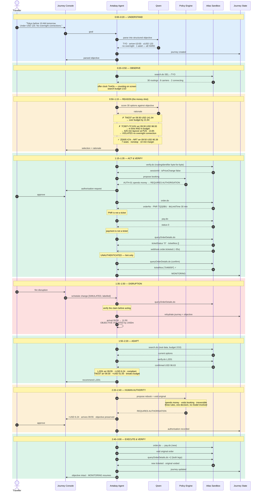
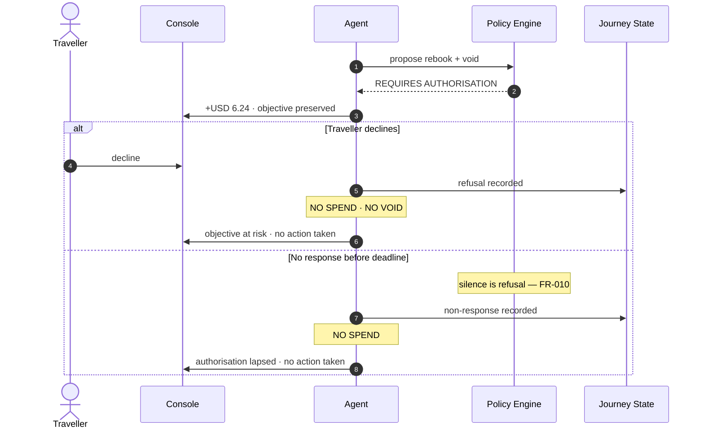

# Antabay — Demo Scenario Sequence

Every value below is from a verified Atlas sandbox response.
Route SEL→TYO, 2026-09-05. See `.antabay/atlas-capability-map.md`.

---

## The full run, with video timings

---

## The refusal path — critical journey 4

Must be built and tested. Worth showing if there is room.

---

## Three beats that carry the score

**0:50 — the rejection.** An option arriving 09:30 for USD 98.93 passes
arrival and passes budget. Antabay refuses it: 625 minutes in Busan, 13.6
hours door to door. Say it aloud — *"it arrives in time and it's in
budget, and it's still wrong."* This is the clearest proof that reasoning
is happening rather than sorting.
→ Agent Technology (0–6), AI Multiplier

**1:32 — the webhook.** Atlas says the ticket is issued. Antabay queries
Atlas anyway. *"This webhook is unauthenticated — anyone who knows the URL
could send it. The event says look again. The API says what's true."*
→ Compliance & Safety, Agent Technology

**2:20 — the gate.** Three rules fire at once: spends money, voids a
booking, irreversible. Execution stops. *"A rule decides that, not the
model."*
→ Compliance & Safety, Agent Technology

Everything else is plumbing. Necessary, but these three are what gets
remembered.

---

# Narration script — 3:00

Paste into Descript, DemoPolish, or read it yourself. Timings are targets,
not constraints; the words matter more than hitting the second.

**Delivery.** Flat and factual. This is an engineer showing you a system,
not an advert. Let the screen carry the drama — the trace, the clocks, the
gate. Pause where marked; silence over a rejection scrolling past is worth
more than filling it.

**Word count 415.** At a measured 145 wpm that is about 2:52, leaving
eight seconds of air. Do not speed up to fit more in.

---

### 0:00 — 0:20 · Understand

> Everyone can search flights.
>
> Antabay is judged on what happens *after* the booking.
>
> You give it an objective, not an itinerary.

*[goal appears on screen]*

> "Tokyo, before ten. Under a hundred and twenty dollars. No overnight
> connections."
>
> Five hard constraints. Qwen parses them. From here, everything is
> measured against this — not against the flight.

---

### 0:20 — 0:50 · Observe

> Antabay searches Atlas. Thirty real options, eight carriers, sandbox
> environment — these are test transactions, not real bookings.
>
> Note the clock. This offer expires in seven minutes and forty-three
> seconds, and it was already partly aged when it arrived. That's not a
> detail. It's why the agent has to re-verify before it commits to
> anything.

---

### 0:50 — 1:15 · Reason — *the moment*

> Now watch the rejections.
>
> T-way two-three-seven arrives at nine-thirty. Over budget. Out.

*[pause]*

> And this one. Jeju, via Busan. Arrives nine-thirty. Ninety-eight
> dollars. It passes the arrival check. It passes the budget check.
>
> Antabay rejects it.

*[pause — let the reason render]*

> Six hundred and twenty-five minutes on the ground in Busan. Thirteen and
> a half hours, departing the night before.
>
> It arrives in time, it's within budget, and it's still wrong. An agent
> that sorts by price and arrival books this. An agent that reasons doesn't.
>
> It picks Eastar six-oh-five. Ninety dollars thirty-nine. Arrives
> nine-fifty. Ten minutes of margin.

---

### 1:15 — 1:35 · Act and verify

> Verify. Order. Pay.
>
> Payment succeeds — and Antabay does not call that a ticket. Neither is
> the PNR.
>
> It queries Atlas independently. Ticket numbers present. *Now* it's
> booked.

---

### 1:35 — 1:50 · Disruption

> Three hours later, a schedule change.
>
> This event is simulated and labelled as such — the sandbox has no way to
> trigger one. The envelope is copied from a real Atlas webhook we
> captured. Every flight you'll see from here is live sandbox data.
>
> And the webhook is unauthenticated. Anyone who knew the URL could send
> it. So Antabay doesn't believe it — it asks Atlas.
>
> The event says look again. The API says what's true.

---

### 1:50 — 2:20 · Adapt

> Confirmed. Arrival moves to eleven-fifty.
>
> The objective is violated by one hour fifty. Not "the flight is late" —
> the meeting is now unreachable.
>
> Antabay re-searches, verifies, and finds Jin Air two-oh-one. Arrives
> nine-fifty-five. Six dollars and twenty-four cents more.
>
> There's a faster option, but it breaks the stated budget. It says so
> rather than quietly choosing.

---

### 2:20 — 2:40 · Authority

> And here it stops.
>
> Spends money. Voids a booking. Irreversible. Three rules fire, and a
> rule decides this — not the model. Nothing the language model produces
> can talk its way past this gate.
>
> Six dollars twenty-four to save the meeting.

*[approve — cut to phone]*

> Same journey on the traveller's phone. One tap.

---

### 2:40 — 3:00 · Close

> Booked, verified, monitoring resumes.
>
> Full-service airlines rebook you when things break. Low-cost carriers
> don't — no interline, no duty of care. Atlas reaches a hundred and forty
> of them.
>
> That's who Antabay is for.
>
> You have a destination. Antabay watches over the journey.

---

## Shot list

| # | Source | Length | Note |
|---|---|---|---|
| 1 | Playwright console capture, 1440×900 | ~2:30 | `slowMo: 400`, explicit waits at the three beats |
| 2 | Playwright phone capture, 390×844 | ~0:15 | same journey, traveller route |
| 3 | Repo — specs, commits, wiki | ~0:10 | optional, for Use of Qoder |

**Text callouts on screen** — three only, matching the beats:

- `IN TIME · IN BUDGET · REJECTED` over the Busan rejection
- `UNAUTHENTICATED — VERIFYING` over the webhook
- `AUTH-01 · AUTH-02 · AUTH-03` over the gate

**Do not** add background music under the rejection or the gate. Silence
reads as confidence.

**Editing order if you run short of time:** trim 0:20–0:50 first, then
1:15–1:35. Never trim 0:50–1:15 or 2:20–2:40 — those two carry Agent
Technology, the largest single sub-dimension.
