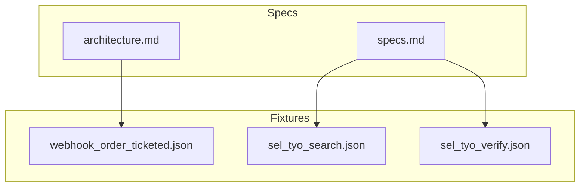
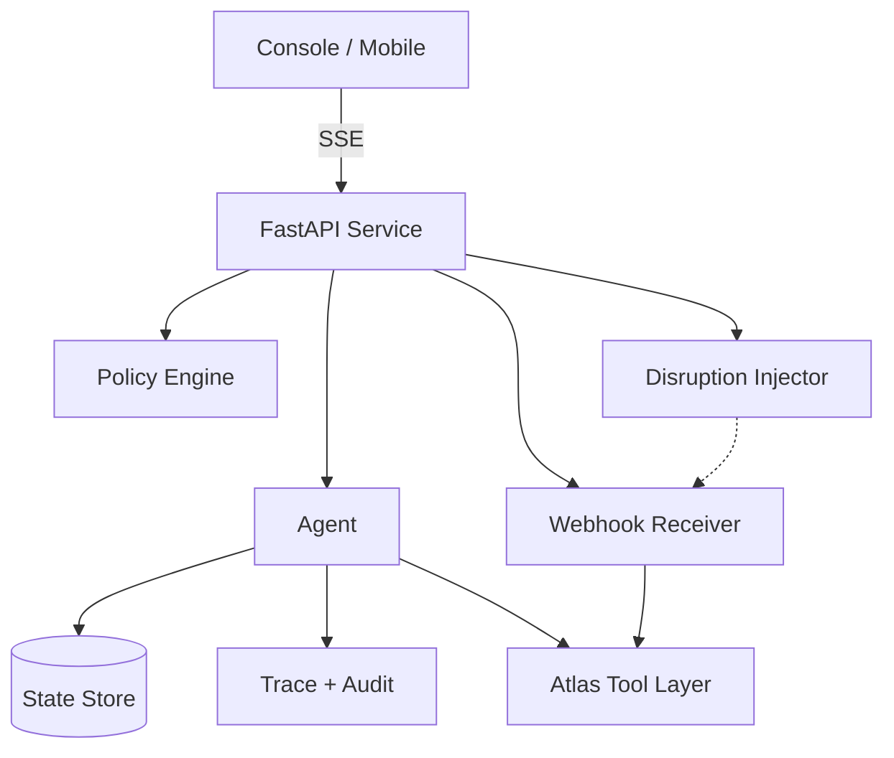
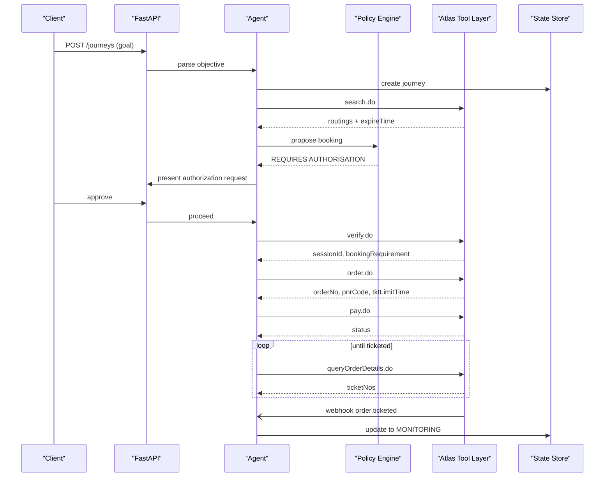
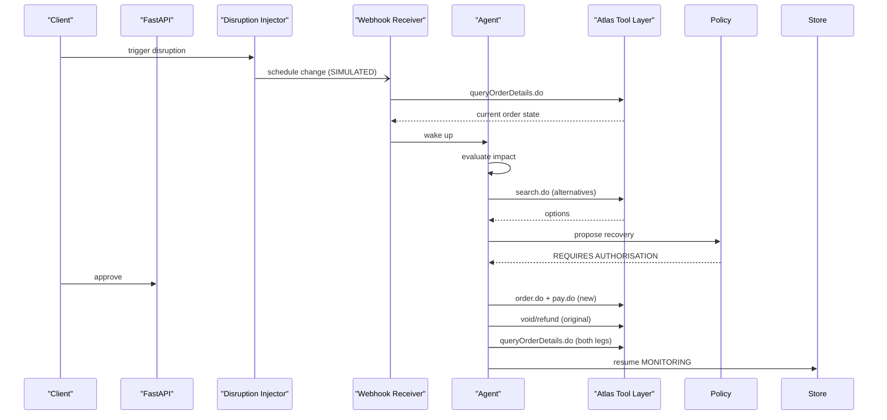
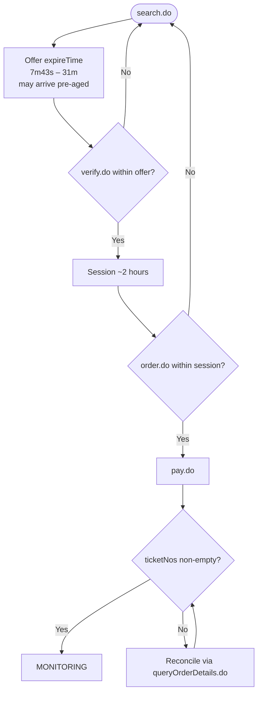
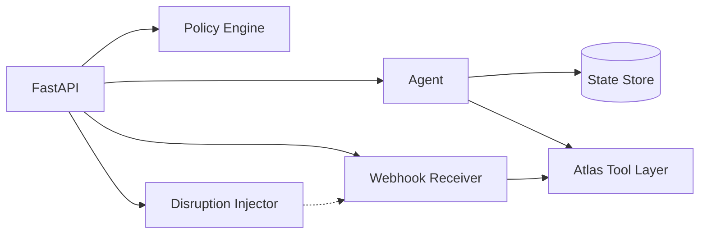

# API Reference

<cite>
**Referenced Files in This Document**
- [architecture.md](file://.antabay/architecture.md)
- [specs.md](file://.antabay/specs.md)
- [webhook_order_ticketed.json](file://fixtures/atlas/webhook_order_ticketed.json)
- [sel_tyo_search.json](file://fixtures/atlas/sel_tyo_search.json)
- [sel_tyo_verify.json](file://fixtures/atlas/sel_tyo_verify.json)
</cite>

## Table of Contents
1. [Introduction](#introduction)
2. [Project Structure](#project-structure)
3. [Core Components](#core-components)
4. [Architecture Overview](#architecture-overview)
5. [Detailed Component Analysis](#detailed-component-analysis)
6. [Dependency Analysis](#dependency-analysis)
7. [Performance Considerations](#performance-considerations)
8. [Troubleshooting Guide](#troubleshooting-guide)
9. [Conclusion](#conclusion)
10. [Appendices](#appendices)

## Introduction
This document provides a comprehensive API reference for Antabay’s public interfaces as defined by the project specifications and verified Atlas contract. It covers:
- REST endpoints used to manage journeys, authorize actions, and monitor status
- Real-time event streaming via Server-Sent Events (SSE) for agent trace and journey updates
- Webhook endpoints for receiving untrusted notifications from the travel provider
- Authentication, rate limiting, versioning, and compatibility notes
- Client implementation guidelines, examples grounded in provided fixtures, and performance tips
- Security considerations, monitoring, debugging, and migration guidance

The system is implemented as a FastAPI service that orchestrates an internal ReAct agent, a deterministic policy engine, a webhook receiver/reconciler, and optional disruption injection. The external travel provider is accessed through the Atlas Tool Layer.

**Section sources**
- [architecture.md:19-78](file://.antabay/architecture.md#L19-L78)
- [specs.md:273-299](file://.antabay/specs.md#L273-L299)

## Project Structure
At a high level, the repository contains:
- Specification and architecture documents defining contracts, flows, and state machines
- Fixtures capturing real Atlas sandbox responses used for tests and examples
- No application source code in this snapshot; the API surface is specified and validated against the Atlas capability map

**Diagram sources**
- [architecture.md:19-78](file://.antabay/architecture.md#L19-L78)
- [specs.md:103-135](file://.antabay/specs.md#L103-L135)

**Section sources**
- [architecture.md:19-78](file://.antabay/architecture.md#L19-L78)
- [specs.md:103-135](file://.antabay/specs.md#L103-L135)

## Core Components
Antabay exposes three primary integration surfaces:
- REST APIs for journey management, authorization requests, and status monitoring
- SSE streams for live agent trace and journey events
- Webhooks for receiving untrusted notifications from the travel provider

Key responsibilities:
- Journey lifecycle: draft → objective confirmed → searching → options held → verified → awaiting authorization → ordered → paid → ticketed → monitoring → complete
- Authorization policy: deterministic decisions on whether actions require human approval
- Event reconciliation: webhooks are hints; authoritative truth comes from querying the provider
- Real-time observability: SSE stream powers the console and mobile views

**Section sources**
- [architecture.md:19-78](file://.antabay/architecture.md#L19-L78)
- [specs.md:212-257](file://.antabay/specs.md#L212-L257)

## Architecture Overview
The backend is a long-lived FastAPI process with these subsystems:
- Agent: runs a ReAct loop (Understand → Observe → Reason → Act → Verify → Adapt)
- Policy Engine: deterministic authorization decisions
- Webhook Receiver + Reconciler: receives untrusted events, verifies them, and wakes the agent
- Disruption Injector: simulated events for testing/demonstration
- State Store: durable journey state, objectives, orders, clocks, audit trail, authorizations
- Structured Trace + Audit Log: every call, decision, and approval recorded
- Atlas Tool Layer: search.do, verify.do, order.do, pay.do, queryOrderDetails.do, void/refund

**Diagram sources**
- [architecture.md:19-78](file://.antabay/architecture.md#L19-L78)

**Section sources**
- [architecture.md:19-78](file://.antabay/architecture.md#L19-L78)

## Detailed Component Analysis

### REST APIs

#### Journey Management
- Purpose: Create, confirm, and drive a journey from natural language goal to ticketed outcome
- Methods and patterns:
  - POST /journeys — create a new journey from a stated goal
  - PATCH /journeys/{id}/objective — confirm or refine parsed objective
  - GET /journeys/{id} — read current state, objective, identifiers, clocks
  - DELETE /journeys/{id} — cancel or abandon a journey before commitment
- Request/response schema highlights:
  - Input includes origin, destination, deadline, budget, preferences
  - Output includes journey id, state, structured objective, held identifiers with expiry times
- Authentication: Not explicitly documented here; follow environment-based configuration and secure deployment practices
- Rate limiting: Respect provider rate limits; honor wait instructions returned by provider
- Versioning: Use explicit version header or path if introduced later; maintain backward compatibility per spec

**Section sources**
- [specs.md:429-531](file://.antabay/specs.md#L429-L531)
- [specs.md:212-257](file://.antabay/specs.md#L212-L257)

#### Authorization Requests
- Purpose: Present human authorization prompts when policy requires approval
- Methods and patterns:
  - POST /journeys/{id}/authorizations — propose action requiring approval
  - PATCH /journeys/{id}/authorizations/{authId} — approve or refuse
  - GET /journeys/{id}/authorizations — list outstanding and resolved authorizations
- Request/response schema highlights:
  - Action description, cost delta vs current position, effect on objective
  - Decision outcomes include rule identifier and timestamp
- Authentication: Secure endpoint for operator/traveler interaction
- Retry behavior: Silence is refusal; do not auto-retry without explicit re-prompt
- Versioning: Stable fields; extend with additive changes only

**Section sources**
- [specs.md:1272-1366](file://.antabay/specs.md#L1272-L1366)

#### Status Monitoring
- Purpose: Provide current journey status, audit trail, and provenance
- Methods and patterns:
  - GET /journeys/{id}/status — returns state machine position, clocks, active identifiers
  - GET /journeys/{id}/audit — append-only history of calls, decisions, authorizations
  - GET /journeys/{id}/events — historical event log for replay
- Response schema highlights:
  - Current state, remaining time on offer/session/ticketing clocks
  - External identifiers preserved verbatim
  - Provenance: environment, reasoning model, simulation flags
- Authentication: Read access scoped to journey context
- Versioning: Backward compatible additions; never remove fields without deprecation

**Section sources**
- [specs.md:798-919](file://.antabay/specs.md#L798-L919)
- [specs.md:1173-1244](file://.antabay/specs.md#L1173-L1244)

### SSE (Server-Sent Events)

#### Connection Handling
- Endpoint pattern: GET /journeys/{id}/stream
- Protocol: SSE with JSON messages
- Lifecycle:
  - Client connects to the SSE endpoint for a specific journey
  - Server emits events as they occur: external calls, decisions, authorizations, state transitions
  - Client should handle reconnects and deduplicate events using event IDs or timestamps
- Message format:
  - type: event category (e.g., search, verify, order, payment, policy, webhook, state)
  - payload: typed data relevant to the event
  - meta: journey id, timestamp, clock info, provenance
- Error handling:
  - On transient errors, server may close connection; client retries with exponential backoff
  - For terminal errors, message indicates failure reason and next steps

**Section sources**
- [specs.md:798-919](file://.antabay/specs.md#L798-L919)
- [architecture.md:55-73](file://.antabay/architecture.md#L55-L73)

#### Event Types and Real-Time Patterns
- Event categories:
  - Search: options returned, expireTime, scarcity signals
  - Verify: sessionId, priceChange indicator, bookingRequirement
  - Order/Payment: orderNo, pnrCode, tktLimitTime, status transitions
  - Policy: REQUIRES AUTHORISATION with rule id
  - Webhook: received hint, reconciled truth
  - State: journey state transitions, clock expirations
- Real-time interaction:
  - Console renders events uniformly except for three emphasized classes: option rejection, objective violation, authorization request
  - Mobile view presents plain-language status and authorization prompts

**Section sources**
- [specs.md:798-919](file://.antabay/specs.md#L798-L919)
- [specs.md:1835-1943](file://.antabay/specs.md#L1835-L1943)

### Webhooks

#### Endpoint and Payload
- Endpoint: POST /atlas (provider-originated or simulated)
- Payload structure (from fixture):
  - cid: client identifier
  - data: order details including orderNo, orderStatus, passenger/ticket info
  - status: provider status code
  - type: event type (e.g., order.ticketed)
- Headers: standard HTTP headers; content-type application/json
- Acknowledgement: Immediate acknowledgment upon receipt; processing continues asynchronously

**Section sources**
- [webhook_order_ticketed.json:1-53](file://fixtures/atlas/webhook_order_ticketed.json#L1-L53)
- [specs.md:1396-1504](file://.antabay/specs.md#L1396-L1504)

#### Event Types, Authentication, and Reliability
- Event types:
  - schedule change (simulated or provider-originated)
  - order.ticketed (ticket issuance confirmation)
- Authentication: Channel is unauthenticated; treat all webhooks as untrusted hints
- Delivery guarantees: Not guaranteed; implement periodic reconciliation independent of webhooks
- Duplicate handling: Tolerate duplicates without duplicating actions
- Normalization: Normalize field types that differ between notifications and query interface

**Section sources**
- [specs.md:1396-1504](file://.antabay/specs.md#L1396-L1504)

#### Retry Mechanisms and Error Handling
- Retry strategy:
  - Provider may retry delivery; ensure idempotent processing keyed by orderNo and event type
  - If verification fails, persist raw payload and continue; do not block acknowledgment
- Error handling:
  - Unknown event types: log and discard safely
  - Mismatched order references: discard after logging
  - Verification failures: reconcile by querying provider; do not trust notification status alone

**Section sources**
- [specs.md:1396-1504](file://.antabay/specs.md#L1396-L1504)

### Atlas Tool Layer Integration

#### Endpoints and Contracts
- search.do: Retrieve travel options with expireTime and scarcity indicators
- verify.do: Confirm pricing and availability; returns sessionId and bookingRequirement
- order.do: Create order; returns orderNo, pnrCode, tktLimitTime
- pay.do: Submit payment; does not guarantee ticketing
- queryOrderDetails.do: Authoritative truth for order status and ticketNos
- void/refund: Cancel or refund bookings; requires authorization

**Section sources**
- [architecture.md:44-73](file://.antabay/architecture.md#L44-L73)
- [specs.md:565-646](file://.antabay/specs.md#L565-L646)
- [specs.md:1059-1169](file://.antabay/specs.md#L1059-L1169)

#### Data Models and Examples
- Search response includes routings with pricing, segments, rules, ancillaries, refresh/expire times
- Verify response includes sessionId, routing, bookingRequirement, priceChange indicator
- Webhook payload includes order details and ticket numbers upon ticketing

**Section sources**
- [sel_tyo_search.json:1-800](file://fixtures/atlas/sel_tyo_search.json#L1-L800)
- [sel_tyo_verify.json:1-393](file://fixtures/atlas/sel_tyo_verify.json#L1-L393)
- [webhook_order_ticketed.json:1-53](file://fixtures/atlas/webhook_order_ticketed.json#L1-L53)

### Sequence Diagrams

#### Happy Path: Goal to Ticketed

**Diagram sources**
- [architecture.md:89-148](file://.antabay/architecture.md#L89-L148)
- [specs.md:1059-1169](file://.antabay/specs.md#L1059-L1169)

#### Disruption and Recovery

**Diagram sources**
- [architecture.md:152-208](file://.antabay/architecture.md#L152-L208)
- [specs.md:1610-1690](file://.antabay/specs.md#L1610-L1690)

### Flowcharts

#### Offer and Session Clocks

**Diagram sources**
- [architecture.md:261-279](file://.antabay/architecture.md#L261-L279)
- [specs.md:949-1030](file://.antabay/specs.md#L949-L1030)

## Dependency Analysis
Component relationships and coupling:
- FastAPI service depends on Agent, Policy Engine, Webhook Receiver, and optional Disruption Injector
- Agent depends on Atlas Tool Layer and State Store; emits events to SSE
- Webhook Receiver depends on Atlas Tool Layer for reconciliation; triggers Agent wake-ups
- Policy Engine is isolated and deterministic; no LLM involvement
- All external identifiers are preserved verbatim; no construction or alteration

**Diagram sources**
- [architecture.md:19-78](file://.antabay/architecture.md#L19-L78)

**Section sources**
- [architecture.md:19-78](file://.antabay/architecture.md#L19-L78)

## Performance Considerations
- Respect provider rate limits and honor wait instructions; avoid retry storms
- Prefer earlier re-verification near expiry rather than at exact expiry
- Use SSE for real-time updates to reduce polling overhead
- Persist full responses for audit and fixtures; minimize runtime parsing costs
- Keep event stream lightweight; separate console and mobile views by density
- Track call budgets per journey to prevent excessive external calls

[No sources needed since this section provides general guidance]

## Troubleshooting Guide
Common issues and strategies:
- Stale offers: Re-verify before committing; check expireTime and session validity
- Duplicate orders: Detect duplicate rejection, adopt existing order reference, resume from actual state
- Uncertain outcomes: Never repeat actions; reconcile by querying provider
- Webhook misdelivery: Treat as untrusted; verify via queryOrderDetails.do; tolerate duplicates
- Objective violations: Evaluate impact; search alternatives; present cost delta and recommendation
- Authorization delays: Silence is refusal; do not auto-proceed; record non-response

**Section sources**
- [specs.md:1059-1169](file://.antabay/specs.md#L1059-L1169)
- [specs.md:1173-1244](file://.antabay/specs.md#L1173-L1244)
- [specs.md:1396-1504](file://.antabay/specs.md#L1396-L1504)

## Conclusion
Antabay’s API surface centers on reliable journey orchestration, deterministic authorization, and robust event-driven recovery. The design enforces strict separation between reasoning and authority, treats webhooks as hints, and prioritizes independently verified outcomes. Clients should implement resilient SSE consumers, idempotent webhook processors, and careful clock management to align with the system’s guarantees.

[No sources needed since this section summarizes without analyzing specific files]

## Appendices

### Security Considerations
- Webhook channel is unauthenticated; always reconcile with provider queries
- Authorization decisions are deterministic and auditable; no LLM influence
- Preserve external identifiers verbatim; never construct or alter
- Enforce call budgets and rate limits; honor provider wait instructions

**Section sources**
- [specs.md:1396-1504](file://.antabay/specs.md#L1396-L1504)
- [specs.md:1272-1366](file://.antabay/specs.md#L1272-L1366)

### Rate Limiting and Versioning
- Rate limiting: Follow provider constraints; respect wait instructions; track per-journey budgets
- Versioning: Maintain backward compatibility; add fields incrementally; deprecate with notice
- Compatibility: Normalize types across interfaces; preserve identifiers; avoid breaking changes

**Section sources**
- [specs.md:303-398](file://.antabay/specs.md#L303-L398)

### Migration and Upgrade Notes
- Deprecation path: Announce changes; support dual versions during transition; migrate clients gradually
- Breaking changes: Avoid where possible; provide adapters or mapping layers
- Fixture-driven validation: Use captured fixtures to ensure compatibility across upgrades

**Section sources**
- [specs.md:303-398](file://.antabay/specs.md#L303-L398)

### Client Implementation Guidelines
- SSE consumer:
  - Connect to /journeys/{id}/stream
  - Handle reconnects with exponential backoff
  - Deduplicate events using IDs or timestamps
  - Render uniform events with emphasis on key classes
- Webhook processor:
  - Acknowledge immediately
  - Parse and normalize payload
  - Reconcile via queryOrderDetails.do before acting
  - Handle duplicates and unknown types gracefully
- REST clients:
  - Manage journey lifecycle states carefully
  - Respect authorization prompts and deadlines
  - Monitor status and audit trails for transparency

**Section sources**
- [specs.md:798-919](file://.antabay/specs.md#L798-L919)
- [specs.md:1396-1504](file://.antabay/specs.md#L1396-L1504)

### Monitoring and Debugging
- Structured trace and audit log capture every call, decision, and authorization
- Replay recorded event streams for demonstrations and tests
- Provenance footer shows environment, reasoning model, and simulation status
- Emphasize three critical visual cues: option rejection, objective violation, authorization request

**Section sources**
- [specs.md:798-919](file://.antabay/specs.md#L798-L919)