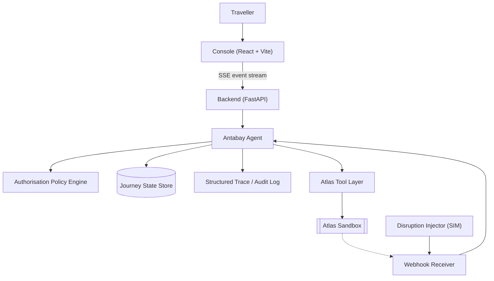
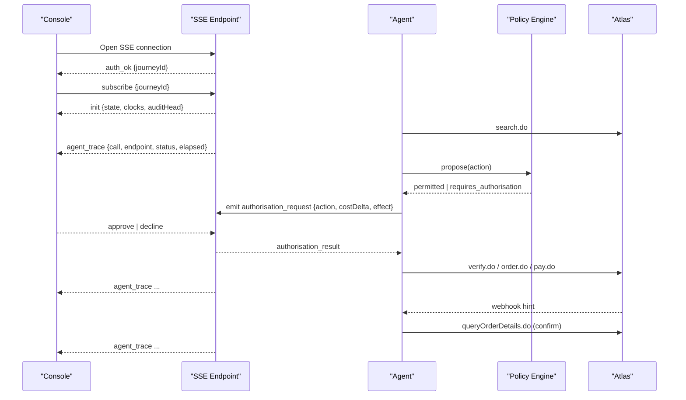
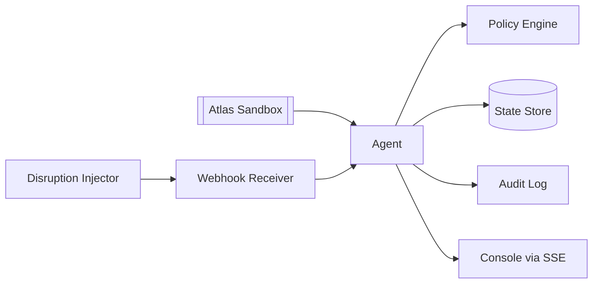

# Event Streaming

<cite>
**Referenced Files in This Document**
- [architecture.md](file://.antabay/architecture.md)
- [specs.md](file://.antabay/specs.md)
- [plan.md](file://.antabay/plan.md)
- [atlas-capability-map.md](file://.antabay/atlas-capability-map.md)
</cite>

## Table of Contents
1. Introduction
2. Project Structure
3. Core Components
4. Architecture Overview
5. Detailed Component Analysis
6. Dependency Analysis
7. Performance Considerations
8. Troubleshooting Guide
9. Conclusion

## Introduction
This document specifies the real-time event streaming design for Antabay’s journey console using Server-Sent Events (SSE). It covers connection establishment, authentication, stream initialization, all event types emitted during a journey, message formats and field definitions, client-side consumption patterns, reconnection and heartbeat strategies, performance considerations, and troubleshooting guidance. The design is grounded in the project’s architecture and specifications: the console consumes a live event stream from the backend agent, which orchestrates search, verification, booking, payment, monitoring, disruption handling, and authorisation flows.

## Project Structure
The system exposes a long-lived backend process that emits events to the React + Vite console via SSE. The agent coordinates with external tools (Atlas), an authorisation policy engine, a webhook receiver, and a disruption injector. The console renders objective, state rack, agent trace, expiry clocks, and the authorisation gate based solely on the event stream.

**Diagram sources**
- [architecture.md:19-78](file://.antabay/architecture.md#L19-L78)

**Section sources**
- [architecture.md:19-78](file://.antabay/architecture.md#L19-L78)
- [specs.md:798-800](file://.antabay/specs.md#L798-L800)

## Core Components
- Console (UI): Renders objective, state rack, agent trace, expiry clocks, and authorisation gate. Consumes a single SSE stream; holds no local state beyond rendering.
- Backend (FastAPI): Hosts the agent, policy engine, webhook receiver, and disruption injector. Emits SSE events as they occur.
- Agent: Executes the ReAct loop (Understand → Observe → Reason → Act → Verify → Adapt), persists state, and emits observable events for every call, decision, and authorisation outcome.
- Authorisation Policy Engine: Deterministic classification of whether an action requires human approval.
- Webhook Receiver: Ingests untrusted hints (e.g., order.ticketed), validates against authoritative queries, and wakes the agent.
- Disruption Injector: Simulates schedule-change events for demonstration; always labelled simulated.

**Section sources**
- [architecture.md:19-78](file://.antabay/architecture.md#L19-L78)
- [specs.md:356-430](file://.antabay/specs.md#L356-L430)

## Architecture Overview
The console connects once to the backend SSE endpoint for a given journey. As the agent progresses through the journey lifecycle, it emits typed events. The UI updates deterministically from these events. External provider calls are observed and streamed. Human authorisation requests surface in the UI and are recorded.

**Diagram sources**
- [architecture.md:89-148](file://.antabay/architecture.md#L89-L148)
- [atlas-capability-map.md:315-378](file://.antabay/atlas-capability-map.md#L315-L378)

## Detailed Component Analysis

### SSE Connection Establishment and Authentication
- Endpoint: A single SSE endpoint per journey under the backend service.
- Handshake:
  - Client opens an SSE connection to the backend with a bearer token or session cookie (implementation-specific).
  - On successful authentication, the server emits an initial auth_ok event carrying the journey identifier.
  - Client then subscribes to the specific journey by sending a subscribe event with the journeyId.
  - Server responds with an init event containing current journey state, active clocks, and the head of the audit trail so the UI can render immediately.
- Security:
  - All outbound Atlas calls use headers x-atlas-client-id and x-atlas-client-secret.
  - The inbound webhook from Atlas is unauthenticated; the backend must treat it as an untrusted hint and confirm via authoritative queries before changing state.

**Section sources**
- [atlas-capability-map.md:12-23](file://.antabay/atlas-capability-map.md#L12-L23)
- [atlas-capability-map.md:315-378](file://.antabay/atlas-capability-map.md#L315-L378)
- [architecture.md:19-78](file://.antabay/architecture.md#L19-L78)

### Stream Initialization and Replay
- After subscribe, the server emits:
  - init: current snapshot of journey state, objective, held identifiers with TTLs, and the latest audit entries.
  - replay: optional historical events since last known cursor to catch up without reconnecting.
- The UI must be stateless and render only what the stream provides.

**Section sources**
- [specs.md:391-408](file://.antabay/specs.md#L391-L408)

### Event Taxonomy and Message Formats
All events are JSON objects with a top-level type field. Each event includes a timestamp and a correlationId linking related messages.

- agent_trace
  - Purpose: Observable record of every external call, decision, and internal step.
  - Fields:
    - type: "agent_trace"
    - timestamp: ISO8601
    - correlationId: string
    - phase: "observe | reason | act | verify | adapt"
    - call?: {endpoint, requestSummary, responseSummary, status, elapsedMs}
    - decision?: {ruleId, rationale}
    - note?: string
  - Notes: Emitted for each Atlas tool call and each policy decision.

- journey_state_change
  - Purpose: Journey state transitions and clock updates.
  - Fields:
    - type: "journey_state_change"
    - timestamp: ISO8601
    - correlationId: string
    - previousState: string
    - newState: string
    - clocks?: {offerTtlMs, sessionTtlMs, ticketLimitTtlMs}
  - Notes: Reflects transitions such as SEARCHING → OPTIONS_HELD → VERIFIED → ORDERED → PAID → TICKETED → MONITORING.

- authorisation_request
  - Purpose: Surface actions requiring human approval.
  - Fields:
    - type: "authorisation_request"
    - timestamp: ISO8601
    - correlationId: string
    - action: string
    - costDelta: number
    - currency: string
    - effectOnObjective: string
    - risk: string
  - Client response: authorisation_response {approved: boolean}.

- authorisation_result
  - Purpose: Outcome of the authorisation request.
  - Fields:
    - type: "authorisation_result"
    - timestamp: ISO8601
    - correlationId: string
    - approved: boolean
    - ruleId: string

- system_notification
  - Purpose: Non-journey notifications (rate limits, retries, configuration changes).
  - Fields:
    - type: "system_notification"
    - timestamp: ISO8601
    - correlationId: string
    - code: string
    - message: string
    - retryAfterMs?: number

- webhook_hint
  - Purpose: Untrusted hint from external provider (e.g., order.ticketed).
  - Fields:
    - type: "webhook_hint"
    - timestamp: ISO8601
    - correlationId: string
    - source: "atlas"
    - payload: object
  - Note: Always followed by verification steps and subsequent agent_trace events.

- heartbeat
  - Purpose: Liveness signal when no other events are flowing.
  - Fields:
    - type: "heartbeat"
    - timestamp: ISO8601

- error
  - Purpose: Client or server errors affecting the stream or journey.
  - Fields:
    - type: "error"
    - timestamp: ISO8601
    - correlationId: string
    - code: string
    - message: string
    - recoverable: boolean

Event ordering:
- Events within a correlationId are strictly ordered.
- Across correlationIds, the UI should not assume global ordering unless explicitly sequenced by the server.

**Section sources**
- [specs.md:385-408](file://.antabay/specs.md#L385-L408)
- [atlas-capability-map.md:315-378](file://.antabay/atlas-capability-map.md#L315-L378)

### Data Structures and Field Definitions
- Journey state machine states: DRAFT, OBJECTIVE_CONFIRMED, SEARCHING, OPTIONS_HELD, VERIFIED, AWAITING_AUTH, ORDERED, PAID, TICKETED, MONITORING.
- Clocks:
  - Offer clock: expireTime from search results; short and variable; may arrive pre-aged.
  - Session clock: sessionId after verify; longer but bounded.
  - Ticket limit clock: tktLimitTime after order; 30 minutes.
- Identifier preservation: routingIdentifier, sessionId, orderNo, pnrCode are preserved byte-for-byte where required.
- Price calculation: canonical total price formula used consistently across surfaces.

**Section sources**
- [architecture.md:212-279](file://.antabay/architecture.md#L212-L279)
- [atlas-capability-map.md:99-125](file://.antabay/atlas-capability-map.md#L99-L125)
- [atlas-capability-map.md:236-313](file://.antabay/atlas-capability-map.md#L236-L313)

### Client-Side Implementation Patterns
- Connection setup:
  - Create an EventSource to the SSE endpoint with appropriate credentials.
  - On open, send a subscribe event with journeyId.
  - Handle auth_ok, init, and any replay events to bootstrap UI state.
- Event handling:
  - Maintain a small in-memory store keyed by correlationId to group related events.
  - For agent_trace, append to the trace panel.
  - For journey_state_change, update the state rack and expiry clocks.
  - For authorisation_request, render the authorisation gate and await user input.
  - For webhook_hint, show a “provider hint received” indicator while backend verifies.
  - For system_notification, display non-blocking banners.
  - For error, show actionable messages and attempt recovery if recoverable.
- UI state synchronization:
  - The UI must never hold business state; derive everything from events.
  - Use immutable snapshots on init/replay to avoid drift.
- Error recovery:
  - On network disconnect, reconnect with exponential backoff.
  - On resume, request replay from the last known cursor.
  - If the server rejects the subscription, prompt the user to refresh.

**Section sources**
- [specs.md:391-408](file://.antabay/specs.md#L391-L408)
- [architecture.md:19-78](file://.antabay/architecture.md#L19-L78)

### Connection Management Guidelines
- Reconnection strategy:
  - Exponential backoff with jitter on connection failure.
  - Max retry delay capped to prevent excessive retries.
  - On reconnect, send subscribe again; expect init or replay.
- Heartbeat mechanism:
  - Server emits heartbeat at a fixed cadence (e.g., every 15–30 seconds) when idle.
  - Client considers the connection dead if no events or heartbeats arrive within a timeout window.
- Graceful disconnection:
  - Close the EventSource when navigating away or ending a session.
  - On close, clear timers and release resources.
  - Persist last seen cursor to support replay on next connect.

**Section sources**
- [specs.md:391-408](file://.antabay/specs.md#L391-L408)

### Performance Considerations
- Event batching:
  - Group low-priority logs into batches to reduce UI churn.
  - Coalesce multiple journey_state_change events into a single render cycle.
- Filtering capabilities:
  - Allow users to filter traces by phase or endpoint.
  - Hide debug-level events by default; expose via toggle.
- Memory management:
  - Cap the size of the in-memory trace buffer; drop oldest entries beyond threshold.
  - Avoid retaining large payloads; keep summaries in UI and full payloads in audit log.
- Long-lived connections:
  - Monitor memory usage and periodically compact buffers.
  - Throttle expensive UI updates using requestAnimationFrame or debounced renders.

[No sources needed since this section provides general guidance]

### JavaScript/TypeScript Client Examples (Conceptual)
- Connection setup:
  - Initialize EventSource with credentials.
  - On open, send subscribe event with journeyId.
  - Listen for auth_ok, init, and replay to build initial state.
- Event handling:
  - Route events by type to handlers for agent_trace, journey_state_change, authorisation_request, etc.
  - Update UI stores immutably and trigger re-renders.
- Error recovery:
  - On error or close, implement reconnect with exponential backoff.
  - Request replay from last cursor; handle server rejection gracefully.

[No sources needed since this section provides conceptual examples]

## Dependency Analysis
The event stream depends on the agent’s orchestration of external tools and internal policies. The following diagram shows how events originate and propagate to the console.

**Diagram sources**
- [architecture.md:19-78](file://.antabay/architecture.md#L19-L78)

**Section sources**
- [architecture.md:19-78](file://.antabay/architecture.md#L19-L78)

## Performance Considerations
- Prefer server-side filtering and pagination for heavy audit logs.
- Emit coarse-grained summary events for high-frequency operations.
- Use correlationId to coalesce related events on the client.
- Debounce UI updates for rapid state changes.
- Limit payload sizes in agent_trace by summarizing request/response bodies.

[No sources needed since this section provides general guidance]

## Troubleshooting Guide
Common issues and resolutions:
- Connection drops:
  - Symptoms: UI freezes, no new events.
  - Action: Reconnect with backoff; request replay from last cursor.
- Out-of-order events:
  - Symptoms: UI state appears inconsistent.
  - Action: Enforce ordering per correlationId; ignore older events than last processed.
- Missing authorisation flow:
  - Symptoms: No authorisation gate shown.
  - Action: Verify policy engine integration and ensure authorisation_request events are emitted.
- Webhook not reflected:
  - Symptoms: Ticketing not updating.
  - Action: Confirm webhook_receiver is running; check that backend verifies via authoritative query before emitting agent_trace updates.
- Rate limiting:
  - Symptoms: System notifications about rate limits.
  - Action: Respect retryAfterMs; pause calls until interval elapses.

**Section sources**
- [specs.md:385-408](file://.antabay/specs.md#L385-L408)
- [atlas-capability-map.md:119-125](file://.antabay/atlas-capability-map.md#L119-L125)

## Conclusion
Antabay’s event streaming layer delivers a deterministic, auditable, and user-visible journey experience through a single SSE stream. By structuring events around agent phases, journey state transitions, authorisation workflows, and verified external signals, the console remains simple, responsive, and correct. Robust connection management, careful performance tuning, and disciplined error handling ensure reliability over long-lived sessions.