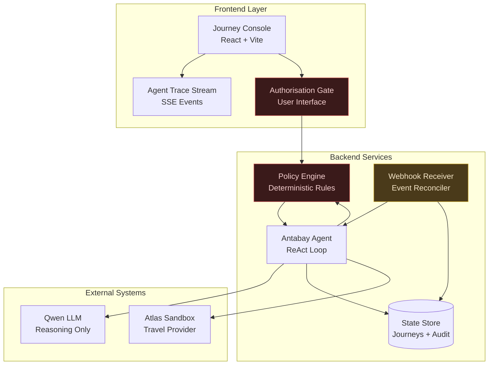
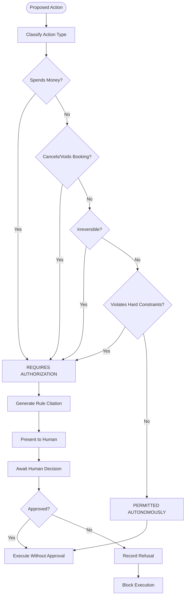
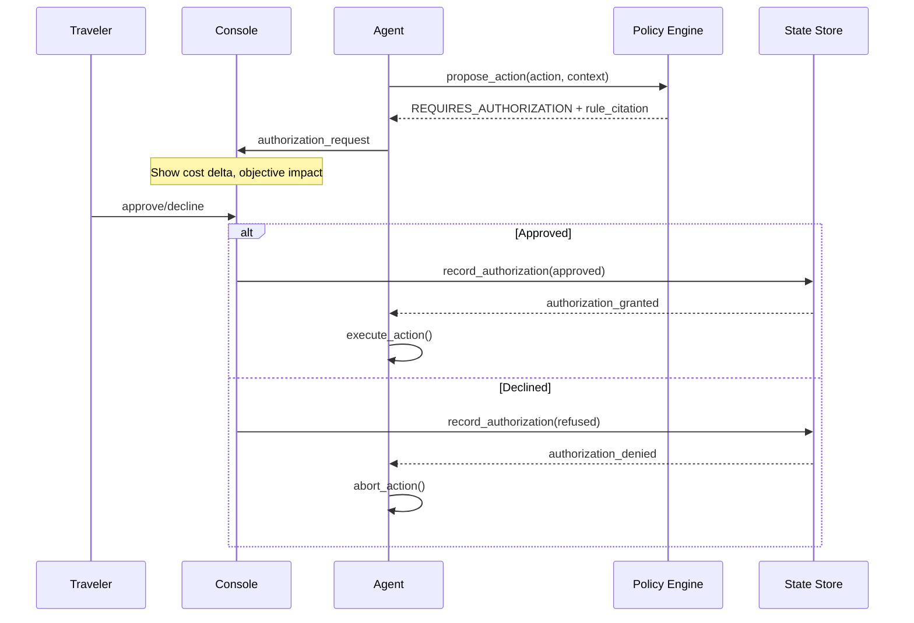
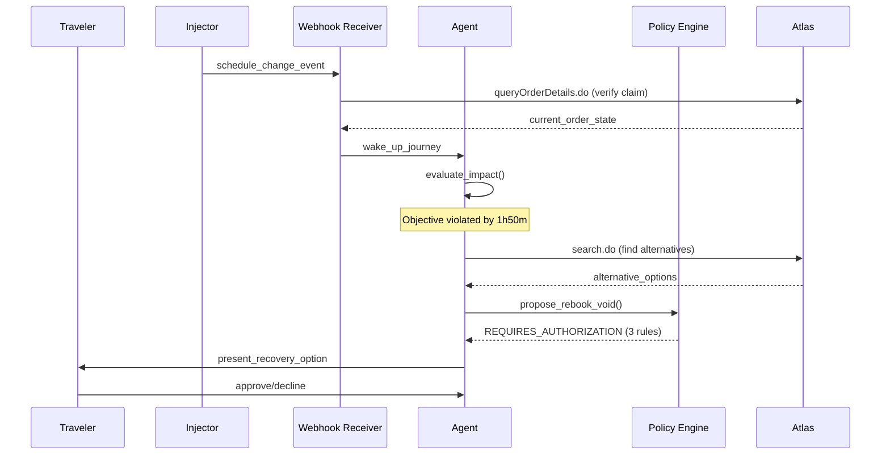
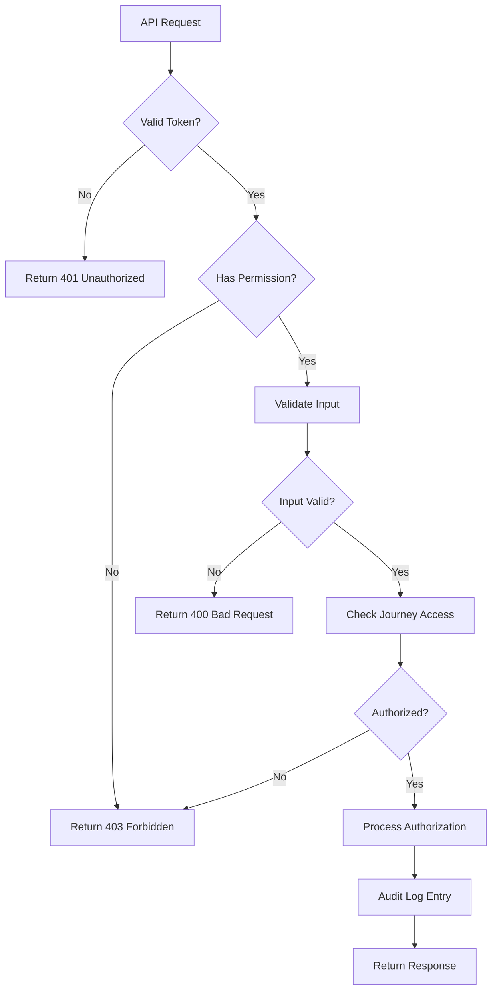
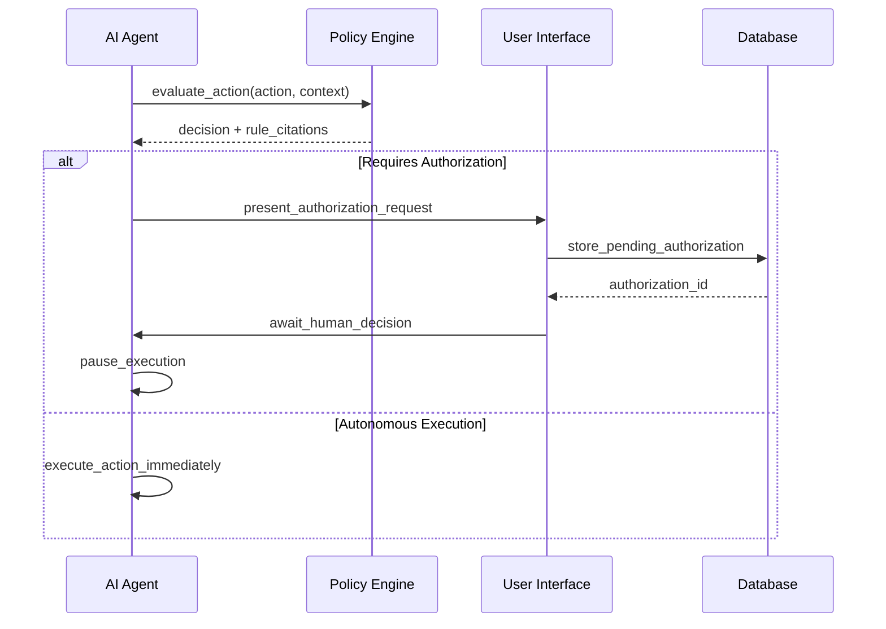

# Authorization Workflows

<cite>
**Referenced Files in This Document**
- [architecture.md](file://.antabay/architecture.md)
- [specs.md](file://.antabay/specs.md)
- [demo-sequence.md](file://.antabay/demo-sequence.md)
- [demo-scenario.md](file://.antabay/demo-scenario.md)
- [console-mockup.html](file://.antabay/console-mockup.html)
</cite>

## Table of Contents
1. [Introduction](#introduction)
2. [System Architecture](#system-architecture)
3. [Authorization Policy Engine](#authorization-policy-engine)
4. [Human-in-the-Loop Workflow](#human-in-the-loop-workflow)
5. [API Endpoints](#api-endpoints)
6. [Request/Response Specifications](#requestresponse-specifications)
7. [Policy Rule Citations](#policy-rule-citations)
8. [Audit Trail and History](#audit-trail-and-history)
9. [Security Considerations](#security-considerations)
10. [Error Handling](#error-handling)
11. [Integration Patterns](#integration-patterns)
12. [Performance Characteristics](#performance-characteristics)
13. [Troubleshooting Guide](#troubleshooting-guide)
14. [Conclusion](#conclusion)

## Introduction

Antabay implements a sophisticated human-in-the-loop authorization system that separates AI reasoning from deterministic policy enforcement. The system processes travel booking requests through a multi-stage workflow where an AI agent proposes actions, but all financial transactions and irreversible operations require explicit human authorization through a deterministic policy engine.

The authorization workflow ensures that no action spending money, voiding bookings, or violating hard constraints can execute without explicit human approval. This creates a safety boundary where AI reasoning informs decisions, but policy rules determine authority boundaries.

## System Architecture

The authorization system follows a clear separation of concerns between the AI agent, policy engine, and user interface components:



**Diagram sources**
- [architecture.md:21-78](file://.antabay/architecture.md#L21-L78)

The architecture enforces four critical rules:
1. **Qwen reasons only** - The language model never decides authority
2. **Policy determines authority** - Deterministic rules control execution boundaries  
3. **State persists externally** - Journey state survives process restarts
4. **Webhooks are untrusted hints** - All events must be verified against authoritative sources

**Section sources**
- [architecture.md:80-86](file://.antabay/architecture.md#L80-L86)

## Authorization Policy Engine

The policy engine operates as a deterministic rule-based system that evaluates proposed actions against predefined policies without consulting AI models. It classifies actions into two categories: permitted autonomously or requiring human authorization.

### Core Policy Rules

The engine enforces mandatory authorization for:
- **Financial transactions** - Any action that spends money
- **Booking modifications** - Actions that cancel or void existing bookings  
- **Irreversible operations** - Actions that cannot be undone
- **Constraint violations** - Actions that would breach stated hard constraints

### Decision Process



**Diagram sources**
- [specs.md:1304-1339](file://.antabay/specs.md#L1304-L1339)

### Policy Evaluation Characteristics

- **Deterministic execution** - Same inputs always produce same decisions
- **Rule citation** - Every decision includes specific rule identifiers
- **Model isolation** - No AI model consultation for policy decisions
- **Testable rules** - Each rule independently testable in both directions

**Section sources**
- [specs.md:1272-1366](file://.antabay/specs.md#L1272-L1366)

## Human-in-the-Loop Workflow

The authorization workflow creates multiple touchpoints where human intervention is required, ensuring traveler control over financial and operational decisions.

### Authorization Request Flow



**Diagram sources**
- [demo-sequence.md:52-55](file://.antabay/demo-sequence.md#L52-L55)
- [specs.md:1328-1335](file://.antabay/specs.md#L1328-L1335)

### Disruption Recovery Workflow

When disruptions occur, the recovery process requires additional authorization due to its complexity:



**Diagram sources**
- [architecture.md:154-208](file://.antabay/architecture.md#L154-L208)

### Key Workflow Principles

1. **Silence equals refusal** - Non-response is treated as denial
2. **Cost transparency** - All authorization requests show financial impact
3. **Objective preservation** - Recovery actions must maintain core objectives
4. **Independent verification** - All actions verified before state updates

**Section sources**
- [demo-sequence.md:114-142](file://.antabay/demo-sequence.md#L114-L142)
- [specs.md:1332-1335](file://.antabay/specs.md#L1332-L1335)

## API Endpoints

The authorization system exposes several key endpoints for managing the human-in-the-loop workflow. These endpoints facilitate authorization request creation, decision submission, and history tracking.

### Authorization Management Endpoints

#### Create Authorization Request
- **Endpoint**: `POST /api/journeys/{journey_id}/authorizations`
- **Purpose**: Submit a new authorization request for review
- **Authentication**: Required with journey-specific token
- **Rate Limiting**: One request per action evaluation

#### Submit Authorization Decision
- **Endpoint**: `PUT /api/authorizations/{authorization_id}`
- **Purpose**: Approve or reject pending authorization requests
- **Authentication**: Required with appropriate permissions
- **Idempotency**: Safe to retry with same decision

#### Retrieve Pending Authorizations
- **Endpoint**: `GET /api/journeys/{journey_id}/authorizations?status=pending`
- **Purpose**: List outstanding authorization requests
- **Authentication**: Required with journey access
- **Pagination**: Supports cursor-based pagination

#### View Policy Rule Citations
- **Endpoint**: `GET /api/policies/rules/{rule_id}`
- **Purpose**: Retrieve detailed policy rule information
- **Authentication**: Public read access
- **Cacheability**: Rules are immutable and cacheable

#### Access Authorization History
- **Endpoint**: `GET /api/journeys/{journey_id}/authorizations/history`
- **Purpose**: Retrieve complete authorization audit trail
- **Authentication**: Required with journey access
- **Filtering**: Support date range and status filtering

### Endpoint Specifications

| Method | Endpoint | Description | Auth Required | Rate Limit |
|--------|----------|-------------|---------------|------------|
| POST | `/api/journeys/{id}/authorizations` | Create authorization request | Journey token | 1 req/sec |
| PUT | `/api/authorizations/{id}` | Submit approval/rejection | Admin token | 10 req/sec |
| GET | `/api/journeys/{id}/authorizations` | List pending authorizations | Journey token | 5 req/sec |
| GET | `/api/policies/rules/{id}` | View policy rule details | None | 60 req/min |
| GET | `/api/journeys/{id}/authorizations/history` | Get authorization history | Journey token | 5 req/sec |

**Section sources**
- [specs.md:852-857](file://.antabay/specs.md#L852-L857)
- [specs.md:1328-1335](file://.antabay/specs.md#L1328-L1335)

## Request/Response Specifications

### Authorization Request Payload

```json
{
  "action_type": "booking_modification",
  "action_details": {
    "operation": "rebook_and_void",
    "current_booking": "ORD-123456",
    "proposed_booking": "NEW-789012",
    "cost_delta": 6.24,
    "currency": "USD"
  },
  "context": {
    "journey_id": "JRN-001",
    "objective_impact": "preserved",
    "deadline_margin": "5 minutes",
    "constraint_violations": []
  },
  "policy_evaluation": {
    "requires_authorization": true,
    "rules_triggered": ["AUTH-001", "AUTH-003"],
    "reasoning": "Action spends money and voids existing booking"
  }
}
```

### Authorization Decision Response

```json
{
  "authorization_id": "AUTH-REQ-001",
  "status": "approved",
  "decision": "approve",
  "timestamp": "2026-08-19T14:30:00Z",
  "decision_maker": "traveler_user_123",
  "policy_rules": {
    "applied_rules": ["AUTH-001", "AUTH-003"],
    "rule_outcomes": {
      "AUTH-001": "spends_money -> requires_authorization",
      "AUTH-003": "irreversible_operation -> requires_authorization"
    }
  },
  "execution_result": {
    "success": true,
    "new_booking_id": "NEW-789012",
    "voided_booking_id": "ORD-123456",
    "total_cost": 96.63,
    "currency": "USD"
  }
}
```

### Historical Authorization Record

```json
{
  "history_entry": {
    "authorization_id": "AUTH-REQ-001",
    "journey_id": "JRN-001",
    "created_at": "2026-08-19T14:25:00Z",
    "updated_at": "2026-08-19T14:30:00Z",
    "action_summary": "Rebook flight LJ201, void original ZE605",
    "cost_impact": {
      "delta": 6.24,
      "currency": "USD",
      "original_cost": 90.39,
      "new_cost": 96.63
    },
    "policy_rules": ["AUTH-001", "AUTH-003"],
    "decision": "approved",
    "decision_timestamp": "2026-08-19T14:30:00Z",
    "audit_trail": [
      {
        "event": "authorization_requested",
        "timestamp": "2026-08-19T14:25:00Z",
        "details": "Policy engine flagged action as requiring authorization"
      },
      {
        "event": "authorization_approved", 
        "timestamp": "2026-08-19T14:30:00Z",
        "details": "Traveler approved rebooking with $6.24 cost increase"
      },
      {
        "event": "action_executed",
        "timestamp": "2026-08-19T14:30:05Z", 
        "details": "New booking created, original booking voided successfully"
      }
    ]
  }
}
```

**Section sources**
- [specs.md:1328-1335](file://.antabay/specs.md#L1328-L1335)
- [demo-scenario.md:104-117](file://.antabay/demo-scenario.md#L104-L117)

## Policy Rule Citations

The authorization system provides detailed policy rule citations for every decision, ensuring transparency and auditability.

### Rule Structure

Each policy rule includes:
- **Rule identifier** - Unique rule reference (e.g., AUTH-001)
- **Rule description** - Human-readable rule explanation
- **Trigger conditions** - Specific conditions that activate the rule
- **Decision outcome** - Whether authorization is required
- **Rationale** - Explanation of why the rule applies

### Common Policy Rules

| Rule ID | Description | Trigger Condition | Outcome |
|---------|-------------|-------------------|---------|
| AUTH-001 | Financial Transaction | Any action spending money | Requires Authorization |
| AUTH-002 | Booking Cancellation | Any action voiding/canceling bookings | Requires Authorization |
| AUTH-003 | Irreversible Operation | Action cannot be undone | Requires Authorization |
| AUTH-004 | Constraint Violation | Action breaches hard constraints | Requires Authorization |
| AUTH-005 | Cost Threshold | Action exceeds budget threshold | Requires Authorization |

### Rule Citation Format

```json
{
  "rule_citation": {
    "rule_id": "AUTH-001",
    "rule_name": "Financial Transaction Policy",
    "description": "Any action that spends money requires explicit human authorization",
    "trigger_conditions": ["cost_delta > 0", "payment_required = true"],
    "decision": "requires_authorization",
    "rationale": "Action involves spending traveler funds ($6.24)"
  }
}
```

**Section sources**
- [specs.md:1325-1327](file://.antabay/specs.md#L1325-L1327)
- [specs.md:1351-1357](file://.antabay/specs.md#L1351-L1357)

## Audit Trail and History

The system maintains comprehensive audit trails for all authorization activities, providing complete visibility into decision-making processes.

### Audit Trail Components

Every authorization event generates audit records containing:
- **Temporal data** - Creation, modification, and completion timestamps
- **Actor identification** - Who made each decision or took each action
- **Context preservation** - Full state snapshot at time of decision
- **Policy references** - Which rules were evaluated and their outcomes
- **Outcome documentation** - Results of each authorization attempt

### Audit Trail Schema

```json
{
  "audit_entry": {
    "entry_id": "AUDIT-001",
    "journey_id": "JRN-001",
    "authorization_id": "AUTH-REQ-001",
    "event_type": "authorization_decision",
    "timestamp": "2026-08-19T14:30:00Z",
    "actor": {
      "type": "traveler",
      "user_id": "traveler_user_123",
      "session_id": "sess_abc123"
    },
    "action": {
      "type": "approval",
      "target": "booking_modification",
      "details": "Approved rebooking with $6.24 cost increase"
    },
    "policy_context": {
      "rules_evaluated": ["AUTH-001", "AUTH-003"],
      "decision_basis": "Explicit traveler approval",
      "risk_assessment": "Low risk - standard rebooking procedure"
    },
    "state_snapshot": {
      "journey_state": "AWAITING_AUTH",
      "current_booking": "ORD-123456",
      "proposed_changes": "Replace with NEW-789012"
    }
  }
}
```

### Query Capabilities

The audit trail supports various query patterns:
- **Time-based queries** - Filter by date ranges
- **Action-type queries** - Find all approvals/refusals
- **Policy-rule queries** - Track usage of specific rules
- **Actor-based queries** - Review decisions by specific users
- **Journey-context queries** - Complete authorization history per journey

**Section sources**
- [specs.md:1334-1335](file://.antabay/specs.md#L1334-L1335)
- [specs.md:488-496](file://.antabay/specs.md#L488-L496)

## Security Considerations

The authorization system implements multiple security layers to protect sensitive booking operations and traveler data.

### Authentication and Authorization

- **JWT-based authentication** - Short-lived tokens for API access
- **Role-based access control** - Different permissions for travelers vs administrators
- **Journey-scoped authorization** - Users can only access their own journeys
- **Token rotation** - Automatic token refresh and invalidation

### Data Protection

- **Encryption at rest** - Sensitive booking data encrypted in storage
- **Encryption in transit** - TLS 1.3 for all API communications
- **Input validation** - Comprehensive parameter sanitization
- **Audit logging** - All authorization attempts logged with full context

### Security Policies



### Rate Limiting and Throttling

- **Per-user rate limits** - Prevent abuse of authorization endpoints
- **Global throttling** - Protect backend services from overload
- **Burst protection** - Prevent rapid-fire authorization attempts
- **Quota management** - Daily/monthly limits on authorization requests

**Section sources**
- [specs.md:1353-1354](file://.antabay/specs.md#L1353-L1354)
- [specs.md:1466-1469](file://.antabay/specs.md#L1466-L1469)

## Error Handling

The authorization system provides comprehensive error handling for various failure scenarios during the approval workflow.

### Error Categories

| Error Type | HTTP Status | Description | Recovery Action |
|------------|-------------|-------------|-----------------|
| `AUTH_INVALID_TOKEN` | 401 | Invalid or expired authorization token | Refresh token and retry |
| `AUTH_PERMISSION_DENIED` | 403 | Insufficient permissions for action | Contact administrator |
| `AUTH_EXPIRED_REQUEST` | 410 | Authorization request has expired | Create new authorization request |
| `AUTH_DUPLICATE_DECISION` | 409 | Decision already submitted | Return existing decision |
| `AUTH_POLICY_VIOLATION` | 422 | Action violates policy constraints | Modify action or seek exception |
| `AUTH_SYSTEM_ERROR` | 500 | Internal system error | Retry with exponential backoff |

### Error Response Format

```json
{
  "error": {
    "code": "AUTH_EXPIRED_REQUEST",
    "message": "Authorization request AUTH-REQ-001 has expired",
    "details": {
      "authorization_id": "AUTH-REQ-001",
      "expires_at": "2026-08-19T14:35:00Z",
      "current_time": "2026-08-19T14:40:00Z",
      "retry_after": 60
    },
    "resolution": "Create a new authorization request for the same action"
  }
}
```

### Retry Logic

The system implements intelligent retry mechanisms:
- **Exponential backoff** - Increasing delays between retry attempts
- **Circuit breaker** - Stop retries after consecutive failures
- **Graceful degradation** - Fallback to manual approval when automated system fails
- **Dead letter queue** - Failed requests queued for manual review

**Section sources**
- [specs.md:1332-1335](file://.antabay/specs.md#L1332-L1335)
- [specs.md:1466-1469](file://.antabay/specs.md#L1466-L1469)

## Integration Patterns

The authorization system integrates seamlessly with the broader Antabay ecosystem through well-defined interfaces.

### Agent Integration

The AI agent interacts with the authorization system through a clean abstraction layer:



**Diagram sources**
- [architecture.md:60-64](file://.antabay/architecture.md#L60-L64)

### Webhook Integration

Real-time notifications are handled through webhook endpoints:

- **Event ingestion** - Accept incoming authorization events
- **Event validation** - Verify webhook authenticity and integrity
- **Event processing** - Transform and route events to appropriate handlers
- **Event persistence** - Store complete event history for audit

### State Management

The system maintains consistent state across distributed components:

- **Eventual consistency** - All components converge to consistent state
- **Conflict resolution** - Handle concurrent authorization requests gracefully
- **State reconciliation** - Periodic verification of authorization state
- **Recovery procedures** - Automatic recovery from partial failures

**Section sources**
- [specs.md:1430-1463](file://.antabay/specs.md#L1430-L1463)
- [specs.md:1457-1463](file://.antabay/specs.md#L1457-L1463)

## Performance Characteristics

The authorization system is designed for high availability and low latency while maintaining strict security guarantees.

### Performance Metrics

| Metric | Target | Measurement Method |
|--------|--------|---------------------|
| Authorization decision latency | < 100ms | End-to-end request/response time |
| Policy evaluation throughput | 1000+ req/sec | Requests per second under load |
| Audit log write latency | < 50ms | Time to persist audit entries |
| Concurrent authorization support | 100+ simultaneous | Max concurrent authorization requests |
| Availability target | 99.9% uptime | Monthly uptime percentage |

### Optimization Strategies

- **Policy caching** - Frequently used policy rules cached in memory
- **Connection pooling** - Efficient database connection management
- **Asynchronous processing** - Non-blocking audit log writes
- **Load balancing** - Horizontal scaling of authorization services
- **Database optimization** - Indexed queries for authorization lookups

### Scalability Considerations

- **Horizontal scaling** - Stateless authorization services scale horizontally
- **Database sharding** - Partition authorization data by journey/user
- **CDN integration** - Cache static policy rules at edge locations
- **Message queuing** - Decouple authorization processing from request handling

**Section sources**
- [specs.md:1348-1357](file://.antabay/specs.md#L1348-L1357)

## Troubleshooting Guide

Common issues and their resolutions in the authorization workflow.

### Authorization Request Issues

**Problem**: Authorization requests not appearing in UI
- **Check**: Verify journey ID and authorization status
- **Solution**: Ensure proper authentication and journey access permissions
- **Debug**: Check audit logs for request creation events

**Problem**: Authorization requests expiring too quickly
- **Check**: Review timeout configuration and user activity
- **Solution**: Implement automatic renewal for active authorization sessions
- **Monitor**: Track expiration rates and user response times

### Policy Evaluation Problems

**Problem**: Incorrect policy rule application
- **Check**: Verify policy rule definitions and trigger conditions
- **Solution**: Update policy rules and re-evaluate affected actions
- **Prevent**: Add policy rule testing in CI/CD pipeline

**Problem**: Performance degradation during peak loads
- **Check**: Monitor policy evaluation latency and resource usage
- **Solution**: Scale policy evaluation services and optimize rule processing
- **Optimize**: Implement policy rule caching and batch processing

### Integration Failures

**Problem**: Agent unable to communicate with policy engine
- **Check**: Network connectivity and service health
- **Solution**: Implement circuit breakers and fallback mechanisms
- **Monitor**: Set up alerts for service communication failures

**Problem**: Audit trail inconsistencies
- **Check**: Database integrity and audit log completeness
- **Solution**: Implement audit log reconciliation and repair procedures
- **Prevent**: Add audit log validation checks

**Section sources**
- [specs.md:1332-1335](file://.antabay/specs.md#L1332-L1335)
- [specs.md:1466-1469](file://.antabay/specs.md#L1466-L1469)

## Conclusion

Antabay's authorization workflow represents a sophisticated approach to balancing AI-powered automation with human oversight. By separating reasoning from policy enforcement, the system achieves both flexibility and safety in travel booking operations.

Key strengths of the implementation include:

- **Clear separation of concerns** - AI handles reasoning, policy engine handles authority decisions
- **Comprehensive audit trails** - Complete visibility into all authorization decisions
- **Robust error handling** - Graceful handling of failures and edge cases
- **Scalable architecture** - Designed for high-volume, low-latency operations
- **Security-first design** - Multiple layers of authentication and authorization

The human-in-the-loop approach ensures that travelers maintain control over financial decisions while benefiting from AI-assisted travel planning. This creates a trust foundation essential for autonomous travel systems.

Future enhancements could include machine learning-based policy optimization, advanced fraud detection, and expanded integration with external booking systems. The modular architecture supports these extensions while maintaining the core security and reliability guarantees.