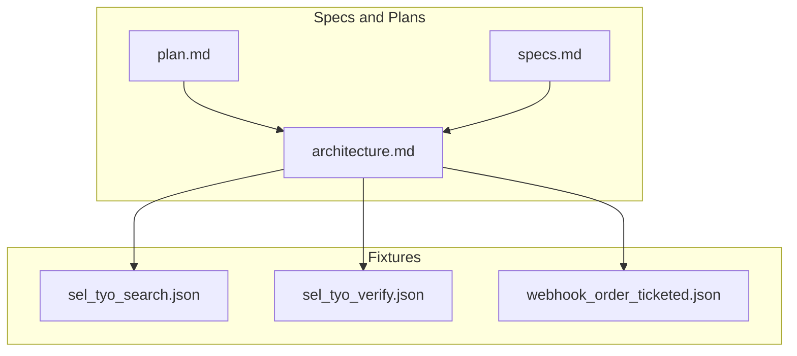
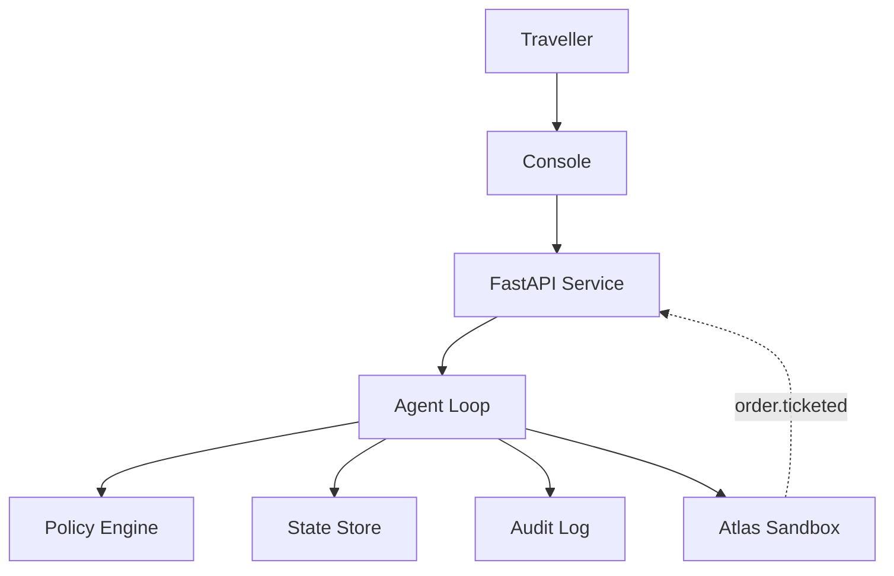
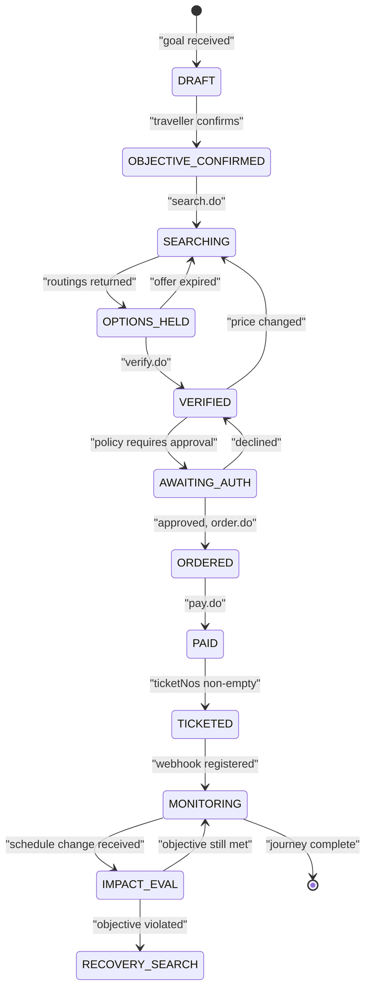
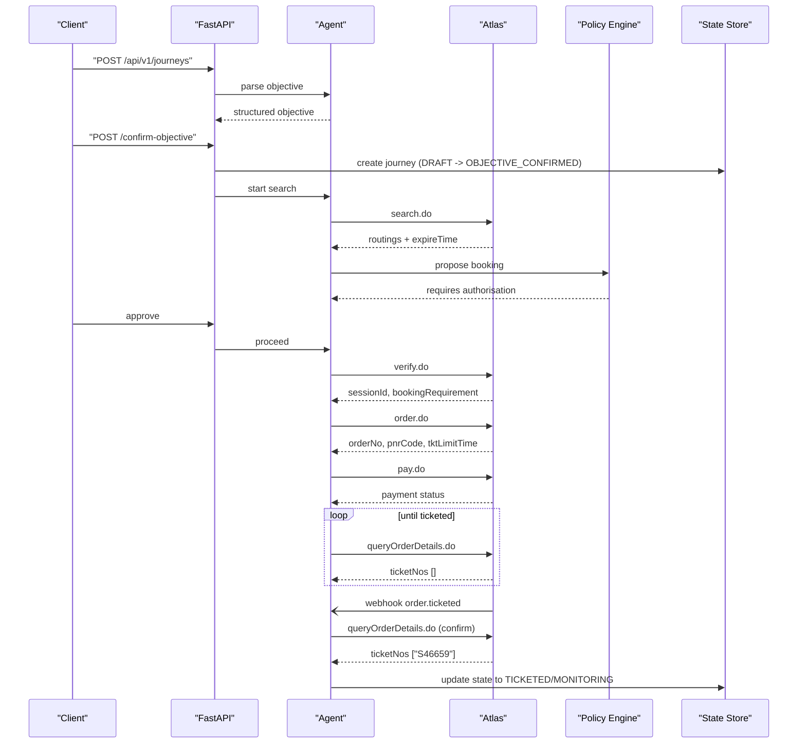
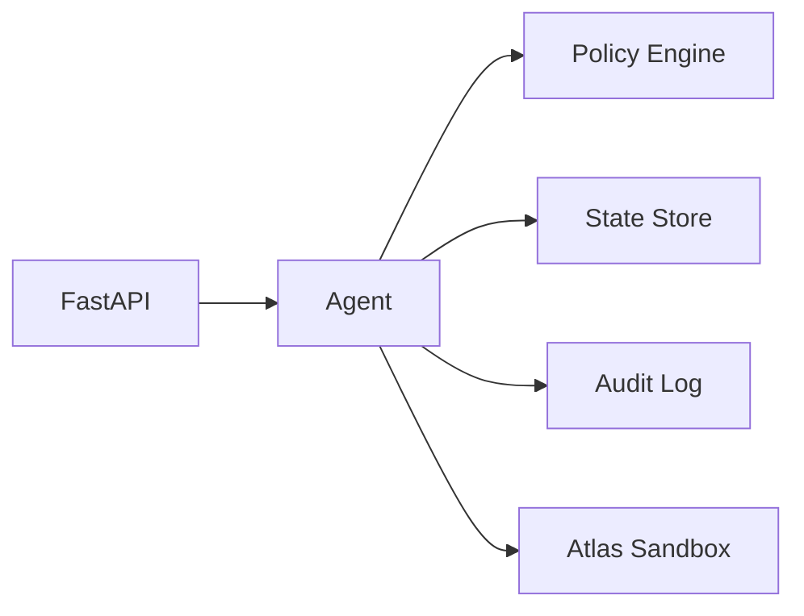

# Journey Management

<cite>
**Referenced Files in This Document**
- [plan.md](file://.antabay/plan.md)
- [specs.md](file://.antabay/specs.md)
- [architecture.md](file://.antabay/architecture.md)
- [sel_tyo_search.json](file://fixtures/atlas/sel_tyo_search.json)
- [sel_tyo_verify.json](file://fixtures/atlas/sel_tyo_verify.json)
- [webhook_order_ticketed.json](file://fixtures/atlas/webhook_order_ticketed.json)
</cite>

## Table of Contents
1. [Introduction](#introduction)
2. [Project Structure](#project-structure)
3. [Core Components](#core-components)
4. [Architecture Overview](#architecture-overview)
5. [Detailed Component Analysis](#detailed-component-analysis)
6. [Dependency Analysis](#dependency-analysis)
7. [Performance Considerations](#performance-considerations)
8. [Troubleshooting Guide](#troubleshooting-guide)
9. [Conclusion](#conclusion)
10. [Appendices](#appendices)

## Introduction
This document specifies the API surface for Antabay’s journey management. It covers creating journeys from natural language objectives, managing the journey lifecycle through defined states, querying status, and retrieving audit trails. It also documents error handling, rate limiting behavior, versioning notes, and backwards compatibility considerations as derived from the repository’s specifications and fixtures.

The system accepts a traveller’s natural-language goal, parses it into a structured objective with hard constraints and soft preferences, confirms the objective, and then drives the booking flow against an external travel provider (Atlas). The journey state machine is enforced and persisted, and every observation, decision, external call, and authorisation is recorded in an append-only audit trail.

**Section sources**
- [plan.md:177-260](file://.antabay/plan.md#L177-L260)
- [specs.md:429-531](file://.antabay/specs.md#L429-L531)
- [architecture.md:19-86](file://.antabay/architecture.md#L19-L86)

## Project Structure
At a high level, the repository contains:
- Specification and planning documents that define the journey model, state transitions, and operational rules.
- Architecture diagrams describing components such as the FastAPI service, agent loop, policy engine, webhook receiver, and integration to Atlas.
- Fixtures capturing real responses from the Atlas sandbox used for search, verification, and ticketed order events.

**Diagram sources**
- [plan.md:177-260](file://.antabay/plan.md#L177-L260)
- [specs.md:429-531](file://.antabay/specs.md#L429-L531)
- [architecture.md:19-86](file://.antabay/architecture.md#L19-L86)
- [sel_tyo_search.json:1-30](file://fixtures/atlas/sel_tyo_search.json#L1-L30)
- [sel_tyo_verify.json:1-20](file://fixtures/atlas/sel_tyo_verify.json#L1-L20)
- [webhook_order_ticketed.json:1-20](file://fixtures/atlas/webhook_order_ticketed.json#L1-L20)

**Section sources**
- [plan.md:177-260](file://.antabay/plan.md#L177-L260)
- [specs.md:429-531](file://.antabay/specs.md#L429-L531)
- [architecture.md:19-86](file://.antabay/architecture.md#L19-L86)

## Core Components
- Objective parser: Accepts natural language and returns a structured objective with origin, destination, deadline, budget/currency, traveller count, and preferences. Each element is classified as a hard constraint or soft preference.
- Journey store: Persists the journey record including unique identifier, confirmed objective, current state, held identifiers with issue/staleness times, and an append-only audit trail.
- State machine: Enforces allowed transitions between DRAFT, OBJECTIVE_CONFIRMED, SEARCHING, SCORING, VERIFYING, BOOKING, TICKETED, plus intermediate states like OPTIONS_HELD, AWAITING_AUTH, ORDERED, PAID, RECONCILING, MONITORING, IMPACT_EVAL, RECOVERY_SEARCH.
- Policy engine: Determines whether actions require human authorisation; silence is refusal.
- Webhook receiver: Accepts untrusted event notifications and reconciles them by querying authoritative data before updating state.
- Audit trail: Append-only log of observations, decisions, external calls, and authorisations with timestamps.

**Section sources**
- [specs.md:429-531](file://.antabay/specs.md#L429-L531)
- [architecture.md:212-257](file://.antabay/architecture.md#L212-L257)

## Architecture Overview
The backend exposes a FastAPI service that hosts the agent loop, policy engine, and webhook receiver. The agent reasons with a language model but never decides authority; the policy engine enforces deterministic authorisation rules. All external calls go through a tool layer that strictly adheres to the verified Atlas contract.

**Diagram sources**
- [architecture.md:19-86](file://.antabay/architecture.md#L19-L86)

**Section sources**
- [architecture.md:19-86](file://.antabay/architecture.md#L19-L86)

## Detailed Component Analysis

### Journey Creation from Natural Language Objectives
- Purpose: Create a new journey by parsing a natural-language objective, presenting the parsed result for confirmation, and persisting the journey with an initial state.
- HTTP method: POST
- URL pattern: /api/v1/journeys
- Authentication: Not specified in the repository; implement per deployment policy.
- Request body schema:
  - objective: object
    - text: string — natural language goal
    - optional fields may be inferred and presented for confirmation
- Response body schema:
  - journey_id: string
  - state: "DRAFT"
  - objective: object with parsed fields and classification (hard constraint vs soft preference)
  - created_at: timestamp
- Behavior:
  - Parse objective and classify each element as hard constraint or soft preference.
  - Present parsed objective for confirmation before any downstream action.
  - On confirmation, create journey with unique ID, confirmed objective, and initial state DRAFT.
  - Persist journey durably so it can be reconstructed after process termination.

Example request/response references:
- See fixture shapes for how structured fields are represented in downstream steps: [sel_tyo_search.json:1-30](file://fixtures/atlas/sel_tyo_search.json#L1-L30), [sel_tyo_verify.json:1-20](file://fixtures/atlas/sel_tyo_verify.json#L1-L20).

Error handling:
- Invalid or non-travel objective: reject with a clear message indicating missing required elements or ambiguity.
- Duplicate creation: return existing journey if idempotent key is provided; otherwise create new.

Rate limiting:
- No specific limit documented for this endpoint; respect provider rate limits during subsequent steps.

Versioning:
- Base path uses /api/v1; future incompatible changes should use a new major version.

Backwards compatibility:
- New optional fields may be added to request/response without breaking clients; unknown fields must be ignored on input.

**Section sources**
- [specs.md:429-531](file://.antabay/specs.md#L429-L531)
- [plan.md:177-260](file://.antabay/plan.md#L177-L260)

### Objective Confirmation and Transition to SEARCHING
- Purpose: Confirm the parsed objective and move the journey to SEARCHING to begin inventory discovery.
- HTTP method: POST
- URL pattern: /api/v1/journeys/{journey_id}/confirm-objective
- Authentication: Not specified in the repository.
- Request body: empty or minimal acknowledgement payload.
- Response:
  - journey_id
  - state: "OBJECTIVE_CONFIRMED" immediately after confirmation; next transition to SEARCHING occurs when search is initiated.
- Behavior:
  - Only allow transition from DRAFT to OBJECTIVE_CONFIRMED upon explicit confirmation.
  - After confirmation, initiate search.do against Atlas and transition to SEARCHING.

State transition rules:
- DRAFT → OBJECTIVE_CONFIRMED: traveller confirms parsed objective.
- OBJECTIVE_CONFIRMED → SEARCHING: search initiated.

**Section sources**
- [specs.md:429-531](file://.antabay/specs.md#L429-L531)
- [architecture.md:212-257](file://.antabay/architecture.md#L212-L257)

### Search and Scoring (SEARCHING → OPTIONS_HELD → SCORING)
- Purpose: Retrieve options from Atlas, hold offers, score against objective, and select one option.
- HTTP methods:
  - POST /api/v1/journeys/{journey_id}/search
  - GET /api/v1/journeys/{journey_id}/options
- Authentication: Not specified in the repository.
- Request/response schemas:
  - Search request: minimal parameters derived from confirmed objective (origin, destination, date, travellers, currency).
  - Options response: list of routings with identifiers, pricing, segments, expireTime, scarcity signals.
  - Scoring response: selected routingIdentifier, rationale, and reasons for rejection of other strong candidates.
- Behavior:
  - Record offer clocks (expireTime) and treat returned options as pre-aged.
  - Eliminate options violating hard constraints; rank remaining by preferences.
  - Select one option and record rationale.

References:
- Option shape and fields observed in fixtures: [sel_tyo_search.json:1-30](file://fixtures/atlas/sel_tyo_search.json#L1-L30).

**Section sources**
- [specs.md:565-646](file://.antabay/specs.md#L565-L646)
- [specs.md:675-766](file://.antabay/specs.md#L675-L766)
- [sel_tyo_search.json:1-30](file://fixtures/atlas/sel_tyo_search.json#L1-L30)

### Verification (SCORING → VERIFYING)
- Purpose: Verify price and bookability for the selected option and obtain a session for booking.
- HTTP method: POST
- URL pattern: /api/v1/journeys/{journey_id}/verify
- Authentication: Not specified in the repository.
- Request body: routingIdentifier (byte-for-byte preserved).
- Response:
  - sessionId
  - maxSeats
  - routing details
  - bookingRequirement schema for passenger fields
  - priceChange indicator
  - status and message
- Behavior:
  - Replace offer clock with session clock (~2 hours).
  - Treat price change as invalidating prior authorisation.

Reference:
- Verified response shape: [sel_tyo_verify.json:1-20](file://fixtures/atlas/sel_tyo_verify.json#L1-L20).

**Section sources**
- [specs.md:675-766](file://.antabay/specs.md#L675-L766)
- [sel_tyo_verify.json:1-20](file://fixtures/atlas/sel_tyo_verify.json#L1-L20)

### Booking and Payment (VERIFYING → BOOKING → TICKETED)
- Purpose: Place an order, pay, and confirm ticketing via independent query.
- HTTP methods:
  - POST /api/v1/journeys/{journey_id}/order
  - POST /api/v1/journeys/{journey_id}/pay
  - GET /api/v1/journeys/{journey_id}/order-status
- Authentication: Not specified in the repository.
- Request/response schemas:
  - Order request: sessionId, passengers, contact info per bookingRequirement.
  - Order response: orderNo, pnrCode, tktLimitTime.
  - Pay request: orderNo.
  - Pay response: payment status (not proof of ticketing).
  - Order status response: orderStatus, ticketStatus, ticketNos.
- Behavior:
  - Do not treat payment success as ticketing; confirm only when ticketNos are non-empty.
  - Handle duplicate order rejections by adopting existing order reference.

References:
- Ticketed webhook envelope shape: [webhook_order_ticketed.json:1-20](file://fixtures/atlas/webhook_order_ticketed.json#L1-L20).

**Section sources**
- [plan.md:89-148](file://.antabay/plan.md#L89-L148)
- [webhook_order_ticketed.json:1-20](file://fixtures/atlas/webhook_order_ticketed.json#L1-L20)

### Query Journey Status
- Purpose: Retrieve current journey state, objective, held identifiers with expiry, and summary of recent actions.
- HTTP method: GET
- URL pattern: /api/v1/journeys/{journey_id}
- Authentication: Not specified in the repository.
- Response schema:
  - journey_id
  - state
  - objective (confirmed)
  - held identifiers with issued_at and expires_at
  - last_updated_at
- Behavior:
  - Return current state and all durable information needed for display.

**Section sources**
- [specs.md:429-531](file://.antabay/specs.md#L429-L531)

### Retrieve Audit Trail
- Purpose: Get the complete append-only audit trail for a journey.
- HTTP method: GET
- URL pattern: /api/v1/journeys/{journey_id}/audit
- Authentication: Not specified in the repository.
- Response schema:
  - entries: array of audit records
    - timestamp
    - type (observation, decision, external_call, authorisation)
    - details (endpoint, outcome, elapsed time, rule name, etc.)
- Behavior:
  - Append-only; immutable once written.
  - Include every external call, decision, and authorisation outcome including refusals.

**Section sources**
- [specs.md:429-531](file://.antabay/specs.md#L429-L531)

### Delete Journey
- Purpose: Remove a journey record when appropriate (e.g., abandoned before confirmation).
- HTTP method: DELETE
- URL pattern: /api/v1/journeys/{journey_id}
- Authentication: Not specified in the repository.
- Response:
  - success boolean
  - message
- Behavior:
  - Allow deletion only when no irreversible external commitments exist (no orders/payments/tickets).
  - If external commitments exist, return conflict with guidance.

**Section sources**
- [specs.md:429-531](file://.antabay/specs.md#L429-L531)

### Webhook Receiver (Untrusted Hint)
- Purpose: Receive inbound event notifications (e.g., order.ticketed) and reconcile with authoritative queries before changing state.
- HTTP method: POST
- URL pattern: /api/v1/webhooks/atlas
- Authentication: Unauthenticated; treat as hint only.
- Request body:
  - cid
  - type
  - status
  - data (payload varies by event type)
- Response:
  - accepted boolean
  - message
- Behavior:
  - Validate envelope structure.
  - For order.ticketed, query order details to confirm ticketNos before updating journey state.

Reference:
- Webhook envelope shape: [webhook_order_ticketed.json:1-20](file://fixtures/atlas/webhook_order_ticketed.json#L1-L20).

**Section sources**
- [architecture.md:66-72](file://.antabay/architecture.md#L66-L72)
- [webhook_order_ticketed.json:1-20](file://fixtures/atlas/webhook_order_ticketed.json#L1-L20)

### Journey State Machine

**Diagram sources**
- [architecture.md:212-257](file://.antabay/architecture.md#L212-L257)

**Section sources**
- [architecture.md:212-257](file://.antabay/architecture.md#L212-L257)

### Sequence: Goal to Ticketed

**Diagram sources**
- [plan.md:89-148](file://.antabay/plan.md#L89-L148)
- [architecture.md:89-148](file://.antabay/architecture.md#L89-L148)

**Section sources**
- [plan.md:89-148](file://.antabay/plan.md#L89-L148)
- [architecture.md:89-148](file://.antabay/architecture.md#L89-L148)

## Dependency Analysis
- External dependencies:
  - Atlas Sandbox endpoints: search.do, verify.do, order.do, pay.do, queryOrderDetails.do, void/refund.
  - Language model (Qwen) for reasoning only; never decides authority.
- Internal dependencies:
  - FastAPI service depends on agent loop, policy engine, state store, and audit logger.
  - Webhook receiver depends on authoritative query to reconcile events.

**Diagram sources**
- [architecture.md:19-86](file://.antabay/architecture.md#L19-L86)

**Section sources**
- [architecture.md:19-86](file://.antabay/architecture.md#L19-L86)

## Performance Considerations
- Offer and session clocks:
  - Offers have expireTime observed between 7m43s and 31m; may arrive pre-aged.
  - Sessions last approximately 2 hours.
  - Ticketing window (tktLimitTime) is approximately 30 minutes.
- Rate limiting:
  - Respect provider rate limits; honour wait instructions on rate-limit rejections.
  - Maintain a per-journey call budget for rate-limited endpoints.
- Concurrency:
  - Avoid concurrent modifications to the same journey; enforce idempotency where possible.
- Caching:
  - Cache short-lived entities (offers) with strict TTL based on expireTime.

**Section sources**
- [plan.md:89-148](file://.antabay/plan.md#L89-L148)
- [specs.md:303-398](file://.antabay/specs.md#L303-L398)
- [architecture.md:261-279](file://.antabay/architecture.md#L261-L279)

## Troubleshooting Guide
Common errors and handling:
- Invalid objective:
  - Missing required elements or ambiguous phrasing: return validation error listing missing fields.
- State transition violations:
  - Attempting an invalid transition (e.g., deleting a journey with active orders): return conflict with guidance.
- Resource conflicts:
  - Duplicate order rejection: adopt existing order reference and continue reconciliation.
- Rate limiting:
  - Provider returns rate-limit rejection with wait instruction: pause retries until interval elapses.
- Price changes:
  - Price change detected during verification: invalidate prior authorisation and re-propose.
- Webhook reliability:
  - Treat webhooks as hints; always confirm via authoritative query before updating state.

Operational checks:
- Ensure offer/session/ticket clocks are tracked and displayed.
- Verify audit trail completeness for every external call and decision.

**Section sources**
- [specs.md:303-398](file://.antabay/specs.md#L303-L398)
- [specs.md:429-531](file://.antabay/specs.md#L429-L531)
- [architecture.md:66-86](file://.antabay/architecture.md#L66-L86)

## Conclusion
Antabay’s journey management API provides a robust, spec-driven interface to turn natural-language objectives into ticketed journeys. It enforces a strict state machine, preserves external identifiers, maintains an append-only audit trail, and integrates safely with an external provider through a verified contract. The design emphasizes durability, explainability, and safety around money and irreversible actions via a deterministic policy engine.

[No sources needed since this section summarizes without analyzing specific files]

## Appendices

### Appendix A: Request/Response Schemas

#### Create Journey
- Endpoint: POST /api/v1/journeys
- Request:
  - objective.text: string
- Response:
  - journey_id: string
  - state: "DRAFT"
  - objective: object with parsed fields and classifications
  - created_at: timestamp

#### Confirm Objective
- Endpoint: POST /api/v1/journeys/{journey_id}/confirm-objective
- Response:
  - state: "OBJECTIVE_CONFIRMED"

#### Search Options
- Endpoint: POST /api/v1/journeys/{journey_id}/search
- Response:
  - routings: array of option objects with identifiers, pricing, segments, expireTime, scarcity indicators

#### Verify Option
- Endpoint: POST /api/v1/journeys/{journey_id}/verify
- Request:
  - routingIdentifier: string
- Response:
  - sessionId: string
  - routing: object
  - bookingRequirement: object
  - priceChange: object
  - status: number
  - msg: string

#### Place Order
- Endpoint: POST /api/v1/journeys/{journey_id}/order
- Request:
  - sessionId: string
  - passengers: array
  - contact: object
- Response:
  - orderNo: string
  - pnrCode: string
  - tktLimitTime: timestamp

#### Pay
- Endpoint: POST /api/v1/journeys/{journey_id}/pay
- Request:
  - orderNo: string
- Response:
  - status: number

#### Order Status
- Endpoint: GET /api/v1/journeys/{journey_id}/order-status
- Response:
  - orderStatus: number
  - ticketStatus: number
  - ticketNos: array of strings

#### Query Journey
- Endpoint: GET /api/v1/journeys/{journey_id}
- Response:
  - journey_id: string
  - state: string
  - objective: object
  - held_identifiers: array of {id, issued_at, expires_at}
  - last_updated_at: timestamp

#### Audit Trail
- Endpoint: GET /api/v1/journeys/{journey_id}/audit
- Response:
  - entries: array of {timestamp, type, details}

#### Delete Journey
- Endpoint: DELETE /api/v1/journeys/{journey_id}
- Response:
  - success: boolean
  - message: string

#### Webhook Receiver
- Endpoint: POST /api/v1/webhooks/atlas
- Request:
  - cid: string
  - type: string
  - status: number
  - data: object
- Response:
  - accepted: boolean
  - message: string

**Section sources**
- [sel_tyo_search.json:1-30](file://fixtures/atlas/sel_tyo_search.json#L1-L30)
- [sel_tyo_verify.json:1-20](file://fixtures/atlas/sel_tyo_verify.json#L1-L20)
- [webhook_order_ticketed.json:1-20](file://fixtures/atlas/webhook_order_ticketed.json#L1-L20)
- [plan.md:89-148](file://.antabay/plan.md#L89-L148)

### Appendix B: Error Codes and Handling
- Validation errors: malformed or incomplete objective; missing required fields.
- State transition errors: invalid state transitions; resource conflicts.
- Provider errors: rate-limit with wait instruction; price change; duplicate order.
- Authorisation errors: action requires human approval; silence is refusal.

**Section sources**
- [specs.md:303-398](file://.antabay/specs.md#L303-L398)
- [specs.md:429-531](file://.antabay/specs.md#L429-L531)

### Appendix C: Versioning and Backwards Compatibility
- Versioning: Use /api/v1 base path; introduce new major versions for breaking changes.
- Backwards compatibility:
  - Additive changes to request/response are safe.
  - Unknown fields on input must be ignored.
  - Preserve externally issued identifiers unchanged.

**Section sources**
- [specs.md:303-398](file://.antabay/specs.md#L303-L398)