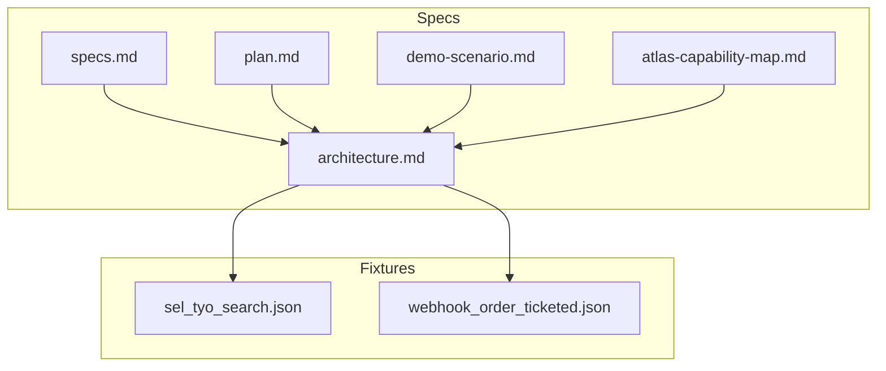
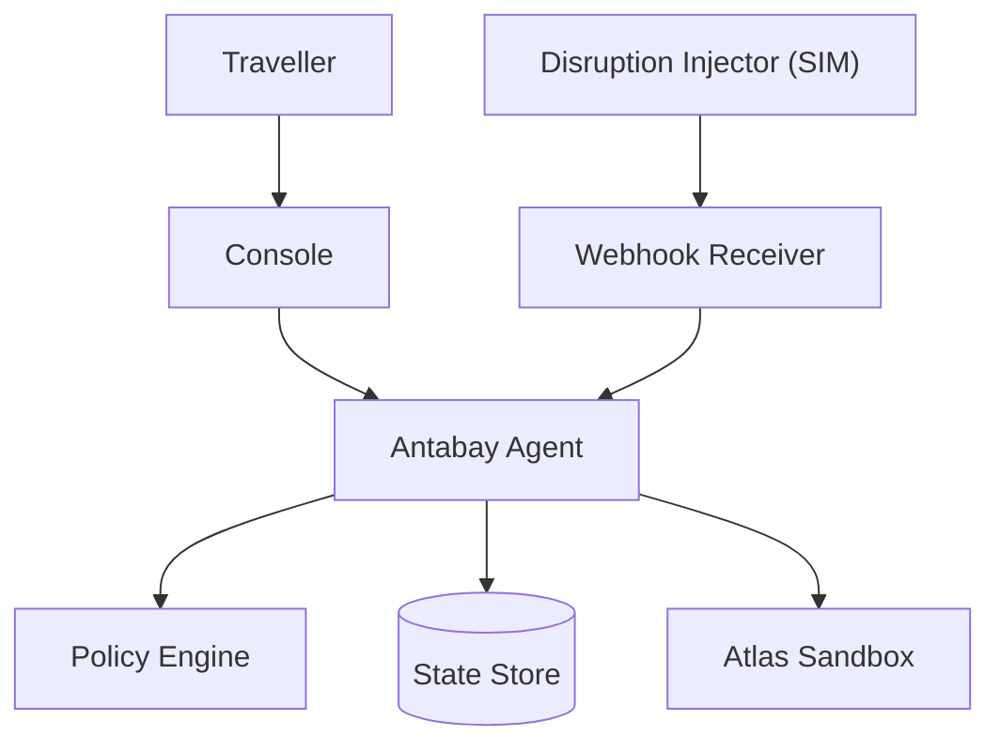
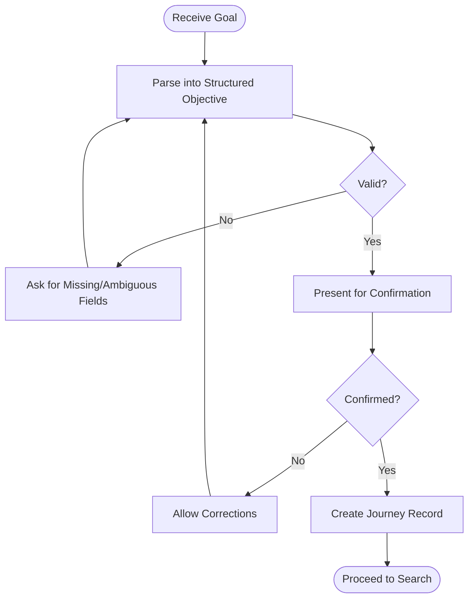
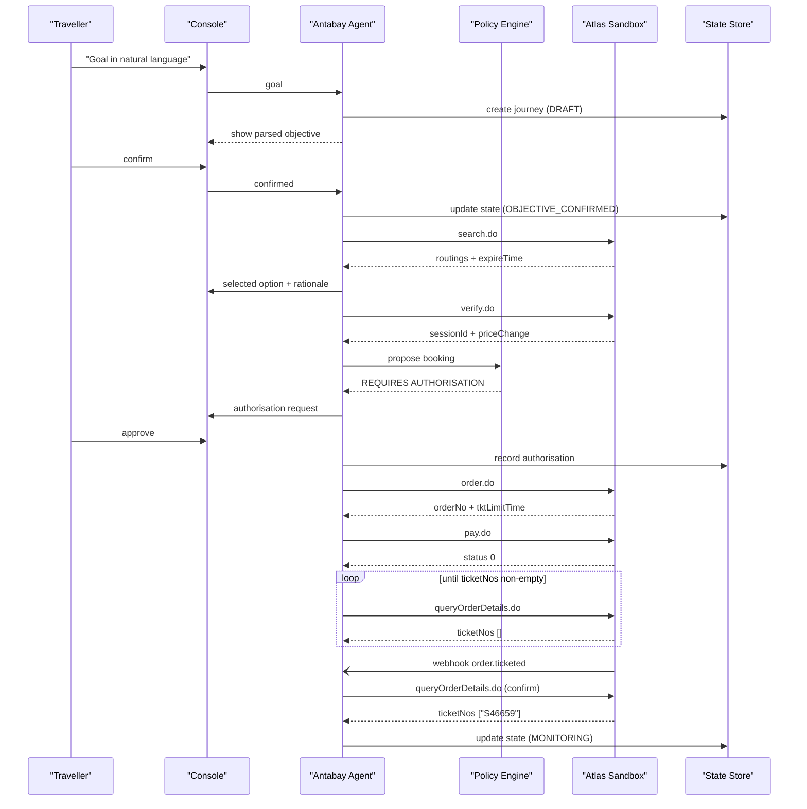
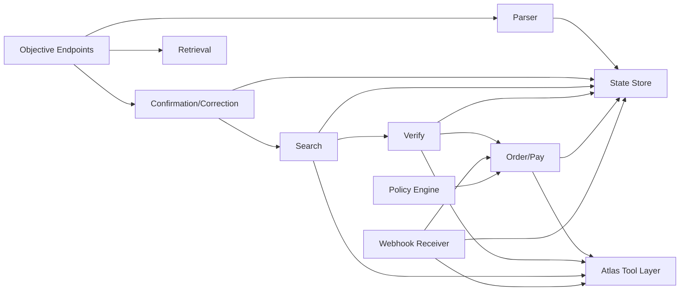

# Objective Handling

<cite>
**Referenced Files in This Document**
- [specs.md](file://.antabay/specs.md)
- [plan.md](file://.antabay/plan.md)
- [architecture.md](file://.antabay/architecture.md)
- [demo-scenario.md](file://.antabay/demo-scenario.md)
- [atlas-capability-map.md](file://.antabay/atlas-capability-map.md)
- [sel_tyo_search.json](file://fixtures/atlas/sel_tyo_search.json)
- [webhook_order_ticketed.json](file://fixtures/atlas/webhook_order_ticketed.json)
</cite>

## Table of Contents
1. [Introduction](#introduction)
2. [Project Structure](#project-structure)
3. [Core Components](#core-components)
4. [Architecture Overview](#architecture-overview)
5. [Detailed Component Analysis](#detailed-component-analysis)
6. [Dependency Analysis](#dependency-analysis)
7. [Performance Considerations](#performance-considerations)
8. [Troubleshooting Guide](#troubleshooting-guide)
9. [Conclusion](#conclusion)
10. [Appendices](#appendices)

## Introduction
This document specifies the objective handling endpoints and workflows that convert a traveller’s natural language goal into a structured, confirmed objective, then drive search, scoring, verification, booking, and recovery. It focuses on:
- Parsing natural language into structured objectives with hard constraints and soft preferences
- Confirmation and correction workflows before any downstream action
- Validation rules for conflicting or incomplete inputs
- Timezone-aware deadlines and budget currency handling
- Integration patterns for multi-step refinement and user feedback loops

The design is grounded in verified Atlas capabilities and the project’s specifications.

## Project Structure
The repository contains specification documents, architecture diagrams, a locked demo scenario, and fixtures from live sandbox runs. The objective handling flow is defined by the specs and illustrated in the architecture diagram.

**Diagram sources**
- [specs.md:429-531](file://.antabay/specs.md#L429-L531)
- [architecture.md:19-86](file://.antabay/architecture.md#L19-L86)
- [atlas-capability-map.md:1-39](file://.antabay/atlas-capability-map.md#L1-L39)

**Section sources**
- [specs.md:429-531](file://.antabay/specs.md#L429-L531)
- [architecture.md:19-86](file://.antabay/architecture.md#L19-L86)
- [atlas-capability-map.md:1-39](file://.antabay/atlas-capability-map.md#L1-L39)

## Core Components
Objective handling spans these components:
- Natural Language to Structured Objective Parser
- Objective Confirmation and Correction Workflow
- Journey State Store (Durable)
- Scoring Engine against Confirmed Objective
- Verification and Booking Gateways (Atlas Tool Layer)
- Webhook Receiver and Reconciler
- Authorisation Policy Engine

Key responsibilities:
- Extract origin, destination, deadline, budget/currency, traveller count, preferences; classify each as hard constraint or soft preference
- Present parsed objective for confirmation; request missing information; handle corrections without inferring travel facts
- Persist journey state and audit trail; enforce allowed transitions
- Search, score, verify, book, pay, and confirm ticketing via verified Atlas endpoints
- Treat webhooks as untrusted hints; reconcile with authoritative order query
- Require deterministic authorisation for actions that spend money or breach hard constraints

**Section sources**
- [specs.md:429-531](file://.antabay/specs.md#L429-L531)
- [specs.md:675-766](file://.antabay/specs.md#L675-L766)
- [atlas-capability-map.md:152-313](file://.antabay/atlas-capability-map.md#L152-L313)
- [architecture.md:19-86](file://.antabay/architecture.md#L19-L86)

## Architecture Overview
The system uses a FastAPI backend with an agent loop that reasons with Qwen, enforces policy decisions deterministically, persists journey state, and calls Atlas through a tool layer. The console streams events to the UI.

**Diagram sources**
- [architecture.md:19-86](file://.antabay/architecture.md#L19-L86)

**Section sources**
- [architecture.md:19-86](file://.antabay/architecture.md#L19-L86)

## Detailed Component Analysis

### Endpoint: Parse Objective
- Purpose: Convert natural language goal into a structured objective with hard constraints and soft preferences.
- Input: Natural language string describing travel goal.
- Output: Structured objective including origin, destination, latest acceptable arrival time, budget with currency, traveller count, stated preferences, and classification per element.
- Validation:
  - Identify absent or ambiguous elements and ask the traveller rather than infer values.
  - Detect conflicting constraints and report which cannot be satisfied together.
  - Resolve relative deadlines using timezone context; if ambiguous, request clarification.
- Error handling:
  - Unparseable input returns a request for clarification with specific missing fields.
  - Conflicting constraints return a conflict explanation and options to adjust.
- Timezone handling:
  - Deadlines are stored with timezone context; when not provided, request destination timezone or local reference.
- Budget handling:
  - Currency must be explicit; if not present, request currency.
  - If provider prices differ from objective currency, do not mix currencies without conversion; prefer objective currency where supported.

Example request/response shapes:
- Request: { "goal": "Get me to Tokyo before 10 AM tomorrow. Under USD 120. No overnight connections." }
- Response: { "objective": { "origin": "SEL", "destination": "TYO", "deadline": "2026-09-06T10:00:00+09:00", "budget": { "amount": 120, "currency": "USD" }, "travellers": 1, "preferences": ["no overnight connections"], "constraints": ["origin", "destination", "deadline", "budget", "no overnight connections"] } }

Integration pattern:
- After parsing, present the structured objective for confirmation before any downstream action.

**Section sources**
- [specs.md:429-531](file://.antabay/specs.md#L429-L531)
- [specs.md:533-561](file://.antabay/specs.md#L533-L561)
- [demo-scenario.md:13-28](file://.antabay/demo-scenario.md#L13-L28)

### Endpoint: Confirm Objective
- Purpose: Accept traveller confirmation of the parsed objective and create a durable journey record.
- Input: { "journey_id": "<unique>", "confirmed": true }
- Output: { "journey_id": "<unique>", "state": "OBJECTIVE_CONFIRMED", "objective": <structured objective>, "audit_trail": [...] }
- Validation:
  - Ensure all required fields are present; otherwise prompt for missing information.
  - Reject if constraints are still conflicting; require revision.
- Error handling:
  - Missing required fields return a list of requested clarifications.
  - Conflicting constraints return a conflict summary and suggested adjustments.
- Timezone handling:
  - Deadline remains timezone-aware; if needed, reconfirm timezone assumptions.

Example request/response shapes:
- Request: { "journey_id": "j-123", "confirmed": true }
- Response: { "journey_id": "j-123", "state": "OBJECTIVE_CONFIRMED", "objective": { "origin": "SEL", "destination": "TYO", "deadline": "2026-09-06T10:00:00+09:00", "budget": { "amount": 120, "currency": "USD" }, "travellers": 1, "preferences": ["no overnight connections"], "constraints": ["origin", "destination", "deadline", "budget", "no overnight connections"] }, "audit_trail": [{ "event": "objective_confirmed", "timestamp": "..." }] }

Integration pattern:
- On confirmation, proceed to search using confirmed objective fields.

**Section sources**
- [specs.md:429-531](file://.antabay/specs.md#L429-L531)
- [architecture.md:89-148](file://.antabay/architecture.md#L89-L148)

### Endpoint: Correct Objective
- Purpose: Allow traveller to correct parsed elements without starting over.
- Input: { "journey_id": "<unique>", "corrections": { "deadline": "...", "budget": { "amount": ..., "currency": "..." }, "preferences": [...] } }
- Output: Updated objective with revised classifications and validation results.
- Validation:
  - Apply corrections and re-validate constraints; detect new conflicts.
  - Preserve hard vs soft classification unless explicitly changed.
- Error handling:
  - Invalid corrections return field-level errors and suggestions.
  - Conflicts return a clear explanation and options to resolve.

Example request/response shapes:
- Request: { "journey_id": "j-123", "corrections": { "deadline": "2026-09-06T09:30:00+09:00", "budget": { "amount": 100, "currency": "USD" } } }
- Response: { "journey_id": "j-123", "objective": { ... updated fields ... }, "validation": { "status": "valid", "notes": "Deadline tightened; budget reduced." } }

Integration pattern:
- After correction, re-present the updated objective for confirmation if changes affect downstream actions.

**Section sources**
- [specs.md:429-531](file://.antabay/specs.md#L429-L531)
- [specs.md:533-561](file://.antabay/specs.md#L533-L561)

### Endpoint: Retrieve Objective and Journey State
- Purpose: Return current objective, journey state, held identifiers with expiry times, and audit trail.
- Input: { "journey_id": "<unique>" }
- Output: { "journey_id": "<unique>", "state": "...", "objective": {...}, "held_identifiers": [...], "audit_trail": [...] }
- Validation:
  - Ensure journey exists; otherwise return not found.
- Error handling:
  - Not found returns appropriate error code and message.

Example request/response shapes:
- Request: { "journey_id": "j-123" }
- Response: { "journey_id": "j-123", "state": "SEARCHING", "objective": {...}, "held_identifiers": [{ "type": "offer", "id": "...", "issued_at": "...", "expires_at": "..." }], "audit_trail": [...] }

**Section sources**
- [specs.md:429-531](file://.antabay/specs.md#L429-L531)
- [architecture.md:212-257](file://.antabay/architecture.md#L212-L257)

### Endpoint: Search Options (Post-Confirmation)
- Purpose: Search for travel options matching the confirmed objective.
- Input: Derived from confirmed objective (origin, destination, date, traveller count).
- Output: List of routings with identifiers, pricing, segments, scarcity signals, and offer freshness timestamps.
- Validation:
  - Use objective currency; if unavailable, report and fallback behavior per spec.
  - Record offer expireTime; treat offers as pre-aged upon receipt.
- Error handling:
  - Zero options returns a non-error response stating no options were returned.
  - Rate-limit responses honour wait instructions; do not retry early.

Example request/response shapes:
- Request: { "journey_id": "j-123" }
- Response: { "routings": [ { "routingIdentifier": "...", "currency": "USD", "total_price": ..., "segments": [...], "expireTime": "...", "riskSellout": false } ], "count": 30 }

Integration pattern:
- Proceed to scoring against objective; eliminate options violating hard constraints.

**Section sources**
- [specs.md:565-646](file://.antabay/specs.md#L565-L646)
- [atlas-capability-map.md:40-98](file://.antabay/atlas-capability-map.md#L40-L98)
- [atlas-capability-map.md:107-125](file://.antabay/atlas-capability-map.md#L107-L125)

### Endpoint: Verify Offer
- Purpose: Lock price and obtain session identifier for booking.
- Input: { "routingIdentifier": "<byte-for-byte from search>" }
- Output: { "sessionId": "...", "bookingRequirement": {...}, "priceChange": {...}, "status": 0 }
- Validation:
  - Preserve routingIdentifier exactly.
  - Read priceChange.isPriceChange; if true, prior approvals are void.
- Error handling:
  - Price change invalidates previous human approval; require re-approval.
  - Session expiry enforced; renew or re-search if expired.

Example request/response shapes:
- Request: { "routingIdentifier": "ZE605-ICN-NRT-20260905" }
- Response: { "sessionId": "uuid...", "bookingRequirement": { "passenger": { "name": { "type": "string", "required": true } } }, "priceChange": { "isPriceChange": false }, "status": 0 }

Integration pattern:
- Proceed to authorisation gate; if spending money, requires approval.

**Section sources**
- [atlas-capability-map.md:152-221](file://.antabay/atlas-capability-map.md#L152-L221)
- [architecture.md:89-148](file://.antabay/architecture.md#L89-L148)

### Endpoint: Order and Pay
- Purpose: Create order and initiate payment; confirm ticketing via order query.
- Input: { "sessionId": "...", "passengers": [...], "contact": {...} }
- Output: { "orderNo": "...", "pnrCode": "...", "tktLimitTime": "...", "status": 0 }
- Validation:
  - Use bookingRequirement schema at runtime; do not hardcode passenger fields.
  - A PNR is issued before payment; payment success is not proof of ticketing.
- Error handling:
  - Duplicate booking (code 318): read duplicateOrders[], reconcile with existing order.
  - Payment failure simulation: use documented cardholder names for deterministic errors.

Example request/response shapes:
- Request: { "sessionId": "uuid...", "passengers": [{ "name": "TEST/ONE", "passengerType": 0, "birthday": "19900101", "gender": "M", "nationality": "ID" }], "contact": { "name": "...", "email": "...", "mobile": "..." } }
- Response: { "orderNo": "TESTA20260815172246746", "pnrCode": "TZKZYA", "tktLimitTime": "2026-08-15T17:52:46Z", "status": 0 }

Integration pattern:
- Poll queryOrderDetails until ticketNos non-empty; only then mark ticketed.

**Section sources**
- [atlas-capability-map.md:236-313](file://.antabay/atlas-capability-map.md#L236-L313)
- [architecture.md:89-148](file://.antabay/architecture.md#L89-L148)

### Endpoint: Webhook Receiver
- Purpose: Receive inbound event notifications; treat as untrusted hints; reconcile with authoritative order query.
- Input: POST JSON envelope with type, status, data.
- Output: Acknowledgement; internal reconciliation updates journey state after verification.
- Validation:
  - Route on type; do not trust webhook status for success/failure.
  - Normalise field types (e.g., orderStatus integer vs string).
- Error handling:
  - Forged or malformed events ignored; never change state without API confirmation.

Example request/response shapes:
- Request: { "cid": "...", "type": "order.ticketed", "status": -1, "data": { "orderNo": "...", "orderStatus": 2, "paxTicketInfos": [...] } }
- Response: { "ack": true }

Integration pattern:
- Wake agent to rehydrate journey, evaluate impact, and resume monitoring or recovery.

**Section sources**
- [atlas-capability-map.md:315-391](file://.antabay/atlas-capability-map.md#L315-L391)
- [architecture.md:152-208](file://.antabay/architecture.md#L152-L208)

### Flowchart: Objective Confirmation and Correction

**Diagram sources**
- [specs.md:429-531](file://.antabay/specs.md#L429-L531)
- [specs.md:533-561](file://.antabay/specs.md#L533-L561)

### Sequence Diagram: Happy Path from Goal to Ticketed

**Diagram sources**
- [architecture.md:89-148](file://.antabay/architecture.md#L89-L148)
- [atlas-capability-map.md:152-313](file://.antabay/atlas-capability-map.md#L152-L313)

## Dependency Analysis
Objective handling depends on:
- Verified Atlas endpoints for search, verify, order, pay, and order query
- Durable state store for journey records and audit trails
- Deterministic policy engine for authorisation decisions
- Webhook receiver for external events (untrusted hints)
- Fixtures for recorded tests and demonstrations

**Diagram sources**
- [specs.md:429-531](file://.antabay/specs.md#L429-L531)
- [atlas-capability-map.md:25-39](file://.antabay/atlas-capability-map.md#L25-L39)
- [architecture.md:19-86](file://.antabay/architecture.md#L19-L86)

**Section sources**
- [specs.md:429-531](file://.antabay/specs.md#L429-L531)
- [atlas-capability-map.md:25-39](file://.antabay/atlas-capability-map.md#L25-L39)
- [architecture.md:19-86](file://.antabay/architecture.md#L19-L86)

## Performance Considerations
- Offer freshness is short and variable; always check expireTime before decisions.
- Respect rate limits and wait instructions; avoid retry loops.
- Use canonical total-price calculation; do not compute totals elsewhere.
- Track three clocks: offer expireTime, sessionId window, tktLimitTime.
- Avoid mixing currencies; prefer objective currency where supported.

[No sources needed since this section provides general guidance]

## Troubleshooting Guide
Common issues and resolutions:
- Unparseable objective: return clarification requests listing missing fields; do not infer values.
- Conflicting constraints: explain which constraints cannot be satisfied together; suggest adjustments.
- Missing required information: prompt for specific fields (e.g., deadline timezone, budget currency).
- Timezone handling: store deadlines with timezone; if ambiguous, request destination timezone or clarify local reference.
- Currency mismatch: do not combine values in different currencies; request conversion or objective currency preference.
- Duplicate booking (error 318): read duplicateOrders[], reconcile with existing order; never retry blindly.
- Webhook reliability: treat as untrusted hint; confirm via order query before updating state.

**Section sources**
- [specs.md:533-561](file://.antabay/specs.md#L533-L561)
- [atlas-capability-map.md:400-415](file://.antabay/atlas-capability-map.md#L400-L415)
- [atlas-capability-map.md:315-391](file://.antabay/atlas-capability-map.md#L315-L391)

## Conclusion
Objective handling in Antabay converts natural language goals into durable, structured objectives with clear hard constraints and soft preferences. The workflow emphasizes confirmation and correction before any downstream action, robust validation, timezone-aware deadlines, and currency-safe budget handling. Integration with Atlas is strictly governed by verified endpoints, and webhooks are treated as untrusted hints reconciled against authoritative queries. Multi-step refinement and user feedback loops ensure accuracy and safety throughout the journey.

[No sources needed since this section summarizes without analyzing specific files]

## Appendices

### Appendix A: Example Data Models
- Objective: { origin, destination, deadline, budget { amount, currency }, travellers, preferences, constraints }
- Journey: { journey_id, state, objective, held_identifiers { type, id, issued_at, expires_at }, audit_trail }
- Option: { routingIdentifier, currency, total_price, segments, expireTime, riskSellout }
- Verification: { sessionId, bookingRequirement, priceChange, status }
- Order: { orderNo, pnrCode, totalPrice, tktLimitTime, status }
- Webhook: { cid, type, status, data { orderNo, orderStatus, paxTicketInfos[] } }

**Section sources**
- [specs.md:429-531](file://.antabay/specs.md#L429-L531)
- [atlas-capability-map.md:40-98](file://.antabay/atlas-capability-map.md#L40-L98)
- [atlas-capability-map.md:152-313](file://.antabay/atlas-capability-map.md#L152-L313)
- [atlas-capability-map.md:315-391](file://.antabay/atlas-capability-map.md#L315-L391)

### Appendix B: Demo Scenario Reference
- Locked scenario demonstrates parsing, selection, verification, booking, disruption, and recovery with real sandbox data.
- Highlights rejection of overnight connections despite meeting naive checks.
- Shows three human touches: state goal, fire disruption, approve recovery.

**Section sources**
- [demo-scenario.md:13-118](file://.antabay/demo-scenario.md#L13-L118)

### Appendix C: Fixtures
- Search fixture shows routings, pricing, segments, and offer freshness.
- Webhook fixture shows captured order.ticketed envelope structure.

**Section sources**
- [sel_tyo_search.json:1-334](file://fixtures/atlas/sel_tyo_search.json#L1-L334)
- [webhook_order_ticketed.json:1-53](file://fixtures/atlas/webhook_order_ticketed.json#L1-L53)