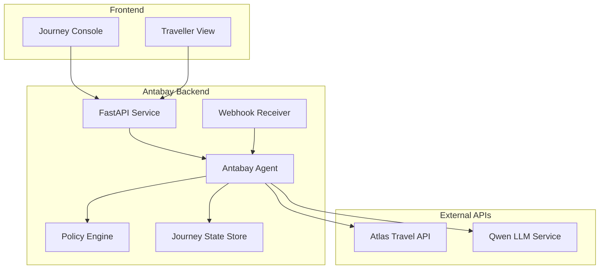
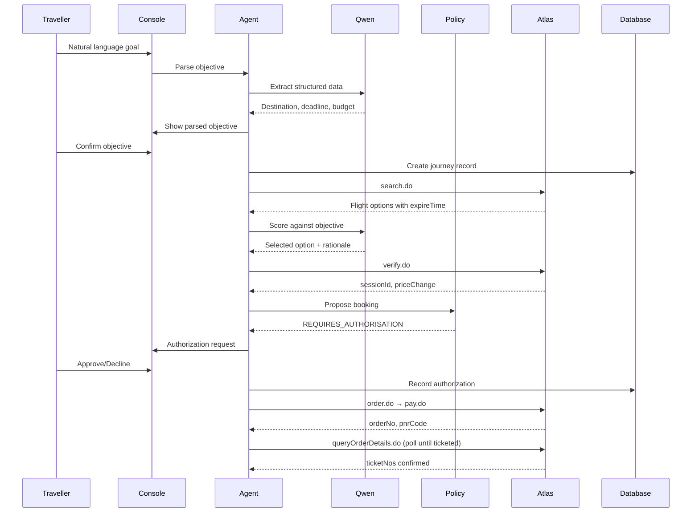
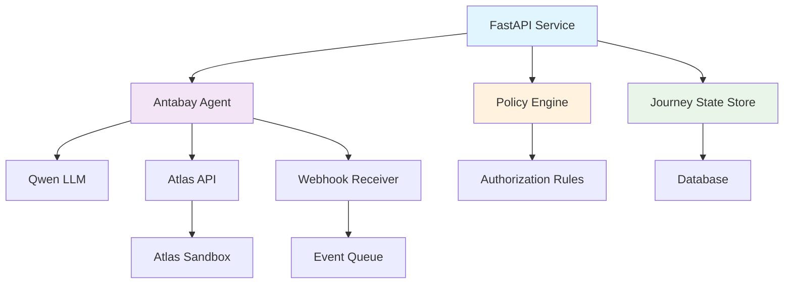

# REST Endpoints

<cite>
**Referenced Files in This Document**
- [specs.md](file://.antabay/specs.md)
- [architecture.md](file://.antabay/architecture.md)
- [atlas-capability-map.md](file://.antabay/atlas-capability-map.md)
- [demo-scenario.md](file://.antabay/demo-scenario.md)
- [plan.md](file://.antabay/plan.md)
</cite>

## Table of Contents
1. [Introduction](#introduction)
2. [Project Structure](#project-structure)
3. [Core Components](#core-components)
4. [Architecture Overview](#architecture-overview)
5. [Detailed Component Analysis](#detailed-component-analysis)
6. [Dependency Analysis](#dependency-analysis)
7. [Performance Considerations](#performance-considerations)
8. [Troubleshooting Guide](#troubleshooting-guide)
9. [Conclusion](#conclusion)

## Introduction

This document provides comprehensive REST API documentation for Antabay's journey management system. Antabay is an intelligent travel booking platform that manages complete flight journeys from initial goal statement through ticketing confirmation, with built-in disruption detection and recovery capabilities.

The system implements a sophisticated journey state machine that handles objective parsing, option scoring, price verification, booking execution, payment processing, and post-ticket monitoring. It features a deterministic authorization policy engine that requires human approval for any action that spends money or makes irreversible changes.

## Project Structure

The Antabay project follows a spec-driven development approach with clear separation between external API contracts and internal journey management logic:



**Diagram sources**
- [architecture.md:21-78](file://.antabay/architecture.md#L21-L78)

**Section sources**
- [architecture.md:1-78](file://.antabay/architecture.md#L1-L78)

## Core Components

### Journey Management System

The core journey management system implements a complete lifecycle from goal to ticketed status:

#### Journey States
- **DRAFT**: Initial state when goal is received
- **OBJECTIVE_CONFIRMED**: After traveller confirms parsed objective  
- **SEARCHING**: During flight search operations
- **OPTIONS_HELD**: When flight options are secured with offer clocks
- **VERIFIED**: After price and availability verification
- **AWAITING_AUTH**: When policy requires human authorization
- **ORDERED**: When order is created but not yet paid
- **PAID**: When payment is processed but not yet ticketed
- **TICKETED**: When tickets are confirmed issued
- **MONITORING**: Post-ticketing monitoring for disruptions

#### Objective Model
The system parses natural language goals into structured objectives containing:
- Origin and destination airports
- Latest acceptable arrival time
- Budget constraints with currency
- Number of travelers
- Hard constraints vs soft preferences
- Stated preferences and exclusions

**Section sources**
- [specs.md:429-531](file://.antabay/specs.md#L429-L531)
- [architecture.md:214-257](file://.antabay/architecture.md#L214-L257)

## Architecture Overview

The Antabay system follows a layered architecture with clear separation of concerns:



**Diagram sources**
- [architecture.md:91-148](file://.antabay/architecture.md#L91-L148)

**Section sources**
- [architecture.md:19-86](file://.antabay/architecture.md#L19-L86)

## Detailed Component Analysis

### Journey Lifecycle Endpoints

#### 1. Create Journey Endpoint
**POST** `/api/v1/journeys`

Creates a new journey from a natural language goal.

**Request Schema:**
```json
{
  "goal": "Get me to Tokyo before 10 AM tomorrow. Under USD 120. No overnight connections.",
  "client_id": "string",
  "session_token": "string"
}
```

**Response Schema:**
```json
{
  "journey_id": "string",
  "status": "DRAFT",
  "objective": {
    "origin": "SEL",
    "destination": "TYO", 
    "latest_arrival": "2026-09-05T10:00:00Z",
    "budget": {"amount": 120, "currency": "USD"},
    "travelers": 1,
    "constraints": ["no_overnight_connections"],
    "preferences": []
  },
  "audit_trail": []
}
```

**Authentication:** Requires `x-atlas-client-id` and `x-atlas-client-secret` headers

**Error Responses:**
- `400`: Invalid goal format or missing required fields
- `401`: Missing or invalid authentication credentials
- `429`: Rate limit exceeded

#### 2. Confirm Objective Endpoint
**PUT** `/api/v1/journeys/{journey_id}/objective`

Confirms the parsed objective after traveler review.

**Request Schema:**
```json
{
  "confirmed": true,
  "modifications": {
    "budget": {"amount": 100, "currency": "USD"}
  }
}
```

**Response Schema:**
```json
{
  "journey_id": "string",
  "status": "OBJECTIVE_CONFIRMED",
  "objective": "Confirmed objective object",
  "next_steps": ["search_flights"]
}
```

#### 3. Search Flights Endpoint
**POST** `/api/v1/journeys/{journey_id}/search`

Initiates flight search based on confirmed objective.

**Request Schema:**
```json
{
  "max_results": 30,
  "include_connections": false,
  "preferred_carriers": ["ZE", "LJ"]
}
```

**Response Schema:**
```json
{
  "options": [
    {
      "routing_identifier": "string",
      "segments": [...],
      "total_price": 90.39,
      "currency": "USD",
      "expire_time": "2026-09-05T09:28:46Z",
      "seat_count": 7,
      "risk_sellout": false
    }
  ],
  "offer_clock_remaining": "7m43s"
}
```

#### 4. Verify Option Endpoint
**POST** `/api/v1/journeys/{journey_id}/verify`

Verifies price and availability for a specific routing.

**Request Schema:**
```json
{
  "routing_identifier": "string_from_search",
  "passengers": [
    {
      "name": "TEST/ONE",
      "passengerType": 0,
      "birthday": "19900101",
      "gender": "M",
      "nationality": "ID"
    }
  ]
}
```

**Response Schema:**
```json
{
  "session_id": "uuid-string",
  "price_change": {
    "is_price_change": false,
    "original_adult_price": 66.43,
    "new_adult_price": 66.43
  },
  "booking_requirement": {...},
  "max_seats": 7
}
```

#### 5. Create Order Endpoint
**POST** `/api/v1/journeys/{journey_id}/order`

Creates a booking order using verified session.

**Request Schema:**
```json
{
  "session_id": "string_from_verify",
  "passengers": [...],
  "contact": {
    "name": "...",
    "email": "...",
    "mobile": "0062-8123456789"
  }
}
```

**Response Schema:**
```json
{
  "order_no": "TESTA20260815172246746",
  "pnr_code": "TZKZYA",
  "total_price": 90.39,
  "currency": "USD",
  "tkt_limit_time": "2026-09-05T17:52:46Z",
  "duplicate_orders": null
}
```

#### 6. Process Payment Endpoint
**POST** `/api/v1/journeys/{journey_id}/pay`

Processes payment for the order.

**Request Schema:**
```json
{
  "order_no": "string_from_order",
  "payment_method": 1
}
```

**Response Schema:**
```json
{
  "order_no": "string",
  "pnr_code": "string",
  "payment_method": 1,
  "status": 0,
  "msg": "success"
}
```

#### 7. Query Order Status Endpoint
**GET** `/api/v1/journeys/{journey_id}/order-status`

Polls for ticketing confirmation.

**Response Schema:**
```json
{
  "order_status": "1",
  "ticket_status": "0",
  "ticket_numbers": [],
  "pay_time": "2026-09-05T10:03:36Z",
  "created_time": "2026-09-05T10:03:00Z",
  "updated_time": "2026-09-05T10:03:36Z",
  "tkt_limit_time": "2026-09-05T17:52:46Z"
}
```

#### 8. Get Journey Status Endpoint
**GET** `/api/v1/journeys/{journey_id}`

Retrieves current journey state and audit trail.

**Response Schema:**
```json
{
  "journey_id": "string",
  "status": "TICKETED",
  "objective": {...},
  "current_state": "MONITORING",
  "audit_trail": [
    {
      "timestamp": "2026-09-05T10:03:00Z",
      "event": "search_completed",
      "details": {...}
    }
  ],
  "authorizations": [
    {
      "action": "spend_money",
      "status": "approved",
      "timestamp": "2026-09-05T10:03:30Z"
    }
  ]
}
```

#### 9. Update Journey Endpoint
**PATCH** `/api/v1/journeys/{journey_id}`

Updates journey metadata or cancels journey.

**Request Schema:**
```json
{
  "action": "cancel",
  "reason": "Customer requested cancellation"
}
```

#### 10. Delete Journey Endpoint
**DELETE** `/api/v1/journeys/{journey_id}`

Permanently deletes a journey and all associated data.

**Response Schema:**
```json
{
  "journey_id": "string",
  "deleted": true,
  "timestamp": "2026-09-05T10:05:00Z"
}
```

### Authorization Request Endpoints

#### 11. Submit Authorization Request
**POST** `/api/v1/journeys/{journey_id}/authorization`

Submits an action requiring human authorization.

**Request Schema:**
```json
{
  "action": "spend_money",
  "description": "Book flight ZE605 for $90.39",
  "cost_delta": 90.39,
  "impact_on_objective": "Meets deadline within budget",
  "alternatives": [...]
}
```

**Response Schema:**
```json
{
  "authorization_id": "string",
  "status": "pending",
  "expires_at": "2026-09-05T10:10:00Z",
  "required_approval": true
}
```

#### 12. Approve/Reject Authorization
**PUT** `/api/v1/journeys/{journey_id}/authorization/{authorization_id}`

Approves or rejects a pending authorization.

**Request Schema:**
```json
{
  "decision": "approve",
  "comments": "Approved - meets all constraints"
}
```

**Response Schema:**
```json
{
  "authorization_id": "string",
  "status": "approved",
  "decision": "approve",
  "timestamp": "2026-09-05T10:04:00Z"
}
```

### Webhook Endpoints

#### 13. Webhook Receiver
**POST** `/webhooks/order.ticketed`

Receives unauthenticated webhook notifications from Atlas.

**Request Schema:**
```json
{
  "cid": "string",
  "type": "order.ticketed",
  "status": -1,
  "data": {
    "order_no": "string",
    "order_status": 2,
    "pax_ticket_infos": [...]
  }
}
```

**Response Schema:**
```json
{
  "received": true,
  "processed": true
}
```

**Section sources**
- [atlas-capability-map.md:40-314](file://.antabay/atlas-capability-map.md#L40-L314)
- [specs.md:429-531](file://.antabay/specs.md#L429-L531)

## Dependency Analysis

The system has well-defined dependencies between components:



**Diagram sources**
- [architecture.md:21-78](file://.antabay/architecture.md#L21-L78)

**Section sources**
- [architecture.md:19-86](file://.antabay/architecture.md#L19-L86)

## Performance Considerations

### Rate Limiting Policies

The system enforces strict rate limiting based on verified Atlas API constraints:

| Endpoint | Rate Limit | Behavior |
|----------|------------|----------|
| `search.do` | 10 QPS | Returns 429 with retryAfter header |
| `verify.do` + `getOffers.do` | 60 QPM | Shared quota across endpoints |
| `seatAvailability.do` + `getLuggage.do` | 60 QPM | Shared quota across endpoints |

### Offer Expiry Management

The system tracks three critical expiry windows:

1. **Offer Expiry**: 7 minutes 43 seconds to 31 minutes (pre-verify)
2. **Session Expiry**: Up to 2 hours (post-verify, pre-order)  
3. **Ticket Limit**: 30 minutes (post-order, pre-ticket)

### Call Budget Enforcement

Each journey has a declared call budget for rate-limited endpoints. The agent cannot exceed this budget and must honor wait instructions returned with rate-limit rejections.

**Section sources**
- [atlas-capability-map.md:119-126](file://.antabay/atlas-capability-map.md#L119-L126)
- [specs.md:370-377](file://.antabay/specs.md#L370-L377)

## Troubleshooting Guide

### Common Error Codes

| Code | Meaning | Resolution |
|------|---------|------------|
| `0` | Success | Continue workflow |
| `318` | Duplicate booking | Reconcile with existing order |
| `800` | Order not exists | Internal error - investigate state |
| `900` | Authentication failed | Check credentials |
| `429` | Rate limit exceeded | Wait for retryAfter duration |

### Authentication Issues

**API Key Authentication:**
- Ensure `x-atlas-client-id` and `x-atlas-client-secret` headers are set correctly
- Credentials are environment-specific (sandbox vs production)
- Client ID must match the client secret configuration

**Session Token Issues:**
- Verify session tokens are obtained from `verify.do` responses
- Sessions expire after ~2 hours
- Always check `expireTime` field for offer validity

### Webhook Handling

Webhooks are unauthenticated and should be treated as hints only:
- Never trust webhook status codes directly
- Always confirm webhook claims against `queryOrderDetails.do`
- Handle duplicate webhooks gracefully
- Log all webhook events for audit purposes

### Debugging Strategies

1. **Audit Trail Review**: Check journey audit trail for complete event history
2. **State Machine Validation**: Verify journey transitions follow allowed paths
3. **Clock Monitoring**: Track offer/session/ticket expiry times
4. **Rate Limit Tracking**: Monitor call budgets per journey
5. **Authorization Logs**: Review all authorization requests and decisions

**Section sources**
- [atlas-capability-map.md:400-416](file://.antabay/atlas-capability-map.md#L400-L416)
- [specs.md:488-496](file://.antabay/specs.md#L488-L496)

## Conclusion

The Antabay REST API provides a comprehensive journey management system that handles the complete flight booking lifecycle with sophisticated state management, authorization controls, and disruption recovery capabilities. The system is designed around verified external API contracts and maintains strict separation between automated actions and those requiring human authorization.

Key strengths include:
- Deterministic authorization policy engine
- Comprehensive audit trail and state tracking
- Robust handling of external API rate limits and expiry
- Untrusted webhook processing with verification
- Clear separation between agent reasoning and policy decisions

The API supports integration patterns for both real-time console interactions and batch processing workflows, making it suitable for various deployment scenarios from single-user applications to large-scale travel platforms.