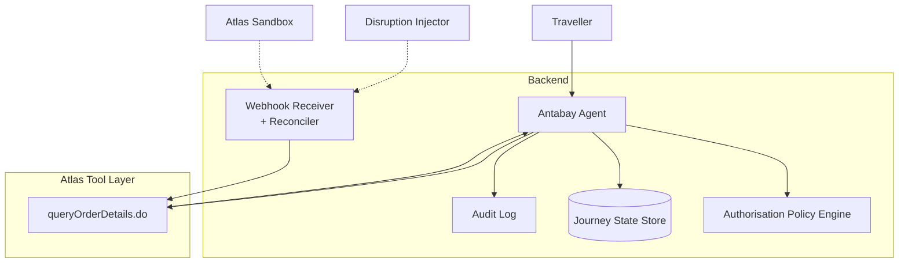
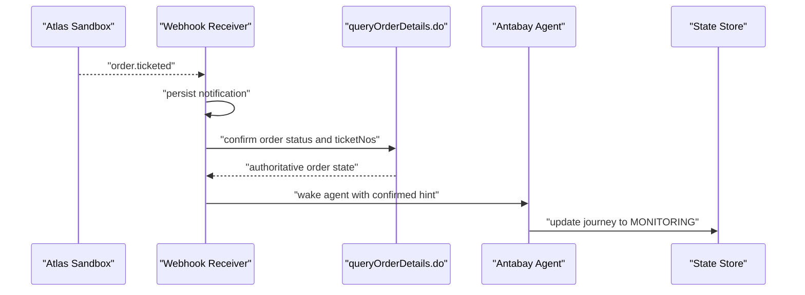
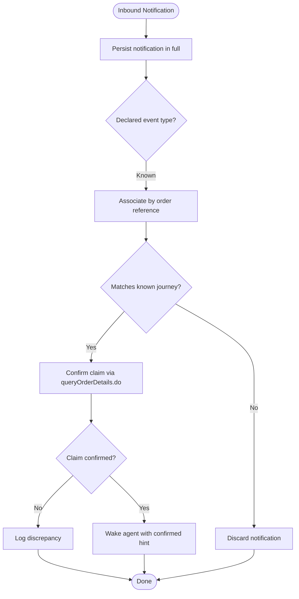
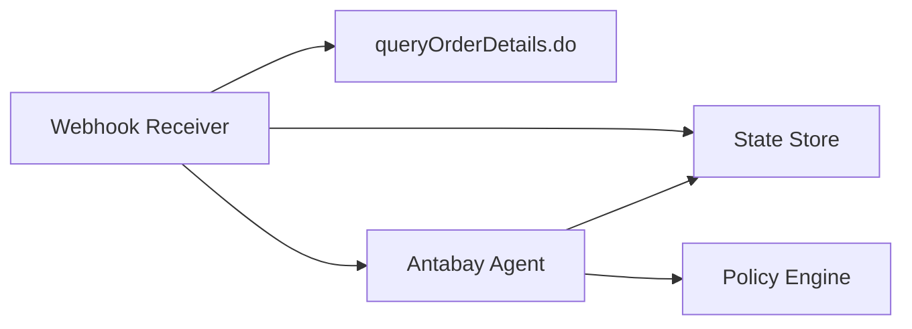

# Webhook Specifications

<cite>
**Referenced Files in This Document**
- [specs.md](file://.antabay/specs.md)
- [architecture.md](file://.antabay/architecture.md)
- [webhook_order_ticketed.json](file://fixtures/atlas/webhook_order_ticketed.json)
- [sel_tyo_search.json](file://fixtures/atlas/sel_tyo_search.json)
- [sel_tyo_verify.json](file://fixtures/atlas/sel_tyo_verify.json)
</cite>

## Table of Contents
1. [Introduction](#introduction)
2. [Project Structure](#project-structure)
3. [Core Components](#core-components)
4. [Architecture Overview](#architecture-overview)
5. [Detailed Component Analysis](#detailed-component-analysis)
6. [Dependency Analysis](#dependency-analysis)
7. [Performance Considerations](#performance-considerations)
8. [Troubleshooting Guide](#troubleshooting-guide)
9. [Conclusion](#conclusion)
10. [Appendices](#appendices)

## Introduction
This document specifies Antabay’s webhook-based event-driven architecture for external notification handling. It focuses on how the system receives, validates, reconciles, and acts upon provider-originated events such as order ticketing confirmations and schedule changes that can disrupt a journey. The specifications are grounded in verified data captured from the Atlas sandbox and enforced by the project’s capability contract.

The webhook receiver is intentionally designed to treat all inbound notifications as untrusted hints. Any state change must be confirmed against the provider’s authoritative query interface before the agent proceeds or updates journey state.

## Project Structure
At a high level:
- The FastAPI backend hosts the webhook receiver and reconciler.
- The Antabay Agent consumes reconciled events to drive search, verification, booking, and recovery workflows.
- The Authorisation Policy Engine gates any action that spends money or cancels bookings.
- The Journey State Store persists objectives, orders, clocks, audit trails, and authorisations.
- The Tool Layer calls Atlas endpoints (search, verify, order, pay, query details).
- The Disruption Injector emits simulated schedule-change events for testing.

**Diagram sources**
- [architecture.md:19-78](file://.antabay/architecture.md#L19-L78)

**Section sources**
- [architecture.md:19-78](file://.antabay/architecture.md#L19-L78)

## Core Components
- Webhook Receiver and Reconciler: Accepts inbound notifications, persists them immediately, routes by declared event type, normalises field types, associates with journeys by order reference, tolerates duplicates, and wakes the agent only after confirming claims via the provider’s query interface.
- Antabay Agent: Consumes reconciled events to evaluate impact against the traveller’s objective, propose recovery actions, and coordinate with policy and Atlas.
- Authorisation Policy Engine: Determines whether an action requires human approval based on cost, reversibility, and constraint impact.
- Journey State Store: Holds durable records of objectives, orders, clocks, and audit trails.
- Atlas Tool Layer: Provides verified endpoints for search, verification, ordering, payment, and querying order details.

Key design rules:
- Webhooks are untrusted hints; queryOrderDetails.do is the truth.
- Every state-changing call is followed by independent verification.
- Duplicate notifications must not duplicate actions.
- Simulated and provider-originated events must remain distinguishable.

**Section sources**
- [specs.md:1396-1504](file://.antabay/specs.md#L1396-L1504)
- [architecture.md:19-78](file://.antabay/architecture.md#L19-L78)

## Architecture Overview
The happy path includes receiving an order.ticketed webhook, reconciling it through queryOrderDetails.do, transitioning the journey into monitoring, and then reacting to disruption signals when they arrive.

**Diagram sources**
- [architecture.md:89-148](file://.antabay/architecture.md#L89-L148)
- [specs.md:1396-1504](file://.antabay/specs.md#L1396-L1504)

## Detailed Component Analysis

### Webhook Receiver and Reconciler
Responsibilities:
- Accept inbound notifications at a public endpoint and acknowledge receipt promptly.
- Persist every inbound notification in full before acting.
- Treat each notification as an untrusted assertion due to lack of authentication on the channel.
- Confirm claims against the provider’s own interface before changing journey state.
- Route on the declared event type and associate notifications with journeys by order reference.
- Tolerate duplicate notifications without duplicating resulting actions.
- Periodically reconcile active journeys independently of notifications.
- Wake the agent only after confirmation.

Event routing and reconciliation flow:

**Diagram sources**
- [specs.md:1396-1504](file://.antabay/specs.md#L1396-L1504)

**Section sources**
- [specs.md:1396-1504](file://.antabay/specs.md#L1396-L1504)

### Event Types and Payloads

#### Order Ticketed
- Purpose: Indicates that tickets have been issued for an order.
- Source: Captured live event envelope stored in fixtures.
- Envelope fields observed:
  - Top-level identifiers and metadata: received_at, method, path, headers, raw_body, json_body.
  - json_body contains:
    - cid: client identifier used by the provider.
    - data:
      - orderNo: order reference associated with the event.
      - orderStatus: numeric status value returned by the provider.
      - paxTicketInfos: array of passenger ticket information including airlinePNRs and ticketNos.
    - status: provider-specific status code.
    - type: event type string, e.g., "order.ticketed".

Validation and processing rules:
- Treat the event as untrusted; do not rely on status or type alone to update state.
- Use orderNo to associate the event with a known journey.
- Normalise field types between notifications and query responses before comparison.
- Confirm ticket issuance by calling queryOrderDetails.do and checking for non-empty ticket numbers.
- Record discrepancies between the notification and authoritative query results.

Payload example reference:
- See fixture for a complete recorded envelope and redacted payload structure.

**Section sources**
- [webhook_order_ticketed.json:1-53](file://fixtures/atlas/webhook_order_ticketed.json#L1-L53)
- [specs.md:1396-1504](file://.antabay/specs.md#L1396-L1504)

#### Schedule Change (Disruption)
- Purpose: Signals a flight schedule change that may violate the traveller’s objective.
- Source: Simulated injection conforms to the same envelope shape as real provider notifications.
- Envelope fields:
  - Mirrors the captured order.ticketed envelope structure for consistency across reception paths.
  - Includes a type indicating a schedule change and data describing revised arrival times or affected segments.
- Validation and processing rules:
  - Treat as untrusted; confirm current order state via queryOrderDetails.do.
  - Evaluate impact against the traveller’s objective (e.g., latest acceptable arrival time).
  - If objective violated, propose recovery actions subject to policy.
  - Mark injected events as simulated and keep them distinguishable from provider-originated events.

Testing note:
- Use the disruption injector to emit schedule-change notifications targeting a specific existing journey and referencing its real order.

**Section sources**
- [architecture.md:152-208](file://.antabay/architecture.md#L152-L208)
- [specs.md:1508-1600](file://.antabay/specs.md#L1508-L1600)

### Authentication and Security
- Channel authentication: The webhook channel is unauthenticated; therefore, all inbound notifications must be treated as untrusted assertions.
- Signature verification: Not specified in the repository; implementers should not assume signature presence or validity.
- Timestamp validation: Not specified in the repository; implementers should not rely solely on timestamps for freshness.
- Secure endpoint configuration: Expose a publicly reachable endpoint for acknowledgements, but enforce strict input validation and persistence before processing.
- Encryption: Not specified in the repository; payloads are handled as provided.

Security posture summary:
- Acknowledge promptly, persist fully, reconcile authoritatively, and never act on assertion alone.

**Section sources**
- [specs.md:1396-1504](file://.antabay/specs.md#L1396-L1504)
- [architecture.md:19-78](file://.antabay/architecture.md#L19-L78)

### Retry Mechanisms and Idempotency
- Delivery guarantees: Delivery is not guaranteed; periodic reconciliation of active journeys is required.
- Duplicate tolerance: The receiver must tolerate duplicate notifications without duplicating actions.
- Idempotent processing:
  - Persist each notification with enough context to detect duplicates (e.g., orderNo + event type + sequence).
  - Before performing state changes, check whether the desired outcome already exists in the state store.
  - Avoid repeating order creation or payment whose outcomes are uncertain; reconcile by querying instead.

Recommended strategies:
- Exponential backoff for retries when contacting the provider during reconciliation or wake-up.
- Deduplicate by stable keys derived from order references and event types.
- Ensure acknowledgement does not depend on verification outcome.

**Section sources**
- [specs.md:1396-1504](file://.antabay/specs.md#L1396-L1504)
- [specs.md:1059-1169](file://.antabay/specs.md#L1059-L1169)

### Data Validation Rules
- Field type normalisation: Normalize types that differ between notifications and query interfaces before comparing values.
- Status interpretation: Do not interpret the notification’s status value as success or failure; use authoritative queries.
- Association rule: Associate notifications with journeys using the order reference; discard those matching no known journey.
- Provenance: Keep simulated and provider-originated events distinguishable in storage and UI.

**Section sources**
- [specs.md:1396-1504](file://.antabay/specs.md#L1396-L1504)

### Testing Strategies
- Recorded fixtures:
  - Use the captured webhook envelope to validate parsing, routing, and reconciliation logic.
  - Reference search and verify responses to ensure downstream flows operate on realistic data shapes.
- Mock servers:
  - Implement a mock Atlas provider to simulate order.ticketed and schedule-change events.
  - Inject schedule-change events via the disruption injector for controlled testing.
- Local development setup:
  - Run the FastAPI service with the webhook receiver enabled.
  - Configure environment variables for Atlas base URL and credentials.
  - Replay recorded event streams through the same interface to validate behavior offline.

Fixture references:
- Webhook envelope: webhook_order_ticketed.json
- Search options: sel_tyo_search.json
- Verification response: sel_tyo_verify.json

**Section sources**
- [specs.md:103-135](file://.antabay/specs.md#L103-L135)
- [webhook_order_ticketed.json:1-53](file://fixtures/atlas/webhook_order_ticketed.json#L1-L53)
- [sel_tyo_search.json:1-800](file://fixtures/atlas/sel_tyo_search.json#L1-L800)
- [sel_tyo_verify.json:1-393](file://fixtures/atlas/sel_tyo_verify.json#L1-L393)

## Dependency Analysis
The webhook receiver depends on:
- Journey State Store for association and deduplication.
- Atlas Tool Layer for authoritative reconciliation via queryOrderDetails.do.
- Antabay Agent for subsequent decision-making and recovery orchestration.
- Authorisation Policy Engine for any proposed recovery actions that spend money or cancel bookings.

**Diagram sources**
- [architecture.md:19-78](file://.antabay/architecture.md#L19-L78)

**Section sources**
- [architecture.md:19-78](file://.antabay/architecture.md#L19-L78)

## Performance Considerations
- Acknowledge quickly to avoid timeouts from the provider.
- Persist notifications synchronously to prevent loss under load.
- Perform reconciliation asynchronously to avoid blocking the receiver.
- Rate-limit reconciliation loops to respect provider constraints and avoid unnecessary load.
- Cache recent reconciliation results briefly to reduce repeated queries for the same order within short intervals.

[No sources needed since this section provides general guidance]

## Troubleshooting Guide
Common issues and resolutions:
- Unknown order reference: Discard the notification if it does not match a known journey; log for observability.
- Contradictory claim: Log discrepancy between notification and authoritative query result; do not trust the notification alone.
- Duplicate delivery: Detect duplicates via stable keys and skip reprocessing.
- Mid-action arrival: Queue or defer processing until the current action completes; reconcile again afterward.
- No notification: Rely on periodic reconciliation to catch missed events.
- Unknown event type: Log and ignore safely; extend routing as new types are discovered.
- Forged notification: Treat as untrusted; only proceed after successful reconciliation.
- Verifying query failure: Retry with backoff; do not resolve state on assertion alone.
- Out-of-order notifications: Process idempotently; reconcile to canonical state.

**Section sources**
- [specs.md:1480-1504](file://.antabay/specs.md#L1480-L1504)

## Conclusion
Antabay’s webhook architecture treats external notifications as untrusted hints and enforces authoritative reconciliation before any state change. This approach ensures resilience against missing, duplicated, or forged events while enabling timely reactions to order ticketing and disruptions. The design integrates tightly with the agent, policy engine, and Atlas tool layer to maintain correctness, safety, and observability throughout the journey lifecycle.

[No sources needed since this section summarizes without analyzing specific files]

## Appendices

### Appendix A: Webhook Payload Reference
- Order ticketed envelope:
  - Contains top-level metadata and a JSON body with client ID, order data, status, and event type.
  - Passenger ticket info includes airline PNRs and ticket numbers.
- Fixture path: webhook_order_ticketed.json

**Section sources**
- [webhook_order_ticketed.json:1-53](file://fixtures/atlas/webhook_order_ticketed.json#L1-L53)

### Appendix B: Supporting Fixtures
- Search options: sel_tyo_search.json
- Verification response: sel_tyo_verify.json

These fixtures support end-to-end testing of search, verification, and downstream flows that interact with webhook-triggered states.

**Section sources**
- [sel_tyo_search.json:1-800](file://fixtures/atlas/sel_tyo_search.json#L1-L800)
- [sel_tyo_verify.json:1-393](file://fixtures/atlas/sel_tyo_verify.json#L1-L393)