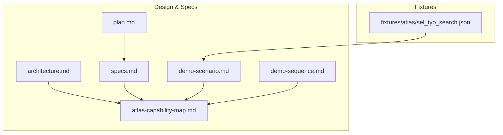
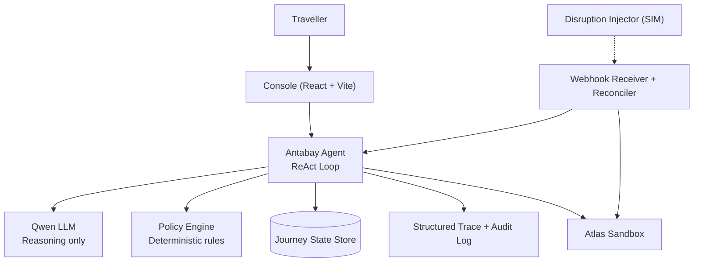
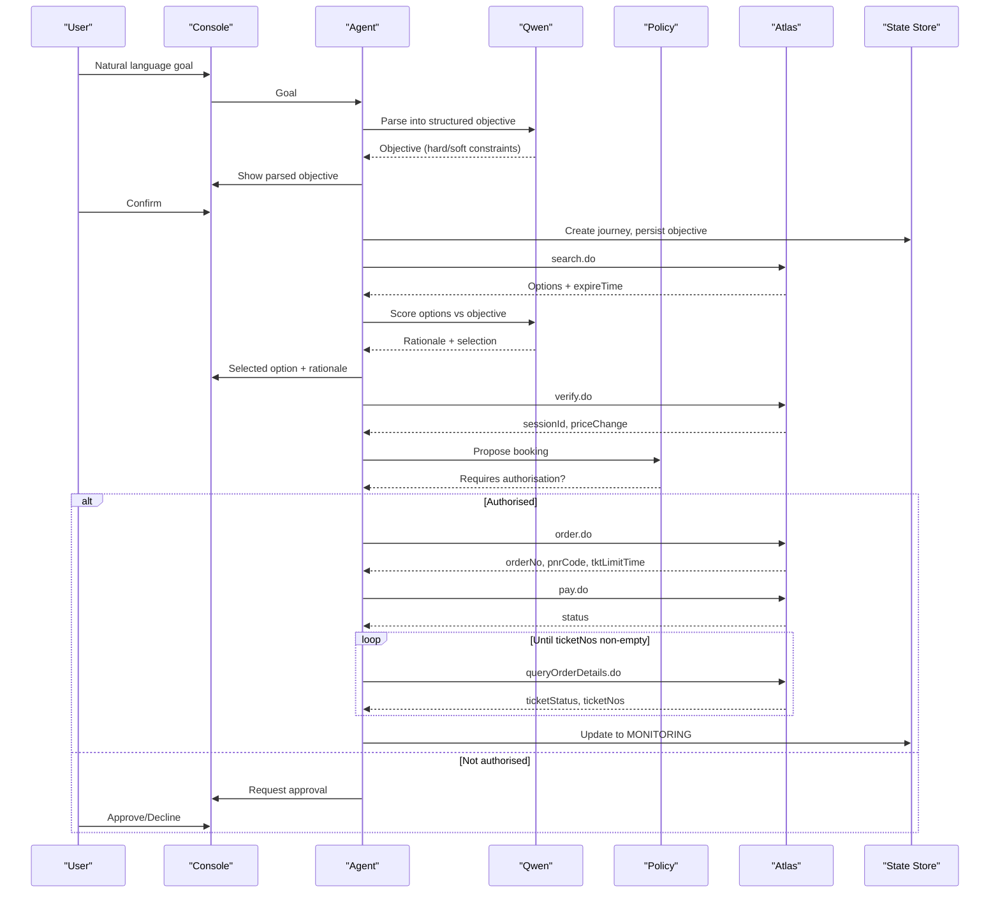
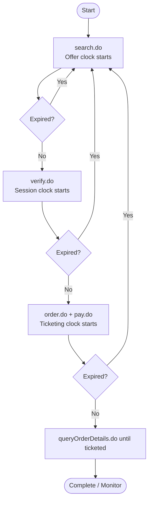
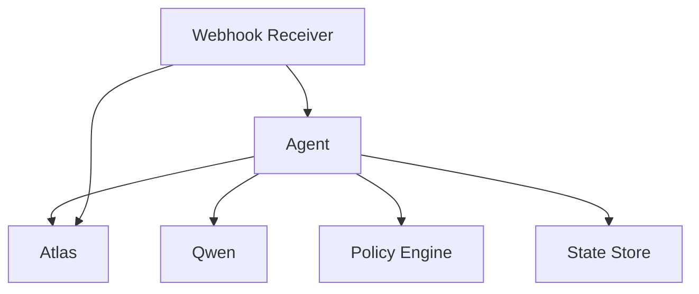
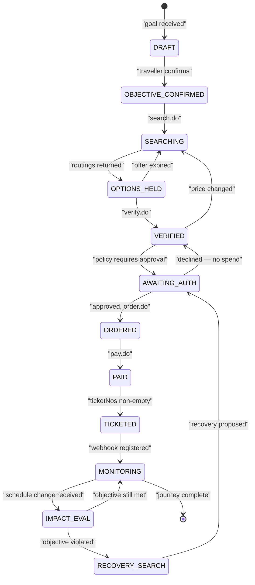

# Agent Engine

<cite>
**Referenced Files in This Document**
- [architecture.md](file://.antabay/architecture.md)
- [specs.md](file://.antabay/specs.md)
- [atlas-capability-map.md](file://.antabay/atlas-capability-map.md)
- [demo-scenario.md](file://.antabay/demo-scenario.md)
- [demo-sequence.md](file://.antabay/demo-sequence.md)
- [plan.md](file://.antabay/plan.md)
- [sel_tyo_search.json](file://fixtures/atlas/sel_tyo_search.json)
</cite>

## Table of Contents
1. [Introduction](#introduction)
2. [Project Structure](#project-structure)
3. [Core Components](#core-components)
4. [Architecture Overview](#architecture-overview)
5. [Detailed Component Analysis](#detailed-component-analysis)
6. [Dependency Analysis](#dependency-analysis)
7. [Performance Considerations](#performance-considerations)
8. [Troubleshooting Guide](#troubleshooting-guide)
9. [Conclusion](#conclusion)
10. [Appendices](#appendices)

## Introduction
This document explains the Antabay Agent Engine’s ReAct loop and autonomous decision-making process for end-to-end flight booking with human oversight. It focuses on the Understand → Observe → Reason → Act → Verify → Adapt cycle, how natural language goals are parsed into structured objectives, how options are searched via Atlas, scored against traveler preferences, booked while maintaining safety checks, and how disruptions trigger recovery. It also documents the integration with Qwen LLM for reasoning tasks, the strict separation between AI reasoning and policy-based authorization decisions, the three-clock system (offer, session, ticketing deadlines), and common issues such as offer staleness, price changes, and state reconciliation.

The content is grounded in verified Atlas sandbox behavior and the project’s specifications and architecture diagrams.

## Project Structure
At a high level, the repository contains:
- Design and specification documents that define the agent’s behavior, external contracts, and demo scenarios
- Verified fixtures from live Atlas sandbox runs used to drive tests and demonstrations
- A concise plan describing delivery priorities and constraints

**Diagram sources**
- [architecture.md:1-279](file://.antabay/architecture.md#L1-L279)
- [specs.md:1-800](file://.antabay/specs.md#L1-L800)
- [atlas-capability-map.md:1-424](file://.antabay/atlas-capability-map.md#L1-L424)
- [demo-scenario.md:1-169](file://.antabay/demo-scenario.md#L1-L169)
- [demo-sequence.md:1-167](file://.antabay/demo-sequence.md#L1-L167)
- [plan.md:1-570](file://.antabay/plan.md#L1-L570)
- [sel_tyo_search.json:1-800](file://fixtures/atlas/sel_tyo_search.json#L1-L800)

**Section sources**
- [architecture.md:1-279](file://.antabay/architecture.md#L1-L279)
- [specs.md:1-800](file://.antabay/specs.md#L1-L800)
- [atlas-capability-map.md:1-424](file://.antabay/atlas-capability-map.md#L1-L424)
- [demo-scenario.md:1-169](file://.antabay/demo-scenario.md#L1-L169)
- [demo-sequence.md:1-167](file://.antabay/demo-sequence.md#L1-L167)
- [plan.md:1-570](file://.antabay/plan.md#L1-L570)
- [sel_tyo_search.json:1-800](file://fixtures/atlas/sel_tyo_search.json#L1-L800)

## Core Components
- Antabay Agent: Implements the ReAct loop (Understand → Observe → Reason → Act → Verify → Adapt). It orchestrates search, scoring, verification, booking, and recovery workflows. It emits events to the console and persists journey state.
- Qwen LLM: Used strictly for reasoning tasks (objective parsing, option scoring, rationale generation). It never decides authority or policy.
- Policy Engine: Deterministic rules that decide whether an action requires human authorization. It enforces spending, voiding, irreversibility, and hard constraint breaches.
- Atlas Tool Layer: Thin adapters over verified endpoints (search.do, verify.do, order.do, pay.do, queryOrderDetails.do, webhook registration). All calls are logged and audited.
- Webhook Receiver + Reconciler: Ingests untrusted hints (e.g., order.ticketed), validates them by querying authoritative data, and wakes the agent to rehydrate state.
- Journey State Store: Durable store for objective, orders, clocks, audit trail, and authorizations. Every wake-up rehydrates from this source.
- Console (Journey UI): Streams agent events, shows parsed objectives, clocks, trace, and authorisation gate.

Key design rules enforced across components:
- Qwen reasons; policy decides authority. The boundary is strict.
- Journey state lives outside the agent; every wake-up rehydrates.
- Webhooks are untrusted hints; queryOrderDetails.do is truth.
- Every travel fact shown to the traveller traces to an Atlas response.

**Section sources**
- [architecture.md:19-86](file://.antabay/architecture.md#L19-L86)
- [specs.md:429-531](file://.antabay/specs.md#L429-L531)
- [atlas-capability-map.md:25-34](file://.antabay/atlas-capability-map.md#L25-L34)

## Architecture Overview
The system composes a FastAPI backend hosting the agent, policy engine, webhook receiver, and disruption injector, integrated with Qwen for reasoning and Atlas for inventory and booking. The console streams agent events to the user.

**Diagram sources**
- [architecture.md:21-78](file://.antabay/architecture.md#L21-L78)

**Section sources**
- [architecture.md:19-86](file://.antabay/architecture.md#L19-L86)

## Detailed Component Analysis

### ReAct Loop: Understand → Observe → Reason → Act → Verify → Adapt
The agent executes a closed-loop workflow around each journey:

- Understand: Parse natural language goal into a structured objective with hard constraints and soft preferences. Present to traveller for confirmation before any downstream action.
- Observe: Search Atlas for real options using confirmed objective parameters. Record offer freshness and scarcity signals.
- Reason: Score options against objective using Qwen. Eliminate hard-constraint violations, rank remaining options, and produce a rationale.
- Act: Propose actions (book, rebook, void/refund) to the policy engine. If required, request human authorization.
- Verify: Confirm outcomes independently (e.g., payment success ≠ ticketed; confirm via queryOrderDetails.do).
- Adapt: On disruption or changed conditions, re-evaluate impact, search alternatives, propose recovery, and repeat until objective is met or abandoned.

**Diagram sources**
- [demo-sequence.md:10-110](file://.antabay/demo-sequence.md#L10-L110)
- [architecture.md:91-148](file://.antabay/architecture.md#L91-L148)

**Section sources**
- [demo-sequence.md:8-110](file://.antabay/demo-sequence.md#L8-L110)
- [architecture.md:89-148](file://.antabay/architecture.md#L89-L148)

### Understanding: Parsing Natural Language Goals
- Input: Free-text goal from the traveller.
- Processing: Qwen extracts origin, destination, latest acceptable arrival time, budget with currency, number of travellers, and stated preferences. Each element is classified as hard constraint or soft preference.
- Output: Structured objective persisted in journey state and presented to the traveller for confirmation before proceeding.

Concrete example from the demo scenario:
- Goal: “Get me to Tokyo before 10 AM tomorrow. Under USD 120. No overnight connections.”
- Parsed elements include destination TYO, deadline 10:00 local, budget USD 120, exclusion of overnight connections, and one adult — all marked as hard constraints.

**Section sources**
- [demo-scenario.md:13-28](file://.antabay/demo-scenario.md#L13-L28)
- [specs.md:457-527](file://.antabay/specs.md#L457-L527)

### Observing: Searching Flight Options with Atlas
- The agent calls search.do using confirmed objective parameters (origin, destination, date, traveller count, currency).
- Responses include routings with pricing, segments, scarcity indicators, and offer expiry windows. Offers may arrive partially aged due to caching.
- The agent records identifiers (e.g., routingIdentifier) exactly as returned and tracks offer freshness.

Observed characteristics:
- Offer expiry windows observed as short as 7 minutes 43 seconds on SEL→TYO.
- Options can include multi-leg itineraries with long layovers that must be evaluated beyond arrival time and price alone.

**Section sources**
- [atlas-capability-map.md:40-98](file://.antabay/atlas-capability-map.md#L40-L98)
- [atlas-capability-map.md:107-150](file://.antabay/atlas-capability-map.md#L107-L150)
- [demo-scenario.md:29-74](file://.antabay/demo-scenario.md#L29-L74)
- [sel_tyo_search.json:1-800](file://fixtures/atlas/sel_tyo_search.json#L1-L800)

### Reasoning: Scoring Alternatives Against Preferences
- The agent asks Qwen to score all returned options against the confirmed objective.
- Hard constraints eliminate non-compliant options; soft preferences rank the remainder.
- The agent produces a rationale explaining why the selected option meets the objective and why other strong candidates were rejected.

Demo highlights:
- TW237 arrives earliest but exceeds budget.
- A connecting itinerary via Busan arrives in time and within budget but violates the no-overnight-connection constraint due to a very long layover.
- ZE605 is selected: meets deadline with margin, cheapest compliant option, nonstop, sufficient seats.

**Section sources**
- [demo-scenario.md:29-66](file://.antabay/demo-scenario.md#L29-L66)
- [specs.md:675-766](file://.antabay/specs.md#L675-L766)

### Acting: Booking Workflow with Human Oversight
- Before committing, the agent verifies the selected option via verify.do to lock price and obtain a session identifier.
- The policy engine evaluates whether the proposed action requires authorization. Spending money triggers a requirement for human approval.
- After approval, the agent places the order, pays, and then confirms ticketing through queryOrderDetails.do rather than trusting payment responses.

Important safeguards:
- Payment success is not proof of ticketing; the agent polls until ticket numbers are present.
- Duplicate bookings are reconciled using provider signals instead of retries.

**Section sources**
- [architecture.md:119-148](file://.antabay/architecture.md#L119-L148)
- [atlas-capability-map.md:236-313](file://.antabay/atlas-capability-map.md#L236-L313)
- [specs.md:268-352](file://.antabay/specs.md#L268-L352)

### Verifying: Independent Confirmation of Outcomes
- After paying, the agent queries order details repeatedly until ticket numbers are populated.
- Webhooks (e.g., order.ticketed) are treated as untrusted hints; the agent always confirms via the authoritative API call.
- Any change in state is recorded in the audit trail and reflected in the console.

**Section sources**
- [atlas-capability-map.md:315-379](file://.antabay/atlas-capability-map.md#L315-L379)
- [demo-sequence.md:48-69](file://.antabay/demo-sequence.md#L48-L69)

### Adapting: Disruption Detection and Recovery
- When a schedule change event arrives (or is simulated), the agent rehydrates the journey, evaluates impact against the objective, and searches for alternatives.
- If the objective is violated, the agent proposes recovery (rebook new leg, potentially void original), which requires human authorization because it spends money and may be irreversible.
- Upon approval, the agent executes recovery and verifies both legs independently before resuming monitoring.

**Section sources**
- [architecture.md:152-208](file://.antabay/architecture.md#L152-L208)
- [demo-sequence.md:71-109](file://.antabay/demo-sequence.md#L71-L109)
- [specs.md:437-531](file://.antabay/specs.md#L437-L531)

### Three-Clock System: Managing Time-Sensitive Operations
The agent tracks three distinct clocks that govern different phases of the booking lifecycle:

- Offer clock: Governed by search response expireTime; typically short and sometimes already partially elapsed when received.
- Session clock: Governed by sessionId after verify; longer but still bounded.
- Ticketing clock: Governed by tktLimitTime after order; a tight window to complete payment and ticketing.

Each expired clock forces the agent back to search or appropriate recovery steps.

**Diagram sources**
- [architecture.md:261-279](file://.antabay/architecture.md#L261-L279)
- [atlas-capability-map.md:304-313](file://.antabay/atlas-capability-map.md#L304-L313)

**Section sources**
- [architecture.md:261-279](file://.antabay/architecture.md#L261-L279)
- [atlas-capability-map.md:304-313](file://.antabay/atlas-capability-map.md#L304-L313)

### Integration with Qwen LLM and Separation from Policy
- Qwen is used exclusively for reasoning: parsing objectives, scoring options, generating rationales, and evaluating disruption impact.
- The policy engine is deterministic and rule-based. It classifies actions as permitted autonomously or requiring human authorization based on criteria like spending money, voiding bookings, irreversibility, and hard constraint breaches.
- The line between reasoning and authorization is strict: Qwen never decides authority; policy does.

**Diagram sources**
- [architecture.md:55-64](file://.antabay/architecture.md#L55-L64)
- [specs.md:489-522](file://.antabay/specs.md#L489-L522)

**Section sources**
- [architecture.md:55-64](file://.antabay/architecture.md#L55-L64)
- [specs.md:489-522](file://.antabay/specs.md#L489-L522)

### Concrete Examples from the Codebase
- Goal processing: The demo scenario defines a locked goal and its parsed objective, including hard constraints and exclusions.
- Search execution: The Atlas capability map documents the search request schema and response envelope, and the fixture file provides a real search response payload.
- Booking workflow: The sequence diagram and architecture describe the full path from verify to order, pay, and ticket confirmation via order query.

References:
- Demo scenario goal and parsed objective
- Atlas search request/response schemas and critical constraints
- Fixture containing real search results

**Section sources**
- [demo-scenario.md:13-74](file://.antabay/demo-scenario.md#L13-L74)
- [atlas-capability-map.md:40-98](file://.antabay/atlas-capability-map.md#L40-L98)
- [sel_tyo_search.json:1-800](file://fixtures/atlas/sel_tyo_search.json#L1-L800)
- [demo-sequence.md:48-69](file://.antabay/demo-sequence.md#L48-L69)

## Dependency Analysis
The agent depends on several external and internal services:

- Qwen LLM: Reasoning only; no policy decisions.
- Policy Engine: Deterministic rules; independent of model outputs.
- Atlas API: Inventory, verification, ordering, payment, and order query.
- Webhook Receiver: Untrusted hints; validated by authoritative queries.
- State Store: Durable persistence of journey state, objectives, clocks, audit trail, and authorizations.

**Diagram sources**
- [architecture.md:21-78](file://.antabay/architecture.md#L21-L78)

**Section sources**
- [architecture.md:19-86](file://.antabay/architecture.md#L19-L86)

## Performance Considerations
- Offer staleness: Offers can arrive partially aged; always compute remaining usable time from current time and re-verify before committing.
- Rate limits: Respect documented QPS/QPM limits and honor wait instructions on rate-limit rejections.
- Currency mixing: Prices and fees may appear in different currencies; do not combine without explicit conversion and never invent rates.
- Call budgets: Enforce per-journey call budgets for rate-limited endpoints to avoid loops and excessive usage.
- Polling cadence: For ticketing confirmation, poll queryOrderDetails.do at reasonable intervals until ticket numbers are present.

[No sources needed since this section provides general guidance]

## Troubleshooting Guide
Common issues and recommended handling:

- Offer expired mid-decision: Return to search; do not act on stale offers.
- Price change detected during verify: Prior human approval becomes invalid; re-propose with updated cost and require fresh authorization.
- Paid but not ticketed: Continue polling queryOrderDetails.do until ticketNos is non-empty; do not assume payment success equals ticketing.
- Duplicate booking rejection: Reconcile using duplicateOrders signal; adopt existing order and resume from its real state.
- Webhook misclassification: Treat webhooks as untrusted hints; always confirm via authoritative API before changing state.
- Silence on authorization: Treat absence of response as refusal; record outcome and take no spend action.

**Section sources**
- [atlas-capability-map.md:107-130](file://.antabay/atlas-capability-map.md#L107-L130)
- [atlas-capability-map.md:236-313](file://.antabay/atlas-capability-map.md#L236-L313)
- [atlas-capability-map.md:315-379](file://.antabay/atlas-capability-map.md#L315-L379)
- [specs.md:489-522](file://.antabay/specs.md#L489-L522)

## Conclusion
The Antabay Agent Engine implements a robust ReAct loop that transforms natural language goals into actionable, verifiable bookings while preserving human oversight. By separating reasoning (Qwen) from authorization (policy), enforcing strict state management, and respecting the three-clock system, the agent ensures safe, transparent, and recoverable operations. The documented flows, fixtures, and specifications provide a clear foundation for implementing custom agent behaviors and extending capabilities while maintaining compliance and safety.

[No sources needed since this section summarizes without analyzing specific files]

## Appendices

### Appendix A: Journey State Machine

**Diagram sources**
- [architecture.md:212-257](file://.antabay/architecture.md#L212-L257)

**Section sources**
- [architecture.md:212-257](file://.antabay/architecture.md#L212-L257)

### Appendix B: Demo Scenario Highlights
- Selection rationale: The agent rejects options that meet naive criteria but violate stated preferences (e.g., overnight connections).
- Freshness pressure: Offers have short lifetimes; re-verification is mandatory before commitment.
- Disruption and recovery: Schedule changes trigger re-search, verification, and recovery proposals requiring human authorization.

**Section sources**
- [demo-scenario.md:29-118](file://.antabay/demo-scenario.md#L29-L118)

### Appendix C: Delivery Plan Notes
- The four-spec plan prioritizes core capabilities: contract and journey model, booking path, console and trace, and disruption/recovery with policy.
- Cut features include mobile view, preemptive risk rules, and ancillaries to focus on MVP completeness.

**Section sources**
- [plan.md:134-173](file://.antabay/plan.md#L134-L173)
- [plan.md:177-531](file://.antabay/plan.md#L177-L531)