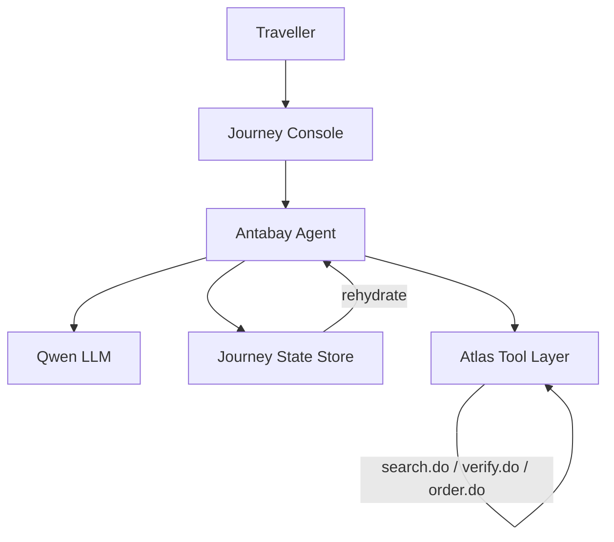
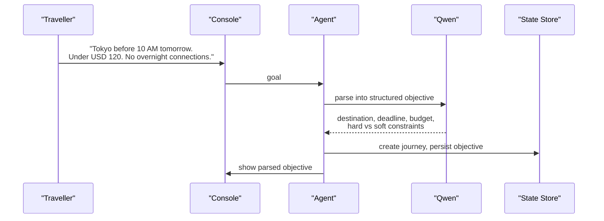
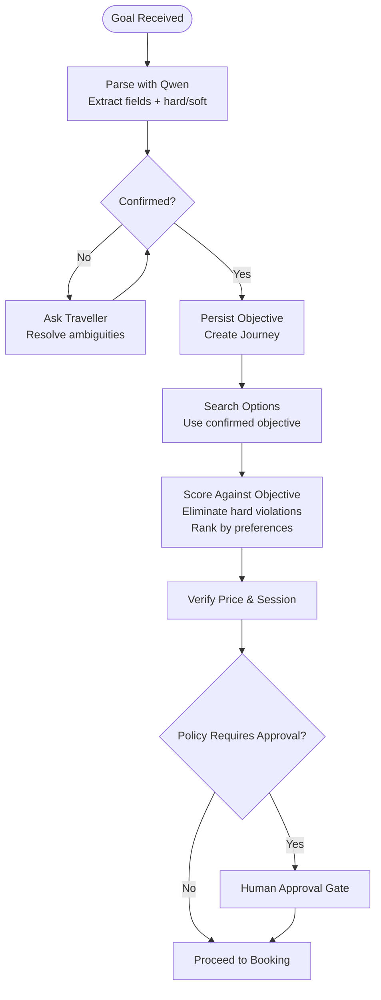
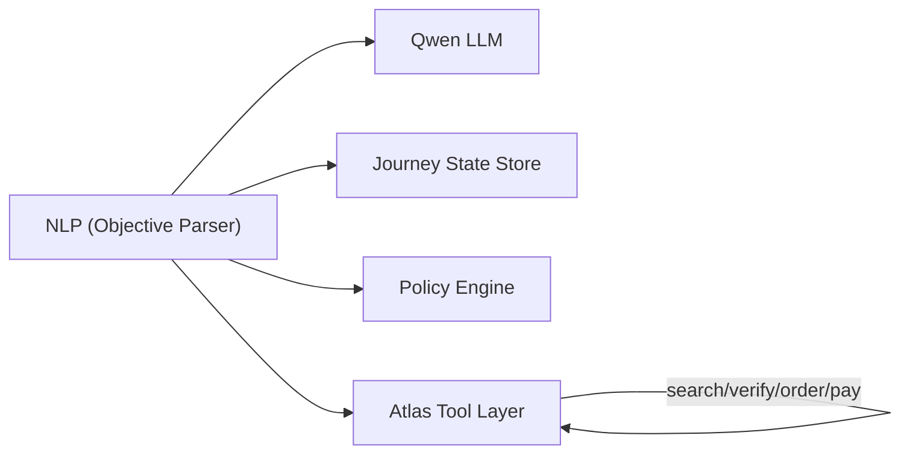

# Natural Language Processing

<cite>
**Referenced Files in This Document**
- [architecture.md](file://.antabay/architecture.md)
- [specs.md](file://.antabay/specs.md)
- [demo-scenario.md](file://.antabay/demo-scenario.md)
- [demo-sequence.md](file://.antabay/demo-sequence.md)
- [sel_tyo_search.json](file://fixtures/atlas/sel_tyo_search.json)
- [sel_tyo_verify.json](file://fixtures/atlas/sel_tyo_verify.json)
</cite>

## Table of Contents
1. [Introduction](#introduction)
2. [Project Structure](#project-structure)
3. [Core Components](#core-components)
4. [Architecture Overview](#architecture-overview)
5. [Detailed Component Analysis](#detailed-component-analysis)
6. [Dependency Analysis](#dependency-analysis)
7. [Performance Considerations](#performance-considerations)
8. [Troubleshooting Guide](#troubleshooting-guide)
9. [Conclusion](#conclusion)
10. [Appendices](#appendices)

## Introduction
This document explains the natural language processing (NLP) component that converts a traveller’s goal into a structured objective used by the rest of the system. It covers how inputs like “Tokyo before 10 AM, under USD 120, no overnight connections” are parsed into machine-readable constraints such as destination, deadline, budget, and hard versus soft constraints. It also documents the integration with Qwen LLM for intent understanding and requirement extraction, shows examples of validation and conflict detection, clarifies when clarification is requested, and describes the structured objective schema and its downstream flow to search and scoring operations.

## Project Structure
The NLP capability is part of the Antabay agent workflow documented in the architecture and specs:
- The agent receives a natural-language goal from the UI and asks Qwen to parse it into a structured objective.
- The parsed objective is persisted as part of the journey state and shown to the traveller for confirmation.
- Downstream components (search, scoring, verification, booking, disruption handling) all operate against this confirmed objective.

**Diagram sources**
- [architecture.md:21-78](file://.antabay/architecture.md#L21-L78)

**Section sources**
- [architecture.md:21-78](file://.antabay/architecture.md#L21-L78)
- [specs.md:429-531](file://.antabay/specs.md#L429-L531)

## Core Components
- Goal intake and parsing: The agent calls Qwen to transform natural language into a structured objective containing origin, destination, latest acceptable arrival time, budget with currency, number of travellers, stated preferences, and per-element hard/soft classification.
- Objective confirmation: The parsed objective is presented to the traveller for confirmation before any downstream action.
- Clarification loop: If elements are absent or ambiguous, the system asks the traveller rather than inferring values.
- Persistence and lifecycle: A durable journey record stores the confirmed objective and state transitions; every external identifier has issue and staleness times tracked.
- Downstream usage: Search uses the confirmed objective to request options; scoring evaluates each option against hard constraints and ranks by soft preferences; verification locks prices; booking proceeds only after policy approval.

Key responsibilities and rules:
- Hard vs soft classification is recorded per element.
- No travel facts are authored, inferred, or defaulted; missing information is requested.
- Parsing must be reproducible for the same input.
- Journey state is the single source of truth; nothing required for correctness lives only in model context or process memory.

**Section sources**
- [specs.md:429-531](file://.antabay/specs.md#L429-L531)
- [specs.md:534-561](file://.antabay/specs.md#L534-L561)

## Architecture Overview
The NLP component integrates tightly with the agent’s ReAct loop and the Qwen reasoning service. The sequence below shows the Understand phase where the goal becomes a structured objective.

**Diagram sources**
- [architecture.md:91-148](file://.antabay/architecture.md#L91-L148)
- [demo-sequence.md:10-29](file://.antabay/demo-sequence.md#L10-L29)

**Section sources**
- [architecture.md:91-148](file://.antabay/architecture.md#L91-L148)
- [demo-sequence.md:10-29](file://.antabay/demo-sequence.md#L10-L29)

## Detailed Component Analysis

### NLP Parsing and Intent Extraction
- Input: Natural-language goal from the traveller via the console.
- Processing: The agent invokes Qwen to extract:
  - Origin and destination
  - Latest acceptable arrival time (deadline), resolved to the appropriate timezone
  - Budget amount and currency
  - Number of travellers
  - Stated preferences (e.g., no overnight connections)
  - Classification of each element as hard constraint or soft preference
- Output: A structured objective persisted in the journey state store and displayed to the traveller for confirmation.

Validation and normalization:
- Relative deadlines are normalized against the correct timezone.
- Currency mismatches between budget and provider pricing are handled consistently using the objective’s currency.
- Ambiguities trigger clarification requests instead of inference.

Examples grounded in the demo scenario:
- The example goal “Get me to Tokyo before 10 AM tomorrow. Under USD 120. No overnight connections.” is parsed into a structured objective with hard constraints on destination, deadline, budget, overnight connection exclusion, and traveller count.

**Section sources**
- [specs.md:429-531](file://.antabay/specs.md#L429-L531)
- [specs.md:534-561](file://.antabay/specs.md#L534-L561)
- [demo-scenario.md:13-28](file://.antabay/demo-scenario.md#L13-L28)
- [demo-sequence.md:21-29](file://.antabay/demo-sequence.md#L21-L29)

### Objective Schema
The structured objective contains:
- Origin: airport code or city
- Destination: airport code or city
- Deadline: latest acceptable arrival time with timezone context
- Budget: numeric amount and currency
- Travellers: count and types (e.g., adults)
- Preferences: free-form or enumerated preferences (e.g., no overnight connections)
- Per-element classification: hard constraint vs soft preference

Constraints and guarantees:
- Every externally issued identifier held by the system tracks issue time and staleness.
- The objective is immutable once confirmed; changes require a new parsing step and reconfirmation.
- The objective is the canonical reference for all later decisions.

**Section sources**
- [specs.md:429-531](file://.antabay/specs.md#L429-L531)
- [specs.md:534-561](file://.antabay/specs.md#L534-L561)

### Constraint Validation and Conflict Detection
- Hard constraints cannot be violated; any option breaking them is rejected with a reason tied to the specific constraint.
- Soft preferences influence ranking but do not cause outright rejection unless they conflict with hard constraints.
- Conflict detection includes:
  - Incompatible deadlines and budgets (e.g., earliest arrival requires exceeding budget)
  - Exclusions conflicting with available routings (e.g., “no overnight connections” eliminates long layovers even if arrival and price pass)
- When no option satisfies all hard constraints, the system reports which constraints could not be satisfied together.

Example from the demo:
- An itinerary arriving at 09:30 with a 10+ hour overnight layover is rejected despite meeting arrival and budget because it violates the “no overnight connections” hard constraint.

**Section sources**
- [specs.md:675-766](file://.antabay/specs.md#L675-L766)
- [specs.md:768-794](file://.antabay/specs.md#L768-L794)
- [demo-scenario.md:41-66](file://.antabay/demo-scenario.md#L41-L66)

### Clarification Requests
When the goal lacks necessary details or is ambiguous:
- Missing budget, deadline, origin/destination, or traveller count triggers a clarification prompt.
- Relative deadlines (“tomorrow morning”) are clarified with timezone resolution.
- Conflicting constraints are surfaced to the traveller for resolution.
- The system never defaults or infers travel facts; it asks.

**Section sources**
- [specs.md:534-561](file://.antabay/specs.md#L534-L561)

### Flow Through Search and Scoring
After confirmation:
- Search: Uses origin, destination, date, and traveller count from the confirmed objective to request real options in the objective’s currency. Each returned option carries identifiers and expiry clocks.
- Scoring: Evaluates each option against the objective:
  - Eliminates options violating hard constraints
  - Ranks remaining options by soft preferences
  - Computes arrival margin against deadline
  - Uses canonical total-price calculation
  - Treats multi-leg connections appropriately and enforces exclusions
  - Incorporates scarcity signals
  - Produces rationale for selection and reasons for high-ranking rejections
- Verification: Locks price and session before proceeding to booking.

Evidence in fixtures:
- Search responses include multiple routings with pricing, segments, baggage rules, and expireTime fields.
- Verified responses include sessionId, routing details, booking requirements, and price change indicators.

**Section sources**
- [specs.md:565-646](file://.antabay/specs.md#L565-L646)
- [specs.md:675-766](file://.antabay/specs.md#L675-L766)
- [sel_tyo_search.json:1-800](file://fixtures/atlas/sel_tyo_search.json#L1-L800)
- [sel_tyo_verify.json:1-393](file://fixtures/atlas/sel_tyo_verify.json#L1-L393)

### Integration with Qwen LLM
- Role: Reasoning-only. Qwen parses objectives, scores options, and produces rationales. It does not decide authority or execute actions.
- Inputs: Natural-language goals and option data; outputs: structured objectives and scored selections with explanations.
- Boundaries: Policy engine decides authority; agent orchestrates; Qwen reasons.

**Diagram sources**
- [architecture.md:21-78](file://.antabay/architecture.md#L21-L78)
- [specs.md:429-531](file://.antabay/specs.md#L429-L531)
- [specs.md:675-766](file://.antabay/specs.md#L675-L766)

**Section sources**
- [architecture.md:21-78](file://.antabay/architecture.md#L21-L78)
- [specs.md:429-531](file://.antabay/specs.md#L429-L531)
- [specs.md:675-766](file://.antabay/specs.md#L675-L766)

## Dependency Analysis
- The NLP component depends on:
  - Qwen LLM for parsing and reasoning
  - Journey state store for persistence and rehydration
  - Policy engine for authorisation decisions
  - Atlas tool layer for search, verification, ordering, and payment
- Coupling:
  - Tight coupling to the confirmed objective schema; downstream modules consume it directly
  - Loose coupling to Qwen through an interface that accepts goals/options and returns structured results
- External dependencies:
  - Atlas sandbox endpoints provide inventory and booking outcomes
  - Webhooks are untrusted hints; authoritative state comes from query endpoints

**Diagram sources**
- [architecture.md:21-78](file://.antabay/architecture.md#L21-L78)

**Section sources**
- [architecture.md:21-78](file://.antabay/architecture.md#L21-L78)

## Performance Considerations
- Parsing and clarification should minimize round-trips; batch questions when possible.
- Use the shortest viable model for parsing to reduce latency and cost while maintaining accuracy.
- Cache repeated parsing prompts and normalizations to improve reproducibility.
- Respect rate limits and call budgets for search and verification endpoints; track offer/session/ticket clocks to avoid wasted work.

[No sources needed since this section provides general guidance]

## Troubleshooting Guide
Common issues and resolutions:
- Ambiguous or incomplete goal: Prompt the traveller for missing fields (budget, deadline, origin/destination, traveller count). Resolve relative deadlines with timezone context.
- Conflicting constraints: Present the conflict and ask the traveller to prioritize or relax preferences.
- No compliant options: Report which hard constraints could not be satisfied together; suggest alternatives or adjustments.
- Stale offers or sessions: Re-search when offer/session expires; surface remaining time to the traveller.
- Webhook reliability: Treat webhooks as hints; always confirm status via authoritative queries before updating state.

**Section sources**
- [specs.md:534-561](file://.antabay/specs.md#L534-L561)
- [specs.md:675-766](file://.antabay/specs.md#L675-L766)
- [architecture.md:80-86](file://.antabay/architecture.md#L80-L86)

## Conclusion
The NLP component transforms traveller goals into durable, structured objectives that drive the entire journey lifecycle. By classifying constraints as hard or soft, validating and detecting conflicts, requesting clarification when needed, and integrating with Qwen for reasoning, it ensures that search and scoring operate against a clear, confirmed set of requirements. The resulting objective is the single source of truth for subsequent steps, enabling transparent, explainable decisions and robust recovery when disruptions occur.

[No sources needed since this section summarizes without analyzing specific files]

## Appendices

### Example: Parsing the Demo Goal
- Input: “Get me to Tokyo before 10 AM tomorrow. Under USD 120. No overnight connections.”
- Parsed objective highlights:
  - Destination: TYO (hard)
  - Deadline: arrive before 10:00 local (hard)
  - Budget: ≤USD 120 (hard)
  - Preference: no overnight connections (hard)
  - Travellers: 1 adult (hard)
- Outcome: Used to search SEL→TYO, score 30 options, reject non-compliant itineraries, and select ZE605.

**Section sources**
- [demo-scenario.md:13-28](file://.antabay/demo-scenario.md#L13-L28)
- [demo-scenario.md:41-66](file://.antabay/demo-scenario.md#L41-L66)

### Example: Option Set and Fixture Fields
- Search fixture demonstrates:
  - Multiple routings with pricing, segments, baggage rules, and expireTime
  - Currency and tax breakdowns
  - Ancillary product elements
- Verified fixture demonstrates:
  - sessionId, routing details, booking requirements, price change indicators
  - Status and message fields

**Section sources**
- [sel_tyo_search.json:1-800](file://fixtures/atlas/sel_tyo_search.json#L1-L800)
- [sel_tyo_verify.json:1-393](file://fixtures/atlas/sel_tyo_verify.json#L1-L393)