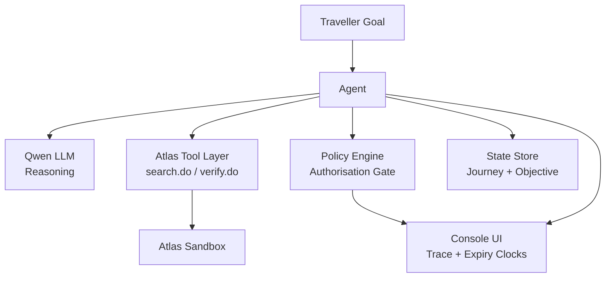
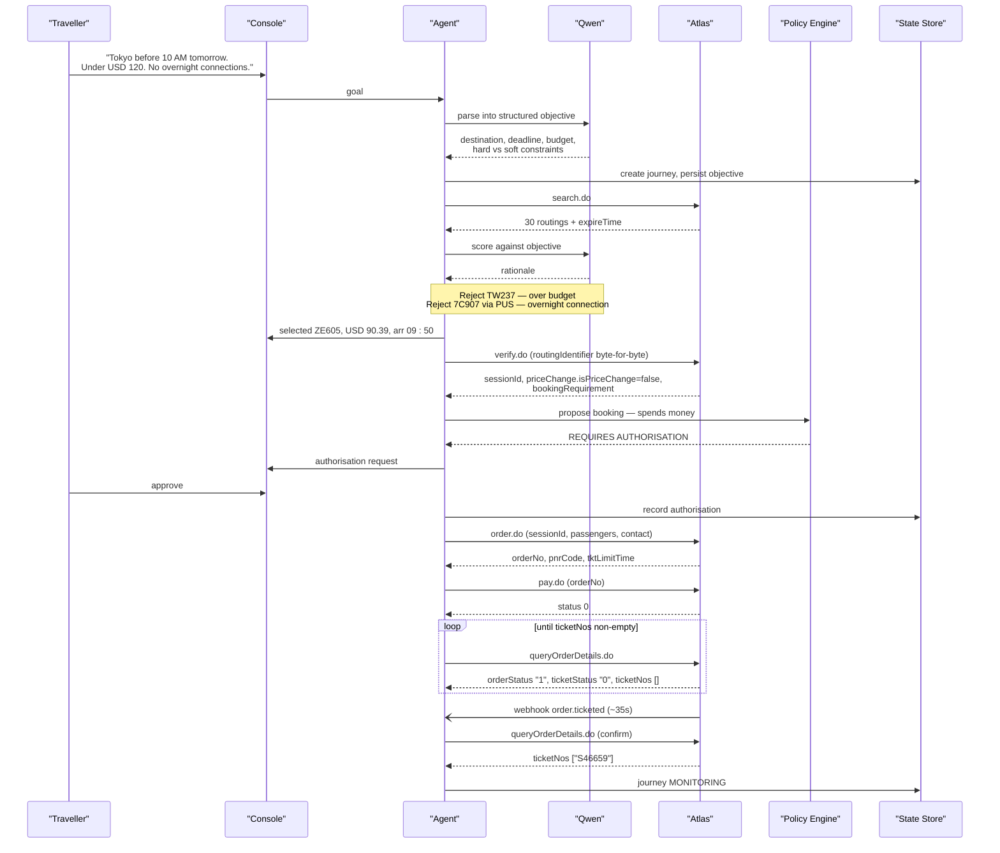
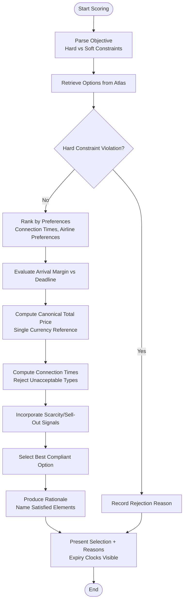
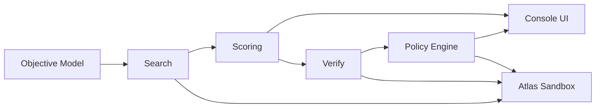

# Option Scoring

<cite>
**Referenced Files in This Document**
- [architecture.md](file://.antabay/architecture.md)
- [specs.md](file://.antabay/specs.md)
- [demo-scenario.md](file://.antabay/demo-scenario.md)
- [demo-sequence.md](file://.antabay/demo-sequence.md)
- [sel_tyo_search.json](file://fixtures/atlas/sel_tyo_search.json)
- [sel_tyo_verify.json](file://fixtures/atlas/sel_tyo_verify.json)
</cite>

## Table of Contents
1. [Introduction](#introduction)
2. [Project Structure](#project-structure)
3. [Core Components](#core-components)
4. [Architecture Overview](#architecture-overview)
5. [Detailed Component Analysis](#detailed-component-analysis)
6. [Dependency Analysis](#dependency-analysis)
7. [Performance Considerations](#performance-considerations)
8. [Troubleshooting Guide](#troubleshooting-guide)
9. [Conclusion](#conclusion)

## Introduction
This document explains the option scoring system that evaluates flight alternatives against a traveller’s objectives. It covers how hard constraints (budget limits, arrival deadlines, excluded connection types) and soft preferences (connection times, airline preferences) are evaluated, how the agent scores options using Qwen LLM reasoning, and how results are presented to users for confirmation. Concrete examples from the demo scenario illustrate why certain options are rejected or selected, including rejecting TW237 for exceeding budget and selecting ZE605 at USD 90.39 arriving at 09:50.

## Project Structure
The project is organized around specifications, architecture diagrams, demo scenarios, and verified fixtures from the Atlas sandbox. The key materials for option scoring are:
- Architecture and sequence diagrams describing the agent loop, Qwen reasoning, policy gating, and Atlas tooling.
- Specification 003 defining the option scoring requirements and behavior.
- Demo scenario and sequence documents providing concrete data and flows.
- Fixture files capturing real search and verify responses used as ground truth.

**Diagram sources**
- [architecture.md:19-78](file://.antabay/architecture.md#L19-L78)
- [demo-sequence.md:10-110](file://.antabay/demo-sequence.md#L10-L110)

**Section sources**
- [architecture.md:19-78](file://.antabay/architecture.md#L19-L78)
- [specs.md:675-766](file://.antabay/specs.md#L675-L766)
- [demo-scenario.md:13-66](file://.antabay/demo-scenario.md#L13-L66)
- [demo-sequence.md:10-110](file://.antabay/demo-sequence.md#L10-L110)

## Core Components
- Objective model: Parses natural language goals into structured objectives with hard vs soft classifications, destination, deadline, budget, and preferences.
- Search: Retrieves real options from Atlas with pricing, schedule, scarcity signals, and expiry windows.
- Scoring: Evaluates each option against the objective, eliminates hard constraint violations, ranks remaining options by preferences, and produces rationale.
- Verification: Confirms price and availability before booking; replaces offer clock with session clock.
- Policy gate: Requires human authorisation for actions that spend money or alter bookings.
- Presentation: Shows selection, rationale, rejections, and expiry clocks in the console.

Key responsibilities per specification:
- Eliminate options violating hard constraints and record reasons.
- Rank remaining options using stated preferences.
- Evaluate arrival time against deadline and express margin.
- Use canonical total price calculation and consistent currency/time references.
- Treat multi-leg connections appropriately and reject unacceptable connection types.
- Incorporate scarcity and sell-out risk signals.
- Produce rationale for selected option and reasons for high-ranking rejections.
- Ensure determinism and explainability.

**Section sources**
- [specs.md:429-531](file://.antabay/specs.md#L429-L531)
- [specs.md:565-646](file://.antabay/specs.md#L565-L646)
- [specs.md:675-766](file://.antabay/specs.md#L675-L766)

## Architecture Overview
The agent orchestrates understanding, observation, reasoning, action, verification, and adaptation. Qwen performs reasoning only; authority decisions go through the policy engine. Every travel fact shown to the traveller traces back to an Atlas response.

**Diagram sources**
- [architecture.md:89-148](file://.antabay/architecture.md#L89-L148)
- [demo-sequence.md:10-110](file://.antabay/demo-sequence.md#L10-L110)

**Section sources**
- [architecture.md:19-78](file://.antabay/architecture.md#L19-L78)
- [architecture.md:89-148](file://.antabay/architecture.md#L89-L148)
- [demo-sequence.md:10-110](file://.antabay/demo-sequence.md#L10-L110)

## Detailed Component Analysis

### Objective Parsing and Constraint Classification
- Natural language goals are parsed into structured objectives with explicit hard vs soft classifications.
- Hard constraints include destination, latest arrival, budget, excluded connection types, and passenger count.
- Soft preferences include connection times, airline preferences, and other trade-offs.
- The parsed objective is presented to the traveller for confirmation before any downstream action.

Examples from the demo:
- “Get me to Tokyo before 10 AM tomorrow. Under USD 120. No overnight connections.”
- Parsed elements: origin SEL, destination TYO, latest arrival 10:00 local, budget USD 120, overnight connections excluded, 1 adult.

**Section sources**
- [specs.md:429-531](file://.antabay/specs.md#L429-L531)
- [demo-scenario.md:13-28](file://.antabay/demo-scenario.md#L13-L28)

### Flight Search and Offer Freshness
- Real options are retrieved from Atlas with pricing, schedule details, scarcity indicators, and expiry windows.
- Offers may arrive partially aged; remaining usable time is computed from current time.
- The console displays offer clocks with time remaining and depleting bars.

Fixture evidence:
- Search returns multiple routings with fields such as currency, adultPrice, adultTax, segments, refreshTime, expireTime, and riskSellout.
- Verified routing includes sessionId, maxSeats, and price change flags.

**Section sources**
- [specs.md:565-646](file://.antabay/specs.md#L565-L646)
- [sel_tyo_search.json:1-334](file://fixtures/atlas/sel_tyo_search.json#L1-L334)
- [sel_tyo_verify.json:1-393](file://fixtures/atlas/sel_tyo_verify.json#L1-L393)

### Scoring Algorithm Against Objective
The scoring process follows these steps:
1. Evaluate every returned option against the confirmed objective.
2. Eliminate any option violating a hard constraint; record which constraint was violated.
3. For remaining options, rank using stated preferences (e.g., connection times, airline preferences).
4. Evaluate arrival time against the deadline and express the result as margin.
5. Compute total cost using the single canonical price calculation; do not mix currencies.
6. Treat multi-leg options as connections; compute connection times and reject unacceptable connection types.
7. Incorporate scarcity and sell-out risk signals into evaluation.
8. Produce rationale for the selected option naming satisfied objective elements.
9. Produce reasons for each rejected option that would otherwise have ranked highly.
10. Report when no option satisfies all hard constraints and state which constraints could not be satisfied together.
11. Do not select an option whose held offer has already expired.
12. Express every scoring input in the objective’s currency and time reference.

Concrete example from the demo:
- Three options arrive before 10:00:
  - TW237: arrives 09:30 but exceeds USD 120 budget → rejected on budget.
  - ZE605: arrives 09:50 at USD 90.39 → selected as cheapest compliant option with seven seats remaining and no connection.
  - LJ201: arrives 09:55 at USD 96.63 → acceptable alternative if needed.
- Connecting itineraries via Busan (7C907 + 7C1151/7C1153) arrive early or next day but violate the “no overnight connections” hard constraint despite passing naive arrival and budget checks.

**Diagram sources**
- [specs.md:675-766](file://.antabay/specs.md#L675-L766)
- [demo-scenario.md:29-66](file://.antabay/demo-scenario.md#L29-L66)

**Section sources**
- [specs.md:675-766](file://.antabay/specs.md#L675-L766)
- [demo-scenario.md:29-66](file://.antabay/demo-scenario.md#L29-L66)

### Integration with Qwen LLM Reasoning
- Qwen is used strictly for reasoning: parsing objectives, scoring options, producing rationales, and evaluating impact during disruptions.
- The agent never delegates authority decisions to Qwen; those go through the deterministic policy engine.
- The console trace shows Qwen interactions and outputs, ensuring transparency and auditability.

Sequence highlights:
- Agent calls Qwen to parse objective and confirm hard vs soft classification.
- Agent calls Qwen to score options and produce rationale.
- During disruption, agent calls Qwen to evaluate impact and recommend recovery.

**Section sources**
- [architecture.md:19-78](file://.antabay/architecture.md#L19-L78)
- [architecture.md:89-148](file://.antabay/architecture.md#L89-L148)
- [demo-sequence.md:10-110](file://.antabay/demo-sequence.md#L10-L110)

### Results Presentation and User Confirmation
- The console presents the selected option with rationale, rejection reasons for high-ranking alternatives, and visible expiry clocks.
- Authorisation requests appear when actions spend money or alter bookings; silence is refusal.
- After execution, both legs are verified through order queries before updating state and resuming monitoring.

Example presentation:
- Selected: ZE605, USD 90.39, arrives 09:50, seven seats, nonstop, 10-minute margin.
- Rejected: TW237 over budget; Busan itineraries violate overnight connection constraint.
- Recovery recommendation: LJ201, +USD 6.24, arrives 09:55, five minutes inside deadline, nine seats.

**Section sources**
- [demo-scenario.md:58-117](file://.antabay/demo-scenario.md#L58-L117)
- [demo-sequence.md:10-110](file://.antabay/demo-sequence.md#L10-L110)

## Dependency Analysis
Scoring depends on several components and external contracts:
- Objective model provides hard vs soft constraints and preference definitions.
- Search provides real options with pricing, schedule, scarcity, and expiry.
- Verify confirms price and availability, replacing offer clock with session clock.
- Policy engine enforces authorisation for spending or irreversible actions.
- Atlas sandbox supplies authoritative data; webhooks are treated as untrusted hints.

**Diagram sources**
- [specs.md:429-531](file://.antabay/specs.md#L429-L531)
- [specs.md:565-646](file://.antabay/specs.md#L565-L646)
- [specs.md:675-766](file://.antabay/specs.md#L675-L766)
- [architecture.md:19-78](file://.antabay/architecture.md#L19-L78)

**Section sources**
- [specs.md:429-531](file://.antabay/specs.md#L429-L531)
- [specs.md:565-646](file://.antabay/specs.md#L565-L646)
- [specs.md:675-766](file://.antabay/specs.md#L675-L766)
- [architecture.md:19-78](file://.antabay/architecture.md#L19-L78)

## Performance Considerations
- Offer freshness: Observed offer windows can be short (e.g., ~7m43s), requiring timely verification before commitment.
- Call budget: Rate-limited endpoints have per-journey call budgets; searches and verifications must be controlled.
- Deterministic scoring: Same option set and objective must yield the same selection and rationale to avoid drift.
- Explainability: Rationales must be concise and verifiable against option data to reduce cognitive load and enable quick user confirmation.

[No sources needed since this section provides general guidance]

## Troubleshooting Guide
Common issues and resolutions:
- No options satisfy all hard constraints: Report which constraints conflict and consider relaxing soft preferences or adjusting objectives with the traveller.
- Expired offers: Re-run search and re-verify before committing; display remaining time prominently.
- Webhook misinterpretation: Treat webhooks as untrusted hints; always confirm state via authoritative API queries.
- Policy authorisation delays: Silence is refusal; record non-response and communicate objective risk without spending.

**Section sources**
- [specs.md:675-766](file://.antabay/specs.md#L675-L766)
- [architecture.md:89-148](file://.antabay/architecture.md#L89-L148)
- [demo-sequence.md:10-110](file://.antabay/demo-sequence.md#L10-L110)

## Conclusion
The option scoring system transforms a traveller’s natural language goal into a durable, structured objective and uses Qwen LLM reasoning to evaluate real flight options against hard constraints and soft preferences. It eliminates non-compliant options, ranks remaining choices, and presents clear rationales and expiry clocks for user confirmation. The policy engine ensures human authority for spending or irreversible actions, while verification and post-action checks guarantee reliability. Concrete examples—rejecting TW237 for exceeding budget and selecting ZE605 at USD 90.39 arriving at 09:50—demonstrate how the system balances cost, schedule adherence, and constraint compliance to deliver defensible selections.