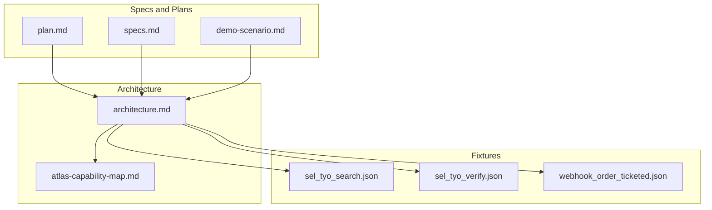
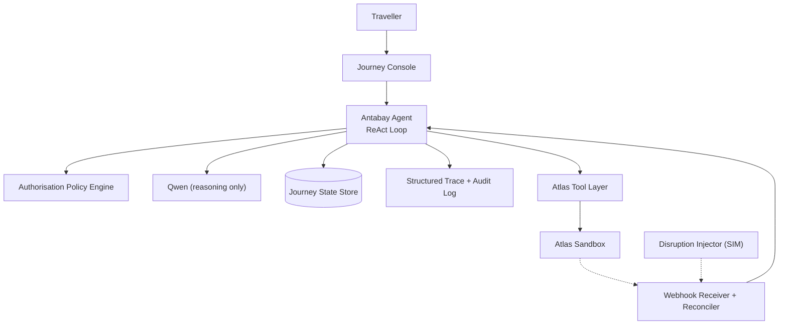
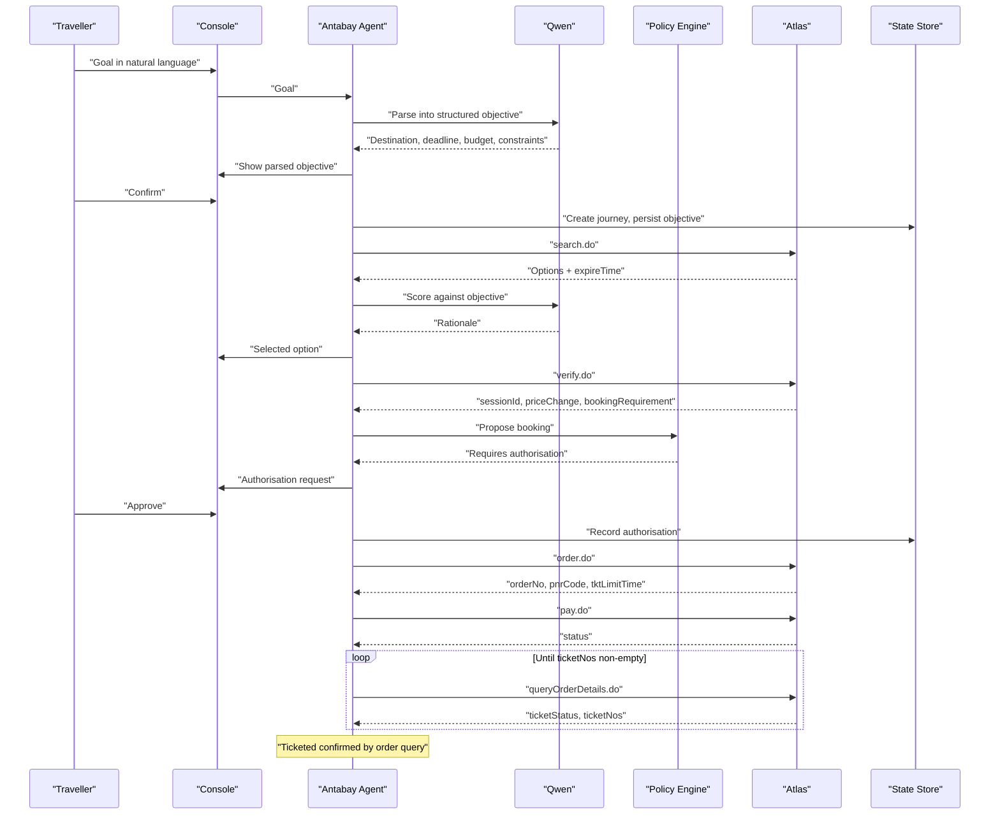
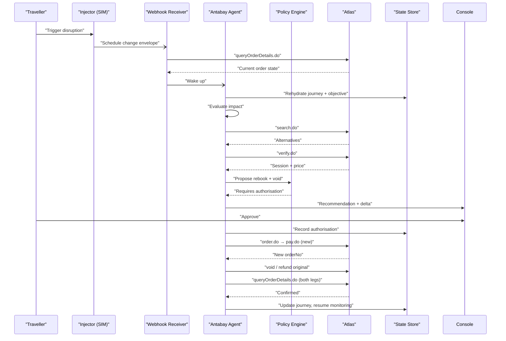
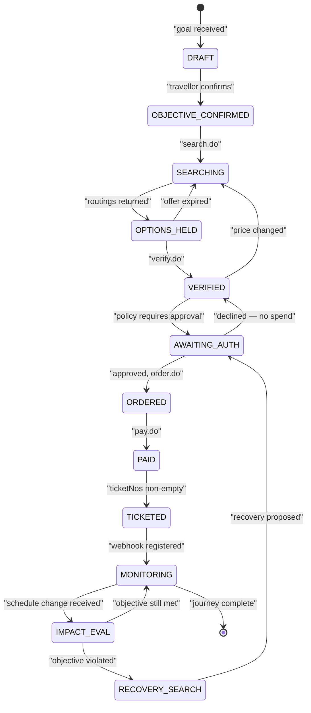
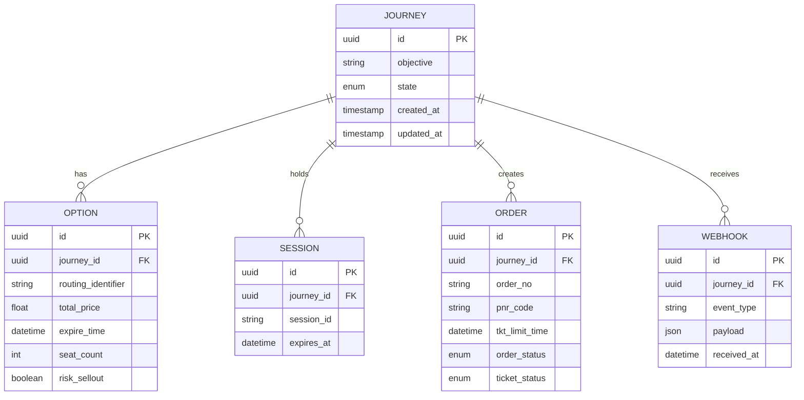
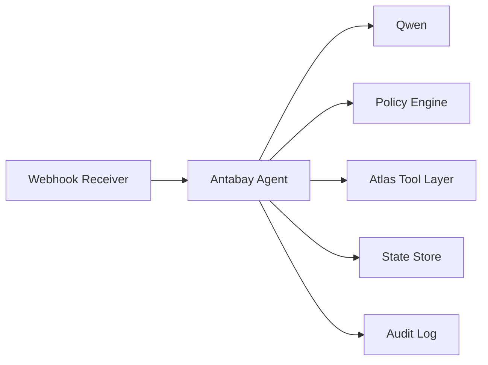

# ReAct Loop Implementation

<cite>
**Referenced Files in This Document**
- [architecture.md](file://.antabay/architecture.md)
- [plan.md](file://.antabay/plan.md)
- [specs.md](file://.antabay/specs.md)
- [demo-scenario.md](file://.antabay/demo-scenario.md)
- [atlas-capability-map.md](file://.antabay/atlas-capability-map.md)
- [sel_tyo_search.json](file://fixtures/atlas/sel_tyo_search.json)
- [sel_tyo_verify.json](file://fixtures/atlas/sel_tyo_verify.json)
- [webhook_order_ticketed.json](file://fixtures/atlas/webhook_order_ticketed.json)
</cite>

## Table of Contents
1. [Introduction](#introduction)
2. [Project Structure](#project-structure)
3. [Core Components](#core-components)
4. [Architecture Overview](#architecture-overview)
5. [Detailed Component Analysis](#detailed-component-analysis)
6. [Dependency Analysis](#dependency-analysis)
7. [Performance Considerations](#performance-considerations)
8. [Troubleshooting Guide](#troubleshooting-guide)
9. [Conclusion](#conclusion)
10. [Appendices](#appendices)

## Introduction
This document explains the ReAct loop that drives the Antabay agent’s autonomous behavior. The loop implements a disciplined Understand → Observe → Reason → Act → Verify → Adapt cycle across a travel booking workflow against the Atlas sandbox. It covers how natural language goals are parsed, how external state is checked, how reasoning is delegated to an LLM while policy decisions remain deterministic, how external calls are made safely, how outcomes are validated independently, and how state is updated consistently. It also documents failure handling patterns such as retries, timeouts, rate limits, and reconciliation.

The project is specification-driven: every capability, endpoint, error code, and clock is verified against live Atlas responses and captured fixtures. The architecture separates reasoning from authority: the LLM reasons; a deterministic policy engine decides whether an action requires human authorization. Webhooks are treated as untrusted hints and always reconciled with authoritative API queries before state changes.

## Project Structure
At a high level, the repository contains:
- Specification and planning documents defining the journey model, contract, console, and recovery behaviors
- Architecture diagrams describing system components, sequences, and state transitions
- A verified capability map for the Atlas travel API
- Fixtures capturing real search, verification, and webhook payloads used for tests and demonstrations

**Diagram sources**
- [architecture.md:19-78](file://.antabay/architecture.md#L19-L78)
- [plan.md:177-570](file://.antabay/plan.md#L177-L570)
- [specs.md:303-800](file://.antabay/specs.md#L303-L800)
- [atlas-capability-map.md:1-130](file://.antabay/atlas-capability-map.md#L1-L130)

**Section sources**
- [architecture.md:19-78](file://.antabay/architecture.md#L19-L78)
- [plan.md:177-570](file://.antabay/plan.md#L177-L570)
- [specs.md:303-800](file://.antabay/specs.md#L303-L800)
- [atlas-capability-map.md:1-130](file://.antabay/atlas-capability-map.md#L1-L130)

## Core Components
The ReAct loop is implemented by the Antabay Agent inside a FastAPI service. Its responsibilities include:
- Understanding: parsing natural language into a structured objective with hard constraints and soft preferences
- Observing: calling Atlas endpoints (search, verify, order details) and receiving webhooks
- Reasoning: using Qwen to score options, propose alternatives, and produce rationales
- Acting: invoking Atlas endpoints (order, pay) within call budgets and respecting rate limits
- Verifying: confirming outcomes via independent queries (e.g., ticketing confirmed only when ticket numbers are present)
- Adapting: updating durable journey state, clocks, audit trail, and authorizations

Key supporting components:
- Authorisation Policy Engine: deterministic rules that classify actions as permitted or requiring human approval
- Webhook Receiver + Reconciler: treats inbound events as untrusted hints and verifies them against authoritative APIs
- Journey State Store: durable storage for objectives, orders, clocks, audit trail, and authorizations
- Structured Trace and Audit Log: append-only records of observations, decisions, calls, and approvals

**Section sources**
- [architecture.md:19-78](file://.antabay/architecture.md#L19-L78)
- [specs.md:429-531](file://.antabay/specs.md#L429-L531)
- [atlas-capability-map.md:303-392](file://.antabay/atlas-capability-map.md#L303-L392)

## Architecture Overview
The system composes UI, backend services, external tools, and provider systems. The agent orchestrates the ReAct loop while remaining bounded by policy and state.

**Diagram sources**
- [architecture.md:19-78](file://.antabay/architecture.md#L19-L78)

**Section sources**
- [architecture.md:19-78](file://.antabay/architecture.md#L19-L78)

## Detailed Component Analysis

### Understand Phase: Natural Language Parsing
- Input: a traveller goal stated in natural language
- Output: a structured objective containing origin, destination, deadline, budget with currency, traveller count, and preferences
- Classification: each element is marked as a hard constraint or soft preference
- Confirmation: the parsed objective is presented to the traveller before any downstream action
- Persistence: a durable journey record is created with a unique identifier, confirmed objective, and initial state

Example scenario:
- Goal: “Get me to Tokyo before 10 AM tomorrow. Under USD 120. No overnight connections.”
- Parsed elements include SEL→TYO, arrival deadline, USD budget, excluded overnight connections, one adult
- The parsed objective is shown to the traveller for confirmation

Implementation anchors:
- Objective extraction and classification requirements
- Journey creation and persistence requirements
- Append-only audit trail for observations and decisions

**Section sources**
- [specs.md:429-531](file://.antabay/specs.md#L429-L531)
- [demo-scenario.md:13-28](file://.antabay/demo-scenario.md#L13-L28)

### Observe Phase: API State Checking
- Search: retrieve real options matching the confirmed objective; record identifiers, prices, scarcity signals, and offer expiry
- Verification: lock pricing and obtain session context; track freshness transition from offer window to session window
- Order query: poll until ticket numbers are non-empty; payment success alone is not proof of ticketing
- Webhooks: receive event notifications; treat as untrusted hints; reconcile with authoritative order query

Clocks tracked:
- Offer expireTime: short and variable, sometimes already partially aged on arrival
- SessionId: post-verify window, longer but bounded
- Ticket limit time: post-order window before ticketing must complete

Example scenario:
- Search returns multiple routings; selected option has a short offer window observed at around 7 minutes 43 seconds
- After verification, the offer clock is replaced by a session clock
- After payment, polling continues until ticket numbers appear; a webhook arrives but is reconciled via order query

**Section sources**
- [atlas-capability-map.md:107-130](file://.antabay/atlas-capability-map.md#L107-L130)
- [atlas-capability-map.md:152-235](file://.antabay/atlas-capability-map.md#L152-L235)
- [atlas-capability-map.md:236-313](file://.antabay/atlas-capability-map.md#L236-L313)
- [atlas-capability-map.md:315-392](file://.antabay/atlas-capability-map.md#L315-L392)
- [sel_tyo_search.json:1-120](file://fixtures/atlas/sel_tyo_search.json#L1-L120)
- [sel_tyo_verify.json:1-120](file://fixtures/atlas/sel_tyo_verify.json#L1-L120)
- [webhook_order_ticketed.json:1-53](file://fixtures/atlas/webhook_order_ticketed.json#L1-L53)

### Reason Phase: LLM-Based Decision Making
- Scoring: evaluate all returned options against the confirmed objective; eliminate those violating hard constraints; rank remaining options using preferences
- Rationale: produce a concise explanation naming satisfied objective elements and reasons for rejecting otherwise strong options
- Alternatives: during disruption, search and verify alternatives; recommend one alternative with cost delta and objective impact
- Boundaries: reasoning never decides authority; policy engine determines whether human authorization is required

Example scenario:
- Three options arrive before the deadline; one exceeds budget; connecting itineraries with long overnight layovers are rejected despite meeting naive checks
- Selection rationale names constraints satisfied and explicitly rejects traps

**Section sources**
- [specs.md:675-766](file://.antabay/specs.md#L675-L766)
- [demo-scenario.md:29-66](file://.antabay/demo-scenario.md#L29-L66)
- [architecture.md:89-148](file://.antabay/architecture.md#L89-L148)

### Act Phase: External API Calls
- Endpoints: search.do, verify.do, order.do, pay.do, queryOrderDetails.do
- Constraints: respect per-journey call budgets; honor rate-limit wait instructions; preserve externally issued identifiers byte-for-byte
- Authority: propose actions to the policy engine; if money is spent, cancellation is irreversible, or a hard constraint is breached, require human authorization

Example scenario:
- After selection, verify the routing, then propose booking; policy requires authorization due to spending money
- Upon approval, create order and initiate payment; do not assume payment success equals ticketing

**Section sources**
- [specs.md:303-398](file://.antabay/specs.md#L303-L398)
- [specs.md:565-646](file://.antabay/specs.md#L565-L646)
- [atlas-capability-map.md:25-39](file://.antabay/atlas-capability-map.md#L25-L39)
- [atlas-capability-map.md:236-313](file://.antabay/atlas-capability-map.md#L236-L313)
- [architecture.md:89-148](file://.antabay/architecture.md#L89-L148)

### Verify Phase: Outcome Validation
- Independent confirmation: ticketing is proven only when order query returns non-empty ticket numbers
- Webhook reconciliation: inbound events are unauthenticated; confirm claims against authoritative order query before changing state
- Duplicate handling: treat duplicate booking rejections as reconcilable; adopt existing order reference instead of retrying

Example scenario:
- Payment succeeds; polling continues until ticket numbers appear
- Webhook arrives indicating ticketed status; agent queries order details to confirm before updating journey state

**Section sources**
- [atlas-capability-map.md:236-313](file://.antabay/atlas-capability-map.md#L236-L313)
- [atlas-capability-map.md:315-392](file://.antabay/atlas-capability-map.md#L315-L392)
- [specs.md:303-398](file://.antabay/specs.md#L303-L398)

### Adapt Phase: State Updates
- Journey state machine: enforce defined transitions between states such as DRAFT, OBJECTIVE_CONFIRMED, SEARCHING, OPTIONS_HELD, VERIFIED, AWAITING_AUTH, ORDERED, PAID, TICKETED, MONITORING, IMPACT_EVAL, RECOVERY_SEARCH
- Clocks: track offer, session, and ticket limit clocks; display remaining time and handle expiration by returning to search
- Audit trail: append-only log of observations, decisions, external calls, and authorizations
- Recovery: upon disruption, rehydrate journey, evaluate impact, search alternatives, propose recovery, obtain authorization, execute, verify both legs, resume monitoring

Example scenario:
- Schedule change pushes arrival past deadline; objective violated; agent searches and verifies alternatives; recommends one with minimal cost delta; obtains authorization; executes new order and void/refund original; verifies both legs; resumes monitoring

**Section sources**
- [architecture.md:212-279](file://.antabay/architecture.md#L212-L279)
- [specs.md:429-531](file://.antabay/specs.md#L429-L531)
- [demo-scenario.md:81-118](file://.antabay/demo-scenario.md#L81-L118)

### ReAct Loop Sequence

**Diagram sources**
- [architecture.md:89-148](file://.antabay/architecture.md#L89-L148)
- [atlas-capability-map.md:236-313](file://.antabay/atlas-capability-map.md#L236-L313)

**Section sources**
- [architecture.md:89-148](file://.antabay/architecture.md#L89-L148)
- [atlas-capability-map.md:236-313](file://.antabay/atlas-capability-map.md#L236-L313)

### Disruption and Recovery Flow

**Diagram sources**
- [architecture.md:152-208](file://.antabay/architecture.md#L152-L208)
- [atlas-capability-map.md:315-392](file://.antabay/atlas-capability-map.md#L315-L392)

**Section sources**
- [architecture.md:152-208](file://.antabay/architecture.md#L152-L208)
- [atlas-capability-map.md:315-392](file://.antabay/atlas-capability-map.md#L315-L392)

### Journey State Machine

**Diagram sources**
- [architecture.md:212-257](file://.antabay/architecture.md#L212-L257)

**Section sources**
- [architecture.md:212-257](file://.antabay/architecture.md#L212-L257)

### Data Models and Fixtures
- Search response includes routings with identifiers, pricing, segments, scarcity signals, and offer clocks
- Verify response provides session context, booking requirement schema, and price change indicators
- Webhook payload carries event type, order data, and ticket information; it is unauthenticated and must be reconciled

**Diagram sources**
- [atlas-capability-map.md:40-130](file://.antabay/atlas-capability-map.md#L40-L130)
- [atlas-capability-map.md:152-313](file://.antabay/atlas-capability-map.md#L152-L313)
- [atlas-capability-map.md:315-392](file://.antabay/atlas-capability-map.md#L315-L392)

**Section sources**
- [sel_tyo_search.json:1-120](file://fixtures/atlas/sel_tyo_search.json#L1-L120)
- [sel_tyo_verify.json:1-120](file://fixtures/atlas/sel_tyo_verify.json#L1-L120)
- [webhook_order_ticketed.json:1-53](file://fixtures/atlas/webhook_order_ticketed.json#L1-L53)

## Dependency Analysis
The ReAct loop depends on several layers:
- LLM dependency for reasoning only; never for authority decisions
- Policy engine for deterministic authorization classification
- Atlas tool layer for search, verify, order, pay, and order query
- Webhook receiver for asynchronous updates; always reconciled with authoritative queries
- Durable state store for journey persistence and audit trails

**Diagram sources**
- [architecture.md:19-78](file://.antabay/architecture.md#L19-L78)

**Section sources**
- [architecture.md:19-78](file://.antabay/architecture.md#L19-L78)

## Performance Considerations
- Rate limits: search has a per-second limit; verify and related endpoints share per-minute limits; honor retry-after instructions and avoid retry loops
- Call budget: enforce per-journey budgets for rate-limited endpoints to prevent runaway loops
- Freshness: offers can expire quickly; re-verify before committing; track three clocks and surface remaining time
- Concurrency: minimize redundant calls; reconcile duplicates server-side rather than retrying
- Model routing: use efficient models for scaffolding; reserve higher tiers for reasoning-heavy steps; run off-peak where possible

**Section sources**
- [atlas-capability-map.md:107-130](file://.antabay/atlas-capability-map.md#L107-L130)
- [specs.md:303-398](file://.antabay/specs.md#L303-L398)
- [plan.md:535-554](file://.antabay/plan.md#L535-L554)

## Troubleshooting Guide
Common issues and resolutions:
- Duplicate booking rejection: read returned duplicate order reference; reconcile against existing order; do not retry
- Auth failures: credentials or account problems; do not retry; check environment configuration
- Rate limiting: observe retry-after; pause calls accordingly; respect per-journey call budget
- Price changes: if price change flag indicates a change, prior human approval is void; re-propose with updated pricing
- Webhook misinterpretation: webhook status semantics differ from API success; route on event type; normalize types; always confirm via order query
- Expired offers or sessions: return to search when clocks expire; surface remaining time in console

Error classification and behavior:
- Retryable: transient network or rate-limit conditions; honor wait instructions
- Reconcilable: duplicate bookings; adopt existing order reference
- Terminal: authentication failures; invalid credentials; stop and report

**Section sources**
- [atlas-capability-map.md:400-415](file://.antabay/atlas-capability-map.md#L400-L415)
- [specs.md:303-398](file://.antabay/specs.md#L303-L398)
- [atlas-capability-map.md:152-235](file://.antabay/atlas-capability-map.md#L152-L235)
- [atlas-capability-map.md:315-392](file://.antabay/atlas-capability-map.md#L315-L392)

## Conclusion
The Antabay ReAct loop implements a robust, specification-driven automation for travel booking and recovery. It parses natural language goals into durable objectives, observes external state through verified APIs, reasons with an LLM under strict boundaries, acts via controlled external calls, verifies outcomes independently, and adapts state deterministically. Failure modes are handled gracefully through reconciliation, rate-limit compliance, and explicit authorization gates. The result is a transparent, auditable, and resilient agent that protects the traveller’s objective end-to-end.

## Appendices

### Happy Path Summary
- Parse and confirm objective
- Search and score options
- Verify selected option
- Propose booking; obtain authorization
- Create order and pay
- Poll until ticketed; confirm via order query
- Register monitoring; resume lifecycle

**Section sources**
- [architecture.md:89-148](file://.antabay/architecture.md#L89-L148)
- [demo-scenario.md:76-118](file://.antabay/demo-scenario.md#L76-L118)

### Disruption Summary
- Receive schedule change hint
- Reconcile with authoritative order query
- Evaluate impact against objective
- Search and verify alternatives
- Recommend with cost delta and objective impact
- Obtain authorization; execute recovery
- Verify both legs; resume monitoring

**Section sources**
- [architecture.md:152-208](file://.antabay/architecture.md#L152-L208)
- [demo-scenario.md:81-118](file://.antabay/demo-scenario.md#L81-L118)