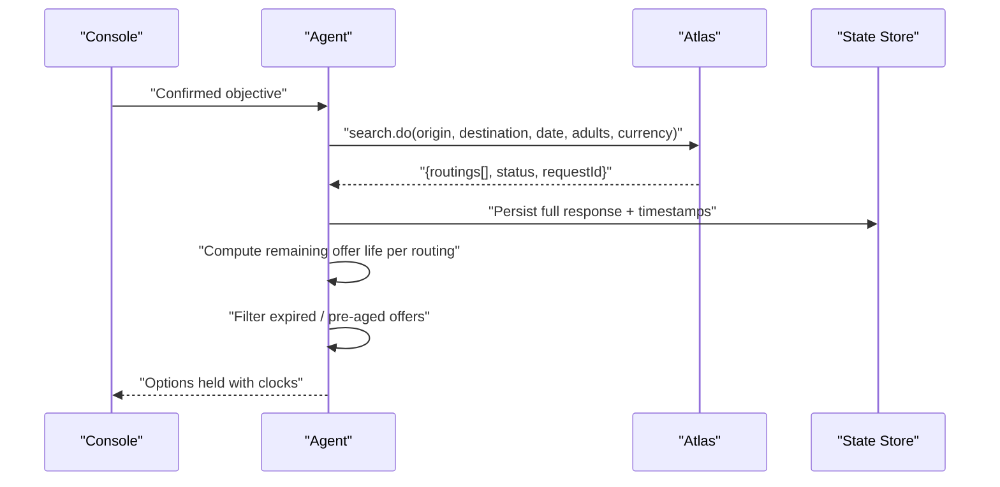
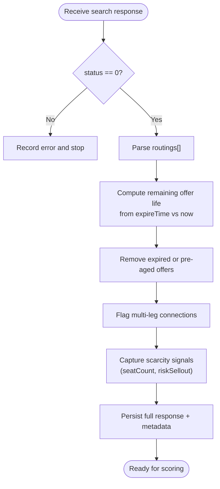
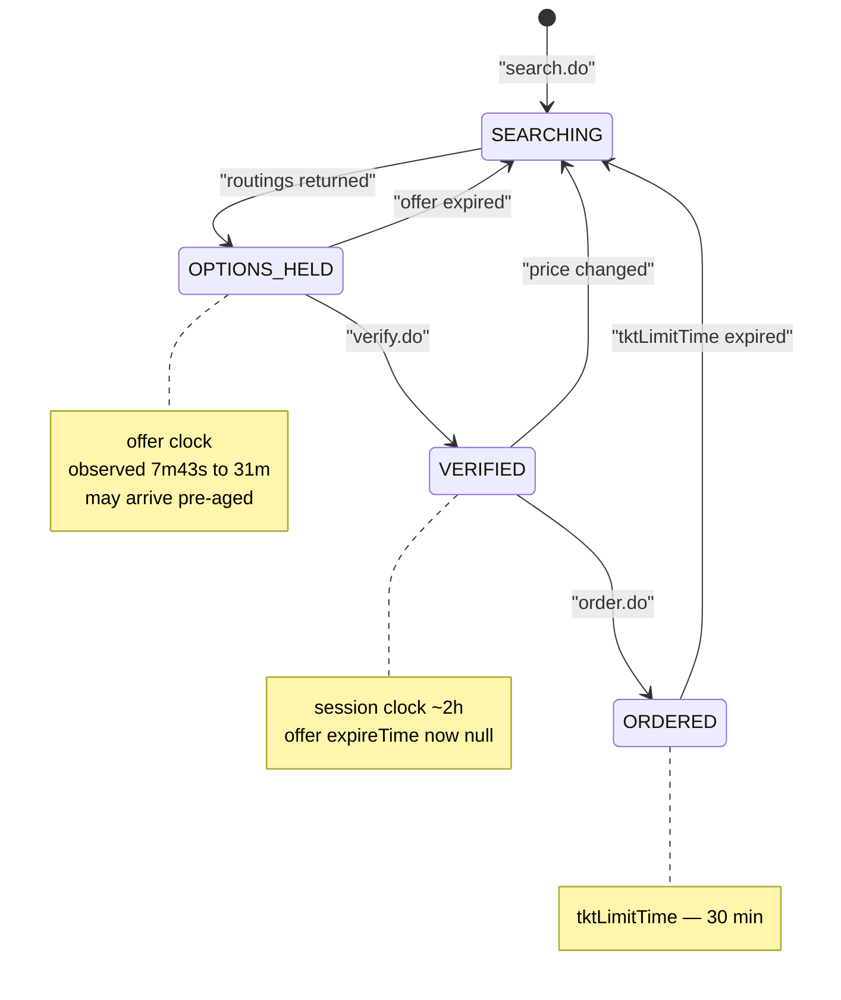
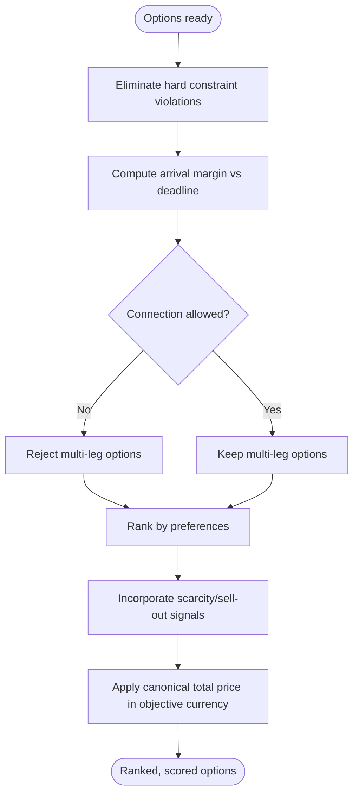
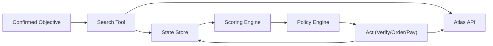

# Search Execution

<cite>
**Referenced Files in This Document**
- [architecture.md](file://.antabay/architecture.md)
- [specs.md](file://.antabay/specs.md)
- [atlas-capability-map.md](file://.antabay/atlas-capability-map.md)
- [sel_tyo_search.json](file://fixtures/atlas/sel_tyo_search.json)
- [sel_tyo_verify.json](file://fixtures/atlas/sel_tyo_verify.json)
</cite>

## Table of Contents
1. [Introduction](#introduction)
2. [Project Structure](#project-structure)
3. [Core Components](#core-components)
4. [Architecture Overview](#architecture-overview)
5. [Detailed Component Analysis](#detailed-component-analysis)
6. [Dependency Analysis](#dependency-analysis)
7. [Performance Considerations](#performance-considerations)
8. [Troubleshooting Guide](#troubleshooting-guide)
9. [Conclusion](#conclusion)

## Introduction
This document explains the flight search execution workflow that transforms a confirmed traveller objective into actionable, time-bounded searches against the Atlas API. It covers how search queries are constructed from parsed objectives, how results are stored and aged, how offers expire under the three-clock system, and how results are prepared for scoring against preferences. It also documents handling of empty or failed search outcomes and the integration points with verification, booking, and monitoring phases.

## Project Structure
The repository contains specification and contract documentation plus live fixtures captured from the Atlas sandbox. The search workflow is defined by:
- The verified Atlas capability map (endpoints, request/response shapes, constraints, clocks).
- Feature specifications describing search behavior, offer freshness, and error handling.
- Architecture diagrams showing the agent’s ReAct loop, tool layer, and state store.
- Fixtures demonstrating real search and verify responses used as seeds for tests.

```mermaid
graph TB
subgraph "Specs and Contract"
A["specs.md"]
B["atlas-capability-map.md"]
end
subgraph "Architecture"
C["architecture.md"]
end
subgraph "Fixtures"
D["sel_tyo_search.json"]
E["sel_tyo_verify.json"]
end
A --> B
C --> B
D --> B
E --> B
```



**Diagram sources**
- [specs.md:565-646](file://.antabay/specs.md#L565-L646)
- [atlas-capability-map.md:40-125](file://.antabay/atlas-capability-map.md#L40-L125)
- [architecture.md:19-86](file://.antabay/architecture.md#L19-L86)
- [sel_tyo_search.json:1-334](file://fixtures/atlas/sel_tyo_search.json#L1-L334)
- [sel_tyo_verify.json:1-393](file://fixtures/atlas/sel_tyo_verify.json#L1-L393)

**Section sources**
- [specs.md:565-646](file://.antabay/specs.md#L565-L646)
- [atlas-capability-map.md:40-125](file://.antabay/atlas-capability-map.md#L40-L125)
- [architecture.md:19-86](file://.antabay/architecture.md#L19-L86)

## Core Components
- Objective model and confirmation: structured fields extracted from natural language, classified as hard constraints or soft preferences, then confirmed before any external calls.
- Search tooling: constructs and executes Atlas search.do requests using origin, destination, date, travellers, and currency; records identifiers and freshness metadata.
- Offer clock management: tracks per-offer expireTime, computes remaining usable time at current moment, and invalidates expired options before scoring or verification.
- Result storage and preparation: persists full search responses, normalizes fields, flags multi-leg connections, scarcity signals, and prepares data for scoring.
- Error and rate-limit handling: treats zero-option results as valid, honors provider wait instructions, and avoids retries during rate limits.

**Section sources**
- [specs.md:565-646](file://.antabay/specs.md#L565-L646)
- [atlas-capability-map.md:40-125](file://.antabay/atlas-capability-map.md#L40-L125)
- [architecture.md:89-148](file://.antabay/architecture.md#L89-L148)

## Architecture Overview
The agent runs a ReAct loop: Understand → Observe → Reason → Act → Verify → Adapt. For search execution:
- The agent calls search.do with parameters derived from the confirmed objective.
- Atlas returns routings with per-offer expireTime and refreshTime.
- The agent stores results, computes remaining offer lifetime, filters out expired offers, and prepares them for scoring.
- If no options remain, the agent reports “no options” without error.
- Rate limits are honored via explicit wait instructions; no retry loops.



**Diagram sources**
- [architecture.md:89-148](file://.antabay/architecture.md#L89-L148)
- [atlas-capability-map.md:40-125](file://.antabay/atlas-capability-map.md#L40-L125)
- [specs.md:565-646](file://.antabay/specs.md#L565-L646)

## Detailed Component Analysis

### Search Query Construction
- Parameters originate from the confirmed objective: origin, destination, travel date, adult/child/infant counts, and currency.
- Currency must be explicitly set to USD in the sandbox environment.
- Optional filters include airports and carrier codes; omitting carriers returns all available.
- RequestSource is recorded for traceability.

Examples of parameter construction are grounded in the verified schema and observed values. See the referenced sections for exact field names and constraints.

**Section sources**
- [atlas-capability-map.md:40-59](file://.antabay/atlas-capability-map.md#L40-L59)
- [specs.md:596-603](file://.antabay/specs.md#L596-L603)

### Search Response Handling and Storage
- The response envelope includes routings and a status code; success is determined by status == 0, not HTTP status alone.
- Each routing carries identifiers (fid, routingIdentifier), pricing components, segment lists, baggage rules, ancillary support, and freshness fields (refreshTime, expireTime).
- Multi-leg options are identified by more than one segment; these are flagged for connection evaluation later.
- Scarcity signals include seatCount and riskSellout per segment.
- Full responses are persisted for audit and test fixtures.



**Diagram sources**
- [atlas-capability-map.md:61-98](file://.antabay/atlas-capability-map.md#L61-L98)
- [sel_tyo_search.json:1-334](file://fixtures/atlas/sel_tyo_search.json#L1-L334)

**Section sources**
- [atlas-capability-map.md:61-98](file://.antabay/atlas-capability-map.md#L61-L98)
- [sel_tyo_search.json:1-334](file://fixtures/atlas/sel_tyo_search.json#L1-L334)

### Three-Clock System and Offer Expiration
- Offers have short, variable lifetimes observed between 7 minutes 43 seconds and 31 minutes; they may arrive partially aged due to caching.
- After verification, the offer window is replaced by a session window (~2 hours) governed by sessionId.
- Post-order, a ticketing limit window (tktLimitTime) applies (~30 minutes).
- All expirations are tracked in state and displayed in the console with time remaining; each expiry sends the journey back to search.



**Diagram sources**
- [architecture.md:212-278](file://.antabay/architecture.md#L212-L278)
- [atlas-capability-map.md:107-125](file://.antabay/atlas-capability-map.md#L107-L125)
- [atlas-capability-map.md:304-313](file://.antabay/atlas-capability-map.md#L304-L313)

**Section sources**
- [architecture.md:212-278](file://.antabay/architecture.md#L212-L278)
- [atlas-capability-map.md:107-125](file://.antabay/atlas-capability-map.md#L107-L125)
- [atlas-capability-map.md:304-313](file://.antabay/atlas-capability-map.md#L304-L313)

### Result Filtering and Preparation for Scoring
- Hard constraints eliminate non-compliant options; violations are recorded.
- Arrival deadlines are evaluated as margins relative to the latest acceptable arrival.
- Connections are rejected when excluded by preferences, regardless of arrival feasibility.
- Scarcity and sell-out risk signals influence ranking but do not override hard constraints.
- Total price uses the canonical formula; currency mixing is avoided.



**Diagram sources**
- [specs.md:675-766](file://.antabay/specs.md#L675-L766)
- [atlas-capability-map.md:99-105](file://.antabay/atlas-capability-map.md#L99-L105)

**Section sources**
- [specs.md:675-766](file://.antabay/specs.md#L675-L766)
- [atlas-capability-map.md:99-105](file://.antabay/atlas-capability-map.md#L99-L105)

### Handling Empty Results and Search Failures
- Zero options returned is treated as a valid outcome; the system reports no options were found rather than raising an error.
- Provider errors and malformed bodies are handled without fabricating travel facts.
- Rate limits return 429 with retryAfter; the system waits the instructed interval and does not retry prematurely.

**Section sources**
- [specs.md:622-638](file://.antabay/specs.md#L622-L638)
- [specs.md:649-671](file://.antabay/specs.md#L649-L671)
- [atlas-capability-map.md:119-121](file://.antabay/atlas-capability-map.md#L119-L121)

### Integration with Verification and Booking
- After selection, the agent verifies the chosen option using the exact routingIdentifier from search.
- Verify replaces the short offer clock with a longer session clock; price changes invalidate prior approvals.
- Order creation issues a PNR and starts the ticketing limit clock; payment success does not equal ticketed status.
- Ticketing is confirmed only when order query returns non-empty ticket numbers.

```mermaid
sequenceDiagram
participant AG as "Agent"
participant AT as "Atlas"
AG->>AT : "verify.do(routingIdentifier)"
AT-->>AG : "{sessionId, routing, priceChange, ...}"
Note over AG : "Offer clock replaced by session clock"
AG->>AT : "order.do(sessionId, passengers, contact)"
AT-->>AG : "{orderNo, pnrCode, tktLimitTime, ...}"
Note over AG : "PNR issued; ticketing limit starts"
AG->>AT : "pay.do(orderNo)"
AT-->>AG : "payment status"
loop until ticketNos non-empty
AG->>AT : "queryOrderDetails.do(orderNo)"
AT-->>AG : "ticketStatus, ticketNos[]"
end
```

**Diagram sources**
- [architecture.md:89-148](file://.antabay/architecture.md#L89-L148)
- [atlas-capability-map.md:152-313](file://.antabay/atlas-capability-map.md#L152-L313)

**Section sources**
- [architecture.md:89-148](file://.antabay/architecture.md#L89-L148)
- [atlas-capability-map.md:152-313](file://.antabay/atlas-capability-map.md#L152-L313)

## Dependency Analysis
Search execution depends on:
- Confirmed objective (origin, destination, date, travellers, budget, preferences).
- Verified Atlas contract (endpoints, schemas, constraints, clocks).
- State store (journey record, audit trail, held identifiers with issue/expiry times).
- Policy engine (authorisation gates for spending actions).
- Webhook receiver and reconciler (untrusted hints validated by authoritative queries).



**Diagram sources**
- [architecture.md:19-86](file://.antabay/architecture.md#L19-L86)
- [specs.md:565-646](file://.antabay/specs.md#L565-L646)
- [atlas-capability-map.md:40-125](file://.antabay/atlas-capability-map.md#L40-L125)

**Section sources**
- [architecture.md:19-86](file://.antabay/architecture.md#L19-L86)
- [specs.md:565-646](file://.antabay/specs.md#L565-L646)
- [atlas-capability-map.md:40-125](file://.antabay/atlas-capability-map.md#L40-L125)

## Performance Considerations
- Respect provider rate limits: search.do up to 10 QPS; verify.do and getOffers.do share 60 QPM; seatAvailability.do and getLuggage.do share 60 QPM. Honor retryAfter and avoid retry loops.
- Minimize network round-trips by batching decisions within the offer window; compute remaining time early and act promptly.
- Avoid currency mixing; use canonical total price calculation and keep all monetary comparisons in the objective’s currency.
- Persist full responses to enable replay and testing without repeated network calls.

[No sources needed since this section provides general guidance]

## Troubleshooting Guide
Common issues and resolutions:
- No options returned: treat as valid outcome; report clearly and consider relaxing soft preferences or adjusting dates if appropriate.
- Expired offers on arrival: compute remaining time from current time; discard expired options and re-search if necessary.
- Price change after verification: invalidate prior authorisations and re-propose action to policy engine.
- Duplicate booking (error 318): read duplicateOrders, reconcile with existing order, and resume from its real state instead of retrying.
- Rate limit (429): honor retryAfter; pause work until instructed interval elapses.

**Section sources**
- [specs.md:622-638](file://.antabay/specs.md#L622-L638)
- [specs.md:649-671](file://.antabay/specs.md#L649-L671)
- [atlas-capability-map.md:119-125](file://.antabay/atlas-capability-map.md#L119-L125)
- [atlas-capability-map.md:400-415](file://.antabay/atlas-capability-map.md#L400-L415)

## Conclusion
The search execution workflow turns a confirmed objective into actionable, time-bounded searches against Atlas. It constructs precise queries, stores and ages results, enforces the three-clock system, and prepares options for deterministic, explainable scoring. Robust handling of empty results, rate limits, and price changes ensures reliability. Once scored, selected options proceed through verification and booking while preserving fidelity to the verified contract and maintaining full auditability.