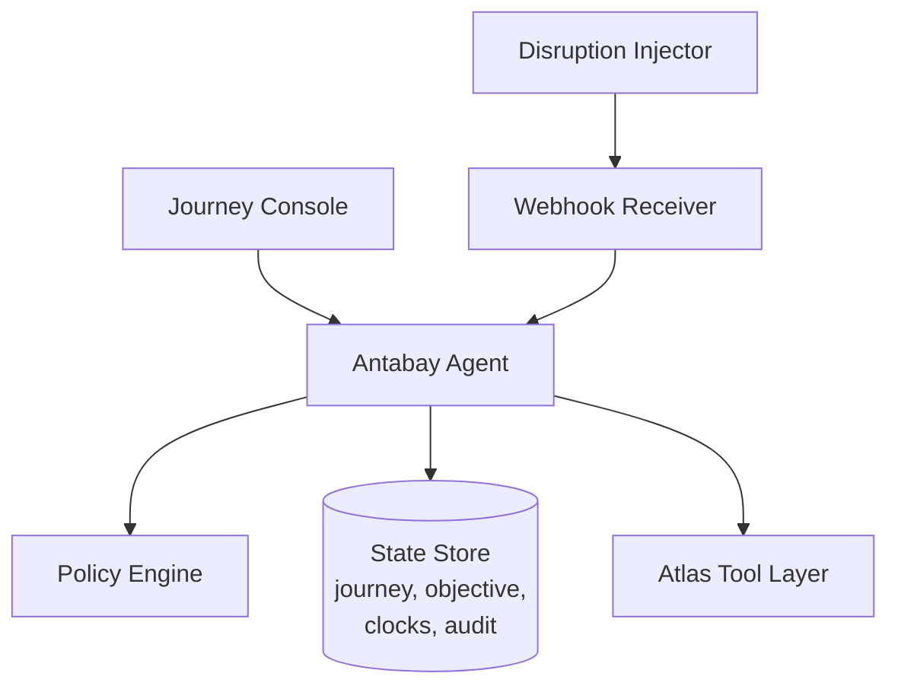
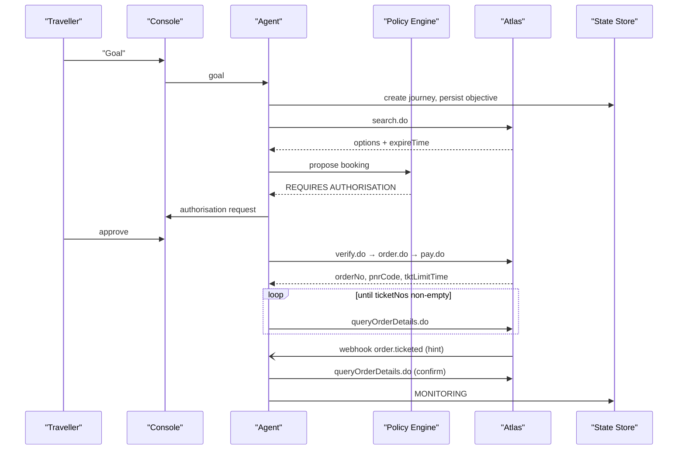
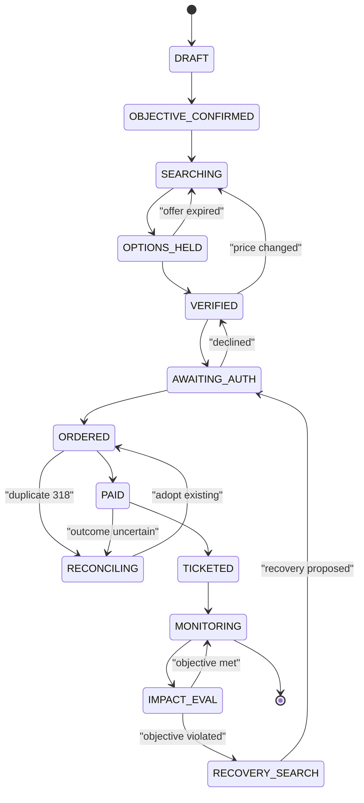
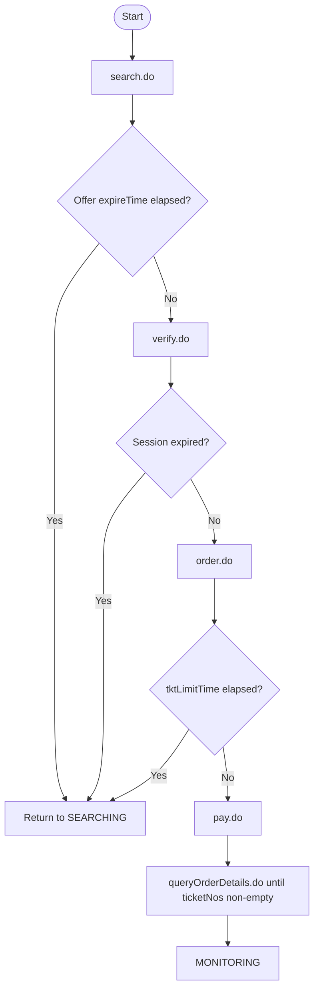
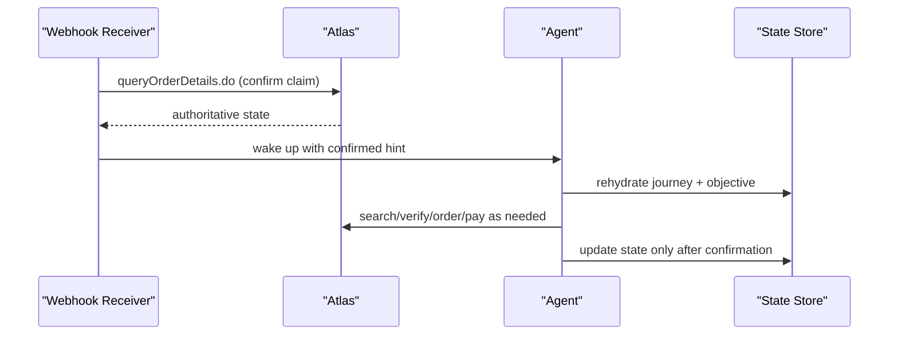
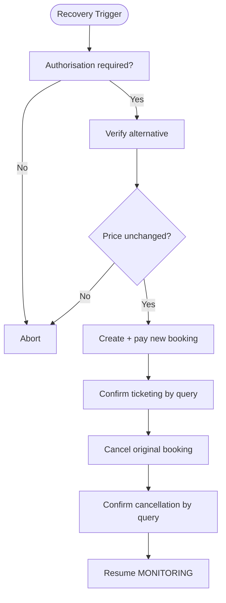
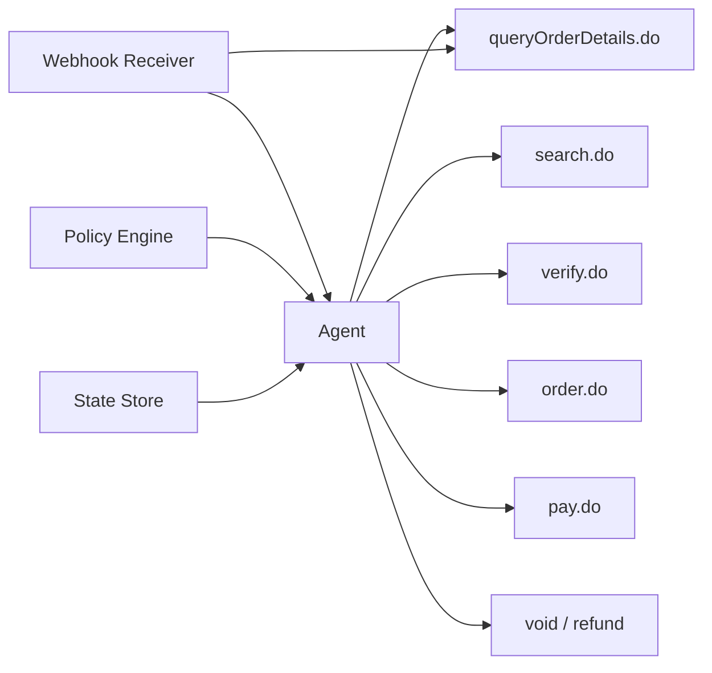

# State Management

<cite>
**Referenced Files in This Document**
- [architecture.md](file://.antabay/architecture.md)
- [specs.md](file://.antabay/specs.md)
- [atlas-capability-map.md](file://.antabay/atlas-capability-map.md)
- [demo-sequence.md](file://.antabay/demo-sequence.md)
</cite>

## Table of Contents
1. [Introduction](#introduction)
2. [Project Structure](#project-structure)
3. [Core Components](#core-components)
4. [Architecture Overview](#architecture-overview)
5. [Detailed Component Analysis](#detailed-component-analysis)
6. [Dependency Analysis](#dependency-analysis)
7. [Performance Considerations](#performance-considerations)
8. [Troubleshooting Guide](#troubleshooting-guide)
9. [Conclusion](#conclusion)

## Introduction
This document explains the journey state management system that tracks travel bookings from initial intent through completion. It covers the complete state machine, the three-clock model (offer, session, ticketing deadlines), persistence and audit requirements, event-driven updates to the console, and how the system handles concurrent access and reconciliation with external systems. The content is derived from verified architecture diagrams, specifications, and capability maps for the project.

## Project Structure
The repository contains design and specification artifacts that define the state machine and its supporting mechanisms:
- Architecture diagram and sequence flows describing components and interactions.
- A comprehensive set of feature specifications defining state transitions, clocks, persistence, auditing, events, and recovery.
- A verified capability map detailing external endpoints, identifiers, and clock semantics.
- A demo sequence illustrating a full run including disruption and recovery.

**Diagram sources**
- [architecture.md:21-78](file://.antabay/architecture.md#L21-L78)

**Section sources**
- [architecture.md:19-86](file://.antabay/architecture.md#L19-L86)
- [specs.md:429-530](file://.antabay/specs.md#L429-L530)

## Core Components
- Journey state store: durable record of current state, objective, held identifiers, and timestamps; append-only audit trail; authorisation history.
- Antabay Agent: orchestrates search, verification, booking, payment, monitoring, and recovery; rehydrates state on wake-up; emits events to the console.
- Policy Engine: deterministic decisions on whether actions require human authorisation.
- Webhook Receiver: ingests untrusted hints, reconciles against authoritative queries, and wakes the agent when confirmed.
- Disruption Injector: emits simulated schedule-change events for demonstration/testing.
- Atlas Tool Layer: search, verify, order, pay, query details, void/refund.

Key responsibilities relevant to state management:
- Maintain and enforce allowed state transitions.
- Track offer, session, and ticketing clocks and their expirations.
- Persist state changes and emit observable events.
- Reconcile uncertain outcomes by querying authoritative sources.
- Handle concurrency via durable state and idempotent operations.

**Section sources**
- [specs.md:429-530](file://.antabay/specs.md#L429-L530)
- [specs.md:798-919](file://.antabay/specs.md#L798-L919)
- [specs.md:1396-1478](file://.antabay/specs.md#L1396-L1478)
- [specs.md:1508-1582](file://.antabay/specs.md#L1508-L1582)
- [atlas-capability-map.md:25-34](file://.antabay/atlas-capability-map.md#L25-L34)

## Architecture Overview
The system enforces four rules:
- Qwen reasons; the policy engine decides authority; lines never cross.
- Journey state lives outside the agent; every wake-up rehydrates.
- Webhooks are untrusted hints; queryOrderDetails.do is truth.
- Every travel fact shown traces to an Atlas response.

**Diagram sources**
- [architecture.md:91-148](file://.antabay/architecture.md#L91-L148)
- [specs.md:1059-1144](file://.antabay/specs.md#L1059-L1144)
- [specs.md:1173-1244](file://.antabay/specs.md#L1173-L1244)
- [specs.md:1396-1478](file://.antabay/specs.md#L1396-L1478)

## Detailed Component Analysis

### Journey State Machine
States and transitions:
- DRAFT → OBJECTIVE_CONFIRMED: traveller confirms parsed objective.
- OBJECTIVE_CONFIRMED → SEARCHING: search.do initiated.
- SEARCHING → OPTIONS_HELD: routings returned with offer clock.
- OPTIONS_HELD → VERIFIED: verify.do called; offer clock replaced by session clock.
- OPTIONS_HELD → SEARCHING: offer expired.
- VERIFIED → AWAITING_AUTH: policy requires approval.
- VERIFIED → SEARCHING: price changed per provider signal.
- AWAITING_AUTH → ORDERED: approved, order.do executed.
- AWAITING_AUTH → VERIFIED: declined — no spend.
- ORDERED → PAID: pay.do executed.
- ORDERED → RECONCILING: duplicate 318 detected.
- RECONCILING → ORDERED: existing order adopted.
- PAID → TICKETED: ticketNos non-empty confirmed by query.
- PAID → RECONCILING: outcome uncertain.
- TICKETED → MONITORING: webhook registered and ticketing confirmed.
- MONITORING → IMPACT_EVAL: schedule change received.
- IMPACT_EVAL → MONITORING: objective still met.
- IMPACT_EVAL → RECOVERY_SEARCH: objective violated.
- RECOVERY_SEARCH → AWAITING_AUTH: recovery proposed.
- MONITORING → [*]: journey complete.

**Diagram sources**
- [architecture.md:214-257](file://.antabay/architecture.md#L214-L257)

**Section sources**
- [architecture.md:212-257](file://.antabay/architecture.md#L212-L257)
- [specs.md:429-530](file://.antabay/specs.md#L429-L530)

### Three-Clock System
Clocks and scopes:
- Offer clock: expireTime from search responses; observed 7m43s–31m; may arrive pre-aged; governs OPTIONS_HELD phase.
- Session clock: sessionId from verify responses; replaces offer clock post-verify; documented up to ~2 hours; governs VERIFIED/ORDERED phases.
- Ticketing clock: tktLimitTime from order responses; 30 minutes; governs ORDERED→PAID→TICKETED progression.

Expiry handling:
- Expired offer returns journey to SEARCHING.
- Expired session returns journey to SEARCHING.
- Expired ticketing deadline halts ticketing flow and triggers reconciliation or fallback paths.

**Diagram sources**
- [atlas-capability-map.md:304-313](file://.antabay/atlas-capability-map.md#L304-L313)
- [specs.md:949-1030](file://.antabay/specs.md#L949-L1030)
- [specs.md:1059-1144](file://.antabay/specs.md#L1059-L1144)

**Section sources**
- [atlas-capability-map.md:107-126](file://.antabay/atlas-capability-map.md#L107-L126)
- [atlas-capability-map.md:304-313](file://.antabay/atlas-capability-map.md#L304-L313)
- [specs.md:949-1030](file://.antabay/specs.md#L949-L1030)
- [specs.md:1059-1144](file://.antabay/specs.md#L1059-L1144)

### Persistence and Audit Trail
Requirements:
- Journey state persisted durably so journeys can be reconstructed after process termination.
- Append-only audit trail recording observations, decisions, external calls, and authorisations with timestamps.
- For each externally issued identifier, track issue time and staleness time.
- Record outcomes of every authorisation request, including refusals.

Implementation notes:
- State store is the single source of truth; no critical state resides only in memory or model context.
- Event stream recorded to durable storage and replayable without contacting external services.

**Section sources**
- [specs.md:429-530](file://.antabay/specs.md#L429-L530)
- [specs.md:798-919](file://.antabay/specs.md#L798-L919)

### Events to Frontend Console
Event emission:
- Emit observable events for every external call (endpoint, outcome, elapsed time).
- Emit observable events for every decision (what decided and why).
- Stream events to interface as they occur; interface renders only what the event stream provides.
- Present expiry clocks persistently with time remaining and proportional indicator; spent clocks remain visible.
- Visually emphasize option rejection, objective violation, and outstanding authorisation requests.
- Present provenance persistently (environment, reasoning model, simulation status).

Concurrency considerations:
- Interface holds no state; it consumes a live stream.
- Replay indistinguishable from live operation and clearly labelled.

**Section sources**
- [specs.md:798-919](file://.antabay/specs.md#L798-L919)

### Concurrent Access and State Reconciliation
Concurrency and reconciliation:
- Treat webhooks as untrusted hints; confirm claims against authoritative queries before changing state.
- Normalise field types differing between notifications and query interfaces.
- Periodically reconcile active journeys independently of notifications due to delivery uncertainty.
- On duplicate-order rejection (error code 318), read existing order reference and resume from actual state; never retry.
- Follow every state-changing action with an independent query; update journey state only from that result.
- Define success conditions per action type; treat unverifiable outcomes as unresolved and reconcile by query.

**Diagram sources**
- [specs.md:1396-1478](file://.antabay/specs.md#L1396-L1478)
- [specs.md:1173-1244](file://.antabay/specs.md#L1173-L1244)
- [atlas-capability-map.md:400-415](file://.antabay/atlas-capability-map.md#L400-L415)

**Section sources**
- [specs.md:1396-1478](file://.antabay/specs.md#L1396-L1478)
- [specs.md:1173-1244](file://.antabay/specs.md#L1173-L1244)
- [atlas-capability-map.md:400-415](file://.antabay/atlas-capability-map.md#L400-L415)

### Recovery from Failed Operations
Recovery execution:
- Execute recovery only with explicit authorisation for that specific action.
- Verify alternative immediately before execution; abandon if price changed.
- Create and pay for replacement booking; confirm ticketing by independent query.
- Initiate cancellation of superseded booking only after replacement confirmed.
- Treat replacement and cancellation as separate outcomes, each independently verified.
- Never leave traveller without a confirmed booking as a result of recovery attempt.
- Update journey’s current booking only after replacement confirmed; return to monitoring once complete.

**Diagram sources**
- [specs.md:1720-1806](file://.antabay/specs.md#L1720-L1806)

**Section sources**
- [specs.md:1720-1806](file://.antabay/specs.md#L1720-L1806)

### Impact Evaluation and Alternatives
Impact evaluation:
- Reconstruct journey and objective from durable storage on waking.
- Evaluate confirmed change against every element of the objective; quantify violations.
- Take no further action when objective remains satisfied; record determination.
- Search for alternatives when objective is violated; evaluate using same scoring rules; verify before recommending.
- Express cost relative to current position; recommend one alternative with rationale; report when no alternative preserves objective.

**Section sources**
- [specs.md:1610-1688](file://.antabay/specs.md#L1610-L1688)

### Demo Sequence Highlights
A full run demonstrates understanding, observation, reasoning, act & verify, disruption, adaptation, human authority, and execution & verification. Key beats:
- Rejection of an option that satisfies numeric constraints but violates hard preferences.
- Unauthenticated webhook treated as hint; confirmed via query.
- Human authority gate enforced deterministically.

**Section sources**
- [demo-sequence.md:8-110](file://.antabay/demo-sequence.md#L8-L110)
- [demo-sequence.md:114-142](file://.antabay/demo-sequence.md#L114-L142)
- [demo-sequence.md:146-167](file://.antabay/demo-sequence.md#L146-L167)

## Dependency Analysis
External dependencies and integration points:
- Atlas Tool Layer endpoints: search.do, verify.do, order.do, pay.do, queryOrderDetails.do, void/refund.
- Webhook receiver integrates with Atlas notifications and internal agent.
- Policy Engine determines authorisation needs deterministically.
- State Store persists journey, objective, clocks, audit trail, authorisations.

**Diagram sources**
- [architecture.md:44-72](file://.antabay/architecture.md#L44-L72)
- [atlas-capability-map.md:25-34](file://.antabay/atlas-capability-map.md#L25-L34)

**Section sources**
- [architecture.md:44-72](file://.antabay/architecture.md#L44-L72)
- [atlas-capability-map.md:25-34](file://.antabay/atlas-capability-map.md#L25-L34)

## Performance Considerations
- Offer expiry is short and variable; freshness must be checked before every decision.
- Rate limits apply to search and verification endpoints; respect wait instructions and avoid retry loops.
- Identifier TTLs differ; trust per-offer expireTime over generic documentation.
- Currency mixing hazard across routes; do not combine values in different currencies without conversion.
- Keep event streaming efficient; interface should render only what the stream provides.

[No sources needed since this section provides general guidance]

## Troubleshooting Guide
Common issues and resolutions:
- Duplicate booking error (318): read duplicateOrders[], query existing order, resume from real state; never retry.
- Paid ≠ ticketed: poll queryOrderDetails.do until ticketNos non-empty; do not rely on payment response alone.
- Webhook reliability: treat as untrusted hint; always confirm via authoritative query; normalise field types.
- Stale offers/sessions: re-verify earlier than documented expiry; return to search when expired.
- Authorisation timeouts: absence of response is refusal; record non-response; no spend occurs.
- Unverifiable outcomes: mark as unresolved; reconcile by query; never repeat uncertain actions.

**Section sources**
- [atlas-capability-map.md:400-415](file://.antabay/atlas-capability-map.md#L400-L415)
- [specs.md:1059-1144](file://.antabay/specs.md#L1059-L1144)
- [specs.md:1173-1244](file://.antabay/specs.md#L1173-L1244)
- [specs.md:1396-1478](file://.antabay/specs.md#L1396-L1478)

## Conclusion
The journey state management system enforces a robust, auditable lifecycle from draft to completion, governed by strict state transitions and three distinct clocks. It ensures safety and correctness by treating external signals as hints, verifying outcomes via authoritative queries, and requiring deterministic authorisation for high-risk actions. Persistence and audit trails enable reconstruction and replay, while event streaming keeps the console informed in real time. Concurrency and reconciliation strategies protect against unreliable channels and ambiguous outcomes, ensuring reliable recovery and continuous monitoring.