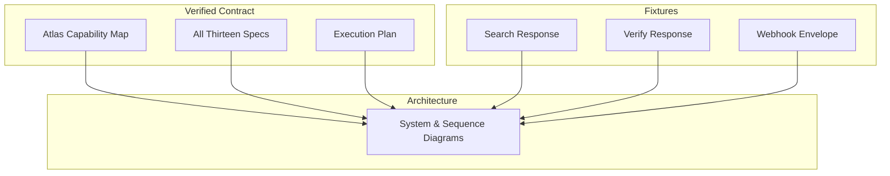
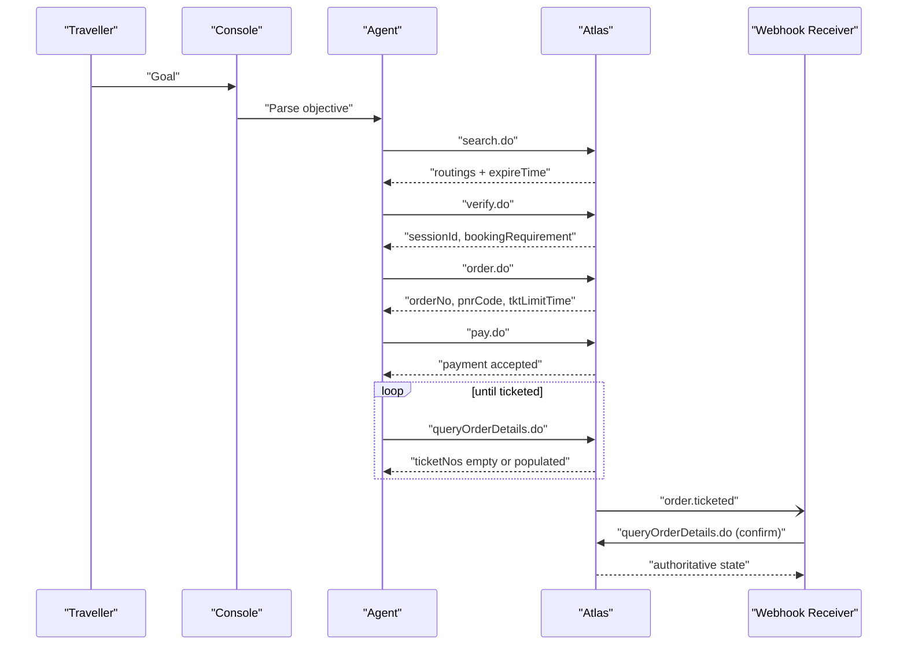
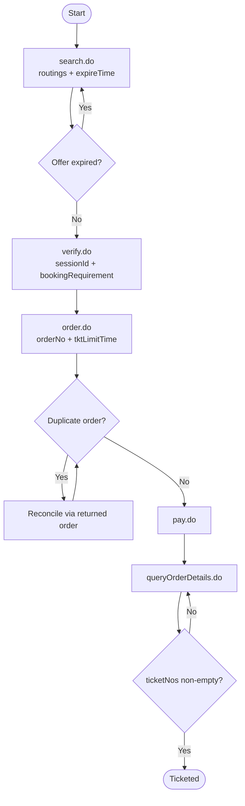
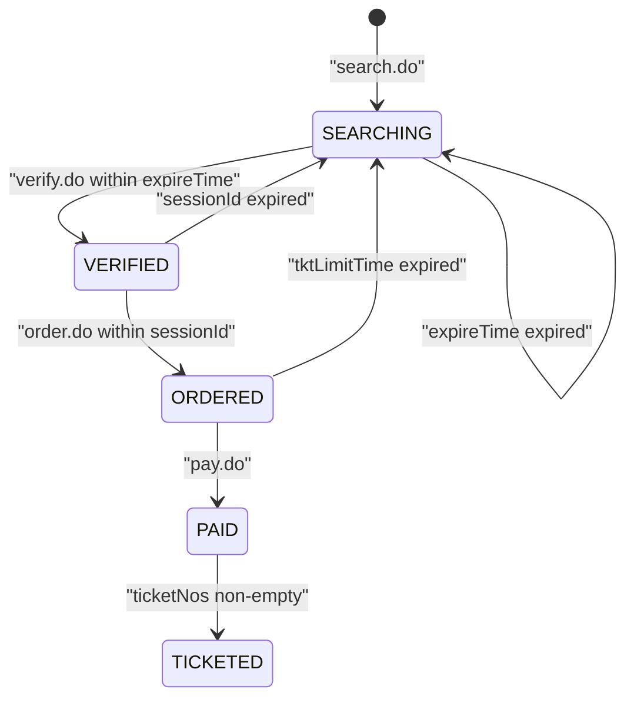
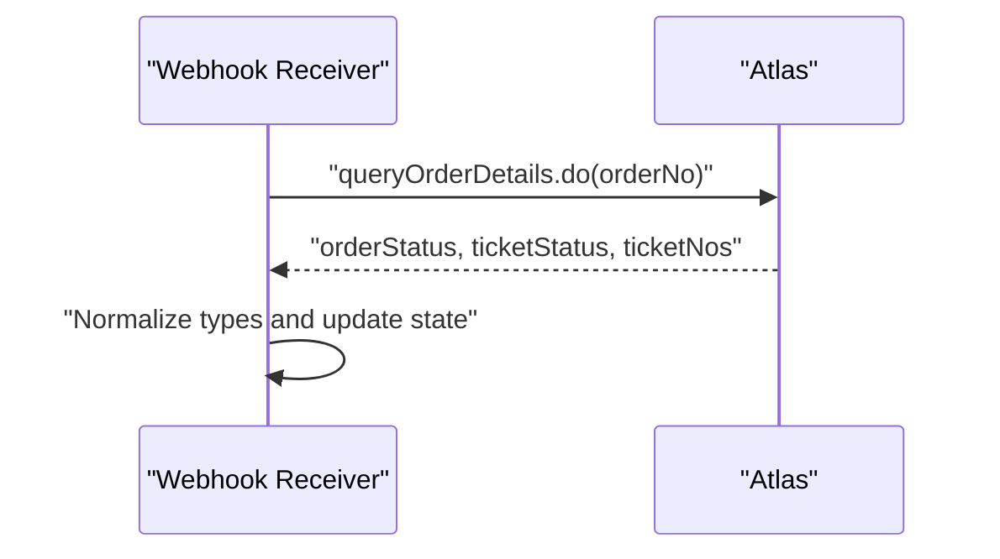
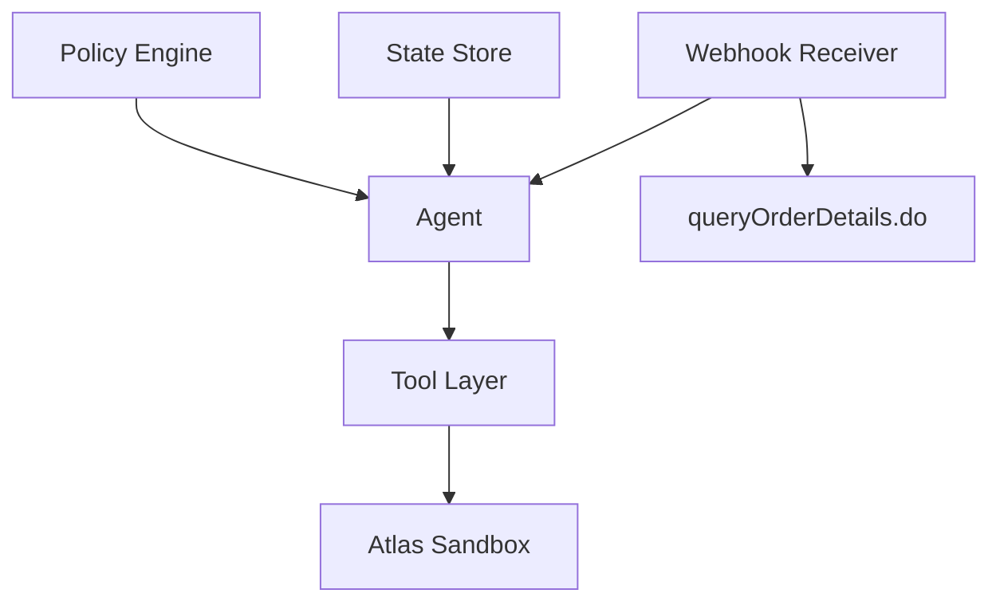

# API Capability Mapping

<cite>
**Referenced Files in This Document**
- [atlas-capability-map.md](file://.antabay/atlas-capability-map.md)
- [architecture.md](file://.antabay/architecture.md)
- [sel_tyo_search.json](file://fixtures/atlas/sel_tyo_search.json)
- [sel_tyo_verify.json](file://fixtures/atlas/sel_tyo_verify.json)
- [webhook_order_ticketed.json](file://fixtures/atlas/webhook_order_ticketed.json)
- [specs.md](file://.antabay/specs.md)
- [plan.md](file://.antabay/plan.md)
</cite>

## Table of Contents
1. Introduction
2. Project Structure
3. Core Components
4. Architecture Overview
5. Detailed Component Analysis
6. Dependency Analysis
7. Performance Considerations
8. Troubleshooting Guide
9. Conclusion

## Introduction
This document maps Antabay’s internal journey and domain models to the verified Atlas API capabilities. It covers the complete workflow from search.do through verify.do, order.do, pay.do, and queryOrderDetails.do, including request/response schemas, field mappings, and data transformations observed in live sandbox responses. It also explains the three-clock system (offer expireTime, sessionId, tktLimitTime), the distinction between verified and unverified capabilities, rate limiting, currency handling differences, identifier TTL management, webhook reconciliation strategy, and common troubleshooting patterns.

## Project Structure
The repository is organized around a verified contract and fixtures:
- Verified contract and environment notes are captured in the capability map.
- Architecture diagrams describe the end-to-end flow and state machine.
- Fixtures contain real sandbox responses used as ground truth for tests and examples.
- Specs define how the system must behave against the verified contract.
- The execution plan outlines delivery priorities and constraints.

**Diagram sources**
- [atlas-capability-map.md:1-40](file://.antabay/atlas-capability-map.md#L1-L40)
- [architecture.md:19-78](file://.antabay/architecture.md#L19-L78)
- [sel_tyo_search.json:1-120](file://fixtures/atlas/sel_tyo_search.json#L1-L120)
- [sel_tyo_verify.json:1-40](file://fixtures/atlas/sel_tyo_verify.json#L1-L40)
- [webhook_order_ticketed.json:1-53](file://fixtures/atlas/webhook_order_ticketed.json#L1-L53)

**Section sources**
- [atlas-capability-map.md:1-40](file://.antabay/atlas-capability-map.md#L1-L40)
- [architecture.md:19-78](file://.antabay/architecture.md#L19-L78)
- [specs.md:303-398](file://.antabay/specs.md#L303-L398)
- [plan.md:134-173](file://.antabay/plan.md#L134-L173)

## Core Components
- Atlas Tool Layer: search.do, verify.do, order.do, pay.do, queryOrderDetails.do. These are the only endpoints exercised end-to-end in the verified path.
- Webhook Receiver: receives unauthenticated events; treated as hints and reconciled via authoritative queries.
- Policy Engine: determines whether actions require human authorization.
- State Store: persists journeys, objectives, clocks, audit trail, and authorizations.
- Agent: orchestrates reasoning, calls, policy checks, and reconciliation.

Key behaviors grounded in verified data:
- search.do returns routings with per-offer expireTime; offers can arrive partially aged.
- verify.do returns sessionId and bookingRequirement; offer expireTime becomes null post-verify.
- order.do issues PNR before payment and returns tktLimitTime.
- pay.do does not confirm ticketing; ticketing confirmed by queryOrderDetails.do when ticketNos is non-empty.
- Webhooks are unauthenticated; status semantics differ from API success codes.

**Section sources**
- [atlas-capability-map.md:25-39](file://.antabay/atlas-capability-map.md#L25-L39)
- [atlas-capability-map.md:107-130](file://.antabay/atlas-capability-map.md#L107-L130)
- [atlas-capability-map.md:236-313](file://.antabay/atlas-capability-map.md#L236-L313)
- [atlas-capability-map.md:315-379](file://.antabay/atlas-capability-map.md#L315-L379)
- [architecture.md:19-78](file://.antabay/architecture.md#L19-L78)

## Architecture Overview
The happy path flows from goal to ticketed, with explicit checks at each stage:
- Search returns options with short-lived offers.
- Verify locks price and session, replacing the offer clock with a longer session clock.
- Order creates a PNR and starts the ticketing deadline clock.
- Pay charges the account but does not guarantee tickets.
- Query confirms ticket issuance; webhooks may prompt earlier checks but never replace authoritative queries.

**Diagram sources**
- [architecture.md:89-148](file://.antabay/architecture.md#L89-L148)
- [atlas-capability-map.md:236-313](file://.antabay/atlas-capability-map.md#L236-L313)

## Detailed Component Analysis

### End-to-End Workflow: search.do → verify.do → order.do → pay.do → queryOrderDetails.do
- search.do
  - Request fields include client id, trip type, passenger counts, origin/destination, date, currency, and source.
  - Response envelope contains routings array and status; success indicated by status zero.
  - Each routing includes identifiers, pricing components, segments, baggage rules, ancillary support, refresh/expire times, and sellout risk signals.
  - Total price formula is additive across base fare, tax, and per-passenger fee.
- verify.do
  - Request uses the exact routingIdentifier from search.
  - Response provides sessionId, maxSeats, routing snapshot, bookingRequirement schema, and priceChange delta.
  - Post-verify, offer freshness switches from expireTime to sessionId window.
- order.do
  - Request includes client id, sessionId, passengers (per bookingRequirement), contact, and source.
  - Response includes orderNo, pnrCode, totals, currency, vendor details, tktLimitTime, routing, sessionId, offerId, duplicateOrders signal, and status.
  - A PNR is issued before payment; it is not proof of ticketing.
- pay.do
  - Request includes client id and orderNo; no card details in this balance-based flow.
  - Response includes orderNo, pnrCode, paymentMethod, airlines, status, and message.
  - Payment success does not equal ticketing confirmation.
- queryOrderDetails.do
  - Request includes client id and orderNo.
  - Response includes orderStatus, ticketStatus, ticket numbers, airlinePNRs, timestamps, limits, VCC status, payment attempt flags, error info, itinerary download, refund rules, airline bookings, and messages.
  - Ticketing is confirmed when ticketNos is non-empty.

**Diagram sources**
- [atlas-capability-map.md:40-105](file://.antabay/atlas-capability-map.md#L40-L105)
- [atlas-capability-map.md:152-235](file://.antabay/atlas-capability-map.md#L152-L235)
- [atlas-capability-map.md:236-313](file://.antabay/atlas-capability-map.md#L236-L313)

**Section sources**
- [atlas-capability-map.md:40-105](file://.antabay/atlas-capability-map.md#L40-L105)
- [atlas-capability-map.md:152-235](file://.antabay/atlas-capability-map.md#L152-L235)
- [atlas-capability-map.md:236-313](file://.antabay/atlas-capability-map.md#L236-L313)
- [sel_tyo_search.json:1-120](file://fixtures/atlas/sel_tyo_search.json#L1-L120)
- [sel_tyo_verify.json:1-40](file://fixtures/atlas/sel_tyo_verify.json#L1-L40)

### Field Mappings and Data Transformations
- Routing identity preservation
  - routingIdentifier from search must be passed byte-for-byte to verify.
  - sessionId from verify must be passed byte-for-byte to order.
  - orderNo from order must be passed to pay and query.
- Pricing normalization
  - Use canonical total: adultPrice + adultTax + transactionFeePerPax.
  - Do not mix currencies; fares are USD while some rule amounts may be in local currencies.
- Segment interpretation
  - fromSegments length > 1 indicates connections; compute connection times and evaluate feasibility.
- Ancillaries and baggage
  - ancillarySupported lists available add-ons; rule.baggageElements describes included allowances per passenger type.
- Booking requirements
  - Derive passenger form fields dynamically from bookingRequirement.passenger schema returned by verify.

**Section sources**
- [atlas-capability-map.md:40-105](file://.antabay/atlas-capability-map.md#L40-L105)
- [atlas-capability-map.md:152-235](file://.antabay/atlas-capability-map.md#L152-L235)
- [sel_tyo_search.json:1-120](file://fixtures/atlas/sel_tyo_search.json#L1-L120)
- [sel_tyo_verify.json:1-40](file://fixtures/atlas/sel_tyo_verify.json#L1-L40)

### Three-Clock System and Expiry Behaviors
- Offer expireTime (pre-verify)
  - Scope: individual routing/offer.
  - Observed windows: short (minutes), sometimes already partially elapsed on arrival due to caching.
  - Behavior: if expired, return to search.
- Session sessionId (post-verify, pre-order)
  - Scope: verification session.
  - Longer than offer window; governs validity after verify.
  - Behavior: if expired, return to search.
- Ticket limit tktLimitTime (post-order, pre-ticket)
  - Scope: order-level ticketing deadline.
  - Observed duration: finite window after order creation.
  - Behavior: if expired without ticketing, reconcile and likely rebook.

**Diagram sources**
- [atlas-capability-map.md:107-130](file://.antabay/atlas-capability-map.md#L107-L130)
- [atlas-capability-map.md:217-235](file://.antabay/atlas-capability-map.md#L217-L235)
- [atlas-capability-map.md:304-313](file://.antabay/atlas-capability-map.md#L304-L313)
- [architecture.md:212-278](file://.antabay/architecture.md#L212-L278)

**Section sources**
- [atlas-capability-map.md:107-130](file://.antabay/atlas-capability-map.md#L107-L130)
- [atlas-capability-map.md:217-235](file://.antabay/atlas-capability-map.md#L217-L235)
- [atlas-capability-map.md:304-313](file://.antabay/atlas-capability-map.md#L304-L313)
- [architecture.md:212-278](file://.antabay/architecture.md#L212-L278)

### Verified vs Unverified Capabilities
- Verified end-to-end: search.do → verify.do → order.do → pay.do → queryOrderDetails.do.
- Documented but not yet exercised: getOffers.do, getOfferPrice.do, seatAvailability.do, getLuggage.do, refunds, void, webhook registration, incident query, balance.
- No flight-change endpoint exists; change is handled via rebook plus void/refund of original.

Why certain endpoints are not exercised:
- Not required for minimum viable demo path.
- Some features depend on sandbox configuration or credentials that may not enable them.
- Focus prioritized on core booking and recovery path first.

**Section sources**
- [atlas-capability-map.md:25-39](file://.antabay/atlas-capability-map.md#L25-L39)
- [atlas-capability-map.md:417-424](file://.antabay/atlas-capability-map.md#L417-L424)
- [plan.md:134-173](file://.antabay/plan.md#L134-L173)

### Webhook Reconciliation Strategy
- Webhooks are unauthenticated; do not trust status or payload alone.
- On receiving an event, call queryOrderDetails.do to obtain authoritative state.
- Normalize types where API surfaces differ (e.g., integer vs string status).
- Treat events as prompts to reconcile; never as final truth.

**Diagram sources**
- [atlas-capability-map.md:315-379](file://.antabay/atlas-capability-map.md#L315-L379)

**Section sources**
- [atlas-capability-map.md:315-379](file://.antabay/atlas-capability-map.md#L315-L379)

### Currency Handling Differences
- Fares returned in USD when requested.
- Rule amounts (refundRules, changesRules) may appear in local currencies (e.g., KRW, IDR).
- Never combine different currencies without explicit conversion; do not invent rates.

**Section sources**
- [atlas-capability-map.md:115-118](file://.antabay/atlas-capability-map.md#L115-L118)
- [sel_tyo_search.json:142-222](file://fixtures/atlas/sel_tyo_search.json#L142-L222)
- [sel_tyo_verify.json:143-223](file://fixtures/atlas/sel_tyo_verify.json#L143-L223)

### Identifier TTL Management
- routingIdentifier: preserve exactly; used immediately in verify.
- sessionId: obtained from verify; used in order; bounded window.
- tktLimitTime: obtained from order; governs ticketing deadline.
- Trust expireTime over documented upper bounds for identifiers; offers can be shorter-lived than stated.

**Section sources**
- [atlas-capability-map.md:107-130](file://.antabay/atlas-capability-map.md#L107-L130)
- [atlas-capability-map.md:217-235](file://.antabay/atlas-capability-map.md#L217-L235)
- [atlas-capability-map.md:304-313](file://.antabay/atlas-capability-map.md#L304-L313)

### Concrete Examples from Fixtures
- Search response fixture demonstrates:
  - Multiple routings with distinct carriers and airports.
  - Per-routing pricing breakdown and segment details.
  - Ancillary product elements and baggage allowances.
  - Offer freshness via refreshTime and expireTime.
- Verify response fixture demonstrates:
  - Confirmed routing snapshot with updated prices.
  - Dynamic bookingRequirement schema for passenger fields.
  - priceChange object indicating no price change.
- Webhook fixture demonstrates:
  - Event envelope shape with type, status, and data fields.
  - Ticketed event carrying ticketNos and airlinePNRs.

Use these fixtures as ground truth for recorded tests and mapping validation.

**Section sources**
- [sel_tyo_search.json:1-120](file://fixtures/atlas/sel_tyo_search.json#L1-L120)
- [sel_tyo_verify.json:1-40](file://fixtures/atlas/sel_tyo_verify.json#L1-L40)
- [webhook_order_ticketed.json:1-53](file://fixtures/atlas/webhook_order_ticketed.json#L1-L53)

## Dependency Analysis
The system depends on a strict contract layer that gates all external calls:
- Agent depends on Tool Layer for Atlas endpoints.
- Webhook Receiver depends on queryOrderDetails.do for reconciliation.
- Policy Engine depends on deterministic rules to authorize spending and irreversible actions.
- State Store persists journeys, clocks, and audit trails.

**Diagram sources**
- [architecture.md:19-78](file://.antabay/architecture.md#L19-L78)

**Section sources**
- [architecture.md:19-78](file://.antabay/architecture.md#L19-L78)

## Performance Considerations
- Rate limits
  - search.do: limited requests per second.
  - verify.do and related discovery endpoints share a per-minute budget.
  - Availability and luggage endpoints share another per-minute budget.
  - Over-limit returns a specific code with a retry-after instruction; do not retry loops.
- Call budget per journey
  - Track and enforce a declared budget to avoid exhausting provider quotas mid-decision.
- Offer freshness
  - Offers can be partially aged; always compute remaining time from current time.
- Ticketing latency
  - Paid is not ticketed; poll or reconcile until ticketNos is populated.

**Section sources**
- [atlas-capability-map.md:107-130](file://.antabay/atlas-capability-map.md#L107-L130)
- [specs.md:303-398](file://.antabay/specs.md#L303-L398)

## Troubleshooting Guide
Common mapping issues and resolutions:
- Duplicate booking rejection
  - Read duplicateOrders from the response; reconcile against the existing order rather than retrying.
- Order not found
  - Treat as a bug in own state; do not treat as retryable.
- Authentication failure
  - Credentials or account problem; do not retry.
- Type mismatches between surfaces
  - Normalize orderStatus and other fields that differ between webhook and API responses.
- Webhook misinterpretation
  - Do not gate handling on webhook status; successful events may carry negative status values.
- Currency mixing
  - Separate USD fares from local-currency rule amounts; convert explicitly if needed.
- Expired offers or sessions
  - If expireTime or sessionId has elapsed, return to search; do not proceed with stale identifiers.
- Payment vs ticketing confusion
  - Always confirm ticketing via queryOrderDetails.do when ticketNos is non-empty.

**Section sources**
- [atlas-capability-map.md:400-416](file://.antabay/atlas-capability-map.md#L400-L416)
- [atlas-capability-map.md:315-379](file://.antabay/atlas-capability-map.md#L315-L379)
- [atlas-capability-map.md:115-130](file://.antabay/atlas-capability-map.md#L115-L130)

## Conclusion
Antabay’s integration with Atlas is grounded in a verified contract and real sandbox responses. The workflow enforces strict identifier preservation, canonical pricing, and multi-stage confirmation. The three-clock system ensures timely progression and safe fallbacks. Webhooks serve as prompts, not authority; authoritative queries resolve state. Rate limits, currency differences, and TTL management are central to robust operation. Following this mapping prevents invented behavior and keeps the system aligned with provider realities.