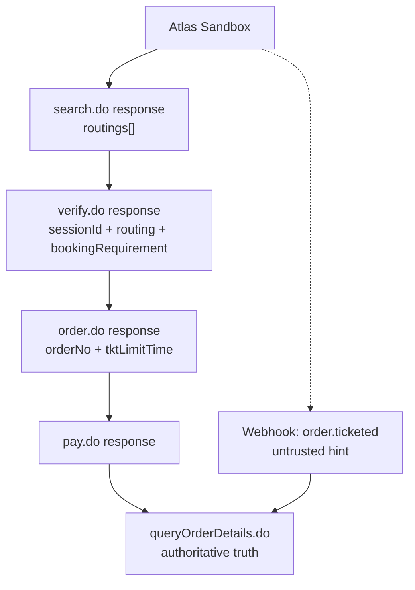
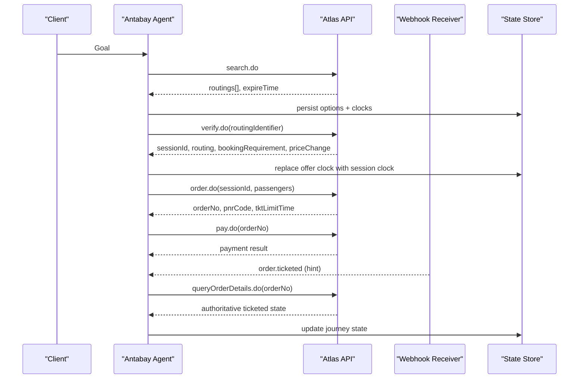
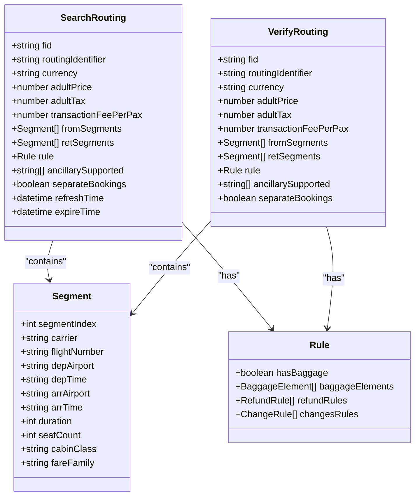
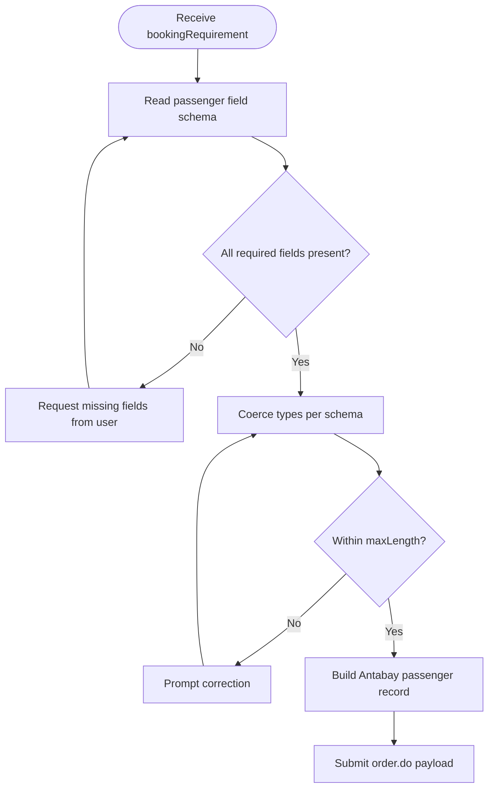
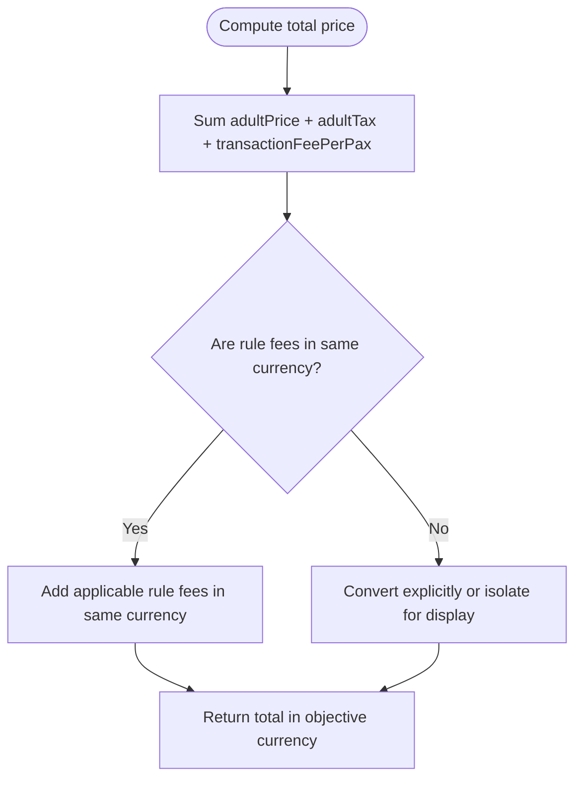
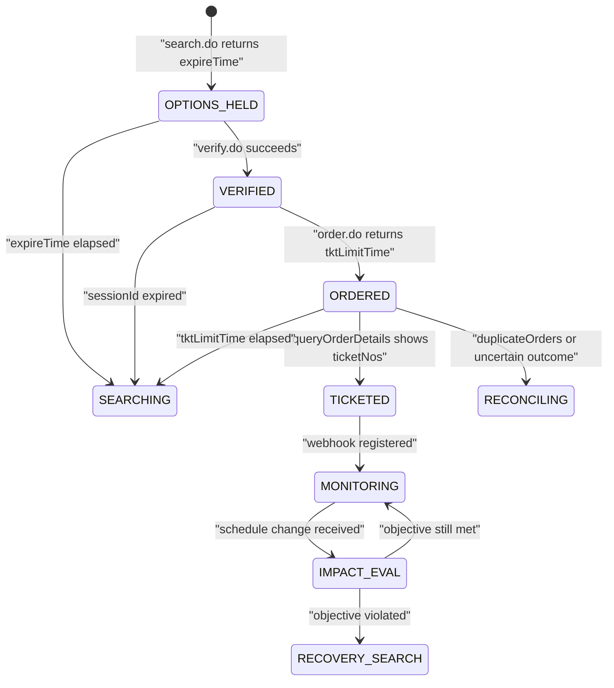
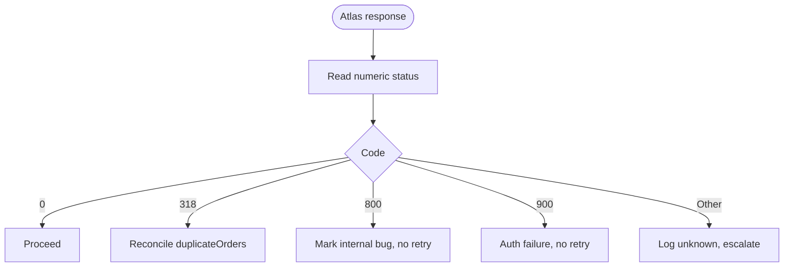
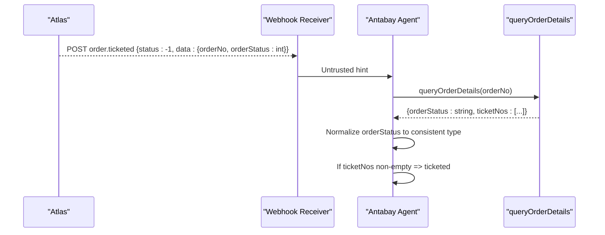
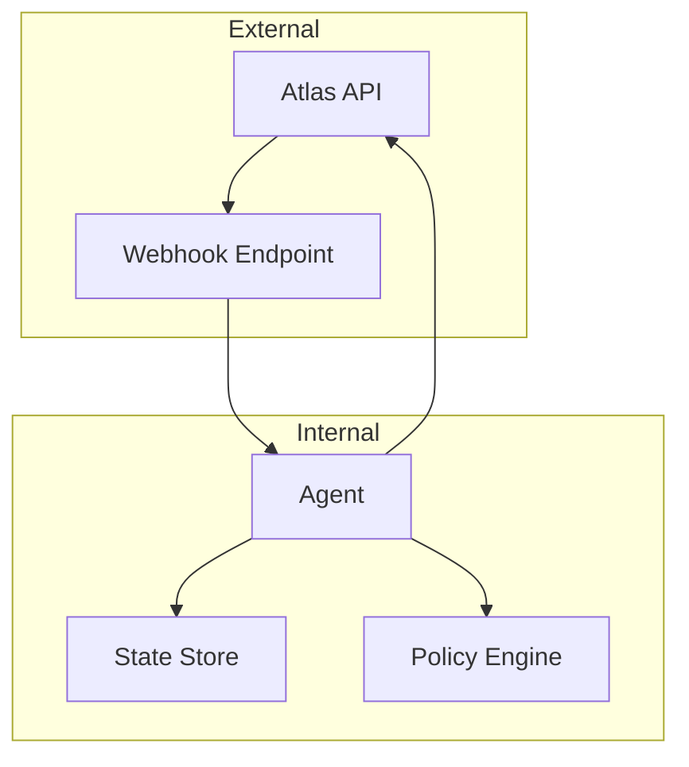

# Data Model Mapping

<cite>
**Referenced Files in This Document**
- [architecture.md](file://.antabay/architecture.md)
- [atlas-capability-map.md](file://.antabay/atlas-capability-map.md)
- [specs.md](file://.antabay/specs.md)
- [sel_tyo_search.json](file://fixtures/atlas/sel_tyo_search.json)
- [sel_tyo_verify.json](file://fixtures/atlas/sel_tyo_verify.json)
- [webhook_order_ticketed.json](file://fixtures/atlas/webhook_order_ticketed.json)
</cite>

## Table of Contents
1. [Introduction](#introduction)
2. [Project Structure](#project-structure)
3. [Core Components](#core-components)
4. [Architecture Overview](#architecture-overview)
5. [Detailed Component Analysis](#detailed-component-analysis)
6. [Dependency Analysis](#dependency-analysis)
7. [Performance Considerations](#performance-considerations)
8. [Troubleshooting Guide](#troubleshooting-guide)
9. [Conclusion](#conclusion)

## Introduction
This document specifies how Atlas API responses are mapped into Antabay’s internal domain models across the booking lifecycle. It focuses on:
- Routing object transformation from search and verify responses, including segments, fare components, baggage rules, and ancillary support indicators.
- Passenger data mapping from dynamic bookingRequirement schemas to Antabay’s passenger model, with validation and type coercion rules.
- Price calculation formulas, currency handling differences between USD fares and IDR/KRW fees, and total price computation across routes.
- Freshness model mapping from expireTime to sessionId to tktLimitTime, including when each clock is authoritative and state transitions driven by these boundaries.
- Error code mapping from Atlas numeric codes to Antabay exception types, webhook event normalization between integer and string status values, and identifier preservation strategies for routingIdentifier, sessionId, and orderNo.

## Project Structure
The mapping specification is grounded in verified Atlas contract documents and real fixtures captured from the sandbox. The key sources are:
- Verified endpoint shapes, fields, error codes, and clocks in the capability map.
- Live response fixtures for search, verify, and webhook events used as canonical references.
- Architecture and specs that define journey states, authorisation gates, and reconciliation flows.

**Diagram sources**
- [atlas-capability-map.md:25-34](file://.antabay/atlas-capability-map.md#L25-L34)
- [atlas-capability-map.md:152-303](file://.antabay/atlas-capability-map.md#L152-L303)
- [atlas-capability-map.md:315-379](file://.antabay/atlas-capability-map.md#L315-L379)

**Section sources**
- [atlas-capability-map.md:25-34](file://.antabay/atlas-capability-map.md#L25-L34)
- [atlas-capability-map.md:152-303](file://.antabay/atlas-capability-map.md#L152-L303)
- [atlas-capability-map.md:315-379](file://.antabay/atlas-capability-map.md#L315-L379)

## Core Components
- Routing model: derived from search routings and confirmed via verify routing; includes segment arrays, fare components, baggage rules, and ancillary support flags.
- Passenger model: built from per-offer bookingRequirement.passenger schema; validated at runtime against returned field metadata.
- Pricing model: canonical total per adult computed from base fare, tax, and per-passenger transaction fee; currency-aware handling for mixed currencies in rules.
- Freshness model: three clocks govern offer validity, session validity, and ticketing deadline; each expiry forces a transition back to search or recovery.
- Error and webhook normalisation: numeric Atlas error codes mapped to Antabay exceptions; webhook status and orderStatus normalised to consistent types; identifiers preserved byte-for-byte.

**Section sources**
- [atlas-capability-map.md:69-125](file://.antabay/atlas-capability-map.md#L69-L125)
- [atlas-capability-map.md:152-235](file://.antabay/atlas-capability-map.md#L152-L235)
- [atlas-capability-map.md:236-313](file://.antabay/atlas-capability-map.md#L236-L313)
- [atlas-capability-map.md:315-379](file://.antabay/atlas-capability-map.md#L315-L379)
- [atlas-capability-map.md:400-415](file://.antabay/atlas-capability-map.md#L400-L415)

## Architecture Overview
The system treats webhooks as untrusted hints and always reconciles with queryOrderDetails.do. The journey state machine drives freshness checks and transitions based on expireTime, sessionId, and tktLimitTime.

**Diagram sources**
- [architecture.md:89-148](file://.antabay/architecture.md#L89-L148)
- [atlas-capability-map.md:152-303](file://.antabay/atlas-capability-map.md#L152-L303)
- [atlas-capability-map.md:315-379](file://.antabay/atlas-capability-map.md#L315-L379)

## Detailed Component Analysis

### Routing Object Transformation
- Source surfaces:
  - search.do returns an array of routings with per-routing identifiers, segments, pricing, baggage rules, and ancillary support indicators.
  - verify.do returns a single routing shape confirming availability and price, plus a new sessionId replacing the short-lived offer window.
- Segment arrays:
  - fromSegments and retSegments encode itinerary legs; length greater than one indicates a connection.
  - Each segment carries carrier, flight number, departure/arrival airports and times in local time, duration, cabin class, seatCount, and fareFamily.
- Fare components:
  - Per adult: adultPrice, adultTax, transactionFeePerPax. Total per adult equals the sum of these three fields.
  - Child and infant pricing also present; use only the relevant passenger-type totals for multi-passenger scenarios.
- Baggage rules:
  - rule.hasBaggage indicates whether baggage allowance exists.
  - rule.baggageElements enumerates allowances per segment and passengerType, including piece count, weight, size, and whether it is all-weight.
  - Ancillary products may be listed under ancillaryProductElements with vendor-side prices in a different currency.
- Ancillary support indicators:
  - ancillarySupported lists capabilities such as seat and luggage.
  - supportCreditTransPayment indicates balance/VCC-only payment modes observed in sandbox.

**Diagram sources**
- [atlas-capability-map.md:69-98](file://.antabay/atlas-capability-map.md#L69-L98)
- [atlas-capability-map.md:152-235](file://.antabay/atlas-capability-map.md#L152-L235)
- [sel_tyo_search.json:1-334](file://fixtures/atlas/sel_tyo_search.json#L1-L334)
- [sel_tyo_verify.json:1-335](file://fixtures/atlas/sel_tyo_verify.json#L1-L335)

**Section sources**
- [atlas-capability-map.md:69-125](file://.antabay/atlas-capability-map.md#L69-L125)
- [sel_tyo_search.json:1-334](file://fixtures/atlas/sel_tyo_search.json#L1-L334)
- [sel_tyo_verify.json:1-335](file://fixtures/atlas/sel_tyo_verify.json#L1-L335)

### Passenger Data Mapping from bookingRequirement
- Dynamic schema:
  - bookingRequirement.passenger defines per-field metadata: type, required, description, maxLength.
  - Required fields include name, birthday, gender, nationality, passengerType; optional fields include cardNum, cardType, cardIssuePlace, cardExpired.
- Validation and coercion:
  - Validate presence against required flags.
  - Enforce type constraints: strings for text fields, int for passengerType.
  - Respect maxLength where provided.
  - Normalize date formats to YYYYMMDD if needed before submission.
- Mapping to Antabay passenger model:
  - Preserve exact values for external identifiers and names.
  - Map passengerType consistently across surfaces.
  - Ensure contact details are included in order requests as required by the order envelope.

**Diagram sources**
- [atlas-capability-map.md:198-215](file://.antabay/atlas-capability-map.md#L198-L215)
- [sel_tyo_verify.json:336-373](file://fixtures/atlas/sel_tyo_verify.json#L336-L373)

**Section sources**
- [atlas-capability-map.md:198-215](file://.antabay/atlas-capability-map.md#L198-L215)
- [sel_tyo_verify.json:336-373](file://fixtures/atlas/sel_tyo_verify.json#L336-L373)

### Price Calculation and Currency Handling
- Canonical formula:
  - Total per adult = adultPrice + adultTax + transactionFeePerPax.
  - Use this single source of truth for pricing decisions and display.
- Currency considerations:
  - Fares are returned in USD when requested.
  - Refund and change fees can appear in other currencies (e.g., KRW or IDR). Do not mix currencies without explicit conversion; do not invent rates.
  - Ancillary product elements may list both client-facing price/currency and vendor-side price/currency; keep them distinct.
- Route-specific notes:
  - Observed SEL→TYO route uses USD for fares and KRW for some rules; JKT→SUB route mixes USD fares with IDR fees. Always treat rule amounts as vendor-local unless converted explicitly.

**Diagram sources**
- [atlas-capability-map.md:99-117](file://.antabay/atlas-capability-map.md#L99-L117)
- [sel_tyo_search.json:1-334](file://fixtures/atlas/sel_tyo_search.json#L1-L334)
- [sel_tyo_verify.json:1-335](file://fixtures/atlas/sel_tyo_verify.json#L1-L335)

**Section sources**
- [atlas-capability-map.md:99-117](file://.antabay/atlas-capability-map.md#L99-L117)
- [sel_tyo_search.json:1-334](file://fixtures/atlas/sel_tyo_search.json#L1-L334)
- [sel_tyo_verify.json:1-335](file://fixtures/atlas/sel_tyo_verify.json#L1-L335)

### Freshness Model: expireTime → sessionId → tktLimitTime
- Three clocks govern the journey:
  - expireTime: offer-level TTL observed between roughly 7 minutes 43 seconds and 31 minutes; offers may arrive partially aged due to caching.
  - sessionId: post-verify session TTL documented up to 2 hours; replaces the offer window once verify succeeds.
  - tktLimitTime: post-order ticketing deadline observed as 30 minutes; after which the order must be paid and ticketed or re-searched.
- State transitions:
  - Expired offer: return to search.
  - Expired session: return to search.
  - Expired tktLimitTime: return to search or initiate recovery workflow.
- Authority:
  - Treat expireTime as authoritative even if longer TTLs exist for identifiers.
  - After verify, rely on sessionId rather than stale offer timestamps.
  - After order, track tktLimitTime strictly; paid does not equal ticketed until queryOrderDetails shows non-empty ticketNos.

**Diagram sources**
- [architecture.md:212-257](file://.antabay/architecture.md#L212-L257)
- [atlas-capability-map.md:217-235](file://.antabay/atlas-capability-map.md#L217-L235)
- [atlas-capability-map.md:304-313](file://.antabay/atlas-capability-map.md#L304-L313)

**Section sources**
- [atlas-capability-map.md:217-235](file://.antabay/atlas-capability-map.md#L217-L235)
- [atlas-capability-map.md:304-313](file://.antabay/atlas-capability-map.md#L304-L313)
- [architecture.md:212-257](file://.antabay/architecture.md#L212-L257)

### Error Code Mapping and Exception Types
- Known Atlas numeric codes and Antabay behaviour:
  - 0: success — proceed.
  - 318: duplicate booking — reconcile using returned duplicateOrders; never retry.
  - 800: order not exists — treat as internal state bug; do not retry.
  - 900: auth failed — credentials or account problem; do not retry.
- Mapping strategy:
  - Classify each code as retryable, reconcilable, or terminal.
  - On 318, switch flow to reconciliation: query existing order and resume from its real state.
  - On 800 and 900, surface terminal errors and halt retries.

**Diagram sources**
- [atlas-capability-map.md:400-415](file://.antabay/atlas-capability-map.md#L400-L415)

**Section sources**
- [atlas-capability-map.md:400-415](file://.antabay/atlas-capability-map.md#L400-L415)

### Webhook Event Normalization
- Event envelope:
  - type is a dotted string (e.g., order.ticketed); route on this field.
  - status is -1 on successful ticketing; do not gate handling on status == 0.
  - orderStatus arrives as an integer in webhooks but as a string in queryOrderDetails responses; normalize on ingest.
- Security posture:
  - Webhooks are unauthenticated; treat as hints only.
  - Always confirm claims via queryOrderDetails before updating journey state.
- Payload mapping:
  - Extract orderNo, orderStatus, and paxTicketInfos (including airlinePNRs and ticketNos).
  - Normalize ticketNos presence as proof of ticketing.

**Diagram sources**
- [atlas-capability-map.md:315-379](file://.antabay/atlas-capability-map.md#L315-L379)
- [webhook_order_ticketed.json:1-53](file://fixtures/atlas/webhook_order_ticketed.json#L1-L53)

**Section sources**
- [atlas-capability-map.md:315-379](file://.antabay/atlas-capability-map.md#L315-L379)
- [webhook_order_ticketed.json:1-53](file://fixtures/atlas/webhook_order_ticketed.json#L1-L53)

### Identifier Preservation Strategy
- routingIdentifier:
  - Preserve byte-for-byte from search to verify; never construct or alter.
- sessionId:
  - Preserve byte-for-byte from verify to order; treat as the post-verify authority.
- orderNo:
  - Preserve byte-for-byte from order to pay and queryOrderDetails; use for reconciliation on duplicates.
- Additional identifiers:
  - pnrCode issued at order time is not proof of ticketing; continue polling until ticketNos populated.
  - duplicateOrders returned on 318 must be adopted and reconciled.

**Section sources**
- [atlas-capability-map.md:152-235](file://.antabay/atlas-capability-map.md#L152-L235)
- [atlas-capability-map.md:236-313](file://.antabay/atlas-capability-map.md#L236-L313)
- [atlas-capability-map.md:400-415](file://.antabay/atlas-capability-map.md#L400-L415)

## Dependency Analysis
- External dependencies:
  - Atlas endpoints: search.do, verify.do, order.do, pay.do, queryOrderDetails.do.
  - Webhook receiver for order.ticketed events.
- Internal dependencies:
  - Journey state store persists objectives, orders, clocks, and audit trail.
  - Policy engine gates spending and irreversible actions.
  - Agent orchestrates calls, reasoning, and state transitions.

**Diagram sources**
- [architecture.md:19-86](file://.antabay/architecture.md#L19-L86)

**Section sources**
- [architecture.md:19-86](file://.antabay/architecture.md#L19-L86)

## Performance Considerations
- Rate limits:
  - search.do: 10 QPS.
  - verify.do and getOffers.do share 60 QPM.
  - seatAvailability.do and getLuggage.do share 60 QPM.
  - Over-limit returns 429 with retryAfter; do not retry before instructed interval.
- Offer freshness:
  - Offers are short-lived and may arrive pre-aged; check remaining time before acting.
- Currency mixing:
  - Avoid combining USD fares with IDR/KRW fees without explicit conversion; do not invent exchange rates.

[No sources needed since this section provides general guidance]

## Troubleshooting Guide
- Duplicate bookings:
  - On code 318, read duplicateOrders and reconcile against the existing order; never retry the same request.
- Order not found:
  - On code 800, treat as internal state inconsistency; investigate state store and audit logs.
- Authentication failures:
  - On code 900, stop retries; check credentials and account permissions.
- Paid vs ticketed confusion:
  - Payment success does not imply ticketing; poll queryOrderDetails until ticketNos is non-empty.
- Webhook misinterpretation:
  - Do not rely on webhook status == 0; successful ticketing arrives with status -1.
  - Normalize orderStatus between integer (webhook) and string (API) surfaces.

**Section sources**
- [atlas-capability-map.md:400-415](file://.antabay/atlas-capability-map.md#L400-L415)
- [atlas-capability-map.md:285-303](file://.antabay/atlas-capability-map.md#L285-L303)
- [atlas-capability-map.md:315-379](file://.antabay/atlas-capability-map.md#L315-L379)

## Conclusion
This mapping ensures that Antabay faithfully represents Atlas responses while enforcing correctness through canonical pricing, strict freshness controls, robust error handling, and secure webhook processing. By preserving identifiers, normalizing types, and treating webhooks as hints, the system maintains reliable state transitions and clear accountability across the booking lifecycle.