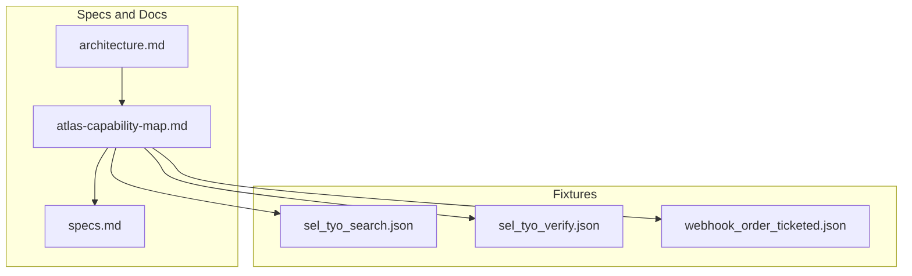
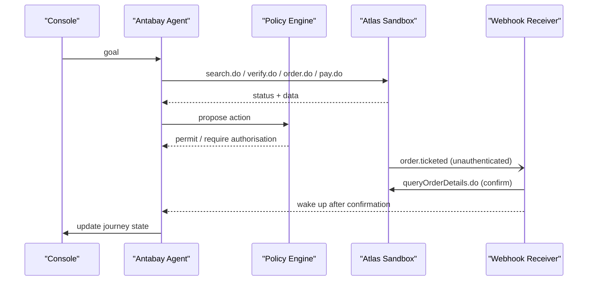
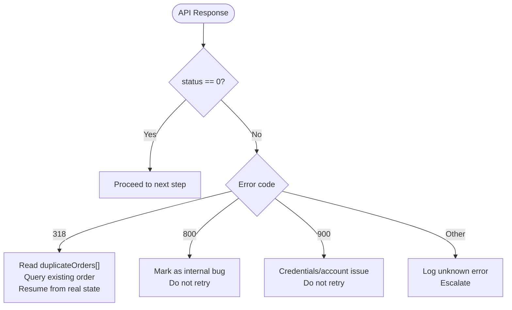
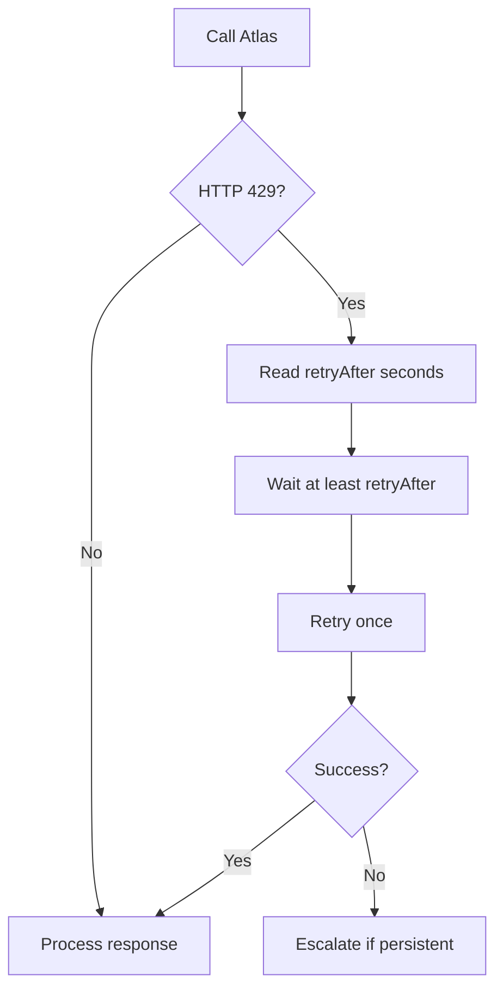
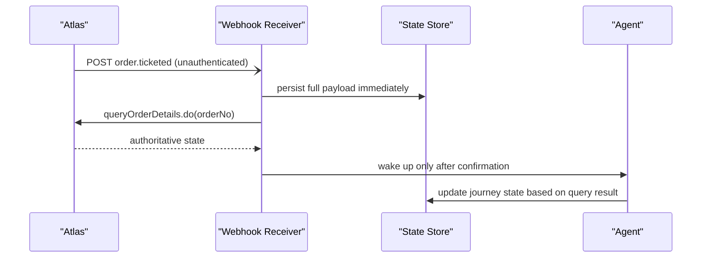
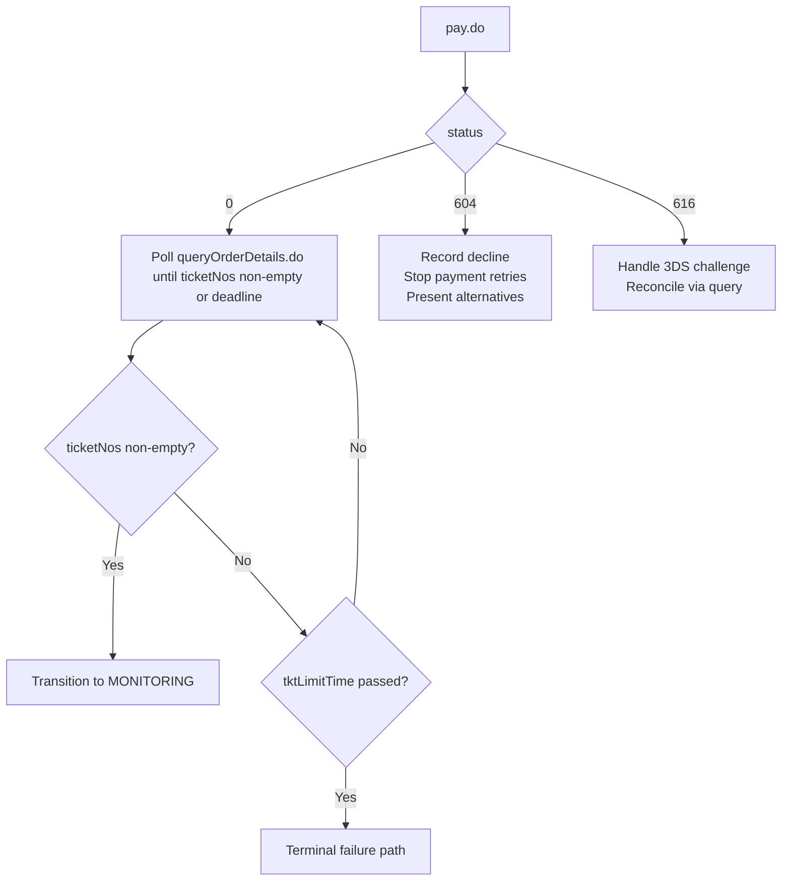
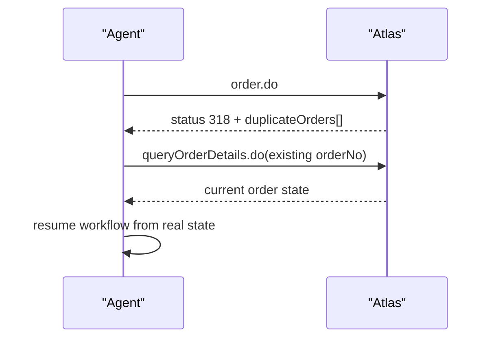
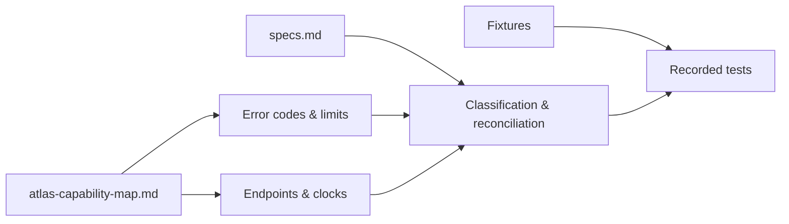

# Error Handling and Recovery

<cite>
**Referenced Files in This Document**
- [architecture.md](file://.antabay/architecture.md)
- [atlas-capability-map.md](file://.antabay/atlas-capability-map.md)
- [specs.md](file://.antabay/specs.md)
- [sel_tyo_search.json](file://fixtures/atlas/sel_tyo_search.json)
- [sel_tyo_verify.json](file://fixtures/atlas/sel_tyo_verify.json)
- [webhook_order_ticketed.json](file://fixtures/atlas/webhook_order_ticketed.json)
</cite>

## Table of Contents
1. [Introduction](#introduction)
2. [Project Structure](#project-structure)
3. [Core Components](#core-components)
4. [Architecture Overview](#architecture-overview)
5. [Detailed Component Analysis](#detailed-component-analysis)
6. [Dependency Analysis](#dependency-analysis)
7. [Performance Considerations](#performance-considerations)
8. [Troubleshooting Guide](#troubleshooting-guide)
9. [Conclusion](#conclusion)
10. [Appendices](#appendices)

## Introduction
This document consolidates the error handling patterns and recovery strategies for the Atlas API integration used by Antabay. It focuses on verified error codes, rate limiting behavior, webhook security posture, payment failure simulation, idempotency guarantees, circuit breaker and fallback strategies, and monitoring approaches. All guidance is grounded in the verified Atlas contract and the project’s specifications.

## Project Structure
The repository contains:
- Verified Atlas capability map and architecture diagrams that define endpoints, clocks, events, and error semantics.
- Spec documents that enforce how errors are classified, retried, reconciled, and observed.
- Fixtures capturing real responses from the Atlas sandbox to anchor tests and examples.

**Diagram sources**
- [architecture.md:19-86](file://.antabay/architecture.md#L19-L86)
- [atlas-capability-map.md:1-39](file://.antabay/atlas-capability-map.md#L1-L39)

**Section sources**
- [architecture.md:19-86](file://.antabay/architecture.md#L19-L86)
- [atlas-capability-map.md:1-39](file://.antabay/atlas-capability-map.md#L1-L39)

## Core Components
- Verified Atlas endpoints: search.do, verify.do, order.do, pay.do, queryOrderDetails.do.
- Webhook receiver and reconciler for untrusted events.
- Journey state machine with three bounded clocks (offer expireTime, sessionId, tktLimitTime).
- Authorisation policy engine gating spending and irreversible actions.
- Disruption injector for testing schedule changes.

Key error handling principles enforced across components:
- Treat every external call as observable; record endpoint, outcome, elapsed time.
- Classify known external error codes as retryable, reconcilable, or terminal.
- Never assume success from action responses; reconcile via independent queries.
- Treat webhooks as untrusted hints; confirm against authoritative APIs.

**Section sources**
- [atlas-capability-map.md:25-39](file://.antabay/atlas-capability-map.md#L25-L39)
- [specs.md:337-377](file://.antabay/specs.md#L337-L377)
- [specs.md:1173-1244](file://.antabay/specs.md#L1173-L1244)

## Architecture Overview
The system integrates a FastAPI backend with an agent loop, policy engine, webhook receiver, and disruption injector. The agent calls Atlas tools and treats provider responses as truth. Webhooks arrive unauthenticated and must be reconciled before changing state.

**Diagram sources**
- [architecture.md:21-86](file://.antabay/architecture.md#L21-L86)
- [atlas-capability-map.md:315-379](file://.antabay/atlas-capability-map.md#L315-L379)

## Detailed Component Analysis

### Verified Error Codes and Handling Procedures
Verified error codes and their required behaviors:
- 0 (success): proceed with next step.
- 318 (duplicate booking): read duplicateOrders[], query the existing order, resume from its real state; never retry creation.
- 800 (order not exists): treat as a bug in local state; do not retry.
- 900 (authentication failure): credentials or account problem; do not retry.

These rules ensure idempotent retries only where safe and prevent infinite loops on terminal conditions.

**Diagram sources**
- [atlas-capability-map.md:400-416](file://.antabay/atlas-capability-map.md#L400-L416)
- [specs.md:359-377](file://.antabay/specs.md#L359-L377)

**Section sources**
- [atlas-capability-map.md:400-416](file://.antabay/atlas-capability-map.md#L400-L416)
- [specs.md:359-377](file://.antabay/specs.md#L359-L377)

### Rate Limiting Responses (429) and Backoff Strategy
- Atlas enforces per-endpoint limits (e.g., search.do QPS; verify.do/getOffers.do QPM).
- Over-limit returns HTTP 429 with a retryAfter header.
- Required behavior: honor retryAfter, do not retry before it elapses, and avoid retry loops.

**Diagram sources**
- [atlas-capability-map.md:119-121](file://.antabay/atlas-capability-map.md#L119-L121)
- [specs.md:373-377](file://.antabay/specs.md#L373-L377)

**Section sources**
- [atlas-capability-map.md:119-121](file://.antabay/atlas-capability-map.md#L119-L121)
- [specs.md:373-377](file://.antabay/specs.md#L373-L377)

### Webhook Error Handling and Security Posture
- Webhooks are unauthenticated: no signature header, HMAC, or shared secret.
- Status field in webhooks does not mirror API success semantics; a successful ticketing event arrived with status -1.
- Order status type differs between webhook (integer) and query API (string); normalization is required.
- Security implication: treat all inbound webhooks as untrusted hints; always confirm claims via queryOrderDetails.do before updating journey state.

**Diagram sources**
- [atlas-capability-map.md:315-379](file://.antabay/atlas-capability-map.md#L315-L379)
- [specs.md:1428-1473](file://.antabay/specs.md#L1428-L1473)

**Section sources**
- [atlas-capability-map.md:315-379](file://.antabay/atlas-capability-map.md#L315-L379)
- [specs.md:1428-1473](file://.antabay/specs.md#L1428-L1473)

### Payment Failure Simulation and Recovery
- Deterministic simulation for VCC flows: cardholder first name "Reject" yields error 604 (declined); "Three DS" yields error 616 (3DS).
- For balance-based payments (paymentMethod: 1), these simulations apply to VCC flows, not this path.
- Recovery procedures:
  - Declined payment: stop payment attempts, present options to traveller, require authorisation for any remediation.
  - 3DS flow: handle challenge completion or fallback according to policy; do not assume success until ticketNos are non-empty.
  - Always reconcile post-payment via queryOrderDetails.do; paid is not ticketed.

**Diagram sources**
- [atlas-capability-map.md:127-130](file://.antabay/atlas-capability-map.md#L127-L130)
- [atlas-capability-map.md:271-313](file://.antabay/atlas-capability-map.md#L271-L313)
- [specs.md:1090-1139](file://.antabay/specs.md#L1090-L1139)

**Section sources**
- [atlas-capability-map.md:127-130](file://.antabay/atlas-capability-map.md#L127-L130)
- [atlas-capability-map.md:271-313](file://.antabay/atlas-capability-map.md#L271-L313)
- [specs.md:1090-1139](file://.antabay/specs.md#L1090-L1139)

### Idempotency Guarantees and Safe Retries
- Atlas enforces server-side duplicate detection on order creation.
- On duplicate booking (error 318), Atlas returns duplicateOrders[] with the existing order reference.
- Antabay leverages this by reconciling against the returned order instead of retrying creation.
- This enables safe retries without creating multiple bookings.

**Diagram sources**
- [atlas-capability-map.md:240-269](file://.antabay/atlas-capability-map.md#L240-L269)
- [atlas-capability-map.md:400-416](file://.antabay/atlas-capability-map.md#L400-L416)
- [specs.md:1107-1112](file://.antabay/specs.md#L1107-L1112)

**Section sources**
- [atlas-capability-map.md:240-269](file://.antabay/atlas-capability-map.md#L240-L269)
- [atlas-capability-map.md:400-416](file://.antabay/atlas-capability-map.md#L400-L416)
- [specs.md:1107-1112](file://.antabay/specs.md#L1107-L1112)

### Circuit Breaker Patterns and Fallback Strategies
While not implemented in source code here, the specs and capability map define operational requirements that imply circuit-breaking and fallback behaviors:
- When Atlas services are unavailable or repeatedly failing, stop retrying terminal errors (e.g., 900 auth failures) and escalate.
- Use reconciliation via queryOrderDetails.do to recover uncertain outcomes rather than repeating actions.
- Respect rate limits and backoff to avoid amplifying load during outages.

Recommended pattern:
- Track recent error rates per endpoint.
- Open circuit breaker on sustained failures or repeated 429/900.
- Fallback to degraded mode: pause new searches/orders, surface status to travellers, and retry later respecting retryAfter.

[No sources needed since this section provides general guidance derived from spec constraints]

### Monitoring Approaches for Error Rates and Recovery Success
- Record every external call with endpoint, outcome, elapsed time, and error code.
- Track offer/session/ticket deadlines and transitions through the journey state machine.
- Observe webhook ingestion, reconciliation results, and discrepancies between webhook claims and query results.
- Surface metrics for:
  - Error rate by endpoint and error code.
  - Rate limit hits and backoff compliance.
  - Duplicate detection and reconciliation success.
  - Payment failure types and recovery outcomes.
  - Webhook verification latency and mismatch frequency.

**Section sources**
- [specs.md:359-377](file://.antabay/specs.md#L359-L377)
- [specs.md:832-867](file://.antabay/specs.md#L832-L867)

## Dependency Analysis
The error handling logic depends on:
- Verified Atlas contract defining endpoints, error codes, and rate limits.
- Specs enforcing classification of errors, reconciliation, and observation.
- Fixtures providing real response shapes for tests and validation.

**Diagram sources**
- [atlas-capability-map.md:1-39](file://.antabay/atlas-capability-map.md#L1-L39)
- [specs.md:337-377](file://.antabay/specs.md#L337-L377)

**Section sources**
- [atlas-capability-map.md:1-39](file://.antabay/atlas-capability-map.md#L1-L39)
- [specs.md:337-377](file://.antabay/specs.md#L337-L377)

## Performance Considerations
- Offer expiry is short and variable; freshness checks must precede decisions.
- Session expiry replaces offer expiry after verify; track both windows.
- Ticketing deadline is strict; polling must respect tktLimitTime.
- Rate limits are enforced per endpoint; honoring retryAfter prevents cascading delays.

[No sources needed since this section provides general guidance]

## Troubleshooting Guide
Common issues and resolutions:
- Duplicate booking (318): use duplicateOrders[] to reconcile; do not retry order creation.
- Order not found (800): investigate local state inconsistency; do not retry.
- Authentication failure (900): check credentials/account; do not retry.
- Rate limited (429): wait at least retryBefore; avoid retry loops.
- Webhook misinterpretation: normalize status and orderStatus types; confirm via queryOrderDetails.do.
- Paid but not ticketed: continue polling until ticketNos non-empty or deadline passes.

**Section sources**
- [atlas-capability-map.md:119-130](file://.antabay/atlas-capability-map.md#L119-L130)
- [atlas-capability-map.md:271-313](file://.antabay/atlas-capability-map.md#L271-L313)
- [atlas-capability-map.md:315-379](file://.antabay/atlas-capability-map.md#L315-L379)
- [specs.md:1173-1244](file://.antabay/specs.md#L1173-L1244)

## Conclusion
Robust error handling in the Atlas integration hinges on:
- Strict adherence to verified error codes and their prescribed behaviors.
- Respecting rate limits and implementing safe backoff without infinite retries.
- Treating webhooks as untrusted hints and confirming all claims via authoritative queries.
- Leveraging server-side idempotency to enable safe retries and reconciliation.
- Observing and monitoring error rates, recovery outcomes, and reconciliation success.

[No sources needed since this section summarizes without analyzing specific files]

## Appendices

### Appendix A: Verified Error Codes Summary
- 0: success — proceed.
- 318: duplicate booking — reconcile using duplicateOrders[].
- 800: order not exists — internal bug; do not retry.
- 900: authentication failure — credentials/account issue; do not retry.

**Section sources**
- [atlas-capability-map.md:400-416](file://.antabay/atlas-capability-map.md#L400-L416)

### Appendix B: Webhook Envelope Reference
Captured webhook envelope demonstrates:
- Unauthenticated delivery.
- Event type as dotted string.
- Status semantics differ from API success.
- Order status type differences requiring normalization.

**Section sources**
- [webhook_order_ticketed.json:1-53](file://fixtures/atlas/webhook_order_ticketed.json#L1-L53)
- [atlas-capability-map.md:315-379](file://.antabay/atlas-capability-map.md#L315-L379)