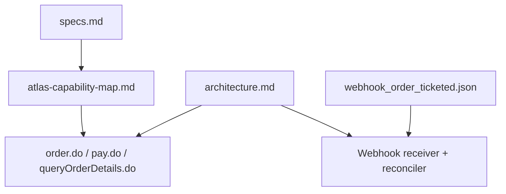
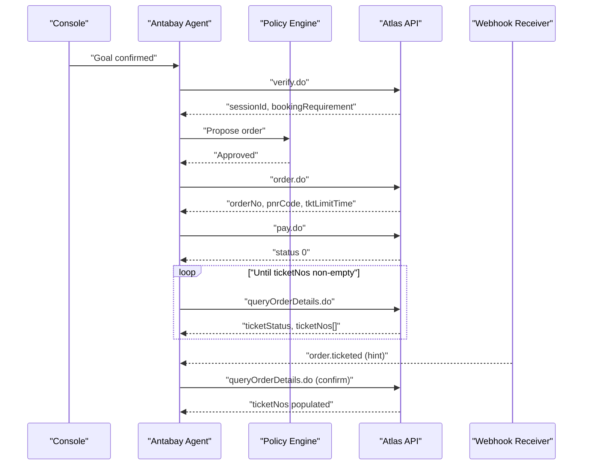
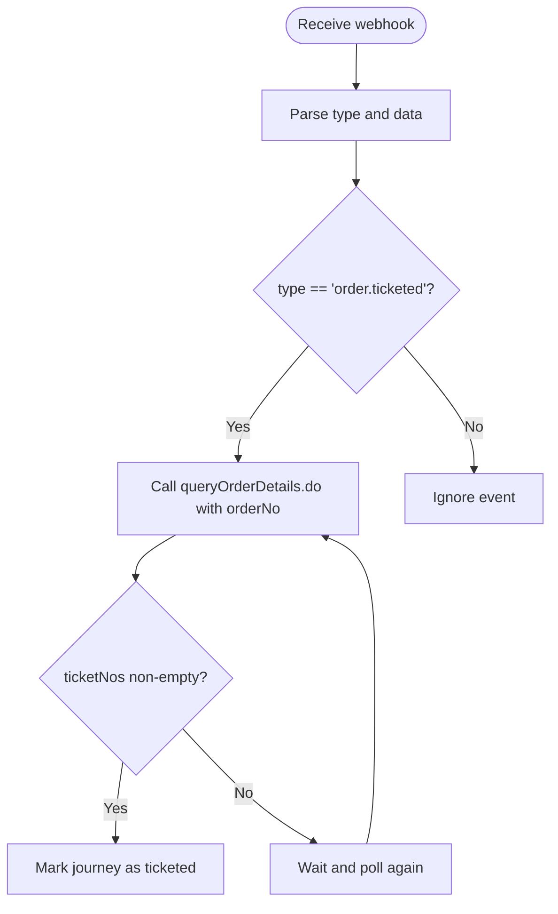
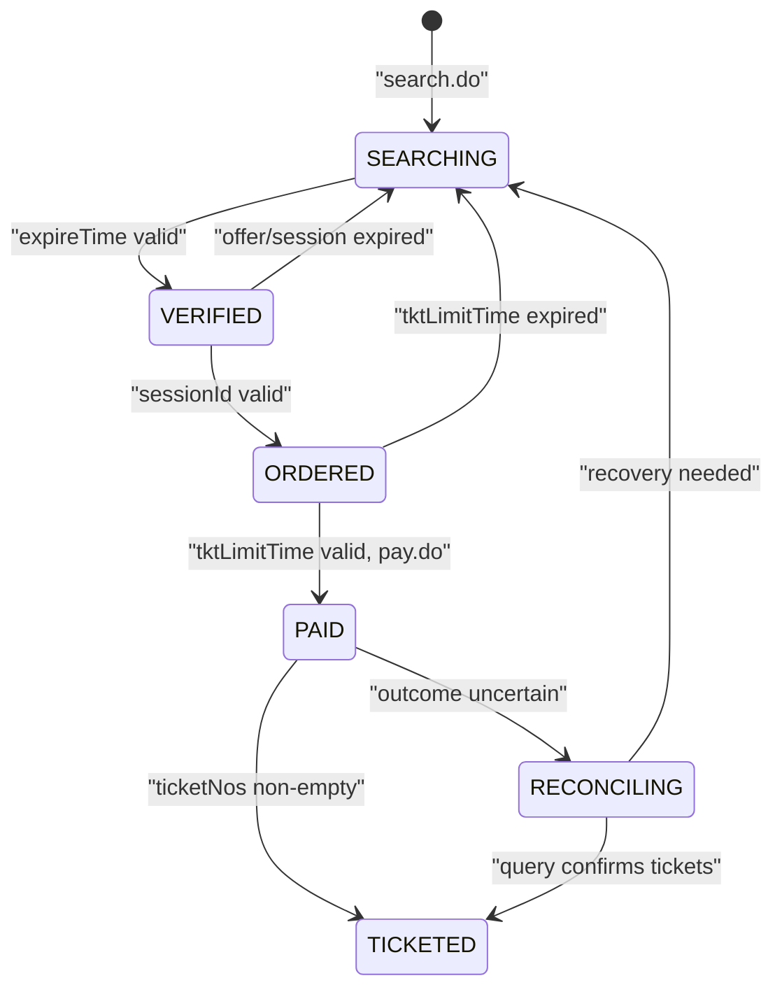
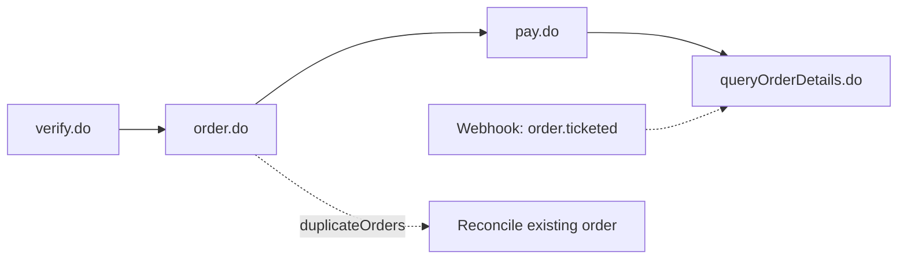
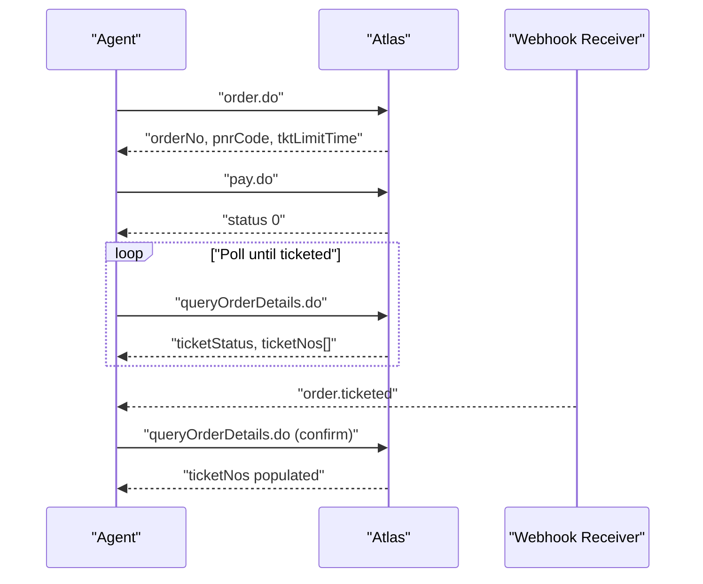

# Ordering and Payment Workflow

<cite>
**Referenced Files in This Document**
- [specs.md](file://.antabay/specs.md)
- [architecture.md](file://.antabay/architecture.md)
- [atlas-capability-map.md](file://.antabay/atlas-capability-map.md)
- [webhook_order_ticketed.json](file://fixtures/atlas/webhook_order_ticketed.json)
</cite>

## Table of Contents
1. [Introduction](#introduction)
2. [Project Structure](#project-structure)
3. [Core Components](#core-components)
4. [Architecture Overview](#architecture-overview)
5. [Detailed Component Analysis](#detailed-component-analysis)
6. [Dependency Analysis](#dependency-analysis)
7. [Performance Considerations](#performance-considerations)
8. [Troubleshooting Guide](#troubleshooting-guide)
9. [Conclusion](#conclusion)
10. [Appendices](#appendices)

## Introduction
This document explains the end-to-end ordering and payment workflow that converts verified flight options into confirmed bookings using the Atlas travel API. It focuses on:
- The order.do request schema, including sessionId usage, passenger data requirements, contact information, and the tktLimitTime constraint.
- The order response structure, including orderNo, pnrCode issuance before payment, duplicateOrders detection for idempotency, and the distinction between PNR creation and actual ticketing.
- The pay.do process using Atlas balance payments, paymentMethod configuration, and the separation between payment completion and ticketing confirmation.
- Webhook integration for order.ticketed events, authentication considerations for untrusted webhooks, and reconciliation against authoritative API queries.
- Continuation of the three-clock system with sessionId and tktLimitTime management.
- Error code handling (318 duplicates, 800 not found, 900 auth failures) and recovery procedures for failed payments or duplicate orders.

## Project Structure
The repository contains specification and architecture documents plus fixtures captured from live sandbox runs. These define the verified contract for search, verify, order, pay, query, and webhook flows.

**Diagram sources**
- [specs.md:1-120](file://.antabay/specs.md#L1-L120)
- [atlas-capability-map.md:25-35](file://.antabay/atlas-capability-map.md#L25-L35)
- [architecture.md:19-78](file://.antabay/architecture.md#L19-L78)
- [webhook_order_ticketed.json:1-53](file://fixtures/atlas/webhook_order_ticketed.json#L1-L53)

**Section sources**
- [specs.md:1-120](file://.antabay/specs.md#L1-L120)
- [atlas-capability-map.md:25-35](file://.antabay/atlas-capability-map.md#L25-L35)
- [architecture.md:19-78](file://.antabay/architecture.md#L19-L78)

## Core Components
- Order component: Converts a verified option into an order with a PNR and a ticketing deadline.
- Payment component: Charges the Atlas balance and returns payment status; does not guarantee ticketing.
- Reconciliation component: Confirms ticketing via authoritative query and handles webhooks as hints.
- Three-clock manager: Tracks offer expireTime, sessionId lifetime, and tktLimitTime to prevent stale actions.

Key responsibilities:
- Validate inputs per verified schemas.
- Enforce idempotency through duplicateOrders handling.
- Separate payment success from ticketing confirmation.
- Treat webhooks as untrusted hints and reconcile with queryOrderDetails.do.

**Section sources**
- [atlas-capability-map.md:236-313](file://.antabay/atlas-capability-map.md#L236-L313)
- [architecture.md:89-148](file://.antabay/architecture.md#L89-L148)

## Architecture Overview
The backend orchestrates a sequence of Atlas calls and state transitions. The agent proposes actions, policy decides authority, and the tool layer executes verified endpoints. Webhooks wake the agent but never change state without reconciliation.

**Diagram sources**
- [architecture.md:89-148](file://.antabay/architecture.md#L89-L148)
- [atlas-capability-map.md:236-313](file://.antabay/atlas-capability-map.md#L236-L313)

## Detailed Component Analysis

### Order Request Schema and Constraints
- Required fields:
  - cid: client identifier.
  - sessionId: obtained from verify.do; must be preserved byte-for-byte.
  - passengers: array of passenger objects with required fields such as name, birthday, gender, nationality, passengerType; optional card fields may be present depending on bookingRequirement.
  - contact: object containing name, email, mobile.
  - requestSource: set to antabay.
- Critical constraint:
  - tktLimitTime: returned by order.do; defines the window within which payment and subsequent ticketing must complete. Observed as 30 minutes post-order.

Passenger data requirements are dynamic and provided by verify.do’s bookingRequirement.passenger. Do not hardcode fields; read and enforce at runtime.

**Section sources**
- [atlas-capability-map.md:198-215](file://.antabay/atlas-capability-map.md#L198-L215)
- [atlas-capability-map.md:240-269](file://.antabay/atlas-capability-map.md#L240-L269)
- [atlas-capability-map.md:304-313](file://.antabay/atlas-capability-map.md#L304-L313)

### Order Response Structure and Idempotency
- Primary identifiers:
  - orderNo: unique order reference used by pay.do and queryOrderDetails.do.
  - pnrCode: issued at order time; indicates a reservation exists but is not proof of ticketing.
- Financial fields:
  - totalPrice, totalTransactionFee, currency, vendorTotalPrice, vendorCurrency.
- Ticketing deadline:
  - tktLimitTime: start of the 30-minute ticketing window after order creation.
- Additional context:
  - paxTicketInfos[], routing, sessionId, offerId, originalOrderNo, ticketOrderNo, includeExtraBaggage, paymentOptions.
- Duplicate detection:
  - duplicateOrders: Atlas-supplied list indicating a prior identical booking attempt; use it to reconcile instead of retrying.

Important distinction:
- PNR creation occurs at order time.
- Actual ticketing requires payment and subsequent confirmation via queryOrderDetails.do when ticketNos becomes non-empty.

**Section sources**
- [atlas-capability-map.md:240-269](file://.antabay/atlas-capability-map.md#L240-L269)
- [atlas-capability-map.md:285-303](file://.antabay/atlas-capability-map.md#L285-L303)

### Pay.do Process and Balance Payments
- Request:
  - cid, orderNo, requestSource.
- Payment method:
  - paymentMethod: 1 — payment is taken from the Atlas balance; no card details are sent in this flow.
- Response:
  - orderNo, pnrCode, paymentMethod, airlines[], status, msg.
- Post-payment behavior:
  - Payment success does not imply ticketing. Immediately after pay.do, ticketStatus can still be “0” and ticketNos empty. Continue polling queryOrderDetails.do until ticketNos is non-empty.

**Section sources**
- [atlas-capability-map.md:271-283](file://.antabay/atlas-capability-map.md#L271-L283)
- [atlas-capability-map.md:285-303](file://.antabay/atlas-capability-map.md#L285-L303)

### Webhook Integration and Reconciliation Strategy
- Event type:
  - order.ticketed delivered as POST with Content-Type application/json;charset=UTF-8.
- Envelope:
  - Includes cid, type, status, and data with orderNo, orderStatus, and paxTicketInfos containing airlinePNRs and ticketNos.
- Authentication:
  - Unauthenticated; treat as an untrusted hint. No signature or shared secret was observed.
- Reconciliation:
  - On receiving order.ticketed, call queryOrderDetails.do to confirm ticketing before updating journey state.
- Timing:
  - In observed runs, ticketing arrived approximately 35 seconds after payment.

**Diagram sources**
- [webhook_order_ticketed.json:1-53](file://fixtures/atlas/webhook_order_ticketed.json#L1-L53)
- [atlas-capability-map.md:315-379](file://.antabay/atlas-capability-map.md#L315-L379)

**Section sources**
- [atlas-capability-map.md:315-379](file://.antabay/atlas-capability-map.md#L315-L379)
- [webhook_order_ticketed.json:1-53](file://fixtures/atlas/webhook_order_ticketed.json#L1-L53)

### Three-Clock System and Continuation
- Offer clock:
  - expireTime from search.do; short and variable; may arrive pre-aged.
- Session clock:
  - sessionId from verify.do; replaces offer expiry; documented up to 2 hours.
- Ticketing clock:
  - tktLimitTime from order.do; observed as 30 minutes; must complete payment and ticketing within this window.

Continuation strategy:
- Persist sessionId and tktLimitTime with issue times.
- On restart or long gaps, validate clocks before proceeding; if expired, return to search.
- Display remaining time in the console and block actions when clocks are spent.

**Diagram sources**
- [architecture.md:212-257](file://.antabay/architecture.md#L212-L257)
- [atlas-capability-map.md:304-313](file://.antabay/atlas-capability-map.md#L304-L313)

**Section sources**
- [atlas-capability-map.md:304-313](file://.antabay/atlas-capability-map.md#L304-L313)
- [architecture.md:212-257](file://.antabay/architecture.md#L212-L257)

### Error Code Handling and Recovery Procedures
- 318 duplicate booking:
  - Read duplicateOrders[] from order.do response; query the existing order via queryOrderDetails.do; resume from its real state; do not retry order.do.
- 800 order not found:
  - Treat as a bug in internal state; investigate persisted order references; do not retry blindly.
- 900 authentication failure:
  - Credentials or account problem; stop retries; alert operators; fix environment configuration.

Recovery for failed payments:
- If pay.do fails or outcome is uncertain, reconcile via queryOrderDetails.do to determine current orderStatus and ticketStatus.
- If tktLimitTime has elapsed, return to search and re-verify to obtain a fresh sessionId.

**Section sources**
- [atlas-capability-map.md:400-415](file://.antabay/atlas-capability-map.md#L400-L415)
- [atlas-capability-map.md:285-303](file://.antabay/atlas-capability-map.md#L285-L303)

## Dependency Analysis
The ordering and payment flow depends on a strict sequence of verified endpoints and external services.

**Diagram sources**
- [atlas-capability-map.md:25-35](file://.antabay/atlas-capability-map.md#L25-L35)
- [atlas-capability-map.md:236-313](file://.antabay/atlas-capability-map.md#L236-L313)
- [atlas-capability-map.md:315-379](file://.antabay/atlas-capability-map.md#L315-L379)

**Section sources**
- [atlas-capability-map.md:25-35](file://.antabay/atlas-capability-map.md#L25-L35)
- [atlas-capability-map.md:236-313](file://.antabay/atlas-capability-map.md#L236-L313)

## Performance Considerations
- Respect rate limits:
  - search.do: 10 QPS.
  - verify.do and getOffers.do share 60 QPM.
  - seatAvailability.do and getLuggage.do share 60 QPM.
- Avoid redundant calls:
  - Use duplicateOrders to skip retries on 318.
  - Cache queryOrderDetails results briefly during reconciliation loops.
- Minimize latency:
  - Poll queryOrderDetails.do with bounded backoff until ticketNos is non-empty.
  - Do not wait for webhooks to proceed; always confirm via API.

[No sources needed since this section provides general guidance]

## Troubleshooting Guide
Common issues and resolutions:
- Duplicate order detected (318):
  - Action: Read duplicateOrders[], query the referenced order, adopt its state, continue to payment or ticketing confirmation.
- Order not found (800):
  - Action: Inspect persisted orderNo; check for corruption or mismatch; do not retry order.do.
- Authentication failure (900):
  - Action: Verify credentials and environment; halt automated retries; notify operators.
- Paid but not ticketed:
  - Action: Poll queryOrderDetails.do until ticketNos is non-empty; do not mark journey as complete based on pay.do alone.
- Expired session or ticketing window:
  - Action: Return to search and verify to obtain a new sessionId; ensure tktLimitTime is respected.

**Section sources**
- [atlas-capability-map.md:400-415](file://.antabay/atlas-capability-map.md#L400-L415)
- [atlas-capability-map.md:285-303](file://.antabay/atlas-capability-map.md#L285-L303)

## Conclusion
The order.do and pay.do workflows convert verified flight options into confirmed bookings through a carefully sequenced process governed by three clocks and strict reconciliation rules. Key practices include:
- Using sessionId from verify.do and honoring tktLimitTime from order.do.
- Treating PNR issuance as reservation creation, not ticketing.
- Charging via Atlas balance with paymentMethod 1 and separating payment success from ticketing confirmation.
- Treating webhooks as untrusted hints and confirming all state changes via queryOrderDetails.do.
- Handling errors (318, 800, 900) with targeted recovery strategies and avoiding blind retries.

[No sources needed since this section summarizes without analyzing specific files]

## Appendices

### Appendix A: End-to-End Sequence

**Diagram sources**
- [architecture.md:89-148](file://.antabay/architecture.md#L89-L148)
- [atlas-capability-map.md:236-313](file://.antabay/atlas-capability-map.md#L236-L313)