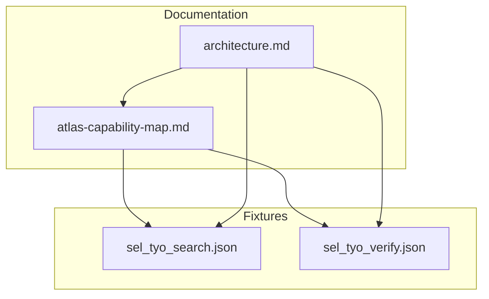
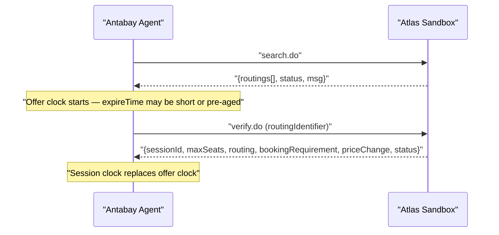
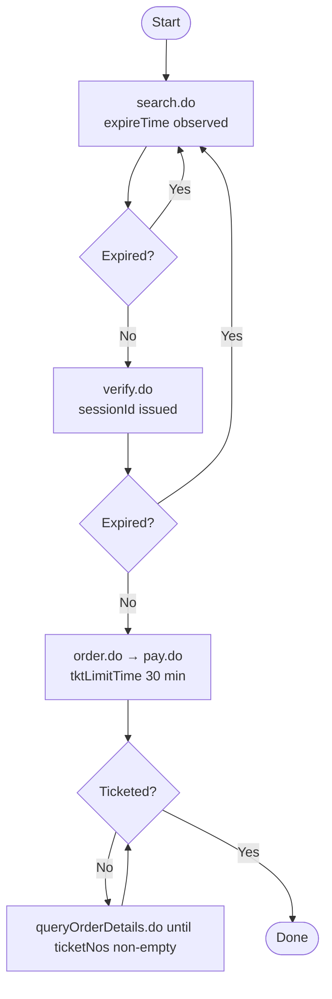

# Search and Verification Workflow

<cite>
**Referenced Files in This Document**
- [sel_tyo_search.json](file://fixtures/atlas/sel_tyo_search.json)
- [sel_tyo_verify.json](file://fixtures/atlas/sel_tyo_verify.json)
- [architecture.md](file://antabay/architecture.md)
- [atlas-capability-map.md](file://antabay/atlas-capability-map.md)
</cite>

## Table of Contents
1. [Introduction](#introduction)
2. [Project Structure](#project-structure)
3. [Core Components](#core-components)
4. [Architecture Overview](#architecture-overview)
5. [Detailed Component Analysis](#detailed-component-analysis)
6. [Dependency Analysis](#dependency-analysis)
7. [Performance Considerations](#performance-considerations)
8. [Troubleshooting Guide](#troubleshooting-guide)
9. [Conclusion](#conclusion)

## Introduction
This document explains the Atlas search and verification workflow that powers flight discovery in Antabay. It covers the complete search.do request schema, the search response envelope, the verify.do process including routingIdentifier preservation, priceChange detection, bookingRequirement validation, and the critical transition from offer-based to session-based freshness management. It also documents the three-clock system (expireTime, sessionId, tktLimitTime), rate limiting constraints, and error handling patterns. Concrete examples are drawn from the SEL→TYO fixtures to show how real API responses map to Antabay’s internal representations.

## Project Structure
The repository contains:
- Verified Atlas capability documentation describing endpoints, schemas, constraints, and observed values.
- Architecture diagrams showing the end-to-end flow from goal to ticketed, including the role of search.do and verify.do.
- Fixture files with captured sandbox responses for search and verify on a specific route and date.

**Diagram sources**
- [atlas-capability-map.md:40-125](file://antabay/atlas-capability-map.md#L40-L125)
- [architecture.md:19-86](file://antabay/architecture.md#L19-L86)

**Section sources**
- [atlas-capability-map.md:40-125](file://antabay/atlas-capability-map.md#L40-L125)
- [architecture.md:19-86](file://antabay/architecture.md#L19-L86)

## Core Components
- search.do: Returns a list of routings with pricing, segments, baggage rules, ancillaries, and per-offer expireTime.
- verify.do: Confirms availability and price for a selected routing, returns sessionId, maxSeats, bookingRequirement, and priceChange.
- order.do/pay.do/queryOrderDetails.do: Complete booking lifecycle after verification; not the focus here but referenced for context.

Key responsibilities:
- Enforce currency requirements and total price formula.
- Preserve identifiers exactly (routingIdentifier, sessionId).
- Manage freshness via three clocks.
- Validate passenger fields dynamically using bookingRequirement.

**Section sources**
- [atlas-capability-map.md:40-125](file://antabay/atlas-capability-map.md#L40-L125)
- [atlas-capability-map.md:152-235](file://antabay/atlas-capability-map.md#L152-L235)

## Architecture Overview
The Antabay Agent orchestrates the journey by calling Atlas endpoints in sequence. The search phase produces time-bounded offers; verification transitions to a longer-lived session used for ordering.

**Diagram sources**
- [architecture.md:89-148](file://antabay/architecture.md#L89-L148)
- [atlas-capability-map.md:40-125](file://antabay/atlas-capability-map.md#L40-L125)
- [atlas-capability-map.md:152-235](file://antabay/atlas-capability-map.md#L152-L235)

**Section sources**
- [architecture.md:89-148](file://antabay/architecture.md#L89-L148)
- [atlas-capability-map.md:40-125](file://antabay/atlas-capability-map.md#L40-L125)

## Detailed Component Analysis

### search.do Request Schema
- Required fields: cid, tripType, adultNum, childNum, infantNum, fromCity, toCity, fromDate, currency, requestSource.
- Optional fields: fromAirport, toAirport, airlines (array), includeMultipleFareFamily.
- Currency must be explicitly set to USD in sandbox.
- Dates use YYYYMMDD format.
- tripType "1" is one-way; "2" is return and requires retDate.

Example mapping to fixture:
- Route: SEL → TYO on 2026-09-05, one-way, 1 adult, 0 children, 0 infants, currency USD.

**Section sources**
- [atlas-capability-map.md:40-59](file://antabay/atlas-capability-map.md#L40-L59)
- [atlas-capability-map.md:19-23](file://antabay/atlas-capability-map.md#L19-L23)

### search.do Response Envelope and Routing Fields
- Envelope: { routings[], status, msg, requestId, clientRequestId }.
- status == 0 indicates success; assert on this field, not only HTTP status.
- Per-routing fields used by Antabay:
  - fid, routingIdentifier (preserve exactly), currency, adultPrice, adultTax, transactionFeePerPax.
  - fromSegments[], retSegments[] (empty for one-way), seatCount (scarcity signal), riskSellout.
  - refreshTime, expireTime (offer lifetime), separateBookings.
  - rule.hasBaggage, rule.baggageElements[], rule.refundRules[], rule.changesRules[].
  - ancillarySupported[], supportCreditTransPayment.

Total price per adult:
- adultPrice + adultTax + transactionFeePerPax.

Segment times are local airport times in YYYYMMDDHHMM format.

Fixture evidence:
- Multiple routings returned with USD fares, KRW refund/change fees, seatCount varying per segment, and expireTime near ~30 minutes.

**Section sources**
- [atlas-capability-map.md:61-105](file://antabay/atlas-capability-map.md#L61-L105)
- [sel_tyo_search.json:1-1004](file://fixtures/atlas/sel_tyo_search.json#L1-L1004)

### verify.do Process
- Request: routingIdentifier (byte-for-byte from search), optional maxResponseTime, requestSource.
- Response envelope: { sessionId, maxSeats, routing, bookingRequirement, priceChange, status, msg, requestId, clientRequestId }.
- status == 0 and msg "success" indicate success.

Critical behaviors:
- routingIdentifier must be preserved exactly from search.
- priceChange.isPriceChange indicates whether the price changed since selection; when true, prior human approval is void.
- bookingRequirement.passenger provides a runtime schema for required passenger fields; do not hardcode forms.
- Freshness transition: routing.refreshTime and routing.expireTime are null in verify response; post-verify freshness is governed by sessionId (documented up to 2 hours).

Fixture evidence:
- Verify response includes sessionId, maxSeats, routing mirroring search shape, bookingRequirement with passenger field types and required flags, and priceChange with original/new prices.

**Section sources**
- [atlas-capability-map.md:152-235](file://antabay/atlas-capability-map.md#L152-L235)
- [sel_tyo_verify.json:1-393](file://fixtures/atlas/sel_tyo_verify.json#L1-L393)

### Mapping Real API Responses to Antabay Models
Using the SEL→TYO fixtures:
- Search returns multiple routings with USD fares and KRW rule amounts; seatCount signals scarcity; expireTime governs offer freshness.
- Verify confirms a specific routing, returns sessionId and updated pricing, and supplies bookingRequirement for passenger data collection.
- Ancillary options (e.g., luggage) are present with both client-facing USD prices and vendor-side KRW prices.

Representative mappings:
- Offer identity: fid/routingIdentifier preserved across search → verify → order.
- Pricing: adultPrice + adultTax + transactionFeePerPax equals total per adult; verify may reflect price changes.
- Rules: refundRules and changesRules contain time-banded fees in KRW; do not mix currencies without explicit conversion.
- Ancillaries: ancillaryProductElements include price in USD and vendorPrice/vendorCurrency (KRW).

**Section sources**
- [sel_tyo_search.json:1-1004](file://fixtures/atlas/sel_tyo_search.json#L1-L1004)
- [sel_tyo_verify.json:1-393](file://fixtures/atlas/sel_tyo_verify.json#L1-L393)
- [atlas-capability-map.md:61-125](file://antabay/atlas-capability-map.md#L61-L125)

### Three-Clock System
- expireTime (offer): Short-lived, observed between ~7m43s and ~31m; may arrive partially aged due to caching. Governs pre-verify freshness.
- sessionId (session): Post-verify freshness window documented up to 2 hours; replace expireTime once verified.
- tktLimitTime (ticketing): Post-order window of 30 minutes to complete payment and ticketing.

Each expiry sends the journey back to search. All three are tracked in state and displayed in the console with remaining time.

**Diagram sources**
- [atlas-capability-map.md:304-313](file://antabay/atlas-capability-map.md#L304-L313)
- [architecture.md:261-279](file://antabay/architecture.md#L261-L279)

**Section sources**
- [atlas-capability-map.md:107-125](file://antabay/atlas-capability-map.md#L107-L125)
- [atlas-capability-map.md:304-313](file://antabay/atlas-capability-map.md#L304-L313)
- [architecture.md:261-279](file://antabay/architecture.md#L261-L279)

### Rate Limiting Constraints
- search.do: 10 QPS.
- verify.do and getOffers.do share 60 QPM.
- seatAvailability.do and getLuggage.do share 60 QPM.
- Over-limit returns 429 with retryAfter; implement no retry loops.

**Section sources**
- [atlas-capability-map.md:117-121](file://antabay/atlas-capability-map.md#L117-L121)

### Error Handling Patterns
- status == 0 means success; assert on this field.
- Duplicate booking (318): read duplicateOrders[], query existing order, resume from its real state; never retry.
- Order not exists (800): treat as a bug in own state, not retryable.
- Auth failed (900): credentials/account problem; do not retry.
- Webhook status semantics differ: webhook status -1 can indicate success; do not gate on status == 0.

**Section sources**
- [atlas-capability-map.md:400-415](file://antabay/atlas-capability-map.md#L400-L415)
- [atlas-capability-map.md:353-378](file://antabay/atlas-capability-map.md#L353-L378)

## Dependency Analysis
The search/verify workflow depends on precise identifier preservation and strict adherence to currency and freshness rules.

**Diagram sources**
- [atlas-capability-map.md:40-125](file://antabay/atlas-capability-map.md#L40-L125)
- [atlas-capability-map.md:152-235](file://antabay/atlas-capability-map.md#L152-L235)
- [atlas-capability-map.md:304-313](file://antabay/atlas-capability-map.md#L304-L313)

**Section sources**
- [atlas-capability-map.md:40-125](file://antabay/atlas-capability-map.md#L40-L125)
- [atlas-capability-map.md:152-235](file://antabay/atlas-capability-map.md#L152-L235)
- [atlas-capability-map.md:304-313](file://antabay/atlas-capability-map.md#L304-L313)

## Performance Considerations
- Offer expiry is short and variable; check freshness before every decision.
- Cache effects can deliver partially aged offers; always compute remaining time against expireTime.
- Respect rate limits strictly; avoid retry loops on 429.
- Use seatCount and riskSellout as scarcity signals to prioritize inventory pressure.

[No sources needed since this section provides general guidance]

## Troubleshooting Guide

Common issues and resolutions:
- Expired offers: If expireTime has elapsed, re-run search.do to obtain fresh routings. Do not proceed to verify with stale identifiers.
- Currency mixing hazards: Fares are in USD; refundRules and changesRules may be in IDR/KRW depending on route. Never combine them without explicit conversion; do not invent exchange rates.
- Seat availability signals: Monitor seatCount per segment and riskSellout flag; low counts indicate urgency and potential sellout.
- Price change after verification: Read priceChange.isPriceChange; if true, prior approvals are void and re-approval is required.
- Duplicate orders: On status 318, reconcile using duplicateOrders[] and query the existing order; do not retry booking.
- Payment vs ticketing: Payment success does not guarantee ticketing; poll queryOrderDetails.do until ticketNos is non-empty.

**Section sources**
- [atlas-capability-map.md:107-125](file://antabay/atlas-capability-map.md#L107-L125)
- [atlas-capability-map.md:183-235](file://antabay/atlas-capability-map.md#L183-L235)
- [atlas-capability-map.md:236-313](file://antabay/atlas-capability-map.md#L236-L313)
- [atlas-capability-map.md:400-415](file://antabay/atlas-capability-map.md#L400-L415)

## Conclusion
The Atlas search and verification workflow hinges on precise request/response handling, strict identifier preservation, and robust freshness management through the three-clock system. The SEL→TYO fixtures demonstrate real-world pricing, rules, and ancillary structures, while the capability map codifies constraints like currency requirements, rate limits, and error codes. By adhering to these contracts and monitoring seat availability and price changes, Antabay can reliably discover, verify, and book flights while maintaining correctness under tight time windows and external variability.