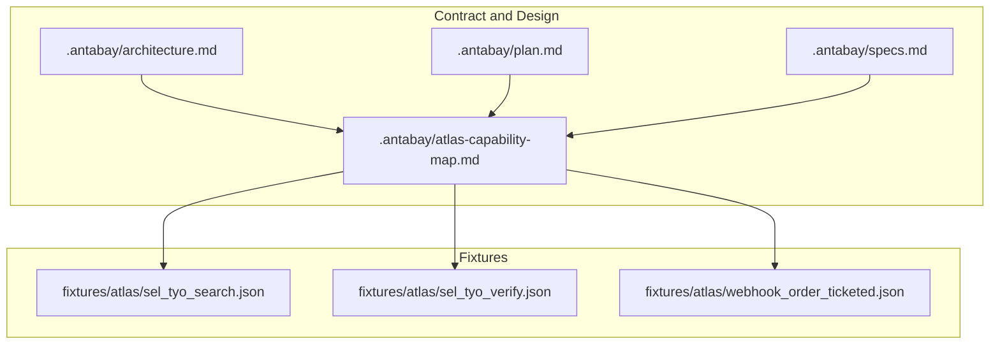
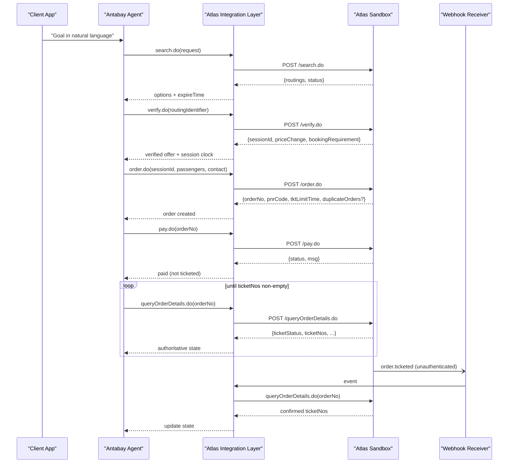
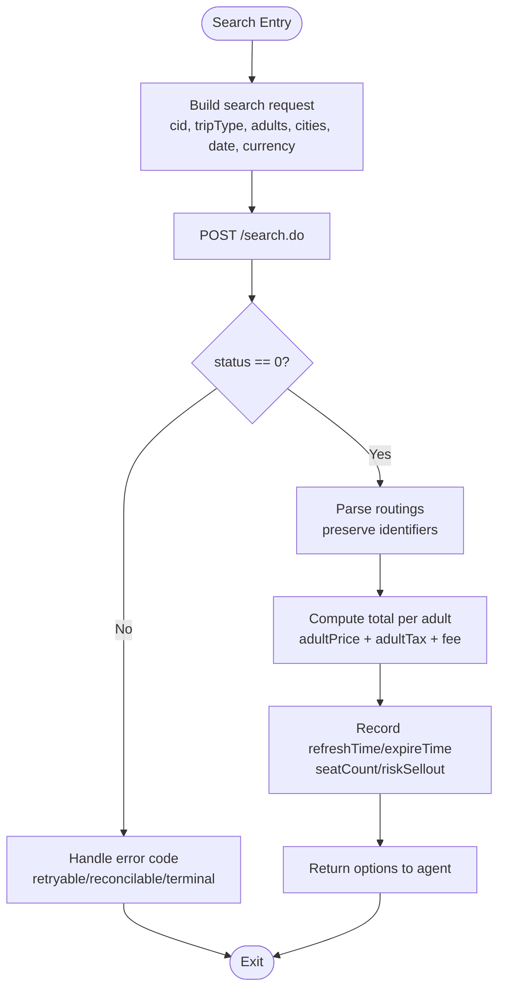
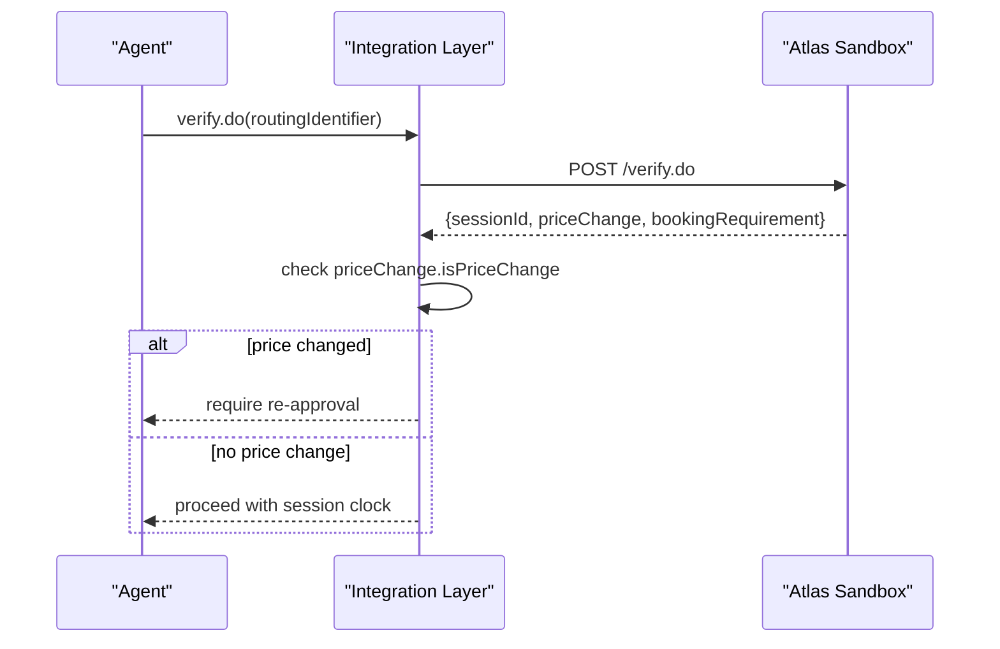
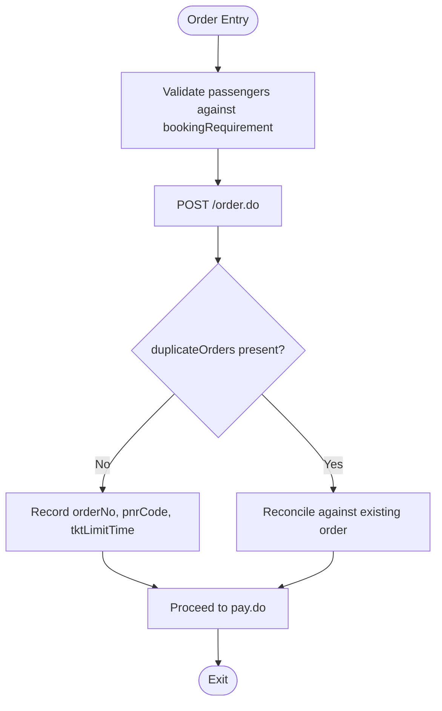
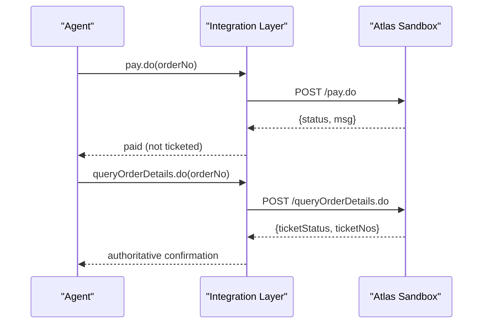
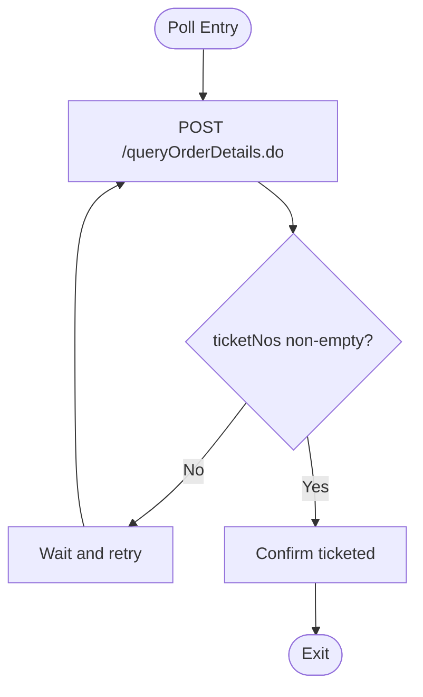
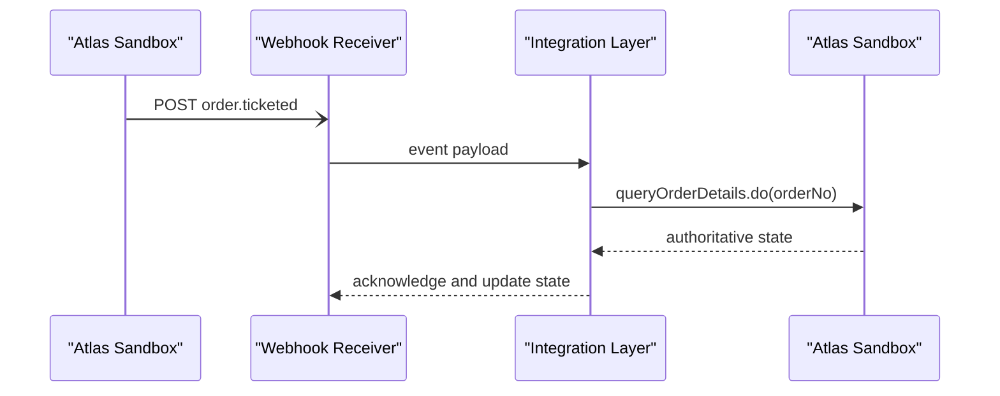
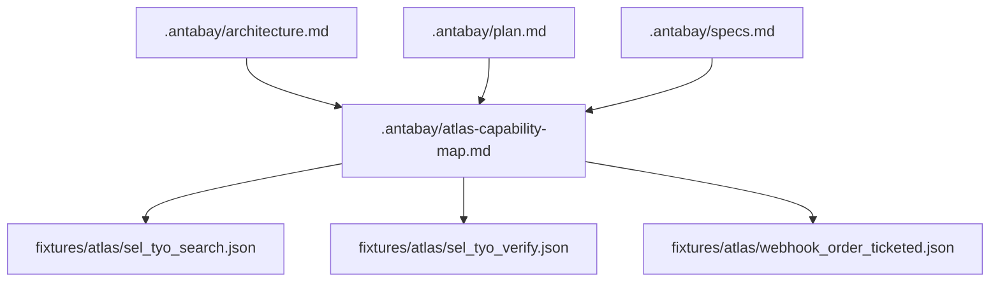

# Atlas Integration Layer

<cite>
**Referenced Files in This Document**
- [atlas-capability-map.md](file://.antabay/atlas-capability-map.md)
- [architecture.md](file://.antabay/architecture.md)
- [plan.md](file://.antabay/plan.md)
- [specs.md](file://.antabay/specs.md)
- [sel_tyo_search.json](file://fixtures/atlas/sel_tyo_search.json)
- [sel_tyo_verify.json](file://fixtures/atlas/sel_tyo_verify.json)
- [webhook_order_ticketed.json](file://fixtures/atlas/webhook_order_ticketed.json)
</cite>

## Table of Contents
1. [Introduction](#introduction)
2. [Project Structure](#project-structure)
3. [Core Components](#core-components)
4. [Architecture Overview](#architecture-overview)
5. [Detailed Component Analysis](#detailed-component-analysis)
6. [Dependency Analysis](#dependency-analysis)
7. [Performance Considerations](#performance-considerations)
8. [Troubleshooting Guide](#troubleshooting-guide)
9. [Conclusion](#conclusion)
10. [Appendices](#appendices)

## Introduction
This document describes the Atlas Integration Layer as a type-safe wrapper around the verified Atlas API contract used by Antabay to book flights end-to-end. It focuses on how internal models map to Atlas endpoints, request and response schemas, error handling, rate limiting, authentication, session management, offer staleness, reconciliation of webhooks versus authoritative queries, and testing strategies using provided fixtures. The goal is to make this accessible for beginners while providing enough technical depth for experienced developers extending or adding new capabilities.

The integration covers the verified flow: search.do → verify.do → order.do → pay.do → queryOrderDetails.do, plus webhook handling for order.ticketed events. All endpoint names, fields, and behaviors documented here are grounded in the verified capability map and real sandbox responses captured in fixtures.

## Project Structure
At a high level, the repository contains:
- Verified contract and architecture documents under .antabay that define the external interface and system design.
- Fixtures under fixtures/atlas that capture real sandbox responses and webhook payloads used for tests and examples.
- Execution plans and specs that describe how the integration should behave across the booking journey.

**Diagram sources**
- [atlas-capability-map.md:1-424](file://.antabay/atlas-capability-map.md#L1-L424)
- [architecture.md:1-279](file://.antabay/architecture.md#L1-L279)
- [plan.md:1-570](file://.antabay/plan.md#L1-L570)
- [specs.md:1-800](file://.antabay/specs.md#L1-L800)

**Section sources**
- [atlas-capability-map.md:1-424](file://.antabay/atlas-capability-map.md#L1-L424)
- [architecture.md:1-279](file://.antabay/architecture.md#L1-L279)
- [plan.md:1-570](file://.antabay/plan.md#L1-L570)
- [specs.md:1-800](file://.antabay/specs.md#L1-L800)

## Core Components
The Atlas Integration Layer wraps these verified endpoints with typed requests and responses, preserving identifiers exactly as returned and enforcing canonical price calculations and freshness checks.

- Endpoint coverage:
  - search.do: returns routings with pricing, segments, baggage rules, ancillaries, refreshTime, expireTime, riskSellout, seatCount, and support flags.
  - verify.do: locks an offer into a sessionId, returns bookingRequirement schema and priceChange delta; offer-level expireTime becomes null post-verify.
  - order.do: creates an order with passengers and contact, returns orderNo, pnrCode, tktLimitTime, paymentOptions, duplicateOrders signal, and routing snapshot.
  - pay.do: charges via balance (paymentMethod 1), returns status and metadata; does not confirm ticketing.
  - queryOrderDetails.do: authoritative state including orderStatus, ticketStatus, ticketNos, airlinePNRs, payTime, createdTime, updatedTime, tktLimitTime, vccStatus, paymentAttempted, errorCode, errorMessage, ifSeatOccupied, itineraryDownload, refundRules, airlineBookings, airlineMessage.

- Request/response schemas:
  - Search request includes cid, tripType, adultNum, childNum, infantNum, fromCity, toCity, fromDate, currency, requestSource, optional airports and airlines.
  - Verify request uses routingIdentifier byte-for-byte from search, maxResponseTime, requestSource.
  - Order request uses sessionId, passengers per bookingRequirement.passenger, contact, requestSource.
  - Pay request uses orderNo and requestSource; no card details.
  - QueryOrderDetails request uses cid, orderNo, requestSource.

- Error handling:
  - Status 0 means success; assert on status, not HTTP code alone.
  - Known codes: 318 duplicate booking (reconcile against returned order), 800 order not exists (internal bug path), 900 auth failed (terminal).
  - Rate limit returns 429 with retryAfter; do not retry before interval elapses.

- Authentication and environment:
  - Base URL sandbox.atriptech.com.
  - Headers x-atlas-client-id and x-atlas-client-secret required.
  - Accept-Encoding gzip required.
  - Currency must be USD explicitly in sandbox.
  - Extra field cid observed in working request bodies.

- Offer staleness and clocks:
  - Pre-verify: governed by expireTime; observed windows short (minutes), sometimes already partially aged on arrival.
  - Post-verify: governed by sessionId; longer but bounded.
  - Post-order: tktLimitTime governs ticketing window (observed 30 minutes).

- Webhook handling:
  - Unauthenticated; treat as hint only.
  - Must confirm claims via queryOrderDetails.do before changing journey state.
  - Event type is dotted string (e.g., order.ticketed); status semantics differ from API status.

**Section sources**
- [atlas-capability-map.md:12-34](file://.antabay/atlas-capability-map.md#L12-L34)
- [atlas-capability-map.md:40-125](file://.antabay/atlas-capability-map.md#L40-L125)
- [atlas-capability-map.md:152-313](file://.antabay/atlas-capability-map.md#L152-L313)
- [atlas-capability-map.md:315-379](file://.antabay/atlas-capability-map.md#L315-L379)
- [atlas-capability-map.md:393-416](file://.antabay/atlas-capability-map.md#L393-L416)

## Architecture Overview
The integration layer sits between the Antabay Agent and the Atlas Sandbox. It enforces the verified contract, preserves identifiers, tracks three clocks (offer, session, ticket limit), and ensures authoritative verification after each action.

**Diagram sources**
- [architecture.md:89-148](file://.antabay/architecture.md#L89-L148)
- [atlas-capability-map.md:236-313](file://.antabay/atlas-capability-map.md#L236-L313)
- [atlas-capability-map.md:315-379](file://.antabay/atlas-capability-map.md#L315-L379)

## Detailed Component Analysis

### search.do — Inventory Discovery
- Purpose: Retrieve travel options matching origin, destination, date, and traveler count.
- Request schema: cid, tripType, adultNum, childNum, infantNum, fromCity, toCity, fromDate, currency, requestSource; optional fromAirport, toAirport, airlines, includeMultipleFareFamily.
- Response envelope: { routings[], status, msg, requestId, clientRequestId }; status 0 indicates success.
- Key routing fields: fid, routingIdentifier, currency, adultPrice, adultTax, transactionFeePerPax, fromSegments[], retSegments[], seatCount, riskSellout, refreshTime, expireTime, separateBookings, rule.hasBaggage/rule.baggageElements[], rule.refundRules[]/rule.changesRules[], ancillarySupported[], supportCreditTransPayment.
- Segment fields: segmentIndex, carrier, flightNumber, depAirport, depTime, arrAirport, arrTime, stopCities, duration, codeShare, cabinClass, seatCount, aircraftCode, fareFamily. Times are local airport times in YYYYMMDDHHMM format.
- Total price formula: total_per_adult = adultPrice + adultTax + transactionFeePerPax.
- Fixture example: sel_tyo_search.json shows multiple routings with pricing breakdowns, baggage rules, ancillaries, refreshTime and expireTime per option.

**Diagram sources**
- [atlas-capability-map.md:40-125](file://.antabay/atlas-capability-map.md#L40-L125)
- [sel_tyo_search.json:1-800](file://fixtures/atlas/sel_tyo_search.json#L1-L800)

**Section sources**
- [atlas-capability-map.md:40-125](file://.antabay/atlas-capability-map.md#L40-L125)
- [sel_tyo_search.json:1-800](file://fixtures/atlas/sel_tyo_search.json#L1-L800)

### verify.do — Offer Locking and Price Confirmation
- Purpose: Lock a selected routing into a session and confirm price and passenger requirements.
- Request schema: routingIdentifier (byte-for-byte from search), maxResponseTime, requestSource.
- Response envelope: { sessionId, maxSeats, routing, bookingRequirement, priceChange, status, msg, requestId, clientRequestId }.
- Critical behavior:
  - priceChange.isPriceChange invalidates prior human approval when true.
  - bookingRequirement.passenger provides runtime schema for required fields (name, birthday, gender, nationality, passengerType, optional card fields).
  - After verify, routing.refreshTime and routing.expireTime become null; freshness shifts to sessionId window.
- Fixture example: sel_tyo_verify.json demonstrates sessionId, routing snapshot, bookingRequirement structure, and priceChange object.

**Diagram sources**
- [atlas-capability-map.md:152-227](file://.antabay/atlas-capability-map.md#L152-L227)
- [sel_tyo_verify.json:1-393](file://fixtures/atlas/sel_tyo_verify.json#L1-L393)

**Section sources**
- [atlas-capability-map.md:152-227](file://.antabay/atlas-capability-map.md#L152-L227)
- [sel_tyo_verify.json:1-393](file://fixtures/atlas/sel_tyo_verify.json#L1-L393)

### order.do — Booking Creation
- Purpose: Create an order using the locked session and passenger data.
- Request schema: cid, sessionId, passengers (per bookingRequirement.passenger), contact, requestSource.
- Response keys: orderNo, pnrCode, totalPrice, totalTransactionFee, currency, vendorTotalPrice, vendorCurrency, tktLimitTime, paxTicketInfos[], routing, sessionId, offerId, originalOrderNo, ticketOrderNo, includeExtraBaggage, paymentOptions, duplicateOrders, status, msg.
- Important signals:
  - duplicateOrders is Atlas’s duplicate signal; reconcile rather than retry.
  - PNR issued at order time is not proof of ticketing.
  - tktLimitTime starts a 30-minute ticketing window.
- Fixture reference: Capability map documents observed values and behavior; use queryOrderDetails.do to confirm ticketing.

**Diagram sources**
- [atlas-capability-map.md:236-313](file://.antabay/atlas-capability-map.md#L236-L313)

**Section sources**
- [atlas-capability-map.md:236-313](file://.antabay/atlas-capability-map.md#L236-L313)

### pay.do — Payment Execution
- Purpose: Charge the order using Atlas balance (paymentMethod 1).
- Request schema: cid, orderNo, requestSource; no card details.
- Response: orderNo, pnrCode, paymentMethod, airlines[], status, msg.
- Behavior: Payment success is not proof of ticketing; continue polling queryOrderDetails.do until ticketNos populated.

**Diagram sources**
- [atlas-capability-map.md:271-313](file://.antabay/atlas-capability-map.md#L271-L313)

**Section sources**
- [atlas-capability-map.md:271-313](file://.antabay/atlas-capability-map.md#L271-L313)

### queryOrderDetails.do — Authoritative State
- Purpose: Confirm final ticketing and retrieve full order details.
- Request schema: cid, orderNo, requestSource.
- Key fields: orderStatus (string), ticketStatus (string), paxTicketInfos[].ticketNos[], airlinePNRs[], payTime, createdTime, updatedTime, tktLimitTime, vccStatus, paymentAttempted, errorCode, errorMessage, ifSeatOccupied, itineraryDownload, refundRules, airlineBookings, airlineMessage.
- Behavior: Paid is not ticketed; poll until ticketNos non-empty. Treat only non-empty ticketNos as proof of ticketing until full enum mapping is available.

**Diagram sources**
- [atlas-capability-map.md:285-313](file://.antabay/atlas-capability-map.md#L285-L313)

**Section sources**
- [atlas-capability-map.md:285-313](file://.antabay/atlas-capability-map.md#L285-L313)

### Webhook Handling — Untrusted Hint
- Registration: POST /updateWebhookURL.do with cid and url; account-wide registration.
- Envelope: { cid, type, status, data }, where type is dotted string (e.g., order.ticketed).
- Security: Unauthenticated; must confirm via queryOrderDetails.do before changing state.
- Fixture example: webhook_order_ticketed.json captures a real event with headers, raw body, and parsed JSON.

**Diagram sources**
- [atlas-capability-map.md:315-379](file://.antabay/atlas-capability-map.md#L315-L379)
- [webhook_order_ticketed.json:1-53](file://fixtures/atlas/webhook_order_ticketed.json#L1-L53)

**Section sources**
- [atlas-capability-map.md:315-379](file://.antabay/atlas-capability-map.md#L315-L379)
- [webhook_order_ticketed.json:1-53](file://fixtures/atlas/webhook_order_ticketed.json#L1-L53)

## Dependency Analysis
The integration layer depends on:
- Verified contract definitions in atlas-capability-map.md for endpoint names, fields, error codes, and behavior.
- Architecture and sequence diagrams in architecture.md for end-to-end flows and state transitions.
- Fixtures for recorded test data and validation of parsing logic.

**Diagram sources**
- [atlas-capability-map.md:1-424](file://.antabay/atlas-capability-map.md#L1-L424)
- [architecture.md:1-279](file://.antabay/architecture.md#L1-L279)
- [plan.md:1-570](file://.antabay/plan.md#L1-L570)
- [specs.md:1-800](file://.antabay/specs.md#L1-L800)

**Section sources**
- [atlas-capability-map.md:1-424](file://.antabay/atlas-capability-map.md#L1-L424)
- [architecture.md:1-279](file://.antabay/architecture.md#L1-L279)
- [plan.md:1-570](file://.antabay/plan.md#L1-L570)
- [specs.md:1-800](file://.antabay/specs.md#L1-L800)

## Performance Considerations
- Rate limits:
  - search.do: 10 QPS.
  - verify.do + getOffers.do: 60 QPM shared.
  - seatAvailability.do + getLuggage.do: 60 QPM shared.
  - Over-limit returns 429 with retryAfter; do not retry before interval elapses.
- Offer staleness:
  - Offers have short, variable expiry windows; some arrive already partially aged due to caching.
  - Always compute remaining usable time from current time, not receipt time.
- Currency mixing hazard:
  - Fares returned in USD; refundRules and changesRules amounts may be in other currencies (e.g., IDR/KRW). Do not combine without explicit conversion.
- Three clocks:
  - expireTime (pre-verify), sessionId (post-verify), tktLimitTime (post-order). Each has different expiry consequences and must be tracked.

[No sources needed since this section provides general guidance]

## Troubleshooting Guide
Common issues and strategies:
- Network failures:
  - Implement retries with backoff respecting retryAfter from 429 responses.
  - Log endpoint, outcome, elapsed time for every call.
- Timeout handling:
  - Set timeouts per endpoint; fail fast and surface errors to the agent for decision-making.
- Response validation:
  - Assert status 0 for success; do not rely solely on HTTP 200.
  - Validate presence of required fields (e.g., routingIdentifier, sessionId, orderNo).
  - Normalize types differing between surfaces (e.g., orderStatus integer vs string).
- Error codes:
  - 318 duplicate booking: reconcile against returned order; never retry.
  - 800 order not exists: treat as internal bug; do not retry.
  - 900 auth failed: terminal; check credentials/account.
- Webhook reliability:
  - Treat all inbound webhooks as untrusted hints; always confirm via queryOrderDetails.do.
  - Route on type field; ignore status value for success/failure semantics.

**Section sources**
- [atlas-capability-map.md:107-130](file://.antabay/atlas-capability-map.md#L107-L130)
- [atlas-capability-map.md:393-416](file://.antabay/atlas-capability-map.md#L393-L416)
- [atlas-capability-map.md:315-379](file://.antabay/atlas-capability-map.md#L315-L379)

## Conclusion
The Atlas Integration Layer provides a robust, type-safe wrapper around the verified Atlas API contract, ensuring correctness through strict schema enforcement, identifier preservation, canonical price calculation, and authoritative verification. It handles short-lived offers, session-bound bookings, and ticketing confirmation via polling. Webhooks are treated as untrusted hints and reconciled against authoritative queries. With clear error classification, rate limit compliance, and fixture-based testing, the layer supports reliable end-to-end booking and recovery workflows.

[No sources needed since this section summarizes without analyzing specific files]

## Appendices

### Testing Strategies Using Fixtures
- Recorded end-to-end tests:
  - Use sel_tyo_search.json to validate search parsing, pricing, and freshness tracking.
  - Use sel_tyo_verify.json to validate verify flow, bookingRequirement schema, and priceChange handling.
  - Use webhook_order_ticketed.json to validate webhook ingestion, normalization, and reconciliation.
- Mock implementations:
  - Mock Atlas responses using fixture shapes to simulate success, rate limits (429), duplicates (318), and auth failures (900).
  - Simulate offer expiration and session expiry to test staleness handling.
- Assertions:
  - Assert status 0 for success.
  - Assert duplicateOrders presence and reconciliation behavior.
  - Assert ticketNos non-empty for ticketing confirmation.
  - Assert correct handling of 429 retryAfter intervals.

**Section sources**
- [atlas-capability-map.md:393-416](file://.antabay/atlas-capability-map.md#L393-L416)
- [sel_tyo_search.json:1-800](file://fixtures/atlas/sel_tyo_search.json#L1-L800)
- [sel_tyo_verify.json:1-393](file://fixtures/atlas/sel_tyo_verify.json#L1-L393)
- [webhook_order_ticketed.json:1-53](file://fixtures/atlas/webhook_order_ticketed.json#L1-L53)