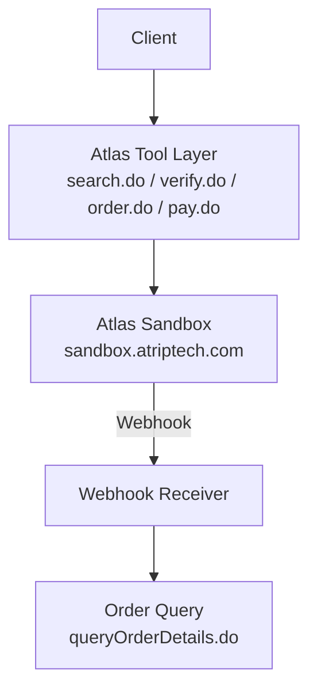
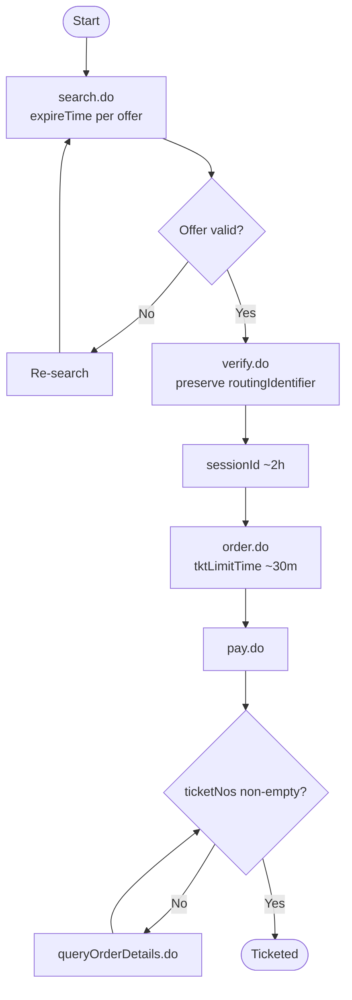
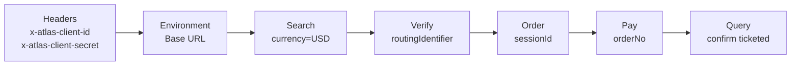

# Authentication & Session Management

<cite>
**Referenced Files in This Document**
- [architecture.md](file://.antabay/architecture.md)
- [atlas-capability-map.md](file://.antabay/atlas-capability-map.md)
- [specs.md](file://.antabay/specs.md)
- [sel_tyo_search.json](file://fixtures/atlas/sel_tyo_search.json)
- [sel_tyo_verify.json](file://fixtures/atlas/sel_tyo_verify.json)
- [webhook_order_ticketed.json](file://fixtures/atlas/webhook_order_ticketed.json)
</cite>

## Table of Contents
1. [Introduction](#introduction)
2. [Project Structure](#project-structure)
3. [Core Components](#core-components)
4. [Architecture Overview](#architecture-overview)
5. [Detailed Component Analysis](#detailed-component-analysis)
6. [Dependency Analysis](#dependency-analysis)
7. [Performance Considerations](#performance-considerations)
8. [Troubleshooting Guide](#troubleshooting-guide)
9. [Conclusion](#conclusion)
10. [Appendices](#appendices)

## Introduction
This document explains how Atlas authentication and session management work for the client credential flow used by Antabay, focusing on:
- Client credentials via request headers
- Environment-specific configuration (sandbox vs production), mandatory USD currency, and gzip encoding requirements
- The end-to-end session lifecycle from search through booking completion
- Preservation of routingIdentifier and sessionId across calls
- Handling of offer staleness and price changes
- Practical examples grounded in fixture responses
- Error handling for authentication failures and environment switching
- Security considerations for credentials and session tokens
- Troubleshooting common authentication and session timeout issues

## Project Structure
The repository contains verified contract documentation and fixtures that define the Atlas integration behavior. Key artifacts relevant to authentication and sessions are:
- Verified environment and header requirements
- End-to-end sequence from search to ticketing
- Fixture payloads demonstrating routingIdentifier, sessionId, and webhook envelope



**Diagram sources**
- [architecture.md:19-78](file://.antabay/architecture.md#L19-L78)
- [atlas-capability-map.md:12-34](file://.antabay/atlas-capability-map.md#L12-L34)

**Section sources**
- [atlas-capability-map.md:12-34](file://.antabay/atlas-capability-map.md#L12-L34)
- [architecture.md:19-78](file://.antabay/architecture.md#L19-L78)

## Core Components
- Authentication: Client credentials are sent per request using two headers. These must be present for every API call.
- Environment: Base URL differs by environment; sandbox is used here. Credentials are environment-scoped and do not cross environments.
- Encoding: Requests must include gzip acceptance as required by the provider.
- Currency: Requests must explicitly set USD in the search payload.
- Session lifecycle:
  - Offer window: short-lived, governed by expireTime returned in search results.
  - Session window: after verify, a longer sessionId governs subsequent order/pay steps.
  - Ticket limit: after order, a limited time remains to complete payment and ticketing.

Practical evidence:
- Search response includes routingIdentifier and per-offer expireTime.
- Verify response returns sessionId and updated routing details with null freshness fields post-verify.
- Webhook captures show the unauthenticated nature of events and require authoritative confirmation via query.

**Section sources**
- [atlas-capability-map.md:12-23](file://.antabay/atlas-capability-map.md#L12-L23)
- [atlas-capability-map.md:40-55](file://.antabay/atlas-capability-map.md#L40-L55)
- [atlas-capability-map.md:152-228](file://.antabay/atlas-capability-map.md#L152-L228)
- [atlas-capability-map.md:236-313](file://.antabay/atlas-capability-map.md#L236-L313)
- [sel_tyo_search.json:1-12](file://fixtures/atlas/sel_tyo_search.json#L1-L12)
- [sel_tyo_verify.json:1-12](file://fixtures/atlas/sel_tyo_verify.json#L1-L12)
- [webhook_order_ticketed.json:1-26](file://fixtures/atlas/webhook_order_ticketed.json#L1-L26)

## Architecture Overview
The system uses a FastAPI backend with an agent loop that interacts with Atlas endpoints. Authentication is applied at the tool layer for each outbound call. Webhooks arrive unauthenticated and must be reconciled against authoritative queries.

```mermaid
sequenceDiagram
participant Client as "Client"
participant Agent as "Antabay Agent"
participant Atlas as "Atlas Sandbox"
participant Webhook as "Webhook Receiver"
Client->>Agent : Goal
Agent->>Atlas : search.do (headers : x-atlas-client-id, x-atlas-client-secret; Accept-Encoding : gzip; body : currency=USD)
Atlas-->>Agent : routings + expireTime
Agent->>Atlas : verify.do (routingIdentifier preserved)
Atlas-->>Agent : sessionId + routing (freshness null)
Agent->>Atlas : order.do (sessionId preserved)
Atlas-->>Agent : orderNo + tktLimitTime
Agent->>Atlas : pay.do (orderNo)
Atlas-->>Agent : status
Atlas-)Webhook : order.ticketed (unauthenticated)
Webhook->>Atlas : queryOrderDetails.do (authoritative)
Atlas-->>Webhook : ticketNos populated
```

**Diagram sources**
- [architecture.md:89-148](file://.antabay/architecture.md#L89-L148)
- [atlas-capability-map.md:236-313](file://.antabay/atlas-capability-map.md#L236-L313)
- [atlas-capability-map.md:315-379](file://.antabay/atlas-capability-map.md#L315-L379)

## Detailed Component Analysis

### Authentication: Client Credential Flow
- Headers:
  - x-atlas-client-id
  - x-atlas-client-secret
- Required per request to all Atlas endpoints.
- Environment scoping:
  - Sandbox base URL is distinct from production.
  - Credentials only work in their own environment.
- Gzip encoding:
  - Accept-Encoding: gzip is required.
- Currency:
  - Must send currency: USD in search requests.

Evidence:
- Capability map lists environment, auth headers, encoding, and currency requirements.
- Specs show .env template including ATLAS_BASE_URL, ATLAS_CLIENT_ID, ATLAS_CLIENT_SECRET.

Security considerations:
- Store credentials in environment variables or secure secret stores; never commit to version control.
- Do not log headers or bodies containing credentials.
- Use HTTPS and restrict network access to known endpoints.

**Section sources**
- [atlas-capability-map.md:12-23](file://.antabay/atlas-capability-map.md#L12-L23)
- [specs.md:57-68](file://.antabay/specs.md#L57-L68)

### Session Lifecycle: From Search to Booking Completion
Key phases and identifiers:
- Search phase:
  - Returns multiple routings, each with routingIdentifier and expireTime.
  - Offers may arrive partially aged due to caching.
- Verify phase:
  - Uses routingIdentifier byte-for-byte.
  - Returns sessionId and updated routing; freshness fields become null.
  - Replaces short offer window with a longer session window.
- Order phase:
  - Uses sessionId.
  - Returns orderNo, pnrCode, and tktLimitTime.
  - PNR issued does not mean ticketed.
- Payment phase:
  - Uses orderNo.
  - Success does not guarantee ticketing; confirm via query.
- Post-payment verification:
  - Poll queryOrderDetails until ticketNos is non-empty.
  - Webhook arrives unauthenticated; treat as hint and confirm via query.

Staleness handling:
- Pre-verify: rely on expireTime; if expired, re-search.
- Post-verify: rely on sessionId; if expired, re-verify or re-search depending on state.
- Post-order: respect tktLimitTime; if exceeded, re-search and re-verify.



**Diagram sources**
- [atlas-capability-map.md:107-125](file://.antabay/atlas-capability-map.md#L107-L125)
- [atlas-capability-map.md:152-228](file://.antabay/atlas-capability-map.md#L152-L228)
- [atlas-capability-map.md:236-313](file://.antabay/atlas-capability-map.md#L236-L313)

**Section sources**
- [atlas-capability-map.md:107-125](file://.antabay/atlas-capability-map.md#L107-L125)
- [atlas-capability-map.md:152-228](file://.antabay/atlas-capability-map.md#L152-L228)
- [atlas-capability-map.md:236-313](file://.antabay/atlas-capability-map.md#L236-L313)
- [sel_tyo_search.json:1-12](file://fixtures/atlas/sel_tyo_search.json#L1-L12)
- [sel_tyo_verify.json:1-12](file://fixtures/atlas/sel_tyo_verify.json#L1-L12)

### RoutingIdentifier and sessionId Management
- routingIdentifier:
  - Must be preserved exactly from search to verify.
  - Used to lock pricing and inventory for the selected option.
- sessionId:
  - Returned by verify; required for order and subsequent steps.
  - Governs post-verify operations until expiration.

Evidence:
- Search fixture shows routingIdentifier per routing.
- Verify fixture shows sessionId at top level and routing object.

Best practices:
- Treat these identifiers as opaque strings; never parse or modify them.
- Persist them with issue timestamps and compute staleness based on expireTime/session duration.

**Section sources**
- [atlas-capability-map.md:69-89](file://.antabay/atlas-capability-map.md#L69-L89)
- [atlas-capability-map.md:152-228](file://.antabay/atlas-capability-map.md#L152-L228)
- [sel_tyo_search.json:1-12](file://fixtures/atlas/sel_tyo_search.json#L1-L12)
- [sel_tyo_verify.json:1-12](file://fixtures/atlas/sel_tyo_verify.json#L1-L12)

### Offer Staleness and Price Changes
- Offer staleness:
  - expireTime can be very short and sometimes already partially elapsed when received.
  - Always compute remaining time from current time, not receipt time.
- Price changes:
  - Verify response includes priceChange.isPriceChange.
  - If true, prior human approval is void; re-evaluate and re-authorize if needed.

Operational guidance:
- Monitor expireTime closely; refresh offers proactively.
- On price change, re-present to user and re-run policy checks before proceeding.

**Section sources**
- [atlas-capability-map.md:107-125](file://.antabay/atlas-capability-map.md#L107-L125)
- [atlas-capability-map.md:183-228](file://.antabay/atlas-capability-map.md#L183-L228)

### Practical Examples from Fixtures
- Search response:
  - Contains routings with routingIdentifier, currency USD, and expireTime.
  - Demonstrates per-offer freshness windows.
- Verify response:
  - Top-level sessionId indicates active session.
  - routing object reflects confirmed pricing and availability.
  - priceChange indicates whether prices changed since selection.
- Webhook:
  - Unauthenticated POST with type order.ticketed.
  - Requires authoritative confirmation via queryOrderDetails.

Use these fixtures to validate:
- Header presence and correctness
- Payload structure and field preservation
- State transitions and clock handling

**Section sources**
- [sel_tyo_search.json:1-12](file://fixtures/atlas/sel_tyo_search.json#L1-L12)
- [sel_tyo_verify.json:1-12](file://fixtures/atlas/sel_tyo_verify.json#L1-L12)
- [webhook_order_ticketed.json:1-26](file://fixtures/atlas/webhook_order_ticketed.json#L1-L26)

### Error Handling: Authentication Failures and Environment Switching
- Error code 900:
  - Indicates authentication failure.
  - Do not retry; check credentials and environment configuration.
- Environment switching:
  - Ensure base URL matches environment.
  - Credentials are environment-scoped; mixing will fail.
- Duplicate booking error:
  - Code 318 signals existing order; reconcile using returned duplicateOrders rather than retrying.

Operational guidance:
- On 900, validate headers and base URL immediately.
- Log minimal context without sensitive data; surface actionable messages.
- Implement idempotency around order creation to handle duplicates gracefully.

**Section sources**
- [atlas-capability-map.md:400-415](file://.antabay/atlas-capability-map.md#L400-L415)

### Security Considerations
- Credential storage:
  - Use environment variables or secure secret stores; never hardcode or commit secrets.
- Session token management:
  - Treat sessionId as sensitive; store securely and scope to journey lifetime.
  - Invalidate on expiry or cancellation.
- Preventing leakage:
  - Exclude headers and bodies containing credentials from logs.
  - Mask or redact identifiers in traces and reports.
- Webhook security:
  - Webhooks are unauthenticated; always confirm via authoritative query before changing state.

**Section sources**
- [specs.md:39-68](file://.antabay/specs.md#L39-L68)
- [atlas-capability-map.md:315-379](file://.antabay/atlas-capability-map.md#L315-L379)

## Dependency Analysis
Authentication and session management depend on:
- Correct headers per request
- Environment base URL alignment
- Currency setting in search
- Proper identifier preservation across calls
- Clock-aware state transitions



**Diagram sources**
- [atlas-capability-map.md:12-23](file://.antabay/atlas-capability-map.md#L12-L23)
- [atlas-capability-map.md:40-55](file://.antabay/atlas-capability-map.md#L40-L55)
- [atlas-capability-map.md:152-228](file://.antabay/atlas-capability-map.md#L152-L228)
- [atlas-capability-map.md:236-313](file://.antabay/atlas-capability-map.md#L236-L313)

**Section sources**
- [atlas-capability-map.md:12-23](file://.antabay/atlas-capability-map.md#L12-L23)
- [atlas-capability-map.md:40-55](file://.antabay/atlas-capability-map.md#L40-L55)
- [atlas-capability-map.md:152-228](file://.antabay/atlas-capability-map.md#L152-L228)
- [atlas-capability-map.md:236-313](file://.antabay/atlas-capability-map.md#L236-L313)

## Performance Considerations
- Rate limits:
  - search.do has a per-second limit; verify.do shares a per-minute budget with other endpoints.
  - Respect retryAfter on rate-limit responses; avoid retry loops.
- Offer freshness:
  - Short expireTime windows require prompt action; cache minimally and compute remaining time accurately.
- Network efficiency:
  - Use gzip as required to reduce payload size.
- Idempotency:
  - Handle duplicate orders efficiently to avoid redundant calls.

[No sources needed since this section provides general guidance]

## Troubleshooting Guide
Common issues and resolutions:
- Authentication failure (error 900):
  - Verify headers are present and correct.
  - Confirm base URL matches environment.
  - Check that credentials belong to the target environment.
- Session expired mid-flow:
  - If expireTime elapsed, re-search.
  - If sessionId expired, re-verify or re-search depending on state.
  - If tktLimitTime elapsed, re-search and re-verify.
- Price changed after selection:
  - Read priceChange.isPriceChange; re-authorize if true.
- Duplicate booking (error 318):
  - Use returned duplicateOrders to reconcile; do not retry.
- Webhook misinterpretation:
  - Do not trust webhook status alone; confirm via queryOrderDetails.
  - Normalize types between webhook and API surfaces.

Operational tips:
- Log endpoint, identifiers (masked), timings, and outcomes without secrets.
- Display remaining time for each clock in the UI to aid debugging.
- Implement automated reconciliation on startup using persisted state.

**Section sources**
- [atlas-capability-map.md:107-125](file://.antabay/atlas-capability-map.md#L107-L125)
- [atlas-capability-map.md:183-228](file://.antabay/atlas-capability-map.md#L183-L228)
- [atlas-capability-map.md:236-313](file://.antabay/atlas-capability-map.md#L236-L313)
- [atlas-capability-map.md:315-379](file://.antabay/atlas-capability-map.md#L315-L379)
- [atlas-capability-map.md:400-415](file://.antabay/atlas-capability-map.md#L400-L415)

## Conclusion
Atlas authentication relies on per-request client credentials and strict environment configuration. Sessions progress through short-lived offers, longer-lived sessions, and tight ticketing windows. Preserve routingIdentifier and sessionId exactly, monitor clocks rigorously, and treat webhooks as untrusted hints. Follow the error handling rules for 900 and 318, and enforce security best practices for credentials and session tokens.

[No sources needed since this section summarizes without analyzing specific files]

## Appendices

### Appendix A: Request/Response Evidence Paths
- Search response with routingIdentifier and currency USD:
  - [sel_tyo_search.json:1-12](file://fixtures/atlas/sel_tyo_search.json#L1-L12)
- Verify response with sessionId and priceChange:
  - [sel_tyo_verify.json:1-12](file://fixtures/atlas/sel_tyo_verify.json#L1-L12)
- Webhook envelope showing unauthenticated delivery:
  - [webhook_order_ticketed.json:1-26](file://fixtures/atlas/webhook_order_ticketed.json#L1-L26)

**Section sources**
- [sel_tyo_search.json:1-12](file://fixtures/atlas/sel_tyo_search.json#L1-L12)
- [sel_tyo_verify.json:1-12](file://fixtures/atlas/sel_tyo_verify.json#L1-L12)
- [webhook_order_ticketed.json:1-26](file://fixtures/atlas/webhook_order_ticketed.json#L1-L26)