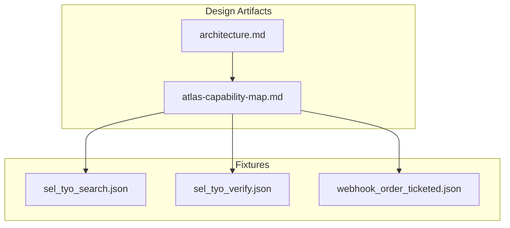
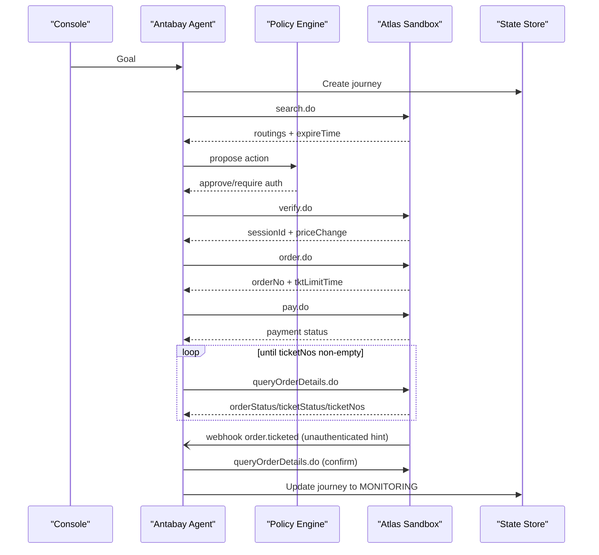
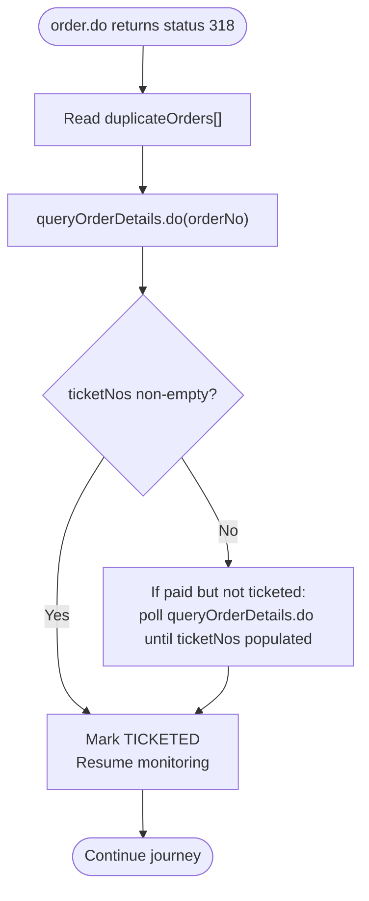
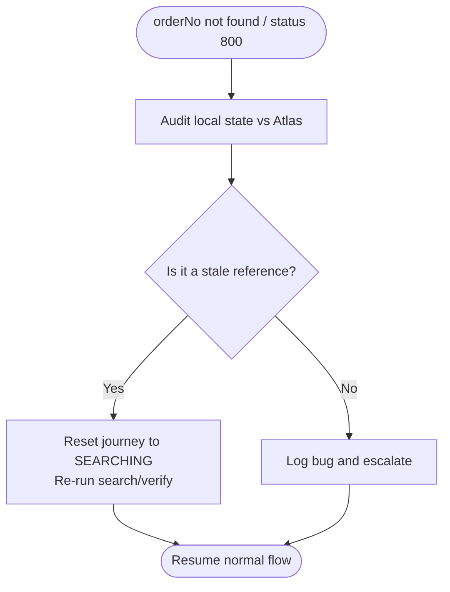
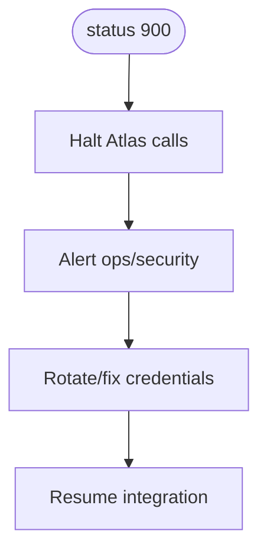
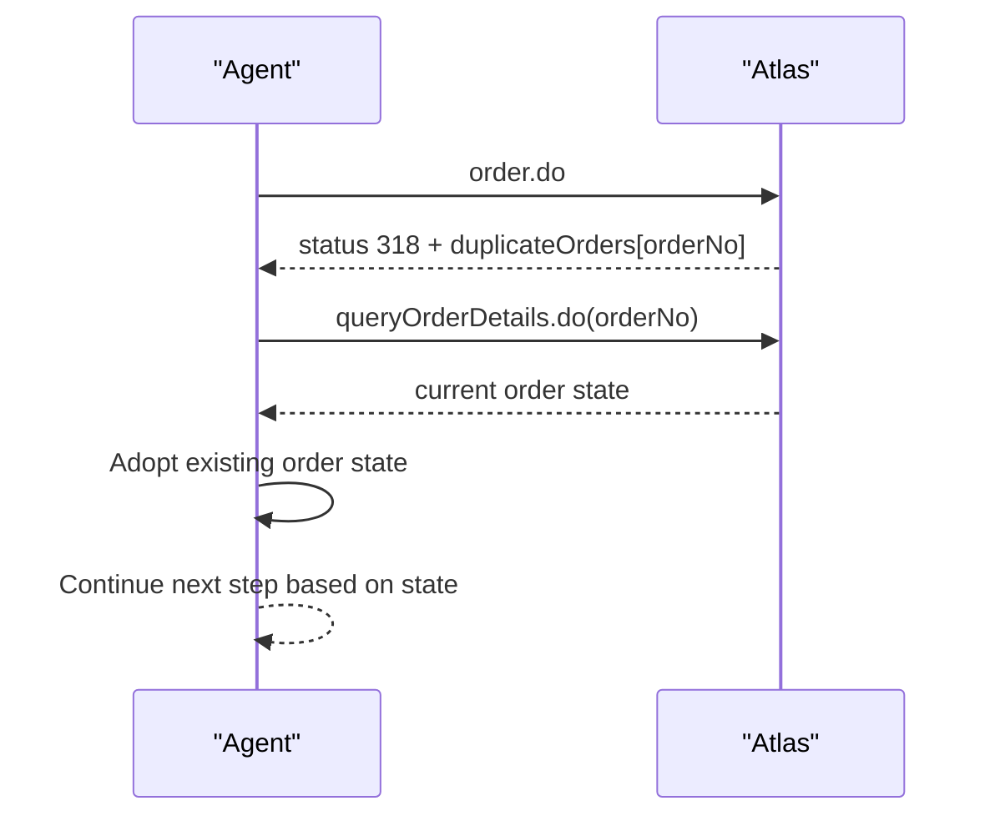
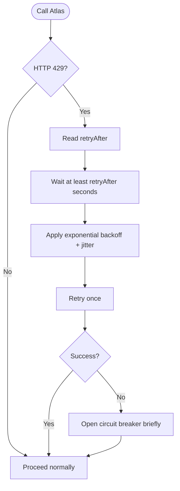
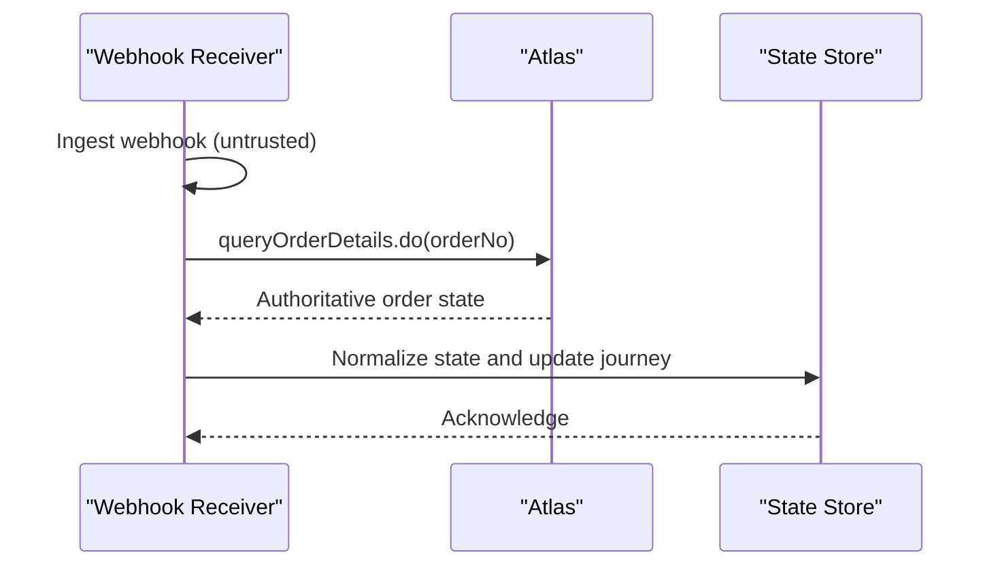
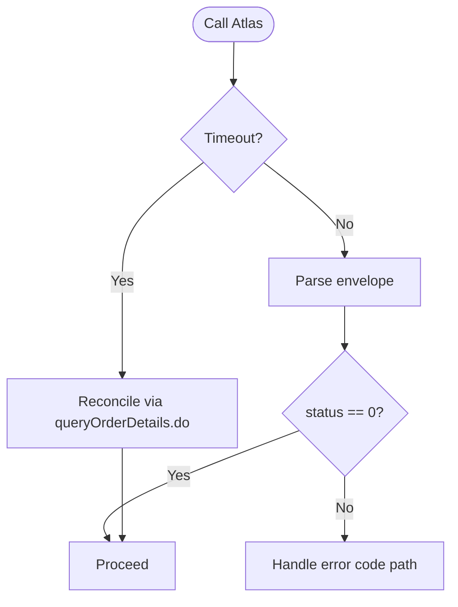
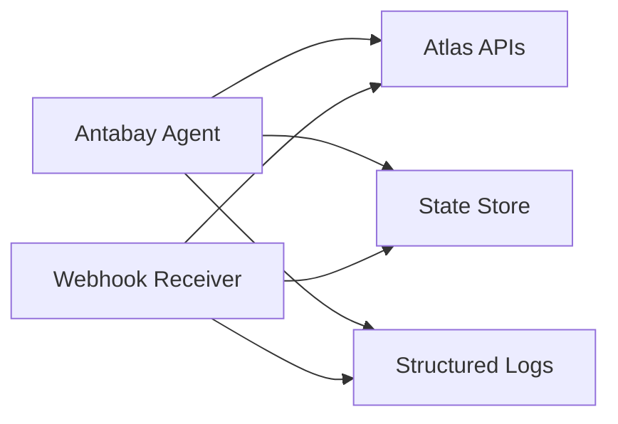

# Error Handling & Recovery

<cite>
**Referenced Files in This Document**
- [architecture.md](file://.antabay/architecture.md)
- [atlas-capability-map.md](file://.antabay/atlas-capability-map.md)
- [sel_tyo_search.json](file://fixtures/atlas/sel_tyo_search.json)
- [sel_tyo_verify.json](file://fixtures/atlas/sel_tyo_verify.json)
- [webhook_order_ticketed.json](file://fixtures/atlas/webhook_order_ticketed.json)
</cite>

## Table of Contents
1. [Introduction](#introduction)
2. [Project Structure](#project-structure)
3. [Core Components](#core-components)
4. [Architecture Overview](#architecture-overview)
5. [Detailed Component Analysis](#detailed-component-analysis)
6. [Dependency Analysis](#dependency-analysis)
7. [Performance Considerations](#performance-considerations)
8. [Troubleshooting Guide](#troubleshooting-guide)
9. [Conclusion](#conclusion)
10. [Appendices](#appendices)

## Introduction
This document specifies error handling and recovery strategies for the Atlas integration, grounded in verified sandbox behavior and captured fixtures. It focuses on:
- Verified error codes 318 (duplicate booking), 800 (order not exists), and 900 (auth failed) with concrete recovery procedures.
- Idempotency via duplicateOrders detection and reconciliation against existing orders instead of retries.
- Rate limiting handling for 429 responses and retryAfter headers, including exponential backoff and circuit breaker patterns.
- Webhook-specific error handling for untrusted event ingestion, signature validation posture, and state reconciliation.
- Network failure recovery, timeout handling, and partial response processing.
- Monitoring and alerting guidance for failures, performance degradation, and availability issues.

The content is derived from the architecture overview, capability map, and fixture captures that reflect real sandbox interactions.

## Project Structure
The repository contains design and verification artifacts rather than application code:
- Architecture and sequence diagrams describe system boundaries, trust model, and key flows.
- A capability map documents verified endpoints, schemas, constraints, and error codes.
- Fixtures capture real search, verify, and webhook payloads used as ground truth for tests and examples.

**Diagram sources**
- [architecture.md:19-85](file://.antabay/architecture.md#L19-L85)
- [atlas-capability-map.md:25-34](file://.antabay/atlas-capability-map.md#L25-L34)

**Section sources**
- [architecture.md:19-85](file://.antabay/architecture.md#L19-L85)
- [atlas-capability-map.md:25-34](file://.antabay/atlas-capability-map.md#L25-L34)

## Core Components
- FastAPI service hosting the Antabay Agent, Policy Engine, Webhook Receiver + Reconciler, and Disruption Injector.
- Atlas Tool Layer exposing search.do, verify.do, order.do, pay.do, queryOrderDetails.do, void/refund.
- State store for journeys, objectives, orders, clocks, audit trail, and authorizations.
- Structured trace and audit logging.

Key behaviors relevant to error handling:
- Webhooks are untrusted hints; authoritative state comes from queryOrderDetails.do.
- Offer/session/ticket clocks drive recovery paths when they expire or time out.
- Duplicate bookings are handled server-side by Atlas; client must reconcile using duplicateOrders.

**Section sources**
- [architecture.md:19-85](file://.antabay/architecture.md#L19-L85)
- [atlas-capability-map.md:25-34](file://.antabay/atlas-capability-map.md#L25-L34)

## Architecture Overview
The integration follows a strict separation of concerns: reasoning vs authorization, untrusted webhooks vs authoritative queries, and bounded freshness windows per step.

**Diagram sources**
- [architecture.md:89-148](file://.antabay/architecture.md#L89-L148)
- [atlas-capability-map.md:236-313](file://.antabay/atlas-capability-map.md#L236-L313)

## Detailed Component Analysis

### Verified Error Codes and Recovery Procedures

#### Error 318 — Duplicate Booking
- Meaning: The same passenger and flight were already booked.
- Signal: Response envelope includes duplicateOrders array with the existing order number.
- Recovery procedure:
  - Do not retry order.do.
  - Read duplicateOrders and call queryOrderDetails.do for the returned orderNo.
  - Adopt the existing order’s state into the journey and continue flow from its actual point (e.g., proceed to pay if unpaid, or poll for ticketing).
  - Log reconciliation details for audit.

**Diagram sources**
- [atlas-capability-map.md:236-269](file://.antabay/atlas-capability-map.md#L236-L269)
- [atlas-capability-map.md:285-313](file://.antabay/atlas-capability-map.md#L285-L313)
- [atlas-capability-map.md:400-415](file://.antabay/atlas-capability-map.md#L400-L415)

**Section sources**
- [atlas-capability-map.md:236-269](file://.antabay/atlas-capability-map.md#L236-L269)
- [atlas-capability-map.md:285-313](file://.antabay/atlas-capability-map.md#L285-L313)
- [atlas-capability-map.md:400-415](file://.antabay/atlas-capability-map.md#L400-L415)

#### Error 800 — Order Not Exists
- Meaning: The referenced order does not exist in Atlas.
- Interpretation: Indicates a bug in local state or stale reference, not a transient network issue.
- Recovery procedure:
  - Stop retrying the missing order.
  - Investigate how the orderNo was obtained and persisted; correct state synchronization.
  - If applicable, re-initiate the booking flow from search/verify with fresh data.
  - Alert on internal inconsistency.

**Diagram sources**
- [atlas-capability-map.md:400-415](file://.antabay/atlas-capability-map.md#L400-L415)

**Section sources**
- [atlas-capability-map.md:400-415](file://.antabay/atlas-capability-map.md#L400-L415)

#### Error 900 — Auth Failed
- Meaning: Authentication credentials or account problem.
- Recovery procedure:
  - Do not retry; this is a configuration/account issue.
  - Halt further calls to Atlas.
  - Alert operations and rotate or fix credentials.
  - Resume only after credential resolution.

**Diagram sources**
- [atlas-capability-map.md:400-415](file://.antabay/atlas-capability-map.md#L400-L415)

**Section sources**
- [atlas-capability-map.md:400-415](file://.antabay/atlas-capability-map.md#L400-L415)

### Idempotency Strategy Using duplicateOrders
- Principle: Treat duplicateOrders as the source of truth for idempotent ordering.
- Behavior: On 318, reconcile against the returned orderNo via queryOrderDetails.do and adopt its state. Never retry order.do for the same intent.
- Evidence: Capability map explicitly states to read duplicateOrders and reconcile, never retry.

**Diagram sources**
- [atlas-capability-map.md:236-269](file://.antabay/atlas-capability-map.md#L236-L269)
- [atlas-capability-map.md:400-415](file://.antabay/atlas-capability-map.md#L400-L415)

**Section sources**
- [atlas-capability-map.md:236-269](file://.antabay/atlas-capability-map.md#L236-L269)
- [atlas-capability-map.md:400-415](file://.antabay/atlas-capability-map.md#L400-L415)

### Rate Limiting Handling (429 and retryAfter)
- Limits observed: search.do 10 QPS; verify.do + getOffers.do share 60 QPM; seatAvailability.do + getLuggage.do share 60 QPM.
- Over-limit response: HTTP 429 with retryAfter header. No retry loops.
- Recommended strategy:
  - Respect retryAfter exactly; do not burst immediately after.
  - Implement per-endpoint rate limiters with token buckets or sliding windows.
  - Use exponential backoff with jitter for transient throttling beyond explicit retryAfter.
  - Apply circuit breaker patterns to avoid cascading failures during sustained throttling.

**Diagram sources**
- [atlas-capability-map.md:119-121](file://.antabay/atlas-capability-map.md#L119-L121)

**Section sources**
- [atlas-capability-map.md:119-121](file://.antabay/atlas-capability-map.md#L119-L121)

### Webhook-Specific Error Handling
- Untrusted events: Webhooks are unauthenticated; treat them as hints only. Always confirm via queryOrderDetails.do before mutating journey state.
- Signature validation: No signature/HMAC present in captured webhook; cannot validate signatures. Rely on cid presence and subsequent authoritative query.
- State reconciliation: On receiving order.ticketed, call queryOrderDetails.do to normalize orderStatus types and confirm ticketNos before marking TICKETED.
- Envelope shape: type is a dotted string; status semantics differ from API success codes; orderStatus may be integer in webhook vs string in API.

**Diagram sources**
- [atlas-capability-map.md:315-379](file://.antabay/atlas-capability-map.md#L315-L379)
- [webhook_order_ticketed.json:1-53](file://fixtures/atlas/webhook_order_ticketed.json#L1-L53)

**Section sources**
- [atlas-capability-map.md:315-379](file://.antabay/atlas-capability-map.md#L315-L379)
- [webhook_order_ticketed.json:1-53](file://fixtures/atlas/webhook_order_ticketed.json#L1-L53)

### Network Failure Recovery, Timeouts, and Partial Responses
- Timeout handling:
  - Enforce per-call timeouts for all Atlas endpoints.
  - On timeout, mark the attempt failed and schedule reconciliation via queryOrderDetails.do to determine true state.
- Partial responses:
  - Validate response envelopes (e.g., status field) even if HTTP is 200.
  - For search/verify/order/pay, assert status == 0 before proceeding; otherwise branch to error handling.
- Retry policy:
  - Only retry idempotent reads (queryOrderDetails.do) with bounded attempts and backoff.
  - Do not retry writes blindly; prefer reconciliation.

**Diagram sources**
- [atlas-capability-map.md:61-68](file://.antabay/atlas-capability-map.md#L61-L68)
- [atlas-capability-map.md:285-313](file://.antabay/atlas-capability-map.md#L285-L313)

**Section sources**
- [atlas-capability-map.md:61-68](file://.antabay/atlas-capability-map.md#L61-L68)
- [atlas-capability-map.md:285-313](file://.antabay/atlas-capability-map.md#L285-L313)

### Monitoring and Alerting
Recommended telemetry and alerts:
- Error rates by endpoint and error code (318, 800, 900, 429).
- Latency percentiles per endpoint; alert on SLO breaches.
- Rate limit hits (429) frequency and duration.
- Webhook ingestion volume and reconciliation outcomes.
- Journey state transitions stuck in RECONCILING or PAID without ticketing.
- Availability of Atlas endpoints and health checks.

Operational actions:
- Auto-alert on 900 occurrences to trigger credential rotation workflows.
- Escalation on 800 occurrences to investigate state sync bugs.
- Dashboards for offer/session/tktLimitTime expirations and re-search triggers.

[No sources needed since this section provides general guidance]

## Dependency Analysis
The integration depends on:
- Atlas endpoints for search, verify, order, pay, and order query.
- Webhook receiver for asynchronous notifications.
- State store for journey persistence and clock tracking.
- Logging for audit and observability.

**Diagram sources**
- [architecture.md:19-85](file://.antabay/architecture.md#L19-L85)

**Section sources**
- [architecture.md:19-85](file://.antabay/architecture.md#L19-L85)

## Performance Considerations
- Offer expiry is short and variable; always check expireTime before decisions.
- Session lifetime replaces offer window post-verify; track session clock.
- Ticket limit window is tight (~30 minutes); ensure timely payment and polling.
- Avoid unnecessary retries; use reconciliation to minimize load and latency.
- Respect rate limits to prevent 429 storms; implement per-endpoint quotas.

[No sources needed since this section provides general guidance]

## Troubleshooting Guide
Common scenarios and resolutions:
- Duplicate booking (318): Reconcile using duplicateOrders and queryOrderDetails.do; adopt existing order state.
- Missing order (800): Investigate local state; reset journey to search if necessary; alert on inconsistencies.
- Auth failure (900): Halt calls; rotate credentials; resume after fix.
- Rate limited (429): Honor retryAfter; apply exponential backoff with jitter; open circuit breaker under sustained throttling.
- Webhook anomalies: Confirm via queryOrderDetails.do; normalize orderStatus types; ignore webhook status field for success gating.

**Section sources**
- [atlas-capability-map.md:119-121](file://.antabay/atlas-capability-map.md#L119-L121)
- [atlas-capability-map.md:236-269](file://.antabay/atlas-capability-map.md#L236-L269)
- [atlas-capability-map.md:285-313](file://.antabay/atlas-capability-map.md#L285-L313)
- [atlas-capability-map.md:315-379](file://.antabay/atlas-capability-map.md#L315-L379)
- [atlas-capability-map.md:400-415](file://.antabay/atlas-capability-map.md#L400-L415)

## Conclusion
Robust error handling for the Atlas integration hinges on:
- Treating webhooks as untrusted hints and always reconciling with authoritative queries.
- Leveraging duplicateOrders for idempotent order handling without retries.
- Respecting rate limits and implementing backoff/circuit breaking to maintain stability.
- Tracking multiple clocks (offer, session, ticket limit) to guide recovery paths.
- Instrumenting and alerting on errors, performance, and availability to ensure reliable operations.

[No sources needed since this section summarizes without analyzing specific files]

## Appendices

### Fixture-Based Examples
- Search response structure demonstrates routing fields, pricing, baggage rules, and expireTime used to gate decisions.
- Verify response shows sessionId, bookingRequirement, and priceChange fields that influence approval and continuation.
- Webhook payload illustrates unauthenticated delivery, type-based routing, and normalized reconciliation needs.

**Section sources**
- [sel_tyo_search.json:1-800](file://fixtures/atlas/sel_tyo_search.json#L1-L800)
- [sel_tyo_verify.json:1-393](file://fixtures/atlas/sel_tyo_verify.json#L1-L393)
- [webhook_order_ticketed.json:1-53](file://fixtures/atlas/webhook_order_ticketed.json#L1-L53)