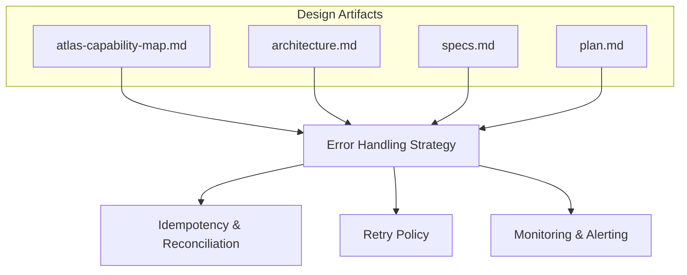
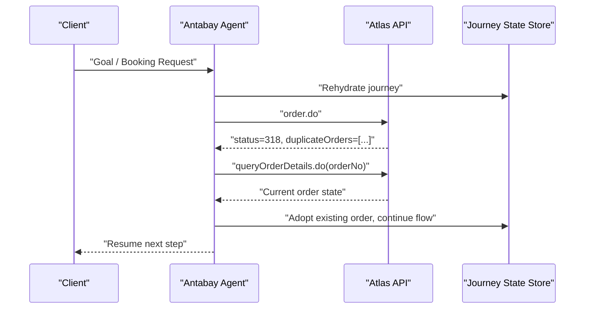
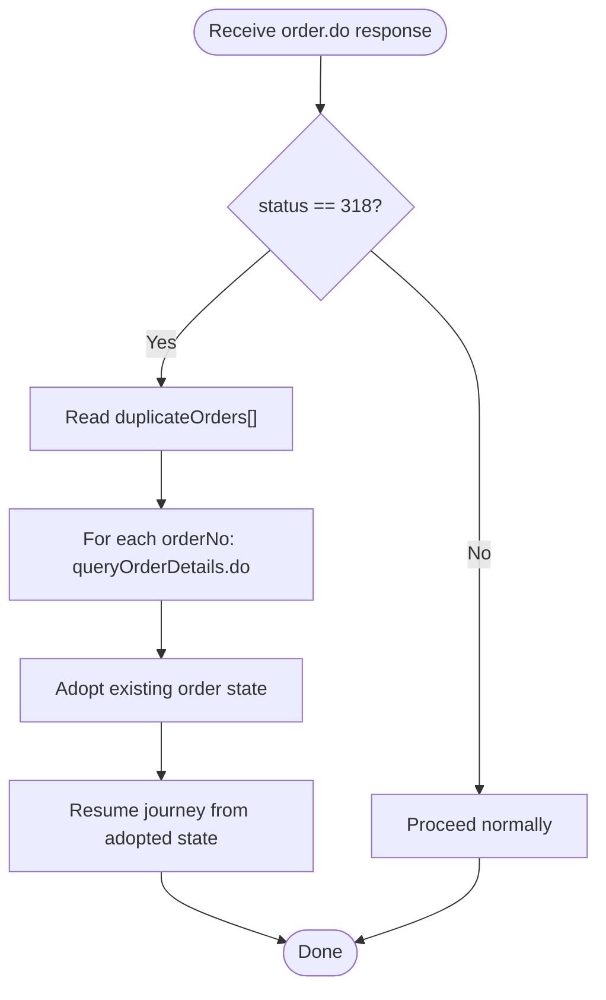
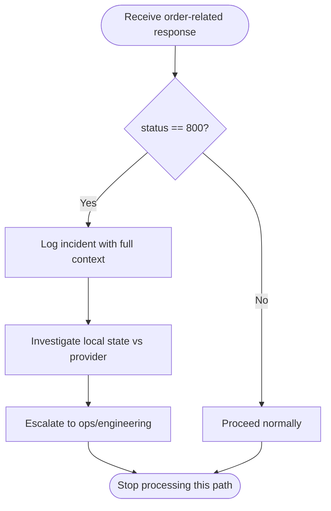
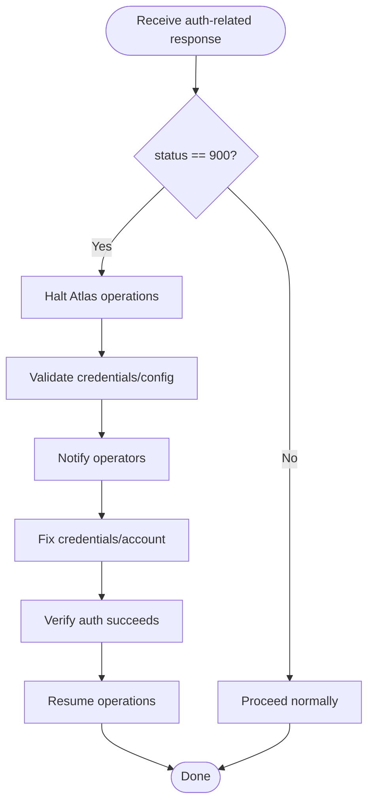
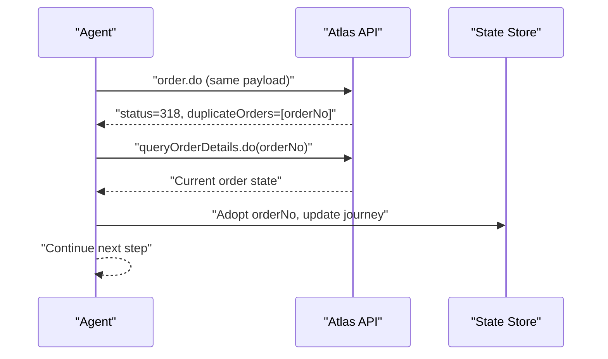
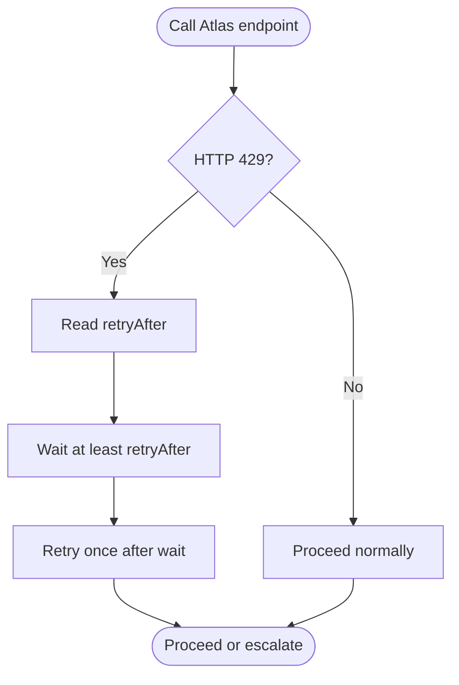
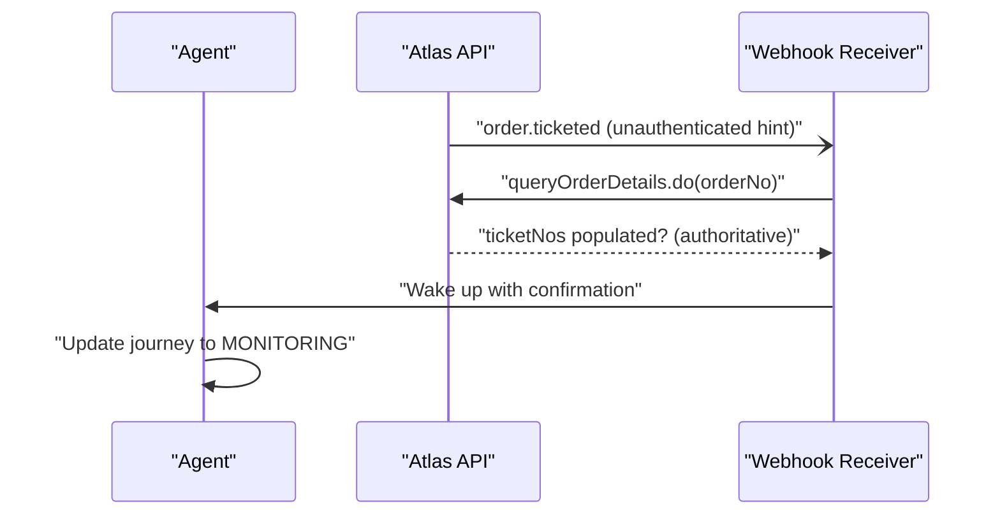
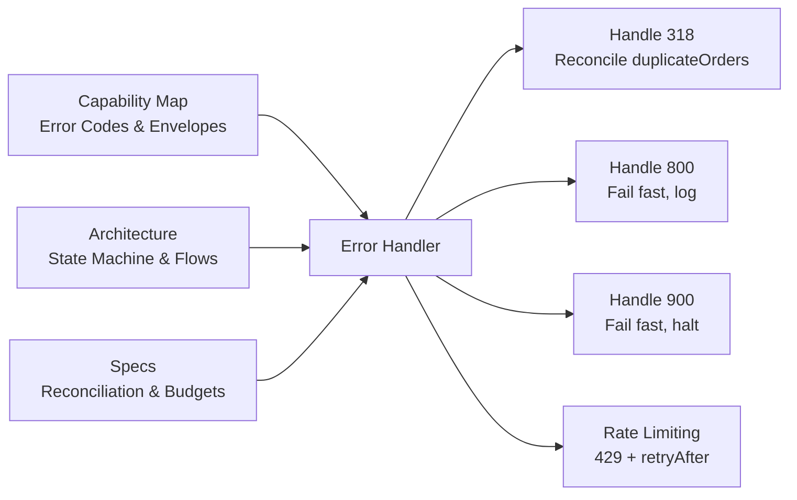

# HTTP Error Codes & Business Logic Errors

<cite>
**Referenced Files in This Document**
- [atlas-capability-map.md](file://.antabay/atlas-capability-map.md)
- [architecture.md](file://.antabay/architecture.md)
- [specs.md](file://.antabay/specs.md)
- [plan.md](file://.antabay/plan.md)
</cite>

## Table of Contents
1. [Introduction](#introduction)
2. [Project Structure](#project-structure)
3. [Core Components](#core-components)
4. [Architecture Overview](#architecture-overview)
5. [Detailed Component Analysis](#detailed-component-analysis)
6. [Dependency Analysis](#dependency-analysis)
7. [Performance Considerations](#performance-considerations)
8. [Troubleshooting Guide](#troubleshooting-guide)
9. [Conclusion](#conclusion)

## Introduction
This document specifies how the system handles Atlas API error codes and business logic errors during the booking journey, with a focus on idempotency, reconciliation, retry policy, and failure handling. It consolidates verified behavior from the Atlas capability map and architecture documents to define when to retry, when to fail fast, and how to handle partial responses. It also outlines monitoring and alerting guidance for integration failures and service availability issues based on the project’s design.

## Project Structure
The error-handling strategy is grounded in three core artifacts:
- The Atlas capability map defines verified endpoints, response envelopes, clocks, and error codes.
- The architecture document defines the agent workflow, state machine transitions, and how external calls are made and reconciled.
- The specs define requirements around call budgets, rate limits, and reconciliation versus retry.

**Diagram sources**
- [atlas-capability-map.md:400-416](file://.antabay/atlas-capability-map.md#L400-L416)
- [architecture.md:212-257](file://.antabay/architecture.md#L212-L257)
- [specs.md:303-398](file://.antabay/specs.md#L303-L398)
- [plan.md:219-224](file://.antabay/plan.md#L219-L224)

**Section sources**
- [atlas-capability-map.md:25-38](file://.antabay/atlas-capability-map.md#L25-L38)
- [architecture.md:19-78](file://.antabay/architecture.md#L19-L78)
- [specs.md:303-398](file://.antabay/specs.md#L303-L398)
- [plan.md:177-263](file://.antabay/plan.md#L177-L263)

## Core Components
- Verified error code classification:
  - 0: success — proceed
  - 318: duplicate booking — reconcile using returned duplicateOrders; never retry
  - 800: order not exists — treat as internal state bug; do not retry
  - 900: auth failed — credentials or account issue; do not retry
- Idempotency via duplicateOrders:
  - On 318, read duplicateOrders[], query that order, resume from its real state
  - Never retry the same order creation request
- Rate limiting:
  - search.do has QPS limits; verify.do + getOffers.do share QPM limits
  - Over-limit returns 429 with retryAfter; honor wait instruction and do not retry before it elapses
- Partial responses:
  - Paid is not ticketed; confirm ticketing only by querying order details until ticketNos is non-empty
  - Webhook status semantics differ from API status; always confirm via queryOrderDetails.do

**Section sources**
- [atlas-capability-map.md:119-129](file://.antabay/atlas-capability-map.md#L119-L129)
- [atlas-capability-map.md:236-303](file://.antabay/atlas-capability-map.md#L236-L303)
- [atlas-capability-map.md:315-379](file://.antabay/atlas-capability-map.md#L315-L379)
- [atlas-capability-map.md:400-416](file://.antabay/atlas-capability-map.md#L400-L416)
- [specs.md:303-398](file://.antabay/specs.md#L303-L398)
- [plan.md:219-224](file://.antabay/plan.md#L219-L224)

## Architecture Overview
The system integrates an agent layer with Atlas endpoints and enforces strict reconciliation over retries for known business errors.

**Diagram sources**
- [atlas-capability-map.md:236-303](file://.antabay/atlas-capability-map.md#L236-L303)
- [atlas-capability-map.md:400-416](file://.antabay/atlas-capability-map.md#L400-L416)
- [architecture.md:212-257](file://.antabay/architecture.md#L212-L257)

## Detailed Component Analysis

### Error Code 318 — Duplicate Booking
- Behavior:
  - Atlas enforces idempotency server-side and returns the existing order number(s) in duplicateOrders
  - Antabay must reconcile against the returned order(s), query their current state, and resume from the real state
  - Do not retry the original order creation request
- Recovery procedure:
  - Read duplicateOrders[] from the response
  - For each orderNo, call queryOrderDetails.do to determine actual state (paid/ticketed)
  - If already paid/ticketed, adopt that order and proceed to monitoring
  - If uncertain, continue polling until authoritative state is confirmed
- When to retry:
  - Never retry order.do for the same payload after receiving 318
- When to fail fast:
  - Not applicable; this is a reconcilable condition
- Partial response handling:
  - Even if other fields are null, trust duplicateOrders[] as the authoritative signal

**Diagram sources**
- [atlas-capability-map.md:236-303](file://.antabay/atlas-capability-map.md#L236-L303)
- [atlas-capability-map.md:400-416](file://.antabay/atlas-capability-map.md#L400-L416)

**Section sources**
- [atlas-capability-map.md:236-303](file://.antabay/atlas-capability-map.md#L236-L303)
- [atlas-capability-map.md:400-416](file://.antabay/atlas-capability-map.md#L400-L416)
- [specs.md:303-398](file://.antabay/specs.md#L303-L398)
- [plan.md:219-224](file://.antabay/plan.md#L219-L224)

### Error Code 800 — Order Not Exists
- Behavior:
  - Treat as a bug in our own state rather than a transient provider error
  - Do not retry; investigate local state inconsistency
- Recovery procedure:
  - Log the incident with context (journey ID, orderNo, endpoint, timestamps)
  - Trigger investigation workflow to reconcile with upstream systems
  - Avoid automatic retries to prevent cascading inconsistencies
- When to retry:
  - No; this is terminal for the current operation
- When to fail fast:
  - Fail fast and escalate; do not mask as retryable
- Partial response handling:
  - If any partial data was received, record it for diagnostics but do not act on it

**Diagram sources**
- [atlas-capability-map.md:400-416](file://.antabay/atlas-capability-map.md#L400-L416)

**Section sources**
- [atlas-capability-map.md:400-416](file://.antabay/atlas-capability-map.md#L400-L416)

### Error Code 900 — Auth Failed
- Behavior:
  - Indicates credentials or account problem
  - Do not retry; immediate remediation required
- Recovery procedure:
  - Halt all Atlas-bound operations
  - Validate client-id and client-secret configuration
  - Notify operators to restore access
  - Resume only after successful authentication test
- When to retry:
  - No; this is terminal until credentials/account are fixed
- When to fail fast:
  - Fail fast and surface a clear operational error
- Partial response handling:
  - Do not process any partial payloads; block further actions

**Diagram sources**
- [atlas-capability-map.md:400-416](file://.antabay/atlas-capability-map.md#L400-L416)

**Section sources**
- [atlas-capability-map.md:400-416](file://.antabay/atlas-capability-map.md#L400-L416)

### Idempotency Strategy Using duplicateOrders
- Principle:
  - Atlas enforces idempotency server-side; on duplicate attempts, return 318 with duplicateOrders[]
  - Antabay reconciles against returned orders instead of retrying
- Implementation notes:
  - Always read duplicateOrders[] when present
  - Use queryOrderDetails.do to confirm authoritative state
  - Transition the journey state to adopt the existing order and continue
- Why not retry:
  - Retrying can cause redundant work and confusion; reconciliation is deterministic and safe

**Diagram sources**
- [atlas-capability-map.md:236-303](file://.antabay/atlas-capability-map.md#L236-L303)
- [atlas-capability-map.md:400-416](file://.antabay/atlas-capability-map.md#L400-L416)

**Section sources**
- [atlas-capability-map.md:236-303](file://.antabay/atlas-capability-map.md#L236-L303)
- [atlas-capability-map.md:400-416](file://.antabay/atlas-capability-map.md#L400-L416)
- [specs.md:303-398](file://.antabay/specs.md#L303-L398)
- [plan.md:219-224](file://.antabay/plan.md#L219-L224)

### Retry Policy and Rate Limiting
- Known rate limits:
  - search.do: 10 QPS
  - verify.do + getOffers.do: 60 QPM shared
  - seatAvailability.do + getLuggage.do: 60 QPM shared
- Over-limit behavior:
  - Returns 429 with retryAfter
  - Honor the wait instruction; do not retry before it elapses
  - No retry loops; back off according to provider instructions
- General retry rules:
  - Only retry transient network-level failures (not covered here)
  - Do not retry business errors 318, 800, 900
  - Respect per-journey call budget constraints

**Diagram sources**
- [atlas-capability-map.md:119-129](file://.antabay/atlas-capability-map.md#L119-L129)
- [specs.md:303-398](file://.antabay/specs.md#L303-L398)

**Section sources**
- [atlas-capability-map.md:119-129](file://.antabay/atlas-capability-map.md#L119-L129)
- [specs.md:303-398](file://.antabay/specs.md#L303-L398)
- [plan.md:219-224](file://.antabay/plan.md#L219-L224)

### Handling Partial Responses
- Paid is not ticketed:
  - After pay.do success, continue polling queryOrderDetails.do until ticketNos is non-empty
- Webhook status semantics:
  - Webhook status differs from API status; do not gate handling on webhook status
  - Always confirm via queryOrderDetails.do before changing journey state
- Implication:
  - Treat webhooks as untrusted hints; authoritative truth comes from API queries

**Diagram sources**
- [atlas-capability-map.md:315-379](file://.antabay/atlas-capability-map.md#L315-L379)
- [atlas-capability-map.md:236-303](file://.antabay/atlas-capability-map.md#L236-L303)

**Section sources**
- [atlas-capability-map.md:236-303](file://.antabay/atlas-capability-map.md#L236-L303)
- [atlas-capability-map.md:315-379](file://.antabay/atlas-capability-map.md#L315-L379)

## Dependency Analysis
Error handling depends on:
- Verified contract definitions (capability map)
- Agent workflow and state machine (architecture)
- Spec requirements for reconciliation and rate limits

**Diagram sources**
- [atlas-capability-map.md:119-129](file://.antabay/atlas-capability-map.md#L119-L129)
- [atlas-capability-map.md:400-416](file://.antabay/atlas-capability-map.md#L400-L416)
- [architecture.md:212-257](file://.antabay/architecture.md#L212-L257)
- [specs.md:303-398](file://.antabay/specs.md#L303-L398)

**Section sources**
- [atlas-capability-map.md:119-129](file://.antabay/atlas-capability-map.md#L119-L129)
- [atlas-capability-map.md:400-416](file://.antabay/atlas-capability-map.md#L400-L416)
- [architecture.md:212-257](file://.antabay/architecture.md#L212-L257)
- [specs.md:303-398](file://.antabay/specs.md#L303-L398)

## Performance Considerations
- Offer expiry is short and variable; freshness checks are mandatory before decisions
- Currency mixing hazard: fares in USD, some rules in IDR; avoid combining without explicit conversion
- Rate limits must be respected to avoid 429 rejections; use provider-provided retryAfter
- Polling for ticketing should be bounded and efficient; rely on webhook as a hint, not proof

[No sources needed since this section provides general guidance]

## Troubleshooting Guide
- Duplicate booking (318):
  - Action: Read duplicateOrders[], query order details, adopt existing order
  - Do not retry order creation
- Order not exists (800):
  - Action: Log incident, investigate local state, escalate; no retry
- Auth failed (900):
  - Action: Halt operations, validate credentials, notify operators; no retry
- Rate limit (429):
  - Action: Honor retryAfter, wait, then retry once; no retry loops
- Partial responses:
  - Action: Confirm via queryOrderDetails.do; treat webhooks as hints

**Section sources**
- [atlas-capability-map.md:119-129](file://.antabay/atlas-capability-map.md#L119-L129)
- [atlas-capability-map.md:236-303](file://.antabay/atlas-capability-map.md#L236-L303)
- [atlas-capability-map.md:315-379](file://.antabay/atlas-capability-map.md#L315-L379)
- [atlas-capability-map.md:400-416](file://.antabay/atlas-capability-map.md#L400-L416)
- [specs.md:303-398](file://.antabay/specs.md#L303-L398)

## Conclusion
The system’s error handling strategy centers on reconciliation over retry for business errors, strict adherence to provider rate limits, and authoritative state verification through API queries. Error codes 318, 800, and 900 have well-defined behaviors: reconcile duplicates, fail fast on missing orders, and halt on auth failures. Monitoring and alerting should focus on integration failures (auth, rate limits) and service availability issues, ensuring rapid detection and recovery while preserving idempotency and correctness.

[No sources needed since this section summarizes without analyzing specific files]