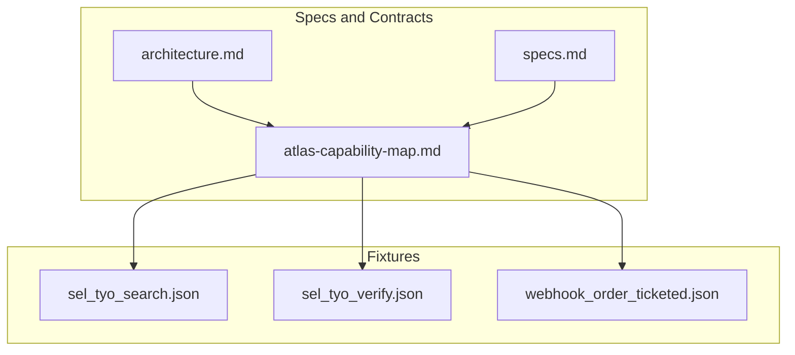
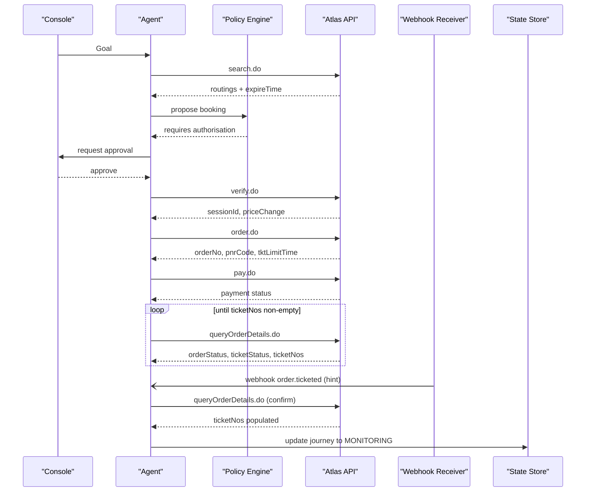
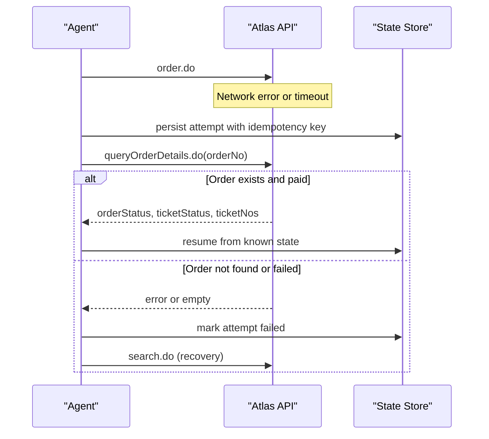
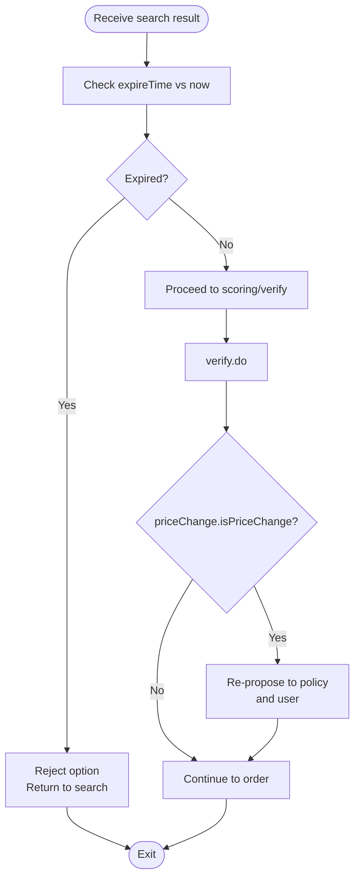
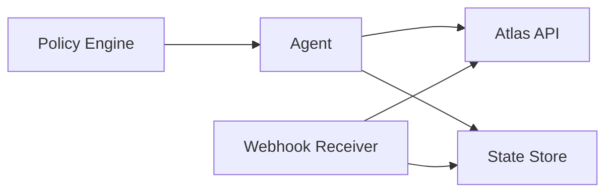

# Network Failures & Timeout Handling

<cite>
**Referenced Files in This Document**
- [architecture.md](file://.antabay/architecture.md)
- [specs.md](file://.antabay/specs.md)
- [atlas-capability-map.md](file://.antabay/atlas-capability-map.md)
- [sel_tyo_search.json](file://fixtures/atlas/sel_tyo_search.json)
- [sel_tyo_verify.json](file://fixtures/atlas/sel_tyo_verify.json)
- [webhook_order_ticketed.json](file://fixtures/atlas/webhook_order_ticketed.json)
</cite>

## Table of Contents
1. [Introduction](#introduction)
2. [Project Structure](#project-structure)
3. [Core Components](#core-components)
4. [Architecture Overview](#architecture-overview)
5. [Detailed Component Analysis](#detailed-component-analysis)
6. [Dependency Analysis](#dependency-analysis)
7. [Performance Considerations](#performance-considerations)
8. [Troubleshooting Guide](#troubleshooting-guide)
9. [Conclusion](#conclusion)
10. [Appendices](#appendices)

## Introduction
This document specifies network failure recovery and timeout handling strategies for the Antabay system that integrates with the Atlas travel API. It focuses on:
- Timeout configurations per endpoint category
- Partial response processing and idempotency
- Connection retry policies and rate-limit compliance
- Circuit breaker patterns for transient failures
- Fallback strategies when Atlas is unavailable
- Graceful degradation modes
- Timeout handling for offer expiry, session timeouts, and ticketing deadlines
- Examples of network failure scenarios and recovery procedures
- Monitoring and observability for service health
- Performance considerations for retries and resource cleanup

The guidance is grounded in the verified Atlas contract and observed behavior from sandbox runs.

## Project Structure
At a high level, the project contains:
- Architecture and sequence diagrams describing the end-to-end flow and state machine
- A capability map defining verified endpoints, error codes, and constraints
- Fixtures capturing real responses used as seeds for tests and examples

**Diagram sources**
- [architecture.md:19-78](file://.antabay/architecture.md#L19-L78)
- [specs.md:303-398](file://.antabay/specs.md#L303-L398)
- [atlas-capability-map.md:25-34](file://.antabay/atlas-capability-map.md#L25-L34)

**Section sources**
- [architecture.md:19-78](file://.antabay/architecture.md#L19-L78)
- [specs.md:303-398](file://.antabay/specs.md#L303-L398)
- [atlas-capability-map.md:25-34](file://.antabay/atlas-capability-map.md#L25-L34)

## Core Components
The following components are central to resilient integration with Atlas:

- Agent and Tool Layer
  - The agent orchestrates search, verify, order, pay, and query flows against Atlas.
  - The tool layer abstracts endpoint calls and enforces the verified contract.

- Webhook Receiver and Reconciler
  - Receives unauthenticated hints (e.g., order.ticketed).
  - Always reconciles via authoritative query before updating journey state.

- Journey State Machine and Clocks
  - Tracks three clocks: offer expireTime, sessionId window, and tktLimitTime.
  - Enforces transitions and re-search on expiry.

- Policy Engine and Authorisation Gate
  - Requires human approval for actions that spend money or void bookings.

- Disruption Injector (simulation)
  - Emulates schedule changes to exercise recovery paths.

- Structured Trace and Audit Log
  - Records every external call, decision, and authorisation outcome.

**Section sources**
- [architecture.md:19-78](file://.antabay/architecture.md#L19-L78)
- [architecture.md:89-148](file://.antabay/architecture.md#L89-L148)
- [architecture.md:152-208](file://.antabay/architecture.md#L152-L208)
- [architecture.md:212-257](file://.antabay/architecture.md#L212-L257)
- [specs.md:303-398](file://.antabay/specs.md#L303-L398)

## Architecture Overview
The system follows a strict separation between reasoning, policy, and execution. All travel facts must trace back to an Atlas response. Webhooks are treated as untrusted hints; authoritative truth comes from queryOrderDetails.do.

**Diagram sources**
- [architecture.md:89-148](file://.antabay/architecture.md#L89-L148)
- [atlas-capability-map.md:236-313](file://.antabay/atlas-capability-map.md#L236-L313)

**Section sources**
- [architecture.md:89-148](file://.antabay/architecture.md#L89-L148)
- [atlas-capability-map.md:236-313](file://.antabay/atlas-capability-map.md#L236-L313)

## Detailed Component Analysis

### Endpoint Timeout Strategy
- Offer search (search.do)
  - Short-lived offers: observe expireTime; offers may arrive partially aged.
  - Timeout strategy: set a generous client-side read timeout to avoid partial parsing; enforce offer freshness checks before any decision.
  - Rate limits: 10 QPS; respect provider throttling and do not retry before instructed intervals.

- Price verification (verify.do)
  - Post-verify session clock (~2 hours) replaces short offer window.
  - Timeout strategy: moderate read timeout; if priceChange indicates change, re-validate authorisation.

- Booking and payment (order.do, pay.do)
  - Order returns tktLimitTime (30 minutes); payment success does not equal ticketed.
  - Timeout strategy: use idempotent retries only for transport errors; never retry on business errors like duplicate booking.

- Ticket confirmation (queryOrderDetails.do)
  - Poll until ticketNos is non-empty; treat paid ≠ ticketed.
  - Timeout strategy: bounded polling with exponential backoff; stop after tktLimitTime expiry.

- Webhooks (updateWebhookURL.do, inbound events)
  - Unauthenticated; always reconcile via queryOrderDetails.do before state changes.
  - Timeout strategy: quick parse and immediate reconciliation call; do not block on long webhook processing.

**Section sources**
- [atlas-capability-map.md:107-125](file://.antabay/atlas-capability-map.md#L107-L125)
- [atlas-capability-map.md:236-313](file://.antabay/atlas-capability-map.md#L236-L313)
- [atlas-capability-map.md:315-379](file://.antabay/atlas-capability-map.md#L315-L379)
- [specs.md:303-398](file://.antabay/specs.md#L303-L398)

### Retry Policies and Idempotency
- General rules
  - No retry loops on rate-limit rejections; honour wait instructions.
  - Treat duplicate booking (error code 318) as reconcilable; adopt existing order reference.
  - Do not retry auth failures (error code 900) or “order not exists” (error code 800).

- Idempotency
  - Use server-provided identifiers exactly as returned.
  - On duplicate booking, query the returned order and resume from its real state.

- Polling
  - For ticketing confirmation, poll queryOrderDetails.do with bounded attempts and backoff until ticketNos is populated or tktLimitTime expires.

**Section sources**
- [atlas-capability-map.md:107-125](file://.antabay/atlas-capability-map.md#L107-L125)
- [atlas-capability-map.md:400-415](file://.antabay/atlas-capability-map.md#L400-L415)
- [specs.md:303-398](file://.antabay/specs.md#L303-L398)

### Circuit Breaker for Transient Failures
- Purpose
  - Prevent cascading failures and reduce load during Atlas outages or degraded performance.

- Implementation pattern
  - Track recent failure rates and latency percentiles per endpoint category.
  - Open circuit when failures exceed thresholds; enter half-open to probe periodically.
  - On closed/half-open, allow limited requests; on open, fail fast with a fallback path.

- Integration points
  - Wrap search, verify, order, pay, and query calls.
  - Respect rate limits even under circuit breaker; do not bypass throttling.

- Recovery
  - Gradually increase allowed traffic in half-open; close circuit on successful probes.
  - Record metrics and emit alerts for sustained opens.

[No sources needed since this section provides general guidance]

### Fallback Strategies When Atlas Is Unavailable
- Read-only mode
  - Serve cached, time-stamped results for display while preventing new writes.
  - Show clear status that operations are paused due to provider issues.

- Queue and replay
  - Buffer outbound write requests (order/pay) in durable storage.
  - Replay once the circuit closes and rate limits permit.

- User communication
  - Surface transparent messages about delays and expected resolution windows.
  - Avoid exposing internal error codes to users.

[No sources needed since this section provides general guidance]

### Graceful Degradation Modes
- Search-only mode
  - Allow searching but disable booking/payment until availability improves.

- Reduced functionality
  - Skip optional enrichment calls (e.g., ancillary queries) to conserve budget and reduce risk.

- Observability-first
  - Increase logging verbosity temporarily; record all attempted calls and outcomes.

[No sources needed since this section provides general guidance]

### Offer Expiry Management
- Offer clock
  - Offers have short lifetimes (observed 7m43s to 31m) and may be partially aged on arrival.
  - Compute remaining usable time from current time; reject expired options immediately.

- Pre-verify vs post-verify
  - Pre-verify governed by expireTime; post-verify governed by sessionId (~2h).
  - After verify, refresh fields become null; rely on session clock.

- Action
  - If an offer expires mid-decision, return to search with fresh data.

**Section sources**
- [atlas-capability-map.md:107-125](file://.antabay/atlas-capability-map.md#L107-L125)
- [atlas-capability-map.md:217-228](file://.antabay/atlas-capability-map.md#L217-L228)
- [architecture.md:212-257](file://.antabay/architecture.md#L212-L257)

### Session Timeouts
- Session clock
  - After verify, a session identifier governs subsequent order/pay steps with a longer but bounded lifetime.
  - If session expires, restart from search.

- Price change handling
  - If verify reports price change, prior authorisation is void; re-propose to policy engine and user.

**Section sources**
- [atlas-capability-map.md:217-228](file://.antabay/atlas-capability-map.md#L217-L228)
- [atlas-capability-map.md:183-196](file://.antabay/atlas-capability-map.md#L183-L196)
- [architecture.md:212-257](file://.antabay/architecture.md#L212-L257)

### Ticketing Deadline Monitoring
- tktLimitTime
  - After order, a 30-minute deadline applies to complete ticketing.
  - Payment success is not proof of ticketing; poll until ticketNos is populated.

- Recovery on deadline expiry
  - If deadline expires without ticketing, initiate recovery: search alternatives, propose rebook, and void original where possible.

**Section sources**
- [atlas-capability-map.md:236-313](file://.antabay/atlas-capability-map.md#L236-L313)
- [architecture.md:89-148](file://.antabay/architecture.md#L89-L148)

### Webhook Handling and Reconciliation
- Inbound webhooks are unauthenticated hints
  - Must be validated structurally and reconciled via queryOrderDetails.do before changing state.
  - Do not trust webhook status field semantics; it differs from API success semantics.

- Reconciliation flow
  - On receiving order.ticketed, call queryOrderDetails.do to confirm ticketNos and update journey to monitoring.

**Section sources**
- [atlas-capability-map.md:315-379](file://.antabay/atlas-capability-map.md#L315-L379)
- [architecture.md:152-208](file://.antabay/architecture.md#L152-L208)

### Sequence: Recovery After Network Failure During Booking

**Diagram sources**
- [atlas-capability-map.md:236-313](file://.antabay/atlas-capability-map.md#L236-L313)
- [atlas-capability-map.md:400-415](file://.antabay/atlas-capability-map.md#L400-L415)

**Section sources**
- [atlas-capability-map.md:236-313](file://.antabay/atlas-capability-map.md#L236-L313)
- [atlas-capability-map.md:400-415](file://.antabay/atlas-capability-map.md#L400-L415)

### Flowchart: Offer Expiry Decision Logic

**Diagram sources**
- [atlas-capability-map.md:107-125](file://.antabay/atlas-capability-map.md#L107-L125)
- [atlas-capability-map.md:183-196](file://.antabay/atlas-capability-map.md#L183-L196)

**Section sources**
- [atlas-capability-map.md:107-125](file://.antabay/atlas-capability-map.md#L107-L125)
- [atlas-capability-map.md:183-196](file://.antabay/atlas-capability-map.md#L183-L196)

## Dependency Analysis
Key dependencies and their resilience implications:

- Agent depends on Atlas endpoints
  - Each call must handle timeouts, retries, and rate limits.
  - Errors classified as retryable, reconcilable, or terminal guide recovery.

- Webhook receiver depends on Atlas for reconciliation
  - Never trust webhook alone; always call queryOrderDetails.do.

- State store persists journeys, clocks, and audit trails
  - Enables rehydration after process restarts and supports recovery workflows.

**Diagram sources**
- [architecture.md:19-78](file://.antabay/architecture.md#L19-L78)
- [specs.md:303-398](file://.antabay/specs.md#L303-L398)

**Section sources**
- [architecture.md:19-78](file://.antabay/architecture.md#L19-L78)
- [specs.md:303-398](file://.antabay/specs.md#L303-L398)

## Performance Considerations
- Retry logic
  - Use exponential backoff with jitter for transient errors.
  - Honour provider wait instructions; no retry loops on rate limits.
  - Limit concurrent retries per endpoint category to avoid amplification.

- Resource cleanup
  - Cancel in-flight HTTP requests on timeout or cancellation signals.
  - Release connection pools promptly; avoid holding sessions beyond necessary.

- Polling efficiency
  - Bound polling attempts and durations; escalate to recovery search on deadline expiry.

- Budget awareness
  - Track call budgets per journey for rate-limited endpoints; pause or degrade when nearing limits.

[No sources needed since this section provides general guidance]

## Troubleshooting Guide
Common network and timeout issues and how to address them:

- Timeout on search.do
  - Symptom: no routings or partial response.
  - Action: retry once with backoff; if still failing, switch to read-only mode and alert.

- Rate limit hit (429)
  - Symptom: explicit retryAfter header or message.
  - Action: wait the instructed interval; do not retry early; log and monitor.

- Duplicate booking (error 318)
  - Symptom: server returns existing orderNo.
  - Action: adopt existing order; query details; continue workflow.

- Auth failure (error 900)
  - Symptom: credentials invalid or account issue.
  - Action: stop retries; surface configuration error; alert ops.

- Paid but not ticketed
  - Symptom: pay.do success but query shows empty ticketNos.
  - Action: poll queryOrderDetails.do until ticketNos populated or tktLimitTime expires; then proceed to monitoring.

- Webhook misinterpretation
  - Symptom: assuming webhook status means success.
  - Action: always reconcile via queryOrderDetails.do; ignore webhook status semantics.

**Section sources**
- [atlas-capability-map.md:107-125](file://.antabay/atlas-capability-map.md#L107-L125)
- [atlas-capability-map.md:236-313](file://.antabay/atlas-capability-map.md#L236-L313)
- [atlas-capability-map.md:315-379](file://.antabay/atlas-capability-map.md#L315-L379)
- [atlas-capability-map.md:400-415](file://.antabay/atlas-capability-map.md#L400-L415)

## Conclusion
Robust network failure recovery and timeout handling in Antabay hinge on:
- Strict adherence to the verified Atlas contract
- Careful management of three clocks (offer, session, ticketing deadline)
- Idempotent operations and reconciliation-driven state updates
- Conservative retry policies that respect rate limits
- Circuit breaker patterns to protect both client and provider
- Clear fallback and degradation modes with transparent user communication
- Comprehensive observability through structured traces and audit logs

These practices ensure reliable journeys even under transient network issues and provider instability.

## Appendices

### Appendix A: Three Clocks Summary
- Offer expireTime: pre-verify, short-lived, sometimes partially aged
- SessionId: post-verify, longer but bounded
- tktLimitTime: post-order, 30 minutes to ticketing

**Section sources**
- [atlas-capability-map.md:236-313](file://.antabay/atlas-capability-map.md#L236-L313)
- [architecture.md:261-278](file://.antabay/architecture.md#L261-L278)

### Appendix B: Error Code Classification
- 0: success
- 318: duplicate booking — reconcile using returned order reference
- 800: order not exists — treat as internal bug, not retryable
- 900: auth failed — do not retry

**Section sources**
- [atlas-capability-map.md:400-415](file://.antabay/atlas-capability-map.md#L400-L415)