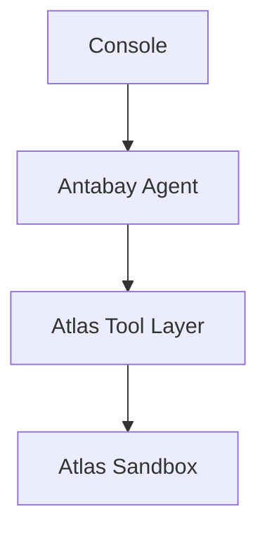
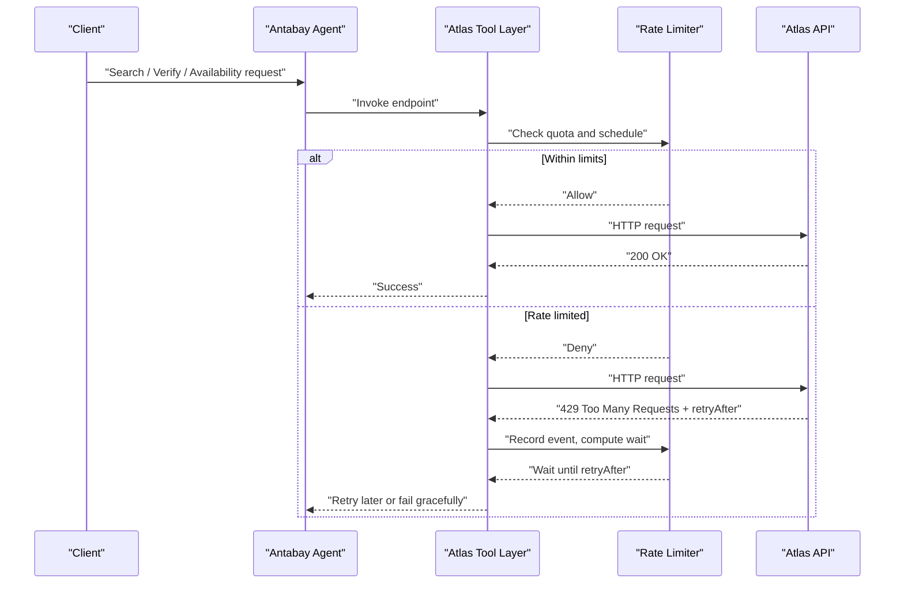
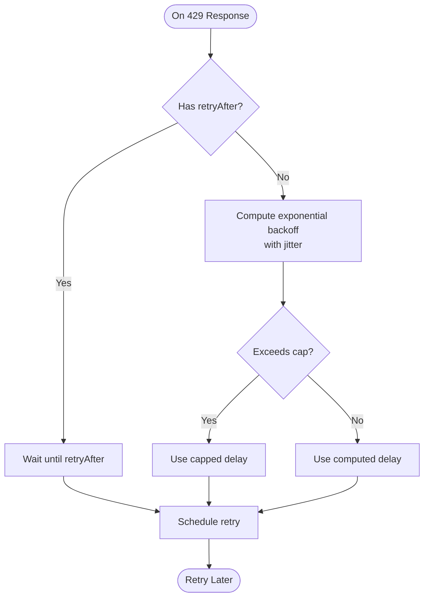
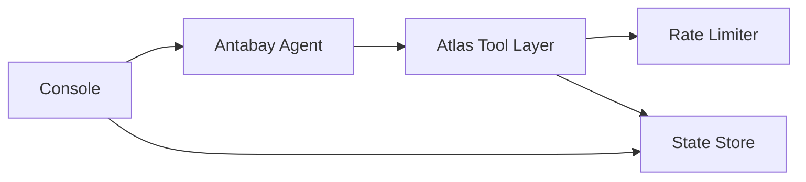

# Rate Limiting & Retry Strategies

<cite>
**Referenced Files in This Document**
- [atlas-capability-map.md](file://.antabay/atlas-capability-map.md)
- [specs.md](file://.antabay/specs.md)
- [architecture.md](file://.antabay/architecture.md)
</cite>

## Table of Contents
1. Introduction
2. Project Structure
3. Core Components
4. Architecture Overview
5. Detailed Component Analysis
6. Dependency Analysis
7. Performance Considerations
8. Troubleshooting Guide
9. Conclusion

## Introduction
This document specifies how the system must handle Atlas API rate limits and retries for the booking workflow. It defines per-endpoint rate limits, the required handling of 429 responses with retryAfter headers, a strict no-retry-loop policy, and recommended queuing, throttling, backoff, and circuit breaker patterns. It also covers monitoring for rate limit exhaustion and its impact on user experience.

The guidance is grounded in the verified Atlas capability map and the project’s specifications, which explicitly define rate limits, error behavior, and call budget enforcement.

## Project Structure
At this stage, the repository contains:
- Verified contract and constraints for Atlas endpoints
- Specifications that mandate call budgets and rate-limit compliance
- Architecture diagrams showing where the Agent calls Atlas tools

Rate limiting applies to the boundary between the Antabay Agent and the Atlas Tool Layer. The implementation should enforce limits at or near the HTTP client used by the tool layer so all downstream flows (search → verify → order → pay → query) respect provider constraints consistently.

[No sources needed since this diagram shows conceptual workflow, not actual code structure]

## Core Components
- Rate limit definitions per endpoint group
- 429 response handling with retryAfter
- No-retry-loop policy
- Throttling and queuing model
- Exponential backoff strategy
- Circuit breaker pattern for repeated rate limit events
- Monitoring and observability for rate limit pressure

Key requirements from the verified contract:
- search.do: 10 QPS
- verify.do + getOffers.do: 60 QPM shared
- seatAvailability.do + getLuggage.do: 60 QPM shared
- Over-limit returns HTTP 429 with retryAfter; no retry loops

These are enforced as part of the Atlas capability contract and must be respected by every outbound call path.

**Section sources**
- [atlas-capability-map.md:119-121](file://.antabay/atlas-capability-map.md#L119-L121)

## Architecture Overview
The rate limiting and retry logic sits at the Atlas Tool Layer, directly before making HTTP requests to Atlas. It inspects responses, enforces per-endpoint quotas, schedules retries only when allowed, and exposes metrics for monitoring.

[No sources needed since this diagram shows conceptual workflow, not actual code structure]

## Detailed Component Analysis

### Rate Limits and Endpoint Groups
- search.do: 10 requests per second
- verify.do + getOffers.do: 60 requests per minute (shared bucket)
- seatAvailability.do + getLuggage.do: 60 requests per minute (shared bucket)

Implementation notes:
- Maintain separate sliding windows or token buckets per group
- Enforce both per-second and per-minute limits independently
- Track usage per journey to honor the call budget requirement

**Section sources**
- [atlas-capability-map.md:119-121](file://.antabay/atlas-capability-map.md#L119-L121)

### 429 Handling and retryAfter Policy
When Atlas returns HTTP 429:
- Read the retryAfter header
- Do not retry before the instructed interval has elapsed
- Record the event with timestamp, endpoint, and retryAfter value
- Queue or reschedule the request after the wait period
- If the offer/session/ticket deadline is approaching, prefer graceful degradation over aggressive retries

Policy references:
- Honor any wait instruction returned with a rate-limit rejection
- No retry loops

**Section sources**
- [specs.md:373-374](file://.antabay/specs.md#L373-L374)
- [specs.md:636-638](file://.antabay/specs.md#L636-L638)
- [atlas-capability-map.md:119-121](file://.antabay/atlas-capability-map.md#L119-L121)

### No-Retry-Loop Policy
A hard rule: never enter an unbounded retry loop on 429. Instead:
- Respect retryAfter exactly
- Cap total retries per request lifecycle
- Prefer waiting and re-scheduling over immediate retries
- If deadlines expire during waits, escalate to graceful failure with clear messaging

**Section sources**
- [atlas-capability-map.md:119-121](file://.antabay/atlas-capability-map.md#L119-L121)

### Throttling and Queuing Model
Recommended design:
- Per-endpoint-group queues with bounded capacity
- Token-bucket or leaky-bucket throttler enforcing:
  - search.do: 10 QPS
  - verify.do + getOffers.do: 60 QPM
  - seatAvailability.do + getLuggage.do: 60 QPM
- Priority rules:
  - Time-sensitive operations (e.g., verifying an expiring offer) take priority
  - Non-urgent checks (e.g., luggage availability) can be deferred
- Backpressure:
  - If queues fill, reject new requests early with a “retry later” signal
  - Surface remaining call budget and queue depth to the console

Operational behaviors:
- Deduplicate identical concurrent requests to the same endpoint within a short window
- Persist queued work if the process restarts, so journeys can resume without losing progress

[No sources needed since this section provides general guidance]

### Exponential Backoff Strategy
Use exponential backoff only when the provider does not supply a precise retryAfter or when additional jitter is needed to avoid thundering herds:
- Base delay: start small (e.g., seconds), then double each attempt
- Add jitter: randomize to reduce contention
- Cap maximum delay: do not exceed a reasonable ceiling
- Combine with retryAfter: always honor explicit retryFirst; apply backoff only for subsequent attempts or when retryAfter is absent

Decision flow:

[No sources needed since this diagram shows conceptual workflow, not actual code structure]

### Circuit Breaker Pattern
Implement a lightweight circuit breaker around Atlas calls to protect against sustained overload:
- States:
  - Closed: normal operation
  - Open: temporarily block new calls after repeated 429s or failures
  - Half-open: allow a limited probe request
- Trip conditions:
  - N consecutive 429s within a time window
  - High ratio of 429s to total attempts
- Recovery:
  - After a timeout, move to half-open
  - If probe succeeds, close; otherwise reopen
- User experience:
  - When open, return a friendly “retry later” message instead of failing loudly
  - Continue honoring retryAfter and backoff policies

[No sources needed since this section provides general guidance]

### Graceful Degradation Strategies
When rate limits constrain progress:
- Defer non-critical calls (e.g., luggage/seat checks) until limits ease
- Prioritize actions that preserve offers or sessions nearing expiry
- Communicate delays transparently in the console trace
- If deadlines cannot be met, stop and report objective risk rather than burning through call budgets

[No sources needed since this section provides general guidance]

### Monitoring and Observability
Track and expose:
- Per-endpoint-group request counts and throttle decisions
- 429 frequency and average retryAfter values
- Queue depths and wait times
- Call budget consumption per journey
- Circuit breaker state transitions

Dashboard signals:
- Rising 429 rates indicate approaching or exceeding limits
- Long queue waits suggest sustained pressure
- Frequent circuit breaker trips indicate systemic overload

User experience impact:
- Visible countdowns for offer/session/ticket clocks
- Clear messages when rate limits delay progress
- Transparent explanation of why certain steps are postponed

[No sources needed since this section provides general guidance]

## Dependency Analysis
Rate limiting depends on:
- The Atlas Tool Layer for outbound calls
- The Agent’s scheduling and prioritization logic
- The Console for displaying status and call budget
- The State Store for persisting journey context and audit trails

[No sources needed since this diagram shows conceptual workflow, not actual code structure]

**Section sources**
- [architecture.md:19-78](file://.antabay/architecture.md#L19-L78)

## Performance Considerations
- Prefer exact retryAfter waits over polling to minimize wasted requests
- Batch non-urgent operations when possible to reduce contention
- Keep queues bounded to prevent memory growth under load
- Avoid redundant calls by deduplicating within short windows
- Tune circuit breaker thresholds based on observed 429 patterns
- Monitor latency spikes caused by long waits and adjust priorities accordingly

[No sources needed since this section provides general guidance]

## Troubleshooting Guide
Common issues and resolutions:
- Repeated 429 errors:
  - Verify correct parsing of retryAfter
  - Check per-endpoint-group quotas and recent traffic
  - Inspect queue depths and backoff settings
- Missed deadlines due to rate limits:
  - Review priority rules and whether urgent calls were starved
  - Adjust queue weights to favor time-sensitive operations
- Circuit breaker tripping too often:
  - Increase trip thresholds or cooldown periods
  - Investigate upstream causes of sustained 429s
- Inconsistent retry behavior:
  - Ensure retryAfter takes precedence over backoff
  - Confirm no retry loops exist anywhere in the call chain

[No sources needed since this section provides general guidance]

## Conclusion
The system must treat Atlas rate limits as first-class constraints. Enforce per-endpoint quotas, honor retryAfter precisely, and implement a strict no-retry-loop policy. Use queuing, throttling, exponential backoff, and circuit breakers to manage bursts and sustained overload. Monitor 429 rates, queue health, and call budgets to maintain responsiveness and protect user experience. All behaviors align with the verified Atlas capability map and the project’s specifications.

**Section sources**
- [atlas-capability-map.md:119-121](file://.antabay/atlas-capability-map.md#L119-L121)
- [specs.md:373-374](file://.antabay/specs.md#L373-L374)
- [specs.md:636-638](file://.antabay/specs.md#L636-L638)
- [architecture.md:19-78](file://.antabay/architecture.md#L19-L78)