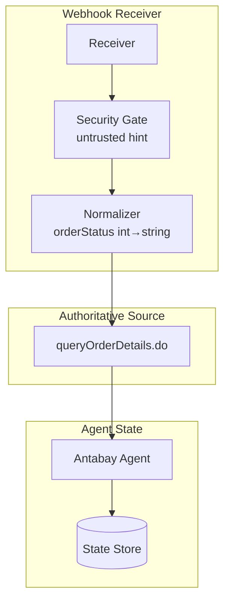
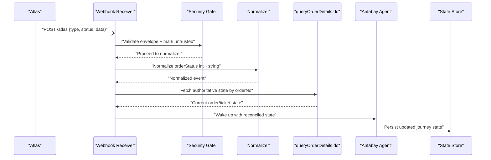
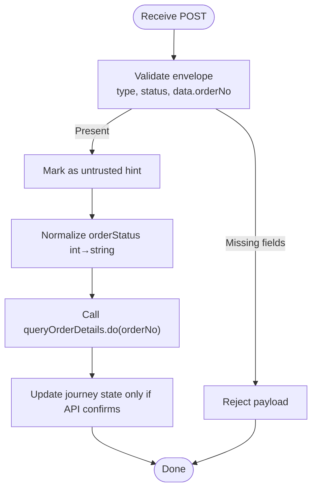
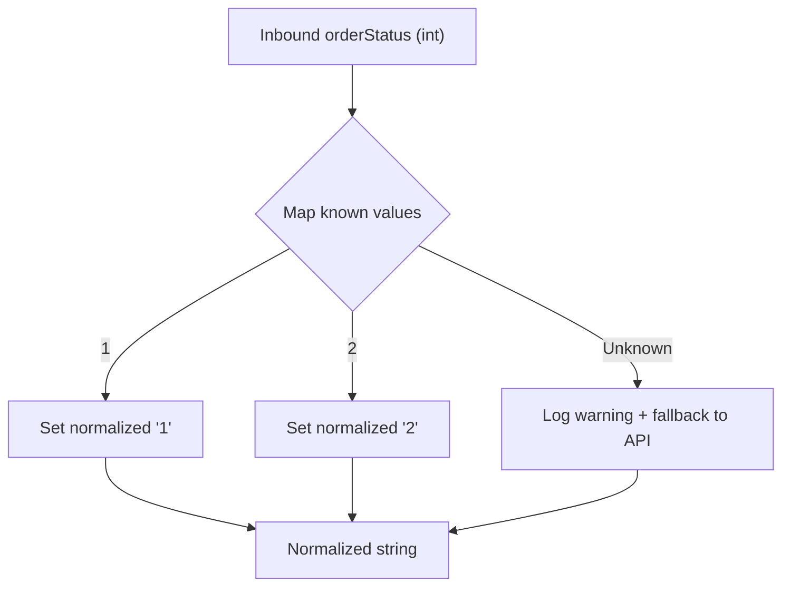
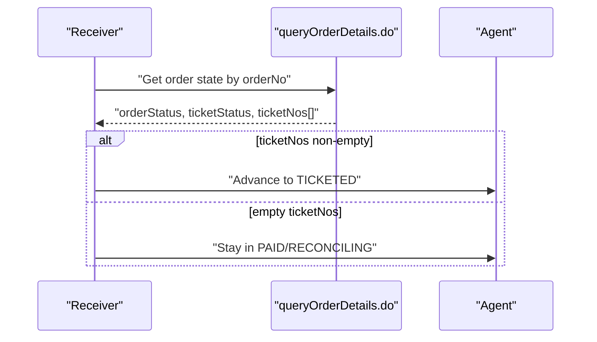
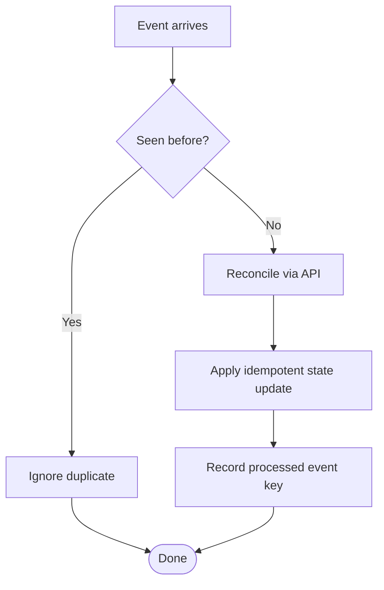
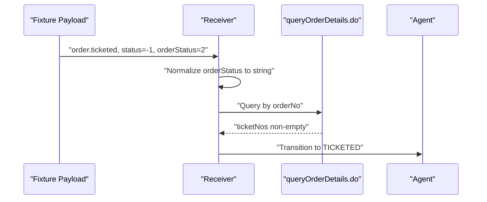
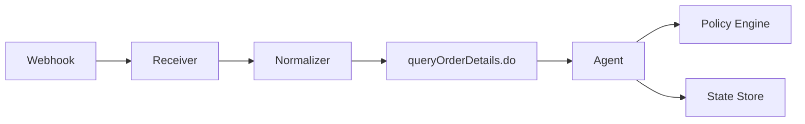

# Webhook Error Handling & Reconciliation

<cite>
**Referenced Files in This Document**
- [webhook_order_ticketed.json](file://fixtures/atlas/webhook_order_ticketed.json)
- [architecture.md](file://.antabay/architecture.md)
- [specs.md](file://.antabay/specs.md)
- [atlas-capability-map.md](file://.antabay/atlas-capability-map.md)
</cite>

## Table of Contents
1. Introduction
2. Project Structure
3. Core Components
4. Architecture Overview
5. Detailed Component Analysis
6. Dependency Analysis
7. Performance Considerations
8. Troubleshooting Guide
9. Conclusion

## Introduction
This document explains how the system ingests, secures, and reconciles webhooks from the Atlas travel API. It focuses on:
- Treating webhooks as untrusted hints and reconciling against authoritative state via queryOrderDetails.do
- Webhook status semantics (status: -1 indicates a successful event delivery, not failure)
- Normalizing orderStatus between webhook integers and API strings
- Handling duplicate events, ordering guarantees, and partial deliveries
- Security requirements for unauthenticated webhooks and verification strategies
- Examples grounded in the captured webhook fixture

## Project Structure
The repository contains verified fixtures and design documents that define the contract and behavior around webhooks and reconciliation:
- A captured webhook payload demonstrating a successful ticketing event
- Architecture diagrams showing the webhook receiver and reconciler
- The capability map documenting webhook envelope shape, status semantics, and type field
- Specs defining error classification, normalization, and idempotency expectations

**Diagram sources**
- [architecture.md:21-78](file://.antabay/architecture.md#L21-L78)
- [atlas-capability-map.md:315-378](file://.antabay/atlas-capability-map.md#L315-L378)

**Section sources**
- [architecture.md:21-78](file://.antabay/architecture.md#L21-L78)
- [atlas-capability-map.md:315-378](file://.antabay/atlas-capability-map.md#L315-L378)

## Core Components
- Webhook receiver: Accepts POST events, parses JSON, validates envelope presence, and treats the event as an untrusted hint.
- Normalizer: Converts webhook integer orderStatus to the canonical string form used by queryOrderDetails.do to avoid silent comparison failures.
- Reconciler: Calls queryOrderDetails.do with the orderNo from the webhook to obtain authoritative state before updating journey state or triggering downstream actions.
- Security gate: Enforces that no webhook claim is trusted without confirmation from the API; there is no signature header or HMAC to verify.

Key behaviors derived from the verified contract:
- Event routing uses the dotted string in type (e.g., order.ticketed).
- Webhook status -1 means success for delivery; do not treat it as failure.
- orderStatus arrives as integer in webhook but as string in queryOrderDetails.do; normalize at ingest.
- Webhook is unauthenticated; always reconcile against queryOrderDetails.do.

**Section sources**
- [atlas-capability-map.md:315-378](file://.antabay/atlas-capability-map.md#L315-L378)
- [specs.md:303-398](file://.antabay/specs.md#L303-L398)

## Architecture Overview
The architecture enforces four rules relevant to webhooks:
- Webhooks are untrusted hints.
- queryOrderDetails.do is the truth.
- The agent rehydrates state on every wake-up.
- Every travel fact shown to the traveller traces to an Atlas response.

**Diagram sources**
- [architecture.md:21-78](file://.antabay/architecture.md#L21-L78)
- [atlas-capability-map.md:315-378](file://.antabay/atlas-capability-map.md#L315-L378)

**Section sources**
- [architecture.md:21-78](file://.antabay/architecture.md#L21-L78)
- [atlas-capability-map.md:315-378](file://.antabay/atlas-capability-map.md#L315-L378)

## Detailed Component Analysis

### Webhook Ingestion and Security Requirements
- Unauthenticated delivery: No signature header, HMAC, or shared secret. Only cid appears in the body, which is not secret.
- Security rule: Treat every inbound webhook as an untrusted hint. Do not change journey state based solely on the webhook. Always confirm via queryOrderDetails.do.
- Envelope validation: Ensure presence of type, status, and data.orderNo before processing. Reject malformed payloads early.
- Status semantics: status: -1 indicates a successful delivery of the event. Do not gate handling on status == 0.

**Diagram sources**
- [atlas-capability-map.md:315-378](file://.antabay/atlas-capability-map.md#L315-L378)

**Section sources**
- [atlas-capability-map.md:315-378](file://.antabay/atlas-capability-map.md#L315-L378)

### OrderStatus Normalization
- Webhook sends orderStatus as integer (observed value 2).
- queryOrderDetails.do returns orderStatus as string (observed values include "1").
- Normalization requirement: Convert webhook integer orderStatus to the canonical string representation before comparisons or state transitions to prevent silent mismatches.
- Partial enum observed: 1 = paid, not ticketed; 2 = ticketed. Until full mapping is verified, rely on ticketNos non-empty as proof of ticketing.

**Diagram sources**
- [atlas-capability-map.md:315-378](file://.antabay/atlas-capability-map.md#L315-L378)

**Section sources**
- [atlas-capability-map.md:315-378](file://.antabay/atlas-capability-map.md#L315-L378)

### Reconciliation Against Authoritative Source
- After receiving a webhook, call queryOrderDetails.do with the orderNo to obtain authoritative state.
- Use ticketNos non-empty as proof of ticketing until full enums are mapped.
- If the webhook claims ticketed but API shows otherwise, do not advance state; log discrepancy and continue monitoring.

**Diagram sources**
- [atlas-capability-map.md:285-313](file://.antabay/atlas-capability-map.md#L285-L313)

**Section sources**
- [atlas-capability-map.md:285-313](file://.antabay/atlas-capability-map.md#L285-L313)

### Duplicate Event Handling and Ordering Guarantees
- Duplicate events: Webhooks may be delivered more than once. Idempotent processing is required.
- Deduplication strategy: Track processed event identifiers (e.g., combination of type + orderNo + received_at or a provider-provided id if available) and ignore repeats.
- Ordering: Do not assume strict ordering across multiple events. Reconcile each event against the latest authoritative state.
- Partial deliveries: If data is incomplete or inconsistent, fall back to queryOrderDetails.do to resolve the true state.

**Diagram sources**
- [specs.md:303-398](file://.antabay/specs.md#L303-L398)

**Section sources**
- [specs.md:303-398](file://.antabay/specs.md#L303-L398)

### Example: Successful Ticketing Event in Fixture
- The captured webhook demonstrates a successful ticketing event:
  - type: order.ticketed
  - status: -1 (successful delivery)
  - data.orderStatus: 2 (integer)
  - data.paxTicketInfos[].ticketNos populated
- Processing steps:
  - Validate envelope and mark as untrusted hint
  - Normalize orderStatus to string
  - Call queryOrderDetails.do to confirm ticketNos non-empty
  - Advance journey state to TICKETED and resume monitoring

**Diagram sources**
- [webhook_order_ticketed.json:1-53](file://fixtures/atlas/webhook_order_ticketed.json#L1-L53)
- [atlas-capability-map.md:315-378](file://.antabay/atlas-capability-map.md#L315-L378)

**Section sources**
- [webhook_order_ticketed.json:1-53](file://fixtures/atlas/webhook_order_ticketed.json#L1-L53)
- [atlas-capability-map.md:315-378](file://.antabay/atlas-capability-map.md#L315-L378)

### Error Handling and Classification
- Known external errors:
  - 0: success — proceed
  - 318: duplicate booking — read duplicateOrders[], reconcile against returned order, never retry
  - 800: order not exists — treat as internal bug, not retryable
  - 900: auth failed — credentials/account issue, do not retry
- For webhook-related flows:
  - If reconciliation fails due to transient network issues, apply bounded retries with backoff and eventually escalate.
  - If reconciliation reveals inconsistency (webhook says ticketed but API does not), log and remain in current state while continuing to monitor.

**Section sources**
- [atlas-capability-map.md:400-416](file://.antabay/atlas-capability-map.md#L400-L416)

## Dependency Analysis
The webhook flow depends on:
- Atlas webhook delivery (unauthenticated)
- queryOrderDetails.do for authoritative state
- Journey state store for persistence
- Policy engine for authorisation when recovery actions require spend or irreversible operations

**Diagram sources**
- [architecture.md:21-78](file://.antabay/architecture.md#L21-L78)

**Section sources**
- [architecture.md:21-78](file://.antabay/architecture.md#L21-L78)

## Performance Considerations
- Minimize redundant API calls by deduplicating events and caching recent reconciliation results with short TTLs.
- Avoid tight polling loops; rely on webhooks as triggers and reconcile once per event.
- Respect rate limits and wait instructions from the provider; do not implement retry loops beyond instructed intervals.
- Keep reconciliation logic lightweight; defer heavy reasoning to the agent after state is confirmed.

## Troubleshooting Guide
Common issues and resolutions:
- Misinterpreting webhook status:
  - Symptom: Treating status: -1 as failure and ignoring valid events.
  - Resolution: Recognize that -1 indicates successful delivery; process the event and reconcile.
- Type mismatch on orderStatus:
  - Symptom: Comparisons fail silently because webhook sends integer and API sends string.
  - Resolution: Normalize orderStatus at ingest to string; add logging for unknown mappings.
- Trusting webhook without verification:
  - Symptom: State advanced without API confirmation.
  - Resolution: Always call queryOrderDetails.do before changing journey state.
- Duplicate events causing repeated actions:
  - Symptom: Multiple state updates or side effects.
  - Resolution: Implement idempotent processing keyed by event attributes; ignore duplicates.
- Partial or missing data in webhook:
  - Symptom: Cannot reconcile locally.
  - Resolution: Fall back to queryOrderDetails.do to resolve true state.

**Section sources**
- [atlas-capability-map.md:315-378](file://.antabay/atlas-capability-map.md#L315-L378)
- [atlas-capability-map.md:400-416](file://.antabay/atlas-capability-map.md#L400-L416)

## Conclusion
The webhook subsystem must treat all inbound events as untrusted hints, normalize types carefully, and reconcile against queryOrderDetails.do before any state change. The captured fixture demonstrates a successful ticketing event with status: -1 and integer orderStatus, reinforcing the need for robust normalization and verification. By enforcing these practices, the system maintains correctness, security, and resilience against duplicates, partial deliveries, and timing discrepancies.