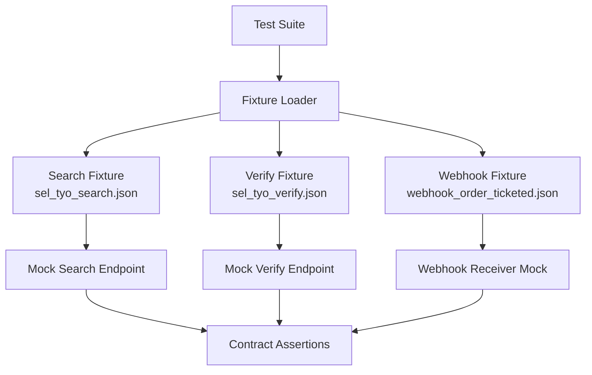
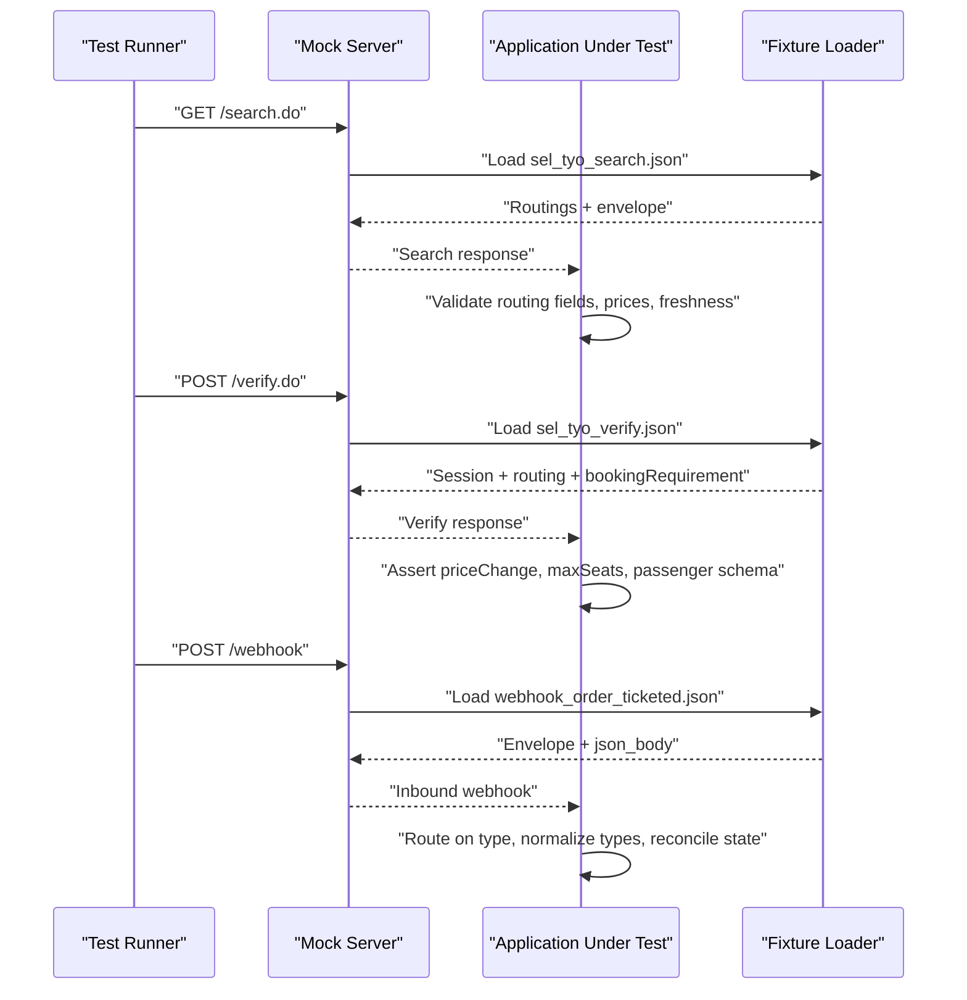
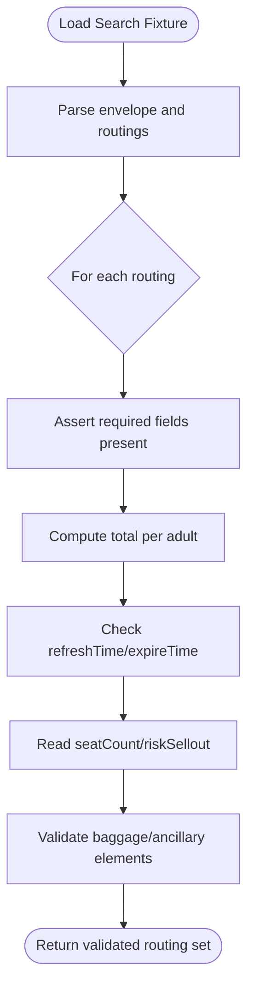
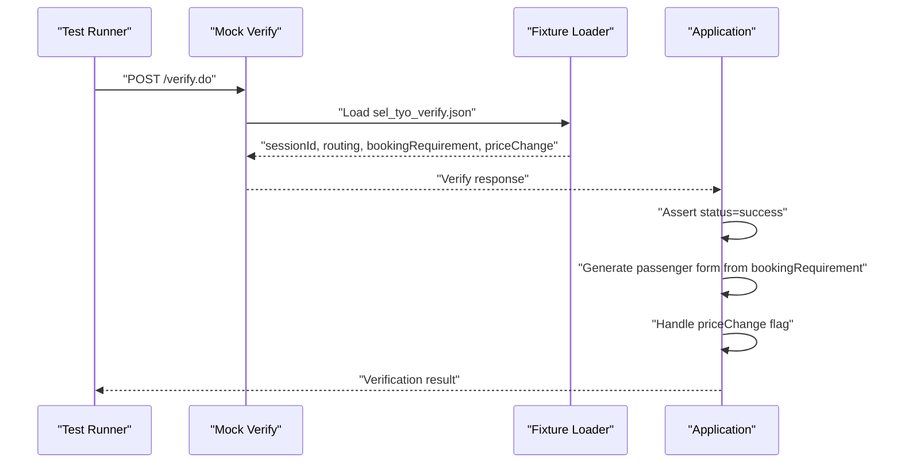
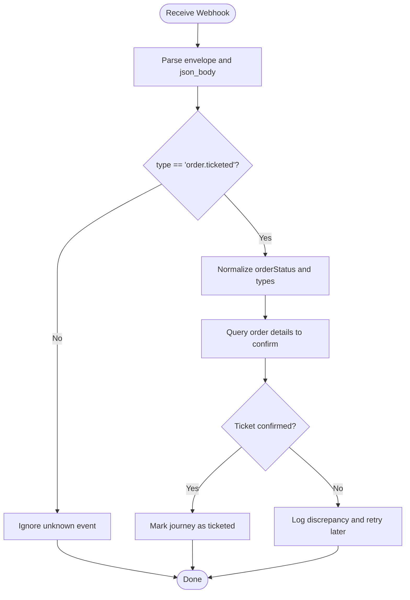
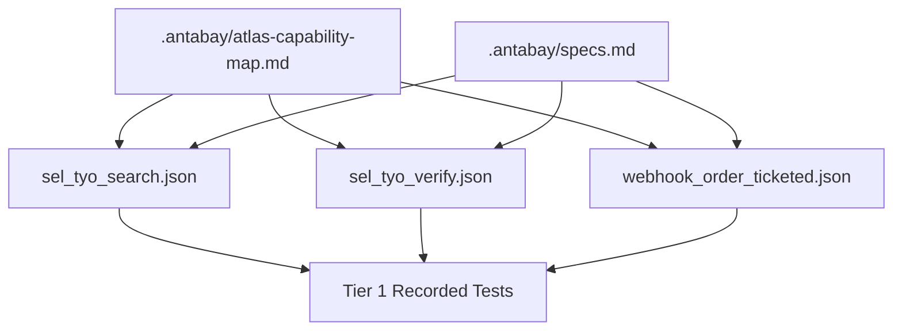

# Testing & Fixtures

<cite>
**Referenced Files in This Document**
- [sel_tyo_search.json](file://fixtures/atlas/sel_tyo_search.json)
- [sel_tyo_verify.json](file://fixtures/atlas/sel_tyo_verify.json)
- [webhook_order_ticketed.json](file://fixtures/atlas/webhook_order_ticketed.json)
- [atlas-capability-map.md](file://.antabay/atlas-capability-map.md)
- [specs.md](file://.antabay/specs.md)
</cite>

## Table of Contents
1. [Introduction](#introduction)
2. [Project Structure](#project-structure)
3. [Core Components](#core-components)
4. [Architecture Overview](#architecture-overview)
5. [Detailed Component Analysis](#detailed-component-analysis)
6. [Dependency Analysis](#dependency-analysis)
7. [Performance Considerations](#performance-considerations)
8. [Troubleshooting Guide](#troubleshooting-guide)
9. [Conclusion](#conclusion)
10. [Appendices](#appendices)

## Introduction
This document explains how to use verified Atlas fixtures for Tier 1 recorded end-to-end tests and contract testing. The fixtures are the source of truth for mocking Atlas API responses, validating request/response contracts, and exercising error and webhook scenarios without live network calls. They are captured from real sandbox runs and redacted to remove sensitive identifiers.

The fixture-based approach ensures:
- Deterministic, repeatable tests that reflect actual provider behavior.
- Contract validation against a verified schema and field set.
- Safe handling of sensitive data via redaction.
- Coverage of success, duplicate order, payment failure, and webhook processing flows.

**Section sources**
- [atlas-capability-map.md:393-399](file://.antabay/atlas-capability-map.md#L393-L399)
- [specs.md:103-135](file://.antabay/specs.md#L103-L135)

## Project Structure
The repository includes a dedicated fixtures directory for Atlas integration testing:
- fixtures/atlas/sel_tyo_search.json: Verified search response used to mock search endpoints and validate routing structures.
- fixtures/atlas/sel_tyo_verify.json: Verified verify response used to mock verification flows and passenger requirements.
- fixtures/atlas/webhook_order_ticketed.json: Captured webhook envelope used to test webhook ingestion and post-processing.

**Diagram sources**
- [sel_tyo_search.json:1-100](file://fixtures/atlas/sel_tyo_search.json#L1-L100)
- [sel_tyo_verify.json:1-120](file://fixtures/atlas/sel_tyo_verify.json#L1-L120)
- [webhook_order_ticketed.json:1-53](file://fixtures/atlas/webhook_order_ticketed.json#L1-L53)

**Section sources**
- [sel_tyo_search.json:1-100](file://fixtures/atlas/sel_tyo_search.json#L1-L100)
- [sel_tyo_verify.json:1-120](file://fixtures/atlas/sel_tyo_verify.json#L1-L120)
- [webhook_order_ticketed.json:1-53](file://fixtures/atlas/webhook_order_ticketed.json#L1-L53)

## Core Components
- Search fixture (sel_tyo_search.json): Contains an array of routings with pricing, segments, baggage rules, ancillaries, and offer freshness fields. Use this to assert routing structure, price totals, segment details, and expiry windows.
- Verify fixture (sel_tyo_verify.json): Contains session context, selected routing, booking requirement schema, and price change metadata. Use this to assert verification flow, passenger form generation, and price-change handling.
- Webhook fixture (webhook_order_ticketed.json): Captures inbound webhook envelope including headers, raw body, and parsed JSON body. Use this to assert event routing, payload normalization, and security considerations.

Key responsibilities:
- Provide realistic payloads for mocking Atlas endpoints.
- Serve as contract baselines for schema validation.
- Enable deterministic error and edge-case testing by combining with controlled request variations.

**Section sources**
- [sel_tyo_search.json:1-100](file://fixtures/atlas/sel_tyo_search.json#L1-L100)
- [sel_tyo_verify.json:1-120](file://fixtures/atlas/sel_tyo_verify.json#L1-L120)
- [webhook_order_ticketed.json:1-53](file://fixtures/atlas/webhook_order_ticketed.json#L1-L53)
- [atlas-capability-map.md:61-98](file://.antabay/atlas-capability-map.md#L61-L98)
- [atlas-capability-map.md:152-235](file://.antabay/atlas-capability-map.md#L152-L235)
- [atlas-capability-map.md:315-392](file://.antabay/atlas-capability-map.md#L315-L392)

## Architecture Overview
The testing architecture uses fixtures to simulate Atlas responses and validates system behavior through recorded end-to-end tests.

**Diagram sources**
- [sel_tyo_search.json:1-100](file://fixtures/atlas/sel_tyo_search.json#L1-L100)
- [sel_tyo_verify.json:1-120](file://fixtures/atlas/sel_tyo_verify.json#L1-L120)
- [webhook_order_ticketed.json:1-53](file://fixtures/atlas/webhook_order_ticketed.json#L1-L53)
- [atlas-capability-map.md:25-34](file://.antabay/atlas-capability-map.md#L25-L34)
- [atlas-capability-map.md:315-392](file://.antabay/atlas-capability-map.md#L315-L392)

## Detailed Component Analysis

### Search Fixture: sel_tyo_search.json
Purpose:
- Mock search endpoint responses with realistic routings.
- Validate routing structure, pricing, segments, baggage rules, ancillary options, and freshness indicators.

Key aspects:
- Envelope contains an array of routings plus status and message fields.
- Each routing includes pricing breakdowns, segment details, baggage allowances, refund/change rules, and ancillary products.
- Freshness fields include refreshTime and expireTime; offers can be partially aged upon arrival.

Usage patterns:
- Assert presence and types of required fields per routing.
- Validate total price formula using adultPrice, adultTax, and transactionFeePerPax.
- Check segment counts and connection logic; ensure multi-leg itineraries are handled correctly.
- Use seatCount and riskSellout signals to test scarcity handling.

Error and edge cases:
- Offer already expired or near-expiry at receipt time.
- Mixed currency amounts in rules; avoid combining USD and other currencies without conversion.
- Rate limiting and QPS constraints when simulating high-volume searches.

**Diagram sources**
- [sel_tyo_search.json:1-100](file://fixtures/atlas/sel_tyo_search.json#L1-L100)
- [atlas-capability-map.md:61-98](file://.antabay/atlas-capability-map.md#L61-L98)
- [atlas-capability-map.md:99-125](file://.antabay/atlas-capability-map.md#L99-L125)

**Section sources**
- [sel_tyo_search.json:1-100](file://fixtures/atlas/sel_tyo_search.json#L1-L100)
- [atlas-capability-map.md:61-98](file://.antabay/atlas-capability-map.md#L61-L98)
- [atlas-capability-map.md:99-125](file://.antabay/atlas-capability-map.md#L99-L125)

### Verify Fixture: sel_tyo_verify.json
Purpose:
- Mock verification endpoint responses to confirm availability and price before booking.
- Provide dynamic passenger requirements and price-change indicators.

Key aspects:
- Envelope includes sessionId, maxSeats, routing, bookingRequirement, priceChange, status, and messages.
- bookingRequirement.passenger defines runtime schema for passenger fields; do not hardcode forms.
- priceChange indicates whether prior authorisation must be revalidated.

Usage patterns:
- Assert sessionId preservation and routing identity.
- Validate maxSeats and ancillary support flags.
- Generate passenger forms based on bookingRequirement.passenger schema.
- Handle priceChange.isPriceChange to invalidate previous approvals if true.

Error and edge cases:
- Offer expires between selection and verification; return to search.
- Verification returns fewer seats than requested; handle gracefully.
- Session expiration before order creation; re-verify or abort.

**Diagram sources**
- [sel_tyo_verify.json:1-120](file://fixtures/atlas/sel_tyo_verify.json#L1-L120)
- [atlas-capability-map.md:152-235](file://.antabay/atlas-capability-map.md#L152-L235)

**Section sources**
- [sel_tyo_verify.json:1-120](file://fixtures/atlas/sel_tyo_verify.json#L1-L120)
- [atlas-capability-map.md:152-235](file://.antabay/atlas-capability-map.md#L152-L235)

### Webhook Fixture: webhook_order_ticketed.json
Purpose:
- Simulate inbound webhook events for ticketing confirmation.
- Validate event routing, payload normalization, and reconciliation behavior.

Key aspects:
- Envelope includes received_at, method, path, headers, raw_body, and json_body.
- Event type is a dotted string in type; route on this value.
- Webhook status semantics differ from API status; successful events may carry negative status values.
- OrderStatus type differs between surfaces; normalise on ingest.

Usage patterns:
- Route on type to handle order.ticketed events.
- Normalize integer/string differences for orderStatus and related fields.
- Treat webhooks as untrusted hints; reconcile against queryOrderDetails before updating journey state.
- Validate headers and content-type expectations.

Error and edge cases:
- Duplicate or delayed events; idempotent processing required.
- Unauthenticated delivery; implement verification strategies beyond cid.
- Partial or malformed payloads; robust parsing and fallbacks.

**Diagram sources**
- [webhook_order_ticketed.json:1-53](file://fixtures/atlas/webhook_order_ticketed.json#L1-L53)
- [atlas-capability-map.md:315-392](file://.antabay/atlas-capability-map.md#L315-L392)

**Section sources**
- [webhook_order_ticketed.json:1-53](file://fixtures/atlas/webhook_order_ticketed.json#L1-L53)
- [atlas-capability-map.md:315-392](file://.antabay/atlas-capability-map.md#L315-L392)

## Dependency Analysis
The fixtures depend on the verified capability map and specs to ensure alignment with observed provider behavior. Tests load fixtures and assert against schemas defined in the capability map.

**Diagram sources**
- [atlas-capability-map.md:393-399](file://.antabay/atlas-capability-map.md#L393-L399)
- [specs.md:103-135](file://.antabay/specs.md#L103-L135)

**Section sources**
- [atlas-capability-map.md:393-399](file://.antabay/atlas-capability-map.md#L393-L399)
- [specs.md:103-135](file://.antabay/specs.md#L103-L135)

## Performance Considerations
- Fixture size and complexity: Large search responses contain many routings and nested objects; parse efficiently and avoid unnecessary transformations.
- Memory usage: Load only needed fixtures per test scenario; reuse shared fixtures where safe.
- Concurrency: When simulating load, throttle requests to respect provider rate limits documented in the capability map.
- Determinism: Avoid randomization in tests; rely on fixed fixtures for reproducibility.
- Validation overhead: Minimize deep schema checks to critical fields; defer optional validations to separate suites.

[No sources needed since this section provides general guidance]

## Troubleshooting Guide
Common issues and resolutions:
- Stale fixtures: If live sandbox responses change significantly, update fixtures from fresh captures and adjust assertions accordingly.
- Sensitive data leaks: Ensure redaction scripts run before committing fixtures; verify no secrets appear in logs or reports.
- Type mismatches: Normalize fields like orderStatus across surfaces to prevent silent comparison failures.
- Duplicate orders: On duplicate rejection, reconcile using returned order references rather than retrying.
- Payment failures: Use deterministic simulation inputs to trigger known error codes; assert correct handling paths.

**Section sources**
- [atlas-capability-map.md:400-415](file://.antabay/atlas-capability-map.md#L400-L415)
- [specs.md:103-135](file://.antabay/specs.md#L103-L135)

## Conclusion
Using verified fixtures enables robust, deterministic integration testing for Atlas workflows. The search, verify, and webhook fixtures provide realistic payloads for mocking, contract validation, and error scenario coverage. Maintain fixture freshness by capturing new data from sandbox runs, apply consistent redaction, and align tests with the verified capability map and specs. This approach ensures reliability, safety, and clarity in testing complex booking journeys.

[No sources needed since this section summarizes without analyzing specific files]

## Appendices

### Fixture Maintenance Guidelines
- Capture from live sandbox runs; never handwrite fixtures.
- Redact sensitive identifiers using a consistent key list before committing.
- Version fixtures alongside feature changes; document updates in commit messages.
- Keep minimal but representative datasets; avoid bloating fixtures unnecessarily.

**Section sources**
- [specs.md:103-135](file://.antabay/specs.md#L103-L135)
- [atlas-capability-map.md:393-399](file://.antabay/atlas-capability-map.md#L393-L399)

### Example Test Scenarios
- Successful booking:
  - Load search fixture to select a routing.
  - Load verify fixture to confirm price and availability.
  - Proceed with order and payment mocks; assert success states.
- Duplicate order handling:
  - Trigger duplicate rejection; read existing order reference; reconcile state.
- Payment failure:
  - Use deterministic inputs to simulate declines; assert error handling and user feedback.
- Webhook processing:
  - Ingest webhook fixture; route on type; normalize types; reconcile with order query; mark ticketed if confirmed.

[No sources needed since this section provides conceptual examples]

### Capability Mapping Relationship
- Capability map defines verified endpoints, fields, error codes, and constraints.
- Fixtures embody these verified behaviors; tests assert compliance.
- Any deviation in fixtures should trigger review against capability map and specs.

**Section sources**
- [atlas-capability-map.md:25-34](file://.antabay/atlas-capability-map.md#L25-L34)
- [atlas-capability-map.md:400-415](file://.antabay/atlas-capability-map.md#L400-L415)