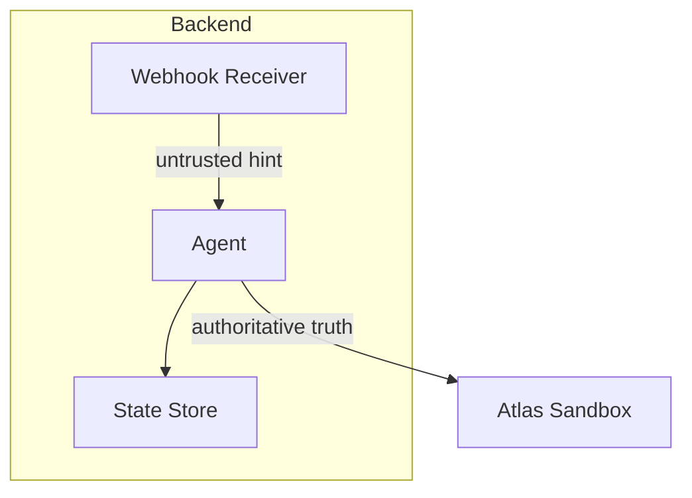
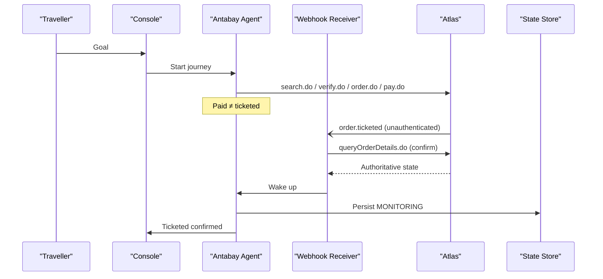
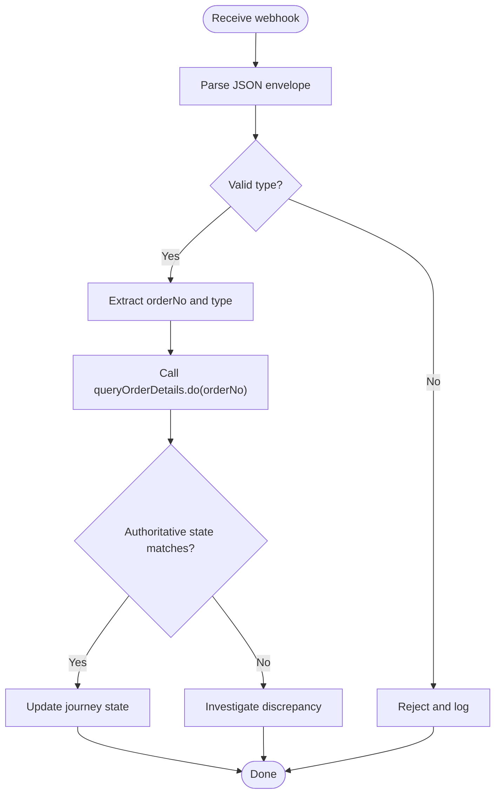
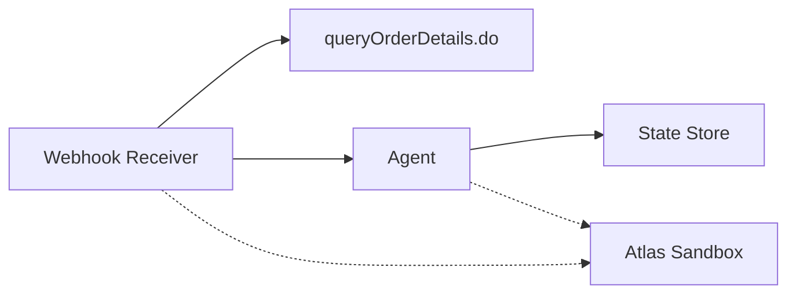

# Webhook Integration

<cite>
**Referenced Files in This Document**
- [architecture.md](file://.antabay/architecture.md)
- [specs.md](file://.antabay/specs.md)
- [atlas-capability-map.md](file://.antabay/atlas-capability-map.md)
- [webhook_order_ticketed.json](file://fixtures/atlas/webhook_order_ticketed.json)
</cite>

## Table of Contents
1. [Introduction](#introduction)
2. [Project Structure](#project-structure)
3. [Core Components](#core-components)
4. [Architecture Overview](#architecture-overview)
5. [Detailed Component Analysis](#detailed-component-analysis)
6. [Dependency Analysis](#dependency-analysis)
7. [Performance Considerations](#performance-considerations)
8. [Troubleshooting Guide](#troubleshooting-guide)
9. [Conclusion](#conclusion)
10. [Appendices](#appendices)

## Introduction
This document specifies the untrusted event ingestion pattern for Atlas webhook integration used by Antabay. It explains how webhooks are registered, what events look like, and how to process them safely. The central rule is that webhooks are unauthenticated hints; every claim must be confirmed against the authoritative queryOrderDetails.do call before changing journey state.

The documentation covers:
- Webhook registration via updateWebhookURL.do and account-wide URL management
- Event structure, type field conventions, status semantics (status -1 indicates success), and data payload formats
- Security model and confirmation workflow using queryOrderDetails.do
- Practical examples from the captured webhook fixture for order.ticketed events
- Event routing based on type fields, duplicate handling, ordering guarantees
- Delivery reliability, retry mechanisms, and failure handling
- Testing strategies with simulated webhook injectors and fixture-based validation
- Monitoring approaches for reception, processing latency, and reconciliation accuracy

## Project Structure
The repository contains verified contracts, architecture diagrams, and fixtures that ground this integration:
- Architecture and sequence diagrams define the webhook receiver as part of the backend service and its role in waking the agent after receiving an untrusted hint
- Capability map documents the verified webhook registration endpoint, envelope shape, and security constraints
- Fixture captures a real order.ticketed webhook received from Atlas

**Diagram sources**
- [architecture.md:19-78](file://.antabay/architecture.md#L19-L78)

**Section sources**
- [architecture.md:19-78](file://.antabay/architecture.md#L19-L78)
- [atlas-capability-map.md:315-391](file://.antabay/atlas-capability-map.md#L315-L391)

## Core Components
- Webhook receiver: Accepts POST requests at the configured URL, parses JSON, routes by type, and triggers reconciliation
- Reconciler: Calls queryOrderDetails.do with the orderNo from the webhook to confirm state changes
- Agent wake-up: After reconciliation, the agent resumes processing based on updated journey state
- State store: Persists journey state, audit trail, and reconciliation outcomes

Key behaviors grounded in the verified contract:
- Registration is account-wide via updateWebhookURL.do
- Events arrive without authentication or signatures
- Status -1 denotes a successful event delivery
- Data payloads include orderNo and orderStatus, plus passenger/ticket details when applicable

**Section sources**
- [atlas-capability-map.md:315-391](file://.antabay/atlas-capability-map.md#L315-L391)
- [architecture.md:19-78](file://.antabay/architecture.md#L19-L78)

## Architecture Overview
The system enforces four rules relevant to webhooks:
1. Qwen reasons; policy decides authority; lines never cross
2. Journey state lives outside the agent and is rehydrated on wake-ups
3. Webhooks are untrusted hints; queryOrderDetails.do is the truth
4. Every travel fact shown to the traveller traces to an Atlas response

**Diagram sources**
- [architecture.md:89-148](file://.antabay/architecture.md#L89-L148)

**Section sources**
- [architecture.md:80-86](file://.antabay/architecture.md#L80-L86)
- [architecture.md:89-148](file://.antabay/architecture.md#L89-L148)

## Detailed Component Analysis

### Webhook Registration and Account-Wide URL Management
- Endpoint: POST updateWebhookURL.do
- Request body includes cid and url
- Response indicates operation succeeded
- Registration is account-wide, not per-order; re-register whenever the public URL changes

Operational notes:
- Ensure the URL is publicly reachable and stable during the session
- Use HTTPS and ensure TLS termination is reliable
- Keep credentials separate per environment

**Section sources**
- [atlas-capability-map.md:320-326](file://.antabay/atlas-capability-map.md#L320-L326)

### Event Envelope and Type Field Conventions
- Method: POST
- Content-Type: application/json;charset=UTF-8
- Top-level fields observed:
  - cid: client identifier
  - type: dotted string identifying the event (e.g., order.ticketed)
  - status: -1 for a successful event delivery
  - data: event-specific payload
- For order.ticketed, data includes:
  - orderNo
  - orderStatus (integer in webhook; differs from queryOrderDetails.do which returns strings)
  - paxTicketInfos array with passenger and ticket details

Routing:
- Route on the type field to dispatch handlers
- Future events (e.g., schedule change) will follow the same dotted convention

**Section sources**
- [atlas-capability-map.md:327-378](file://.antabay/atlas-capability-map.md#L327-L378)
- [webhook_order_ticketed.json:1-53](file://fixtures/atlas/webhook_order_ticketed.json#L1-L53)

### Security Model and Confirmation Workflow
- Webhooks are unauthenticated: no signature, HMAC, or shared secret
- Only cid appears in the body, which is not a secret
- Treat every webhook as an untrusted hint
- Confirm claims by calling queryOrderDetails.do with the orderNo from the event
- Update journey state only after authoritative confirmation

**Diagram sources**
- [atlas-capability-map.md:353-378](file://.antabay/atlas-capability-map.md#L353-L378)

**Section sources**
- [atlas-capability-map.md:353-378](file://.antabay/atlas-capability-map.md#L353-L378)

### Practical Example: order.ticketed Processing
Using the captured fixture:
- The webhook arrives with type order.ticketed and status -1
- data.orderNo identifies the order to reconcile
- data.orderStatus is 2 (ticketed) in the webhook; normalize to compare with queryOrderDetails.do responses
- After confirming via queryOrderDetails.do, transition the journey to MONITORING and notify the console

Processing steps:
1. Receive and parse webhook
2. Route on type = order.ticketed
3. Call queryOrderDetails.do with orderNo
4. Confirm ticketNos non-empty and orderStatus consistent
5. Persist state and wake agent

**Section sources**
- [webhook_order_ticketed.json:1-53](file://fixtures/atlas/webhook_order_ticketed.json#L1-L53)
- [atlas-capability-map.md:327-378](file://.antabay/atlas-capability-map.md#L327-L378)

### Duplicate Event Handling and Ordering Guarantees
- Atlas may deliver duplicate events; treat each as idempotent
- Deduplicate by orderNo and event type; ignore repeats after initial reconciliation
- No strict ordering guarantee is documented; design handlers to be order-independent and idempotent
- If multiple events for the same order arrive close together, reconcile once and apply updates deterministically

Best practices:
- Maintain a short-lived deduplication cache keyed by (orderNo, eventType)
- Log all incoming events for audit even if ignored due to duplication
- Avoid relying on arrival order; always read authoritative state

**Section sources**
- [atlas-capability-map.md:353-378](file://.antabay/atlas-capability-map.md#L353-L378)

### Delivery Reliability, Retry Mechanisms, and Failure Handling
- Webhooks are delivered as HTTP POST; failures can occur due to network issues or server errors
- Implement retries with exponential backoff and jitter for transient failures
- On persistent failures, escalate and alert operators
- Do not assume delivery; periodically reconcile active orders using queryOrderDetails.do as a safety net
- Monitor webhook reception metrics and reconciliation accuracy

Recommended policies:
- Max retries with bounded attempts
- Dead-letter queue for failed deliveries
- Periodic reconciliation jobs to catch missed or delayed events

**Section sources**
- [atlas-capability-map.md:315-391](file://.antabay/atlas-capability-map.md#L315-L391)

### Testing Strategies with Simulated Injectors and Fixtures
- Use the captured webhook_order_ticketed.json as a seed for recorded tests
- Build a simulated injector that posts envelopes mirroring the captured shape into the webhook receiver
- Validate:
  - Routing by type field
  - Status semantics (-1 success)
  - Normalization of orderStatus types between webhook and API
  - Idempotent handling of duplicates
  - Correct confirmation via queryOrderDetails.do
- Fixture-driven tests should assert state transitions and audit entries

Testing checklist:
- Happy path: webhook → confirm → MONITORING
- Duplicate webhook: second event ignored after first reconciliation
- Mismatch scenario: webhook says ticketed but API shows otherwise; investigate and do not advance state
- Injector simulation: fire schedule-change-like events and validate impact evaluation

**Section sources**
- [atlas-capability-map.md:387-391](file://.antabay/atlas-capability-map.md#L387-L391)
- [webhook_order_ticketed.json:1-53](file://fixtures/atlas/webhook_order_ticketed.json#L1-L53)

### Monitoring Approaches
Track:
- Webhook reception rate and error rates
- Processing latency from receipt to reconciliation completion
- Reconciliation accuracy: percentage of webhook claims confirmed by queryOrderDetails.do
- Duplicate detection counts
- Reconciliation job coverage for missed events

Alerting:
- Sudden drops in webhook reception
- High reconciliation mismatch rates
- Excessive retries or dead-letter growth
- Stalled journeys lacking recent reconciliation

**Section sources**
- [atlas-capability-map.md:315-391](file://.antabay/atlas-capability-map.md#L315-L391)

## Dependency Analysis
The webhook flow depends on:
- Atlas sandbox endpoints for registration and authoritative queries
- Backend components: webhook receiver, reconciler, agent, state store
- External factors: network reliability, TLS termination, public URL stability

**Diagram sources**
- [architecture.md:19-78](file://.antabay/architecture.md#L19-L78)

**Section sources**
- [architecture.md:19-78](file://.antabay/architecture.md#L19-L78)
- [atlas-capability-map.md:315-391](file://.antabay/atlas-capability-map.md#L315-L391)

## Performance Considerations
- Minimize time between webhook receipt and reconciliation to reduce stale state windows
- Cache recent reconciliation results briefly to avoid redundant calls for duplicates
- Batch periodic reconciliation jobs efficiently to cover missed events
- Monitor and cap outbound calls to respect provider rate limits

[No sources needed since this section provides general guidance]

## Troubleshooting Guide
Common issues and resolutions:
- Webhook not received: verify updateWebhookURL.do registration and public URL reachability
- Incorrect state advancement: ensure confirmation via queryOrderDetails.do before updating
- Duplicate handling failures: implement idempotent logic keyed by orderNo and event type
- Latency spikes: optimize reconciliation calls and add caching for duplicates
- Mismatch between webhook and API: investigate discrepancies, log full envelopes, and avoid trusting webhook alone

Validation steps:
- Replay captured webhook fixture through the receiver
- Assert correct routing, normalization, and confirmation
- Check audit trail for reconciliation outcomes

**Section sources**
- [atlas-capability-map.md:315-391](file://.antabay/atlas-capability-map.md#L315-L391)
- [webhook_order_ticketed.json:1-53](file://fixtures/atlas/webhook_order_ticketed.json#L1-L53)

## Conclusion
The untrusted event ingestion pattern ensures robust, secure processing of Atlas webhooks. By treating webhooks as hints and confirming against queryOrderDetails.do, the system maintains correctness even under unreliable delivery conditions. Registration is account-wide, events are routed by type, and idempotent handling prevents duplication pitfalls. With thorough testing using fixtures and injectors, plus comprehensive monitoring, the integration remains reliable and auditable.

[No sources needed since this section summarizes without analyzing specific files]

## Appendices

### Appendix A: Webhook Envelope Reference
- Method: POST
- Content-Type: application/json;charset=UTF-8
- Fields:
  - cid: client identifier
  - type: event type (e.g., order.ticketed)
  - status: -1 for successful event
  - data: event-specific payload including orderNo and orderStatus

**Section sources**
- [atlas-capability-map.md:327-378](file://.antabay/atlas-capability-map.md#L327-L378)
- [webhook_order_ticketed.json:1-53](file://fixtures/atlas/webhook_order_ticketed.json#L1-L53)

### Appendix B: Registration Endpoint
- Endpoint: updateWebhookURL.do
- Request: { cid, url }
- Response: operation succeeded
- Scope: account-wide; re-register when URL changes

**Section sources**
- [atlas-capability-map.md:320-326](file://.antabay/atlas-capability-map.md#L320-L326)