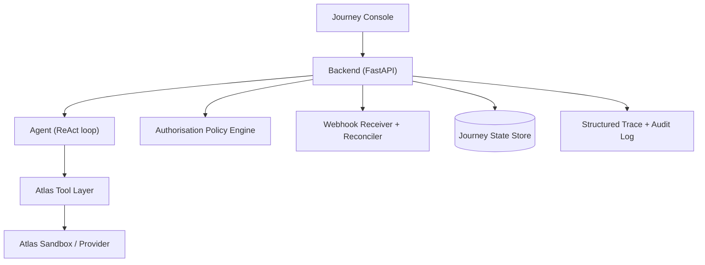
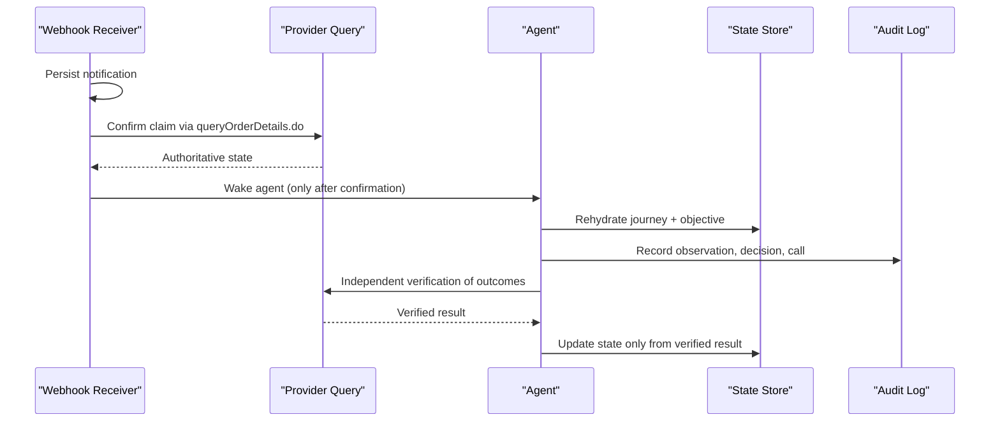
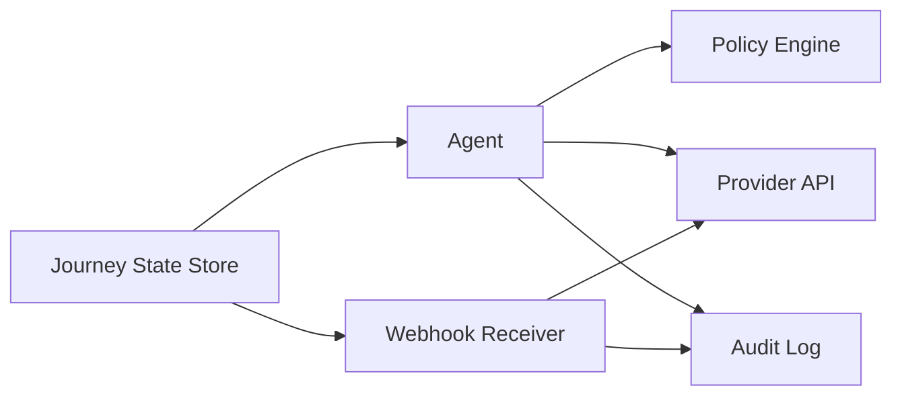

# Backup and Recovery

<cite>
**Referenced Files in This Document**
- [architecture.md](file://.antabay/architecture.md)
- [specs.md](file://.antabay/specs.md)
- [atlas-capability-map.md](file://.antabay/atlas-capability-map.md)
</cite>

## Table of Contents
1. [Introduction](#introduction)
2. [Project Structure](#project-structure)
3. [Core Components](#core-components)
4. [Architecture Overview](#architecture-overview)
5. [Detailed Component Analysis](#detailed-component-analysis)
6. [Dependency Analysis](#dependency-analysis)
7. [Performance Considerations](#performance-considerations)
8. [Troubleshooting Guide](#troubleshooting-guide)
9. [Conclusion](#conclusion)
10. [Appendices](#appendices)

## Introduction
This document defines backup and recovery procedures for Antabay focused on data protection and disaster recovery. It covers:
- What to back up: journey state persistence, audit trails, configuration, and external identifiers.
- How to back up: full and incremental strategies aligned with the system’s durable storage and append-only audit model.
- Retention policies by data type: active journeys, completed bookings, and historical audit logs.
- Disaster recovery planning: RTO/RPO definitions tailored to Antabay’s three-clock booking lifecycle and webhook-driven monitoring.
- Verification and restore testing: integrity checks, replay of event streams, and reconciliation against the provider.
- Handling failures: corruption, partial failures, and complete outages.
- Cloud/off-site/cross-region strategies: replication and DR site readiness.
- Step-by-step recovery playbooks for database corruption, service unavailability, and data loss scenarios.

The guidance is grounded in Antabay’s architecture and specifications, which define a FastAPI backend, an agent with a ReAct loop, a deterministic authorisation policy engine, a webhook receiver/reconciler, structured trace/audit logging, and a durable journey state store.

**Section sources**
- [architecture.md:19-78](file://.antabay/architecture.md#L19-L78)
- [specs.md:429-531](file://.antabay/specs.md#L429-L531)
- [specs.md:798-919](file://.antabay/specs.md#L798-L919)
- [specs.md:1396-1478](file://.antabay/specs.md#L1396-L1478)

## Project Structure
Antabay’s design centers around:
- A long-lived backend process (FastAPI) hosting the agent, policy engine, webhook receiver, and disruption injector.
- A durable journey state store that persists objectives, orders, clocks, audit trail, and authorisations.
- Structured trace and audit logs capturing every external call, decision, and approval.
- An Atlas tool layer integrating with the travel provider API.

**Diagram sources**
- [architecture.md:19-78](file://.antabay/architecture.md#L19-L78)

**Section sources**
- [architecture.md:19-78](file://.antabay/architecture.md#L19-L78)

## Core Components
For backup and recovery, the following components are critical:

- Journey state store: Holds objective, orders, clocks, audit trail, and authorisations. Must be durable so journeys can be fully reconstructed after process termination.
- Audit trail: Append-only log of observations, decisions, external calls, and authorisations with timestamps.
- Webhook receiver and reconciler: Persists inbound notifications before acting; reconciles claims against provider queries; tolerates duplicates; periodically reconciles active journeys.
- Agent and policy engine: Reasoning and deterministic authorisation decisions; must rehydrate from durable storage on wake-up.
- Structured trace and audit log: Captures every external call outcome and elapsed time; recorded event streams are replayable and usable as fixtures.

Backup scope should include:
- All journey records and their current states.
- All append-only audit logs and recorded event streams.
- Configuration and environment settings used at runtime.
- External identifiers and their TTL metadata (offer/session/ticketing deadlines).

**Section sources**
- [specs.md:429-531](file://.antabay/specs.md#L429-L531)
- [specs.md:798-919](file://.antabay/specs.md#L798-L919)
- [specs.md:1396-1478](file://.antabay/specs.md#L1396-L1478)
- [architecture.md:19-78](file://.antabay/architecture.md#L19-L78)

## Architecture Overview
Antabay’s durability model ensures continuity across disruptions:
- The agent rehydrates journey state from durable storage on each wake-up.
- Every state-changing action is followed by independent verification via provider queries.
- Webhooks are treated as untrusted hints; truth is established through authoritative queries.
- The journey state machine tracks three clocks (offer expireTime, sessionId, tktLimitTime), each governing transitions and expiry behavior.

**Diagram sources**
- [specs.md:1396-1478](file://.antabay/specs.md#L1396-L1478)
- [specs.md:1173-1244](file://.antabay/specs.md#L1173-L1244)
- [architecture.md:152-208](file://.antabay/architecture.md#L152-L208)

**Section sources**
- [specs.md:1173-1244](file://.antabay/specs.md#L1173-L1244)
- [specs.md:1396-1478](file://.antabay/specs.md#L1396-L1478)
- [architecture.md:152-208](file://.antabay/architecture.md#L152-L208)

## Detailed Component Analysis

### Journey State Persistence
- Requirements:
  - Create a durable journey record upon confirmation.
  - Maintain defined state transitions and persist state such that journeys can be fully reconstructed after process termination.
  - Track externally issued identifiers with issue and staleness times.
  - Maintain an append-only audit trail per journey with timestamps.
  - Expose current state, objective, and audit trail for display.

- Backup strategy:
  - Full backups: Periodic snapshots of the entire journey state store and audit logs.
  - Incremental backups: Continuous or frequent capture of new audit entries and state changes since last snapshot.
  - Identifier TTL metadata: Include offer expireTime, sessionId, and tktLimitTime to preserve freshness windows during restore.

- Restore considerations:
  - On restart, rehydrate all journeys from durable storage.
  - Validate identifier TTLs and reset expired offers/sessions to search state.
  - Replay recorded event streams to reconstruct recent activity if needed.

**Section sources**
- [specs.md:429-531](file://.antabay/specs.md#L429-L531)
- [specs.md:798-919](file://.antabay/specs.md#L798-L919)
- [atlas-capability-map.md:304-313](file://.antabay/atlas-capability-map.md#L304-L313)

### Audit Trails and Recorded Event Streams
- Requirements:
  - Emit observable events for every external call, decision, and authorisation request.
  - Record complete event stream to durable storage.
  - Support replay of recorded streams without contacting external services.
  - Use recorded streams as fixtures for tests.

- Backup strategy:
  - Treat event streams as immutable append-only datasets.
  - Back up both live streams and archived recordings.
  - Ensure checksums and integrity hashes for replay fidelity.

- Restore considerations:
  - Replay streams to rebuild console state and verify consistency.
  - Cross-check replayed events against provider queries where applicable.

**Section sources**
- [specs.md:798-919](file://.antabay/specs.md#L798-L919)

### Webhook Receiver and Reconciler
- Requirements:
  - Accept inbound notifications and acknowledge promptly.
  - Persist every inbound notification in full before acting.
  - Treat notifications as untrusted assertions; confirm claims against provider interface.
  - Route on declared event type; normalise differing field types.
  - Associate notifications with journeys by order reference; discard unknown matches.
  - Tolerate duplicates; reconcile active journeys periodically.
  - Wake agent only after confirmed claims.

- Backup strategy:
  - Back up persisted notifications and reconciliation results.
  - Include duplicate detection keys and routing metadata.

- Restore considerations:
  - Re-run reconciliation against provider to ensure no missed updates.
  - Re-wake agents to resume processing based on latest provider truth.

**Section sources**
- [specs.md:1396-1478](file://.antabay/specs.md#L1396-L1478)
- [atlas-capability-map.md:315-379](file://.antabay/atlas-capability-map.md#L315-L379)

### Post-Action Verification and Truth Reconciliation
- Requirements:
  - Follow every state-changing external call with an independent query.
  - Update journey state only from the verifying query; never from action response alone.
  - Define success conditions per action type; treat presence of ticket numbers as proof of ticketing.
  - Record discrepancies between action responses and observed state.
  - Treat unverifiable outcomes as unresolved; reconcile by query; never repeat uncertain actions.

- Backup strategy:
  - Capture both action requests/responses and subsequent verification queries/results.
  - Preserve discrepancy records for audit and troubleshooting.

- Restore considerations:
  - After restore, re-run verification loops for any unresolved outcomes.
  - Ensure ordering safety: replacement secured before original release during recovery.

**Section sources**
- [specs.md:1173-1244](file://.antabay/specs.md#L1173-L1244)
- [specs.md:1720-1806](file://.antabay/specs.md#L1720-L1806)

### Three Clocks and Expiry Management
- Requirements:
  - Track offer expireTime (pre-verify), sessionId (post-verify, pre-order), and tktLimitTime (post-order, pre-ticket).
  - Each clock governs transitions; expired clocks send journeys back to search.
  - Display remaining time and spent clocks persistently.

- Backup strategy:
  - Persist clock values and computed remaining times alongside journey state.
  - Include provider-reported timestamps and local processing timestamps for drift analysis.

- Restore considerations:
  - Recalculate remaining times using current time and stored timestamps.
  - Expire stale offers/sessions and return affected journeys to appropriate states.

**Section sources**
- [atlas-capability-map.md:304-313](file://.antabay/atlas-capability-map.md#L304-L313)
- [architecture.md:261-279](file://.antabay/architecture.md#L261-L279)

### Disruption Impact Evaluation and Recovery Execution
- Requirements:
  - Reconstruct journey and objective from durable storage on waking.
  - Evaluate change against objective; quantify violations; search alternatives when violated.
  - Verify alternatives before recommendation; express cost relative to current position.
  - Execute recovery only with explicit authorisation; verify alternative immediately before execution.
  - Create and pay for replacement; confirm ticketing independently; cancel original only after replacement confirmed.
  - Record full sequence including authorisation; report final position in terms of objective.

- Backup strategy:
  - Back up impact evaluations, alternative searches, and recovery sequences.
  - Preserve authorisation decisions and rule references.

- Restore considerations:
  - If recovery was interrupted, resume from durable state; re-verify alternatives; avoid repeating uncertain steps.
  - Ensure replacement is secured before releasing original; surface partial success states.

**Section sources**
- [specs.md:1610-1690](file://.antabay/specs.md#L1610-L1690)
- [specs.md:1720-1806](file://.antabay/specs.md#L1720-L1806)

## Dependency Analysis
Key dependencies for backup and recovery:
- Durable storage underpins journey reconstruction and audit replay.
- Provider APIs provide authoritative truth for reconciliation and verification.
- Webhook channel is unauthenticated; must not drive state changes without verification.
- Policy engine decisions are deterministic and auditable; must be preserved for compliance.

**Diagram sources**
- [architecture.md:19-78](file://.antabay/architecture.md#L19-L78)
- [specs.md:1396-1478](file://.antabay/specs.md#L1396-L1478)

**Section sources**
- [architecture.md:19-78](file://.antabay/architecture.md#L19-L78)
- [specs.md:1396-1478](file://.antabay/specs.md#L1396-L1478)

## Performance Considerations
- Frequent small incremental backups of audit logs minimize write amplification and reduce RPO.
- Snapshotting the journey state store periodically reduces restore time (RTO).
- Avoid backing up transient in-memory state; rely on durable storage and append-only logs.
- Use checksums and compression for large event streams to optimize storage and transfer.
- Schedule off-peak backups to reduce contention with live operations.

[No sources needed since this section provides general guidance]

## Troubleshooting Guide
Common issues and mitigations:
- Duplicate notifications: Deduplicate by order reference and event metadata; reconcile against provider.
- Unverifiable outcomes: Mark as unresolved; reconcile by query; do not repeat uncertain actions.
- Stale identifiers: Detect expired clocks; return journeys to search; refresh offers/sessions.
- Webhook delivery gaps: Periodically reconcile active journeys against provider; re-wake agents.
- Partial recovery failures: Surface mixed states (replacement succeeded, cancellation failed); remediate manually if needed.

**Section sources**
- [specs.md:1396-1478](file://.antabay/specs.md#L1396-L1478)
- [specs.md:1173-1244](file://.antabay/specs.md#L1173-L1244)
- [specs.md:1720-1806](file://.antabay/specs.md#L1720-L1806)

## Conclusion
Antabay’s backup and recovery posture is anchored in durable journey state, append-only audit trails, and rigorous reconciliation with provider truth. By implementing full and incremental backups, enforcing retention policies, defining RTO/RPO targets, and validating restores through replay and verification, the system can withstand corruption, partial failures, and outages while preserving traveller objectives and financial integrity.

[No sources needed since this section summarizes without analyzing specific files]

## Appendices

### Data Retention Policies
- Active journeys: Retain until completion plus a grace period for reconciliation and support.
- Completed bookings: Retain for compliance and audit purposes per business policy.
- Historical audit logs: Retain indefinitely or per regulatory requirements; archive cold data separately.
- Recorded event streams: Keep as fixtures and evidence; version and hash for integrity.

[No sources needed since this section provides general guidance]

### Disaster Recovery Planning: RTO and RPO
- RPO targets: Near-zero for audit logs (continuous streaming backups); bounded for journey state snapshots (e.g., hourly/daily).
- RTO targets: Minutes for restoring active journeys from snapshots; hours for full rebuild from archives.
- Prioritize restoring:
  1) Durable state store and audit logs.
  2) Webhook receiver to resume ingestion.
  3) Agent and policy engine to rehydrate and reconcile.
  4) Provider reconciliation to validate truth.

[No sources needed since this section provides general guidance]

### Backup Verification and Restore Testing
- Integrity validation:
  - Checksums/hashes for backups and event streams.
  - Schema validation for journey records and audit entries.
- Restore testing:
  - Replay recorded event streams in isolation.
  - Rehydrate journeys and verify clocks, identifiers, and states.
  - Run reconciliation against provider to confirm truth alignment.
- Failure simulation:
  - Inject duplicate webhooks, missing events, and expired identifiers.
  - Validate deduplication, gap handling, and expiry logic.

**Section sources**
- [specs.md:798-919](file://.antabay/specs.md#L798-L919)
- [specs.md:1396-1478](file://.antabay/specs.md#L1396-L1478)

### Cloud Storage, Off-Site Replication, and Cross-Region DR
- Strategy:
  - Store backups in geographically redundant object storage.
  - Enable cross-region replication for critical datasets (state store snapshots, audit logs).
  - Encrypt backups at rest and in transit; manage keys separately.
- DR site readiness:
  - Maintain runbooks and automated restore scripts.
  - Periodically test failover and recovery end-to-end.
  - Monitor replication lag and alert on delays.

[No sources needed since this section provides general guidance]

### Step-by-Step Recovery Playbooks

#### Database Corruption
1. Isolate corrupted instance; stop writes.
2. Identify last known good snapshot and most recent audit log incrementals.
3. Restore snapshot to clean environment.
4. Apply incremental audit logs to reconstruct recent state.
5. Rehydrate journeys; recalculate clocks and expire stale identifiers.
6. Reconcile active journeys against provider; resolve discrepancies.
7. Resume webhook ingestion; re-wake agents to process pending events.
8. Validate by replaying recorded event streams and running post-action verification loops.

**Section sources**
- [specs.md:429-531](file://.antabay/specs.md#L429-L531)
- [specs.md:1396-1478](file://.antabay/specs.md#L1396-L1478)
- [specs.md:1173-1244](file://.antabay/specs.md#L1173-L1244)

#### Service Unavailability
1. Fail over to standby instance with replicated state and logs.
2. Verify connectivity to provider APIs and webhook endpoints.
3. Rehydrate journeys; check clocks and identifier TTLs.
4. Reconcile active journeys; process backlog of persisted notifications.
5. Resume agent loops; ensure policy engine rules are loaded and deterministic.
6. Validate by replaying event streams and confirming console state.

**Section sources**
- [specs.md:1396-1478](file://.antabay/specs.md#L1396-L1478)
- [specs.md:798-919](file://.antabay/specs.md#L798-L919)

#### Data Loss Situations
1. Locate earliest recoverable snapshot and all subsequent increments.
2. Restore to isolated environment; apply increments sequentially.
3. Rehydrate and reconcile; mark unresolved outcomes for manual review.
4. For lost webhooks, rely on periodic reconciliation and provider queries.
5. Document incidents; update runbooks and retention policies as needed.

**Section sources**
- [specs.md:1396-1478](file://.antabay/specs.md#L1396-L1478)
- [specs.md:1173-1244](file://.antabay/specs.md#L1173-L1244)