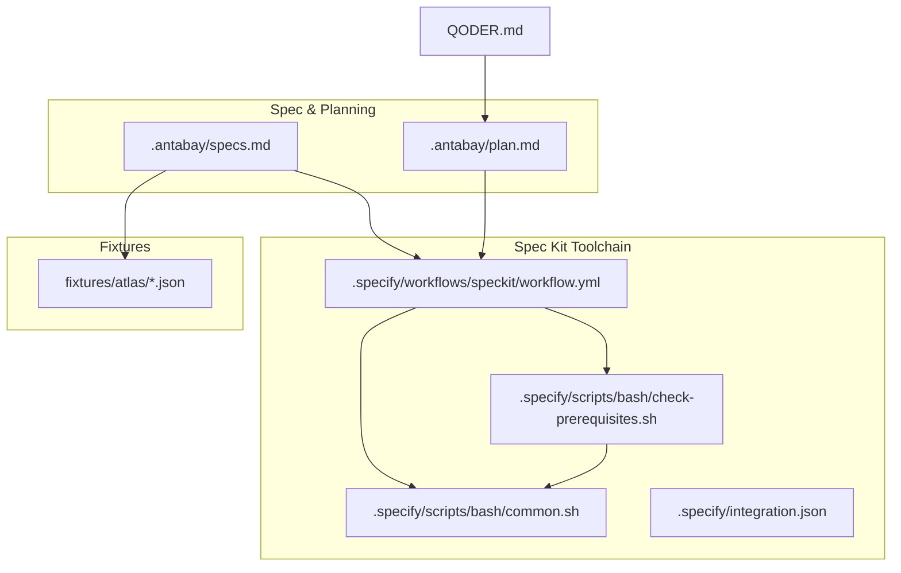
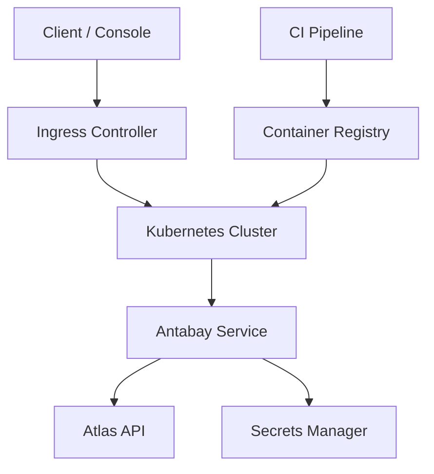
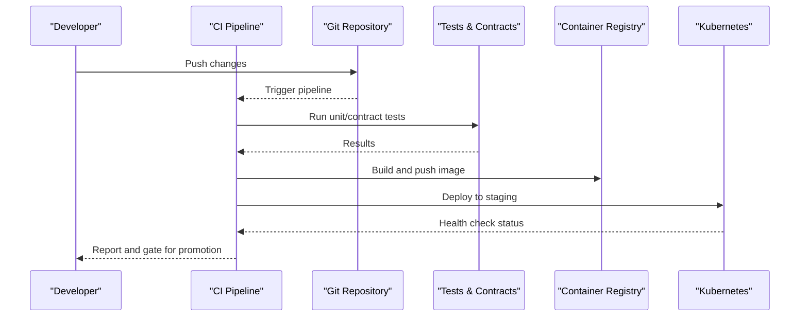
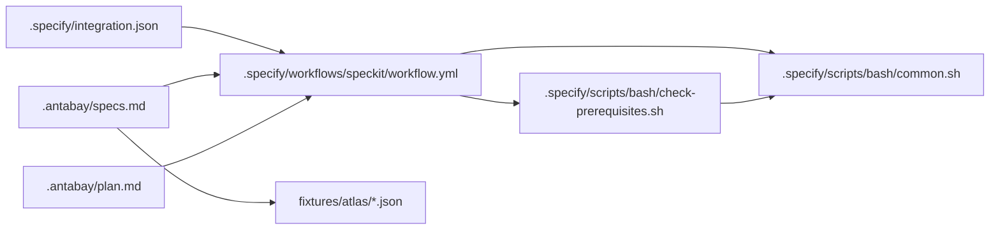

# Deployment Procedures

<cite>
**Referenced Files in This Document**
- [plan.md](file://.antabay/plan.md)
- [specs.md](file://.antabay/specs.md)
- [QODER.md](file://QODER.md)
- [integration.json](file://.specify/integration.json)
- [workflow.yml](file://.specify/workflows/speckit/workflow.yml)
- [check-prerequisites.sh](file://.specify/scripts/bash/check-prerequisites.sh)
- [common.sh](file://.specify/scripts/bash/common.sh)
- [sel_tyo_search.json](file://fixtures/atlas/sel_tyo_search.json)
</cite>

## Table of Contents
1. Introduction
2. Project Structure
3. Core Components
4. Architecture Overview
5. Detailed Component Analysis
6. Dependency Analysis
7. Performance Considerations
8. Troubleshooting Guide
9. Conclusion
10. Appendices

## Introduction
This document provides production-focused deployment procedures for Antabay, covering containerization, orchestration, CI/CD automation, release strategies, health probes, environment promotion, and operational runbooks. It is grounded in the repository’s current artifacts: a Spec-Driven Development (SDD) workflow, environment configuration patterns, and external integration contracts. Where implementation details are not present in the codebase, this document prescribes safe, standard practices aligned with the project’s existing structure and constraints.

## Project Structure
Antabay currently includes:
- Specification and planning documents under .antabay that define capabilities, scenarios, and execution order.
- A Spec Kit toolchain under .specify that orchestrates specify → plan → tasks → implement with review gates and prerequisite checks.
- Fixtures under fixtures/atlas that capture real provider responses used by tests and demos.
- Minimal root-level guidance via QODER.md pointing to the plan for technology and process context.

**Diagram sources**
- [specs.md:1-120](file://.antabay/specs.md#L1-L120)
- [plan.md:1-120](file://.antabay/plan.md#L1-L120)
- [workflow.yml:1-78](file://.specify/workflows/speckit/workflow.yml#L1-L78)
- [check-prerequisites.sh:1-190](file://.specify/scripts/bash/check-prerequisites.sh#L1-L190)
- [common.sh:1-200](file://.specify/scripts/bash/common.sh#L1-L200)
- [integration.json:1-16](file://.specify/integration.json#L1-L16)
- [sel_tyo_search.json:1-120](file://fixtures/atlas/sel_tyo_search.json#L1-L120)

**Section sources**
- [specs.md:1-120](file://.antabay/specs.md#L1-L120)
- [plan.md:1-120](file://.antabay/plan.md#L1-L120)
- [QODER.md:1-5](file://QODER.md#L1-L5)
- [integration.json:1-16](file://.specify/integration.json#L1-L16)
- [workflow.yml:1-78](file://.specify/workflows/speckit/workflow.yml#L1-L78)
- [check-prerequisites.sh:1-190](file://.specify/scripts/bash/check-prerequisites.sh#L1-L190)
- [common.sh:1-200](file://.specify/scripts/bash/common.sh#L1-L200)
- [sel_tyo_search.json:1-120](file://fixtures/atlas/sel_tyo_search.json#L1-L120)

## Core Components
- Spec-driven development pipeline: The workflow enforces a gated cycle from specification through implementation, ensuring quality and traceability before any build or deploy.
- Prerequisite validation: Scripts verify required files and feature context before proceeding, preventing accidental deployments without proper planning artifacts.
- External contract governance: Specifications emphasize a verified contract with the Atlas provider, including typed shapes, error classification, and call budgets.
- Environment configuration: Example environment variables demonstrate how secrets and endpoints are managed at setup time.

These components form the foundation for reliable, repeatable releases.

**Section sources**
- [workflow.yml:1-78](file://.specify/workflows/speckit/workflow.yml#L1-L78)
- [check-prerequisites.sh:1-190](file://.specify/scripts/bash/check-prerequisites.sh#L1-L190)
- [specs.md:300-400](file://.antabay/specs.md#L300-L400)
- [plan.md:40-70](file://.antabay/plan.md#L40-L70)

## Architecture Overview
The current repository focuses on SDD and contract governance. Production deployment will wrap these artifacts into a containerized service orchestrated by Kubernetes. The conceptual architecture below maps to the repository’s intent and future deployment targets.

[No sources needed since this diagram shows conceptual workflow, not actual code structure]

## Detailed Component Analysis

### Containerization Strategy (Docker Multi-Stage Builds)
- Build stages:
  - Stage 1: Install dependencies and run static analysis and tests against specs and fixtures.
  - Stage 2: Produce a minimal runtime image with only necessary binaries and assets.
- Image optimization:
  - Use distroless or slim base images.
  - Enable layer caching for dependency installs.
  - Remove unnecessary metadata and logs from images.
- Security scanning:
  - Integrate vulnerability scanning in CI for each image build.
  - Enforce policies to block images with critical vulnerabilities.
- Artifacts:
  - Tag images with semantic version and commit SHA.
  - Promote images across registries per environment policy.

[No sources needed since this section provides general guidance]

### Orchestration with Kubernetes
- Deployments:
  - Define replicas, resource requests/limits, and rolling update strategy.
  - Pin images to exact tags; avoid mutable tags like latest.
- Services and discovery:
  - Expose internal APIs via ClusterIP services.
  - Use DNS-based service discovery within the cluster.
- Ingress:
  - Configure TLS termination, path-based routing, and rate limiting.
  - Route console and API endpoints appropriately.
- ConfigMaps and Secrets:
  - Store non-sensitive configuration in ConfigMaps.
  - Store sensitive values in Secrets, injected as environment variables or mounted volumes.
- Horizontal Pod Autoscaler:
  - Scale based on CPU/memory or custom metrics.
- Network Policies:
  - Restrict ingress/egress to required endpoints.

[No sources needed since this section provides general guidance]

### CI/CD Pipeline Setup
- Stages:
  - Lint and format checks.
  - Unit and contract tests using fixtures.
  - Static analysis and security scans.
  - Build and push container images.
  - Deploy to staging with automated smoke tests.
  - Promote to production upon approval.
- Gates:
  - Use the Spec Kit workflow gates to require human approval between phases.
  - Enforce branch protection rules and required status checks.
- Artifacts:
  - Publish test reports and scan results.
  - Record deployment manifests and Helm charts if used.

[No sources needed since this diagram shows conceptual workflow, not actual code structure]

### Release Strategies: Blue-Green and Rolling Updates
- Blue-green:
  - Maintain two identical environments (blue/green).
  - Shift traffic after verifying health and smoke tests.
  - Roll back by switching traffic back to the previous stable environment.
- Rolling updates:
  - Gradually replace pods with new versions.
  - Configure maxUnavailable and maxSurge to maintain capacity.
  - Use readiness and liveness probes to control traffic flow.
- Zero-downtime requirements:
  - Ensure backward compatibility for API contracts.
  - Validate database schema migrations before rollout.

[No sources needed since this section provides general guidance]

### Health Checks: Readiness and Liveness Probes
- Readiness probe:
  - Returns success when the application can serve traffic.
  - Used by Kubernetes to add/remove pods from service endpoints.
- Liveness probe:
  - Detects deadlocks or unrecoverable states.
  - Triggers restarts when failing.
- Endpoints:
  - Implement lightweight endpoints for both probes.
  - Include dependency checks (e.g., outbound connectivity) where appropriate.

[No sources needed since this section provides general guidance]

### Environment Promotion and Configuration Management
- Environments:
  - Development, staging, production with isolated configurations.
- Configuration:
  - Use ConfigMaps for non-sensitive settings.
  - Use Secrets for credentials and tokens.
  - Reference environment-specific values via overlays or Helm values.
- Secrets handling:
  - Never commit secrets to version control.
  - Rotate secrets regularly and audit access.
- Promotion workflow:
  - Promote immutable artifacts (images) across environments.
  - Apply environment-specific configs during deployment.

[No sources needed since this section provides general guidance]

### Operational Runbooks
- Scaling events:
  - Identify triggers (CPU, memory, request rate).
  - Adjust autoscaling thresholds and observe impact.
- Maintenance windows:
  - Drain nodes gracefully.
  - Perform rolling updates with controlled surge limits.
- Emergency rollbacks:
  - Revert to last known good image tag.
  - Verify health and restore traffic quickly.
- Incident response:
  - Escalation paths and communication templates.
  - Post-incident reviews and corrective actions.

[No sources needed since this section provides general guidance]

## Dependency Analysis
The repository’s current dependencies center around the Spec Kit toolchain and external provider contracts.

**Diagram sources**
- [workflow.yml:1-78](file://.specify/workflows/speckit/workflow.yml#L1-L78)
- [check-prerequisites.sh:1-190](file://.specify/scripts/bash/check-prerequisites.sh#L1-L190)
- [common.sh:1-200](file://.specify/scripts/bash/common.sh#L1-L200)
- [integration.json:1-16](file://.specify/integration.json#L1-L16)
- [specs.md:1-120](file://.antabay/specs.md#L1-L120)
- [plan.md:1-120](file://.antabay/plan.md#L1-L120)

**Section sources**
- [workflow.yml:1-78](file://.specify/workflows/speckit/workflow.yml#L1-L78)
- [check-prerequisites.sh:1-190](file://.specify/scripts/bash/check-prerequisites.sh#L1-L190)
- [common.sh:1-200](file://.specify/scripts/bash/common.sh#L1-L200)
- [integration.json:1-16](file://.specify/integration.json#L1-L16)
- [specs.md:1-120](file://.antabay/specs.md#L1-L120)
- [plan.md:1-120](file://.antabay/plan.md#L1-L120)

## Performance Considerations
- Image size: Minimize layers and remove build-time artifacts to reduce startup time and attack surface.
- Resource limits: Set appropriate CPU and memory requests/limits to ensure predictable scheduling.
- Concurrency: Tune worker processes and connection pools based on expected load.
- Caching: Leverage CDN and in-memory caches where appropriate to reduce external calls.
- Observability: Instrument metrics, logs, and traces to detect performance regressions early.

[No sources needed since this section provides general guidance]

## Troubleshooting Guide
- Pre-deployment checks:
  - Use the prerequisite script to validate required artifacts exist before building or deploying.
  - Confirm feature context and paths resolved correctly.
- Contract failures:
  - If external provider responses change, update fixtures and re-run contract tests.
  - Ensure typed representations match the verified contract.
- Environment issues:
  - Verify ConfigMaps and Secrets are applied and referenced correctly.
  - Check network policies and DNS resolution for service discovery.
- Health probe failures:
  - Inspect readiness/liveness endpoint behavior and dependencies.
  - Review pod logs and events for errors during startup.

**Section sources**
- [check-prerequisites.sh:114-132](file://.specify/scripts/bash/check-prerequisites.sh#L114-L132)
- [common.sh:154-200](file://.specify/scripts/bash/common.sh#L154-L200)
- [specs.md:300-400](file://.antabay/specs.md#L300-L400)

## Conclusion
Antabay’s repository establishes a strong foundation for reliable delivery through Spec-Driven Development, contract governance, and structured workflows. Production deployment should encapsulate these practices into containerized, orchestrated services with robust CI/CD, health probes, and clear promotion and rollback procedures. By aligning infrastructure-as-code with the existing specifications and fixtures, teams can achieve zero-downtime releases and resilient operations.

[No sources needed since this section summarizes without analyzing specific files]

## Appendices

### Appendix A: Environment Variables and Secrets
- Example environment variables include provider endpoints and keys.
- Store sensitive values in platform secret management and inject them at runtime.
- Separate non-sensitive configuration into ConfigMaps.

**Section sources**
- [plan.md:40-70](file://.antabay/plan.md#L40-L70)
- [specs.md:57-72](file://.antabay/specs.md#L57-L72)

### Appendix B: Fixture Usage in Tests
- Fixtures capture real provider responses used to validate behavior deterministically.
- Keep fixtures redacted and synchronized with live sandbox runs.
- Update fixtures when provider schemas evolve.

**Section sources**
- [sel_tyo_search.json:1-120](file://fixtures/atlas/sel_tyo_search.json#L1-L120)
- [specs.md:103-136](file://.antabay/specs.md#L103-L136)