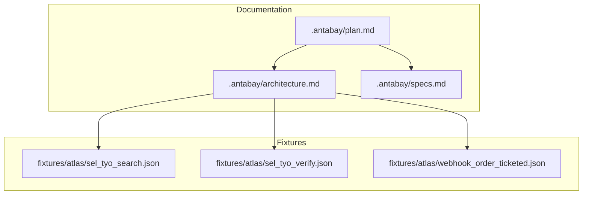
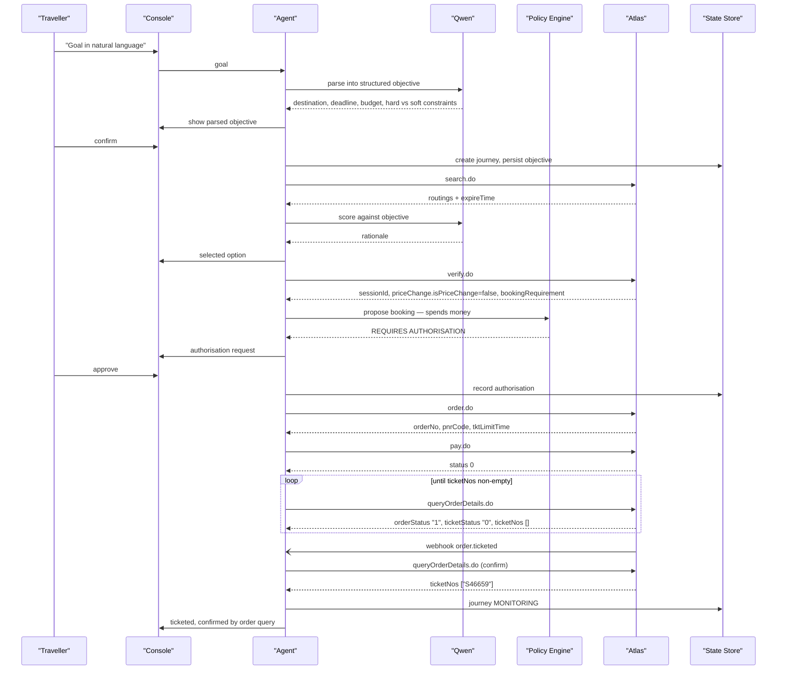
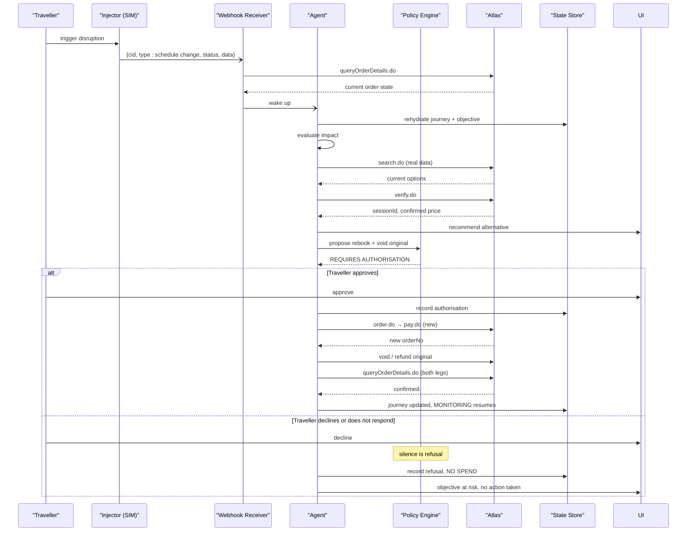
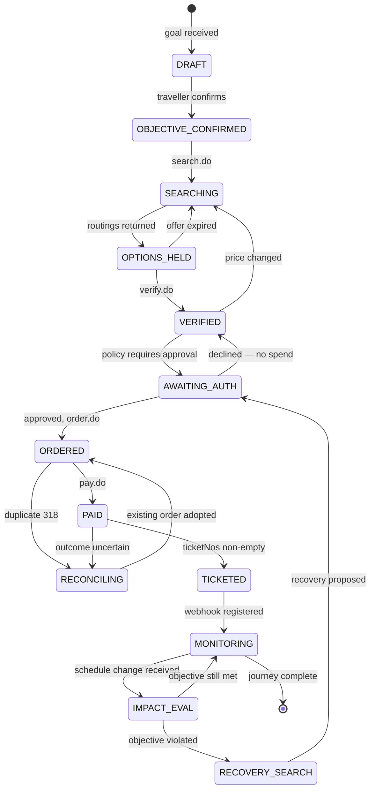

# Deployment and Operations

<cite>
**Referenced Files in This Document**
- [plan.md](file://.antabay/plan.md)
- [architecture.md](file://.antabay/architecture.md)
- [specs.md](file://.antabay/specs.md)
- [sel_tyo_search.json](file://fixtures/atlas/sel_tyo_search.json)
- [sel_tyo_verify.json](file://fixtures/atlas/sel_tyo_verify.json)
- [webhook_order_ticketed.json](file://fixtures/atlas/webhook_order_ticketed.json)
</cite>

## Table of Contents
1. [Introduction](#introduction)
2. [Project Structure](#project-structure)
3. [Core Components](#core-components)
4. [Architecture Overview](#architecture-overview)
5. [Detailed Component Analysis](#detailed-component-analysis)
6. [Dependency Analysis](#dependency-analysis)
7. [Performance Considerations](#performance-considerations)
8. [Troubleshooting Guide](#troubleshooting-guide)
9. [Conclusion](#conclusion)
10. [Appendices](#appendices)

## Introduction
This document provides production-focused deployment, operations, monitoring, and maintenance guidance for Antabay. It synthesizes the system’s architecture, external dependencies, environment configuration, and operational workflows described in the repository to help DevOps engineers deploy, operate, and scale Antabay reliably.

Antabay is a FastAPI-based backend that orchestrates an agent loop over a travel API (Atlas), with a React + Vite console frontend. It uses structured logging and an append-only audit trail, integrates with a reasoning model (Qwen via DashScope), and processes inbound webhooks from Atlas. The system enforces deterministic authorisation policies and maintains durable journey state across process restarts.

## Project Structure
The repository contains:
- Specification and planning documents under .antabay describing the system design, sequence flows, and execution plan.
- Fixtures under fixtures/atlas containing redacted JSON payloads used for testing and replay.
- A top-level QODER.md pointing to the current plan for additional context.



**Diagram sources**
- [plan.md:1-570](file://.antabay/plan.md#L1-L570)
- [architecture.md:1-279](file://.antabay/architecture.md#L1-L279)
- [specs.md:1-800](file://.antabay/specs.md#L1-L800)
- [sel_tyo_search.json:1-800](file://fixtures/atlas/sel_tyo_search.json#L1-L800)
- [sel_tyo_verify.json:1-393](file://fixtures/atlas/sel_tyo_verify.json#L1-L393)
- [webhook_order_ticketed.json:1-53](file://fixtures/atlas/webhook_order_ticketed.json#L1-L53)

**Section sources**
- [plan.md:1-170](file://.antabay/plan.md#L1-L170)
- [architecture.md:19-86](file://.antabay/architecture.md#L19-L86)
- [specs.md:11-168](file://.antabay/specs.md#L11-L168)

## Core Components
- Frontend: Journey Console built with React + Vite, presenting objective, state, trace, clocks, and authorisation gate.
- Backend: Long-lived FastAPI service hosting:
  - Antabay Agent with ReAct loop (Understand → Observe → Reason → Act → Verify → Adapt).
  - Deterministic Authorisation Policy Engine.
  - Webhook Receiver and reconciler.
  - Disruption Injector (simulated events).
  - Structured trace and audit log writer.
- External Integrations:
  - Atlas Sandbox (search.do, verify.do, order.do, pay.do, queryOrderDetails.do, void/refund).
  - Qwen via DashScope (reasoning only).
- State Store: Durable storage for journeys, objectives, orders, clocks, audit trail, and authorisations.

Key operational characteristics:
- Webhooks are untrusted hints; authoritative truth comes from querying the provider.
- Every call, decision, and approval is logged with timestamps.
- Offer/session/ticket clocks are tracked and enforced.

**Section sources**
- [architecture.md:19-86](file://.antabay/architecture.md#L19-L86)
- [architecture.md:89-148](file://.antabay/architecture.md#L89-L148)
- [architecture.md:152-208](file://.antabay/architecture.md#L152-L208)
- [architecture.md:212-279](file://.antabay/architecture.md#L212-L279)

## Architecture Overview
The system follows a clear separation between reasoning, policy decisions, and data persistence. The agent reasons with a language model but never decides on authorisation; the policy engine makes deterministic decisions. All external identifiers are preserved verbatim.

```mermaid
graph TB
T["Traveller"]
UI["Console (React + Vite)"]
BE["Backend (FastAPI)"]
AG["Agent (ReAct loop)"]
POL["Policy Engine"]
DB[("State Store")]
LOG["Structured Trace + Audit Log"]
ATLAS["Atlas Sandbox"]
QW["Qwen (DashScope)"]
T --> UI
UI --> BE
BE --> AG
AG < --> QW
AG --> POL
AG --> DB
AG --> LOG
AG --> ATLAS
ATLAS -.-> BE
```

**Diagram sources**
- [architecture.md:19-86](file://.antabay/architecture.md#L19-L86)

**Section sources**
- [architecture.md:19-86](file://.antabay/architecture.md#L19-L86)

## Detailed Component Analysis

### Environment Configuration
- Service endpoints and credentials are configured via environment variables:
  - ATLAS_BASE_URL, ATLAS_CLIENT_ID, ATLAS_CLIENT_SECRET
  - DASHSCOPE_API_KEY, DASHSCOPE_BASE_URL, QWEN_MODEL
- Secrets must be excluded from version control using .gitignore rules.
- Use regional endpoints appropriate for latency and quota constraints.

Operational notes:
- Maintain separate environments (dev/staging/prod) with distinct credentials.
- Rotate keys regularly and restrict access via least privilege.
- Validate environment presence at startup and fail fast if required variables are missing.

**Section sources**
- [plan.md:40-55](file://.antabay/plan.md#L40-L55)
- [specs.md:57-72](file://.antabay/specs.md#L57-L72)

### Containerization Strategy
Recommended approach:
- Build a minimal container image for the FastAPI backend with pinned Python runtime and dependencies.
- Build a separate static asset image or serve the React + Vite console via a CDN or static host.
- Use multi-stage builds to minimize image size.
- Inject secrets through secure secret management (e.g., Kubernetes Secrets, cloud secret stores) rather than baking into images.

Best practices:
- Run as non-root user inside containers.
- Set resource requests/limits per container.
- Enable health check endpoints for liveness/readiness probes.
- Pin dependency versions and lockfiles for reproducibility.

[No sources needed since this section provides general guidance]

### Orchestration with Kubernetes
Deployment model:
- Deploy the FastAPI backend as a Deployment with horizontal pod autoscaling based on CPU/memory and custom metrics (e.g., request rate, queue depth).
- Expose the console via Ingress with TLS termination.
- Configure Horizontal Pod Autoscaler (HPA) and Vertical Pod Autoscaler (VPA) where applicable.
- Use ConfigMaps for non-sensitive configuration and Secrets for sensitive values.
- Implement PodDisruptionBudgets to maintain availability during voluntary disruptions.

Networking:
- Restrict egress to Atlas and DashScope endpoints via network policies.
- Use service mesh or mTLS if required by organizational policy.

Storage:
- Persist journey state and logs to managed databases and log aggregation services.
- Ensure backups and retention policies align with compliance requirements.

[No sources needed since this section provides general guidance]

### Scaling Considerations
Horizontal scaling:
- Scale pods based on request throughput and processing load.
- Ensure stateless application logic; persist all state to durable storage.
- Use connection pooling and rate limiting for outbound calls to Atlas and DashScope.

Vertical scaling:
- Tune worker threads/processes and database connections.
- Monitor memory usage and GC behavior for long-running processes.

Concurrency:
- Limit concurrent outbound calls to respect provider rate limits and wait instructions.
- Enforce per-journey call budgets to avoid excessive API usage.

[No sources needed since this section provides general guidance]

### Monitoring and Logging
Structured logging:
- Emit structured logs for every external call, decision, and approval with timestamps and correlation IDs.
- Include endpoint names, outcomes, and elapsed times for observability.

Audit trail:
- Maintain an append-only audit log per journey capturing observations, decisions, external calls, and authorisations.
- Ensure immutability and integrity controls for audit records.

Metrics:
- Track request rates, error rates, latency percentiles, webhook ingestion rates, and reconciliation loops.
- Monitor offer/session/ticket clock expirations and re-entry to search flows.

Error tracking:
- Centralize errors with severity levels and contextual metadata.
- Alert on critical failures such as repeated webhook verification mismatches or policy violations.

Health checks:
- Implement readiness/liveness probes for the FastAPI service.
- Surface dependency health (Atlas, DashScope) in readiness checks.

**Section sources**
- [architecture.md:19-86](file://.antabay/architecture.md#L19-L86)
- [architecture.md:89-148](file://.antabay/architecture.md#L89-L148)
- [specs.md:337-387](file://.antabay/specs.md#L337-L387)

### Backup and Restore Procedures
Backups:
- Regularly back up the state store containing journeys, objectives, orders, clocks, audit trail, and authorisations.
- Include structured logs and audit trails according to retention policies.

Restore:
- Test restore procedures periodically to ensure recoverability.
- Validate data integrity post-restore and reconcile any gaps against upstream systems.

Retention:
- Define retention periods aligned with compliance and business needs.
- Archive older records to cost-effective storage while maintaining retrieval capabilities.

[No sources needed since this section provides general guidance]

### Disaster Recovery Planning
- Define RTO/RPO targets and implement cross-region replication for state store and logs.
- Automate failover procedures and validate them in drills.
- Maintain runbooks for common failure scenarios (provider outages, credential rotation, storage corruption).

[No sources needed since this section provides general guidance]

### Capacity Planning and Resource Allocation
- Estimate peak concurrency for agent loops and webhook ingestion.
- Size database connections and cache layers accordingly.
- Plan for bursty traffic around disruption events and recovery searches.

[No sources needed since this section provides general guidance]

### Performance Optimization Techniques
- Cache frequently accessed reference data where safe and consistent.
- Batch or throttle outbound calls to respect provider rate limits and wait instructions.
- Optimize database queries and indexing for journey lookups and audit trail writes.
- Use efficient serialization formats and compress logs where appropriate.

[No sources needed since this section provides general guidance]

### Operational Procedures
Incident response:
- Classify incidents by impact and urgency.
- Follow escalation paths and communicate status updates.
- Postmortems should include timeline, root cause, and remediation steps.

Troubleshooting common issues:
- Webhook verification mismatches: confirm provider state via authoritative query before updating journey state.
- Expired offers/sessions: detect clock expiry and return to search flow.
- Rate-limit rejections: honor wait instructions and enforce call budgets.

System health checks:
- Validate connectivity to Atlas and DashScope.
- Confirm state store accessibility and write capability.
- Ensure webhook receiver is accepting and processing events.

**Section sources**
- [architecture.md:152-208](file://.antabay/architecture.md#L152-L208)
- [architecture.md:212-279](file://.antabay/architecture.md#L212-L279)
- [specs.md:337-387](file://.antabay/specs.md#L337-L387)

### Update and Upgrade Procedures
- Use rolling updates with readiness probes to avoid downtime.
- Perform canary releases to validate changes before full rollout.
- Back up state before upgrades and test rollback procedures.

Rollback strategies:
- Keep previous versions available for quick rollback.
- Validate data schema compatibility across versions.

Version management:
- Tag releases and maintain changelogs.
- Pin dependency versions and use reproducible builds.

[No sources needed since this section provides general guidance]

## Dependency Analysis
External dependencies and integration points:
- Atlas Sandbox: search.do, verify.do, order.do, pay.do, queryOrderDetails.do, void/refund.
- DashScope/Qwen: reasoning model access via configured base URL and API key.
- State Store: durable persistence for journeys and audit trail.
- Structured logging and audit log sinks.

```mermaid
graph LR
AG["Agent"]
POL["Policy Engine"]
DB[("State Store")]
LOG["Logs/Audit"]
ATLAS["Atlas Sandbox"]
QW["Qwen (DashScope)"]
AG --> POL
AG --> DB
AG --> LOG
AG --> ATLAS
AG < --> QW
```

**Diagram sources**
- [architecture.md:19-86](file://.antabay/architecture.md#L19-L86)

**Section sources**
- [architecture.md:19-86](file://.antabay/architecture.md#L19-L86)

## Performance Considerations
- Respect provider rate limits and wait instructions to avoid throttling.
- Enforce per-journey call budgets to control costs and prevent runaway loops.
- Monitor latency and error rates for each external call path.
- Optimize event stream handling for real-time console updates.

[No sources needed since this section provides general guidance]

## Troubleshooting Guide
Common issues and resolutions:
- Webhook untrusted hint: always verify via authoritative query before changing state.
- Duplicate booking rejection: treat as reconcilable and adopt existing order reference.
- Expired clocks: detect offer/session/ticket expiry and revert to search or initiate recovery.
- Policy enforcement: ensure deterministic classification without overriding via configuration.

Operational checks:
- Validate environment variables and secrets.
- Confirm network egress to Atlas and DashScope.
- Inspect structured logs and audit trail for anomalies.

**Section sources**
- [architecture.md:89-148](file://.antabay/architecture.md#L89-L148)
- [architecture.md:152-208](file://.antabay/architecture.md#L152-L208)
- [specs.md:337-387](file://.antabay/specs.md#L337-L387)

## Conclusion
Antabay’s production operation hinges on strict environment configuration, robust external integration handling, deterministic policy enforcement, and comprehensive observability. By following the outlined deployment, monitoring, backup, and upgrade practices, operators can maintain reliability, scalability, and compliance in production environments.

[No sources needed since this section summarizes without analyzing specific files]

## Appendices

### Appendix A: Happy Path Sequence


**Diagram sources**
- [architecture.md:89-148](file://.antabay/architecture.md#L89-L148)

### Appendix B: Disruption and Recovery Sequence


**Diagram sources**
- [architecture.md:152-208](file://.antabay/architecture.md#L152-L208)

### Appendix C: Journey State Machine


**Diagram sources**
- [architecture.md:212-279](file://.antabay/architecture.md#L212-L279)