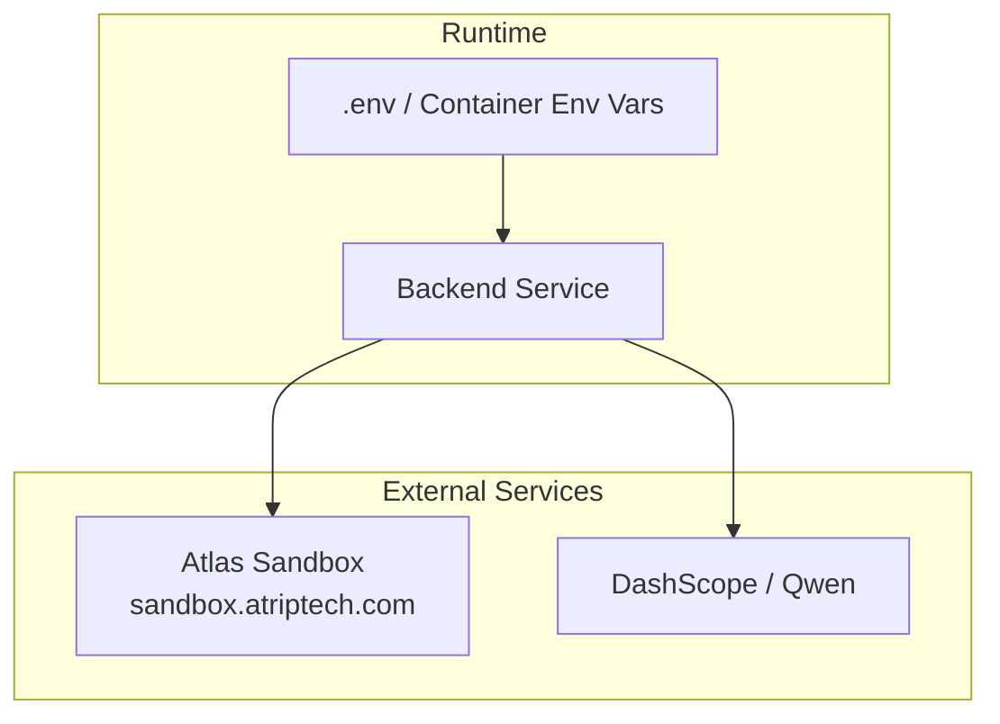
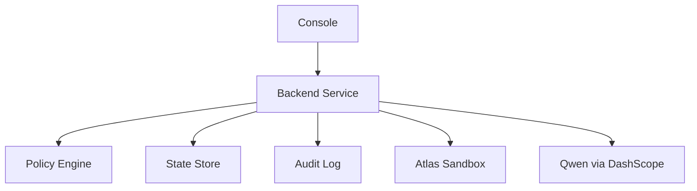
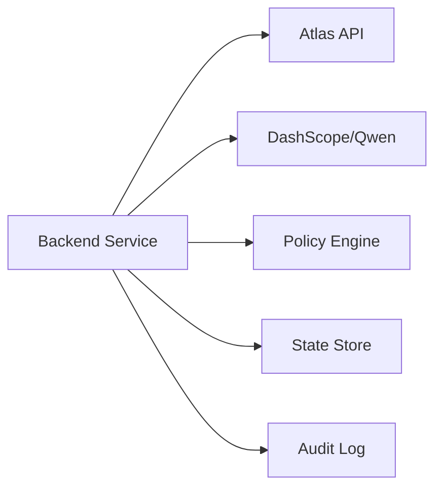

# Environment Configuration

<cite>
**Referenced Files in This Document**
- [plan.md](file://.antabay/plan.md)
- [specs.md](file://.antabay/specs.md)
- [architecture.md](file://.antabay/architecture.md)
- [atlas-capability-map.md](file://.antabay/atlas-capability-map.md)
</cite>

## Table of Contents
1. Introduction
2. Project Structure
3. Core Components
4. Architecture Overview
5. Detailed Component Analysis
6. Dependency Analysis
7. Performance Considerations
8. Troubleshooting Guide
9. Conclusion

## Introduction
This document provides production-focused environment configuration guidance for Antabay. It covers required environment variables, service dependencies (Atlas Travel API and Qwen LLM via DashScope), environment-specific settings, credential management, secret rotation, security considerations, .env templates, container injection patterns, network connectivity requirements, proxy configurations, and firewall rules needed to reach external APIs.

## Project Structure
Antabay’s repository includes planning and specification documents that define the runtime environment and integration points:
- Environment variables are defined in setup instructions within the plan and specs.
- The Atlas sandbox base URL and authentication headers are specified in the capability map.
- The architecture diagram shows where the backend service integrates with Qwen and Atlas.

**Diagram sources**
- [architecture.md:19-78](file://.antabay/architecture.md#L19-L78)
- [atlas-capability-map.md:12-23](file://.antabay/atlas-capability-map.md#L12-L23)

**Section sources**
- [plan.md:40-54](file://.antabay/plan.md#L40-L54)
- [specs.md:57-71](file://.antabay/specs.md#L57-L71)
- [atlas-capability-map.md:12-23](file://.antabay/atlas-capability-map.md#L12-L23)

## Core Components
The following environment variables are required by Antabay at runtime:

- ATLAS_BASE_URL
  - Purpose: Base endpoint for the Atlas Travel API used for search, verify, order, pay, and order query.
  - Security: Treat as a non-secret configuration value; ensure it points to the correct environment (sandbox vs production).
  - Reference: Defined in setup steps and capability map.

- ATLAS_CLIENT_ID
  - Purpose: Client identifier sent in request bodies and/or headers for Atlas authentication.
  - Security: Secret-like; rotate per environment; never commit to source control.

- ATLAS_CLIENT_SECRET
  - Purpose: Secret used alongside client ID to authenticate with Atlas.
  - Security: Highly sensitive; store in secrets manager or secure env injection; rotate regularly.

- DASHSCOPE_API_KEY
  - Purpose: API key for DashScope/Qwen model access used for reasoning tasks.
  - Security: Highly sensitive; restrict scope; rotate on schedule or after incidents.

- DASHSCOPE_BASE_URL
  - Purpose: Endpoint for DashScope compatible-mode API (region-specific).
  - Security: Non-secret; ensure it targets the intended region and environment.

- QWEN_MODEL
  - Purpose: Model identifier used for reasoning calls to DashScope/Qwen.
  - Security: Non-secret; validate allowed models per environment policy.

Environment variable template
- A minimal .env template is provided in the project’s setup instructions. Use it as a baseline and populate values from your secrets store before deployment.

Container environment variable injection
- Inject these variables into your container runtime using your platform’s secret management (e.g., Kubernetes Secrets, Docker secrets, cloud provider secret managers). Do not bake secrets into images.

**Section sources**
- [plan.md:40-54](file://.antabay/plan.md#L40-L54)
- [specs.md:57-71](file://.antabay/specs.md#L57-L71)
- [atlas-capability-map.md:12-23](file://.antabay/atlas-capability-map.md#L12-L23)

## Architecture Overview
Antabay’s backend service integrates with two primary external systems:
- Atlas Travel API for flight search, verification, ordering, payment, and order queries.
- DashScope/Qwen for reasoning tasks.

**Diagram sources**
- [architecture.md:19-78](file://.antabay/architecture.md#L19-L78)

## Detailed Component Analysis

### Atlas Integration Configuration
- Base URL: Set ATLAS_BASE_URL to the Atlas sandbox or production endpoint.
- Authentication: Atlas uses client credentials; ensure both ATLAS_CLIENT_ID and ATLAS_CLIENT_SECRET are present and scoped to the target environment.
- Request encoding: Ensure gzip is enabled as required by the API.
- Currency: Explicitly set currency in requests when required by the API.

Operational notes
- Rate limits: Respect documented QPS/QPM limits and honor retry-after directives.
- Identifier TTLs: Track offer expireTime, sessionId, and tktLimitTime; do not rely solely on documentation-based lifetimes.
- Error handling: Classify known error codes (success, duplicate booking, not found, auth failure) and implement reconciliation flows accordingly.

**Section sources**
- [atlas-capability-map.md:12-23](file://.antabay/atlas-capability-map.md#L12-L23)
- [atlas-capability-map.md:107-130](file://.antabay/atlas-capability-map.md#L107-L130)
- [atlas-capability-map.md:304-313](file://.antabay/atlas-capability-map.md#L304-L313)
- [atlas-capability-map.md:400-415](file://.antabay/atlas-capability-map.md#L400-L415)

### Qwen via DashScope Integration
- API Key: Provide DASHSCOPE_API_KEY to authenticate with DashScope.
- Base URL: Configure DASHSCOPE_BASE_URL to the appropriate regional endpoint.
- Model: Set QWEN_MODEL to the desired model identifier.

Security considerations
- Restrict API key permissions to minimum necessary scopes.
- Monitor usage and set quotas/alerts to prevent unexpected costs.
- Rotate keys periodically and immediately upon suspected compromise.

**Section sources**
- [plan.md:40-54](file://.antabay/plan.md#L40-L54)
- [specs.md:57-71](file://.antabay/specs.md#L57-L71)

### Webhook Receiver and Untrusted Events
- Webhooks arrive unauthenticated; treat them as hints only.
- Always reconcile webhook claims against authoritative Atlas endpoints before updating journey state.
- Register and update webhook URLs securely; re-register when public endpoints change.

**Section sources**
- [atlas-capability-map.md:315-379](file://.antabay/atlas-capability-map.md#L315-L379)

## Dependency Analysis
Antabay depends on:
- Atlas Travel API for all travel operations.
- DashScope/Qwen for reasoning-only tasks.
- Internal components: Policy Engine, State Store, Audit Log.

**Diagram sources**
- [architecture.md:19-78](file://.antabay/architecture.md#L19-L78)

**Section sources**
- [architecture.md:19-78](file://.antabay/architecture.md#L19-L78)

## Performance Considerations
- Honor rate limits and backoff strategies for Atlas endpoints.
- Avoid redundant calls; cache short-lived data only when safe and consistent with TTLs.
- Route reasoning workloads to cost-effective models during off-peak hours where feasible.
- Persist and replay events to avoid unnecessary external calls during recovery.

[No sources needed since this section provides general guidance]

## Troubleshooting Guide
Common issues and resolutions:
- Atlas authentication failures: Verify ATLAS_CLIENT_ID and ATLAS_CLIENT_SECRET match the target environment and have sufficient permissions.
- Rate limiting: Implement retry with respect to retry-after; reduce call frequency; batch requests where possible.
- Expired offers/sessions: Re-check offer expireTime and session validity; refresh search if expired.
- Payment vs ticketing confusion: Confirm ticketing by querying order details until ticket numbers are present; do not assume payment success equals ticketed status.
- Webhook misinterpretation: Do not trust webhook status fields alone; always confirm via authoritative API.

**Section sources**
- [atlas-capability-map.md:107-130](file://.antabay/atlas-capability-map.md#L107-L130)
- [atlas-capability-map.md:304-313](file://.antabay/atlas-capability-map.md#L304-L313)
- [atlas-capability-map.md:315-379](file://.antabay/atlas-capability-map.md#L315-L379)
- [atlas-capability-map.md:400-415](file://.antabay/atlas-capability-map.md#L400-L415)

## Conclusion
Configure Antabay with explicit environment variables for Atlas and DashScope/Qwen, enforce strict credential management, and design integrations around observed API behaviors such as short offer lifetimes, rate limits, and untrusted webhooks. Follow the recommended practices for secret rotation, network access, and monitoring to ensure reliable production deployments.

[No sources needed since this section summarizes without analyzing specific files]