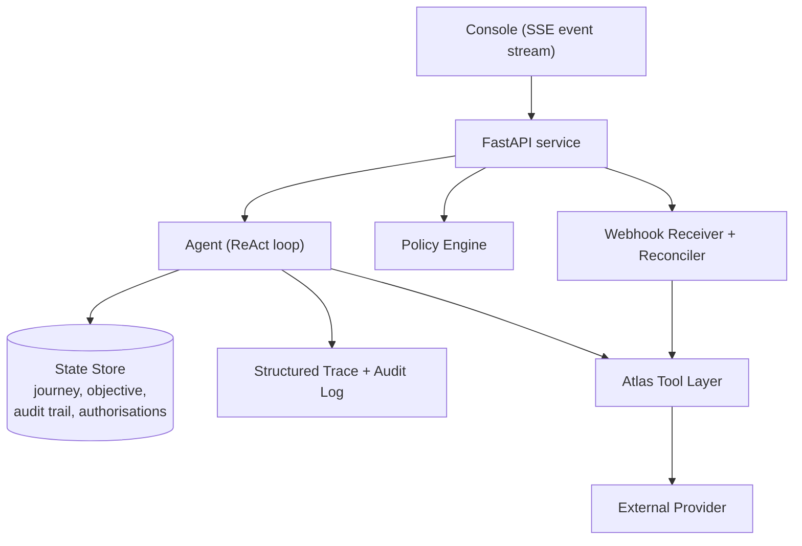
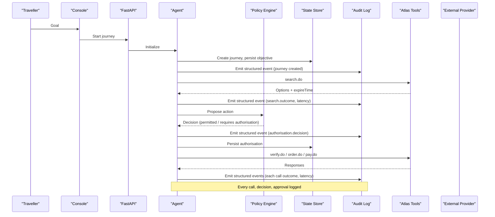
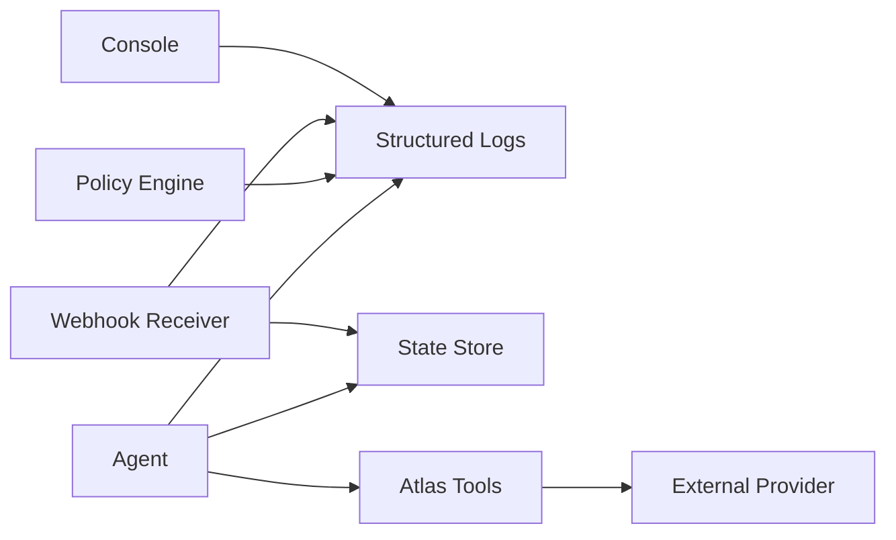
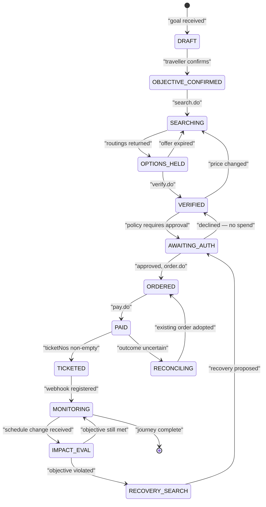

# Monitoring and Logging

<cite>
**Referenced Files in This Document**
- [architecture.md](file://.antabay/architecture.md)
- [specs.md](file://.antabay/specs.md)
- [plan.md](file://.antabay/plan.md)
</cite>

## Table of Contents
1. Introduction
2. Project Structure
3. Core Components
4. Architecture Overview
5. Detailed Component Analysis
6. Dependency Analysis
7. Performance Considerations
8. Troubleshooting Guide
9. Conclusion
10. Appendices

## Introduction
This document defines the production observability strategy for Antabay, focusing on structured logging, audit trails, performance metrics, error tracking, log aggregation, retention, analysis tools, alerting thresholds, notification channels, and incident response procedures. It is grounded in the system’s architecture and specifications that describe journey state, agent behavior, policy decisions, external API interactions, webhook handling, and console trace emission.

The goal is to ensure every journey is observable end-to-end: from objective confirmation through search, verification, booking, payment, ticketing, monitoring, disruption detection, recovery, and completion. Observability must support debugging, compliance auditing, capacity planning, and rapid incident response.

## Project Structure
Antabay’s design centers around a FastAPI backend with an agent loop, a deterministic policy engine, a webhook receiver, and a durable state store. The console streams live events to users. Structured logs and an append-only audit trail are produced alongside the event stream.

**Diagram sources**
- [architecture.md:19-78](file://.antabay/architecture.md#L19-L78)

**Section sources**
- [architecture.md:19-78](file://.antabay/architecture.md#L19-L78)

## Core Components
- Agent loop: Understand → Observe → Reason → Act → Verify → Adapt; emits events and writes to audit log on every call, decision, and approval.
- Policy Engine: Deterministic authorization decisions; gates actions that spend money, void bookings, or breach hard constraints.
- Webhook Receiver: Accepts inbound notifications, treats them as untrusted hints, reconciles via authoritative queries, and wakes the agent.
- State Store: Durable persistence of journeys, objectives, clocks, audit trail, and authorizations.
- Console: Streams live events to users; displays state, clocks, and traces.

Observability requirements derived from specifications include:
- Every external call recorded with endpoint, outcome, and elapsed time.
- Append-only audit trail for observations, decisions, external calls, and authorizations.
- Live event stream for every external call and decision.
- Call budget tracking per journey for rate-limited endpoints.
- Distinction between simulated and provider-originated events.

**Section sources**
- [architecture.md:19-78](file://.antabay/architecture.md#L19-L78)
- [specs.md:303-398](file://.antabay/specs.md#L303-L398)
- [specs.md:429-531](file://.antabay/specs.md#L429-L531)
- [specs.md:565-646](file://.antabay/specs.md#L565-L646)
- [specs.md:675-766](file://.antabay/specs.md#L675-L766)
- [specs.md:798-828](file://.antabay/specs.md#L798-L828)
- [specs.md:437-531](file://.antabay/specs.md#L437-L531)

## Architecture Overview
The observability architecture aligns with the runtime components:

**Diagram sources**
- [architecture.md:89-148](file://.antabay/architecture.md#L89-L148)
- [specs.md:303-398](file://.antabay/specs.md#L303-L398)
- [specs.md:429-531](file://.antabay/specs.md#L429-L531)

## Detailed Component Analysis

### Structured Logging Schema
All logs must be JSON lines with consistent fields to enable reliable parsing, querying, and alerting. Recommended fields:
- journey_id: Unique identifier for the journey context.
- event_type: Semantic event name (e.g., search.request, search.response, verify.request, order.request, pay.request, queryOrderDetails.request, webhook.received, policy.decision, authorisation.request, authorisation.approved, authorisation.declined, journey.state_change).
- timestamp: ISO 8601 UTC timestamp of the event.
- severity: One of DEBUG, INFO, WARN, ERROR, CRITICAL.
- component: Originating subsystem (agent, policy_engine, webhook_receiver, atlas_client, state_store, console).
- endpoint: External endpoint when applicable (e.g., search.do, verify.do, order.do, pay.do, queryOrderDetails.do).
- status_code: HTTP or provider status code when applicable.
- duration_ms: Latency in milliseconds for outbound calls and processing steps.
- request_id: Correlation ID for tracing across components.
- metadata: Free-form object for additional context (e.g., offerId, sessionId, orderNo, route, price, currency, constraint_violated, rule_id).

Guidelines:
- Always include journey_id and event_type for every log line.
- Use severity consistently: DEBUG for verbose internals, INFO for lifecycle milestones, WARN for recoverable issues (rate limits, retries), ERROR for failures requiring attention, CRITICAL for unrecoverable or high-impact failures.
- Redact sensitive data in metadata; never log secrets or PII.
- Ensure timestamps are UTC and monotonically increasing per journey.

**Section sources**
- [specs.md:303-398](file://.antabay/specs.md#L303-L398)
- [specs.md:429-531](file://.antabay/specs.md#L429-L531)
- [specs.md:798-828](file://.antabay/specs.md#L798-L828)

### Audit Trail Maintenance
Requirements:
- Append-only audit trail per journey recording observations, decisions, external calls, and authorizations, each with a timestamp.
- Record outcomes of every authorization request, including refusals.
- Maintain held identifiers with issue and staleness times.
- Present current journey state, objective, and audit trail for display.

Implementation notes:
- Each transition in the journey state machine should produce an audit entry with before/after states, actor (agent or human), reason, and rule references where applicable.
- Authorizations must capture proposed action, cost delta, objective impact, and final decision.
- External calls must record endpoint, request shape summary, response shape summary, status, and duration.

**Section sources**
- [specs.md:429-531](file://.antabay/specs.md#L429-L531)
- [specs.md:565-646](file://.antabay/specs.md#L565-L646)
- [specs.md:675-766](file://.antabay/specs.md#L675-L766)
- [specs.md:798-828](file://.antabay/specs.md#L798-L828)

### Performance Metrics Collection
Key metrics to collect and expose:
- Search latency: End-to-end duration for search.do requests and option scoring.
- Verification latency: Duration for verify.do and price change checks.
- Booking success rates: Ratio of successful orders and payments to attempts; track duplicate reconciliation outcomes.
- Webhook processing times: Time from receipt to reconciliation and agent wake-up.
- Agent reasoning duration: Time spent in reasoning loops per step (understand, observe, reason, act, verify, adapt).
- QueryOrderDetails polling cadence and latency: Frequency and duration during paid-to-ticketed transitions.
- Call budget utilization: Count of calls per journey against declared budgets for rate-limited endpoints.
- Offer/session/tktLimitTime expiry handling: Frequency and timing of clock expirations and re-searches.

Collection approach:
- Instrument each external call with start/end timestamps and compute duration_ms.
- Emit metrics events with event_type such as metric.search_latency, metric.booking_success_rate, metric.webhook_processing_time, metric.agent_reasoning_duration, metric.call_budget_remaining.
- Aggregate at journey and global levels; expose dashboards and SLO targets.

**Section sources**
- [specs.md:303-398](file://.antabay/specs.md#L303-L398)
- [specs.md:565-646](file://.antabay/specs.md#L565-L646)
- [specs.md:675-766](file://.antabay/specs.md#L675-L766)
- [specs.md:798-828](file://.antabay/specs.md#L798-L828)

### Error Tracking Strategies
Error classification:
- Retryable: Transient provider errors; honor wait instructions and do not retry before instructed intervals.
- Reconcilable: Duplicate booking rejections; adopt existing order reference returned by provider.
- Terminal: Invalid inputs, contract violations, or unrecoverable provider states.

Strategies:
- Classify every known external error code into retryable/reconcilable/terminal.
- For retryable errors, implement backoff honoring provider wait instructions; log retries with attempt counts and remaining backoff.
- For reconcilable errors, reconcile state using authoritative queries and update journey accordingly.
- For terminal errors, escalate with detailed context and stop further automated actions.
- Track failure rates per endpoint and per journey; alert on anomalies.

**Section sources**
- [specs.md:303-398](file://.antabay/specs.md#L303-L398)
- [specs.md:273-352](file://.antabay/plan.md#L273-L352)

### Log Aggregation Setup, Retention, and Analysis Tools
Aggregation:
- Ship JSON logs to a centralized log store (e.g., cloud-native logging service or open-source stack).
- Index key fields: journey_id, event_type, component, endpoint, status_code, severity, timestamp.
- Enable correlation via request_id across components.

Retention policies:
- Hot storage (recent logs): 30–90 days for fast querying and alerting.
- Warm storage (historical logs): 6–12 months for trend analysis and compliance.
- Cold storage (archive): Long-term retention for audit and legal requirements; consider compression and lifecycle transitions.

Analysis tools:
- Dashboards for journey completion rates, policy violation frequency, external API error rates, search/verification/booking latencies, webhook processing times, agent reasoning durations.
- Ad-hoc queries filtering by journey_id, endpoint, severity, and time windows.
- Replay capability for console event streams without contacting external services.

**Section sources**
- [specs.md:798-828](file://.antabay/specs.md#L798-L828)
- [specs.md:303-398](file://.antabay/specs.md#L303-L398)

### Key Metrics Examples and Targets
Examples:
- Journey completion rate: Percentage of journeys reaching TICKETED and MONITORING states within expected timeframes.
- Policy violation frequency: Count of hard constraint violations detected during option scoring and recovery evaluation.
- External API error rates: Error rate per endpoint (search.do, verify.do, order.do, pay.do, queryOrderDetails.do) categorized by retryable/reconcilable/terminal.
- Search latency distribution: p50/p95/p99 for search.do responses.
- Booking success rate: Successful order+pay sequences divided by attempts; track duplicate reconciliation outcomes.
- Webhook processing time: Time from webhook receipt to reconciliation and agent wake-up.
- Agent reasoning duration: Average and tail latencies per reasoning step.

Targets:
- Define SLOs per metric (e.g., search p95 < X ms, booking success > Y%, webhook processing < Z ms).
- Monitor SLIs and set alerts based on SLO breaches.

**Section sources**
- [specs.md:565-646](file://.antabay/specs.md#L565-L646)
- [specs.md:675-766](file://.antabay/specs.md#L675-L766)
- [specs.md:798-828](file://.antabay/specs.md#L798-L828)

### Alerting Thresholds, Notification Channels, and Incident Response
Alerting thresholds:
- High external API error rate: e.g., >5% error rate over 5 minutes for critical endpoints.
- Low booking success rate: e.g., <90% success over 1 hour.
- Elevated webhook processing latency: e.g., p95 > threshold for 10 minutes.
- Excessive policy violations: Spikes indicating objective misalignment or provider changes.
- Call budget exhaustion: Approaching or exceeding journey-level call budgets.

Notification channels:
- Primary: Pager-style incident channel (e.g., Ops chat, paging system).
- Secondary: Email digest for non-urgent trends and weekly reports.
- Tertiary: Dashboard annotations for postmortems and audits.

Incident response procedures:
- Triage by severity and component; use journey_id to isolate affected flows.
- Immediate actions: Pause non-critical automation if external provider is degraded; switch to reconciliation mode; notify stakeholders.
- Investigation: Replay event stream for the journey; inspect audit trail; analyze logs and metrics.
- Resolution: Apply fixes (e.g., adjust backoff, handle new error codes); validate via controlled runs.
- Postmortem: Document root cause, timeline, impact, and remediation; update runbooks and alert thresholds.

**Section sources**
- [specs.md:303-398](file://.antabay/specs.md#L303-L398)
- [specs.md:798-828](file://.antabay/specs.md#L798-L828)

## Dependency Analysis
Observability depends on several subsystems:

Coupling and cohesion:
- Agent is central; it emits logs and updates state, coordinating with policy and external tools.
- Policy Engine is decoupled but produces deterministic decisions logged for audit.
- Webhook Receiver is independent but must reconcile with authoritative queries and emit logs.
- Console consumes event streams; does not poll, reducing load and improving responsiveness.

Potential circular dependencies:
- Avoid direct coupling between Console and external providers; rely on event streams and state store.
- Ensure logs and metrics are emitted at boundaries to prevent tight coupling.

External dependencies:
- Atlas provider APIs: search.do, verify.do, order.do, pay.do, queryOrderDetails.do.
- Model provider for reasoning only; no authority decisions.

**Diagram sources**
- [architecture.md:19-78](file://.antabay/architecture.md#L19-L78)

**Section sources**
- [architecture.md:19-78](file://.antabay/architecture.md#L19-L78)

## Performance Considerations
- Minimize synchronous blocking in hot paths; prefer async I/O for external calls and log shipping.
- Batch log emissions where appropriate without losing granularity; preserve per-call latency measurements.
- Use connection pooling and timeouts for external APIs; respect provider rate limits and wait instructions.
- Cache non-sensitive, short-lived data judiciously; avoid caching provider-specific identifiers beyond their validity.
- Profile agent reasoning steps to identify bottlenecks; instrument durations per step.
- Tune log volume: reduce DEBUG noise in production; keep INFO and above for operational visibility.

[No sources needed since this section provides general guidance]

## Troubleshooting Guide
Common issues and diagnostics:
- Missing or inconsistent journey_id: Ensure all components attach journey context to logs and events.
- Stale offers/sessions: Check offer/session/tktLimitTime clocks; expired clocks require re-search.
- Rate limiting: Honor wait instructions; monitor retry counts and backoff; alert on repeated throttling.
- Duplicate bookings: Treat as reconcilable; adopt existing order reference; log reconciliation details.
- Webhook discrepancies: Always reconcile via authoritative queries; treat webhooks as hints.
- Authorization delays: Surface outstanding authorizations; track refusal and silence as refusal.

Diagnostic steps:
- Filter logs by journey_id and event_type to reconstruct flow.
- Inspect audit trail for state transitions and authorizations.
- Compare webhook timestamps with reconciliation results.
- Validate call budget usage and remaining allowances.

**Section sources**
- [specs.md:303-398](file://.antabay/specs.md#L303-L398)
- [specs.md:429-531](file://.antabay/specs.md#L429-L531)
- [specs.md:565-646](file://.antabay/specs.md#L565-L646)
- [specs.md:675-766](file://.antabay/specs.md#L675-L766)
- [specs.md:798-828](file://.antabay/specs.md#L798-L828)

## Conclusion
Antabay’s observability hinges on structured JSON logs, an append-only audit trail, comprehensive metrics, robust error classification, and clear alerting and incident response procedures. By instrumenting every external call, decision, and authorization, and by correlating events via journey_id and request_id, teams can maintain high reliability, comply with audit requirements, and respond swiftly to incidents. Continuous refinement of SLOs, thresholds, and tooling will sustain production confidence as the system evolves.

[No sources needed since this section summarizes without analyzing specific files]

## Appendices

### Journey State Machine and Observability Touchpoints

**Diagram sources**
- [architecture.md:212-257](file://.antabay/architecture.md#L212-L257)

**Section sources**
- [architecture.md:212-257](file://.antabay/architecture.md#L212-L257)