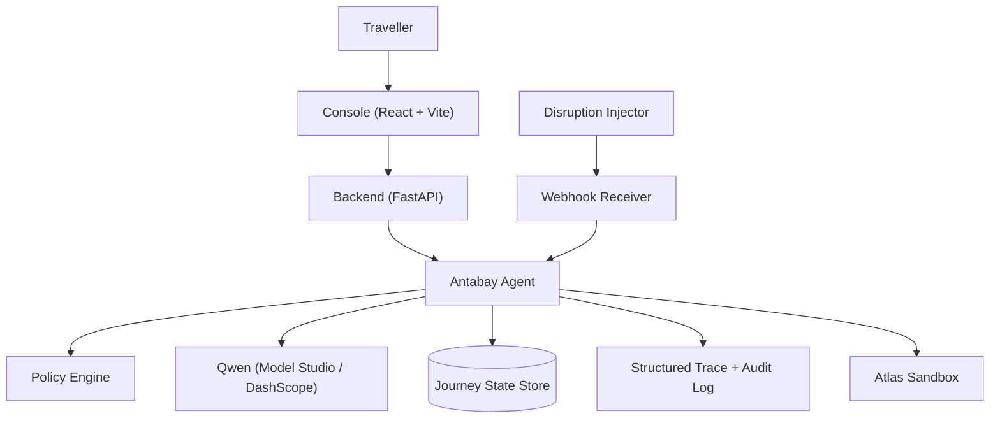
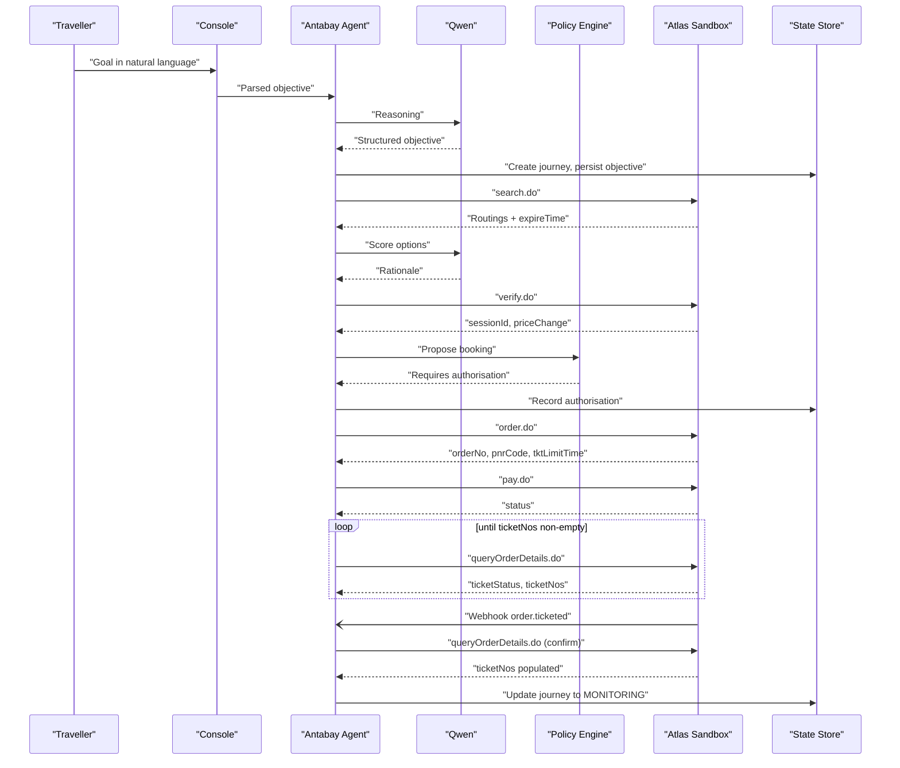
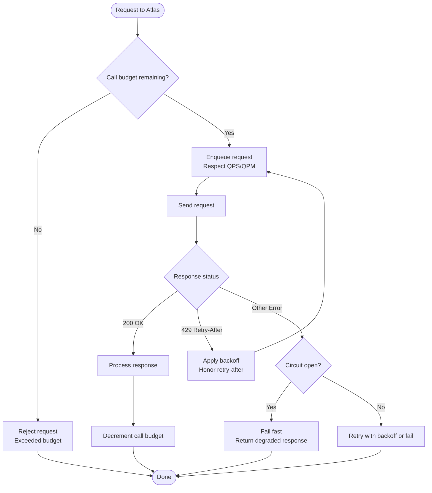
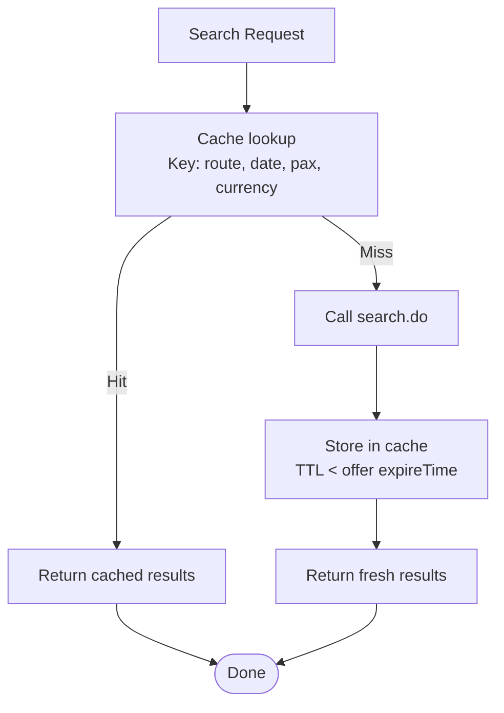
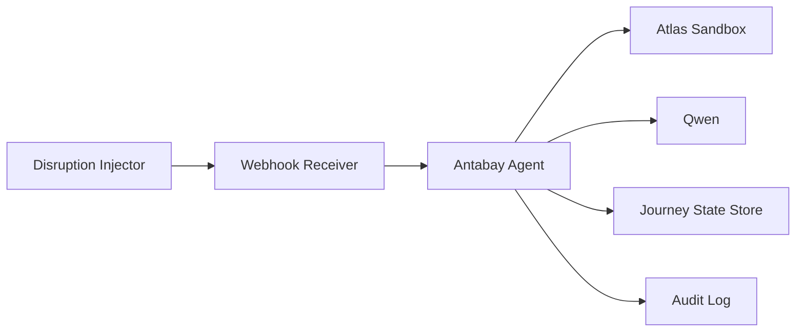

# Scaling and Performance

<cite>
**Referenced Files in This Document**
- [architecture.md](file://.antabay/architecture.md)
- [plan.md](file://.antabay/plan.md)
- [specs.md](file://.antabay/specs.md)
- [atlas-capability-map.md](file://.antabay/atlas-capability-map.md)
- [sel_tyo_search.json](file://fixtures/atlas/sel_tyo_search.json)
- [sel_tyo_verify.json](file://fixtures/atlas/sel_tyo_verify.json)
- [webhook_order_ticketed.json](file://fixtures/atlas/webhook_order_ticketed.json)
</cite>

## Table of Contents
1. Introduction
2. Project Structure
3. Core Components
4. Architecture Overview
5. Detailed Component Analysis
6. Dependency Analysis
7. Performance Considerations
8. Troubleshooting Guide
9. Conclusion
10. Appendices

## Introduction
This document provides production-grade scaling and performance guidance for Antabay, focused on capacity planning and optimization. It covers horizontal scaling, stateless service design, session management, database connection pooling, API rate limiting strategies for the Atlas Travel API (including request queuing, backoff, and circuit breaking), database performance techniques, caching strategies for search results, option scoring, and frequently accessed journey data, as well as performance testing methodologies, load testing scenarios, auto-scaling policies, monitoring, and bottleneck identification.

The guidance is grounded in the verified Atlas contract and observed behavior documented in the repository’s architecture and capability map.

## Project Structure
Antabay is a FastAPI-based backend with an agent that orchestrates journeys against the Atlas Travel API. The system includes:
- A FastAPI service hosting the Antabay Agent, Policy Engine, Webhook Receiver, and Disruption Injector
- An external LLM provider (Qwen via Model Studio/DashScope) used for reasoning only
- A durable Journey State Store (database)
- Structured trace and audit logging
- Integration to the Atlas Sandbox for flight search, verification, ordering, payment, and order queries
- Inbound webhook handling for untrusted hints from Atlas

**Diagram sources**
- [architecture.md:21-78](file://.antabay/architecture.md#L21-L78)

**Section sources**
- [architecture.md:19-78](file://.antabay/architecture.md#L19-L78)

## Core Components
- Antabay Agent: Implements a ReAct loop (Understand → Observe → Reason → Act → Verify → Adapt). It coordinates search, scoring, verification, ordering, payment, and recovery flows while persisting journey state and emitting events.
- Policy Engine: Deterministic authorization gate; decides whether actions require human approval based on rules.
- Webhook Receiver: Accepts inbound notifications (e.g., ticketed), treats them as untrusted hints, and reconciles truth via authoritative API calls.
- Disruption Injector: Simulates schedule changes for demonstration and testing.
- Journey State Store: Durable persistence for objectives, orders, clocks, audit trail, and authorizations.
- Structured Trace + Audit Log: Records every external call, decision, and authorization outcome.

Key operational constraints derived from the verified Atlas contract:
- Offer expiry windows are short and variable; offers may arrive partially aged due to caching.
- Currency mixing hazard exists across fields; conversions must be explicit.
- Rate limits exist per endpoint group; over-limit returns 429 with retry-after.
- Identifier TTLs vary; offer expireTime is authoritative and shorter than higher-level identifiers.
- Payment success does not equal ticketing; ticketing confirmed by queryOrderDetails when ticketNos is non-empty.

**Section sources**
- [architecture.md:21-78](file://.antabay/architecture.md#L21-L78)
- [atlas-capability-map.md:107-130](file://.antabay/atlas-capability-map.md#L107-L130)
- [atlas-capability-map.md:304-313](file://.antabay/atlas-capability-map.md#L304-L313)

## Architecture Overview
The end-to-end flow from goal to ticketed involves multiple steps with strict timing and state transitions. The three clocks govern freshness and validity at each stage.

**Diagram sources**
- [architecture.md:91-148](file://.antabay/architecture.md#L91-L148)
- [atlas-capability-map.md:236-313](file://.antabay/atlas-capability-map.md#L236-L313)

**Section sources**
- [architecture.md:89-148](file://.antabay/architecture.md#L89-L148)
- [atlas-capability-map.md:236-313](file://.antabay/atlas-capability-map.md#L236-L313)

## Detailed Component Analysis

### Horizontal Scaling and Stateless Service Design
- Stateless FastAPI processes:
  - Keep no long-lived in-memory journey state; all journey state resides in the durable store.
  - Use process-local caches sparingly for ephemeral data (e.g., short-lived rate limit tokens) with bounded size and TTL.
  - Scale horizontally by running multiple replicas behind a load balancer; ensure sticky sessions are not required if state is persisted.
- Session management:
  - For web console interactions, use signed cookies or server-side sessions stored in a shared cache (e.g., Redis) to support multi-replica deployments.
  - Ensure session TTL aligns with user activity and security requirements.
- Database connection pooling:
  - Use a connection pool sized per replica to avoid exhausting DB connections under load.
  - Tune pool min/max based on expected concurrent requests and DB capacity.
  - Monitor pool utilization and adjust pool sizes dynamically if possible.

**Section sources**
- [architecture.md:32-42](file://.antabay/architecture.md#L32-L42)
- [specs.md:248-251](file://.antabay/specs.md#L248-L251)

### API Rate Limiting Strategies for Atlas Travel API
Observed limits and behaviors:
- search.do: 10 QPS
- verify.do + getOffers.do: share 60 QPM
- seatAvailability.do + getLuggage.do: share 60 QPM
- Over-limit returns 429 with retry-after; do not retry before instructed interval.

Recommended strategies:
- Request queuing:
  - Implement per-endpoint queues to enforce QPS/QPM limits.
  - Use token bucket or leaky bucket algorithms to smooth bursts.
- Backoff algorithms:
  - On 429 responses, honor retry-after and apply exponential backoff with jitter to reduce thundering herds.
  - Cap maximum retries and escalate failures after thresholds.
- Circuit breaker patterns:
  - Open circuit when error rates exceed thresholds or latency spikes persist.
  - Fail fast to protect downstream systems and degrade gracefully (e.g., return cached or partial results where safe).
- Call budget per journey:
  - Enforce a declared call budget per journey for rate-limited endpoints; stop further calls when budget exhausted.

**Diagram sources**
- [atlas-capability-map.md:119-121](file://.antabay/atlas-capability-map.md#L119-L121)
- [specs.md:335-337](file://.antabay/specs.md#L335-L337)
- [specs.md:370-374](file://.antabay/specs.md#L370-L374)

**Section sources**
- [atlas-capability-map.md:119-121](file://.antabay/atlas-capability-map.md#L119-L121)
- [specs.md:335-337](file://.antabay/specs.md#L335-L337)
- [specs.md:370-374](file://.antabay/specs.md#L370-L374)

### Database Performance Optimization Techniques
- Query optimization:
  - Index frequently filtered columns (journey_id, state, timestamps).
  - Avoid N+1 queries; batch reads/writes where appropriate.
  - Use read replicas for heavy reporting or replay workloads.
- Connection management:
  - Pool sizing: set max connections per replica to match DB capacity and concurrency.
  - Timeout configuration: set statement timeouts to prevent long-running queries from blocking pools.
- Write patterns:
  - Append-only audit trails for durability and replayability.
  - Batch inserts for high-volume logs to reduce overhead.
- Caching layer:
  - Cache hot reads (e.g., policy rules, frequent journey snapshots) with TTLs aligned to consistency needs.

**Section sources**
- [architecture.md:40-42](file://.antabay/architecture.md#L40-L42)
- [specs.md:480-490](file://.antabay/specs.md#L480-L490)

### Caching Strategies
- Flight search results:
  - Cache search responses keyed by origin, destination, date, passenger counts, and currency.
  - Use short TTLs aligned with offer expireTime; invalidate on expiry or price change signals.
- Option scoring calculations:
  - Cache scoring inputs and outputs per journey to avoid recomputation during rehydration.
  - Invalidate on objective updates or new search results.
- Frequently accessed journey data:
  - Cache current journey state and recent audit entries with TTLs based on activity.
  - Use cache invalidation on state transitions (e.g., verified, ordered, paid, ticketed).

**Diagram sources**
- [atlas-capability-map.md:107-113](file://.antabay/atlas-capability-map.md#L107-L113)
- [specs.md:606-611](file://.antabay/specs.md#L606-L611)

**Section sources**
- [atlas-capability-map.md:107-113](file://.antabay/atlas-capability-map.md#L107-L113)
- [specs.md:606-611](file://.antabay/specs.md#L606-L611)

### Resource Allocation Guidelines
- CPU:
  - Size instances based on expected concurrent journeys and LLM reasoning load.
  - Offload heavy reasoning to model providers; keep backend lightweight for orchestration.
- Memory:
  - Allocate sufficient heap for request processing and small caches; monitor GC pressure.
  - Avoid large in-memory structures; prefer streaming and pagination for large payloads.
- Storage:
  - Plan for append-only audit logs; partition by time or journey to manage growth.
  - Use compression for logs and fixtures; archive old data.

Capacity planning considerations:
- Estimate peak concurrent journeys and average duration per journey.
- Derive required throughput for search, verify, order, pay, and query operations.
- Apply headroom (e.g., 20–30%) for traffic spikes and maintenance.

**Section sources**
- [architecture.md:32-42](file://.antabay/architecture.md#L32-L42)
- [specs.md:248-251](file://.antabay/specs.md#L248-L251)

### Auto-Scaling Policies
- Metrics-driven scaling:
  - Scale out on CPU utilization, memory usage, request queue depth, and error rates.
  - Scale in during low utilization to save costs.
- Cooldowns and stabilization:
  - Use cooldown periods to avoid flapping.
  - Stabilize metrics over windows to prevent reactive scaling storms.
- Target tracking:
  - Set target utilization (e.g., 60–70% CPU) for proactive scaling.
  - Adjust based on observed latency and throughput.

**Section sources**
- [specs.md:248-251](file://.antabay/specs.md#L248-L251)

### Monitoring and Bottleneck Identification
- Observability:
  - Emit structured traces for every external call, decision, and authorization outcome.
  - Track latency percentiles, error rates, and throughput per endpoint.
- Alerts:
  - Alert on elevated 429 rates, circuit breaker opens, and slow queries.
  - Monitor DB connection pool saturation and lock contention.
- Profiling:
  - Profile hot paths (search, verify, scoring) to identify bottlenecks.
  - Use distributed tracing to correlate frontend, backend, and external calls.

**Section sources**
- [architecture.md:64-65](file://.antabay/architecture.md#L64-L65)
- [specs.md:385-387](file://.antabay/specs.md#L385-L387)

## Dependency Analysis
External dependencies and integration points:
- Atlas Travel API: search, verify, order, pay, order query, webhooks
- LLM Provider (Qwen): reasoning only; never decides authority
- Database: durable state store for journeys, objectives, audit trail
- Logging: structured trace and audit log

**Diagram sources**
- [architecture.md:21-78](file://.antabay/architecture.md#L21-L78)

**Section sources**
- [architecture.md:21-78](file://.antabay/architecture.md#L21-L78)

## Performance Considerations
- Latency-sensitive paths:
  - Search and verify are critical; optimize network calls and caching.
  - Minimize round trips by batching where safe.
- Throughput:
  - Use asynchronous I/O in FastAPI to handle many concurrent requests.
  - Parallelize independent operations (e.g., scoring vs. policy checks) when safe.
- Cost control:
  - Route models deliberately; use lower tiers for scaffolding and higher tiers only for reasoning-heavy parts.
  - Respect call budgets per journey to avoid excessive API usage.

**Section sources**
- [specs.md:547-550](file://.antabay/specs.md#L547-L550)
- [specs.md:335-337](file://.antabay/specs.md#L335-L337)

## Troubleshooting Guide
Common issues and resolutions:
- Rate limiting:
  - Honor retry-after and implement backoff; avoid retry loops.
  - Monitor 429 rates and adjust queues/backoff parameters.
- Duplicate bookings:
  - Treat 318 as reconcilable; read duplicateOrders and resume from real state.
- Payment vs. ticketing:
  - Do not assume payment success equals ticketing; poll queryOrderDetails until ticketNos is non-empty.
- Webhook reliability:
  - Treat webhooks as untrusted hints; confirm via authoritative API before changing state.

**Section sources**
- [atlas-capability-map.md:119-121](file://.antabay/atlas-capability-map.md#L119-L121)
- [atlas-capability-map.md:402-415](file://.antabay/atlas-capability-map.md#L402-L415)
- [atlas-capability-map.md:285-303](file://.antabay/atlas-capability-map.md#L285-L303)
- [atlas-capability-map.md:353-378](file://.antabay/atlas-capability-map.md#L353-L378)

## Conclusion
Antabay’s architecture emphasizes durable state, deterministic policy, and careful integration with the Atlas Travel API. Production scaling requires stateless services, robust rate limiting, efficient caching, and strong observability. By following the guidelines in this document—horizontal scaling, resource allocation, auto-scaling policies, and performance testing—you can plan capacity and optimize for reliability and cost under varying loads.

## Appendices

### Load Testing Scenarios
- Baseline:
  - Single journey through goal to ticketed; measure latency and throughput.
- Peak:
  - Concurrent journeys simulating peak load; validate rate limiting and circuit breakers.
- Failure injection:
  - Simulate 429 responses, network errors, and webhook delays; verify backoff and reconciliation.
- Recovery:
  - Trigger disruptions and validate recovery flows; ensure state consistency.

**Section sources**
- [specs.md:385-387](file://.antabay/specs.md#L385-L387)
- [specs.md:480-490](file://.antabay/specs.md#L480-L490)

### Capacity Planning Calculations
- Estimate peak concurrent journeys (N) and average duration (D).
- Calculate required throughput for each Atlas endpoint based on journey steps.
- Apply safety margins (e.g., 20–30%) for spikes and maintenance.
- Size connection pools and caches based on N and D; monitor and adjust.

**Section sources**
- [specs.md:248-251](file://.antabay/specs.md#L248-L251)