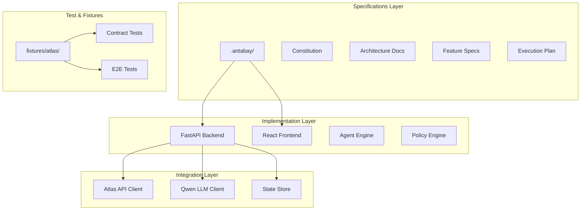
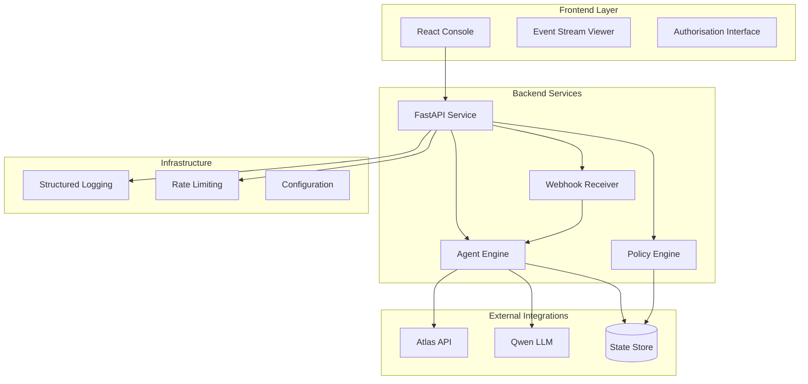
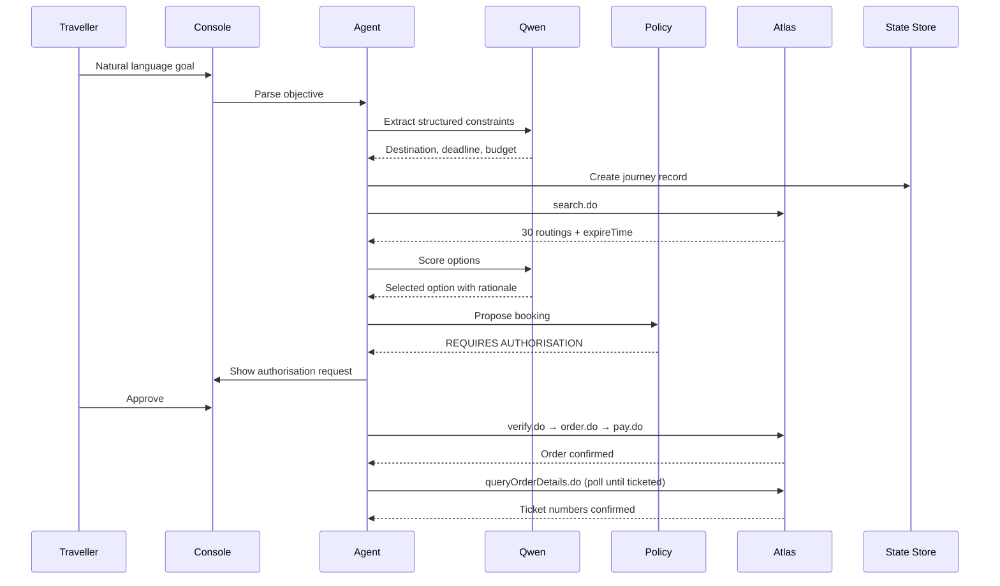
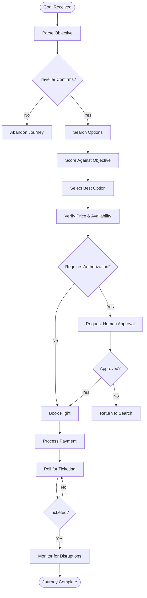
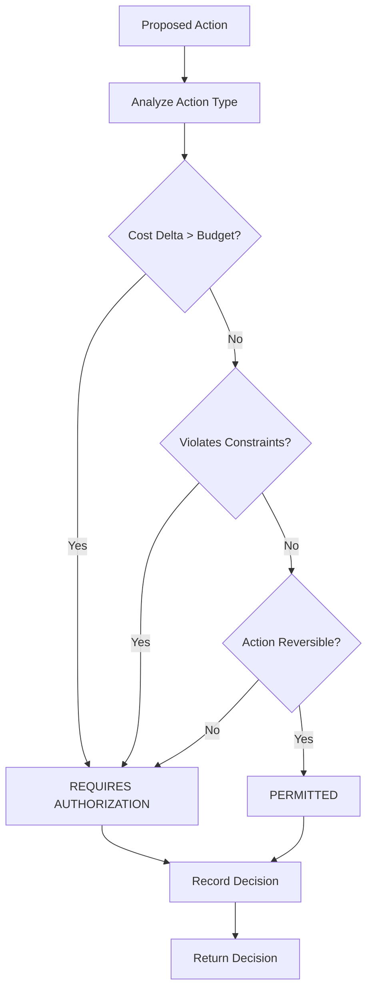
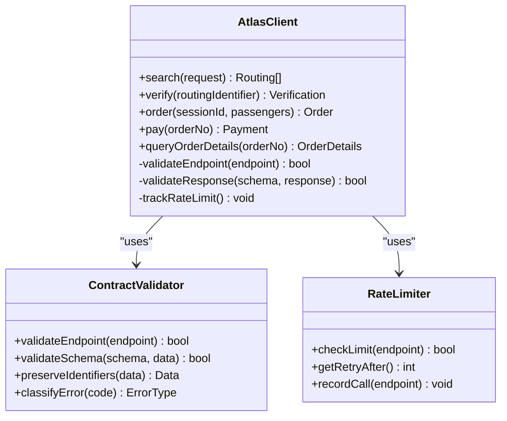
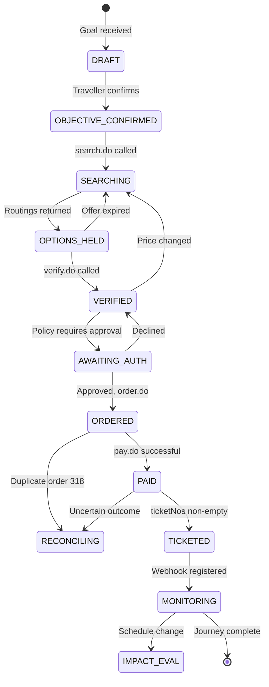
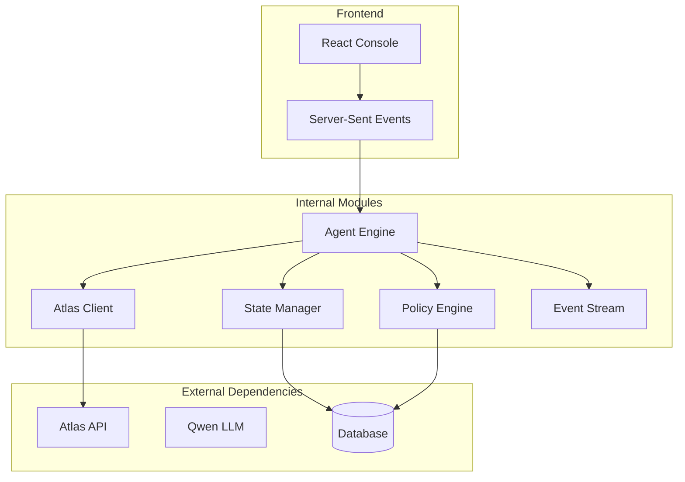

# Code Organization and Standards

<cite>
**Referenced Files in This Document**
- [architecture.md](file://.antabay/architecture.md)
- [constitution.md](file://.antabay/constitution.md)
- [specs.md](file://.antabay/specs.md)
- [plan.md](file://.antabay/plan.md)
- [atlas-capability-map.md](file://.antabay/atlas-capability-map.md)
- [sel_tyo_search.json](file://fixtures/atlas/sel_tyo_search.json)
- [QODER.md](file://QODER.md)
</cite>

## Table of Contents
1. [Introduction](#introduction)
2. [Project Structure](#project-structure)
3. [Core Components](#core-components)
4. [Architecture Overview](#architecture-overview)
5. [Detailed Component Analysis](#detailed-component-analysis)
6. [Dependency Analysis](#dependency-analysis)
7. [Performance Considerations](#performance-considerations)
8. [Troubleshooting Guide](#troubleshooting-guide)
9. [Conclusion](#conclusion)
10. [Appendices](#appendices)

## Introduction

Antabay is an agentic travel guardian system designed to protect traveller objectives across the entire journey lifecycle. The project follows a spec-driven development approach using GitHub Spec Kit and Qoder CLI, with a strong emphasis on truthfulness, verification, and human authorization for financial actions. The system integrates with Atlas API for flight search and booking, uses Qwen LLM for reasoning, and provides a React-based console interface for real-time agent trace visibility.

The project is built around four core principles: **Truth** (all travel facts must come from verified sources), **Verification** (writes are not proof, reads are proof), **Authority** (LLM reasons but policy engine decides), and **Operational Discipline** (state lives outside the agent process).

## Project Structure

The Antabay project follows a spec-driven architecture with clear separation between specifications, implementation, and test fixtures:

**Diagram sources**
- [architecture.md:19-78](file://.antabay/architecture.md#L19-L78)
- [specs.md:33-37](file://.antabay/specs.md#L33-L37)

### Directory Organization

The project is organized into logical layers:

- **`.antabay/`**: Contains all specifications, architecture documents, and execution plans
- **`fixtures/atlas/`**: Verified Atlas API responses used for testing
- **Root level**: Project configuration and tooling files

**Section sources**
- [specs.md:33-37](file://.antabay/specs.md#L33-L37)
- [plan.md:22-23](file://.antabay/plan.md#L22-L23)

## Core Components

### Agent Engine

The Agent Engine implements a custom ReAct loop that orchestrates the entire booking workflow. It follows the pattern: Understand → Observe → Reason → Act → Verify → Adapt. The agent never holds authority over decisions - it reasons about options while the Policy Engine makes determinative decisions.

Key responsibilities:
- Parse natural language objectives into structured constraints
- Coordinate search, scoring, verification, and booking workflows
- Manage three critical clocks: offer expiry, session validity, and ticketing deadline
- Emit real-time events for UI streaming
- Maintain audit trail of all decisions and actions

### Policy Engine

A deterministic decision-making system that evaluates whether actions require human authorization. The policy engine operates independently from the LLM reasoning layer, ensuring that financial decisions cannot be influenced by AI prompts.

Decision criteria include:
- Cost delta analysis against budget constraints
- Constraint violation assessment
- Action reversibility evaluation
- Human authorization requirements

### Atlas Integration Layer

The integration layer provides a strict contract with the Atlas API, preventing any hallucinated endpoints or field access. All external calls are validated against a verified capability map before execution.

Key features:
- Endpoint allowlist enforcement at build time
- Response schema validation
- Identifier preservation (byte-for-byte)
- Rate limit compliance and retry-after handling
- Error classification (retryable, reconcilable, terminal)

### State Management

Journey state is maintained in durable storage, allowing the agent to rehydrate after process restarts. The state machine tracks journey progression through well-defined states with explicit transitions.

State management includes:
- Journey lifecycle tracking (DRAFT → OBJECTIVE_CONFIRMED → SEARCHING → ...)
- External identifier management with TTL tracking
- Audit trail maintenance (append-only)
- Authorisation history recording

**Section sources**
- [architecture.md:32-42](file://.antabay/architecture.md#L32-L42)
- [constitution.md:97-104](file://.antabay/constitution.md#L97-L104)

## Architecture Overview

The Antabay system follows a layered architecture with clear separation of concerns:

**Diagram sources**
- [architecture.md:21-78](file://.antabay/architecture.md#L21-L78)

### System Flow

The happy path from goal to ticketed follows this sequence:

**Diagram sources**
- [architecture.md:91-148](file://.antabay/architecture.md#L91-L148)

## Detailed Component Analysis

### Agent Engine Implementation

The Agent Engine implements a sophisticated state machine that manages the complex workflow of flight booking while maintaining strict adherence to the constitution's principles.

**Diagram sources**
- [architecture.md:214-257](file://.antabay/architecture.md#L214-L257)

### Policy Engine Decision Logic

The Policy Engine uses deterministic rules to evaluate whether actions require human authorization, ensuring that financial decisions cannot be influenced by AI reasoning.

**Diagram sources**
- [constitution.md:64-77](file://.antabay/constitution.md#L64-L77)

### Atlas Integration Contract

The Atlas Integration Layer enforces strict contracts to prevent hallucinated API calls and ensure data integrity.

**Diagram sources**
- [atlas-capability-map.md:25-34](file://.antabay/atlas-capability-map.md#L25-L34)
- [atlas-capability-map.md:400-416](file://.antabay/atlas-capability-map.md#L400-L416)

### State Machine Implementation

The journey state machine ensures that journeys progress through valid states with proper transitions and clock management.

**Diagram sources**
- [architecture.md:214-257](file://.antabay/architecture.md#L214-L257)

## Dependency Analysis

The Antabay system has carefully managed dependencies to ensure reliability and maintainability:

**Diagram sources**
- [architecture.md:21-78](file://.antabay/architecture.md#L21-L78)

### Dependency Management Strategy

1. **External API Isolation**: All external dependencies are wrapped in client classes with strict validation
2. **Configuration Management**: Environment-specific settings isolated in configuration layer
3. **Testing Infrastructure**: Mock clients for external services enable deterministic testing
4. **Version Pinning**: Critical dependencies pinned to specific versions for reproducibility

**Section sources**
- [specs.md:57-71](file://.antabay/specs.md#L57-L71)
- [atlas-capability-map.md:12-24](file://.antabay/atlas-capability-map.md#L12-L24)

## Performance Considerations

### Rate Limiting and Resource Management

The system implements sophisticated rate limiting to respect Atlas API constraints:

- **Search endpoint**: 10 QPS with exponential backoff
- **Verification endpoints**: 60 QPM shared quota
- **Per-journey call budgets**: Prevent resource exhaustion
- **Retry-after handling**: Respect server-side throttling instructions

### Memory and State Management

- **State persistence**: All journey state stored externally for process resilience
- **Memory efficiency**: Large datasets processed in streams rather than loaded entirely
- **Connection pooling**: Database and HTTP connections pooled and reused
- **Garbage collection**: Explicit cleanup of temporary objects and caches

### Optimization Strategies

1. **Parallel Processing**: Independent operations executed concurrently where safe
2. **Caching**: Frequently accessed reference data cached with appropriate TTL
3. **Lazy Loading**: Expensive computations deferred until needed
4. **Batch Operations**: Multiple API calls batched when possible

## Troubleshooting Guide

### Common Issues and Solutions

#### Atlas API Integration Problems

**Issue**: Endpoint not found errors
- **Cause**: Attempting to call unverified endpoints
- **Solution**: Check atlas-capability-map.md for approved endpoints
- **Prevention**: Use contract validation layer

**Issue**: Rate limit exceeded (429 errors)
- **Cause**: Exceeding per-endpoint rate limits
- **Solution**: Implement retry-after logic and reduce call frequency
- **Prevention**: Monitor rate limit usage and implement circuit breakers

#### State Management Issues

**Issue**: Journey state inconsistencies
- **Cause**: Concurrent modifications or failed transactions
- **Solution**: Implement optimistic locking and reconciliation
- **Prevention**: Use atomic operations and proper transaction boundaries

#### Agent Reasoning Problems

**Issue**: Incorrect option selection
- **Cause**: Flawed scoring algorithm or constraint interpretation
- **Solution**: Review policy engine rules and add more test cases
- **Prevention**: Implement explainable AI with detailed rationale logging

### Debugging Tools

1. **Structured Logging**: All operations logged with context metadata
2. **Audit Trail**: Append-only log of all decisions and actions
3. **Trace Streaming**: Real-time event stream for debugging agent behavior
4. **Contract Testing**: Automated validation of external API contracts

**Section sources**
- [constitution.md:102-104](file://.antabay/constitution.md#L102-L104)
- [atlas-capability-map.md:400-416](file://.antabay/atlas-capability-map.md#L400-L416)

## Conclusion

Antabay represents a mature approach to building reliable AI agents for high-stakes domains like travel booking. The project demonstrates several key architectural principles:

1. **Separation of Concerns**: Clear distinction between reasoning (LLM) and decision-making (Policy Engine)
2. **Truth Preservation**: Strict adherence to verified external data sources
3. **Human Oversight**: Deterministic policy gates for financial actions
4. **Resilient Design**: State persistence and graceful degradation
5. **Spec-Driven Development**: Comprehensive specifications guide implementation

The code organization reflects these principles through modular design, clear interfaces, and comprehensive testing infrastructure. While the current repository contains primarily specifications and documentation, the architecture provides a solid foundation for implementing the full system according to the established standards.

The project's emphasis on verification, authorization, and operational discipline makes it suitable for production deployment in environments where reliability and safety are paramount. The spec-driven approach ensures that future implementations will maintain consistency with the established architectural patterns and business requirements.

## Appendices

### A. Development Workflow

The project follows a strict development workflow:

1. **Specification Phase**: Define requirements in Spec Kit format
2. **Planning Phase**: Break down into implementable tasks
3. **Implementation Phase**: Build features incrementally
4. **Testing Phase**: Validate against contracts and acceptance criteria
5. **Review Phase**: Ensure compliance with constitution principles

### B. Naming Conventions

Based on the project structure and specifications:

- **Files**: snake_case for Python modules, kebab-case for JavaScript modules
- **Functions**: descriptive verbs followed by nouns (e.g., `search_flights`, `verify_booking`)
- **Classes**: PascalCase with descriptive names (e.g., `JourneyState`, `PolicyEngine`)
- **Variables**: descriptive lowercase with underscores for compound words
- **Constants**: UPPER_SNAKE_CASE for configuration values

### C. Error Handling Patterns

The project implements consistent error handling:

- **Domain Errors**: Custom exception types for business logic failures
- **Integration Errors**: Wrapped external API errors with context
- **Validation Errors**: Structured error responses with field-level details
- **Recovery Strategies**: Graceful degradation and fallback mechanisms

**Section sources**
- [specs.md:234-249](file://.antabay/specs.md#L234-L249)
- [constitution.md:107-120](file://.antabay/constitution.md#L107-L120)