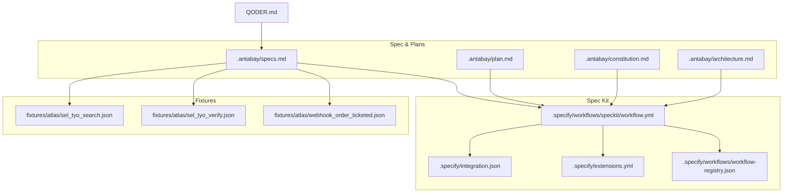
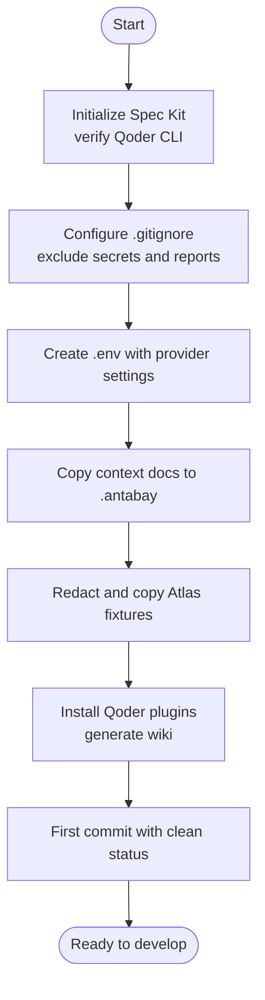
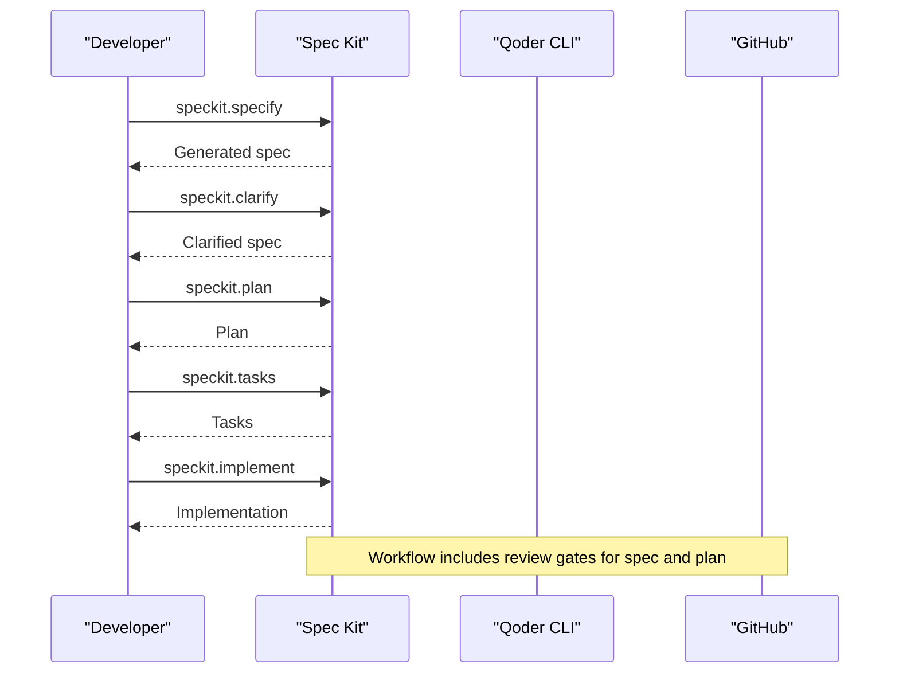
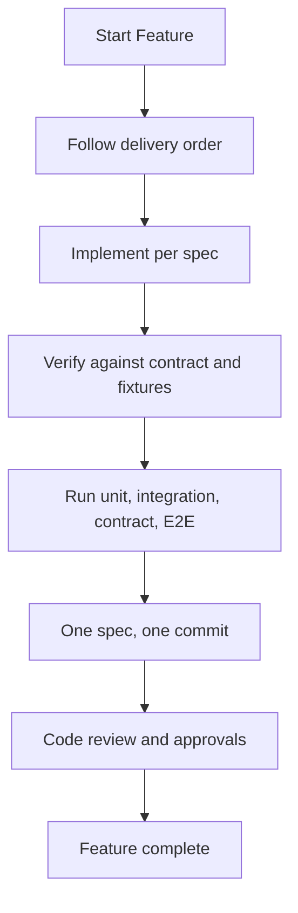
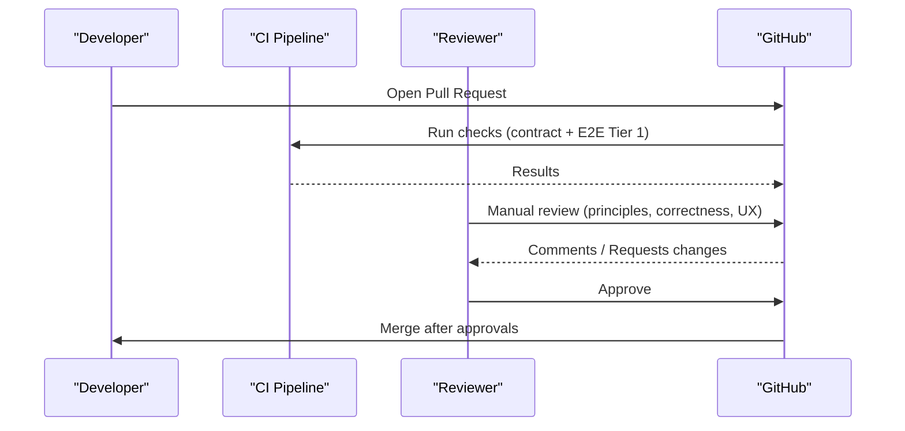
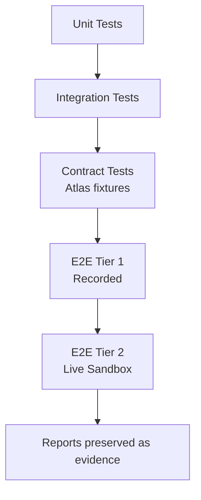
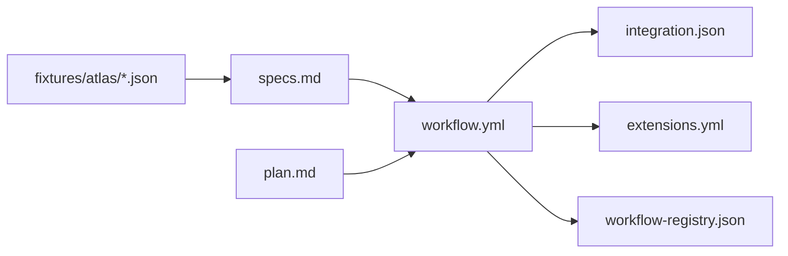

# Contribution Guidelines

<cite>
**Referenced Files in This Document**
- [QODER.md](file://QODER.md)
- [specs.md](file://.antabay/specs.md)
- [plan.md](file://.antabay/plan.md)
- [architecture.md](file://.antabay/architecture.md)
- [constitution.md](file://.antabay/constitution.md)
- [workflow.yml](file://.specify/workflows/speckit/workflow.yml)
- [integration.json](file://.specify/integration.json)
- [extensions.yml](file://.specify/extensions.yml)
- [workflow-registry.json](file://.specify/workflows/workflow-registry.json)
- [sel_tyo_search.json](file://fixtures/atlas/sel_tyo_search.json)
- [sel_tyo_verify.json](file://fixtures/atlas/sel_tyo_verify.json)
- [webhook_order_ticketed.json](file://fixtures/atlas/webhook_order_ticketed.json)
</cite>

## Table of Contents
1. Introduction
2. Project Structure
3. Core Components
4. Architecture Overview
5. Detailed Component Analysis
6. Dependency Analysis
7. Performance Considerations
8. Troubleshooting Guide
9. Conclusion
10. Appendices

## Introduction
This document provides end-to-end contribution guidelines for Antabay, covering environment setup, specification-driven development with Spec Kit and Qoder CLI, implementation standards, code review and automation, testing requirements (unit, integration, contract tests with Atlas fixtures, and end-to-end scenarios), documentation synchronization, security practices, extension guidance, and release/versioning strategy. It is designed for contributors who need to understand both the high-level workflow and the concrete repository artifacts that enforce quality and safety.

## Project Structure
Antabay uses a spec-first approach backed by GitHub Spec Kit and executed via Qoder CLI. The repository contains:
- Specification and execution plans under .antabay
- Spec Kit configuration and workflows under .specify
- Recorded Atlas fixtures under fixtures/atlas
- A top-level note pointing to the current plan for additional context



**Diagram sources**
- [specs.md:1-167](file://.antabay/specs.md#L1-L167)
- [plan.md:1-123](file://.antabay/plan.md#L1-L123)
- [workflow.yml:1-78](file://.specify/workflows/speckit/workflow.yml#L1-L78)
- [integration.json:1-16](file://.specify/integration.json#L1-L16)
- [extensions.yml:1-24](file://.specify/extensions.yml#L1-L24)
- [workflow-registry.json:1-13](file://.specify/workflows/workflow-registry.json#L1-L13)
- [sel_tyo_search.json:1-200](file://fixtures/atlas/sel_tyo_search.json#L1-L200)
- [sel_tyo_verify.json:1-200](file://fixtures/atlas/sel_tyo_verify.json#L1-L200)
- [webhook_order_ticketed.json:1-200](file://fixtures/atlas/webhook_order_ticketed.json#L1-L200)

**Section sources**
- [QODER.md:1-5](file://QODER.md#L1-L5)
- [specs.md:1-167](file://.antabay/specs.md#L1-L167)
- [plan.md:1-123](file://.antabay/plan.md#L1-L123)
- [architecture.md:1-86](file://.antabay/architecture.md#L1-L86)
- [workflow.yml:1-78](file://.specify/workflows/speckit/workflow.yml#L1-L78)
- [integration.json:1-16](file://.specify/integration.json#L1-L16)
- [extensions.yml:1-24](file://.specify/extensions.yml#L1-L24)
- [workflow-registry.json:1-13](file://.specify/workflows/workflow-registry.json#L1-L13)

## Core Components
- Constitution: Governing principles for truth, verification, authority, simulation, operational discipline, engineering governance, testing, submission constraints, and visual design.
- Specs: Ordered feature specifications defining capabilities, acceptance criteria, and delivery order.
- Plan: Condensed 48-hour execution plan with cut scope and timeline.
- Architecture: System diagram, happy path sequence, disruption/recovery sequence, state machine, and clocks.
- Spec Kit Workflows: Automated specify → plan → tasks → implement cycle with review gates and hooks.
- Fixtures: Redacted recorded responses from live Atlas sandbox used for contract and E2E tests.

Key responsibilities:
- Environment setup and tooling initialization
- Specification authoring and clarification
- Implementation against specs and contracts
- Testing with unit, integration, contract, and E2E suites
- Code review with automated checks and manual criteria
- Documentation updates synchronized with specs
- Security hygiene for credentials and sensitive data
- Extension and compatibility maintenance
- Release and versioning strategy

**Section sources**
- [constitution.md:1-270](file://.antabay/constitution.md#L1-L270)
- [specs.md:1-167](file://.antabay/specs.md#L1-L167)
- [plan.md:1-123](file://.antabay/plan.md#L1-L123)
- [architecture.md:1-279](file://.antabay/architecture.md#L1-L279)
- [workflow.yml:1-78](file://.specify/workflows/speckit/workflow.yml#L1-L78)
- [integration.json:1-16](file://.specify/integration.json#L1-L16)
- [extensions.yml:1-24](file://.specify/extensions.yml#L1-L24)
- [sel_tyo_search.json:1-200](file://fixtures/atlas/sel_tyo_search.json#L1-L200)
- [sel_tyo_verify.json:1-200](file://fixtures/atlas/sel_tyo_verify.json#L1-L200)
- [webhook_order_ticketed.json:1-200](file://fixtures/atlas/webhook_order_ticketed.json#L1-L200)

## Architecture Overview
The system comprises a console UI, a backend service with an agent loop, a deterministic policy engine, webhook receiver, disruption injector, external Atlas tool layer, and durable state store. The architecture enforces four rules: reasoning does not decide authority; journey state persists outside the agent; webhooks are untrusted hints reconciled by authoritative queries; all travel facts trace to verified responses.

```mermaid
graph TB
T["Traveller"]
UI["Console"]
AG["Agent"]
POL["Policy Engine"]
RX["Webhook Receiver"]
INJ["Disruption Injector"]
DB["State Store"]
LOG["Audit Log"]
TOOL["Atlas Tool Layer"]
ATLAS["Atlas Sandbox"]
T --> UI
UI --> AG
AG < --> POL
AG --> DB
AG --> LOG
AG --> TOOL
TOOL --> ATLAS
ATLAS -.-> RX
INJ -.-> RX
RX --> AG
```

**Diagram sources**
- [architecture.md:19-86](file://.antabay/architecture.md#L19-L86)

**Section sources**
- [architecture.md:19-86](file://.antabay/architecture.md#L19-L86)

## Detailed Component Analysis

### Environment Setup and Tooling
- Initialize Spec Kit and verify Qoder CLI availability
- Create required directories and configure .gitignore to exclude secrets and reports
- Populate .env with provider endpoints and keys; never commit .env or report outputs
- Copy context documents into .antabay
- Redact and copy Atlas fixtures into fixtures/atlas
- Install Qoder plugins and generate repo wiki before first commit



**Diagram sources**
- [specs.md:11-167](file://.antabay/specs.md#L11-L167)
- [plan.md:11-123](file://.antabay/plan.md#L11-L123)

**Section sources**
- [specs.md:11-167](file://.antabay/specs.md#L11-L167)
- [plan.md:11-123](file://.antabay/plan.md#L11-L123)

### Specification Workflow
- Use the full cycle: specify → clarify → plan → tasks → analyze → implement
- Short cycle when time-constrained: specify → plan → tasks → implement
- Review gates exist in the workflow to approve specs and plans before proceeding
- Extensions refresh agent context after specify and plan steps



**Diagram sources**
- [specs.md:252-269](file://.antabay/specs.md#L252-L269)
- [workflow.yml:1-78](file://.specify/workflows/speckit/workflow.yml#L1-L78)
- [extensions.yml:1-24](file://.specify/extensions.yml#L1-L24)

**Section sources**
- [specs.md:252-269](file://.antabay/specs.md#L252-L269)
- [workflow.yml:1-78](file://.specify/workflows/speckit/workflow.yml#L1-L78)
- [extensions.yml:1-24](file://.specify/extensions.yml#L1-L24)

### Implementation Standards
- One spec, one commit, one demonstrable capability
- All file-producing work goes through Qoder CLI
- Follow the delivery order defined in specs; stop lines indicate partial deliverables
- Adhere to constitution principles: truth, verification, authority, simulation labeling, rate limits, durable state, graceful degradation



**Diagram sources**
- [specs.md:273-299](file://.antabay/specs.md#L273-L299)
- [constitution.md:24-105](file://.antabay/constitution.md#L24-L105)

**Section sources**
- [specs.md:273-299](file://.antabay/specs.md#L273-L299)
- [constitution.md:24-105](file://.antabay/constitution.md#L24-L105)

### Code Review Process
- Automated checks:
  - Spec Kit workflow gates require approval for generated spec and plan
  - Contract tests must pass on every change
  - CI should run Tier 1 E2E suite against recorded fixtures
- Manual review criteria:
  - Compliance with constitution principles
  - Deterministic policy decisions and clear rationale
  - No fabricated travel facts; all data traced to Atlas
  - Proper handling of rate limits, retries, and reconciliation
  - Clear separation between simulated and provider-originated events
- Approval workflow:
  - Approve spec and plan in workflow gates
  - Require at least one reviewer for PRs touching critical paths (policy engine, scoring, booking, recovery)
  - Ensure video demo demonstrates completeness before merge



**Diagram sources**
- [workflow.yml:49-65](file://.specify/workflows/speckit/workflow.yml#L49-L65)
- [constitution.md:107-163](file://.antabay/constitution.md#L107-L163)

**Section sources**
- [workflow.yml:49-65](file://.specify/workflows/speckit/workflow.yml#L49-L65)
- [constitution.md:107-163](file://.antabay/constitution.md#L107-L163)

### Testing Requirements
- Unit tests:
  - Policy engine rules and scoring functions
  - Deterministic behavior and explainability
- Integration tests:
  - Webhook receiver validation and reconciliation
  - State transitions and persistence
- Contract tests:
  - Enforce endpoint set and typed request/response shapes
  - Validate against recorded Atlas fixtures
- End-to-end tests:
  - Tier 1: Recorded runs against fixtures on every push
  - Tier 2: Live sandbox runs on demand/daily
  - Critical journeys include goal-to-ticketed, disruption detection, recovery execution, and approval decline



**Diagram sources**
- [constitution.md:123-163](file://.antabay/constitution.md#L123-L163)
- [sel_tyo_search.json:1-200](file://fixtures/atlas/sel_tyo_search.json#L1-L200)
- [sel_tyo_verify.json:1-200](file://fixtures/atlas/sel_tyo_verify.json#L1-L200)
- [webhook_order_ticketed.json:1-200](file://fixtures/atlas/webhook_order_ticketed.json#L1-L200)

**Section sources**
- [constitution.md:123-163](file://.antabay/constitution.md#L123-L163)
- [sel_tyo_search.json:1-200](file://fixtures/atlas/sel_tyo_search.json#L1-L200)
- [sel_tyo_verify.json:1-200](file://fixtures/atlas/sel_tyo_verify.json#L1-L200)
- [webhook_order_ticketed.json:1-200](file://fixtures/atlas/webhook_order_ticketed.json#L1-L200)

### Documentation Updates
- Keep specs synchronized with implementation:
  - Update specs when behavior diverges
  - Refresh agent context via extensions after spec and plan
- Maintain architecture diagrams and sequences to reflect actual flows
- Preserve demo materials and ensure they match current behavior
- Record and retain reports, screenshots, traces, and logs as evidence

**Section sources**
- [extensions.yml:1-24](file://.specify/extensions.yml#L1-L24)
- [architecture.md:1-279](file://.antabay/architecture.md#L1-L279)
- [constitution.md:123-163](file://.antabay/constitution.md#L123-L163)

### Security Considerations
- Credential handling:
  - Never commit .env or report files
  - Use .gitignore to exclude secrets and generated reports
  - Redact sensitive fields in fixtures before committing
- Sensitive data protection:
  - Treat webhooks as untrusted; reconcile via authoritative queries
  - Label simulated events clearly everywhere
  - Preserve opaque identifiers byte-for-byte without mutation
- Operational security:
  - Respect rate limits and do not retry-loop
  - Durable state ensures no loss of correctness-critical data
  - Graceful degradation on failures

**Section sources**
- [specs.md:39-71](file://.antabay/specs.md#L39-L71)
- [plan.md:25-54](file://.antabay/plan.md#L25-L54)
- [constitution.md:24-105](file://.antabay/constitution.md#L24-L105)

### Extending Functionality and Backward Compatibility
- Adding new integrations:
  - Define new endpoints in the contract and enforce build-time rejection if absent
  - Add typed request/response shapes and normalize types across surfaces
  - Extend fixtures and contract tests accordingly
- Maintaining backward compatibility:
  - Preserve externally issued identifiers without modification
  - Avoid silent defaults; present uncertainty explicitly
  - Ensure state transitions remain valid and reversible where possible
- Policy and scoring:
  - Keep policy engine deterministic and rule-based
  - Ensure scoring remains explainable and consistent

**Section sources**
- [specs.md:303-398](file://.antabay/specs.md#L303-L398)
- [constitution.md:24-105](file://.antabay/constitution.md#L24-L105)

### Release Process and Versioning Strategy
- Delivery order and stop lines define incremental releases; each line marks a demonstrable capability
- Minimum viable submission reaches specified completion point; everything before is partial
- If behind schedule, switch to condensed plan to preserve core capabilities
- Versioning of governing documents:
  - Constitution versions track amendments with rationale
  - Specs and plans are updated to reflect current scope and delivery targets

**Section sources**
- [specs.md:273-299](file://.antabay/specs.md#L273-L299)
- [plan.md:134-173](file://.antabay/plan.md#L134-L173)
- [constitution.md:260-270](file://.antabay/constitution.md#L260-L270)

## Dependency Analysis
The project’s dependencies center around Spec Kit workflows, Qoder CLI integration, and recorded Atlas fixtures. The workflow orchestrates the lifecycle and integrates with the installed Qoder CLI. Extensions hook into post-spec and post-plan steps to refresh agent context.



**Diagram sources**
- [workflow.yml:1-78](file://.specify/workflows/speckit/workflow.yml#L1-L78)
- [integration.json:1-16](file://.specify/integration.json#L1-L16)
- [extensions.yml:1-24](file://.specify/extensions.yml#L1-L24)
- [workflow-registry.json:1-13](file://.specify/workflows/workflow-registry.json#L1-L13)
- [specs.md:1-167](file://.antabay/specs.md#L1-L167)
- [plan.md:1-123](file://.antabay/plan.md#L1-L123)

**Section sources**
- [workflow.yml:1-78](file://.specify/workflows/speckit/workflow.yml#L1-L78)
- [integration.json:1-16](file://.specify/integration.json#L1-L16)
- [extensions.yml:1-24](file://.specify/extensions.yml#L1-L24)
- [workflow-registry.json:1-13](file://.specify/workflows/workflow-registry.json#L1-L13)

## Performance Considerations
- Rate limiting:
  - Honor provider rate limits and wait instructions
  - Operate within per-journey call budgets
- Determinism:
  - Scoring and policy decisions must be deterministic and explainable
- Efficiency:
  - Use recorded fixtures for fast CI runs
  - Reserve live sandbox runs for scheduled or on-demand execution
- Resource usage:
  - Route models deliberately; avoid unnecessary high-tier model usage
  - Off-peak runs where applicable

[No sources needed since this section provides general guidance]

## Troubleshooting Guide
Common issues and resolutions:
- Secrets in repository:
  - Ensure .env and reports are ignored; fix .gitignore before committing
- Stale fixtures:
  - Re-capture recordings when Tier 2 diverges from Tier 1
- Failed contract tests:
  - Align implementation with verified contract; reject unknown endpoints
- Approval gate failures:
  - Ensure policy engine determinism and clear rationale
- Simulation labeling:
  - Mark simulated events consistently in interface and storage

**Section sources**
- [specs.md:39-71](file://.antabay/specs.md#L39-L71)
- [constitution.md:123-163](file://.antabay/constitution.md#L123-L163)

## Conclusion
Antabay’s contribution process is grounded in a strict constitution, spec-driven development, and rigorous testing. By following the environment setup, workflow, implementation standards, review criteria, and security practices outlined here, contributors can safely extend functionality while maintaining backward compatibility and ensuring reliable, verifiable behavior. Releases are incremental and aligned with delivery order, with versioning tracked in governing documents.

[No sources needed since this section summarizes without analyzing specific files]

## Appendices

### Templates

#### Feature Specification Template
Use the provided template to structure user stories, acceptance scenarios, requirements, entities, success criteria, and assumptions. Reference the template location for consistent formatting.

**Section sources**
- [.specify/templates/spec-template.md:1-132](file://.specify/templates/spec-template.md#L1-L132)

#### Bug Report Template
- Title: Brief description of the issue
- Steps to Reproduce: Numbered steps
- Expected Behavior: What should happen
- Actual Behavior: What happened
- Environment: OS, runtime, versions
- Evidence: Logs, screenshots, traces
- Impact: Severity and affected journeys
- Resolution Notes: How it was fixed or mitigated

[No sources needed since this section provides general guidance]

#### Pull Request Template
- Description: What changed and why
- Related Specs: Links to relevant specs and plans
- Changes: Summary of modifications
- Testing: Unit, integration, contract, E2E results
- Security: Any credential or data handling changes
- Demo: Video or screenshot demonstrating functionality
- Reviewers: Required approvers for critical paths

[No sources needed since this section provides general guidance]