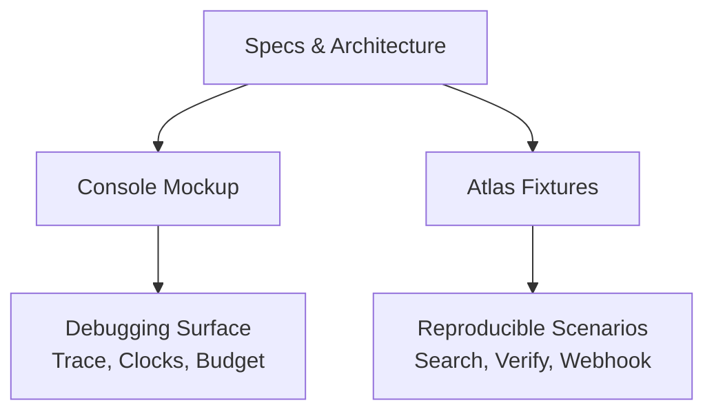
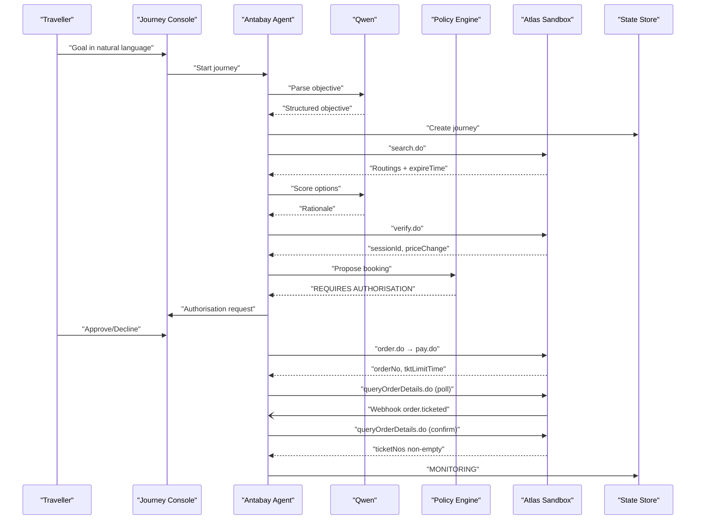
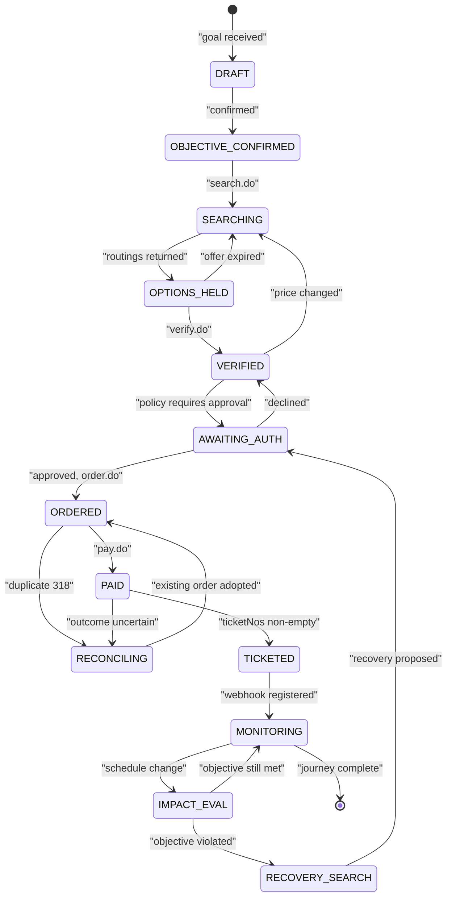
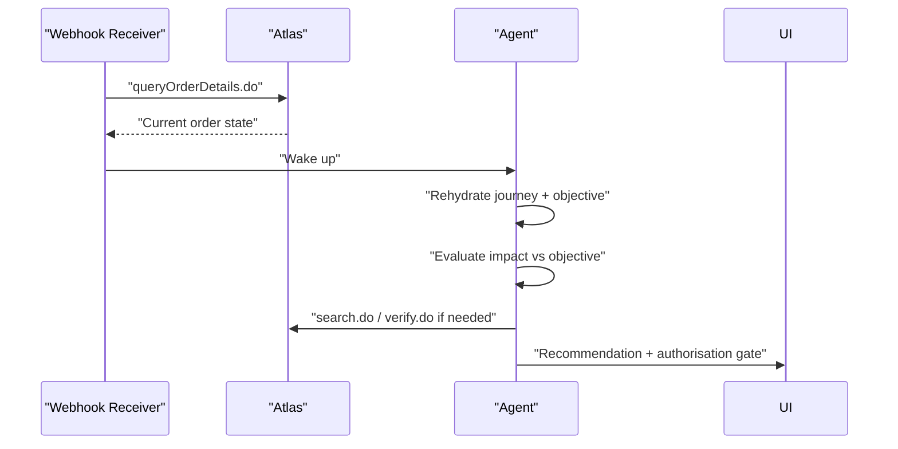
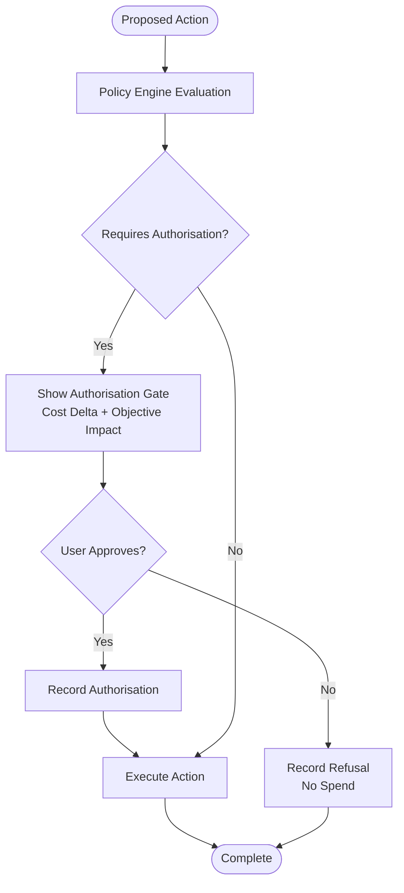
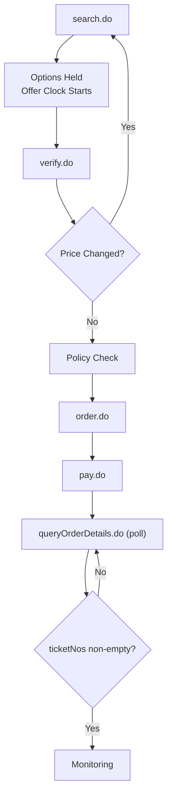
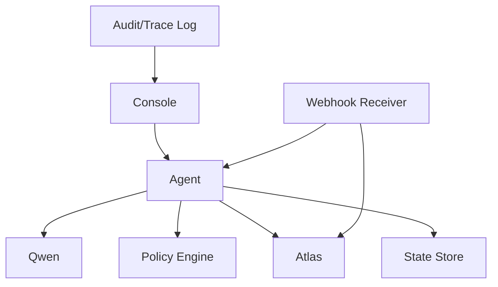

# Debugging and Troubleshooting

<cite>
**Referenced Files in This Document**
- [architecture.md](file://.antabay/architecture.md)
- [specs.md](file://.antabay/specs.md)
- [demo-scenario.md](file://.antabay/demo-scenario.md)
- [demo-sequence.md](file://.antabay/demo-sequence.md)
- [console-mockup.html](file://.antabay/console-mockup.html)
- [sel_tyo_search.json](file://fixtures/atlas/sel_tyo_search.json)
- [sel_tyo_verify.json](file://fixtures/atlas/sel_tyo_verify.json)
- [webhook_order_ticketed.json](file://fixtures/atlas/webhook_order_ticketed.json)
</cite>

## Table of Contents
1. [Introduction](#introduction)
2. [Project Structure](#project-structure)
3. [Core Components](#core-components)
4. [Architecture Overview](#architecture-overview)
5. [Detailed Component Analysis](#detailed-component-analysis)
6. [Dependency Analysis](#dependency-analysis)
7. [Performance Considerations](#performance-considerations)
8. [Troubleshooting Guide](#troubleshooting-guide)
9. [Conclusion](#conclusion)
10. [Appendices](#appendices)

## Introduction
This document provides a comprehensive debugging and troubleshooting guide for Antabay, focused on:
- Event stream analysis using the agent trace console
- Audit trail investigation for booking failures, authorization denials, and disruption handling
- Performance profiling for API call budgets, response times, and resource utilization
- Step-by-step diagnostics for complex scenarios such as multi-leg searches, price verification failures, and recovery execution issues
- Logging best practices and monitoring strategies for production environments

The guidance is grounded in the verified Atlas contract, the journey state machine, and the console design that exposes live events, expiry clocks, and policy gates.

## Project Structure
Antabay’s repository contains specification and scenario documents, a console mockup that defines the debugging surface, and fixtures from real Atlas sandbox responses used to reproduce and validate behavior.

**Diagram sources**
- [architecture.md:19-86](file://.antabay/architecture.md#L19-L86)
- [console-mockup.html:200-428](file://.antabay/console-mockup.html#L200-L428)
- [sel_tyo_search.json:1-120](file://fixtures/atlas/sel_tyo_search.json#L1-L120)
- [sel_tyo_verify.json:1-120](file://fixtures/atlas/sel_tyo_verify.json#L1-L120)
- [webhook_order_ticketed.json:1-53](file://fixtures/atlas/webhook_order_ticketed.json#L1-L53)

**Section sources**
- [architecture.md:19-86](file://.antabay/architecture.md#L19-L86)
- [console-mockup.html:200-428](file://.antabay/console-mockup.html#L200-L428)
- [sel_tyo_search.json:1-120](file://fixtures/atlas/sel_tyo_search.json#L1-L120)
- [sel_tyo_verify.json:1-120](file://fixtures/atlas/sel_tyo_verify.json#L1-L120)
- [webhook_order_ticketed.json:1-53](file://fixtures/atlas/webhook_order_ticketed.json#L1-L53)

## Core Components
- Journey Console (React + Vite): Displays objective, journey state rack, agent trace event stream, expiry clocks, authorisation gate, and traveller view.
- Backend FastAPI Service: Hosts the Antabay Agent with its ReAct loop, Policy Engine, webhook receiver/reconciler, and disruption injector.
- Qwen LLM: Reasoning only; never decides authority.
- Atlas Tool Layer: search.do, verify.do, order.do, pay.do, queryOrderDetails.do, void/refund.
- State Store and Audit Trail: Persists journeys, objectives, identifiers, clocks, and append-only audit records.
- Structured Trace + Audit Log: Captures every external call, decision, approval, and timing.

Key rules enforced by architecture:
- Qwen reasons; policy engine decides authority.
- Journey state lives outside the agent; rehydrated on wake-up.
- Webhooks are untrusted hints; queryOrderDetails.do is authoritative.
- Every travel fact shown to the traveller traces to an Atlas response.

**Section sources**
- [architecture.md:19-86](file://.antabay/architecture.md#L19-L86)
- [specs.md:303-398](file://.antabay/specs.md#L303-L398)
- [specs.md:429-531](file://.antabay/specs.md#L429-L531)

## Architecture Overview
The system orchestrates a goal-to-ticketed flow with explicit checkpoints for verification, authorisation, and post-action confirmation. Disruptions trigger impact evaluation and recovery with human authority gates.

**Diagram sources**
- [architecture.md:89-148](file://.antabay/architecture.md#L89-L148)
- [demo-sequence.md:8-110](file://.antabay/demo-sequence.md#L8-L110)
- [specs.md:303-398](file://.antabay/specs.md#L303-L398)

## Detailed Component Analysis

### Agent Trace Console
The console is the primary debugging surface. It shows:
- Objective and hard/soft constraints
- Journey state rack with current step highlighted
- Live agent trace with timestamps, tool calls, decisions, rejections, selections, policy outcomes, and events
- Expiry clocks for offer window, session, and ticketing deadline
- Authorisation gate with cost delta and objective impact
- Traveller view for simplified messaging

Use the trace to:
- Identify which tool was called, its status code, and elapsed time
- Understand why options were rejected or selected
- Observe when webhooks arrive and how they are treated as hints
- Watch clocks deplete to detect stale offers or sessions
- See policy gates requiring human approval before spending money

**Section sources**
- [console-mockup.html:200-428](file://.antabay/console-mockup.html#L200-L428)
- [specs.md:798-800](file://.antabay/specs.md#L798-L800)

### Journey State Machine and Three Clocks
The journey progresses through defined states. Each transition is guarded by clocks:
- Offer clock from search.do (observed 7m43s–31m; may arrive pre-aged)
- Session clock from verify.do (~2 hours)
- Ticketing deadline from order.do (30 minutes)

Expiry sends the journey back to search. All three are tracked and displayed with remaining time.

**Diagram sources**
- [architecture.md:212-257](file://.antabay/architecture.md#L212-L257)

**Section sources**
- [architecture.md:212-257](file://.antabay/architecture.md#L212-L257)
- [specs.md:303-398](file://.antabay/specs.md#L303-L398)

### Webhook Receiver and Reconciliation
Webhooks are untrusted hints. On receiving order.ticketed or schedule change events:
- The receiver queries Atlas via queryOrderDetails.do to obtain authoritative truth
- The agent wakes up, rehydrates journey and objective, evaluates impact, and proceeds accordingly

**Diagram sources**
- [architecture.md:152-208](file://.antabay/architecture.md#L152-L208)
- [specs.md:303-398](file://.antabay/specs.md#L303-L398)

**Section sources**
- [architecture.md:152-208](file://.antabay/architecture.md#L152-L208)
- [webhook_order_ticketed.json:1-53](file://fixtures/atlas/webhook_order_ticketed.json#L1-L53)

### Policy Engine and Authorisation Gate
Actions that spend money, void bookings, or are irreversible require deterministic policy approval. The console surfaces:
- Rule citations
- Cost delta and new total
- Objective impact
- Approve/Decline buttons
- Silence recorded as refusal per spec

**Diagram sources**
- [demo-sequence.md:91-99](file://.antabay/demo-sequence.md#L91-L99)
- [specs.md:303-398](file://.antabay/specs.md#L303-L398)

**Section sources**
- [demo-sequence.md:91-99](file://.antabay/demo-sequence.md#L91-L99)
- [console-mockup.html:349-361](file://.antabay/console-mockup.html#L349-L361)
- [specs.md:303-398](file://.antabay/specs.md#L303-L398)

### Search, Verification, and Pricing
- search.do returns routings with expireTime; observed windows can be short and may arrive pre-aged
- verify.do confirms pricing and issues sessionId; price changes must be handled
- Pay success is not proof of ticketing; queryOrderDetails.do must confirm ticketNos

**Diagram sources**
- [architecture.md:89-148](file://.antabay/architecture.md#L89-L148)
- [sel_tyo_search.json:1-120](file://fixtures/atlas/sel_tyo_search.json#L1-L120)
- [sel_tyo_verify.json:1-120](file://fixtures/atlas/sel_tyo_verify.json#L1-L120)

**Section sources**
- [architecture.md:89-148](file://.antabay/architecture.md#L89-L148)
- [sel_tyo_search.json:1-120](file://fixtures/atlas/sel_tyo_search.json#L1-L120)
- [sel_tyo_verify.json:1-120](file://fixtures/atlas/sel_tyo_verify.json#L1-L120)

## Dependency Analysis
External dependencies and integration points:
- Atlas Sandbox: search.do, verify.do, order.do, pay.do, queryOrderDetails.do, void/refund
- Qwen via Model Studio/DashScope: reasoning only
- Webhook Receiver: receives unauthenticated events, reconciles via Atlas
- State Store: persists journeys, objectives, identifiers, clocks, audit trail
- Console: displays live events, clocks, budget, and traveller view

**Diagram sources**
- [architecture.md:19-86](file://.antabay/architecture.md#L19-L86)
- [specs.md:303-398](file://.antabay/specs.md#L303-L398)

**Section sources**
- [architecture.md:19-86](file://.antabay/architecture.md#L19-L86)
- [specs.md:303-398](file://.antabay/specs.md#L303-L398)

## Performance Considerations
- Call budgets: Rate-limited endpoints have per-journey budgets; agents cannot loop indefinitely. Track usage in the console budget bar.
- Response times: Log endpoint, outcome, and elapsed time for every external call. Use trace timestamps to identify slow steps.
- Resource utilization: Keep reasoning off critical paths where possible; ensure state persistence avoids recomputation after restarts.
- Expiry management: Treat offers as already partially aged; compute remaining usable time from current time.
- Monitoring: Display all three clocks persistently with time remaining and depleting bars; spent clocks remain visible.

Operational tips:
- Respect provider rate limits; honor wait instructions on rate-limit rejections
- Avoid redundant searches; reuse verified sessions when valid
- Ensure post-action verification before updating state

**Section sources**
- [specs.md:303-398](file://.antabay/specs.md#L303-L398)
- [console-mockup.html:257-261](file://.antabay/console-mockup.html#L257-L261)
- [architecture.md:261-279](file://.antabay/architecture.md#L261-L279)

## Troubleshooting Guide

### Using the Agent Trace Console for Real-Time Debugging
- Open the console and locate the active journey header showing route and date
- Inspect the left column:
  - Objective panel: confirm parsed constraints and their types
  - Journey state rack: identify current step and completed milestones
  - Atlas call budget: observe usage against limit
- In the center trace:
  - Look for TOOL entries to see Atlas calls, status codes, and durations
  - Find REJECT/SELECT entries to understand option filtering and selection rationale
  - Check EVENT entries for webhook arrivals and how they are treated as hints
  - Review POLICY entries for rule citations and authorisation requirements
- Right column:
  - Expiry clocks: watch offer/session/ticketing deadlines deplete
  - Authorisation gate: review cost delta, new total, and objective impact
  - Traveller view: verify user-facing messaging aligns with backend actions

Common indicators:
- Stale offer: offer clock at zero; return to search
- Price change: verify.do indicates price change; re-evaluate options
- Payment without ticketing: pay.do succeeds but ticketNos empty; continue polling queryOrderDetails.do
- Webhook trust boundary: treat order.ticketed as hint; always confirm via queryOrderDetails.do

**Section sources**
- [console-mockup.html:200-428](file://.antabay/console-mockup.html#L200-L428)
- [architecture.md:89-148](file://.antabay/architecture.md#L89-L148)
- [specs.md:303-398](file://.antabay/specs.md#L303-L398)

### Audit Trail Investigation Techniques
- Booking failures:
  - Locate TOOL entries for order.do/pay.do and check status codes and messages
  - Confirm whether duplicate-booking rejection occurred and whether existing order reference was adopted
  - Verify reconciliation path and subsequent queryOrderDetails.do confirmations
- Authorization denials:
  - Find POLICY entries citing specific rules (e.g., AUTH-01, AUTH-02, AUTH-03)
  - Check whether user approved or declined; silence recorded as refusal
  - Ensure no spend occurred on refusal
- Disruption handling:
  - Identify EVENT entries for schedule change; note SIMULATED label if applicable
  - Confirm receiver queried Atlas before acting
  - Validate impact evaluation against objective and recommendation logic

Evidence sources:
- Append-only audit trail records observations, decisions, external calls, and authorisations with timestamps
- Fixtures provide real payloads for reproduction and validation

**Section sources**
- [specs.md:429-531](file://.antabay/specs.md#L429-L531)
- [demo-scenario.md:81-117](file://.antabay/demo-scenario.md#L81-L117)
- [webhook_order_ticketed.json:1-53](file://fixtures/atlas/webhook_order_ticketed.json#L1-L53)

### Performance Profiling Approaches
- Monitor API call budgets:
  - Use the budget bar to track searches used versus limit
  - Investigate spikes in search.do calls and correlate with option scoring loops
- Measure response times:
  - Compare timestamps across TOOL entries to identify slow endpoints
  - Correlate latency with network conditions or provider throttling
- Assess resource utilization:
  - Ensure state persistence prevents recomputation after process restarts
  - Minimize unnecessary LLM calls; keep reasoning scoped to necessary steps

Best practices:
- Honor rate-limit wait instructions
- Avoid retrying before instructed intervals
- Persist full search responses for audit and fixtures

**Section sources**
- [specs.md:303-398](file://.antabay/specs.md#L303-L398)
- [console-mockup.html:257-261](file://.antabay/console-mockup.html#L257-L261)

### Common Issues and Resolutions

- Atlas API rate limiting:
  - Symptoms: repeated search.do calls hitting limits; budget bar near capacity
  - Resolution: respect wait instructions; reduce search frequency; cache results; use sessions
  - Evidence: budget usage and timestamps in trace
- Qwen LLM integration problems:
  - Symptoms: delayed reasoning; inconsistent rationales
  - Resolution: ensure model endpoint reachable; scope reasoning tasks; log model calls and outcomes
  - Evidence: reason entries in trace; timestamps around scoring steps
- Webhook processing failures:
  - Symptoms: missing order.ticketed or schedule change; incorrect state updates
  - Resolution: treat webhooks as hints; always confirm via queryOrderDetails.do; log raw and parsed bodies
  - Evidence: EVENT entries and subsequent TOOL entries confirming truth
- Policy engine conflicts:
  - Symptoms: unexpected authorisation gates; refusals recorded
  - Resolution: review cited rules; ensure proposals match policy expectations; record refusals and no-spend outcomes
  - Evidence: POLICY entries with rule citations; authorisation gate display

**Section sources**
- [specs.md:303-398](file://.antabay/specs.md#L303-L398)
- [console-mockup.html:349-361](file://.antabay/console-mockup.html#L349-L361)
- [webhook_order_ticketed.json:1-53](file://fixtures/atlas/webhook_order_ticketed.json#L1-L53)

### Step-by-Step Diagnostic Procedures

- Multi-leg flight searches:
  1. Confirm objective includes connection preferences and deadlines
  2. Inspect search.do results for connecting itineraries and layover durations
  3. Evaluate connections against hard constraints (e.g., no overnight connections)
  4. Reject options violating constraints even if arrival time and budget pass
  5. Document rationale in trace with constraint references
- Price verification failures:
  1. After verify.do, check priceChange.isPriceChange
  2. If price changed, return to search and re-score
  3. If unchanged, proceed to policy check and booking path
  4. Log original and new prices for audit
- Recovery execution issues:
  1. On disruption, verify claim via queryOrderDetails.do
  2. Re-search and verify alternatives; compute cost deltas
  3. Present recommendation with objective impact
  4. Enforce authorisation gate; execute only after approval
  5. Void original and confirm both legs via queryOrderDetails.do before updating state

**Section sources**
- [demo-scenario.md:29-117](file://.antabay/demo-scenario.md#L29-L117)
- [architecture.md:152-208](file://.antabay/architecture.md#L152-L208)
- [sel_tyo_search.json:1-120](file://fixtures/atlas/sel_tyo_search.json#L1-L120)
- [sel_tyo_verify.json:1-120](file://fixtures/atlas/sel_tyo_verify.json#L1-L120)

### Logging Best Practices and Monitoring Strategies
- Structured logging:
  - Record endpoint, outcome, and elapsed time for every external call
  - Include journey identifier, timestamps, and relevant identifiers preserved unmodified
- Append-only audit trail:
  - Capture observations, decisions, external calls, and authorisations with timestamps
- Production monitoring:
  - Track budget usage and expiry clocks in dashboards
  - Alert on repeated rate-limit rejections and webhook delivery failures
  - Monitor policy gate approvals and refusals for anomalies
- Reproducibility:
  - Persist full search responses and webhook payloads for fixtures
  - Use fixtures to replay scenarios and validate fixes

**Section sources**
- [specs.md:303-398](file://.antabay/specs.md#L303-L398)
- [specs.md:429-531](file://.antabay/specs.md#L429-L531)

## Conclusion
Antabay’s debugging and troubleshooting approach centers on a transparent agent trace console, strict adherence to the verified Atlas contract, and deterministic policy enforcement. By analyzing event streams, investigating audit trails, and profiling performance through call budgets and response times, teams can rapidly diagnose issues such as rate limiting, LLM integration problems, webhook mishandling, and policy conflicts. The journey state machine and three-clock model provide clear boundaries for action and recovery, ensuring safe and auditable operations in production.

## Appendices

### Appendix A: Key Fixtures Reference
- sel_tyo_search.json: Demonstrates routing structure, pricing details, and expireTime fields used during search
- sel_tyo_verify.json: Shows sessionId, priceChange flags, and bookingRequirement schema used during verification
- webhook_order_ticketed.json: Example webhook payload with type, data, and headers for order.ticketed events

**Section sources**
- [sel_tyo_search.json:1-120](file://fixtures/atlas/sel_tyo_search.json#L1-L120)
- [sel_tyo_verify.json:1-120](file://fixtures/atlas/sel_tyo_verify.json#L1-L120)
- [webhook_order_ticketed.json:1-53](file://fixtures/atlas/webhook_order_ticketed.json#L1-L53)

### Appendix B: Scenario Beats for Video-Based Debugging
- Understand: parse goal into structured objective with hard/soft constraints
- Observe: run search.do; display offer clock and budget usage
- Reason: score options; reject trap itineraries; select compliant option
- Act & Verify: verify.do; order.do; pay.do; poll queryOrderDetails.do until ticketed
- Disruption: receive schedule change; verify claim; evaluate impact
- Adapt: re-search; verify alternatives; present recommendation
- Human Authority: enforce policy gate; approve or decline
- Execute & Verify: create new order; void original; confirm both legs; resume monitoring

**Section sources**
- [demo-sequence.md:8-110](file://.antabay/demo-sequence.md#L8-L110)
- [demo-scenario.md:121-135](file://.antabay/demo-scenario.md#L121-L135)