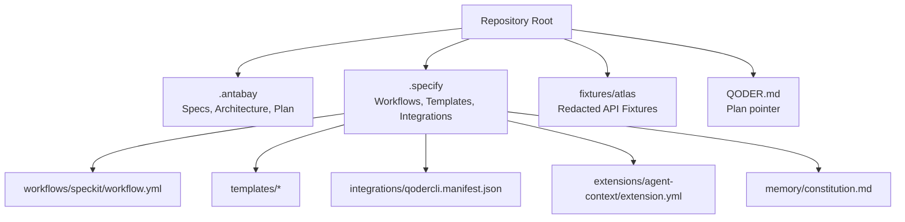
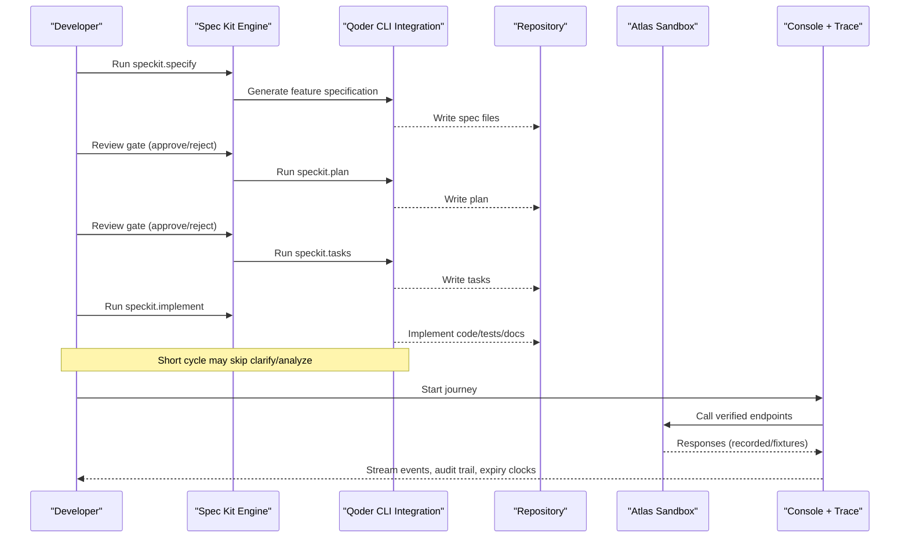
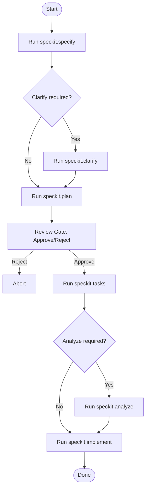
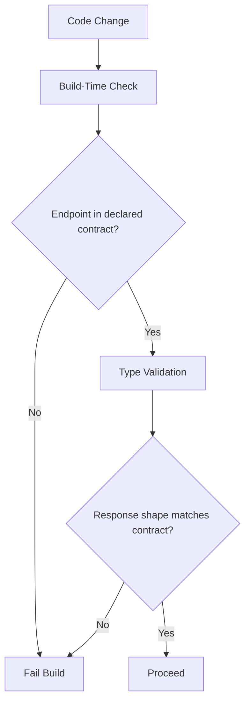
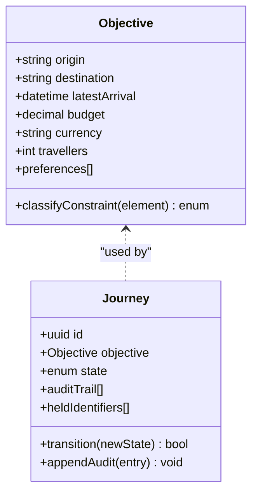
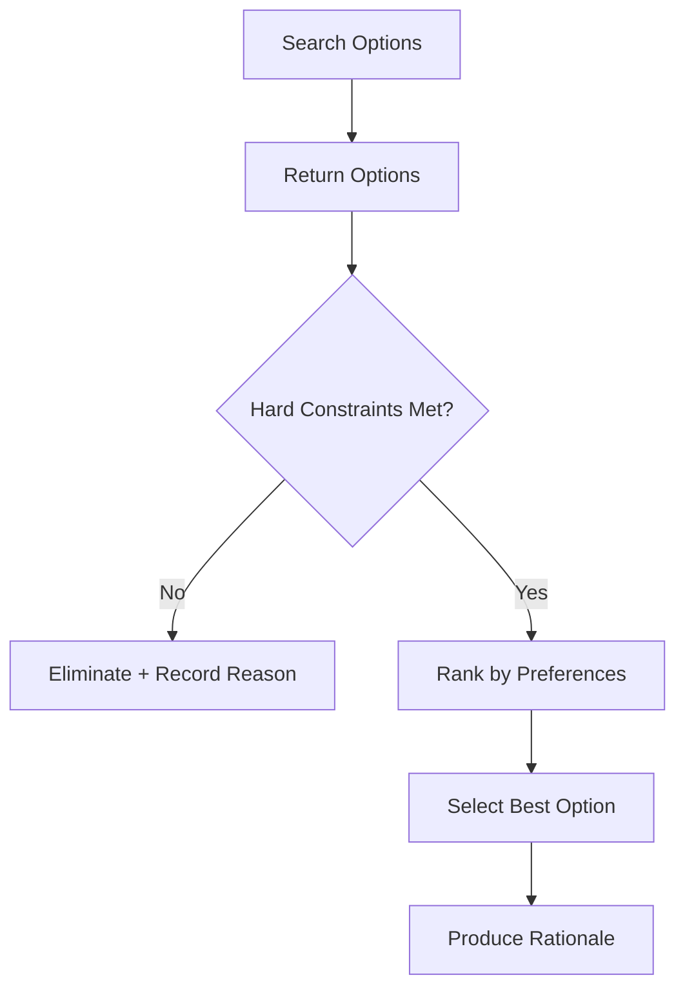
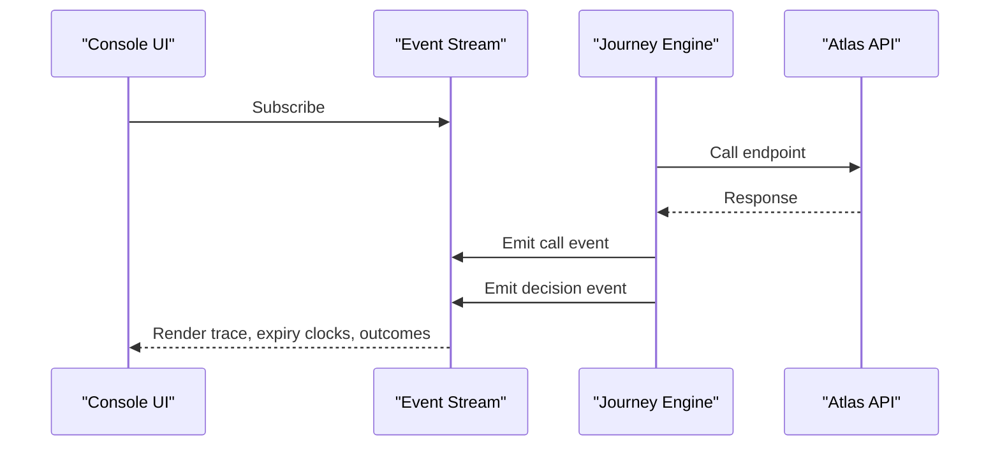
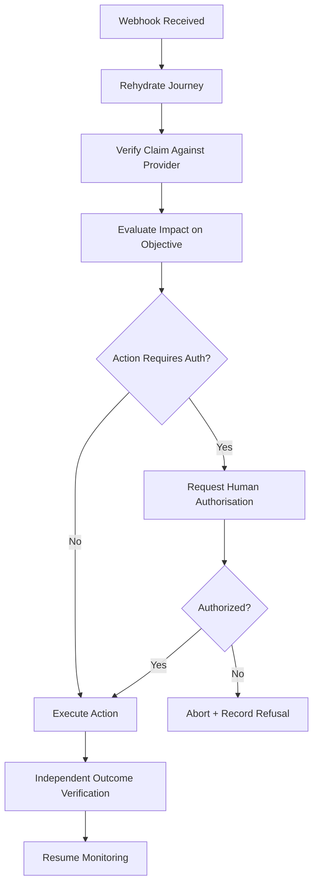
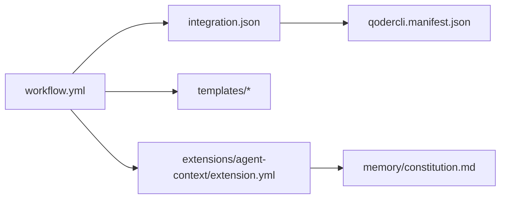

# Development Workflow

<cite>
**Referenced Files in This Document**
- [specs.md](file://.antabay/specs.md)
- [plan.md](file://.antabay/plan.md)
- [QODER.md](file://QODER.md)
- [integration.json](file://.specify/integration.json)
- [workflow.yml](file://.specify/workflows/speckit/workflow.yml)
- [spec-template.md](file://.specify/templates/spec-template.md)
- [tasks-template.md](file://.specify/templates/tasks-template.md)
- [qodercli.manifest.json](file://.specify/integrations/qodercli.manifest.json)
- [extension.yml](file://.specify/extensions/agent-context/extension.yml)
- [constitution.md](file://.specify/memory/constitution.md)
- [sel_tyo_search.json](file://fixtures/atlas/sel_tyo_search.json)
</cite>

## Table of Contents
1. [Introduction](#introduction)
2. [Project Structure](#project-structure)
3. [Core Components](#core-components)
4. [Architecture Overview](#architecture-overview)
5. [Detailed Component Analysis](#detailed-component-analysis)
6. [Dependency Analysis](#dependency-analysis)
7. [Performance Considerations](#performance-considerations)
8. [Troubleshooting Guide](#troubleshooting-guide)
9. [Conclusion](#conclusion)
10. [Appendices](#appendices)

## Introduction
This document describes the specification-driven development workflow for Antabay using Spec Kit and Qoder CLI. It explains how to create specifications, plan and implement features, enforce quality gates, validate behavior against verified external contracts, and maintain code organization and naming conventions. It also covers debugging event streams, investigating audit trails, profiling performance, setting up the development environment, integrating with IDEs, contributing via code reviews and pull requests, testing requirements, code quality standards, documentation maintenance, and best practices for extending functionality while preserving backward compatibility.

## Project Structure
Antabay uses a Spec Kit–centric structure:
- .antabay: project-specific context documents, specs, architecture diagrams, demo scenarios, and execution plans.
- .specify: Spec Kit configuration, workflows, templates, integrations, extensions, and memory artifacts.
- fixtures/atlas: redacted JSON fixtures from live Atlas sandbox runs used as test seeds.
- Root-level QODER.md: points to the current plan for additional context when invoking Qoder commands.

**Diagram sources**
- [workflow.yml:1-78](file://.specify/workflows/speckit/workflow.yml#L1-L78)
- [spec-template.md:1-132](file://.specify/templates/spec-template.md#L1-L132)
- [tasks-template.md:1-253](file://.specify/templates/tasks-template.md#L1-L253)
- [qodercli.manifest.json:1-18](file://.specify/integrations/qodercli.manifest.json#L1-L18)
- [extension.yml:1-35](file://.specify/extensions/agent-context/extension.yml#L1-L35)
- [constitution.md](file://.specify/memory/constitution.md)

**Section sources**
- [specs.md:11-167](file://.antabay/specs.md#L11-L167)
- [plan.md:11-123](file://.antabay/plan.md#L11-L123)
- [QODER.md:1-5](file://QODER.md#L1-L5)

## Core Components
- Specification lifecycle: specify → clarify (optional) → plan → tasks → analyze (optional) → implement. The full cycle includes review gates; a short cycle drops clarify and analyze when time is constrained.
- Execution order: a prioritized delivery sequence ensures incremental value and clear stop lines.
- Verified contract: an enforced definition of external endpoints and data shapes prevents invented calls and fields.
- Journey model: durable objective and state management with append-only audit trail.
- Console and trace: real-time event streaming, replayable traces, and a traveller-facing view.
- Disruption, authorisation, recovery: webhook ingestion, independent verification, policy-based authorisation, and recovery execution.

Key references:
- Full spec set and working rules are defined in the project’s master spec file.
- The 48-hour execution plan consolidates deliverables into four integrated specs when needed.
- Spec Kit workflow enforces review gates between steps.

**Section sources**
- [specs.md:252-299](file://.antabay/specs.md#L252-L299)
- [specs.md:303-398](file://.antabay/specs.md#L303-L398)
- [specs.md:429-531](file://.antabay/specs.md#L429-L531)
- [specs.md:565-671](file://.antabay/specs.md#L565-L671)
- [specs.md:675-794](file://.antabay/specs.md#L675-L794)
- [specs.md:798-800](file://.antabay/specs.md#L798-L800)
- [plan.md:177-264](file://.antabay/plan.md#L177-L264)
- [plan.md:268-352](file://.antabay/plan.md#L268-L352)
- [plan.md:356-433](file://.antabay/plan.md#L356-L433)
- [plan.md:437-531](file://.antabay/plan.md#L437-L531)
- [workflow.yml:42-78](file://.specify/workflows/speckit/workflow.yml#L42-L78)

## Architecture Overview
The system is built around a Spec Kit workflow that orchestrates specification authoring, planning, task breakdown, and implementation with human review gates. External integration is strictly governed by a verified contract captured from live Atlas sandbox responses. The console surfaces an event stream for visibility and replayability, while the journey model persists state and decisions.

**Diagram sources**
- [workflow.yml:42-78](file://.specify/workflows/speckit/workflow.yml#L42-L78)
- [integration.json:1-16](file://.specify/integration.json#L1-L16)
- [qodercli.manifest.json:1-18](file://.specify/integrations/qodercli.manifest.json#L1-L18)
- [specs.md:252-299](file://.antabay/specs.md#L252-L299)

## Detailed Component Analysis

### Specification Lifecycle and Quality Gates
- Full cycle: specify → clarify → plan → tasks → analyze → implement.
- Short cycle: specify → plan → tasks → implement (when time-constrained).
- Review gates: approve or reject at spec and plan stages before proceeding.
- Templates standardize user stories, acceptance criteria, success metrics, and assumptions.

**Diagram sources**
- [workflow.yml:42-78](file://.specify/workflows/speckit/workflow.yml#L42-L78)
- [spec-template.md:1-132](file://.specify/templates/spec-template.md#L1-L132)
- [tasks-template.md:1-253](file://.specify/templates/tasks-template.md#L1-L253)

**Section sources**
- [specs.md:252-269](file://.antabay/specs.md#L252-L269)
- [plan.md:262-264](file://.antabay/plan.md#L262-L264)
- [workflow.yml:42-78](file://.specify/workflows/speckit/workflow.yml#L42-L78)

### Verified Contract Enforcement
- Maintain a machine-readable declaration of permitted external endpoints.
- Reject build-time attempts to call unapproved endpoints.
- Define typed request/response shapes and preserve external identifiers without modification.
- Normalize inconsistent types across API and events; classify error codes; track call budgets and offer/session lifetimes.

**Diagram sources**
- [specs.md:303-398](file://.antabay/specs.md#L303-L398)

**Section sources**
- [specs.md:303-398](file://.antabay/specs.md#L303-L398)

### Journey and Objective Model
- Accept natural-language goals, extract structured objectives with hard constraints vs soft preferences, confirm with the traveller, and persist durable journey state.
- Maintain an append-only audit trail of observations, decisions, external calls, and authorisations.
- Track issued identifiers with issue and staleness times.

**Diagram sources**
- [specs.md:429-531](file://.antabay/specs.md#L429-L531)

**Section sources**
- [specs.md:429-531](file://.antabay/specs.md#L429-L531)

### Flight Search and Option Scoring
- Search using confirmed objective parameters, record option identifiers and pricing metadata, handle zero results gracefully, and respect provider rate limits.
- Score options deterministically against hard constraints and preferences; compute connection times; incorporate scarcity signals; produce explainable rationale and rejection reasons.

**Diagram sources**
- [specs.md:565-671](file://.antabay/specs.md#L565-L671)
- [specs.md:675-794](file://.antabay/specs.md#L675-L794)

**Section sources**
- [specs.md:565-671](file://.antabay/specs.md#L565-L671)
- [specs.md:675-794](file://.antabay/specs.md#L675-L794)

### Console, Agent Trace, and Event Streaming
- Present structured objective, held identifiers with expiry clocks, and observable events for every external call and decision.
- Stream events in real time without polling; support replay of recorded event streams without contacting external services.
- Provide a traveller-facing view showing status, itinerary, and outstanding authorisation.

**Diagram sources**
- [plan.md:356-433](file://.antabay/plan.md#L356-L433)

**Section sources**
- [plan.md:356-433](file://.antabay/plan.md#L356-L433)

### Disruption, Authorisation, and Recovery
- Ingest inbound event notifications, treat them as untrusted hints, and verify claims independently before changing state.
- Route on event type; provide simulated event emission for demonstrations; rehydrate journeys after restart.
- Evaluate impact on objectives, search alternatives, recommend one action, and require human authorisation for high-risk actions.
- Verify outcomes independently and resume monitoring post-recovery.

**Diagram sources**
- [plan.md:437-531](file://.antabay/plan.md#L437-L531)

**Section sources**
- [plan.md:437-531](file://.antabay/plan.md#L437-L531)

## Dependency Analysis
- Spec Kit workflow depends on the configured integration (Qoder CLI) and provides review gates to ensure quality.
- Templates define consistent structure for specifications and tasks, enabling predictable generation and review.
- Extensions can hook into the workflow to refresh agent context after key phases.
- Memory stores the constitution used by the workflow and tools.

**Diagram sources**
- [workflow.yml:1-78](file://.specify/workflows/speckit/workflow.yml#L1-L78)
- [integration.json:1-16](file://.specify/integration.json#L1-L16)
- [qodercli.manifest.json:1-18](file://.specify/integrations/qodercli.manifest.json#L1-L18)
- [extension.yml:1-35](file://.specify/extensions/agent-context/extension.yml#L1-L35)
- [constitution.md](file://.specify/memory/constitution.md)

**Section sources**
- [workflow.yml:1-78](file://.specify/workflows/speckit/workflow.yml#L1-L78)
- [integration.json:1-16](file://.specify/integration.json#L1-L16)
- [qodercli.manifest.json:1-18](file://.specify/integrations/qodercli.manifest.json#L1-L18)
- [extension.yml:1-35](file://.specify/extensions/agent-context/extension.yml#L1-L35)

## Performance Considerations
- Use Lite or Efficient model tiers for scaffolding; reserve higher tiers for reasoning-heavy work to control costs and latency.
- Respect provider rate limits and honour wait instructions returned with rate-limit rejections.
- Persist full search responses for audit and fixture reuse to avoid repeated network calls during tests.
- Keep the interface legible at video scale; minimize rendering overhead and avoid heavy computations in the UI thread.
- Prefer deterministic scoring and classification logic to reduce variability and enable efficient caching where appropriate.

[No sources needed since this section provides general guidance]

## Troubleshooting Guide
- Event stream analysis:
  - Ensure the console subscribes to the event stream and renders call events with endpoint, outcome, and elapsed time.
  - Use replay mode to reproduce issues without contacting external services.
  - Validate that simulated events are clearly distinguished from provider-originated events.

- Audit trail investigation:
  - Confirm the journey model maintains an append-only audit trail with timestamps for observations, decisions, external calls, and authorisations.
  - Verify that every authorisation outcome, including refusals, is recorded.

- Performance profiling:
  - Monitor call budgets per journey and ensure rate-limit waits are honoured.
  - Profile scoring and selection paths to ensure deterministic and explainable outputs.
  - Use fixtures to isolate performance regressions without hitting live APIs.

- Environment and setup:
  - Verify .gitignore excludes sensitive files such as .env and reports.
  - Confirm environment variables for Atlas and DashScope are correctly set.
  - Ensure Qoder CLI plugins and wiki are installed and updated before submission.

**Section sources**
- [plan.md:356-433](file://.antabay/plan.md#L356-L433)
- [plan.md:437-531](file://.antabay/plan.md#L437-L531)
- [specs.md:303-398](file://.antabay/specs.md#L303-L398)
- [specs.md:429-531](file://.antabay/specs.md#L429-L531)
- [plan.md:11-123](file://.antabay/plan.md#L11-L123)

## Conclusion
Antabay’s development workflow centers on rigorous specification-driven development with Spec Kit and Qoder CLI. By enforcing a verified external contract, maintaining durable journey state with an append-only audit trail, and exposing a transparent console with event streaming and replay, the project ensures correctness, traceability, and usability. The modular delivery order and quality gates support incremental progress, while the templates and extensions standardize output and integrate seamlessly with coding agents. Following these practices enables new contributors to onboard quickly and experienced developers to extend functionality safely and efficiently.

[No sources needed since this section summarizes without analyzing specific files]

## Appendices

### Development Environment Setup
- Initialize repository and Spec Kit, install Qoder CLI plugins, and configure environment variables for Atlas and DashScope.
- Copy context documents into .antabay and redact fixtures from live runs into fixtures/atlas.
- Commit only non-sensitive files; ensure .env and reports are ignored.

**Section sources**
- [specs.md:11-167](file://.antabay/specs.md#L11-L167)
- [plan.md:11-123](file://.antabay/plan.md#L11-L123)

### Code Organization Principles
- Follow the Spec Kit templates for specifications and tasks to maintain consistency.
- Organize implementation according to generated tasks and plans; keep models before services, services before endpoints.
- Use fixtures from live runs for tests; never handwrite fixtures.

**Section sources**
- [spec-template.md:1-132](file://.specify/templates/spec-template.md#L1-L132)
- [tasks-template.md:1-253](file://.specify/templates/tasks-template.md#L1-L253)
- [specs.md:103-135](file://.antabay/specs.md#L103-L135)

### Naming Conventions and Import Management
- Preserve externally issued identifiers without modification; do not construct or parse them.
- Normalize fields whose types differ between API and events to a single canonical type.
- Centralize total-price calculation; do not compute totals elsewhere.

**Section sources**
- [specs.md:303-398](file://.antabay/specs.md#L303-L398)

### Contribution Process
- Use the full or short cycle depending on time constraints; always run review gates.
- Commit after each spec or logical group; keep commits focused and demonstrable.
- Update Qoder wiki before submission to generate citable evidence.

**Section sources**
- [specs.md:252-269](file://.antabay/specs.md#L252-L269)
- [plan.md:535-553](file://.antabay/plan.md#L535-L553)

### Testing Requirements and Code Quality Standards
- Tests must be independently verifiable per user story; include contract and integration tests where requested.
- Enforce build-time checks against the verified contract; fail builds on unauthorized endpoints or mismatched response shapes.
- Use fixtures from live runs; ensure tests are reproducible and deterministic.

**Section sources**
- [spec-template.md:1-132](file://.specify/templates/spec-template.md#L1-L132)
- [tasks-template.md:1-253](file://.specify/templates/tasks-template.md#L1-L253)
- [specs.md:303-398](file://.antabay/specs.md#L303-L398)

### Documentation Maintenance
- Keep .antabay context documents current: specs, architecture, demo scenario, and execution plan.
- Use the console mockup as the visual target when building UI components.
- Regenerate wiki and check plugin reports before submission.

**Section sources**
- [specs.md:73-101](file://.antabay/specs.md#L73-L101)
- [plan.md:535-553](file://.antabay/plan.md#L535-L553)

### Best Practices for Extending Functionality
- Add new features through the specification lifecycle; ensure they align with the verified contract and journey model.
- Extend the console with new event types while maintaining clarity and legibility.
- Preserve backward compatibility by avoiding changes to external identifiers and canonical calculations.

**Section sources**
- [specs.md:303-398](file://.antabay/specs.md#L303-L398)
- [plan.md:356-433](file://.antabay/plan.md#L356-L433)

### Example Fixture Reference
- Redacted search result fixture demonstrates expected response structure and fields used in tests and audits.

**Section sources**
- [sel_tyo_search.json:1-200](file://fixtures/atlas/sel_tyo_search.json#L1-L200)