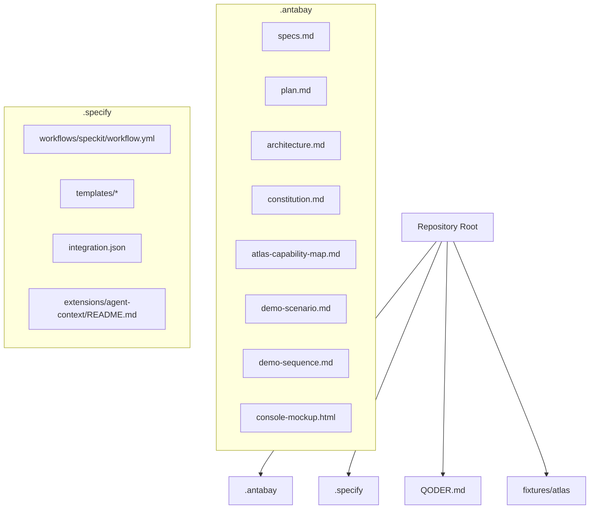
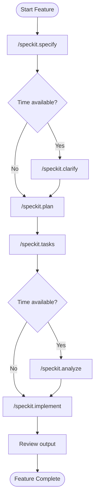
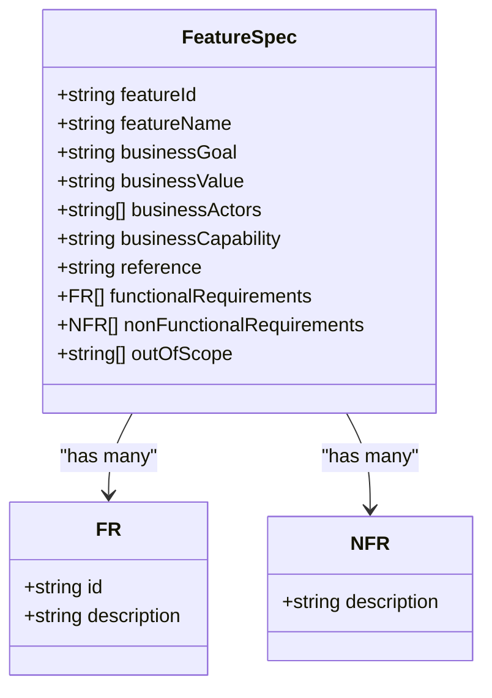
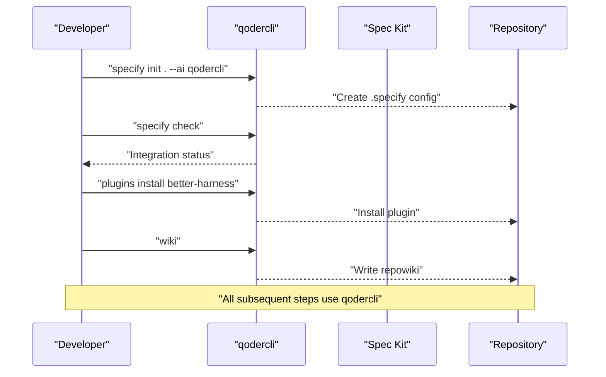
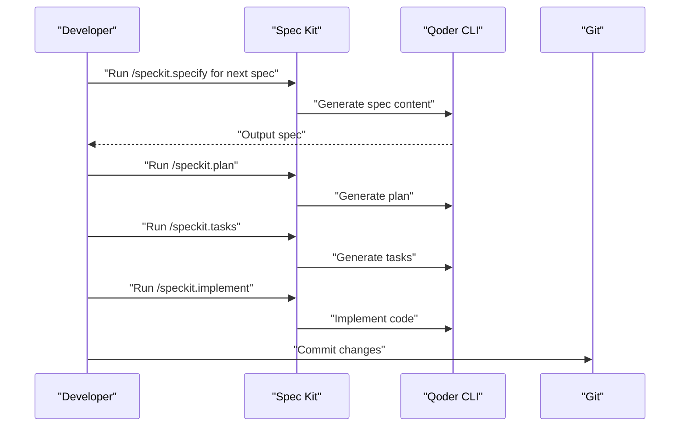
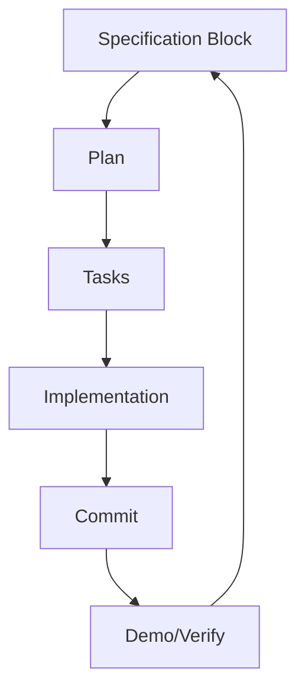
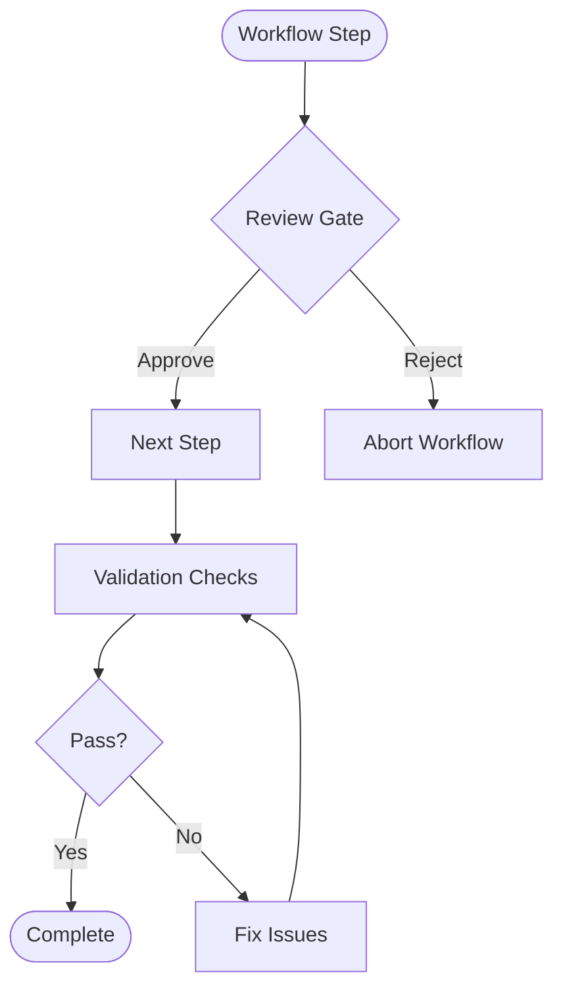
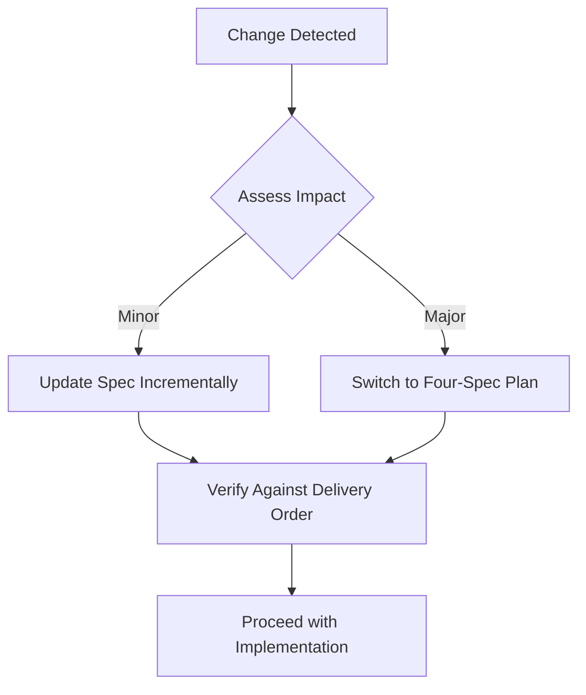
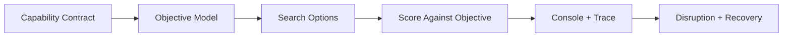
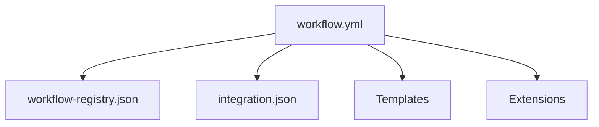

# Spec-Driven Development

<cite>
**Referenced Files in This Document**
- [specs.md](file://.antabay/specs.md)
- [plan.md](file://.antabay/plan.md)
- [QODER.md](file://QODER.md)
- [workflow.yml](file://.specify/workflows/speckit/workflow.yml)
- [workflow-registry.json](file://.specify/workflows/workflow-registry.json)
- [integration.json](file://.specify/integration.json)
- [spec-template.md](file://.specify/templates/spec-template.md)
- [tasks-template.md](file://.specify/templates/tasks-template.md)
- [agent-context README.md](file://.specify/extensions/agent-context/README.md)
- [architecture.md](file://.antabay/architecture.md)
</cite>

## Table of Contents
1. [Introduction](#introduction)
2. [Project Structure](#project-structure)
3. [Core Components](#core-components)
4. [Architecture Overview](#architecture-overview)
5. [Detailed Component Analysis](#detailed-component-analysis)
6. [Dependency Analysis](#dependency-analysis)
7. [Performance Considerations](#performance-considerations)
8. [Troubleshooting Guide](#troubleshooting-guide)
9. [Conclusion](#conclusion)
10. [Appendices](#appendices)

## Introduction
This document explains Antabay’s specification-driven development workflow using Spec Kit and Qoder CLI. It covers the complete lifecycle from initial setup through implementation, including:
- The six-step cycle: specify, clarify, plan, tasks, analyze, implement
- The short cycle for time-constrained development
- Delivery order and stop lines that define incremental capability building
- Specification structure with feature IDs, business goals, functional requirements, non-functional requirements, and acceptance criteria
- Qoder CLI integration, execution order, and maintaining spec-to-implementation traceability
- Quality gates, validation procedures, and handling specification changes during development
- Common spec patterns and troubleshooting approaches

## Project Structure
Antabay organizes specifications, plans, and context artifacts under .antabay, while Spec Kit configuration, workflows, templates, and integrations live under .specify. The root contains a brief note pointing to the current plan for additional context.



**Diagram sources**
- [specs.md:1-10](file://.antabay/specs.md#L1-L10)
- [plan.md:1-10](file://.antabay/plan.md#L1-L10)
- [workflow.yml:1-10](file://.specify/workflows/speckit/workflow.yml#L1-L10)
- [integration.json:1-16](file://.specify/integration.json#L1-L16)
- [agent-context README.md:1-20](file://.specify/extensions/agent-context/README.md#L1-L20)

**Section sources**
- [specs.md:1-10](file://.antabay/specs.md#L1-L10)
- [plan.md:1-10](file://.antabay/plan.md#L1-L10)
- [QODER.md:1-5](file://QODER.md#L1-L5)

## Core Components
- Specification set: A single ordered file defines all features with explicit setup instructions, working rules, run instructions, delivery order, and stop lines. Each feature block is paste-ready into the agent workflow.
- Execution plan: A compressed four-spec plan provides a fast path when time is constrained, preserving core capabilities and cutting lower-priority items.
- Spec Kit workflow: A YAML-defined workflow orchestrates the full SDD cycle with review gates and supports multiple integrations.
- Templates: Standardized templates guide consistent specification and task generation.
- Integration configuration: Declares the active integration (Qoder CLI) and its invocation settings.
- Agent context extension: Manages the coding agent context file sections to keep planning artifacts synchronized.

Key responsibilities:
- specs.md: Defines the canonical execution order, stop lines, and per-feature blocks to drive the six-step cycle.
- plan.md: Provides a time-boxed alternative plan with clear cuts and priorities.
- workflow.yml: Encodes the specify → plan → tasks → implement flow with human review gates.
- templates: Ensure consistent structure across generated specs and tasks.
- integration.json: Locks in Qoder CLI as the default integration.
- agent-context README: Explains how agent context files are managed and updated.

**Section sources**
- [specs.md:252-300](file://.antabay/specs.md#L252-L300)
- [plan.md:151-174](file://.antabay/plan.md#L151-L174)
- [workflow.yml:42-78](file://.specify/workflows/speckit/workflow.yml#L42-L78)
- [spec-template.md:1-132](file://.specify/templates/spec-template.md#L1-L132)
- [tasks-template.md:1-50](file://.specify/templates/tasks-template.md#L1-L50)
- [integration.json:1-16](file://.specify/integration.json#L1-L16)
- [agent-context README.md:1-20](file://.specify/extensions/agent-context/README.md#L1-L20)

## Architecture Overview
The system architecture centers on a FastAPI backend with an in-process ReAct loop agent, deterministic policy engine, webhook receiver, disruption injector, and a tool layer enforcing the verified Atlas contract. The UI streams events via SSE and exposes both operator and traveller views.

```mermaid
graph TB
T["Traveller"]
UI["Console (React + Vite)"]
AG["Agent (ReAct loop)"]
POL["Policy Engine"]
RX["Webhook Receiver"]
INJ["Disruption Injector (SIM)"]
TOOL["Atlas Tool Layer (contract)"]
ATLAS["Atlas Sandbox"]
DB["State Store"]
LOG["Trace + Audit Log"]
QW["Qwen (reasoning only)"]
T --> UI
UI --> |SSE| TR["Event Stream"]
AG --> |emit events| UI
AP["Authorisation Gate"] --> POL
AG < --> QW
AG --> POL
AG < --> DB
AG --> LOG
AG --> TOOL
TOOL --> ATLAS
ATLAS -.-> RX
INJ -.-> RX
RX --> |untrusted hint| AG
AG --> |query truth| ATLAS
```

**Diagram sources**
- [architecture.md:19-86](file://.antabay/architecture.md#L19-L86)

## Detailed Component Analysis

### Six-Step Cycle and Short Cycle
- Full cycle: specify → clarify → plan → tasks → analyze → implement
- Short cycle (time-constrained): specify → plan → tasks → implement (skip clarify and analyze)

Execution guidance:
- Use Qoder CLI to run each step; every file-producing action goes through qodercli.
- Follow the delivery order and stop lines to build incrementally and demonstrate value early.



**Diagram sources**
- [specs.md:252-269](file://.antabay/specs.md#L252-L269)

**Section sources**
- [specs.md:252-269](file://.antabay/specs.md#L252-L269)

### Delivery Order and Stop Lines
The project defines a strict delivery order where each step marks what you have if you stop there. Minimum viable submission ends at a specific step, and a fallback plan exists if behind schedule.


**Diagram sources**
- [specs.md:273-300](file://.antabay/specs.md#L273-L300)

**Section sources**
- [specs.md:273-300](file://.antabay/specs.md#L273-L300)

### Specification Structure
Each feature block in the specification set follows a consistent structure:
- Feature ID: Unique identifier for the feature
- Feature Name: Human-readable title
- Business Goal: What the feature achieves
- Business Value: Why it matters
- Business Actors: Who interacts or benefits
- Business Capability: The capability being built
- Reference: Links to verified contracts or scenario documents
- Functional Requirements: Numbered FR statements describing required behavior
- Non-Functional Requirements: Constraints on performance, reliability, security, etc.
- Out of Scope: Explicitly excluded areas
- Acceptance Criteria: Embedded within user scenarios and success criteria in templates



**Diagram sources**
- [specs.md:303-398](file://.antabay/specs.md#L303-L398)
- [spec-template.md:10-132](file://.specify/templates/spec-template.md#L10-L132)

**Section sources**
- [specs.md:303-398](file://.antabay/specs.md#L303-L398)
- [spec-template.md:10-132](file://.specify/templates/spec-template.md#L10-L132)

### Qoder CLI Integration
- Initialization: Initialize Spec Kit with Qoder CLI and verify availability.
- Plugins: Install better-harness and generate repository wiki for evidence.
- Context: Keep QODER.md pointing to the current plan for additional context.
- Discipline: All file-producing actions go through qodercli; model routing should be deliberate to control cost.



**Diagram sources**
- [specs.md:20-31](file://.antabay/specs.md#L20-L31)
- [specs.md:137-147](file://.antabay/specs.md#L137-L147)
- [QODER.md:1-5](file://QODER.md#L1-L5)

**Section sources**
- [specs.md:20-31](file://.antabay/specs.md#L20-L31)
- [specs.md:137-147](file://.antabay/specs.md#L137-L147)
- [QODER.md:1-5](file://QODER.md#L1-L5)

### Running Specs in Execution Order
- Use the ordered list in the specification set to run each feature sequentially.
- For each feature, follow the prescribed cycle (full or short).
- Commit after every spec to maintain one spec, one commit, one demonstrable capability.



**Diagram sources**
- [specs.md:252-269](file://.antabay/specs.md#L252-L269)
- [specs.md:246-249](file://.antabay/specs.md#L246-L249)

**Section sources**
- [specs.md:246-249](file://.antabay/specs.md#L246-L249)
- [specs.md:252-269](file://.antabay/specs.md#L252-L269)

### Maintaining Relationship Between Specifications and Implementation
- One spec, one commit ensures traceability.
- Use the delivery order to align implementation increments with demonstrated capabilities.
- Keep the console and trace visible to validate behavior against the spec.



**Diagram sources**
- [specs.md:246-249](file://.antabay/specs.md#L246-L249)
- [specs.md:273-300](file://.antabay/specs.md#L273-L300)

**Section sources**
- [specs.md:246-249](file://.antabay/specs.md#L246-L249)
- [specs.md:273-300](file://.antabay/specs.md#L273-L300)

### Quality Gates and Validation Procedures
- Workflow gates: The workflow includes review gates between steps to approve or reject outputs before proceeding.
- Contract enforcement: Build-time rejection of unverified endpoints; recorded fixtures from live sandbox runs.
- Deterministic policy: Authorisation classification must be deterministic and testable per rule.
- Evidence: Repository wiki and harness reports provide citable evidence for evaluation.



**Diagram sources**
- [workflow.yml:49-66](file://.specify/workflows/speckit/workflow.yml#L49-L66)
- [specs.md:379-387](file://.antabay/specs.md#L379-L387)
- [plan.md:517-523](file://.antabay/plan.md#L517-L523)

**Section sources**
- [workflow.yml:49-66](file://.specify/workflows/speckit/workflow.yml#L49-L66)
- [specs.md:379-387](file://.antabay/specs.md#L379-L387)
- [plan.md:517-523](file://.antabay/plan.md#L517-L523)

### Handling Specification Changes During Development
- If behind schedule, switch to the merged four-spec plan to preserve core capabilities with reduced ceremony.
- Cut lower-priority items first while protecting critical differentiators (rejection reasons, webhook verification, authorisation gate, video).
- Maintain immutable external identifiers and canonical price calculations even when adapting scope.



**Diagram sources**
- [plan.md:297-300](file://.antabay/plan.md#L297-L300)
- [plan.md:557-570](file://.antabay/plan.md#L557-L570)

**Section sources**
- [plan.md:297-300](file://.antabay/plan.md#L297-L300)
- [plan.md:557-570](file://.antabay/plan.md#L557-L570)

### Common Spec Patterns
- Capability contract first: Establish a verified contract before any integration work.
- Journey and objective model: Turn natural language goals into durable, structured objectives with hard vs soft constraints.
- Search and scoring: Retrieve real options and select deterministically against the objective.
- Console and trace: Make behavior observable in real time with event streaming.
- Disruption and recovery: Detect impact, recommend alternatives, require authorisation for risky actions, and verify outcomes.



**Diagram sources**
- [specs.md:303-398](file://.antabay/specs.md#L303-L398)
- [specs.md:429-531](file://.antabay/specs.md#L429-L531)
- [specs.md:565-646](file://.antabay/specs.md#L565-L646)
- [specs.md:675-766](file://.antabay/specs.md#L675-L766)
- [specs.md:798-800](file://.antabay/specs.md#L798-L800)

**Section sources**
- [specs.md:303-398](file://.antabay/specs.md#L303-L398)
- [specs.md:429-531](file://.antabay/specs.md#L429-L531)
- [specs.md:565-646](file://.antabay/specs.md#L565-L646)
- [specs.md:675-766](file://.antabay/specs.md#L675-L766)
- [specs.md:798-800](file://.antabay/specs.md#L798-L800)

## Dependency Analysis
Spec Kit workflow dependencies and integration configuration ensure consistent execution across environments.



**Diagram sources**
- [workflow.yml:1-13](file://.specify/workflows/speckit/workflow.yml#L1-L13)
- [workflow-registry.json:1-13](file://.specify/workflows/workflow-registry.json#L1-L13)
- [integration.json:1-16](file://.specify/integration.json#L1-L16)

**Section sources**
- [workflow.yml:1-13](file://.specify/workflows/speckit/workflow.yml#L1-L13)
- [workflow-registry.json:1-13](file://.specify/workflows/workflow-registry.json#L1-L13)
- [integration.json:1-16](file://.specify/integration.json#L1-L16)

## Performance Considerations
- Prefer short cycle when time-constrained to reduce overhead while still delivering value.
- Route models deliberately to control cost; avoid top-tier models for scaffolding.
- Keep the interface legible at video scale to minimize rework later.
- Respect provider rate limits and wait instructions to avoid unnecessary retries.

[No sources needed since this section provides general guidance]

## Troubleshooting Guide
Common issues and resolutions:
- Missing integration: Ensure Spec Kit initialization includes Qoder CLI and verify availability with check command.
- Credentials exposure: Confirm .gitignore excludes sensitive files before committing.
- Fixture mismatches: Use recorded fixtures from live sandbox runs; regenerate redacted fixtures when provider responses change.
- Behind schedule: Switch to the four-spec plan to preserve core capabilities and meet deadlines.
- Policy errors: Ensure authorisation classification remains deterministic and not overridden by prompts or configuration.

**Section sources**
- [specs.md:20-31](file://.antabay/specs.md#L20-L31)
- [specs.md:39-55](file://.antabay/specs.md#L39-L55)
- [specs.md:103-135](file://.antabay/specs.md#L103-L135)
- [plan.md:297-300](file://.antabay/plan.md#L297-L300)
- [plan.md:517-523](file://.antabay/plan.md#L517-L523)

## Conclusion
Antabay’s specification-driven workflow uses Spec Kit and Qoder CLI to enforce disciplined, incremental development. By following the six-step cycle (or short cycle), adhering to delivery order and stop lines, and leveraging templates and workflow gates, teams can build verifiable capabilities quickly and safely. The approach emphasizes contract-first design, deterministic policy, observability, and strong traceability between specifications and implementation.

[No sources needed since this section summarizes without analyzing specific files]

## Appendices

### Appendix A: Quick Start Commands
- Initialize Spec Kit with Qoder CLI and verify integration availability.
- Create necessary directories and environment files.
- Copy context documents and fixtures.
- Install plugins and generate repository wiki.
- Run the six-step cycle per feature in delivery order.

**Section sources**
- [specs.md:20-31](file://.antabay/specs.md#L20-L31)
- [specs.md:33-55](file://.antabay/specs.md#L33-L55)
- [specs.md:73-90](file://.antabay/specs.md#L73-L90)
- [specs.md:103-147](file://.antabay/specs.md#L103-L147)
- [specs.md:252-269](file://.antabay/specs.md#L252-L269)