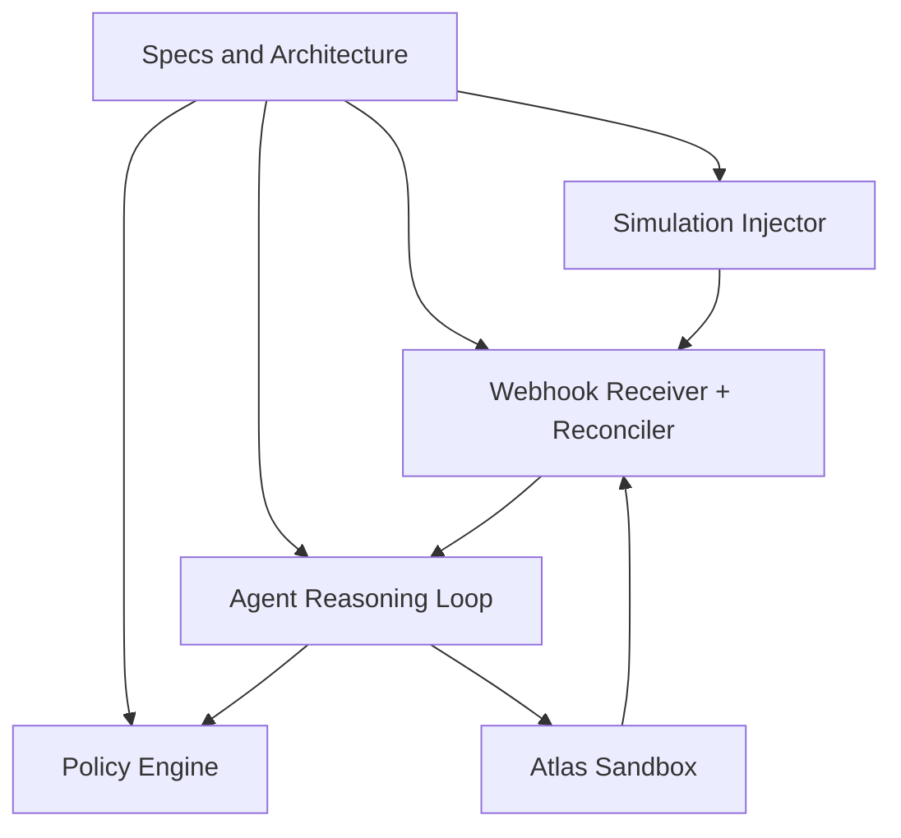
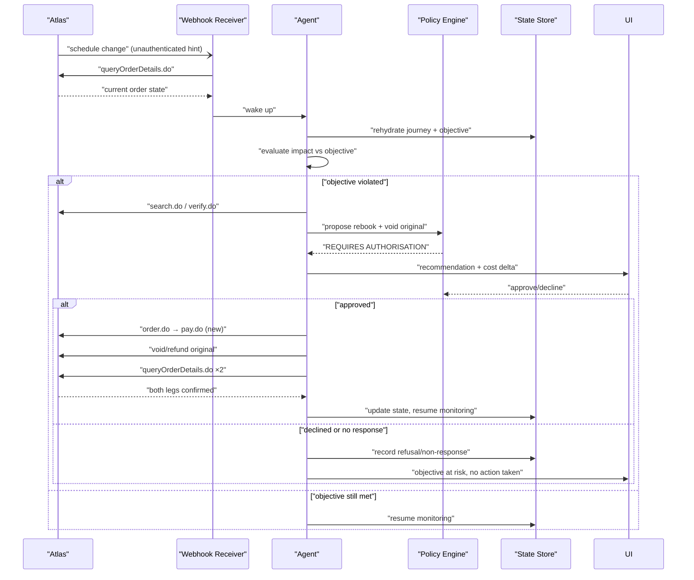
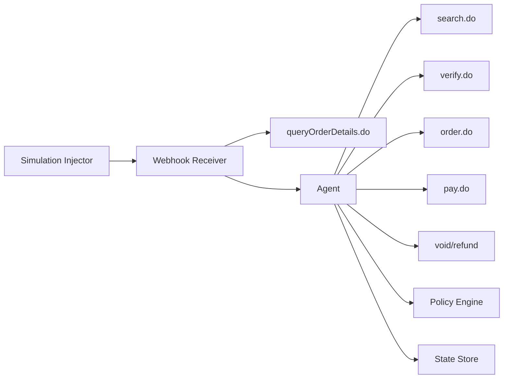

# Disruption Handling

<cite>
**Referenced Files in This Document**
- [architecture.md](file://.antabay/architecture.md)
- [specs.md](file://.antabay/specs.md)
- [demo-scenario.md](file://.antabay/demo-scenario.md)
- [demo-sequence.md](file://.antabay/demo-sequence.md)
- [webhook_order_ticketed.json](file://fixtures/atlas/webhook_order_ticketed.json)
- [sel_tyo_search.json](file://fixtures/atlas/sel_tyo_search.json)
- [sel_tyo_verify.json](file://fixtures/atlas/sel_tyo_verify.json)
</cite>

## Table of Contents
1. [Introduction](#introduction)
2. [Project Structure](#project-structure)
3. [Core Components](#core-components)
4. [Architecture Overview](#architecture-overview)
5. [Detailed Component Analysis](#detailed-component-analysis)
6. [Dependency Analysis](#dependency-analysis)
7. [Performance Considerations](#performance-considerations)
8. [Troubleshooting Guide](#troubleshooting-guide)
9. [Conclusion](#conclusion)
10. [Appendices](#appendices)

## Introduction
This document explains the Disruption Handling system for flight schedule changes and other disruptions. It focuses on how untrusted webhook events from Atlas are received, reconciled with authoritative data, used to evaluate impact against traveler objectives, and how recovery is proposed, authorized, executed, and verified. It also covers testing via a simulation injector, monitoring and alerting strategies, and edge cases such as duplicate webhooks, network failures, and conflicting recovery proposals.

The system enforces three core principles:
- Webhooks are untrusted hints; authoritative truth comes from querying the provider API.
- The agent reasons but never decides authority; a deterministic policy engine gates actions that spend money or alter bookings.
- Every travel fact shown to the traveler traces back to an external response.

These principles ensure safe, auditable disruption handling even under failure conditions.

## Project Structure
The repository contains design and scenario documents plus fixtures that represent real sandbox responses. These artifacts define the disruption flow and provide concrete payloads used by tests and demonstrations.

**Diagram sources**
- [architecture.md:19-78](file://.antabay/architecture.md#L19-L78)
- [specs.md:273-299](file://.antabay/specs.md#L273-L299)

**Section sources**
- [architecture.md:19-78](file://.antabay/architecture.md#L19-L78)
- [specs.md:273-299](file://.antabay/specs.md#L273-L299)

## Core Components
- Webhook receiver and reconciler: Accepts unauthenticated events (e.g., order.ticketed, schedule change), validates shape, and treats them as hints. It then queries the authoritative API to reconcile state before waking the agent.
- Agent reasoning loop: Rehydrates journey state and objective, evaluates impact, searches alternatives, verifies options, proposes recovery, and persists outcomes.
- Policy engine: Deterministic authorization gate for actions that spend money, void/refund, or otherwise alter bookings.
- Simulation injector: Emits simulated disruption events mirroring the documented webhook envelope, labeled SIMULATED, to drive end-to-end tests without relying on provider-triggered events.
- Journey state store: Persists journeys, objectives, clocks, audit trail, and authorizations so the agent can rehydrate after restarts.

Key constraints enforced across components:
- Untrusted webhooks must be reconciled via queryOrderDetails.do before any action.
- All three clocks (search offer, verify session, ticket limit) are tracked and respected.
- Every decision is recorded with rationale and rule references.

**Section sources**
- [architecture.md:19-78](file://.antabay/architecture.md#L19-L78)
- [specs.md:273-299](file://.antabay/specs.md#L273-L299)

## Architecture Overview
The disruption handling path integrates the webhook receiver, agent, policy engine, and Atlas tool layer. The receiver does not trust incoming events; it always calls the authoritative API to confirm current order state. On confirmed disruption, the agent wakes, rehydrates, evaluates impact, and proposes recovery if objectives are violated. Recovery requires policy approval when it spends money or voids bookings. Execution is followed by independent verification of both legs before updating state.

**Diagram sources**
- [architecture.md:152-208](file://.antabay/architecture.md#L152-L208)
- [demo-sequence.md:71-109](file://.antabay/demo-sequence.md#L71-L109)

**Section sources**
- [architecture.md:152-208](file://.antabay/architecture.md#L152-L208)
- [demo-sequence.md:71-109](file://.antabay/demo-sequence.md#L71-L109)

## Detailed Component Analysis

### Webhook Receiver and Reconciler
Responsibilities:
- Receive unauthenticated webhook payloads (e.g., order.ticketed, schedule change).
- Validate payload shape and normalize fields per the capability contract.
- Treat all webhooks as hints; call queryOrderDetails.do to obtain authoritative truth.
- If disruption is confirmed, wake the agent with context (journey id, event type, normalized data).
- Handle duplicates by deduplication keys (e.g., orderNo, event type, timestamp) and avoid redundant processing.

Data model highlights:
- Incoming envelopes include metadata like method, path, headers, raw body, and parsed JSON body.
- For ticketed events, paxTicketInfos includes airlinePNRs and ticketNos.
- Schedule change events carry updated arrival/departure times and status.

Reconciliation logic:
- Compare webhook claim with queryOrderDetails result.
- Only proceed if authoritative data confirms the disruption or ticketing state.
- Persist reconciliation outcome in the audit trail.

Edge cases:
- Duplicate webhooks: Idempotent processing keyed by event identity; ignore repeats.
- Malformed payloads: Reject early with structured error and log details.
- Network failures: Retry with backoff; do not wake agent until reconciliation succeeds.

**Section sources**
- [webhook_order_ticketed.json:1-53](file://fixtures/atlas/webhook_order_ticketed.json#L1-L53)
- [architecture.md:19-78](file://.antabay/architecture.md#L19-L78)
- [specs.md:303-398](file://.antabay/specs.md#L303-L398)

### Impact Evaluation
Purpose:
- Determine whether a schedule change violates hard constraints in the traveler’s objective (e.g., latest arrival time, budget, connection rules).
- Quantify the violation margin (e.g., new arrival exceeds deadline by X minutes).
- Decide whether to continue monitoring or initiate recovery search.

Inputs:
- Current order state from authoritative query.
- Confirmed objective with hard vs soft constraints.
- Relevant clocks and deadlines.

Processing:
- Compare new arrival time against deadline.
- Check budget implications if recovery costs are known.
- Evaluate connection constraints (e.g., overnight layovers excluded).
- Produce a clear rationale for violation or compliance.

Outputs:
- Decision: objective met or violated.
- If violated: trigger recovery search with candidate alternatives.

**Section sources**
- [specs.md:675-766](file://.antabay/specs.md#L675-L766)
- [demo-scenario.md:81-118](file://.antabay/demo-scenario.md#L81-L118)
- [demo-sequence.md:71-89](file://.antabay/demo-sequence.md#L71-L89)

### Recovery Search and Recommendation
Process:
- Search current options using search.do with objective parameters.
- Verify promising candidates via verify.do to lock pricing and availability.
- Score alternatives against objective and compute cost deltas relative to the existing booking.
- Present recommendations with rationale, including constraint satisfaction and cost impact.

Example scenario:
- Original option ZE605 arrives 09:50; schedule change pushes arrival to 11:50, violating the 10:00 deadline.
- Alternatives: LJ201 arrives 09:55 with small additional cost; TW237 arrives earlier but breaks budget.
- Recommendation: choose LJ201 to preserve objective within budget.

Authorization workflow:
- Any recovery that spends money and voids/refunds the original triggers policy review.
- Policy returns REQUIRES AUTHORISATION; UI presents recommendation, cost delta, and objective impact.
- Human approves or declines; silence counts as refusal.

Execution and verification:
- Create and pay for new order; initiate void/refund for original.
- Independently verify both legs via queryOrderDetails before updating state.
- Resume monitoring once both legs are confirmed.

**Section sources**
- [demo-scenario.md:92-118](file://.antabay/demo-scenario.md#L92-L118)
- [demo-sequence.md:81-109](file://.antabay/demo-sequence.md#L81-L109)
- [architecture.md:152-208](file://.antabay/architecture.md#L152-L208)

### Simulation Injector
Purpose:
- Emit simulated disruption events that mirror the documented webhook envelope shape.
- Label events as SIMULATED in interface and logs to distinguish from provider-originated events.
- Enable end-to-end testing without relying on provider-triggered schedule changes.

Behavior:
- Injects events into the webhook receiver endpoint.
- Includes necessary fields (cid, type, status, data) consistent with Atlas webhook contracts.
- Supports replay and controlled timing for test scenarios.

Testing value:
- Validates reconciliation, impact evaluation, recovery proposal, authorization, execution, and verification paths.
- Ensures robustness against duplicates and malformed inputs.

**Section sources**
- [architecture.md:19-78](file://.antabay/architecture.md#L19-L78)
- [specs.md:273-299](file://.antabay/specs.md#L273-L299)
- [demo-scenario.md:81-90](file://.antabay/demo-scenario.md#L81-L90)

### Monitoring and Alerting Strategies
Monitoring:
- Track webhook receipt rate, reconciliation latency, and success/failure ratios.
- Monitor agent wake-ups, impact evaluations, recovery proposals, and approvals.
- Observe Atlas call budgets and clock expirations to prevent loops and stale states.

Alerting:
- Alert on reconciliation failures, repeated duplicate webhooks beyond thresholds, and prolonged impacts without resolution.
- Alert on policy denials or non-responses that leave objectives at risk.
- Alert on excessive Atlas calls indicating potential loops or misconfiguration.

Operational visibility:
- Structured trace and audit log capture every external call, decision, and authorization.
- Console displays expiry clocks and active simulation status for transparency.

**Section sources**
- [architecture.md:19-78](file://.antabay/architecture.md#L19-L78)
- [specs.md:303-398](file://.antabay/specs.md#L303-L398)

## Dependency Analysis
Disruption handling depends on several components and external services:

Coupling and cohesion:
- Receiver is decoupled from agent logic; it only normalizes and reconciles events.
- Agent encapsulates reasoning and orchestration; policy engine isolates authorization decisions.
- External dependencies are bounded to the Atlas tool layer with strict contracts.

Potential circular dependencies:
- None observed; flows are directed from receiver to agent to tools and back to state.

External integration points:
- Atlas endpoints: search, verify, order, pay, queryOrderDetails, void/refund.
- Model service for reasoning (Qwen), separated from authority decisions.

**Diagram sources**
- [architecture.md:19-78](file://.antabay/architecture.md#L19-L78)

**Section sources**
- [architecture.md:19-78](file://.antabay/architecture.md#L19-L78)

## Performance Considerations
- Minimize unnecessary reconciliation calls by deduplicating webhooks and caching short-lived reconciliation results where safe.
- Respect provider rate limits and wait instructions; enforce per-journey call budgets to avoid loops.
- Use efficient scoring and filtering to reduce search and verify calls during recovery.
- Keep UI updates lightweight; stream agent trace events rather than polling.

[No sources needed since this section provides general guidance]

## Troubleshooting Guide
Common issues and resolutions:
- Duplicate webhooks: Ensure idempotent processing keyed by event identity; ignore repeats after first successful reconciliation.
- Network failures: Implement retry with exponential backoff; surface errors to audit log and console; do not proceed without authoritative confirmation.
- Conflicting recovery proposals: Rank options deterministically by objective fit and cost delta; present top recommendation with rationale; require explicit approval for irreversible actions.
- Stale offers or sessions: Detect expired clocks; return to search phase; inform user of time pressure.
- Payment success without ticketing: Always confirm via queryOrderDetails; treat payment as provisional until tickets are issued.

Operational checks:
- Verify webhook payload shape and required fields.
- Confirm reconciliation succeeded before waking agent.
- Review policy decisions and authorization outcomes.
- Inspect audit trail for every external call and decision.

**Section sources**
- [specs.md:303-398](file://.antabay/specs.md#L303-L398)
- [demo-sequence.md:114-142](file://.antabay/demo-sequence.md#L114-L142)

## Conclusion
The Disruption Handling system provides a robust, auditable path from untrusted webhook events to verified recovery actions. By treating webhooks as hints, reconciling with authoritative data, evaluating impact against traveler objectives, and gating execution through a deterministic policy engine, the system ensures safety and correctness. The simulation injector enables comprehensive testing, while monitoring and alerting support operational reliability. This approach scales to handle edge cases like duplicates, network failures, and conflicting proposals, maintaining traveler objectives under disruption.

[No sources needed since this section summarizes without analyzing specific files]

## Appendices

### Example Disruption Scenarios
- Schedule change pushes arrival past deadline: Evaluate impact, propose alternative within budget, seek authorization, execute, verify both legs.
- No viable alternatives: Record objective at risk; notify traveler; await further instructions.
- Multiple schedule changes arriving rapidly: Deduplicate; reconcile latest state; avoid redundant processing.

### Cost-Benefit Analysis Patterns
- Compare cost delta vs objective preservation: Prefer minimal cost that satisfies hard constraints.
- Consider scarcity and sell-out risk: Factor into recommendation stability.
- Document rationale for rejected options: Name violated constraints and margins.

### Authorization Workflows
- Actions spending money or voiding bookings require explicit approval.
- Silence counts as refusal; record non-response.
- Approvals persist in audit trail with rule citations.

### State Reconciliation After Execution
- Verify new order ticketing via queryOrderDetails.
- Verify original order void/refund status.
- Update journey state only after both legs confirmed.

**Section sources**
- [demo-scenario.md:81-118](file://.antabay/demo-scenario.md#L81-L118)
- [demo-sequence.md:71-109](file://.antabay/demo-sequence.md#L71-L109)
- [architecture.md:152-208](file://.antabay/architecture.md#L152-L208)