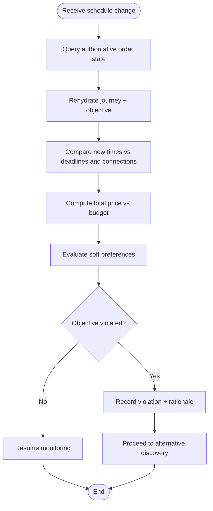
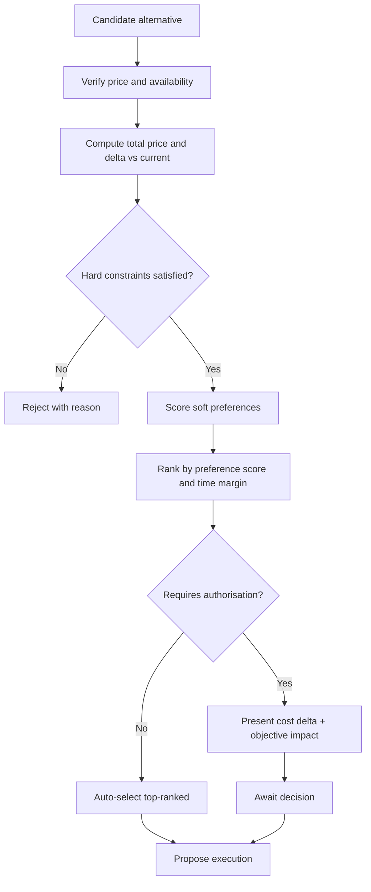
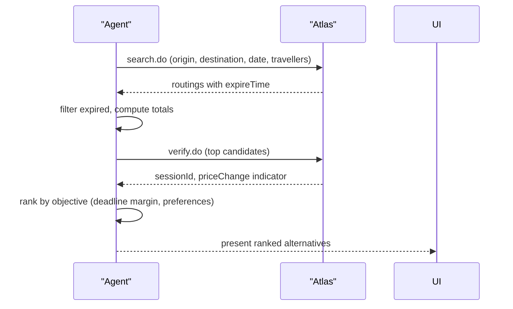
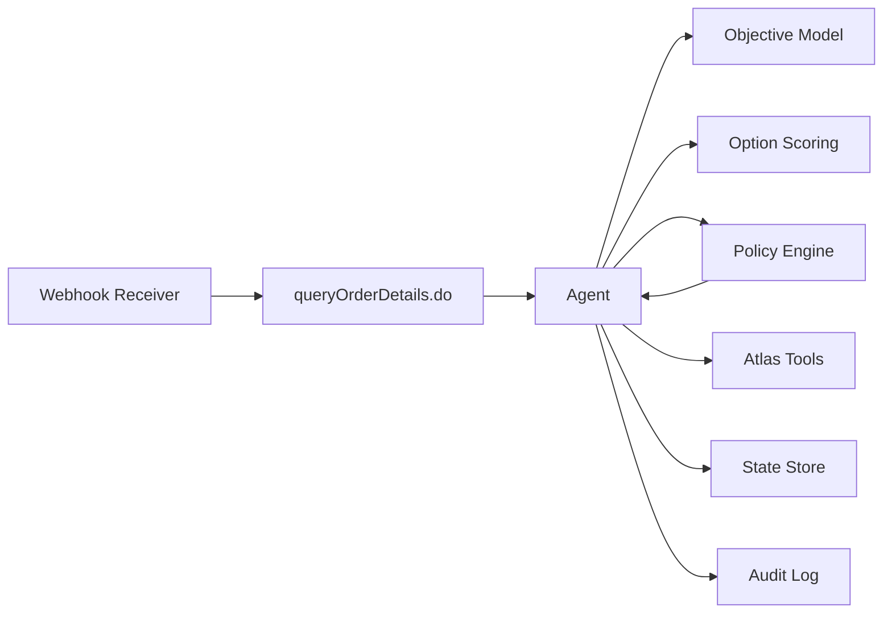

# Impact Evaluation

<cite>
**Referenced Files in This Document**
- [architecture.md](file://.antabay/architecture.md)
- [specs.md](file://.antabay/specs.md)
- [demo-scenario.md](file://.antabay/demo-scenario.md)
- [sel_tyo_search.json](file://fixtures/atlas/sel_tyo_search.json)
- [sel_tyo_verify.json](file://fixtures/atlas/sel_tyo_verify.json)
- [webhook_order_ticketed.json](file://fixtures/atlas/webhook_order_ticketed.json)
</cite>

## Table of Contents
1. Introduction
2. Project Structure
3. Core Components
4. Architecture Overview
5. Detailed Component Analysis
6. Dependency Analysis
7. Performance Considerations
8. Troubleshooting Guide
9. Conclusion

## Introduction
This document explains the Impact Evaluation system that detects whether flight schedule changes violate a traveller’s objectives and generates recovery recommendations. It covers:
- How objective violations are detected by comparing disrupted schedules against hard constraints and soft preferences
- The cost-benefit analysis used to evaluate recovery options (price delta, travel time impact, constraint satisfaction)
- Alternative option discovery under budget and timing constraints
- Recovery recommendation generation with ranked alternatives and clear rationales
- Edge cases such as multi-leg disruptions, partial itinerary changes, and no-suitable-alternative scenarios
- Monitoring metrics for disruption frequency and recovery success rates

The system is grounded in verified external data from the Atlas sandbox and enforces deterministic authorisation before any money moves or bookings are cancelled.

## Project Structure
At a high level, the system comprises:
- A FastAPI backend hosting an agent with its own ReAct loop
- An authorisation policy engine that decides whether actions require human approval
- A webhook receiver that ingests untrusted hints and reconciles them with authoritative queries
- A disruption injector for testing and demonstration
- External tooling via the Atlas contract (search, verify, order, pay, query details, void/refund)
- Durable state storage for journeys, objectives, orders, clocks, and audit trails

```mermaid
graph TB
T["Traveller"]
UI["Journey Console"]
AG["Antabay Agent"]
POL["Policy Engine"]
RX["Webhook Receiver"]
INJ["Disruption Injector"]
AT["Atlas Sandbox"]
DB[("State Store")]
LOG["Audit Log"]
T --> UI
UI --> AG
AG < --> POL
AG < --> DB
AG --> AT
RX --> AG
INJ --> RX
AG --> LOG
```

**Diagram sources**
- [architecture.md:21-78](file://.antabay/architecture.md#L21-L78)

**Section sources**
- [architecture.md:19-86](file://.antabay/architecture.md#L19-L86)

## Core Components
- Objective model: structured goals with hard constraints and soft preferences, persisted per journey
- Option scoring: evaluates search results against the objective, eliminating hard-constraint violators and ranking by preferences
- Price verification and staleness management: re-verifies offers and sessions before commitment
- Booking path: creates orders, processes payments, and confirms ticketing through authoritative queries
- Webhook receiver and reconciler: treats events as untrusted hints; verifies via provider API before waking the agent
- Disruption injector: emits simulated schedule-change events for testing
- Policy engine: deterministic decisions on whether actions require human authorisation
- Impact evaluation and recovery: triggered when schedule changes violate objectives; searches alternatives, scores them, and proposes recovery

**Section sources**
- [specs.md:429-530](file://.antabay/specs.md#L429-L530)
- [specs.md:675-766](file://.antabay/specs.md#L675-L766)
- [specs.md:949-1029](file://.antabay/specs.md#L949-L1029)
- [specs.md:1059-1143](file://.antabay/specs.md#L1059-L1143)
- [specs.md:1396-1478](file://.antabay/specs.md#L1396-L1478)
- [specs.md:1508-1582](file://.antabay/specs.md#L1508-L1582)
- [specs.md:1272-1365](file://.antabay/specs.md#L1272-L1365)

## Architecture Overview
Impact evaluation is part of the monitoring-to-recovery lifecycle. When a schedule change arrives, the system:
1. Receives the event (real or simulated)
2. Verifies the claim against the provider’s authoritative query
3. Rehydrates the journey and objective
4. Evaluates whether the new schedule violates the objective
5. If violated, searches current alternatives, verifies them, scores them, and proposes recovery
6. Routes the proposal through the policy engine for authorisation if it spends money or cancels bookings
7. Executes only after explicit approval, then verifies outcomes independently

```mermaid
sequenceDiagram
participant T as "Traveller"
participant INJ as "Injector (SIM)"
participant RX as "Webhook Receiver"
participant AG as "Agent"
participant POL as "Policy Engine"
participant AT as "Atlas"
participant DB as "State Store"
T->>INJ : trigger disruption
INJ-)RX : schedule change event
RX->>AT : queryOrderDetails.do
AT-->>RX : current order state
RX-)AG : wake up
AG->>DB : rehydrate journey + objective
AG->>AG : evaluate impact vs objective
alt objective violated
AG->>AT : search.do (current options)
AT-->>AG : options
AG->>AT : verify.do (top candidates)
AT-->>AG : confirmed price/session
AG->>POL : propose rebook + void original
POL-->>AG : REQUIRES AUTHORISATION
AG->>UI : show cost delta + objective impact
T->>UI : approve/decline
opt approved
AG->>AT : order.do → pay.do (new)
AT-->>AG : new orderNo
AG->>AT : void / refund original
AG->>AT : queryOrderDetails.do (both legs)
AT-->>AG : confirmed
AG->>DB : update state, resume monitoring
else declined
AG->>DB : record refusal, no spend
AG->>UI : objective at risk, no action taken
end
else objective still met
AG->>DB : continue monitoring
end
```

**Diagram sources**
- [architecture.md:152-208](file://.antabay/architecture.md#L152-L208)

**Section sources**
- [architecture.md:152-208](file://.antabay/architecture.md#L152-L208)

## Detailed Component Analysis

### Objective Violation Detection
- Inputs: current itinerary (from authoritative query), traveller’s structured objective (hard constraints and soft preferences)
- Process:
  - Compare new arrival/departure times against deadlines and connection rules
  - Check budget compliance using canonical total-price calculation
  - Evaluate connection acceptability (e.g., overnight connections excluded)
  - Compute margin to deadline and quantify preference satisfaction
- Output: violation flag with rationale naming which hard constraint(s) were broken and how much the objective is at risk



**Section sources**
- [specs.md:429-530](file://.antabay/specs.md#L429-L530)
- [specs.md:675-766](file://.antabay/specs.md#L675-L766)
- [specs.md:1396-1478](file://.antabay/specs.md#L1396-L1478)

### Cost-Benefit Analysis Framework
- Price comparison: compute delta between current position and candidate alternatives using the canonical total-price calculation; treat provider-reported price changes as authoritative
- Travel time impact: measure margin to deadline, connection durations, and overnight constraints; prefer options that preserve or improve margins without violating hard constraints
- Constraint satisfaction scoring: score each candidate against hard constraints (must satisfy) and soft preferences (rank by best fit); eliminate any option that breaks a hard constraint
- Authorisation gate: any recovery that spends money or voids/cancels bookings requires deterministic policy approval; proposals include cost delta and objective impact



**Section sources**
- [specs.md:675-766](file://.antabay/specs.md#L675-L766)
- [specs.md:949-1029](file://.antabay/specs.md#L949-L1029)
- [specs.md:1272-1365](file://.antabay/specs.md#L1272-L1365)

### Alternative Option Discovery
- Triggered when objective is violated
- Searches current inventory via provider API; respects offer/session freshness windows
- Filters out expired offers; re-verifies top candidates to confirm price and seats
- Applies objective-based elimination and ranking; presents top-ranked compliant alternatives



**Diagram sources**
- [architecture.md:152-208](file://.antabay/architecture.md#L152-L208)

**Section sources**
- [specs.md:565-646](file://.antabay/specs.md#L565-L646)
- [specs.md:675-766](file://.antabay/specs.md#L675-L766)
- [specs.md:949-1029](file://.antabay/specs.md#L949-L1029)

### Recovery Recommendation Generation
- Produces ranked alternatives with clear rationales:
  - Why selected (meets deadline, within budget, acceptable connections)
  - Why others rejected (budget exceeded, overnight connection, insufficient margin)
- Presents cost delta relative to current booking and objective impact
- Requires authorisation if the action spends money or voids/cancels bookings

Concrete example from the locked demo scenario:
- Original selection: ZE605 arriving 09:50, USD 90.39
- Disruption pushes arrival past 10:00, violating the deadline
- Alternatives evaluated:
  - LJ201 arrives 09:55, +USD 6.24 delta, preserves deadline, no connection
  - TW237 arrives 09:30, +USD 51.55 delta, but breaks USD 120 budget
- Recommendation: LJ201 with rationale and cost delta; proceeds to authorisation gate

**Section sources**
- [demo-scenario.md:13-118](file://.antabay/demo-scenario.md#L13-L118)
- [specs.md:675-766](file://.antabay/specs.md#L675-L766)
- [specs.md:1272-1365](file://.antabay/specs.md#L1272-L1365)

### Edge Cases
- Multiple disruptions affecting different legs:
  - Rehydrate full itinerary; evaluate each leg’s impact on overall objective; search replacements per affected leg while preserving valid legs
- Partial itinerary changes:
  - Only rebook affected segments; ensure connection feasibility and deadline preservation across remaining legs
- No suitable alternatives exist:
  - Report inability to satisfy all hard constraints; present closest feasible options with explicit trade-offs; await traveller guidance
- Stale offers and sessions:
  - Treat offers as already partially aged; re-verify close to expiry; return to search if verification fails
- Duplicate or uncertain outcomes:
  - Follow every state-changing call with independent query; reconcile duplicates; never repeat uncertain actions

**Section sources**
- [specs.md:565-646](file://.antabay/specs.md#L565-L646)
- [specs.md:949-1029](file://.antabay/specs.md#L949-L1029)
- [specs.md:1059-1143](file://.antabay/specs.md#L1059-L1143)
- [specs.md:1173-1243](file://.antabay/specs.md#L1173-L1243)

### Monitoring Metrics
To assess system performance and reliability, track:
- Disruption frequency: count of schedule-change events per journey/time window
- Recovery initiation rate: percentage of disruptions that trigger alternative search
- Recovery success rate: percentage of disruptions where a compliant alternative is found and executed
- Authorisation outcomes: approvals vs refusals for recovery actions
- Time-to-detect: elapsed time from event receipt to objective violation determination
- Time-to-recover: elapsed time from violation detection to approved recovery execution
- Offer/session expiry handling: number of re-verification cycles due to near-expiry positions

These metrics can be derived from the audit trail and console trace outputs, enabling operational visibility into disruption resilience.

**Section sources**
- [specs.md:800-918](file://.antabay/specs.md#L800-L918)

## Dependency Analysis
Key dependencies and relationships:
- Webhook receiver depends on Atlas query to validate events before waking the agent
- Agent depends on objective model and scoring logic to detect violations and rank alternatives
- Policy engine gates any recovery that involves spending money or cancelling bookings
- State store persists journey, objective, orders, clocks, and audit trail
- Atlas tools provide search, verification, ordering, payment, and querying capabilities



**Diagram sources**
- [architecture.md:21-78](file://.antabay/architecture.md#L21-L78)

**Section sources**
- [architecture.md:21-78](file://.antabay/architecture.md#L21-L78)

## Performance Considerations
- Offer freshness: offers may arrive pre-aged; compute remaining usable time from current time and re-verify early
- Session lifetime: verification transitions to a session-level window; manage expiry carefully to avoid mid-action expiration
- Call budget: enforce per-journey budgets for rate-limited endpoints; avoid loops and redundant calls
- Deterministic scoring: ensure same inputs produce same selections and rationales for reproducibility
- Event stream throughput: interface must handle rapid events without blocking; render provenance and clocks persistently

**Section sources**
- [specs.md:565-646](file://.antabay/specs.md#L565-L646)
- [specs.md:949-1029](file://.antabay/specs.md#L949-L1029)
- [specs.md:800-918](file://.antabay/specs.md#L800-L918)

## Troubleshooting Guide
Common issues and resolutions:
- Webhook claims differ from provider state: always reconcile via authoritative query; do not trust status values in notifications
- Stale or expired offers: re-verify before committing; if unavailable, return to search
- Payment success without tickets: poll order details until ticket numbers appear; do not assume ticketing from payment response
- Duplicate orders: detect duplicate rejection, adopt existing order reference, and resume from actual state
- Unresolved outcomes: reconcile by query; never resolve by repeating actions
- Objective cannot be satisfied: report which constraints conflict; present closest feasible options with explicit trade-offs

Operational checks:
- Verify that every state-changing call is followed by an independent read
- Ensure authorisation was required and granted for any money-moving or cancellation action
- Confirm that simulated events are clearly marked and distinguishable from real events

**Section sources**
- [specs.md:1059-1143](file://.antabay/specs.md#L1059-L1143)
- [specs.md:1173-1243](file://.antabay/specs.md#L1173-L1243)
- [specs.md:1396-1478](file://.antabay/specs.md#L1396-L1478)
- [specs.md:1508-1582](file://.antabay/specs.md#L1508-L1582)

## Conclusion
The Impact Evaluation system provides robust detection of objective violations caused by flight schedule changes and generates recovery recommendations grounded in verified data and deterministic policy. It balances strict adherence to hard constraints with nuanced scoring of soft preferences, ensures financial safety through authorisation gates, and maintains transparency via persistent audit trails and console traces. With clear monitoring metrics and disciplined reconciliation practices, the system delivers reliable, explainable recovery even under complex edge cases.