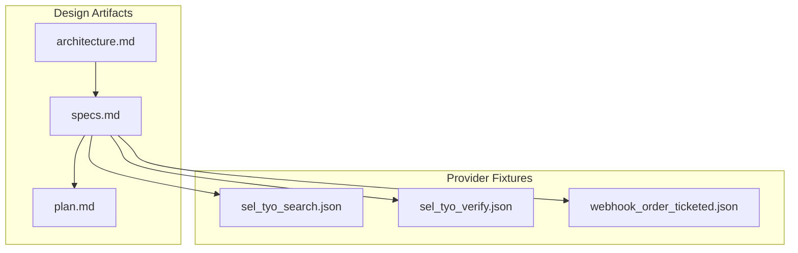
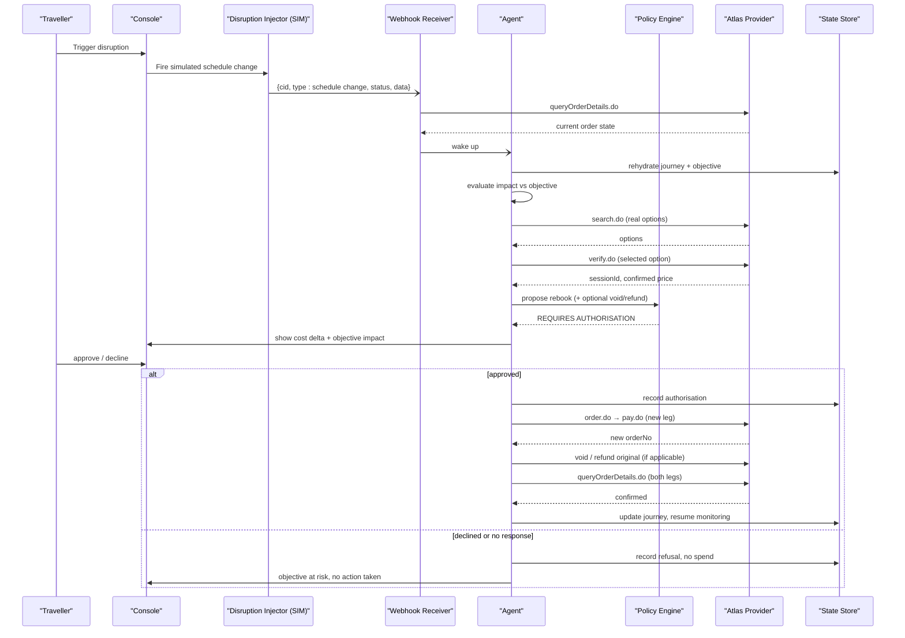
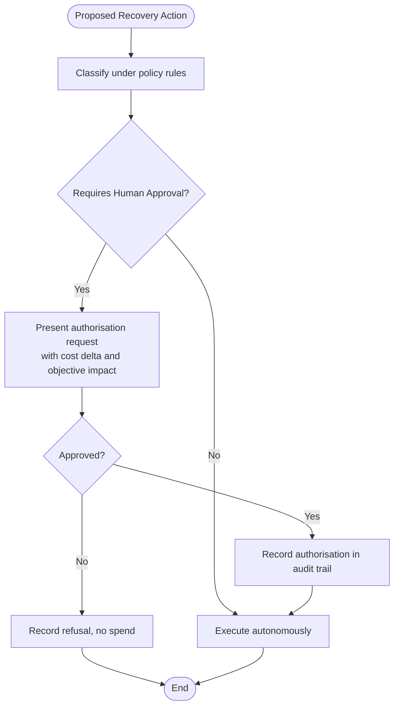
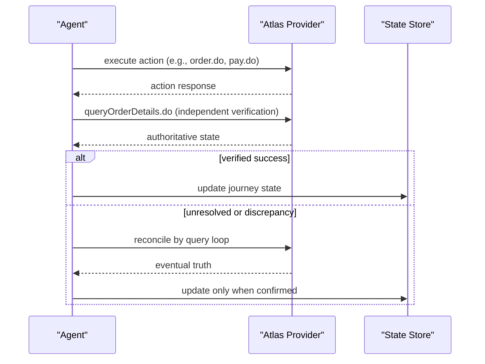
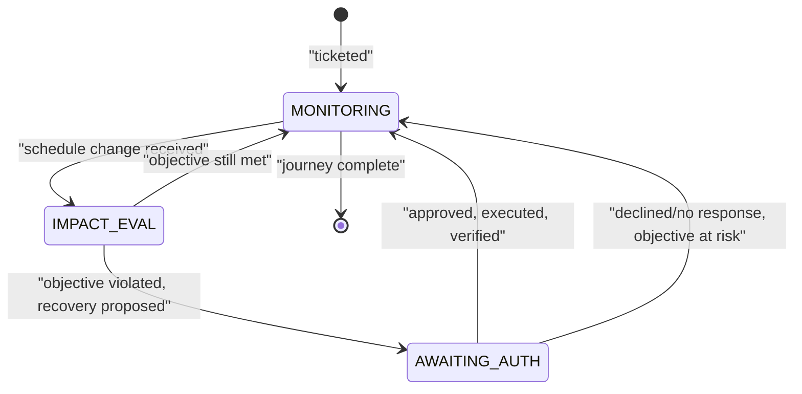
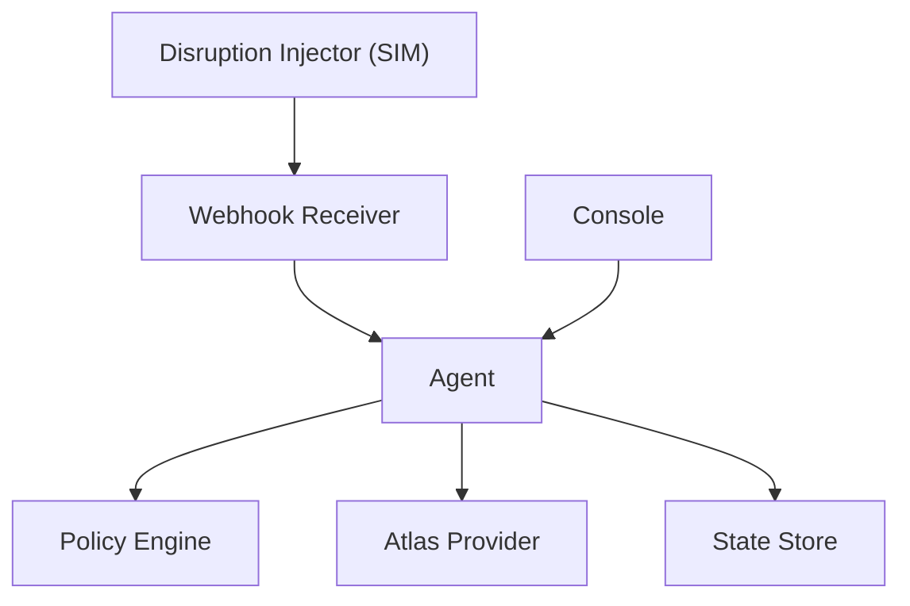

# Recovery Execution

<cite>
**Referenced Files in This Document**
- [architecture.md](file://.antabay/architecture.md)
- [specs.md](file://.antabay/specs.md)
- [plan.md](file://.antabay/plan.md)
- [sel_tyo_search.json](file://fixtures/atlas/sel_tyo_search.json)
- [sel_tyo_verify.json](file://fixtures/atlas/sel_tyo_verify.json)
- [webhook_order_ticketed.json](file://fixtures/atlas/webhook_order_ticketed.json)
</cite>

## Table of Contents
1. [Introduction](#introduction)
2. [Project Structure](#project-structure)
3. [Core Components](#core-components)
4. [Architecture Overview](#architecture-overview)
5. [Detailed Component Analysis](#detailed-component-analysis)
6. [Dependency Analysis](#dependency-analysis)
7. [Performance Considerations](#performance-considerations)
8. [Troubleshooting Guide](#troubleshooting-guide)
9. [Conclusion](#conclusion)

## Introduction
This document explains the Recovery Execution system that implements authorized rebooking decisions and ensures successful disruption recovery. It covers:
- The authorization workflow that obtains human approval for recovery actions, including policy evaluation and cost impact analysis.
- Independent outcome verification to confirm recovery actions were completed by external systems.
- Concrete recovery scenarios such as rebooking on alternative flights and handling related operational changes.
- State reconciliation after recovery completion and audit trail integrity.
- Error handling, rollback strategies, and fallback procedures.
- Monitoring and alerting mechanisms for success rates and execution failures.
- Integration with the policy engine for automated decisions within predefined boundaries.
- Performance considerations for concurrent operations during high-disruption periods.
- Troubleshooting guidance and debugging techniques for failed recovery scenarios.

The documentation is grounded in the verified architecture and specifications captured in this repository.

## Project Structure
The repository contains design and specification artifacts that define the Recovery Execution system:
- Architecture diagrams and sequence flows describing disruption detection, recovery search, authorization, execution, and verification.
- Detailed feature specifications covering journey state, booking path, post-action verification, webhook reception, disruption injection, and authorisation policy.
- Realistic fixtures from the travel provider sandbox used to validate behavior and demonstrate end-to-end flows.

**Section sources**
- [architecture.md:19-86](file://.antabay/architecture.md#L19-L86)
- [specs.md:437-531](file://.antabay/specs.md#L437-L531)
- [plan.md:134-173](file://.antabay/plan.md#L134-L173)

## Core Components
Recovery Execution is composed of several coordinated components:
- Webhook Receiver and Reconciler: Ingests untrusted notifications, confirms them against authoritative APIs, and wakes the agent when a real change is detected.
- Disruption Injector (simulated): Emits schedule-change events for demonstration and testing, always marked as simulated.
- Agent with ReAct Loop: Rehydrates journey state, evaluates objective impact, searches alternatives, proposes recovery actions, and coordinates execution and verification.
- Authorisation Policy Engine: Deterministically classifies whether an action requires human approval based on rules like spending money, voiding bookings, irreversibility, or breaching hard constraints.
- Console and Trace: Streams observable events, displays expiry clocks, and presents authorisation requests with cost and objective impact.
- Post-Action Verification: Independently verifies outcomes via authoritative queries before updating journey state.

These components interact through a durable journey state store and structured audit logs.

**Section sources**
- [architecture.md:19-86](file://.antabay/architecture.md#L19-L86)
- [specs.md:1396-1504](file://.antabay/specs.md#L1396-L1504)
- [specs.md:1508-1582](file://.antabay/specs.md#L1508-L1582)
- [specs.md:1272-1366](file://.antabay/specs.md#L1272-L1366)
- [specs.md:800-919](file://.antabay/specs.md#L800-L919)
- [specs.md:1173-1244](file://.antabay/specs.md#L1173-L1244)

## Architecture Overview
The recovery flow begins with a disruption event, proceeds through impact evaluation and alternative search, then routes through the authorisation gate before executing recovery actions and verifying outcomes.

**Diagram sources**
- [architecture.md:152-208](file://.antabay/architecture.md#L152-L208)
- [specs.md:437-531](file://.antabay/specs.md#L437-L531)

**Section sources**
- [architecture.md:152-208](file://.antabay/architecture.md#L152-L208)
- [specs.md:437-531](file://.antabay/specs.md#L437-L531)

## Detailed Component Analysis

### Authorization Workflow and Policy Evaluation
- Every proposed recovery action is evaluated deterministically by the policy engine without consulting a language model.
- Actions requiring human approval include those that spend money, cancel or void bookings, are irreversible, or breach stated hard constraints.
- The console surfaces the proposed action, its cost relative to the current position, and its effect on the objective; absence of a response is treated as refusal.
- Authorisations are scoped to one specific action and are voided if the cost changes before execution.

**Diagram sources**
- [specs.md:1272-1366](file://.antabay/specs.md#L1272-L1366)
- [specs.md:800-919](file://.antabay/specs.md#L800-L919)

**Section sources**
- [specs.md:1272-1366](file://.antabay/specs.md#L1272-L1366)
- [specs.md:800-919](file://.antabay/specs.md#L800-L919)

### Independent Outcome Verification
- After every state-changing action, the system performs an independent query to the provider’s authoritative interface to confirm the actual outcome.
- For ticketing, only the presence of issued ticket numbers constitutes evidence of success.
- Unverifiable outcomes are treated as unresolved and reconciled by querying rather than repeating actions.
- Discrepancies between action responses and observed state are recorded in the audit trail.

**Diagram sources**
- [specs.md:1173-1244](file://.antabay/specs.md#L1173-L1244)

**Section sources**
- [specs.md:1173-1244](file://.antabay/specs.md#L1173-L1244)

### Recovery Scenarios
- Rebooking on alternative flights: When a schedule change violates the objective, the agent searches and verifies alternatives, proposes a rebook with cost delta, and seeks approval before executing.
- Upgrading cabin classes: If a higher cabin satisfies constraints and remains within budget, it is presented as a recovery option subject to policy classification and approval.
- Arranging ground transportation: Ancillary services can be considered as part of recovery if they help meet the objective; any spend triggers policy evaluation and potential human approval.

Concrete examples are illustrated by the fixture payloads showing search results, verified sessions, and ticketed orders.

**Section sources**
- [architecture.md:152-208](file://.antabay/architecture.md#L152-L208)
- [sel_tyo_search.json:1-800](file://fixtures/atlas/sel_tyo_search.json#L1-L800)
- [sel_tyo_verify.json:1-393](file://fixtures/atlas/sel_tyo_verify.json#L1-L393)
- [webhook_order_ticketed.json:1-53](file://fixtures/atlas/webhook_order_ticketed.json#L1-L53)

### State Reconciliation and Audit Trail Integrity
- Journey state transitions are strictly enforced; recovery moves the journey from monitoring to impact evaluation, then back to monitoring upon successful rebooking.
- All identifiers (offer/session/order references) are preserved unmodified and tracked with freshness windows.
- An append-only audit trail records observations, decisions, external calls, and authorisations with timestamps.
- Duplicate notifications and duplicate-order rejections are handled idempotently; existing orders are adopted and reconciled.

**Diagram sources**
- [architecture.md:212-257](file://.antabay/architecture.md#L212-L257)

**Section sources**
- [architecture.md:212-257](file://.antabay/architecture.md#L212-L257)
- [specs.md:437-531](file://.antabay/specs.md#L437-L531)

### Error Handling, Rollback, and Fallback Strategies
- Untrusted webhooks are never trusted alone; claims are confirmed via authoritative queries before state changes.
- Duplicate-order rejections are reconcilable: the system reads the existing order reference returned with the rejection and resumes from its actual state.
- Uncertain outcomes are never retried blindly; reconciliation uses queries to determine true state.
- If recovery fails or is refused, the system records the refusal and continues monitoring without unauthorized spend.

**Section sources**
- [specs.md:1396-1504](file://.antabay/specs.md#L1396-L1504)
- [specs.md:1059-1144](file://.antabay/specs.md#L1059-L1144)
- [specs.md:1173-1244](file://.antabay/specs.md#L1173-L1244)

### Monitoring and Alerting Mechanisms
- The console streams events for every external call, decision, and authorisation request, enabling real-time visibility into recovery progress.
- Expiry clocks are persistently displayed with time remaining; spent clocks remain visible to indicate expired positions.
- Simulated events are visually distinguished from provider-originated events to maintain clarity.
- Recorded event streams support replay for demonstrations and tests without contacting external services.

**Section sources**
- [specs.md:800-919](file://.antabay/specs.md#L800-L919)
- [architecture.md:19-86](file://.antabay/architecture.md#L19-L86)

### Integration with Policy Engine for Automated Decisions
- The policy engine enforces deterministic boundaries for autonomous operation; it cannot be overridden by prompts or configuration.
- Rules cover spending money, cancellations/voids, irreversibility, and breaches of hard constraints.
- Each decision cites the specific rule identifier, ensuring transparency and testability.

**Section sources**
- [specs.md:1272-1366](file://.antabay/specs.md#L1272-L1366)

## Dependency Analysis
Recovery Execution depends on several tightly coupled subsystems:
- Webhook Receiver depends on the Atlas provider’s query API to confirm notifications.
- Agent depends on the policy engine for authority classification and on the provider for search, verification, ordering, payment, and order details.
- Console depends on the event stream emitted by the agent and reconciler.
- State Store persists journey state, objectives, identifiers, and audit trails.

**Diagram sources**
- [architecture.md:19-86](file://.antabay/architecture.md#L19-L86)

**Section sources**
- [architecture.md:19-86](file://.antabay/architecture.md#L19-L86)

## Performance Considerations
- Concurrency: During high-disruption periods, multiple journeys may require simultaneous recovery searches and verifications. Ensure rate limits and call budgets per journey are respected to avoid provider throttling.
- Resource Management: Use session-level freshness windows and offer clocks to minimize redundant calls; prefer earlier re-verification near expiry rather than at the last moment.
- Event Stream Throughput: The console must handle bursts of events without blocking; streaming should not depend on polling.
- Idempotency: Duplicate notifications and duplicate-order rejections must be handled without duplicating work or state changes.

[No sources needed since this section provides general guidance]

## Troubleshooting Guide
Common issues and debugging techniques:
- Notification mismatch: If a webhook claims a change but the provider query contradicts it, treat the notification as untrusted and rely on the authoritative query result.
- Stale offers or sessions: If verification reports price changes or unavailable inventory, return to search and re-evaluate options.
- Unauthorized actions blocked: If an action is blocked by policy, review the cited rule and adjust the proposal to comply with constraints or seek approval.
- Unresolved outcomes: If verification cannot confirm success immediately, continue reconciling by querying until resolved or terminal error occurs.
- Replay and recording: Use recorded event streams to replay journeys offline for debugging without contacting external services.

**Section sources**
- [specs.md:1396-1504](file://.antabay/specs.md#L1396-L1504)
- [specs.md:800-919](file://.antabay/specs.md#L800-L919)
- [specs.md:1173-1244](file://.antabay/specs.md#L1173-L1244)

## Conclusion
The Recovery Execution system provides a robust, auditable, and user-approved pathway to recover disrupted journeys. It integrates webhook ingestion, deterministic policy evaluation, independent verification, and clear observability to ensure safe and effective recovery actions. By adhering to strict state transitions, audit trails, and provider-backed truths, the system maintains integrity even under high-disruption conditions and supports both automated and human-in-the-loop decision-making within well-defined boundaries.

[No sources needed since this section summarizes without analyzing specific files]