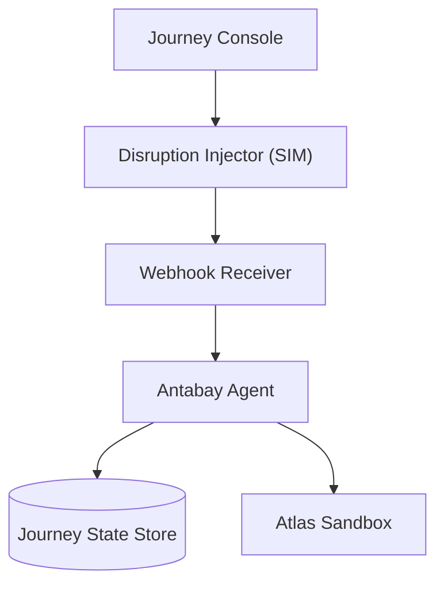
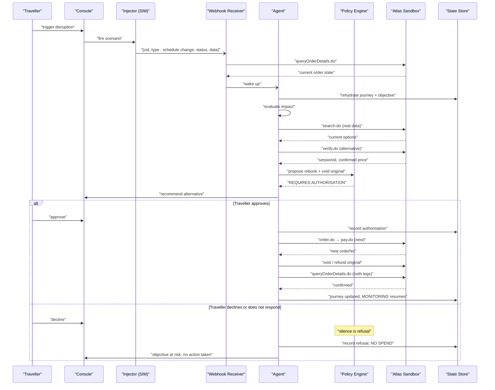
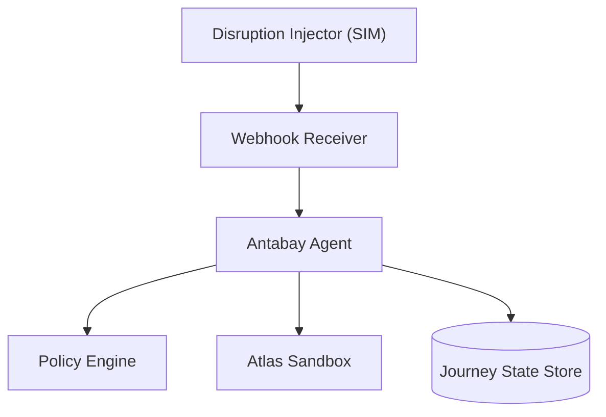

# Simulation Injector

<cite>
**Referenced Files in This Document**
- [architecture.md](file://.antabay/architecture.md)
- [specs.md](file://.antabay/specs.md)
- [atlas-capability-map.md](file://.antabay/atlas-capability-map.md)
- [constitution.md](file://.antabay/constitution.md)
- [demo-scenario.md](file://.antabay/demo-scenario.md)
- [demo-sequence.md](file://.antabay/demo-sequence.md)
</cite>

## Table of Contents
1. Introduction
2. Project Structure
3. Core Components
4. Architecture Overview
5. Detailed Component Analysis
6. Dependency Analysis
7. Performance Considerations
8. Troubleshooting Guide
9. Conclusion
10. Appendices

## Introduction
This document describes the Simulation Injector component used to test disruption scenarios in development and staging environments. The injector simulates schedule changes (and, by extension, other disruption types such as cancellations, delays, gate changes, and equipment swaps) without affecting live production data. It emits events that mirror the Atlas webhook envelope so the system’s webhook receiver and agent can process them exactly as real provider events would be processed. All simulated events are labelled as simulated, and all flight, price, and availability data remain sourced from the sandbox.

The injector is designed for:
- Programmatic triggering via an injection interface
- Console-based triggering during demos or manual tests
- Replayable scenarios for consistent recovery testing
- Isolation from production workflows and real operational data
- Monitoring usage and effectiveness through structured logs and traces

## Project Structure
The project organises simulation-related behaviour under a FastAPI service with a dedicated Disruption Injector module. The injector integrates with the existing Webhook Receiver and Agent components to simulate disruptions while preserving the end-to-end flow.

**Diagram sources**
- [architecture.md:21-78](file://.antabay/architecture.md#L21-L78)

**Section sources**
- [architecture.md:21-78](file://.antabay/architecture.md#L21-L78)

## Core Components
- Disruption Injector (SIM): Emits simulated disruption events into the webhook receiver using the Atlas webhook envelope shape. Events are labelled SIMULATED and never fabricate travel facts.
- Webhook Receiver: Accepts inbound events (real or simulated), treats them as untrusted hints, and triggers reconciliation against authoritative data.
- Antabay Agent: Rehydrates journey state, evaluates impact against objectives, searches alternatives, proposes recovery actions, and executes verified steps.
- Policy Engine: Determines whether high-impact recovery actions require human authorisation.
- Journey State Store: Persists journeys, objectives, clocks, audit trail, and authorisations.

Key responsibilities:
- Injectors must not call external APIs to fabricate inventory; they only trigger event delivery.
- Recovery always uses live sandbox search and verification.
- Every action is followed by authoritative reads before state updates.

**Section sources**
- [architecture.md:21-78](file://.antabay/architecture.md#L21-L78)
- [specs.md:289-291](file://.antabay/specs.md#L289-L291)
- [atlas-capability-map.md:387-391](file://.antabay/atlas-capability-map.md#L387-L391)

## Architecture Overview
The disruption and recovery sequence demonstrates how the injector fits into the overall flow.

**Diagram sources**
- [architecture.md:154-208](file://.antabay/architecture.md#L154-L208)

**Section sources**
- [architecture.md:154-208](file://.antabay/architecture.md#L154-L208)

## Detailed Component Analysis

### Injection Interface
Purpose:
- Allow developers to trigger specific disruption scenarios programmatically or via the console.
- Ensure every injected event conforms to the Atlas webhook envelope shape and is labelled as simulated.

Behaviour:
- Accepts a scenario definition describing the disruption type and affected order/flight context.
- Emits an event into the webhook receiver with fields mirroring the documented envelope structure.
- Labels the event as simulated in the interface and trace.

Constraints:
- Never fabricate flights, prices, or availability.
- Always label simulation clearly per policy.

Example scenario definitions (described, not code):
- Schedule Change: specify affected order, new arrival time, and reason category.
- Cancellation: specify affected order and cancellation reason.
- Delay: specify affected order and new departure/arrival times.
- Gate Change: specify affected order and new gate information.
- Equipment Swap: specify affected order and aircraft/equipment details.

Expected system responses:
- Webhook receiver validates envelope, reconciles with authoritative query, and wakes the agent.
- Agent evaluates impact against the objective and proposes recovery if needed.
- Policy engine may require authorisation for high-impact actions.

**Section sources**
- [atlas-capability-map.md:387-391](file://.antabay/atlas-capability-map.md#L387-L391)
- [constitution.md:82-88](file://.antabay/constitution.md#L82-L88)
- [specs.md:289-291](file://.antabay/specs.md#L289-L291)

### Scenario Definitions and Payloads
Payload shape:
- Envelope mirrors the documented webhook structure with fields like cid, type, status, and data.
- For schedule changes, include order context and updated timing or status fields.

Rules:
- Use the same envelope shape as real webhooks to exercise the full pipeline.
- Mark simulation explicitly in the interface and trace.
- Do not invent provider-originated data beyond the fact that a disruption occurred.

Replay capability:
- Persist scenario definitions and emitted events to enable replay.
- Replay ensures consistent reproduction of recovery scenarios across runs.

**Section sources**
- [atlas-capability-map.md:327-378](file://.antabay/atlas-capability-map.md#L327-L378)
- [atlas-capability-map.md:387-391](file://.antabay/atlas-capability-map.md#L387-L391)

### Isolation Mechanisms
Isolation guarantees:
- Simulated events are confined to the event trigger; no fabrication of travel facts.
- All recovery options come from live sandbox search and verification.
- Webhooks are treated as untrusted hints; authoritative queries confirm state.
- Simulation is labelled everywhere to avoid confusion with real provider events.

Operational safeguards:
- No direct writes to production systems from the injector.
- All state changes follow verification and policy authorisation.
- Audit trail records every observation, decision, call, and approval.

**Section sources**
- [constitution.md:82-88](file://.antabay/constitution.md#L82-L88)
- [atlas-capability-map.md:364-378](file://.antabay/atlas-capability-map.md#L364-L378)

### Replay Capability
Capabilities:
- Record scenario definitions and emitted events.
- Replay exact sequences to reproduce recovery paths consistently.
- Use recorded fixtures for Tier 1 CI runs; use live sandbox for Tier 2 validation.

Benefits:
- Deterministic testing of recovery logic.
- Stable locators and explicit waits ensure repeatable results.
- Evidence preserved for judging and debugging.

**Section sources**
- [specs.md:147-155](file://.antabay/specs.md#L147-L155)
- [specs.md:289-291](file://.antabay/specs.md#L289-L291)

### Configuration Options
Control dimensions:
- Scope: which orders or flights are affected by the simulated disruption.
- Timing: when the event is delivered (immediate or scheduled).
- Impact severity: magnitude of delay, cancellation scope, or cost delta implications.
- Labelling: ensure simulation is marked in UI and trace.

Guidelines:
- Keep simulation confined to event triggering.
- Preserve sandbox data integrity; do not alter provider responses.
- Respect rate limits and budgets during recovery testing.

**Section sources**
- [constitution.md:82-88](file://.antabay/constitution.md#L82-L88)
- [atlas-capability-map.md:119-125](file://.antabay/atlas-capability-map.md#L119-L125)

### Integration with Testing Frameworks and CI
Testing tiers:
- Tier 1: Recorded runs against captured responses on every push.
- Tier 2: Live sandbox runs on demand or daily, consuming balance and rate budget.

Integration points:
- Injector scenarios are part of end-to-end journeys.
- Assertions made against observable Atlas state after execution.
- Reports, traces, and logs retained as evidence.

Automation principles:
- Deterministic runs with stable locators and explicit waits.
- Tests create and clean their own data.
- Coverage targets roughly 70% unit, 20% integration, 10% end-to-end.

**Section sources**
- [specs.md:147-155](file://.antabay/specs.md#L147-L155)
- [specs.md:289-291](file://.antabay/specs.md#L289-L291)

### Monitoring Capabilities
Tracking:
- Structured trace and audit log record every observation, decision, call, and approval.
- Injector emissions logged with scenario metadata and labels.
- Provenance footer shows sandbox status, reasoning model, and active simulation.

Effectiveness metrics:
- Frequency of injected scenarios and recovery outcomes.
- Authorisation rates and refusal reasons.
- Time-to-recovery and cost deltas observed during recovery.

**Section sources**
- [architecture.md:32-42](file://.antabay/architecture.md#L32-L42)
- [constitution.md:75-77](file://.antabay/constitution.md#L75-L77)

### Creating New Simulation Scenarios
Steps:
- Define scenario type (schedule change, cancellation, delay, gate change, equipment swap).
- Specify affected order/flight context and impact parameters.
- Emit event using the injector interface with the correct envelope shape.
- Label simulation in UI and trace.
- Verify recovery path through search, verify, policy, and execution.

Maintenance:
- Update scenarios as external APIs evolve.
- Keep payloads aligned with documented webhook shapes.
- Retain fixtures from live sandbox runs; avoid handwritten data.

**Section sources**
- [atlas-capability-map.md:327-378](file://.antabay/atlas-capability-map.md#L327-L378)
- [atlas-capability-map.md:387-391](file://.antabay/atlas-capability-map.md#L387-L391)
- [specs.md:147-155](file://.antabay/specs.md#L147-L155)

## Dependency Analysis
The injector depends on the webhook receiver and integrates with the agent and policy engine through established flows.

**Diagram sources**
- [architecture.md:21-78](file://.antabay/architecture.md#L21-L78)

**Section sources**
- [architecture.md:21-78](file://.antabay/architecture.md#L21-L78)

## Performance Considerations
- Respect provider rate limits and per-journey call budgets during recovery.
- Avoid retry loops; honour wait instructions.
- Keep simulation lightweight; focus on event emission and labelling.
- Use recorded fixtures for fast CI runs; reserve live sandbox runs for validation.

[No sources needed since this section provides general guidance]

## Troubleshooting Guide
Common issues and resolutions:
- Event not received: verify webhook URL registration and injector emission.
- Incorrect payload shape: align with documented envelope structure.
- Unexpected state changes: ensure simulation is labelled and only affects event trigger.
- Recovery failures: check authoritative queries and policy authorisation outcomes.
- Rate limit errors: honour retry-after and reduce call frequency.

Verification practices:
- Treat webhooks as untrusted hints; confirm with authoritative queries.
- Follow P-05: write is not proof; read is proof.
- Record and preserve reports, traces, and logs as evidence.

**Section sources**
- [atlas-capability-map.md:364-378](file://.antabay/atlas-capability-map.md#L364-L378)
- [constitution.md:46-58](file://.antabay/constitution.md#L46-L58)

## Conclusion
The Simulation Injector enables safe, isolated testing of disruption scenarios by emitting realistic webhook envelopes into the existing receiver and agent pipeline. It preserves honesty about simulation, confines fabrication to the event trigger, and ensures all recovery relies on live sandbox data. With replay, monitoring, and CI integration, teams can consistently reproduce and validate recovery workflows while protecting production data and workflows.

[No sources needed since this section summarizes without analyzing specific files]

## Appendices

### Demo Scenario Context
The demo scenario includes a schedule change injection against a selected flight, leading to objective violation and recovery recommendation. The injection is labelled simulated and uses real sandbox data throughout.

**Section sources**
- [demo-scenario.md:81-117](file://.antabay/demo-scenario.md#L81-L117)

### Sequence Diagram Context
The sequence diagram illustrates the full run including disruption injection, agent wake-up, impact evaluation, and recovery execution with authorisation gates.

**Section sources**
- [demo-sequence.md:71-109](file://.antabay/demo-sequence.md#L71-L109)