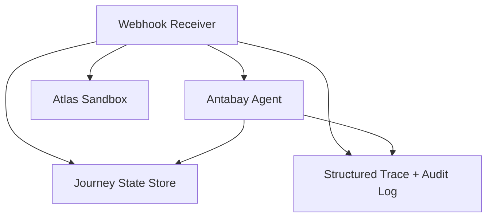
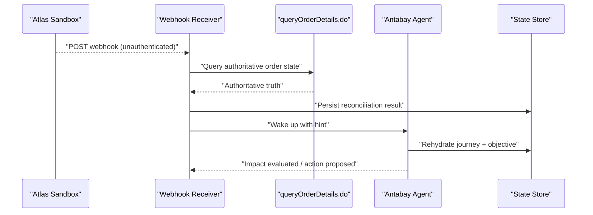
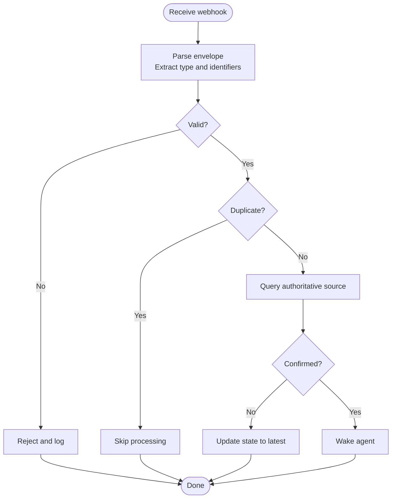
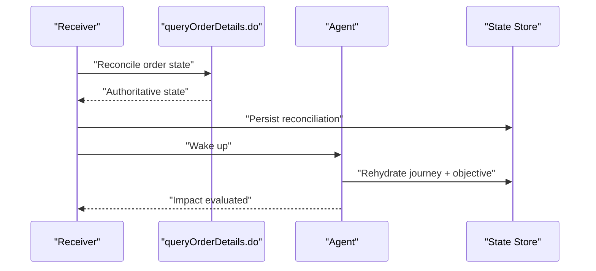
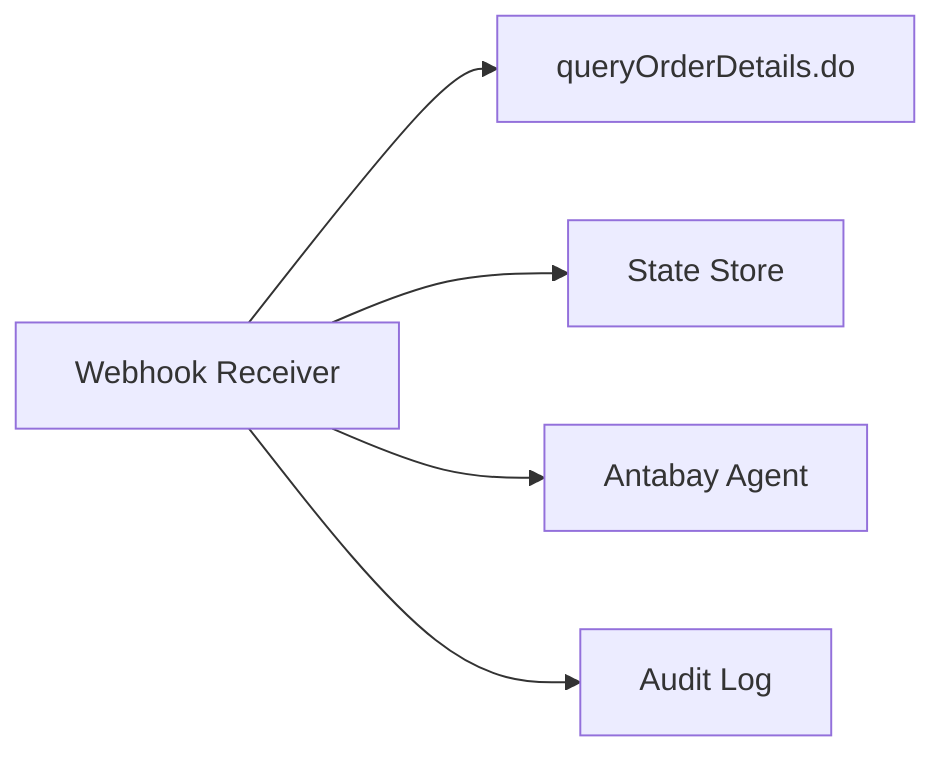

# Webhook Receiver

<cite>
**Referenced Files in This Document**
- [architecture.md](file://.antabay/architecture.md)
- [specs.md](file://.antabay/specs.md)
- [atlas-capability-map.md](file://.antabay/atlas-capability-map.md)
- [webhook_order_ticketed.json](file://fixtures/atlas/webhook_order_ticketed.json)
</cite>

## Table of Contents
1. Introduction
2. Project Structure
3. Core Components
4. Architecture Overview
5. Detailed Component Analysis
6. Dependency Analysis
7. Performance Considerations
8. Troubleshooting Guide
9. Conclusion

## Introduction
This document describes the Webhook Receiver component that ingests untrusted events from the Atlas Travel API, validates them, reconciles with authoritative sources, and triggers disruption evaluation when schedule changes are detected. It covers the event processing pipeline, duplicate detection, ordering guarantees, error handling, security considerations, authentication mechanisms, retry policies, monitoring and alerting, and troubleshooting guidance.

The receiver treats every inbound webhook as an untrusted hint. The only authoritative source for order state is the Atlas query endpoint. On receiving a webhook, the receiver queries the authoritative source to confirm the claim before updating journey state or waking the agent.

**Section sources**
- [architecture.md:19-85](file://.antabay/architecture.md#L19-L85)
- [atlas-capability-map.md:315-378](file://.antabay/atlas-capability-map.md#L315-L378)

## Project Structure
The repository contains design and specification documents plus fixtures captured from live sandbox runs. The relevant pieces for the Webhook Receiver are:
- Architecture diagrams showing the receiver’s role and its interactions with the agent and Atlas.
- Specifications defining the verified contract, including webhook envelope shape and semantics.
- A fixture capturing a real `order.ticketed` webhook envelope for testing and reference.

[No sources needed since this diagram shows conceptual workflow, not actual code structure]

**Section sources**
- [architecture.md:19-85](file://.antabay/architecture.md#L19-L85)
- [specs.md:273-291](file://.antabay/specs.md#L273-L291)

## Core Components
- Webhook Receiver: Ingests HTTP POST payloads, parses the envelope, routes on event type, normalizes fields, and reconciles via the authoritative query endpoint.
- Reconciler: Queries the authoritative source (Atlas) using identifiers present in the webhook to obtain the true state.
- Agent Wake-up: Notifies the long-lived agent process to rehydrate journey state and evaluate impact when disruptions are detected.
- State Store: Persists journey state, objective, clocks, audit trail, and authorisations.
- Structured Logging: Records all webhook ingestion, reconciliation, and wake-up actions for observability.

Key responsibilities enforced by design:
- Untrusted input: never trust webhook content alone; always reconcile.
- Deterministic routing: route on event type field.
- Normalization: handle differing types across surfaces (e.g., integer vs string status).
- Idempotency: deduplicate events and avoid redundant work.

**Section sources**
- [architecture.md:19-85](file://.antabay/architecture.md#L19-L85)
- [atlas-capability-map.md:315-378](file://.antabay/atlas-capability-map.md#L315-L378)

## Architecture Overview
The receiver sits between the external Atlas provider and the internal agent. It receives unauthenticated webhooks, performs reconciliation against the authoritative query endpoint, and wakes the agent to evaluate impact and act if necessary.

**Diagram sources**
- [architecture.md:60-73](file://.antabay/architecture.md#L60-L73)
- [atlas-capability-map.md:315-378](file://.antabay/atlas-capability-map.md#L315-L378)

**Section sources**
- [architecture.md:60-73](file://.antabay/architecture.md#L60-L73)
- [atlas-capability-map.md:315-378](file://.antabay/atlas-capability-map.md#L315-L378)

## Detailed Component Analysis

### Event Ingestion and Validation
- Endpoint: Accepts POST requests with JSON payload.
- Envelope: Contains top-level fields such as client identifier, event type, status, and data.
- Routing: Route on the event type field. For ticketing, the observed type is `order.ticketed`.
- Field normalization: Normalize fields whose type differs across surfaces (for example, order status may be integer in webhooks but string in query responses).
- Security posture: Treat the webhook as untrusted. There is no signature or HMAC; only a non-secret client identifier is present in the body.

Validation steps:
- Parse and validate required envelope fields.
- Validate event type against known set.
- Extract identifiers needed for reconciliation (for example, order number).
- Reject malformed payloads early and log structured errors.

**Section sources**
- [atlas-capability-map.md:315-378](file://.antabay/atlas-capability-map.md#L315-L378)
- [webhook_order_ticketed.json:1-53](file://fixtures/atlas/webhook_order_ticketed.json#L1-L53)

### Reconciliation with Authoritative Sources
- Trigger: After parsing and validating the webhook, call the authoritative query endpoint with the extracted identifiers.
- Truth model: The query response is the single source of truth. Do not mutate journey state based solely on the webhook.
- State update: Only after confirming the claim via the query should the receiver update the journey state and proceed to agent wake-up.

Idempotency and duplicates:
- Deduplicate incoming events by stable identifiers (for example, order number and event type).
- If a duplicate is detected, skip redundant reconciliation and logging.

**Section sources**
- [architecture.md:60-73](file://.antabay/architecture.md#L60-L73)
- [atlas-capability-map.md:315-378](file://.antabay/atlas-capability-map.md#L315-L378)

### Ordering Guarantees and Duplicate Detection
- Ordering: Process events per order in strict sequence. If multiple events arrive for the same order, ensure they are processed in arrival order to avoid inconsistent state transitions.
- Deduplication: Use a combination of event type and order identifier to detect duplicates. Maintain a short-term in-memory or durable index to prevent reprocessing.
- Backpressure: If ordering cannot be guaranteed due to network conditions, buffer and sort by arrival timestamp per order before processing.

[No sources needed since this diagram shows conceptual workflow, not actual code structure]

### Error Handling Strategies
- Malformed payload: Reject immediately and record structured error details.
- Network failures: Retry with backoff respecting provider rate limits and wait instructions.
- Rate limiting: Honor provider wait instructions and do not retry before the instructed interval.
- Reconciliation mismatch: Record discrepancy, persist latest authoritative state, and still wake the agent for evaluation.
- Unknown event type: Log and ignore safely without affecting journey state.

Retry policy guidelines:
- Exponential backoff with jitter.
- Respect provider-specified wait intervals.
- Cap maximum retries to avoid resource exhaustion.
- Fail fast on terminal errors (for example, authentication failures).

**Section sources**
- [specs.md:303-398](file://.antabay/specs.md#L303-L398)
- [atlas-capability-map.md:107-129](file://.antabay/atlas-capability-map.md#L107-L129)

### Authentication Mechanisms
- Webhook authentication: None. The webhook is unauthenticated; there is no signature header or shared secret.
- Client identifier: Present in the body but not secret; cannot be used to authenticate senders.
- API authentication: Outbound calls to Atlas use documented headers for client credentials.

Security implications:
- Always reconcile against the authoritative query endpoint before acting.
- Never trust webhook status codes as success indicators.
- Restrict exposure of the webhook URL and monitor access logs.

**Section sources**
- [atlas-capability-map.md:315-378](file://.antabay/atlas-capability-map.md#L315-L378)

### Agent Wake-up Mechanism
- Trigger: After successful reconciliation indicates a meaningful change (for example, ticketed or schedule change), wake the agent.
- Purpose: The agent rehydrates journey state and objective, evaluates impact, and proposes recovery actions if objectives are violated.
- Flow: Receiver sends a wake-up signal; agent loads state from the store and proceeds with evaluation and potential authorisation flows.

**Diagram sources**
- [architecture.md:60-73](file://.antabay/architecture.md#L60-L73)

**Section sources**
- [architecture.md:60-73](file://.antabay/architecture.md#L60-L73)

### Monitoring and Alerting
- Metrics to collect:
  - Ingestion volume by event type.
  - Reconciliation latency and failure rates.
  - Duplicate detection counts.
  - Agent wake-up frequency.
  - Rate-limit waits and throttling events.
- Alerts:
  - High ingestion failure rate.
  - Reconciliation failures exceeding thresholds.
  - Unexpected spikes in duplicate events.
  - Prolonged delays between payment and ticketed confirmation.
- Observability:
  - Structured logs for every webhook, reconciliation attempt, and wake-up.
  - Audit trail entries for state changes triggered by webhooks.

**Section sources**
- [architecture.md:60-73](file://.antabay/architecture.md#L60-L73)
- [specs.md:303-398](file://.antabay/specs.md#L303-L398)

### Concrete Examples

#### Webhook Payload Structure
A captured webhook envelope includes:
- Top-level fields: client identifier, event type, status, and data.
- Data object: order number, order status, and passenger/ticket information.
- Content type: application/json;charset=UTF-8.
- Delivery method: POST.

Use the fixture file as a reference for the envelope shape and field names.

**Section sources**
- [webhook_order_ticketed.json:1-53](file://fixtures/atlas/webhook_order_ticketed.json#L1-L53)
- [atlas-capability-map.md:315-378](file://.antabay/atlas-capability-map.md#L315-L378)

#### Authentication and Registration
- Webhook registration: Register a public URL with the provider using the documented endpoint. Re-register whenever the public URL changes.
- API authentication: Use documented headers for outbound calls to Atlas.

**Section sources**
- [atlas-capability-map.md:315-378](file://.antabay/atlas-capability-map.md#L315-L378)

#### Retry Policies
- Respect provider rate limits and wait instructions.
- Use exponential backoff with jitter.
- Avoid retry loops; cap retries.
- Treat terminal errors as non-retryable.

**Section sources**
- [specs.md:303-398](file://.antabay/specs.md#L303-L398)
- [atlas-capability-map.md:107-129](file://.antabay/atlas-capability-map.md#L107-L129)

## Dependency Analysis
The receiver depends on:
- Atlas query endpoint for authoritative state.
- Journey state store for persistence and rehydration.
- Agent process for impact evaluation and recovery actions.
- Structured logging for audit and observability.

**Diagram sources**
- [architecture.md:60-73](file://.antabay/architecture.md#L60-L73)

**Section sources**
- [architecture.md:60-73](file://.antabay/architecture.md#L60-L73)

## Performance Considerations
- Minimize reconciliation calls by deduplicating events per order.
- Batch or coalesce rapid successive events for the same order when appropriate.
- Cache recent reconciliation results briefly to reduce repeated queries.
- Respect provider rate limits to avoid throttling and cascading delays.
- Keep payload parsing lightweight and fail fast on malformed inputs.

[No sources needed since this section provides general guidance]

## Troubleshooting Guide
Common issues and remedies:
- Webhook not received:
  - Verify registered URL and network exposure.
  - Check ingress logs for blocked requests.
- Malformed payload:
  - Inspect structured logs for parse errors.
  - Validate envelope schema and required fields.
- Reconciliation failures:
  - Inspect API error codes and messages.
  - Apply retry with backoff and honor wait instructions.
- Duplicate events:
  - Ensure deduplication key includes event type and order identifier.
  - Review duplicate counters and logs.
- Agent not waking:
  - Confirm wake-up signal delivery and agent health.
  - Check state store availability and permissions.

Debugging techniques:
- Enable detailed structured logging for ingestion, validation, reconciliation, and wake-up.
- Correlate events using order identifiers and timestamps.
- Replay captured webhook fixtures through the receiver to validate behavior.
- Monitor metrics for ingestion volume, failure rates, and reconciliation latency.

**Section sources**
- [specs.md:303-398](file://.antabay/specs.md#L303-L398)
- [atlas-capability-map.md:315-378](file://.antabay/atlas-capability-map.md#L315-L378)

## Conclusion
The Webhook Receiver is designed to safely handle untrusted external events by treating them as hints and reconciling against authoritative sources before any state mutation or agent activation. It enforces idempotency, handles duplicates, respects rate limits, and integrates tightly with the agent to evaluate disruption impact. Robust monitoring, structured logging, and clear error handling ensure reliability and maintainability. By following these patterns, the system maintains data consistency and operational resilience even under unreliable or adversarial webhook delivery conditions.

[No sources needed since this section summarizes without analyzing specific files]