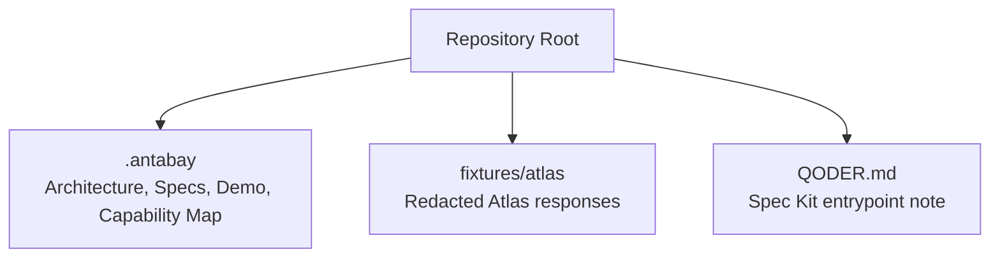
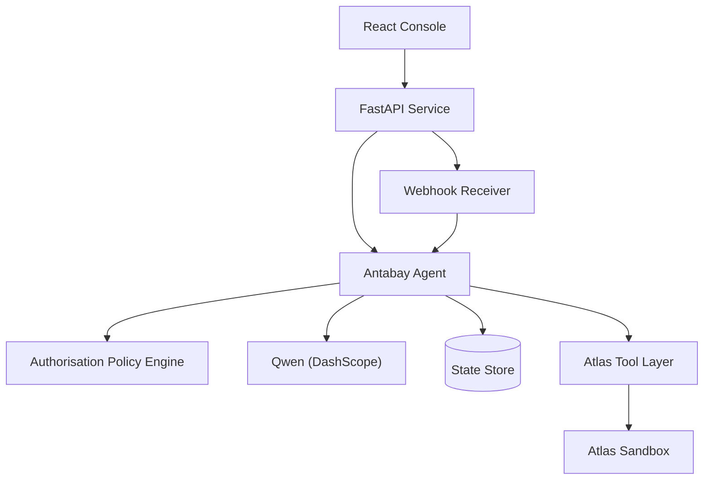
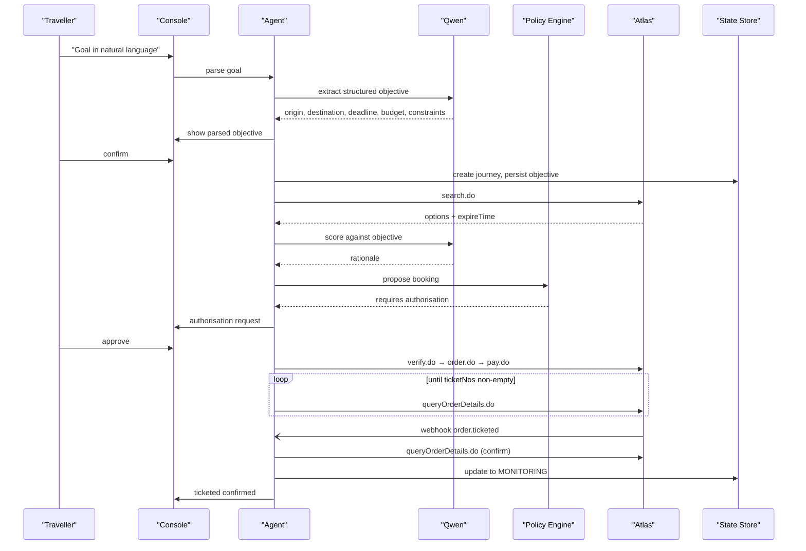
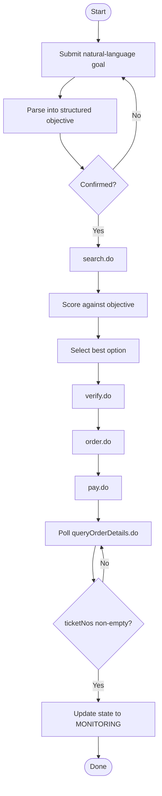
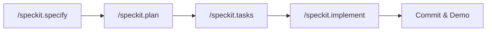
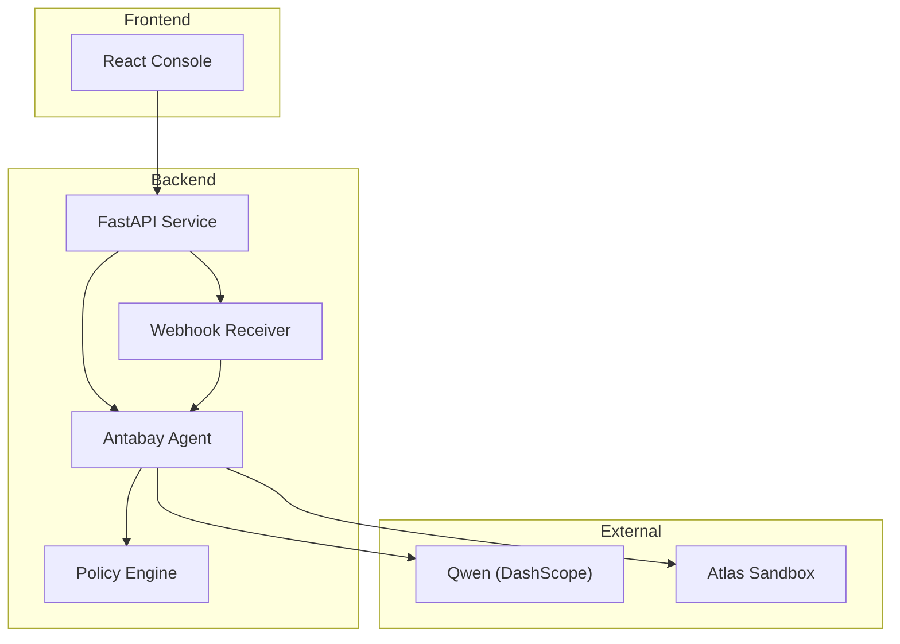

# Getting Started

<cite>
**Referenced Files in This Document**
- [QODER.md](file://QODER.md)
- [plan.md](file://.antabay/plan.md)
- [specs.md](file://.antabay/specs.md)
- [architecture.md](file://.antabay/architecture.md)
- [demo-scenario.md](file://.antabay/demo-scenario.md)
- [atlas-capability-map.md](file://.antabay/atlas-capability-map.md)
- [sel_tyo_search.json](file://fixtures/atlas/sel_tyo_search.json)
- [webhook_order_ticketed.json](file://fixtures/atlas/webhook_order_ticketed.json)
</cite>

## Table of Contents
1. Introduction
2. Project Structure
3. Core Components
4. Architecture Overview
5. Detailed Component Analysis
6. Dependency Analysis
7. Performance Considerations
8. Troubleshooting Guide
9. Conclusion

## Introduction
Antabay is a specification-driven travel agent that turns a natural-language goal into a ticketed booking by orchestrating the Atlas Travel API, a Qwen LLM for reasoning, and a React console for live visibility. It uses Spec Kit to drive development through specifications and maintains a strict contract with Atlas so nothing is invented at runtime.

This guide helps you set up the environment, configure credentials, run the backend service, configure the React console, and execute a simple journey from goal to ticketed booking using the provided fixtures and verified contracts.

## Project Structure
At a high level:
- .antabay contains architecture, specs, demo scenario, capability map, and console mockup used as design references.
- fixtures/atlas holds redacted JSON payloads captured from real Atlas sandbox runs to seed tests and replay flows.
- The root includes guidance files for Spec Kit usage and repository hygiene.

**Diagram sources**
- [plan.md:11-68](file://.antabay/plan.md#L11-L68)
- [specs.md:103-135](file://.antabay/specs.md#L103-L135)

**Section sources**
- [plan.md:11-68](file://.antabay/plan.md#L11-L68)
- [specs.md:103-135](file://.antabay/specs.md#L103-L135)

## Core Components
- FastAPI backend service: long-lived process hosting the Antabay Agent, authorisation policy engine, webhook receiver, disruption injector, and structured trace logging.
- React console (Vite): displays objective, journey state, expiry clocks, agent trace via server-sent events, and an authorisation gate.
- Qwen LLM (DashScope/Model Studio): used for reasoning only; never decides authority.
- Atlas Tool Layer: enforced contract over search, verify, order, pay, and order query endpoints.
- State store: durable persistence of journeys, objectives, orders, clocks, audit trail, and authorisations.

**Diagram sources**
- [architecture.md:19-78](file://.antabay/architecture.md#L19-L78)

**Section sources**
- [architecture.md:19-78](file://.antabay/architecture.md#L19-L78)

## Architecture Overview
The system enforces four rules:
- Qwen reasons; the policy engine decides authority.
- Journey state persists outside the agent; every wake-up rehydrates from storage.
- Webhooks are untrusted hints; order queries are authoritative truth.
- Every travel fact shown traces back to an Atlas response.

**Diagram sources**
- [architecture.md:89-148](file://.antabay/architecture.md#L89-L148)

**Section sources**
- [architecture.md:89-148](file://.antabay/architecture.md#L89-L148)

## Detailed Component Analysis

### Prerequisites
- Python environment: Use a recent Python 3.x interpreter. You will install dependencies via your project’s dependency file once implemented.
- Atlas Travel API access:
  - Sandbox base URL and authentication headers are defined in the capability map.
  - Ensure your client ID and secret are configured in environment variables.
- Qwen LLM configuration:
  - Configure DashScope API key and base URL.
  - Set the model name used for reasoning.

Environment variables required:
- ATLAS_BASE_URL
- ATLAS_CLIENT_ID
- ATLAS_CLIENT_SECRET
- DASHSCOPE_API_KEY
- DASHSCOPE_BASE_URL
- QWEN_MODEL

**Section sources**
- [atlas-capability-map.md:12-23](file://.antabay/atlas-capability-map.md#L12-L23)
- [plan.md:40-54](file://.antabay/plan.md#L40-L54)
- [specs.md:57-71](file://.antabay/specs.md#L57-L71)

### Installation Steps
1. Initialize the repository and Spec Kit:
   - Create the repo directory and initialize Git.
   - Run Spec Kit initialization for Qoder CLI integration.
   - Verify Spec Kit reports Qoder CLI as available.
2. Prepare directories and ignore rules:
   - Create .antabay and fixtures/atlas directories.
   - Add .env and sensitive artifacts to .gitignore before any commit.
3. Configure environment:
   - Create a .env file with Atlas sandbox credentials and DashScope settings.
   - Paste your DashScope API key into the appropriate variable.
4. Copy context documents and fixtures:
   - Place architecture, specs, demo scenario, capability map, and console mockup under .antabay.
   - Redact and copy Atlas fixture JSON into fixtures/atlas.
5. First commit:
   - Ensure .env and reports are not staged.
   - Commit initial setup.

**Section sources**
- [plan.md:11-68](file://.antabay/plan.md#L11-L68)
- [specs.md:11-158](file://.antabay/specs.md#L11-L158)

### Starting the FastAPI Service
- Implement a FastAPI application that exposes:
  - An endpoint to receive a natural-language goal and return a structured objective for confirmation.
  - Server-sent events stream for agent trace and status updates.
  - Authorisation approval endpoint for human-in-the-loop decisions.
  - Webhook receiver endpoint for Atlas notifications.
- Start the service on a public or tunneled address so the console and webhooks can reach it.

Verification steps:
- Confirm the service responds to health checks.
- Send a sample goal and observe SSE events for parsing and confirmation prompts.
- Validate that environment variables are loaded and Atlas/DashScope endpoints are reachable.

**Section sources**
- [architecture.md:19-78](file://.antabay/architecture.md#L19-L78)
- [specs.md:252-269](file://.antabay/specs.md#L252-L269)

### Configuring the React Console
- Build and serve the Vite-based console.
- Connect the console to the FastAPI service:
  - Objective panel to submit goals.
  - Trace panel to subscribe to SSE events.
  - Expiry clocks to display offer/session/tktLimitTime windows.
  - Authorisation gate to approve or decline actions.
- Ensure the console renders both agent-facing and traveller-facing views.

Verification steps:
- Open the console and submit a goal; confirm parsed objective appears.
- Watch the trace panel for search, scoring, verification, and booking events.
- Approve an authorisation when prompted and observe state transitions.

**Section sources**
- [specs.md:171-231](file://.antabay/specs.md#L171-L231)
- [architecture.md:19-78](file://.antabay/architecture.md#L19-L78)

### Executing a Simple Journey: Goal to Ticketed Booking
Use the locked demo scenario to validate the happy path:
- Goal: “Get me to Tokyo before 10 AM tomorrow. Under USD 120. No overnight connections.”
- Expected flow:
  - Parse objective and confirm.
  - Search options; observe offer expiry clock.
  - Score and select a compliant option; reject overnight connections despite arrival time and budget.
  - Verify price and bookability; proceed to order and payment.
  - Poll order details until ticket numbers appear; confirm via webhook and order query.

**Diagram sources**
- [architecture.md:89-148](file://.antabay/architecture.md#L89-L148)
- [demo-scenario.md:13-118](file://.antabay/demo-scenario.md#L13-L118)

**Section sources**
- [demo-scenario.md:13-118](file://.antabay/demo-scenario.md#L13-L118)

### Development Workflow Using Spec Kit
- Follow the short cycle when time is tight: specify → plan → tasks → implement.
- Keep one spec per commit to maintain demonstrable capabilities.
- Use Qoder CLI plugins and wiki to generate evidence and track credit consumption.
- Route models deliberately: use lighter tiers for scaffolding and higher tiers only for reasoning-heavy parts.

**Section sources**
- [specs.md:252-269](file://.antabay/specs.md#L252-L269)
- [plan.md:535-553](file://.antabay/plan.md#L535-L553)

## Dependency Analysis
Key external dependencies and their roles:
- Atlas Travel API: search, verify, order, pay, order query, webhooks.
- Qwen via DashScope: reasoning only; no authority decisions.
- React + Vite: console UI consuming SSE streams.
- FastAPI: backend orchestration and event streaming.

**Diagram sources**
- [architecture.md:19-78](file://.antabay/architecture.md#L19-L78)

**Section sources**
- [atlas-capability-map.md:25-38](file://.antabay/atlas-capability-map.md#L25-L38)
- [architecture.md:19-78](file://.antabay/architecture.md#L19-L78)

## Performance Considerations
- Offer freshness: Offers may arrive partially aged; always check expireTime before acting.
- Rate limits: Respect provider rate limits and retry-after instructions; do not loop retries.
- Call budgets: Enforce per-journey call budgets for rate-limited endpoints.
- Deterministic scoring: Ensure selection is explainable and reproducible.
- Concurrency: Avoid concurrent conflicting operations on the same journey; serialize state changes.

**Section sources**
- [atlas-capability-map.md:107-129](file://.antabay/atlas-capability-map.md#L107-L129)
- [specs.md:273-299](file://.antabay/specs.md#L273-L299)

## Troubleshooting Guide
Common issues and resolutions:
- Missing or invalid Atlas credentials:
  - Verify ATLAS_BASE_URL, ATLAS_CLIENT_ID, and ATLAS_CLIENT_SECRET in .env.
  - Confirm headers and encoding requirements match the capability map.
- Qwen connectivity failures:
  - Check DASHSCOPE_API_KEY and DASHSCOPE_BASE_URL.
  - Ensure the selected model exists and is accessible from your region.
- Webhook not received:
  - Ensure the public URL is registered with Atlas and reachable.
  - Treat webhooks as untrusted; always confirm via order query.
- No options returned:
  - Validate search parameters (origin, destination, date, currency).
  - Inspect rate-limit responses and adjust timing.
- Payment success but no tickets:
  - Poll queryOrderDetails until ticketNos is populated; payment success alone is insufficient.
- Duplicate bookings:
  - On duplicate error codes, reconcile using returned order references rather than retrying.

Verification checklist:
- Environment variables loaded correctly.
- FastAPI service responds to requests and emits SSE events.
- Console connects to SSE and shows objective, trace, clocks, and authorisation gate.
- Atlas calls succeed within rate limits and respect expiry windows.
- Webhook receiver processes events and reconciles with order queries.

**Section sources**
- [atlas-capability-map.md:107-129](file://.antabay/atlas-capability-map.md#L107-L129)
- [atlas-capability-map.md:315-378](file://.antabay/atlas-capability-map.md#L315-L378)
- [specs.md:11-158](file://.antabay/specs.md#L11-L158)

## Conclusion
You now have the essentials to set up Antabay, configure prerequisites, start the FastAPI service, connect the React console, and run a complete journey from natural-language goal to ticketed booking. Use the specs and architecture as your source of truth, keep credentials out of version control, and rely on the verified Atlas contract and deterministic policy engine to ensure correctness and safety.