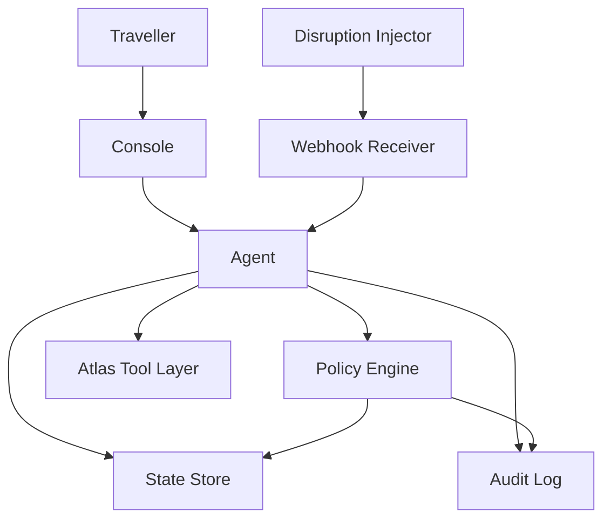
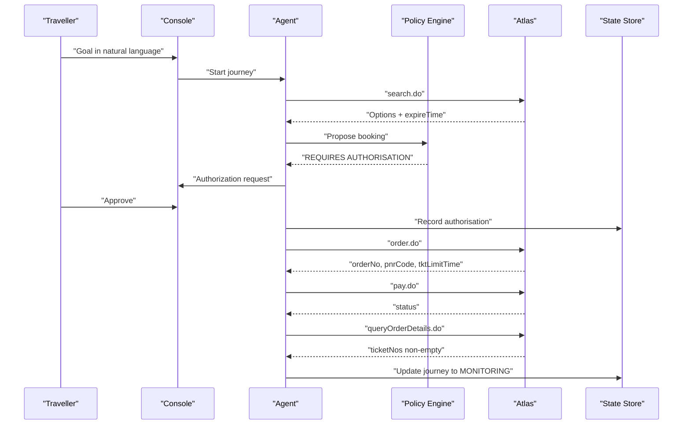
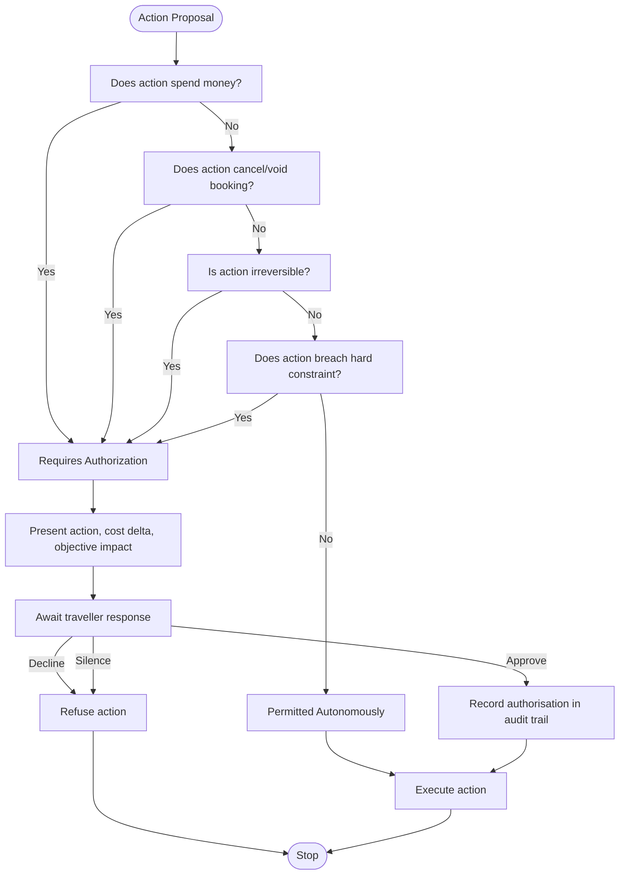
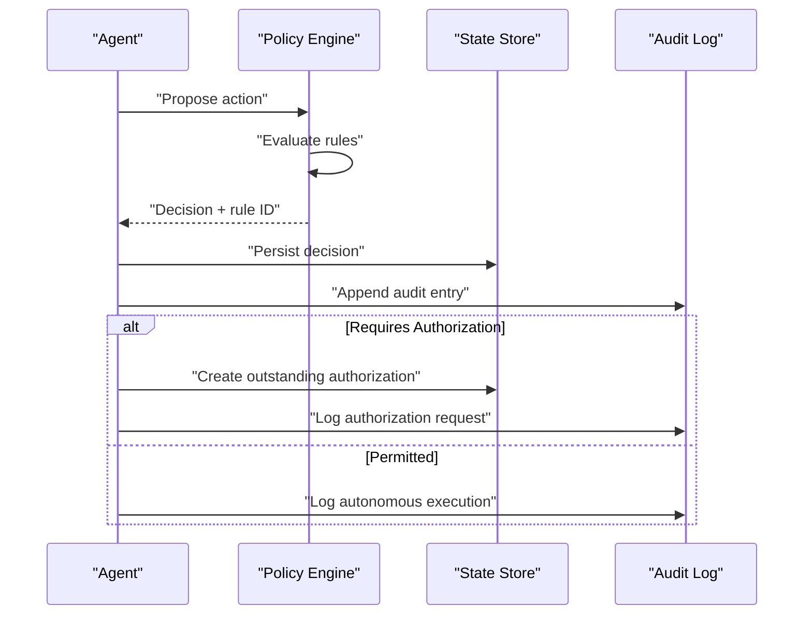
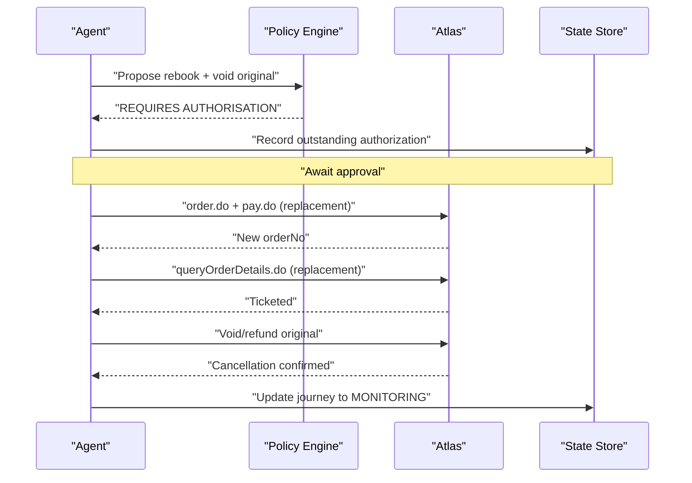
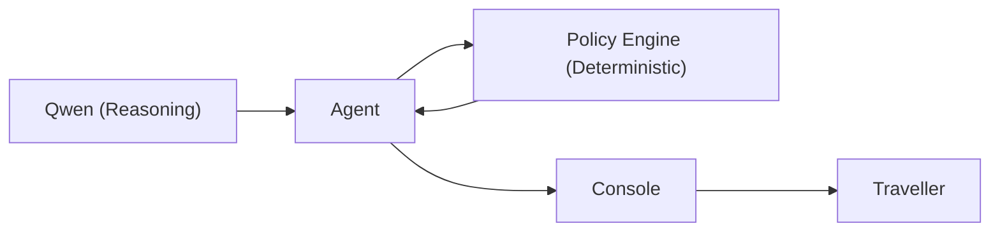
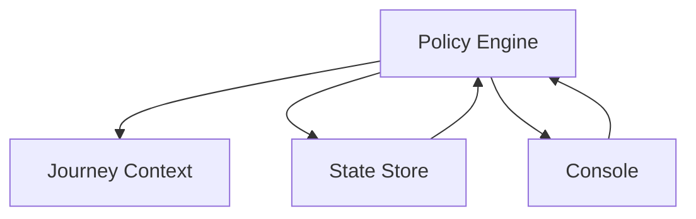

# Policy Engine

<cite>
**Referenced Files in This Document**
- [architecture.md](file://.antabay/architecture.md)
- [specs.md](file://.antabay/specs.md)
- [constitution.md](file://.antabay/constitution.md)
</cite>

## Table of Contents
1. [Introduction](#introduction)
2. [Project Structure](#project-structure)
3. [Core Components](#core-components)
4. [Architecture Overview](#architecture-overview)
5. [Detailed Component Analysis](#detailed-component-analysis)
6. [Dependency Analysis](#dependency-analysis)
7. [Performance Considerations](#performance-considerations)
8. [Troubleshooting Guide](#troubleshooting-guide)
9. [Conclusion](#conclusion)
10. [Appendices](#appendices)

## Introduction
This document explains the Policy Engine that enforces deterministic authorization decisions for actions proposed by the agent. It focuses on how the engine evaluates whether an action is permitted autonomously or requires explicit human authorization, how it integrates with the agent workflow, and how it generates audit trails for every decision. The policy engine is intentionally separate from AI reasoning: the language model reasons about what to do; the policy engine decides whether it is allowed.

The system’s core safety principle is that any action spending money, voiding a booking, committing to an itinerary, or violating a stated hard constraint must be authorized by a human. Silence is refusal. Every decision cites a rule identifier and is recorded in an append-only audit trail.

**Section sources**
- [constitution.md:62-77](file://.antabay/constitution.md#L62-L77)
- [specs.md:1272-1366](file://.antabay/specs.md#L1272-L1366)

## Project Structure
At a high level, the backend service contains:
- An Antabay Agent implementing a ReAct loop (Understand → Observe → Reason → Act → Verify → Adapt).
- A deterministic Authorisation Policy Engine that classifies actions as permitted or requiring authorization.
- A Webhook Receiver and Reconciler that treats inbound events as untrusted hints and verifies them via authoritative queries.
- A Disruption Injector for simulation during demonstrations and tests.
- A Journey State Store persisting objectives, orders, clocks, audit trail, and authorisations.
- An Operator Console UI that streams agent events and surfaces the Authorization Gate.

**Diagram sources**
- [architecture.md:21-78](file://.antabay/architecture.md#L21-L78)

**Section sources**
- [architecture.md:19-86](file://.antabay/architecture.md#L19-L86)

## Core Components
- Policy Engine: Deterministic classifier evaluating cost delta, reversibility, and constraint violations to decide if an action needs human authorization.
- Agent Workflow: Proposes actions to the Policy Engine before execution; pauses when authorization is required; resumes after approval or declines when refused.
- Audit Trail: Append-only record of observations, decisions, tool calls, approvals, and outcomes.
- Integration Points:
  - Before order creation and payment.
  - Before void/cancel operations.
  - During recovery workflows that propose rebooking and voiding originals.
  - Any time a proposed action breaches a hard constraint.

Key responsibilities:
- Evaluate each proposed action deterministically without consulting a language model.
- Produce a decision with a cited rule identifier.
- Present authorization requests including action description, cost relative to current position, and objective impact.
- Treat absence of response as refusal.
- Record all outcomes in the audit trail.

**Section sources**
- [specs.md:1272-1366](file://.antabay/specs.md#L1272-L1366)
- [architecture.md:21-78](file://.antabay/architecture.md#L21-L78)

## Architecture Overview
The separation between reasoning and enforcement is enforced at the architecture level:
- Qwen reasons but never decides authority.
- The Policy Engine receives action proposals and returns a deterministic classification.
- The Agent persists state and logs every call, decision, and approval.

**Diagram sources**
- [architecture.md:91-148](file://.antabay/architecture.md#L91-L148)

**Section sources**
- [architecture.md:19-86](file://.antabay/architecture.md#L19-L86)

## Detailed Component Analysis

### Policy Engine Rule Evaluation Process
The Policy Engine evaluates each proposed action against deterministic rules derived from the specification:
- Spending money requires authorization.
- Cancelling or voiding a booking requires authorization.
- Irreversible actions require authorization.
- Actions breaching a hard constraint require authorization.
- Decisions are independent of the language model.
- Each decision includes a rule identifier.
- Absence of response is treated as refusal.
- Prior authorizations are voided if the cost changes.
- Authorizations apply only to one specific action.

**Diagram sources**
- [specs.md:1272-1366](file://.antabay/specs.md#L1272-L1366)

**Section sources**
- [specs.md:1272-1366](file://.antabay/specs.md#L1272-L1366)

### Decision Logic and Audit Trail Generation
- Every decision is deterministic and reproducible for the same context.
- Each decision cites the specific rule that determined it.
- The audit trail records:
  - Observations and external calls.
  - Decisions and their rationale.
  - Authorisation requests and outcomes (including refusals and non-responses).
  - Timestamps for all entries.
- The console displays rule identifiers alongside policy decisions.

**Diagram sources**
- [specs.md:1272-1366](file://.antabay/specs.md#L1272-L1366)

**Section sources**
- [specs.md:1272-1366](file://.antabay/specs.md#L1272-L1366)

### Integration Points with Agent Workflow
- Initial booking path: After verifying an option, the agent proposes booking and payment to the Policy Engine. If authorization is required, the console presents the request; upon approval, the agent proceeds to order creation and payment.
- Recovery path: When disruption occurs, the agent proposes rebooking plus voiding the original. The Policy Engine flags this as requiring authorization due to spending money and irreversibility. Upon approval, the agent executes replacement booking first, then cancels the original, verifying both outcomes independently.
- Post-action verification: After state-changing calls, the agent reconciles via authoritative queries and updates journey state only from verified results.

**Diagram sources**
- [architecture.md:152-208](file://.antabay/architecture.md#L152-L208)

**Section sources**
- [architecture.md:152-208](file://.antabay/architecture.md#L152-L208)

### Concrete Examples Triggering Authorization Requests
- Budget constraints:
  - Initial booking exceeds budget → requires authorization.
  - Recovery alternative costs more than stated budget → requires authorization and explicit statement of constraint breach.
- Spending limits:
  - Any action that spends money triggers authorization regardless of savings relative to current position.
- Business rules:
  - Voiding or cancelling bookings requires authorization.
  - Irreversible commitments require authorization.
  - Breaching hard constraints (e.g., arrival deadline, no overnight connections) requires authorization.

Examples grounded in the happy path and disruption sequences:
- Booking a ticketed journey triggers authorization because it spends money.
- Recovery involving rebooking and voiding the original triggers authorization due to spending and irreversibility.

**Section sources**
- [architecture.md:91-148](file://.antabay/architecture.md#L91-L148)
- [architecture.md:152-208](file://.antabay/architecture.md#L152-L208)
- [specs.md:1272-1366](file://.antabay/specs.md#L1272-L1366)

### Separation Between AI Reasoning and Policy Enforcement
- The language model reasons about options, scoring, and recommendations.
- The Policy Engine determines whether an action is allowed without consulting the model.
- The interface shows reasoning outputs separately from policy decisions, which cite rule identifiers.

**Diagram sources**
- [architecture.md:21-78](file://.antabay/architecture.md#L21-L78)

**Section sources**
- [architecture.md:19-86](file://.antabay/architecture.md#L19-L86)

### Common Policy Scenarios
- Budget violations:
  - Any proposed action exceeding budget requires authorization and explicit notification.
- Multi-leg journeys:
  - Connection times and multi-leg constraints are evaluated during option scoring; if a proposed action violates a hard constraint (e.g., unacceptable connection), authorization is required.
- Disruption recovery costs:
  - Recovery proposals that spend money and void existing bookings require authorization; the agent must verify alternatives before execution and present cost deltas relative to current position.

**Section sources**
- [specs.md:675-766](file://.antabay/specs.md#L675-L766)
- [specs.md:1610-1690](file://.antabay/specs.md#L1610-L1690)
- [specs.md:1720-1806](file://.antabay/specs.md#L1720-L1806)

### Testing Strategies for Policy Rules
- Unit tests per rule:
  - For each rule, test both granting and refusing directions in isolation.
- Recorded fixtures:
  - Use recorded Atlas responses to drive deterministic scenarios.
- End-to-end journeys:
  - Four critical journeys include approval declined cases to ensure negative paths are tested.
- Assertions against observable state:
  - Validate outcomes using provider queries rather than function return values.

**Section sources**
- [specs.md:127-163](file://.antabay/specs.md#L127-L163)
- [specs.md:1272-1366](file://.antabay/specs.md#L1272-L1366)

### Debugging Approaches for Authorization Decisions
- Console trace:
  - Review the event stream for policy decisions and cited rule identifiers.
- Audit trail:
  - Inspect append-only records for decisions, authorisation requests, and outcomes.
- Expiry clocks:
  - Monitor offer, session, and ticketing deadlines to understand timing-related failures.
- Provenance footer:
  - Confirm environment, reasoning model, and simulation status to contextualize decisions.

**Section sources**
- [specs.md:798-918](file://.antabay/specs.md#L798-L918)
- [architecture.md:261-279](file://.antabay/architecture.md#L261-L279)

## Dependency Analysis
The Policy Engine depends on:
- Journey context: Objective, hard constraints, current position, and held identifiers.
- Action proposal metadata: Cost delta, reversibility, and constraint impact.
- State store: To persist and retrieve authorisations and audit entries.
- Console: To present authorization requests and display rule identifiers.

**Diagram sources**
- [specs.md:1272-1366](file://.antabay/specs.md#L1272-L1366)

**Section sources**
- [specs.md:1272-1366](file://.antabay/specs.md#L1272-L1366)

## Performance Considerations
- Deterministic evaluation ensures fast, predictable decisions without model latency.
- Minimal coupling reduces overhead; the Policy Engine only needs context and proposal metadata.
- Audit logging should be efficient and append-only to avoid blocking critical paths.
- Avoid unnecessary recomputation; cache policy-relevant facts where safe.

[No sources needed since this section provides general guidance]

## Troubleshooting Guide
Common issues and resolutions:
- Unauthorized action executed:
  - Verify that the Policy Engine was invoked before execution and returned PERMITTED.
  - Check audit trail for missing or incorrect rule citations.
- Authorization request not surfaced:
  - Ensure the console is streaming events and that outstanding authorisations are persisted.
- Price change invalidates prior authorization:
  - Re-verify options and re-present authorization requests when prices change.
- Silent refusal misinterpreted as consent:
  - Confirm that silence is treated as refusal and that timeouts are handled explicitly.

**Section sources**
- [specs.md:1272-1366](file://.antabay/specs.md#L1272-L1366)
- [specs.md:798-918](file://.antabay/specs.md#L798-L918)

## Conclusion
The Policy Engine provides a deterministic, auditable boundary for autonomous operation. It separates AI reasoning from enforcement, ensuring that any action spending money, voiding bookings, or violating hard constraints requires explicit human authorization. Its integration points cover initial booking, recovery workflows, and post-action verification. With clear rule evaluation, comprehensive audit trails, and robust testing strategies, the Policy Engine enables safe, transparent, and demonstrable autonomous travel assistance.

[No sources needed since this section summarizes without analyzing specific files]

## Appendices

### Appendix A: Key Specification References
- Authorisation Policy Engine specification defines functional requirements, non-functional requirements, and clarification considerations.
- Constitution principles enforce separation of reasoning and authority, truthfulness, and operational discipline.
- Architecture diagrams illustrate component interactions and sequence flows for happy path and disruption recovery.

**Section sources**
- [specs.md:1272-1366](file://.antabay/specs.md#L1272-L1366)
- [constitution.md:62-77](file://.antabay/constitution.md#L62-L77)
- [architecture.md:21-78](file://.antabay/architecture.md#L21-L78)