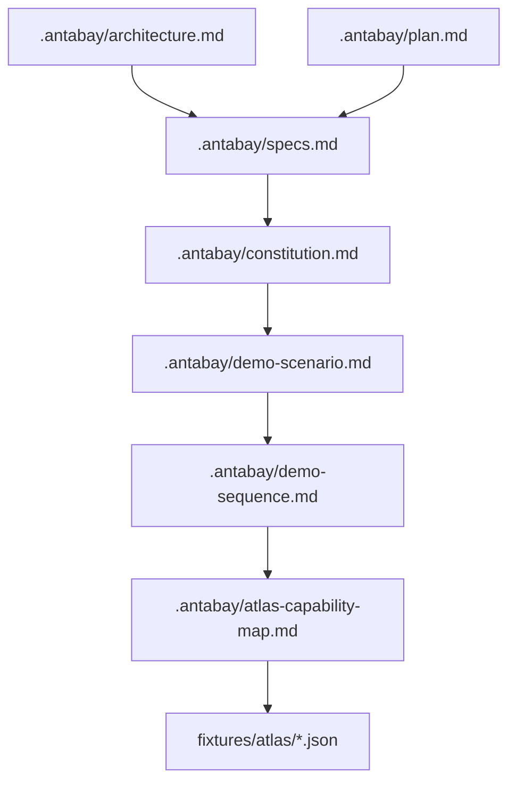
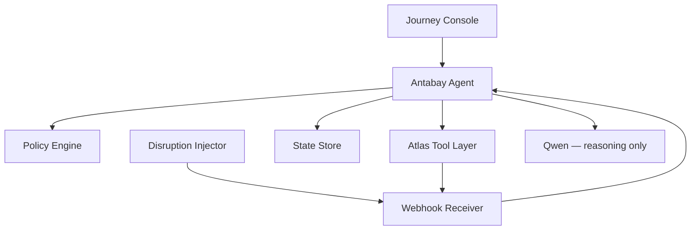
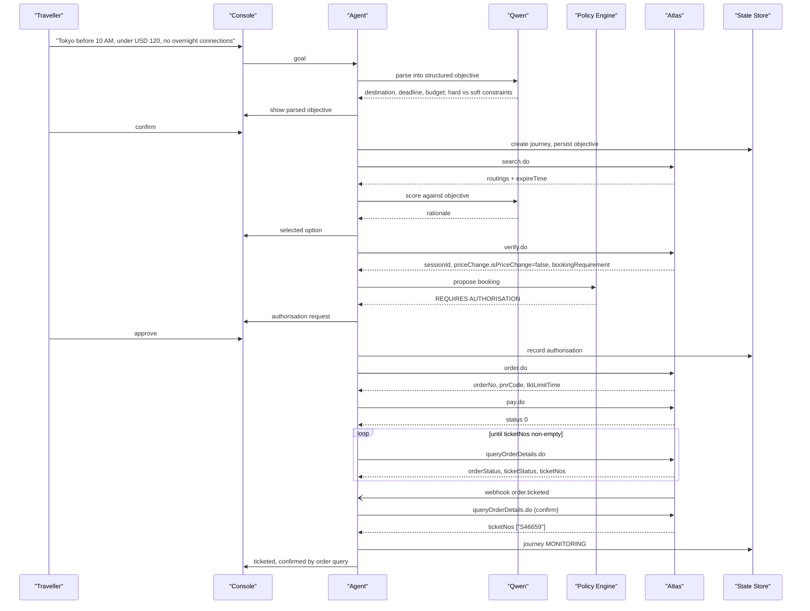
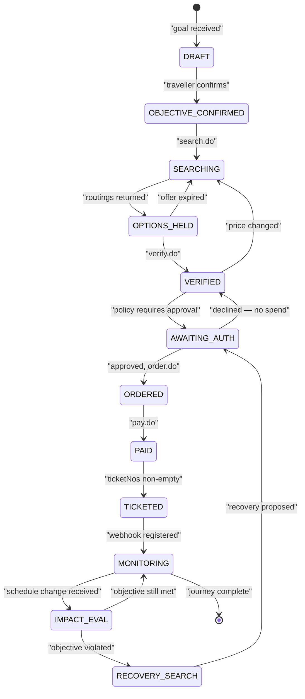
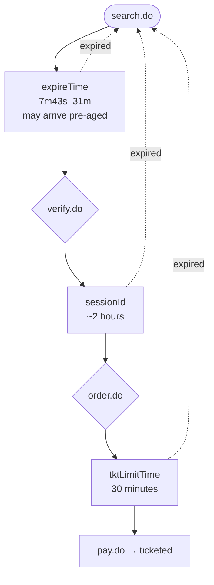
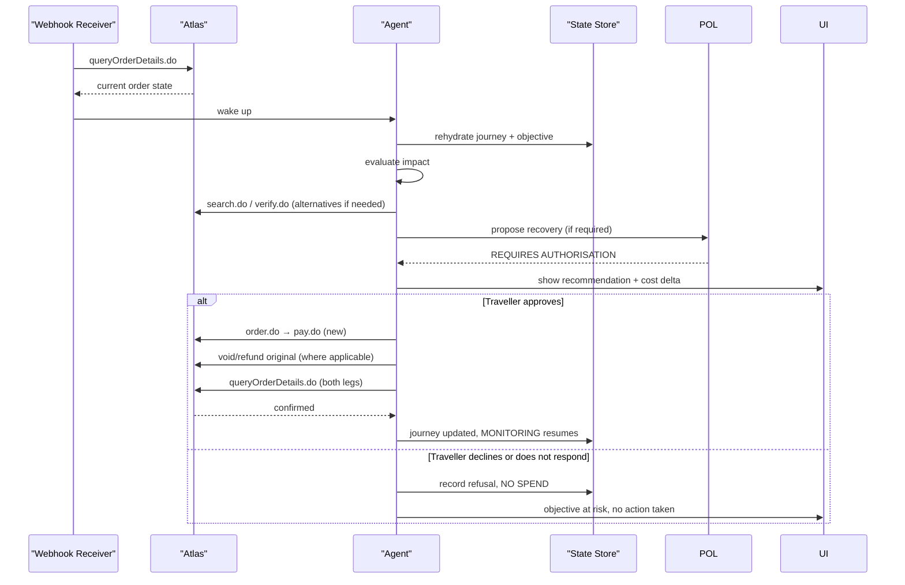
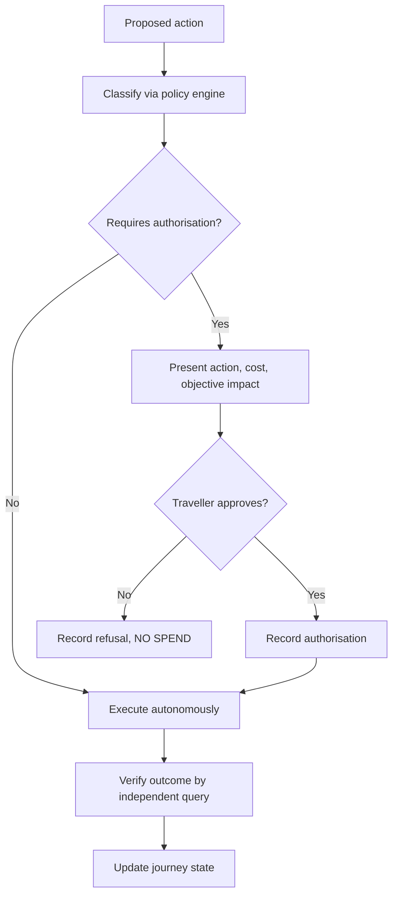
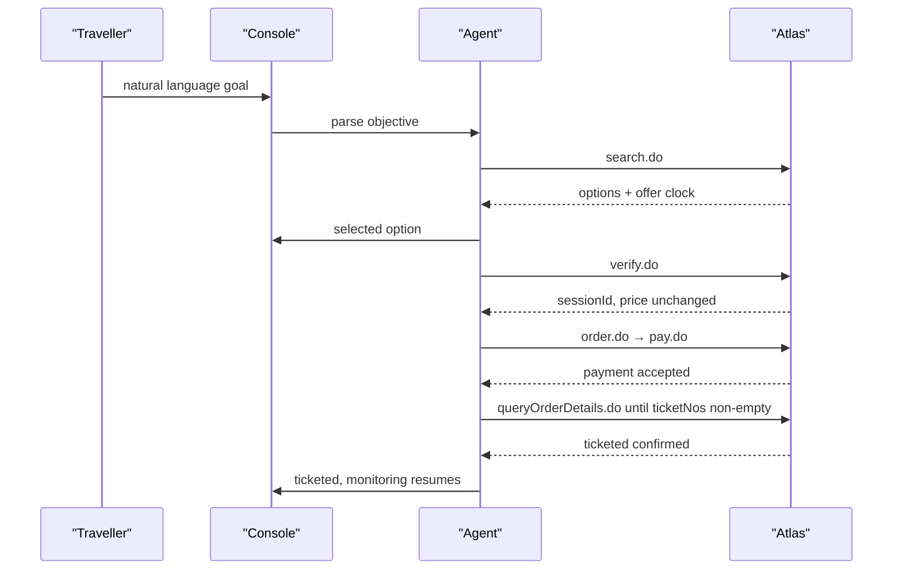
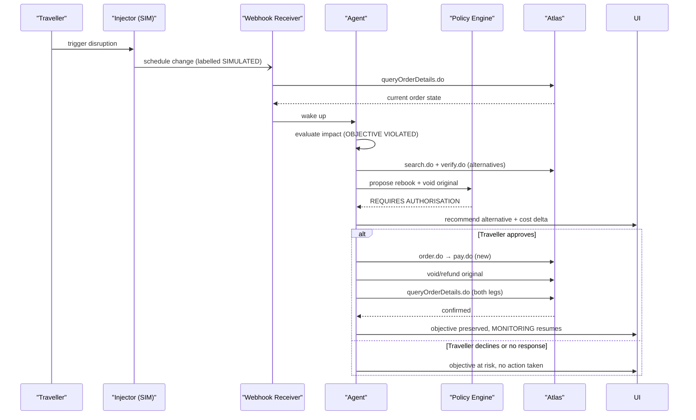
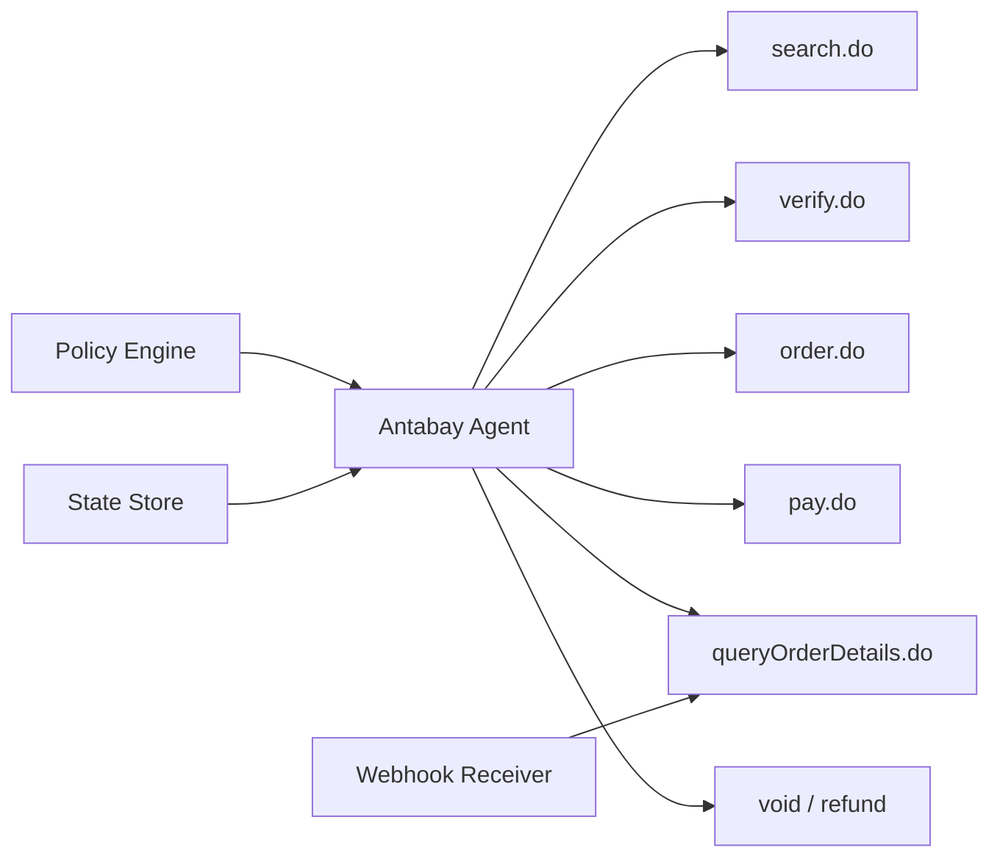

# Project Overview

<cite>
**Referenced Files in This Document**
- [architecture.md](file://.antabay/architecture.md)
- [specs.md](file://.antabay/specs.md)
- [constitution.md](file://.antabay/constitution.md)
- [demo-scenario.md](file://.antabay/demo-scenario.md)
- [demo-sequence.md](file://.antabay/demo-sequence.md)
- [atlas-capability-map.md](file://.antabay/atlas-capability-map.md)
- [plan.md](file://.antabay/plan.md)
</cite>

## Table of Contents
1. [Introduction](#introduction)
2. [Project Structure](#project-structure)
3. [Core Components](#core-components)
4. [Architecture Overview](#architecture-overview)
5. [Detailed Component Analysis](#detailed-component-analysis)
6. [Dependency Analysis](#dependency-analysis)
7. [Performance Considerations](#performance-considerations)
8. [Troubleshooting Guide](#troubleshooting-guide)
9. [Conclusion](#conclusion)
10. [Appendices](#appendices)

## Introduction
Antabay is an AI-powered travel booking system that turns a traveller’s natural-language goal into a completed flight ticket while keeping humans in control for financial decisions. It combines autonomous agent reasoning with deterministic policy enforcement so the system can act quickly and safely, but never spend money or commit to irreversible actions without explicit human approval.

At its core, Antabay:
- Parses a stated goal into a structured objective with hard constraints and soft preferences
- Searches real inventory, scores options against the objective, and defends selections
- Books through a verified external travel API, verifies every state change independently, and confirms outcomes by authoritative queries
- Monitors journeys and recovers from disruptions by proposing compliant alternatives
- Enforces authorisation gates deterministically for any action that spends money, voids bookings, breaches constraints, or is irreversible

The result is an intelligent agent that protects the traveller’s objective end-to-end, with full traceability and human oversight at critical moments.

**Section sources**
- [constitution.md:11-21](file://.antabay/constitution.md#L11-L21)
- [specs.md:429-531](file://.antabay/specs.md#L429-L531)
- [demo-scenario.md:13-66](file://.antabay/demo-scenario.md#L13-L66)

## Project Structure
The repository organises Antabay around verified contracts, specifications, architecture diagrams, demo scenarios, and fixtures captured from live sandbox runs. Key areas include:
- `.antabay/`: Architecture, specs, constitution, demo scenario, demo sequence, execution plan, and capability map
- `fixtures/atlas/`: Redacted JSON fixtures from real Atlas sandbox responses used for recorded tests
- Supporting files such as QODER instructions and configuration references

**Diagram sources**
- [architecture.md:1-20](file://.antabay/architecture.md#L1-L20)
- [specs.md:1-10](file://.antabay/specs.md#L1-L10)
- [constitution.md:1-10](file://.antabay/constitution.md#L1-L10)
- [demo-scenario.md:1-10](file://.antabay/demo-scenario.md#L1-L10)
- [demo-sequence.md:1-10](file://.antabay/demo-sequence.md#L1-L10)
- [atlas-capability-map.md:1-10](file://.antabay/atlas-capability-map.md#L1-L10)
- [plan.md:1-10](file://.antabay/plan.md#L1-L10)

**Section sources**
- [specs.md:13-101](file://.antabay/specs.md#L13-L101)
- [atlas-capability-map.md:393-399](file://.antabay/atlas-capability-map.md#L393-L399)

## Core Components
Antabay’s value comes from combining autonomous reasoning with strict policy enforcement across a well-defined journey lifecycle. The main components are:

- Journey Console (React + Vite): Presents the parsed objective, journey state, expiry clocks, agent trace, and the authorisation gate. It renders both a technical console view and a simplified traveller-facing view from the same event stream.
- Backend FastAPI service: Hosts the Antabay Agent, Policy Engine, Webhook Receiver, Disruption Injector, and integration with the Atlas Tool Layer.
- Antabay Agent: Owns a ReAct loop (Understand → Observe → Reason → Act → Verify → Adapt), rehydrates journey state on each wake-up, and emits events to the console.
- Policy Engine: Deterministic rules that decide whether an action requires human authorisation based on cost delta, constraint violation, and reversibility.
- Webhook Receiver + Reconciler: Accepts untrusted inbound events, treats them as hints, and reconciles claims against authoritative order queries.
- Disruption Injector: Simulates schedule changes for demonstration purposes; all injected events are labelled simulated and do not fabricate flight data.
- Atlas Tool Layer: Verified endpoints including search, verify, order, pay, queryOrderDetails, and void/refund where applicable.
- State Store: Persists objectives, orders, clocks, audit trails, and authorisations so journeys survive process restarts.

**Diagram sources**
- [architecture.md:21-78](file://.antabay/architecture.md#L21-L78)

**Section sources**
- [architecture.md:19-86](file://.antabay/architecture.md#L19-L86)
- [specs.md:798-800](file://.antabay/specs.md#L798-L800)
- [atlas-capability-map.md:25-38](file://.antabay/atlas-capability-map.md#L25-L38)

## Architecture Overview
Antabay enforces four key architectural rules:
1. Qwen reasons; the policy engine decides authority. The line never crosses.
2. Journey state lives outside the agent. Every wake-up rehydrates from durable storage.
3. Webhooks are untrusted hints. queryOrderDetails.do is the truth.
4. Every travel fact shown to the traveller traces to an Atlas response.

**Diagram sources**
- [architecture.md:89-148](file://.antabay/architecture.md#L89-L148)
- [demo-sequence.md:10-110](file://.antabay/demo-sequence.md#L10-L110)

**Section sources**
- [architecture.md:80-86](file://.antabay/architecture.md#L80-L86)
- [atlas-capability-map.md:315-379](file://.antabay/atlas-capability-map.md#L315-L379)

## Detailed Component Analysis

### Objective Parsing and Journey States
Antabay begins by parsing a natural-language goal into a structured objective. Each element is classified as a hard constraint or soft preference, then presented to the traveller for confirmation before any downstream action. Once confirmed, a journey record is created with a unique identifier, the confirmed objective, and an initial state. The journey state machine governs transitions between states such as DRAFT, OBJECTIVE_CONFIRMED, SEARCHING, OPTIONS_HELD, VERIFIED, AWAITING_AUTH, ORDERED, PAID, TICKETED, MONITORING, IMPACT_EVAL, and RECOVERY_SEARCH.

**Diagram sources**
- [architecture.md:212-257](file://.antabay/architecture.md#L212-L257)

**Section sources**
- [specs.md:429-531](file://.antabay/specs.md#L429-L531)
- [architecture.md:212-257](file://.antabay/architecture.md#L212-L257)

### Three-Clock System
Antabay tracks three distinct clocks that bound different phases of the booking flow:
- Offer clock: expireTime from search results, observed as short as 7 minutes 43 seconds and sometimes already partly elapsed on arrival
- Session clock: sessionId after verification, documented up to 2 hours
- Ticketing clock: tktLimitTime after ordering, observed as 30 minutes

Each expiry sends the journey back to search. All three are tracked in state and displayed in the console with time remaining.

**Diagram sources**
- [architecture.md:261-279](file://.antabay/architecture.md#L261-L279)
- [atlas-capability-map.md:304-313](file://.antabay/atlas-capability-map.md#L304-L313)

**Section sources**
- [atlas-capability-map.md:107-126](file://.antabay/atlas-capability-map.md#L107-L126)
- [architecture.md:261-279](file://.antabay/architecture.md#L261-L279)

### Untrusted Webhook Handling
Webhooks are delivered without authentication and must be treated as untrusted hints. When a webhook arrives, Antabay reconciles the claim against the authoritative order query before changing journey state. This applies to ticketing notifications and disruption events alike.

**Diagram sources**
- [architecture.md:152-208](file://.antabay/architecture.md#L152-L208)
- [atlas-capability-map.md:315-379](file://.antabay/atlas-capability-map.md#L315-L379)

**Section sources**
- [atlas-capability-map.md:315-379](file://.antabay/atlas-capability-map.md#L315-L379)
- [architecture.md:152-208](file://.antabay/architecture.md#L152-L208)

### Authorisation Gates and Policy Enforcement
High-impact actions require explicit human authorisation. The policy engine evaluates cost delta, constraint violation, and reversibility deterministically. Silence is refusal. Every decision, tool call, and approval is recorded in an append-only audit trail.

**Diagram sources**
- [specs.md:437-531](file://.antabay/specs.md#L437-L531)
- [demo-sequence.md:114-142](file://.antabay/demo-sequence.md#L114-L142)

**Section sources**
- [constitution.md:62-77](file://.antabay/constitution.md#L62-L77)
- [specs.md:437-531](file://.antabay/specs.md#L437-L531)

### Practical Examples

#### Goal-to-Ticketed Workflow
A traveller states a goal like “Get me to Tokyo before 10 AM tomorrow. Under USD 120. No overnight connections.” The system parses this into a structured objective, searches real options, scores them against hard constraints and preferences, verifies pricing, books, pays, and confirms ticketing by querying order details. Payment success is not proof; ticketing is confirmed when ticket numbers are present.

**Diagram sources**
- [architecture.md:89-148](file://.antabay/architecture.md#L89-L148)
- [demo-scenario.md:76-80](file://.antabay/demo-scenario.md#L76-L80)

**Section sources**
- [demo-scenario.md:13-80](file://.antabay/demo-scenario.md#L13-L80)
- [atlas-capability-map.md:236-313](file://.antabay/atlas-capability-map.md#L236-L313)

#### Disruption Recovery Scenario
After ticketing, a schedule change pushes arrival past the deadline, violating the objective. The system detects the disruption, re-searches real options, verifies alternatives, and proposes a compliant recovery. Because recovery spends money and may void the original booking, it triggers the authorisation gate. If approved, the system executes and verifies both legs before resuming monitoring.

**Diagram sources**
- [architecture.md:152-208](file://.antabay/architecture.md#L152-L208)
- [demo-sequence.md:71-109](file://.antabay/demo-sequence.md#L71-L109)

**Section sources**
- [demo-scenario.md:81-117](file://.antabay/demo-scenario.md#L81-L117)
- [architecture.md:152-208](file://.antabay/architecture.md#L152-L208)

## Dependency Analysis
Antabay depends on a verified contract with the Atlas travel API. Only endpoints explicitly validated in the capability map are permitted. The system preserves opaque identifiers byte-for-byte, normalises fields that differ between API surfaces, classifies error codes, and respects rate limits.

**Diagram sources**
- [atlas-capability-map.md:25-38](file://.antabay/atlas-capability-map.md#L25-L38)
- [architecture.md:44-53](file://.antabay/architecture.md#L44-L53)

**Section sources**
- [atlas-capability-map.md:25-38](file://.antabay/atlas-capability-map.md#L25-L38)
- [atlas-capability-map.md:400-415](file://.antabay/atlas-capability-map.md#L400-L415)

## Performance Considerations
- Offer windows are short and variable; freshness must be checked before every decision
- Rate limits apply per endpoint; respect wait instructions and avoid retry loops
- Currency mixing hazards exist between fares and fee amounts; convert explicitly rather than inventing rates
- Identifier TTLs vary; trust per-offer expireTime over generic documentation
- Use recorded fixtures for fast, deterministic testing; run live sandbox tests on demand

[No sources needed since this section provides general guidance]

## Troubleshooting Guide
Common issues and their handling:
- Duplicate booking rejection: reconcile against the existing order reference returned by Atlas; never retry
- Uncertain outcomes: reconcile against Atlas before further action; do not repeat calls
- Stale identifiers: re-verify earlier than documented limits because fare and inventory can change first
- Price increases: fresh human confirmation is required when verify returns a higher price
- Webhook misinterpretation: treat status values differently from API success semantics; always confirm via order query
- Rate limit errors: honour retryAfter and operate within per-journey call budgets

**Section sources**
- [atlas-capability-map.md:107-130](file://.antabay/atlas-capability-map.md#L107-L130)
- [atlas-capability-map.md:315-379](file://.antabay/atlas-capability-map.md#L315-L379)
- [atlas-capability-map.md:400-415](file://.antabay/atlas-capability-map.md#L400-L415)

## Conclusion
Antabay delivers an intelligent, safe, and verifiable travel booking experience. It transforms natural-language goals into completed tickets while enforcing deterministic policies for financial decisions. The ReAct loop pattern drives autonomous reasoning, the three-clock system manages time-bound offers, sessions, and ticketing deadlines, and untrusted webhook handling ensures correctness through authoritative reconciliation. Together, these principles make Antabay a robust guardian of the traveller’s objective from start to finish.

[No sources needed since this section summarizes without analyzing specific files]

## Appendices

### Demo Scenario Highlights
- Parsed objective includes origin, destination, latest arrival, budget, traveller count, and constraints
- Option set includes 30 routings; selection rejects options that violate hard constraints even if they pass naive filters
- Freshness pressure is visible on screen; re-verification occurs before committing
- Disruption is injected and labelled simulated; recovery recommends a compliant alternative with cost delta
- Approval gate blocks execution until human authorisation is granted

**Section sources**
- [demo-scenario.md:13-117](file://.antabay/demo-scenario.md#L13-L117)
- [demo-sequence.md:146-166](file://.antabay/demo-sequence.md#L146-L166)

### Execution Plan Summary
- Four-spec delivery path prioritises completeness over polish
- Spec A covers contract and journey model
- Spec B covers search, scoring, verification, booking, and confirmation
- Spec C covers console and agent trace
- Spec D covers disruption detection, authorisation, and recovery

**Section sources**
- [plan.md:151-173](file://.antabay/plan.md#L151-L173)
- [plan.md:177-531](file://.antabay/plan.md#L177-L531)