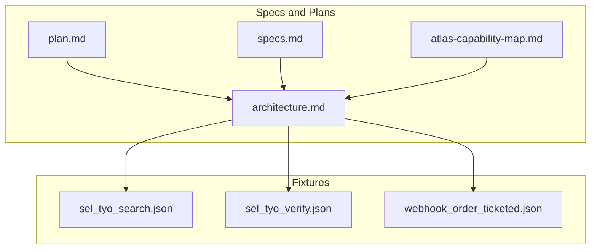
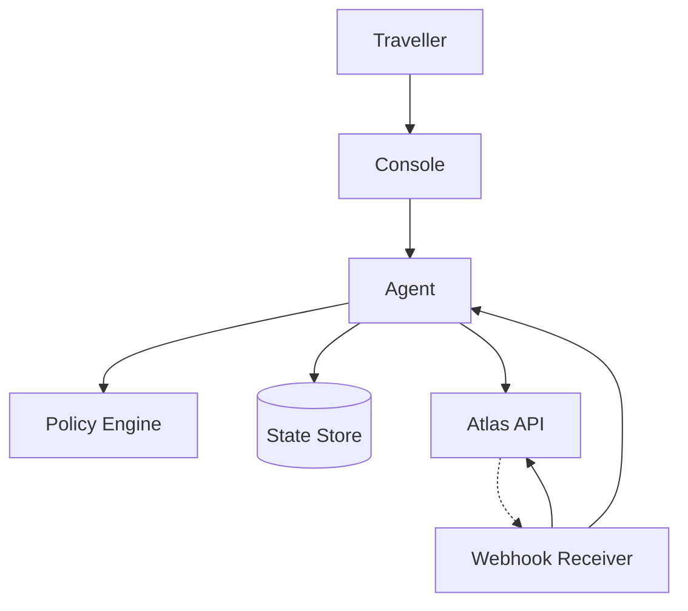
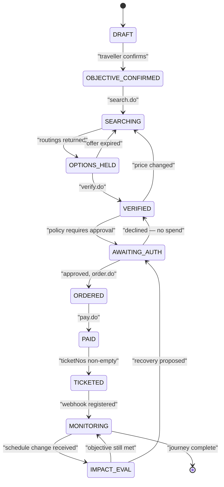
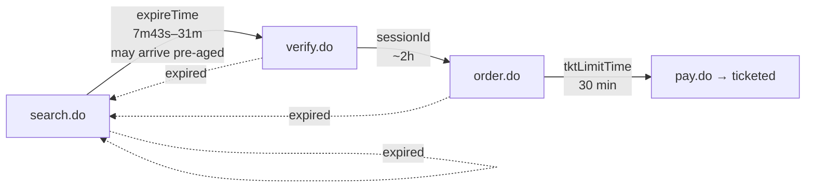
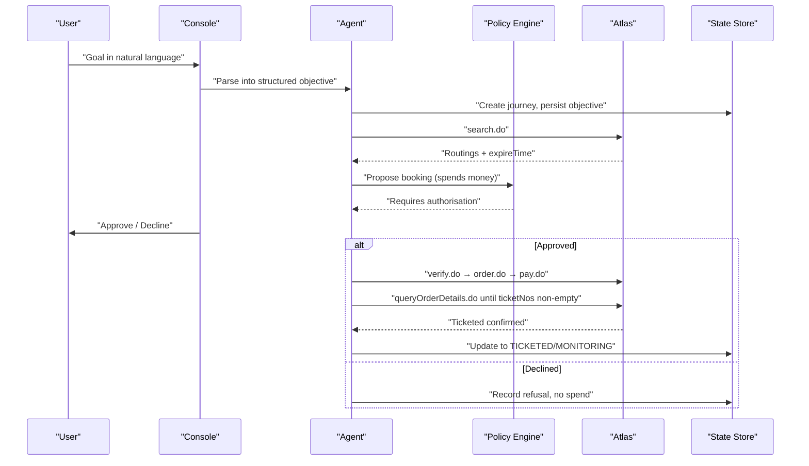
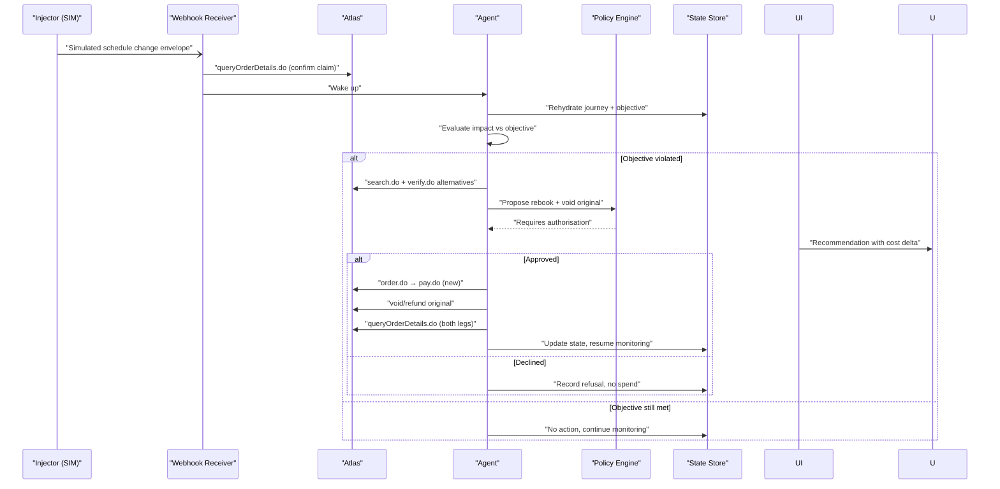
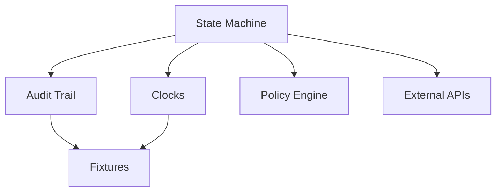

# State Management

<cite>
**Referenced Files in This Document**
- [architecture.md](file://.antabay/architecture.md)
- [plan.md](file://.antabay/plan.md)
- [specs.md](file://.antabay/specs.md)
- [atlas-capability-map.md](file://.antabay/atlas-capability-map.md)
- [demo-scenario.md](file://.antabay/demo-scenario.md)
- [sel_tyo_search.json](file://fixtures/atlas/sel_tyo_search.json)
- [sel_tyo_verify.json](file://fixtures/atlas/sel_tyo_verify.json)
- [webhook_order_ticketed.json](file://fixtures/atlas/webhook_order_ticketed.json)
</cite>

## Table of Contents
1. Introduction
2. Project Structure
3. Core Components
4. Architecture Overview
5. Detailed Component Analysis
6. Dependency Analysis
7. Performance Considerations
8. Troubleshooting Guide
9. Conclusion

## Introduction
This document explains the durable state management system for journeys, focusing on persistence and lifecycle control across a well-defined state machine. It covers:
- The journey state machine with transitions between DRAFT, OBJECTIVE_CONFIRMED, SEARCHING, OPTIONS_HELD, VERIFIED, AWAITING_AUTH, ORDERED, PAID, TICKETED, MONITORING, and terminal states.
- The three-clock system (offer, session, ticketing deadlines) and how each clock drives progression or rollback.
- Concrete examples for normal booking flows and disruption recovery scenarios.
- Audit trail design using event sourcing principles to maintain complete journey history.
- Separation of state storage from agent logic to enable rehydration after restarts.
- Consistency, concurrency, migration strategies, debugging approaches, and performance considerations for large histories.

The content is grounded in the project’s verified architecture, specs, and Atlas capability map.

## Project Structure
At a high level, the repository contains:
- Specification and planning documents that define the journey model, state machine, clocks, and workflows.
- A verified contract and data shapes for external calls.
- Fixtures capturing real sandbox responses used as seeds for recorded tests and replay.

**Diagram sources**
- [architecture.md:19-78](file://.antabay/architecture.md#L19-L78)
- [specs.md:429-531](file://.antabay/specs.md#L429-L531)
- [atlas-capability-map.md:25-34](file://.antabay/atlas-capability-map.md#L25-L34)

**Section sources**
- [plan.md:177-260](file://.antabay/plan.md#L177-L260)
- [specs.md:429-531](file://.antabay/specs.md#L429-L531)
- [atlas-capability-map.md:25-34](file://.antabay/atlas-capability-map.md#L25-L34)

## Core Components
- Journey state machine: Enforces allowed transitions and prevents invalid state changes.
- Three clocks: Offer expireTime, sessionId-based session window, and tktLimitTime post-order; each expiry forces a reset or retry path.
- Audit trail: Append-only log of observations, decisions, external calls, and authorisations.
- Rehydration: On process restart, load the latest journey snapshot plus events to reconstruct state deterministically.
- Policy gate: Deterministic classification of whether an action requires human authorisation.

Key requirements driving these components:
- FR-010 through FR-013 in Spec A define the journey record, state transitions, durability, held identifiers with lifetimes, and append-only audit trail.
- The architecture diagram enforces separation of concerns: agent reasoning, policy engine, webhook receiver, and durable state store.

**Section sources**
- [plan.md:177-260](file://.antabay/plan.md#L177-L260)
- [architecture.md:19-78](file://.antabay/architecture.md#L19-L78)
- [specs.md:429-531](file://.antabay/specs.md#L429-L531)

## Architecture Overview
The backend service hosts:
- An agent loop that reasons about options and actions.
- A deterministic authorisation policy engine.
- A webhook receiver that treats inbound events as untrusted hints and reconciles via authoritative queries.
- A durable state store holding objective, orders, clocks, audit trail, and authorisations.

**Diagram sources**
- [architecture.md:19-78](file://.antabay/architecture.md#L19-L78)

**Section sources**
- [architecture.md:19-78](file://.antabay/architecture.md#L19-L78)

## Detailed Component Analysis

### Journey State Machine
The journey progresses through defined states with strict transitions. Expiration of any clock can force a return to earlier stages.

Notes:
- Pre-verify freshness is governed by offer expireTime; post-verify by sessionId.
- Post-order, tktLimitTime governs payment-to-ticketing window.
- Duplicate order handling routes through reconciliation before resuming.

**Diagram sources**
- [architecture.md:212-257](file://.antabay/architecture.md#L212-L257)

**Section sources**
- [architecture.md:212-257](file://.antabay/architecture.md#L212-L257)
- [specs.md:474-490](file://.antabay/specs.md#L474-L490)

### Three-Clock System
Three distinct clocks bound different phases of the journey:

Behavioral rules:
- Offer expireTime: short and variable; must be checked before every decision; may already be partially aged when returned.
- SessionId window: replaces offer freshness after verify; longer but bounded.
- tktLimitTime: post-order deadline to complete payment and ticketing; missing it resets to search.

Observed values and constraints are captured in the capability map and fixtures.

**Diagram sources**
- [architecture.md:261-278](file://.antabay/architecture.md#L261-L278)
- [atlas-capability-map.md:107-125](file://.antabay/atlas-capability-map.md#L107-L125)
- [atlas-capability-map.md:304-313](file://.antabay/atlas-capability-map.md#L304-L313)

**Section sources**
- [atlas-capability-map.md:107-125](file://.antabay/atlas-capability-map.md#L107-L125)
- [atlas-capability-map.md:304-313](file://.antabay/atlas-capability-map.md#L304-L313)
- [sel_tyo_search.json:323-324](file://fixtures/atlas/sel_tyo_search.json#L323-L324)
- [sel_tyo_verify.json:324-325](file://fixtures/atlas/sel_tyo_verify.json#L324-L325)

### Normal Booking Flow (Happy Path)
Sequence of steps from goal to ticketed, including verification and post-action confirmation:

Key points:
- Payment success is not proof of ticketing; only queryOrderDetails with non-empty ticketNos counts.
- Authorisation is required for any action spending money.
- All external identifiers are preserved verbatim.

**Diagram sources**
- [architecture.md:89-148](file://.antabay/architecture.md#L89-L148)
- [atlas-capability-map.md:236-303](file://.antabay/atlas-capability-map.md#L236-L303)

**Section sources**
- [architecture.md:89-148](file://.antabay/architecture.md#L89-L148)
- [atlas-capability-map.md:236-303](file://.antabay/atlas-capability-map.md#L236-L303)
- [demo-scenario.md:76-118](file://.antabay/demo-scenario.md#L76-L118)

### Disruption Recovery Flow
When a schedule change arrives, the system evaluates impact against the objective and proposes recovery if needed:

Important behaviors:
- Webhooks are untrusted hints; always reconcile via authoritative query.
- Recovery actions that spend money or cancel bookings require human authorisation.
- Simulated events are clearly labelled and never presented as provider-originated.

**Diagram sources**
- [architecture.md:152-208](file://.antabay/architecture.md#L152-L208)
- [atlas-capability-map.md:315-378](file://.antabay/atlas-capability-map.md#L315-L378)

**Section sources**
- [architecture.md:152-208](file://.antabay/architecture.md#L152-L208)
- [atlas-capability-map.md:315-378](file://.antabay/atlas-capability-map.md#L315-L378)
- [demo-scenario.md:81-118](file://.antabay/demo-scenario.md#L81-L118)

### Audit Trail and Event Sourcing Principles
- Every observation, decision, external call, and authorisation outcome is appended to an immutable log per journey.
- The log supports full replay without contacting external services, enabling deterministic reconstruction and testing.
- Replay mode allows controlled pacing and simulation of events for demonstration and validation.

Implementation implications:
- Use an append-only table or event stream per journey.
- Persist snapshots periodically to speed up rehydration.
- Maintain versioned schema for events to support evolution over time.

**Section sources**
- [specs.md:488-496](file://.antabay/specs.md#L488-L496)
- [specs.md:385-408](file://.antabay/specs.md#L385-L408)

### Separation of State Storage and Agent Logic
- The agent performs reasoning and orchestration but does not own state; all durable facts live in the state store.
- On restart, the agent rehydrates the journey from the state store and resumes processing based on current clocks and events.
- This separation ensures correctness even under failures and enables independent scaling of agent and storage layers.

**Section sources**
- [architecture.md:19-78](file://.antabay/architecture.md#L19-L78)
- [specs.md:474-490](file://.antabay/specs.md#L474-L490)

### Concurrency and Consistency
- Treat webhooks as untrusted hints; reconcile with authoritative queries before changing state.
- Use idempotent operations and handle duplicate order signals by adopting existing orders rather than retrying blindly.
- Enforce a per-journey call budget for rate-limited endpoints and honour wait instructions.
- Ensure atomic updates to state and audit entries to avoid partial progress.

**Section sources**
- [atlas-capability-map.md:393-415](file://.antabay/atlas-capability-map.md#L393-L415)
- [specs.md:370-377](file://.antabay/specs.md#L370-L377)

### Migration Strategies for Schema Evolution
- Version events and snapshots so older journeys can be migrated incrementally.
- Keep backward-compatible readers for legacy event formats while writers evolve.
- Provide migration scripts to transform historical data without losing audit integrity.
- Validate migrations with recorded fixtures and replay pipelines.

[No sources needed since this section provides general guidance grounded by spec requirements for append-only logs and replay]

## Dependency Analysis
The state system depends on:
- Verified external contracts for search, verify, order, pay, and order query.
- Fixtures that capture real responses to drive tests and replays.
- The policy engine to gate actions requiring authorisation.

**Diagram sources**
- [atlas-capability-map.md:25-34](file://.antabay/atlas-capability-map.md#L25-L34)
- [specs.md:429-531](file://.antabay/specs.md#L429-L531)

**Section sources**
- [atlas-capability-map.md:25-34](file://.antabay/atlas-capability-map.md#L25-L34)
- [specs.md:429-531](file://.antabay/specs.md#L429-L531)

## Performance Considerations
- Short offer windows demand fast decision loops and minimal latency between search and verify.
- Polling for ticketing should be bounded and respect provider rate limits; use webhook hints only to trigger reconciliation, not as sole truth.
- Large audit histories benefit from periodic snapshots and compaction strategies while preserving immutability.
- Avoid redundant external calls by caching verified results within their validity windows.

[No sources needed since this section provides general guidance]

## Troubleshooting Guide
Common issues and diagnostics:
- Stale offers: Check expireTime and refreshTime; re-search if expired or near-expiry.
- Price changes: If priceChange.isPriceChange is true, prior approvals are void; re-propose through policy.
- Duplicate orders: On error code 318, adopt the existing order reference and resume from its real state.
- Paid but not ticketed: Continue polling queryOrderDetails until ticketNos is populated; do not assume pay success equals ticketing.
- Webhook misinterpretation: Do not trust webhook status; always confirm via authoritative query.

Operational checks:
- Verify call budget usage and rate-limit backoff behavior.
- Confirm authorisation outcomes are recorded for both approvals and refusals.
- Inspect audit trail entries around failed transitions to identify root causes.

**Section sources**
- [atlas-capability-map.md:107-125](file://.antabay/atlas-capability-map.md#L107-L125)
- [atlas-capability-map.md:393-415](file://.antabay/atlas-capability-map.md#L393-L415)
- [atlas-capability-map.md:315-378](file://.antabay/atlas-capability-map.md#L315-L378)
- [specs.md:488-496](file://.antabay/specs.md#L488-L496)

## Conclusion
The state management system centers on a robust, enforced journey state machine backed by durable storage and an append-only audit trail. The three-clock model ensures timely progression and safe rollback paths. By treating webhooks as hints and relying on authoritative queries, the system maintains consistency under failure and concurrency. Separation of agent logic from state storage enables reliable rehydration and scalable operation. With clear policies for authorisation and comprehensive auditing, the system supports both happy-path bookings and complex disruption recovery scenarios.