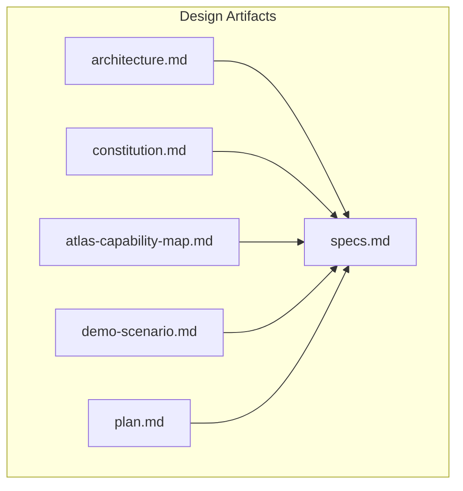
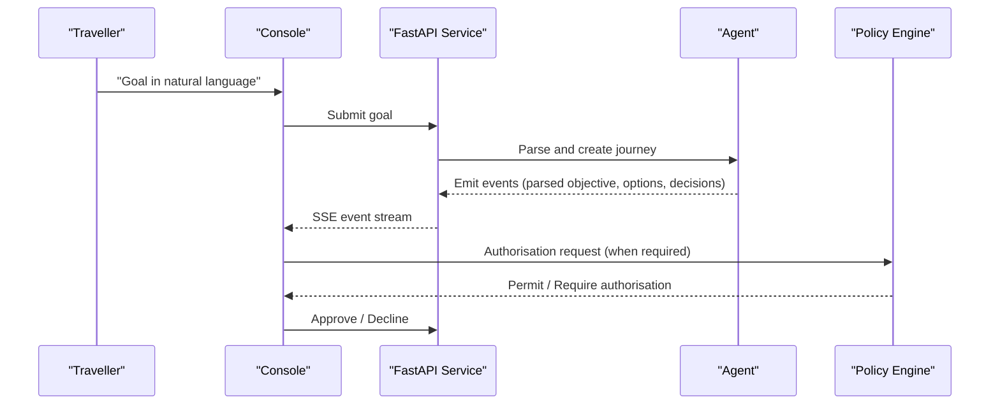
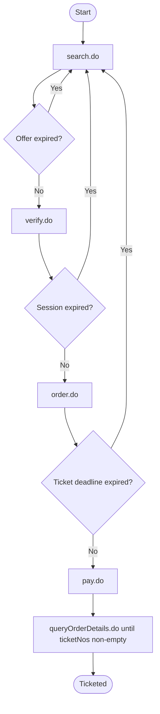
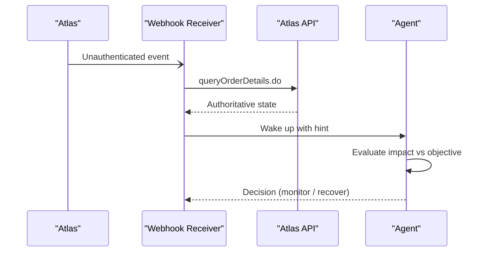
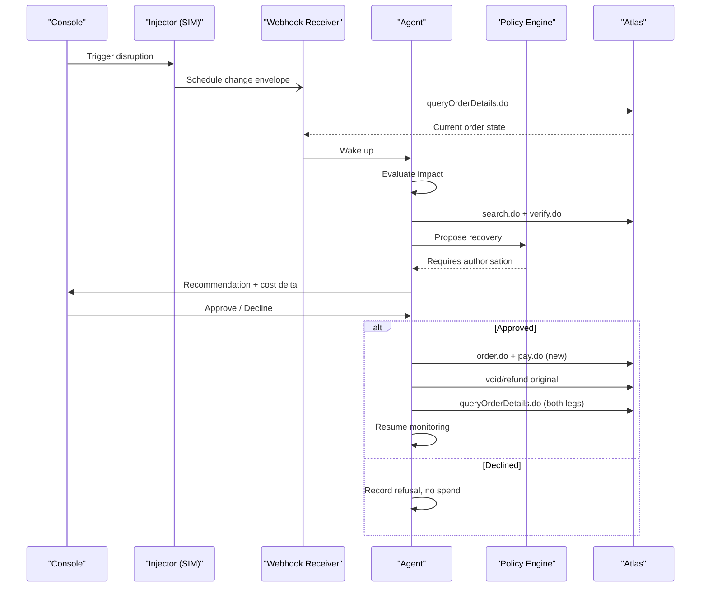
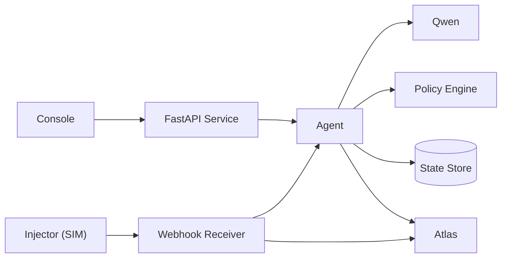

# Architecture Overview

<cite>
**Referenced Files in This Document**
- [architecture.md](file://.antabay/architecture.md)
- [constitution.md](file://.antabay/constitution.md)
- [specs.md](file://.antabay/specs.md)
- [atlas-capability-map.md](file://.antabay/atlas-capability-map.md)
- [demo-scenario.md](file://.antabay/demo-scenario.md)
- [plan.md](file://.antabay/plan.md)
</cite>

## Table of Contents
1. Introduction
2. Project Structure
3. Core Components
4. Architecture Overview
5. Detailed Component Analysis
6. Dependency Analysis
7. Performance Considerations
8. Troubleshooting Guide
9. Conclusion

## Introduction
Antabay is an agentic travel guardian that protects a traveller’s objective from goal to ticketing and beyond. It turns natural-language goals into durable objectives, reasons about real inventory, enforces deterministic authorisation, and monitors journeys for disruptions. The system is designed around four non-negotiable rules:
- Qwen reasons but does not decide authority.
- Journey state lives outside the agent.
- Webhooks are untrusted hints; Atlas responses are truth.
- Every travel fact shown to the traveller traces to an Atlas response.

The architecture separates UI, backend services, external integrations, and persistence so each concern can be developed, tested, scaled, and audited independently.

**Section sources**
- [architecture.md:19-86](file://.antabay/architecture.md#L19-L86)
- [constitution.md:24-104](file://.antabay/constitution.md#L24-L104)

## Project Structure
At a high level, the repository contains design and specification artifacts that define the system contract, behaviour, and delivery plan. These documents describe the intended runtime components and their interactions.



This structure keeps the verified external contract (Atlas), governing principles (Constitution), feature specifications, demo scenario, and execution plan as the single source of truth for implementation.

**Section sources**
- [specs.md:103-136](file://.antabay/specs.md#L103-L136)
- [plan.md:56-81](file://.antabay/plan.md#L56-L81)

## Core Components
Antabay’s runtime is composed of five primary areas:

- UI layer: React console with Vite serving a journey console and live trace stream.
- Backend services: FastAPI service hosting the Antabay Agent, Policy Engine, webhook receiver, and disruption injector.
- External integrations: Atlas API for flight search, verification, booking, payment, and order query; Qwen via Model Studio free tier for reasoning only.
- Data persistence: Journey state store for objectives, orders, clocks, audit trail, and authorisations.
- Observability: Structured trace and audit log for every call, decision, and approval.

These components interact through well-defined contracts and enforce the four architectural rules at every boundary.

**Section sources**
- [architecture.md:21-78](file://.antabay/architecture.md#L21-L78)
- [specs.md:798-830](file://.antabay/specs.md#L798-L830)

## Architecture Overview
The system orchestrates a traveller’s goal through search, scoring, verification, booking, payment, ticketing confirmation, and monitoring. Disruptions trigger recovery workflows that require human authorisation when money or irreversible actions are involved.

```mermaid
graph TB
T["Traveller"]
UI["Console<br/>React + Vite"]
AG["Agent<br/>ReAct loop"]
POL["Policy Engine<br/>Deterministic"]
RX["Webhook Receiver<br/>+ Reconciler"]
INJ["Disruption Injector<br/>SIMULATED"]
QW["Qwen<br/>Model Studio free tier"]
DB[("State Store")]
LOG["Trace + Audit Log"]
ATLAS["Atlas Sandbox"]
T --> UI
UI --> AG
AG < --> QW
AG --> POL
AG --> DB
AG --> LOG
AG --> ATLAS
RX --> ATLAS
RX --> AG
INJ -.-> RX
UI -.-> INJ
```

Key enforcement points:
- Reasoning vs authority: Qwen explains and scores; the policy engine decides whether an action requires authorisation.
- State durability: Every wake-up rehydrates from the state store; nothing required for correctness lives only in memory.
- Untrusted webhooks: Inbound events are treated as hints; Atlas order queries confirm reality.
- Fact provenance: All travel facts presented to the traveller trace to specific Atlas responses.

**Diagram sources**
- [architecture.md:21-78](file://.antabay/architecture.md#L21-L78)

**Section sources**
- [architecture.md:19-86](file://.antabay/architecture.md#L19-L86)
- [constitution.md:24-104](file://.antabay/constitution.md#L24-L104)

## Detailed Component Analysis

### UI Layer — Console and Trace
The console renders the structured objective, current journey state, expiry clocks, and a live event stream. It exposes an authorisation gate and a traveller-facing view derived from the same event stream. The interface holds no state of its own and displays what the backend streams.



Design requirements include legibility at video scale, permanent provenance footer, and three weighted moments: option rejection, objective violation, and authorisation gate.

**Section sources**
- [specs.md:798-830](file://.antabay/specs.md#L798-L830)
- [specs.md:171-231](file://.antabay/specs.md#L171-L231)

### Backend Services — FastAPI
The backend hosts:
- Antabay Agent: Own ReAct loop that Understand → Observe → Reason → Act → Verify → Adapt.
- Policy Engine: Deterministic rules evaluating cost delta, constraint violation, and reversibility to decide if human authorisation is required.
- Webhook Receiver: Accepts inbound events, reconciles against Atlas, and wakes the agent.
- Disruption Injector: Simulated schedule change for demonstration, labelled clearly as simulated.

All calls are logged; all decisions are recorded; all state changes are persisted.

**Section sources**
- [architecture.md:32-78](file://.antabay/architecture.md#L32-L78)
- [specs.md:437-531](file://.antabay/specs.md#L437-L531)

### External Integrations — Atlas API and Qwen LLM
- Atlas API: Verified endpoints include search, verify, order, pay, and order query. Offer windows are short and may arrive pre-aged; session windows replace offer windows after verification; ticketing deadline applies post-order. Payment success is not proof of ticketing; ticket numbers must be confirmed by order query.
- Qwen LLM: Used exclusively for reasoning (parsing objectives, scoring options, producing rationale). It never holds authority over decisions requiring human approval.



**Diagram sources**
- [atlas-capability-map.md:107-125](file://.antabay/atlas-capability-map.md#L107-L125)
- [atlas-capability-map.md:236-313](file://.antabay/atlas-capability-map.md#L236-L313)

**Section sources**
- [atlas-capability-map.md:25-125](file://.antabay/atlas-capability-map.md#L25-L125)
- [atlas-capability-map.md:236-313](file://.antabay/atlas-capability-map.md#L236-L313)
- [architecture.md:19-86](file://.antabay/architecture.md#L19-L86)

### Data Persistence — Journey State Store
The state store persists:
- Objective and hard vs soft constraints.
- Current journey state and held identifiers with issue and staleness times.
- Audit trail covering observations, decisions, external calls, and authorisations.
- Authorisation outcomes including refusals.

Every wake-up rehydrates from this store; nothing required for correctness lives only in process memory or model context.

**Section sources**
- [specs.md:437-531](file://.antabay/specs.md#L437-L531)
- [constitution.md:97-104](file://.antabay/constitution.md#L97-L104)

### Webhook Receiver and Reconciliation
Inbound webhooks are unauthenticated and must be treated as hints. On receiving an event, the receiver:
- Normalises fields whose type differs between surfaces.
- Queries Atlas to reconcile the claim.
- Wakes the agent to evaluate impact on the objective.



**Diagram sources**
- [atlas-capability-map.md:315-379](file://.antabay/atlas-capability-map.md#L315-L379)
- [architecture.md:152-208](file://.antabay/architecture.md#L152-L208)

**Section sources**
- [atlas-capability-map.md:315-379](file://.antabay/atlas-capability-map.md#L315-L379)
- [specs.md:437-531](file://.antabay/specs.md#L437-L531)

### Policy Engine — Deterministic Authority
The policy engine evaluates proposed actions without consulting the language model. It classifies actions as permitted autonomously or requiring human authorisation based on:
- Cost delta relative to current position.
- Constraint violations.
- Reversibility and irreversibility.
- Whether the action spends money, cancels/voids bookings, or commits to an itinerary.

Silence is refusal; authorisations apply to one specific action and expire if costs change before execution.

**Section sources**
- [specs.md:437-531](file://.antabay/specs.md#L437-L531)
- [constitution.md:62-77](file://.antabay/constitution.md#L62-L77)

### Disruption and Recovery Flow
When a disruption arrives:
- The receiver reconciles with Atlas and wakes the agent.
- The agent evaluates impact against the objective.
- If violated, it searches and verifies alternatives.
- It recommends one alternative with cost delta and objective impact.
- The policy engine determines if authorisation is required.
- Upon approval, the agent executes recovery and verifies both legs independently.



**Diagram sources**
- [architecture.md:152-208](file://.antabay/architecture.md#L152-L208)
- [atlas-capability-map.md:315-379](file://.antabay/atlas-capability-map.md#L315-L379)

**Section sources**
- [architecture.md:152-208](file://.antabay/architecture.md#L152-L208)
- [demo-scenario.md:81-118](file://.antabay/demo-scenario.md#L81-L118)

## Dependency Analysis
The system’s dependencies are intentionally constrained:
- UI depends on the backend event stream; it holds no state.
- Agent depends on Qwen for reasoning and on Atlas for authoritative data.
- Policy Engine is independent of the model and enforces deterministic rules.
- Webhook Receiver depends on Atlas for reconciliation.
- State Store is central; all components rehydrate from it.



**Diagram sources**
- [architecture.md:21-78](file://.antabay/architecture.md#L21-L78)

**Section sources**
- [architecture.md:21-78](file://.antabay/architecture.md#L21-L78)

## Performance Considerations
- Rate limits: Respect provider limits (e.g., search QPS, verify QPM). Honour retry-after instructions; do not retry-loop.
- Offer freshness: Offers have short, variable windows and may arrive pre-aged; always compute remaining time from current time.
- Call budget: Enforce per-journey budgets for rate-limited endpoints to prevent runaway loops.
- Verification cadence: Re-verify earlier than documented limits because inventory and prices can change first.
- Concurrency: Keep the UI stateless; render from streaming events to reduce backend load.

**Section sources**
- [atlas-capability-map.md:107-125](file://.antabay/atlas-capability-map.md#L107-L125)
- [specs.md:565-646](file://.antabay/specs.md#L565-L646)

## Troubleshooting Guide
Common issues and how the system handles them:
- Duplicate booking: Treat as reconcilable; read returned existing order reference and resume from its real state.
- Auth failure: Credentials or account problem; do not retry.
- Uncertain outcome: Reconcile against Atlas before any further action; never repeat ambiguous calls.
- Stale identifiers: Re-verify before acting; track age in state and display remaining time.
- Price increase: Prior approval void; return to human with new number.
- Webhook misinterpretation: Do not gate handling on webhook status; confirm via order query.

Operational discipline includes graceful degradation, stated uncertainty, and append-only audit trails.

**Section sources**
- [atlas-capability-map.md:400-415](file://.antabay/atlas-capability-map.md#L400-L415)
- [constitution.md:44-104](file://.antabay/constitution.md#L44-L104)

## Conclusion
Antabay’s architecture enforces strict boundaries between reasoning and authority, ensures durability of journey state, treats webhooks as untrusted hints, and anchors every visible fact to Atlas. The separation of UI, backend services, external integrations, and persistence enables clear ownership, testability, and scalability. With deterministic policy, verified contracts, and robust reconciliation, the system provides a safe, auditable path from goal to ticketed and beyond, ready for deployment and demonstration.